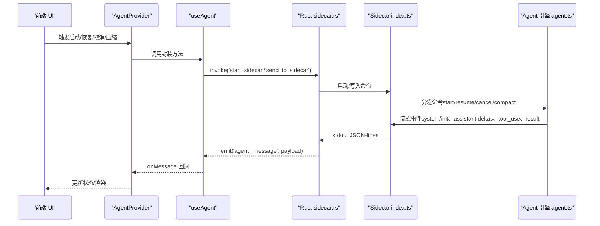
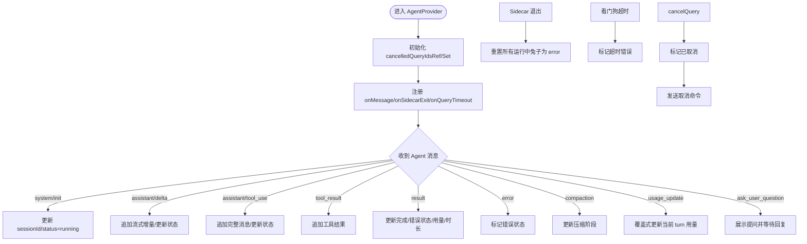
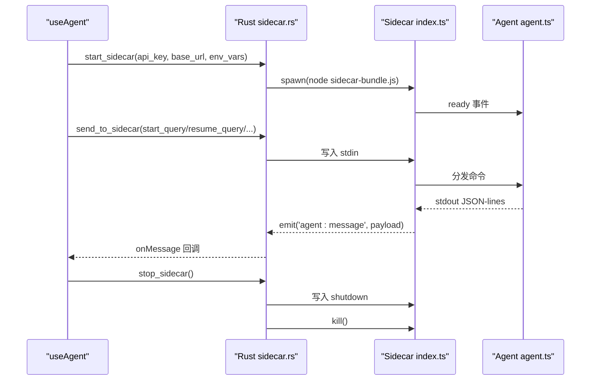
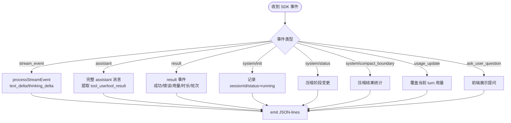
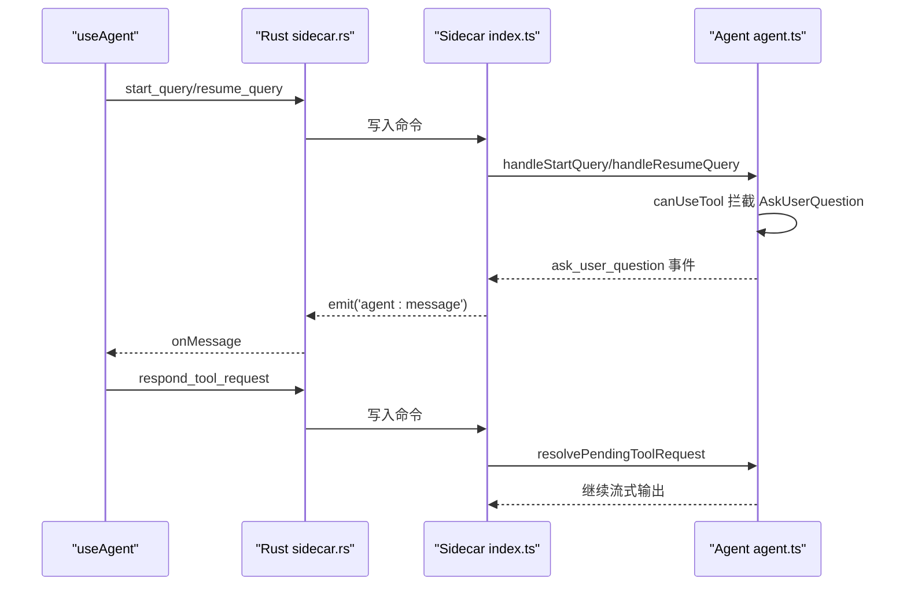
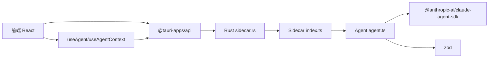

# AI 代理系统

<cite>
**本文引用的文件**
- [sidecar/src/index.ts](file://sidecar/src/index.ts)
- [sidecar/src/agent.ts](file://sidecar/src/agent.ts)
- [sidecar/src/protocol.ts](file://sidecar/src/protocol.ts)
- [src-tauri/src/sidecar.rs](file://src-tauri/src/sidecar.rs)
- [src/hooks/useAgent.ts](file://src/hooks/useAgent.ts)
- [src/hooks/useAgentContext.ts](file://src/hooks/useAgentContext.ts)
- [src/types/index.ts](file://src/types/index.ts)
- [src/components/agent/AgentChat.tsx](file://src/components/agent/AgentChat.tsx)
- [src/components/agent/AgentMessage.tsx](file://src/components/agent/AgentMessage.tsx)
- [src/constants/providers.ts](file://src/constants/providers.ts)
- [package.json](file://package.json)
- [sidecar/package.json](file://sidecar/package.json)
</cite>

## 目录
1. [简介](#简介)
2. [项目结构](#项目结构)
3. [核心组件](#核心组件)
4. [架构总览](#架构总览)
5. [详细组件分析](#详细组件分析)
6. [依赖关系分析](#依赖关系分析)
7. [性能考量](#性能考量)
8. [故障排查指南](#故障排查指南)
9. [结论](#结论)
10. [附录](#附录)

## 简介
本文件面向 RabbitCoding AI 代理系统，系统性阐述 AgentProvider 的设计与实现、代理生命周期管理、流式响应处理机制、AI 查询流程、工具调用机制、会话管理策略，以及与 Sidecar 进程的通信协议、消息传递格式与错误处理机制。文档同时提供可操作的使用指引、配置选项说明、性能优化建议、调试方法与常见问题解决方案。

## 项目结构
RabbitCoding 采用前端 React/Tauri + Rust 后端 + Node.js Sidecar 的三层架构：
- 前端（React + Tauri）负责 UI、状态管理与与 Rust 后端交互。
- Rust 后端（Tauri Commands/Events）负责 Sidecar 进程生命周期管理、stdin/stdout 读写与事件转发。
- Sidecar（Node.js）封装 Claude Agent SDK，将异步流式事件转换为 JSON-lines 协议消息。

```mermaid
graph TB
subgraph "前端"
UI["React 组件<br/>AgentChat/AgentMessage"]
Hooks["React Hooks<br/>useAgent/useAgentContext"]
Types["类型定义<br/>src/types/index.ts"]
end
subgraph "Tauri 后端"
RS["Rust 模块<br/>src-tauri/src/sidecar.rs"]
end
subgraph "Sidecar"
IDX["入口<br/>sidecar/src/index.ts"]
AGENT["代理引擎<br/>sidecar/src/agent.ts"]
PROTO["协议定义<br/>sidecar/src/protocol.ts"]
end
UI --> Hooks
Hooks --> RS
RS --> IDX
IDX --> AGENT
AGENT --> PROTO
RS <- --> IDX
Hooks <- --> Types
```

图表来源
- [src-tauri/src/sidecar.rs:59-214](file://src-tauri/src/sidecar.rs#L59-L214)
- [sidecar/src/index.ts:96-128](file://sidecar/src/index.ts#L96-L128)
- [sidecar/src/agent.ts:241-465](file://sidecar/src/agent.ts#L241-L465)
- [sidecar/src/protocol.ts:13-78](file://sidecar/src/protocol.ts#L13-L78)
- [src/hooks/useAgent.ts:106-126](file://src/hooks/useAgent.ts#L106-L126)
- [src/types/index.ts:65-85](file://src/types/index.ts#L65-L85)

章节来源
- [package.json:14-13](file://package.json#L14-L13)
- [sidecar/package.json:6-11](file://sidecar/package.json#L6-L11)

## 核心组件
- AgentProvider（上下文）：将 useAgent 的监听器与回调提升至应用层级，确保页面切换时不丢失流式消息，统一处理查询生命周期与状态收敛。
- useAgent Hook：封装与 Sidecar 的通信，负责启动/停止 Sidecar、发送命令、接收事件、看门狗超时控制与错误处理。
- Rust Sidecar 管理：通过 Tauri Commands 启动/停止 Sidecar，读取 stdout/stderr，转发事件到前端。
- Sidecar 入口与代理引擎：解析 stdin 命令，调用 Claude Agent SDK，将 SDK 事件转为 JSON-lines 消息。
- 协议定义：统一前后端消息格式，涵盖系统初始化、流式增量、工具调用、最终结果、压缩状态与 AskUserQuestion 等。

章节来源
- [src/hooks/useAgentContext.ts:88-193](file://src/hooks/useAgentContext.ts#L88-L193)
- [src/hooks/useAgent.ts:53-333](file://src/hooks/useAgent.ts#L53-L333)
- [src-tauri/src/sidecar.rs:59-214](file://src-tauri/src/sidecar.rs#L59-L214)
- [sidecar/src/index.ts:96-128](file://sidecar/src/index.ts#L96-L128)
- [sidecar/src/agent.ts:241-465](file://sidecar/src/agent.ts#L241-L465)
- [sidecar/src/protocol.ts:90-107](file://sidecar/src/protocol.ts#L90-L107)

## 架构总览
系统通过 Tauri Commands 与 Sidecar 进行双向通信，采用 JSON-lines 协议在 stdin/stdout 间传递消息。前端通过 useAgent 与 AgentProvider 统一管理查询生命周期，Rust 层负责进程生命周期与事件转发。



图表来源
- [src/hooks/useAgent.ts:262-320](file://src/hooks/useAgent.ts#L262-L320)
- [src-tauri/src/sidecar.rs:175-214](file://src-tauri/src/sidecar.rs#L175-L214)
- [sidecar/src/index.ts:37-91](file://sidecar/src/index.ts#L37-L91)
- [sidecar/src/agent.ts:241-465](file://sidecar/src/agent.ts#L241-L465)

## 详细组件分析

### AgentProvider 设计与实现
- 目标：将 useAgent 的事件监听与回调提升到应用层级，避免页面切换导致监听器丢失，保障流式消息连续性。
- 关键点：
  - onMessage：根据消息类型更新工作区与兔子（Rabbit）状态，包括流式增量、工具结果、压缩状态、用量更新等。
  - onSidecarExit：进程退出时统一收敛为 error，避免 UI 永远 loading。
  - onQueryTimeout：看门狗超时，标记为 error。
  - cancelQuery：先标记再发送取消命令，延迟清理集合，防止内存泄漏。
  - startQuery/resumeQuery：失败时回滚状态为 error。
  - respondToQuestion/cancelQuestion：更新前端状态后向 Sidecar 发送回复或取消。



图表来源
- [src/hooks/useAgentContext.ts:93-193](file://src/hooks/useAgentContext.ts#L93-L193)
- [src/hooks/useAgentContext.ts:195-201](file://src/hooks/useAgentContext.ts#L195-L201)
- [src/hooks/useAgentContext.ts:214-241](file://src/hooks/useAgentContext.ts#L214-L241)
- [src/hooks/useAgentContext.ts:243-269](file://src/hooks/useAgentContext.ts#L243-L269)

章节来源
- [src/hooks/useAgentContext.ts:88-285](file://src/hooks/useAgentContext.ts#L88-L285)

### 代理生命周期管理
- 启动/恢复/取消/压缩：
  - startQuery/resumeQuery：构造命令并通过 Tauri invoke 发送到 Sidecar。
  - cancelQuery：标记后发送取消命令，清理 pending tool requests。
  - compactQuery：发送 /compact 触发 SDK 压缩。
- Sidecar 状态：
  - start_sidecar：注入 API Key/Base URL/自定义环境变量，重定向 Claude 配置根目录，启动 stdout/stderr 线程。
  - stop_sidecar：发送 shutdown 命令并强制杀死进程。
  - get_sidecar_status：查询运行状态。



图表来源
- [src/hooks/useAgent.ts:106-126](file://src/hooks/useAgent.ts#L106-L126)
- [src-tauri/src/sidecar.rs:59-214](file://src-tauri/src/sidecar.rs#L59-L214)
- [sidecar/src/index.ts:96-128](file://sidecar/src/index.ts#L96-L128)

章节来源
- [src/hooks/useAgent.ts:155-243](file://src/hooks/useAgent.ts#L155-L243)
- [src-tauri/src/sidecar.rs:216-279](file://src-tauri/src/sidecar.rs#L216-L279)

### 流式响应处理机制
- 增量事件：
  - assistant/text_delta/thinking_delta：前端逐字节拼接，支持自动滚动与粘性布局。
  - thinking_done：补充思考时长，用于统计与 UI 提示。
  - text_done：流式结束信号，便于前端做收尾处理。
- 工具调用：
  - assistant/tool_use：携带工具名与输入，前端渲染工具调用块。
  - tool_result：携带输出与错误标志，与对应 tool_use 关联展示。
- 用量与压缩：
  - usage_update：覆盖式更新当前 turn 的上下文占用。
  - compaction/compaction_result：压缩阶段与结果消息，前端展示压缩指示与统计。



图表来源
- [sidecar/src/agent.ts:146-199](file://sidecar/src/agent.ts#L146-L199)
- [sidecar/src/agent.ts:205-236](file://sidecar/src/agent.ts#L205-L236)
- [sidecar/src/agent.ts:358-389](file://sidecar/src/agent.ts#L358-L389)
- [sidecar/src/agent.ts:413-435](file://sidecar/src/agent.ts#L413-L435)
- [sidecar/src/agent.ts:333-356](file://sidecar/src/agent.ts#L333-L356)
- [sidecar/src/agent.ts:424-433](file://sidecar/src/agent.ts#L424-L433)
- [sidecar/src/agent.ts:334-342](file://sidecar/src/agent.ts#L334-L342)
- [sidecar/src/agent.ts:491-497](file://sidecar/src/agent.ts#L491-L497)

章节来源
- [src/components/agent/AgentChat.tsx:38-85](file://src/components/agent/AgentChat.tsx#L38-L85)
- [src/components/agent/AgentMessage.tsx:43-194](file://src/components/agent/AgentMessage.tsx#L43-L194)
- [src/types/index.ts:65-85](file://src/types/index.ts#L65-L85)

### AI 查询流程与工具调用机制
- 查询流程：
  - 构造 StartQuery/ResumeQuery 命令，包含 model、allowedTools、permissionMode、maxTurns、maxBudgetUsd 等选项。
  - Sidecar 通过 Claude Agent SDK 执行查询，按 turn 输出增量与完整消息。
  - 支持 AskUserQuestion：前端展示问题，用户回答后通过 respond_tool_request 回复。
- 工具调用：
  - canUseTool 钩子：对 AskUserQuestion 进行拦截并等待前端回复；对 WriteSpec（Spec 查询）进行特殊处理。
  - 工具结果：tool_result 与 tool_use 关联，前端统一渲染。



图表来源
- [src/hooks/useAgent.ts:155-205](file://src/hooks/useAgent.ts#L155-L205)
- [src/hooks/useAgent.ts:246-256](file://src/hooks/useAgent.ts#L246-L256)
- [sidecar/src/index.ts:37-91](file://sidecar/src/index.ts#L37-L91)
- [sidecar/src/agent.ts:260-289](file://sidecar/src/agent.ts#L260-L289)
- [sidecar/src/agent.ts:502-543](file://sidecar/src/agent.ts#L502-L543)
- [sidecar/src/agent.ts:548-573](file://sidecar/src/agent.ts#L548-L573)

章节来源
- [sidecar/src/agent.ts:241-465](file://sidecar/src/agent.ts#L241-L465)
- [sidecar/src/protocol.ts:224-244](file://sidecar/src/protocol.ts#L224-L244)

### 会话管理策略
- 会话恢复：通过 sessionId 恢复历史上下文，继续对话。
- 会话压缩：发送 /compact 触发 SDK 压缩，前端展示压缩阶段与结果统计。
- 用量与预算：maxBudgetUsd 限制消费，usage_update 提供实时上下文占用。
- 思考态与超时：对纯静默思考放宽超时阈值，避免误判；看门狗统一兜底。

章节来源
- [src/hooks/useAgent.ts:66-101](file://src/hooks/useAgent.ts#L66-L101)
- [sidecar/src/agent.ts:491-497](file://sidecar/src/agent.ts#L491-L497)
- [sidecar/src/agent.ts:334-356](file://sidecar/src/agent.ts#L334-L356)

### 与 Sidecar 的通信协议与消息格式
- 前端 → Sidecar（stdin）：start_query/resume_query/cancel_query/compact_query/respond_tool_request/shutdown。
- Sidecar → 前端（stdout）：system/init、assistant/text/thinking/tool_use/tool_result/result/error/compaction/compaction_result/usage_update/ask_user_question/spec_written。
- Rust 侧：读取 stdout 行并以 Tauri 事件转发，stderr 作为日志输出。

章节来源
- [sidecar/src/protocol.ts:13-78](file://sidecar/src/protocol.ts#L13-L78)
- [sidecar/src/protocol.ts:90-107](file://sidecar/src/protocol.ts#L90-L107)
- [src-tauri/src/sidecar.rs:175-208](file://src-tauri/src/sidecar.rs#L175-L208)

### 代理配置选项与最佳实践
- 模型与厂商：通过 PROVIDER_PRESETS 快速填充 baseUrl/modelId/apiKeyEnvVar，支持 glm/minimax/aliyun/kimi/deepseek/custom。
- 查询选项：model、allowedTools、permissionMode、maxTurns、maxBudgetUsd。
- 安全隔离：Rust 层重定向 CLAUDE_CONFIG_DIR，清空 ANTHROPIC_* 环境变量，确保 BYOK 安全可控。
- 最佳实践：
  - 严格限制 allowedTools，避免高风险工具。
  - 设置 maxBudgetUsd 与 maxTurns，防止无限消耗。
  - 使用 permissionMode.plan 与 WriteSpec 工具配合，规范 Spec 产出流程。
  - 前端对流式增量进行节流与自动滚动，提升体验。

章节来源
- [src/constants/providers.ts:14-57](file://src/constants/providers.ts#L14-L57)
- [src-tauri/src/sidecar.rs:96-149](file://src-tauri/src/sidecar.rs#L96-L149)
- [sidecar/src/agent.ts:255-303](file://sidecar/src/agent.ts#L255-L303)

## 依赖关系分析
- 前端依赖：
  - @tauri-apps/api：与 Rust 后端通信。
  - React Hooks：useAgent/useAgentContext 管理状态与生命周期。
- Rust 依赖：
  - serde：序列化/反序列化消息。
  - tauri：命令与事件框架。
- Sidecar 依赖：
  - @anthropic-ai/claude-agent-sdk：Agent SDK。
  - zod：工具参数校验。



图表来源
- [package.json:14-35](file://package.json#L14-L35)
- [sidecar/package.json:12-14](file://sidecar/package.json#L12-L14)
- [src-tauri/src/sidecar.rs:1-4](file://src-tauri/src/sidecar.rs#L1-L4)

章节来源
- [package.json:14-35](file://package.json#L14-L35)
- [sidecar/package.json:12-14](file://sidecar/package.json#L12-L14)

## 性能考量
- 流式渲染：前端按增量拼接，减少重排；仅在必要时滚动到底部。
- 用量统计：usage_update 提供当前 turn 上下文占用，辅助预算控制。
- 超时与看门狗：区分正常态与思考态阈值，避免误判；进程退出统一收敛，防止 UI 卡死。
- 进程隔离：Rust 层重定向配置根目录，避免全局资源污染，提高稳定性。

## 故障排查指南
- Sidecar 无法启动：
  - 检查 start_sidecar 返回的错误信息，确认 API Key/Base URL/环境变量是否正确。
  - 查看 stderr 日志定位具体问题。
- 查询无响应：
  - 观察看门狗超时与 sidecar 退出事件；确认网络与代理配置。
  - 检查 allowedTools 与 permissionMode 是否拦截了必要工具。
- AskUserQuestion 无响应：
  - 确认前端已展示 ask_user_question 并正确发送 respond_tool_request。
  - 检查 pending tool requests 是否超时或被取消。
- 会话压缩失败：
  - 查看 compaction/failed 与 error 字段，确认 SDK 返回的错误原因。

章节来源
- [src/hooks/useAgent.ts:290-295](file://src/hooks/useAgent.ts#L290-L295)
- [src/hooks/useAgent.ts:83-95](file://src/hooks/useAgent.ts#L83-L95)
- [sidecar/src/agent.ts:517-542](file://sidecar/src/agent.ts#L517-L542)
- [sidecar/src/agent.ts:334-342](file://sidecar/src/agent.ts#L334-L342)

## 结论
RabbitCoding 的 AI 代理系统通过清晰的分层与严格的协议约束，实现了稳定、可观测、可扩展的代理能力。AgentProvider 将事件监听与生命周期管理抽象到应用层，结合 Rust 与 Sidecar 的强隔离与流式处理，为复杂 AI 工作流提供了可靠的基础设施。建议在生产环境中严格配置权限与预算，并充分利用压缩与用量监控能力，以获得更好的成本与性能表现。

## 附录

### 使用示例（代码片段路径）
- 启动 Sidecar
  - [src/hooks/useAgent.ts:106-126](file://src/hooks/useAgent.ts#L106-L126)
- 发送启动查询命令
  - [src/hooks/useAgent.ts:156-177](file://src/hooks/useAgent.ts#L156-L177)
- 发送恢复查询命令
  - [src/hooks/useAgent.ts:182-205](file://src/hooks/useAgent.ts#L182-L205)
- 取消查询
  - [src/hooks/useAgent.ts:210-216](file://src/hooks/useAgent.ts#L210-L216)
- 手动触发会话压缩
  - [src/hooks/useAgent.ts:222-243](file://src/hooks/useAgent.ts#L222-L243)
- 响应 AskUserQuestion
  - [src/hooks/useAgent.ts:246-256](file://src/hooks/useAgent.ts#L246-L256)
- AgentProvider 包装与状态更新
  - [src/hooks/useAgentContext.ts:93-193](file://src/hooks/useAgentContext.ts#L93-L193)
- 协议消息类型定义
  - [sidecar/src/protocol.ts:90-107](file://sidecar/src/protocol.ts#L90-L107)