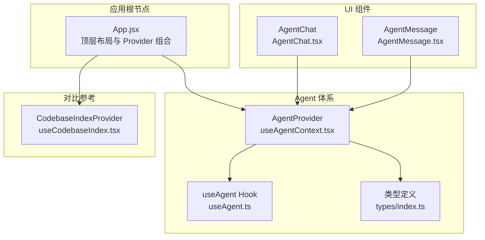
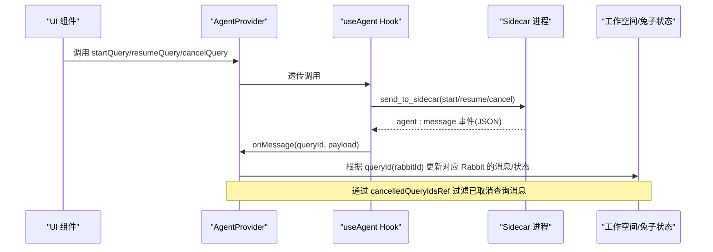
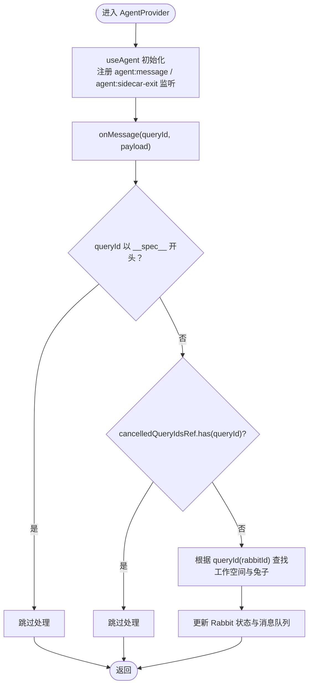
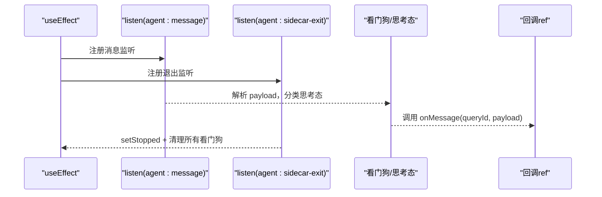
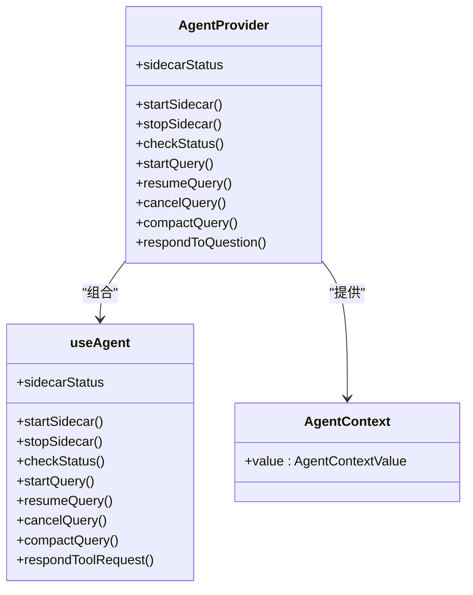
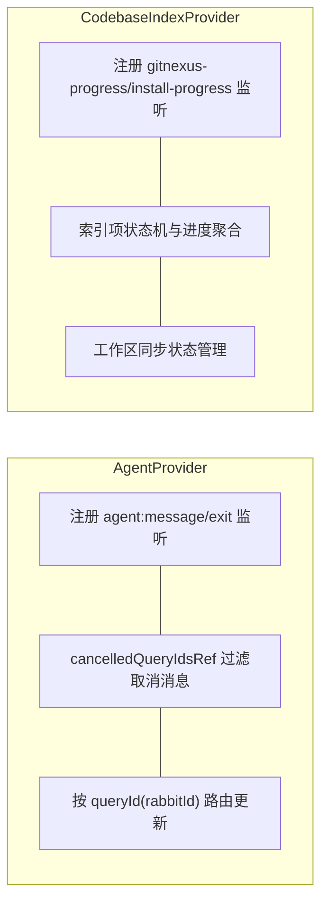
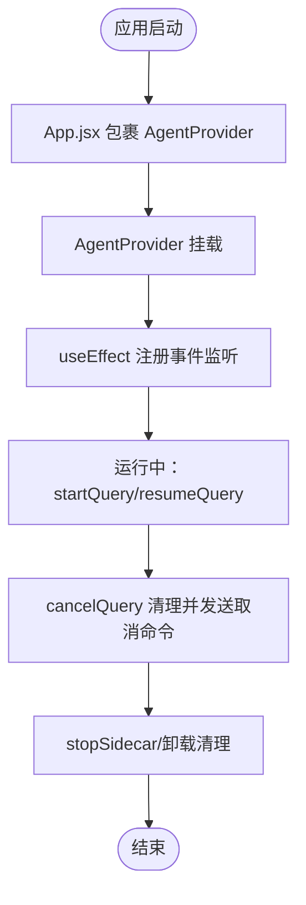
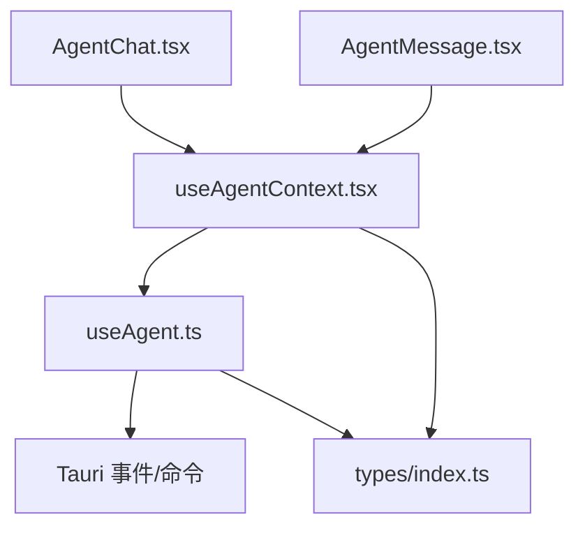

# AgentProvider 设计与实现

<cite>
**本文引用的文件**
- [src/hooks/useAgentContext.tsx](file://src/hooks/useAgentContext.tsx)
- [src/hooks/useAgent.ts](file://src/hooks/useAgent.ts)
- [src/hooks/useCodebaseIndex.tsx](file://src/hooks/useCodebaseIndex.tsx)
- [src/App.tsx](file://src/App.tsx)
- [src/types/index.ts](file://src/types/index.ts)
- [src/components/agent/AgentChat.tsx](file://src/components/agent/AgentChat.tsx)
- [src/components/agent/AgentMessage.tsx](file://src/components/agent/AgentMessage.tsx)
</cite>

## 目录
1. [简介](#简介)
2. [项目结构](#项目结构)
3. [核心组件](#核心组件)
4. [架构总览](#架构总览)
5. [详细组件分析](#详细组件分析)
6. [依赖关系分析](#依赖关系分析)
7. [性能考量](#性能考量)
8. [故障排查指南](#故障排查指南)
9. [结论](#结论)
10. [附录](#附录)

## 简介
本文围绕 AgentProvider 的设计与实现展开，系统阐述其如何将 useAgent 的监听器与回调提升至应用层级，确保页面切换或组件卸载时不丢失流式消息；解释 Context 上下文管理机制与状态提升策略；对比参考 CodebaseIndexProvider 的模式；给出初始化流程、生命周期管理、错误处理机制、cancelledQueryIdsRef 的作用与内存泄漏防护策略，并提供性能优化建议与最佳实践。

## 项目结构
AgentProvider 位于前端 React 应用中，作为顶层 Provider 包裹应用，向上游暴露统一的 Agent 能力，下游各业务组件通过 useAgentContext 消费。其与 useAgent Hook 协作，后者负责与 Sidecar 通信、事件监听、看门狗与思考态处理等。

图表来源
- [src/App.tsx:29-98](file://src/App.tsx#L29-L98)
- [src/hooks/useAgentContext.tsx:88-285](file://src/hooks/useAgentContext.tsx#L88-L285)
- [src/hooks/useAgent.ts:53-333](file://src/hooks/useAgent.ts#L53-L333)
- [src/hooks/useCodebaseIndex.tsx:79-500](file://src/hooks/useCodebaseIndex.tsx#L79-L500)
- [src/components/agent/AgentChat.tsx:87-214](file://src/components/agent/AgentChat.tsx#L87-L214)
- [src/components/agent/AgentMessage.tsx:43-197](file://src/components/agent/AgentMessage.tsx#L43-L197)

章节来源
- [src/App.tsx:29-98](file://src/App.tsx#L29-L98)
- [src/hooks/useAgentContext.tsx:88-285](file://src/hooks/useAgentContext.tsx#L88-L285)
- [src/hooks/useAgent.ts:53-333](file://src/hooks/useAgent.ts#L53-L333)
- [src/hooks/useCodebaseIndex.tsx:79-500](file://src/hooks/useCodebaseIndex.tsx#L79-L500)
- [src/components/agent/AgentChat.tsx:87-214](file://src/components/agent/AgentChat.tsx#L87-L214)
- [src/components/agent/AgentMessage.tsx:43-197](file://src/components/agent/AgentMessage.tsx#L43-L197)

## 核心组件
- AgentProvider：在应用根部集中管理 Agent 的侧车进程、查询生命周期、消息路由与过滤，向上提供统一的 useAgentContext 能力。
- useAgent Hook：封装与 Sidecar 的通信、Tauri 事件监听、查询看门狗、思考态识别与超时处理、取消查询与恢复会话等。
- useAgentContext：消费 Hook，向下游组件暴露 startSidecar、startQuery、cancelQuery、respondToQuestion 等方法与 sidecarStatus。
- 类型系统：统一 Agent 消息、事件、查询选项与 Sidecar 状态等类型定义，保障跨模块一致性。

章节来源
- [src/hooks/useAgentContext.tsx:88-285](file://src/hooks/useAgentContext.tsx#L88-L285)
- [src/hooks/useAgent.ts:53-333](file://src/hooks/useAgent.ts#L53-L333)
- [src/types/index.ts:65-278](file://src/types/index.ts#L65-L278)

## 架构总览
AgentProvider 的核心思想是“状态上移、事件上收”，将 useAgent 的事件监听与回调提升到应用层级，避免因页面切换或组件卸载导致流式消息丢失。同时通过 cancelledQueryIdsRef 过滤已取消查询的后续消息，结合看门狗与思考态机制，确保消息处理的正确性与稳定性。

图表来源
- [src/hooks/useAgentContext.tsx:92-140](file://src/hooks/useAgentContext.tsx#L92-L140)
- [src/hooks/useAgent.ts:262-320](file://src/hooks/useAgent.ts#L262-L320)
- [src/hooks/useAgent.ts:156-205](file://src/hooks/useAgent.ts#L156-L205)
- [src/hooks/useAgent.ts:210-216](file://src/hooks/useAgent.ts#L210-L216)

## 详细组件分析

### AgentProvider 架构与职责
- 状态提升：将 useAgent 的 sidecarStatus、startSidecar、stopSidecar、checkStatus、startQuery、resumeQuery、cancelQuery、compactQuery、respondToQuestion 等能力提升到 Provider 层，供全应用共享。
- 事件路由：在 onMessage 中根据 queryId（即 rabbitId）定位工作空间与兔子，更新对应 Rabbit 的 messages、status、cost、duration 等。
- 过滤策略：通过 cancelledQueryIdsRef 过滤已取消查询的消息，避免 UI 层收到陈旧消息。
- 特殊消息处理：跳过以 __spec__ 前缀的查询消息，避免干扰常规对话流。
- 生命周期：在 Provider 内部持有 useAgent，确保事件监听与定时器在应用范围内稳定存在。

图表来源
- [src/hooks/useAgentContext.tsx:92-140](file://src/hooks/useAgentContext.tsx#L92-L140)
- [src/hooks/useAgentContext.tsx:141-270](file://src/hooks/useAgentContext.tsx#L141-L270)

章节来源
- [src/hooks/useAgentContext.tsx:88-285](file://src/hooks/useAgentContext.tsx#L88-L285)

### useAgent Hook：监听器与回调提升机制
- 事件监听：在 useEffect 中注册 agent:message 与 agent:sidecar-exit 事件监听，使用 unlisten 函数集合在清理阶段统一注销，避免泄漏。
- 回调提升：将 options.onMessage/onSidecarExit/onQueryTimeout 放入 ref，避免因外部 options 引用变化导致重复注册监听。
- 看门狗：为每条 queryId 维护独立计时器，收到任意消息则重置；思考态使用更宽松阈值，避免长思考被误判超时。
- 思考态识别：通过 classifyThinkingState 判断进入/退出思考态，动态调整超时阈值。
- 取消查询：清理看门狗与思考态标记，发送 cancel_query 命令，防止后续消息影响 UI。

图表来源
- [src/hooks/useAgent.ts:262-320](file://src/hooks/useAgent.ts#L262-L320)
- [src/hooks/useAgent.ts:66-101](file://src/hooks/useAgent.ts#L66-L101)
- [src/hooks/useAgent.ts:23-37](file://src/hooks/useAgent.ts#L23-L37)

章节来源
- [src/hooks/useAgent.ts:53-333](file://src/hooks/useAgent.ts#L53-L333)

### Context 上下文管理与状态提升策略
- 上提策略：将 useAgent 的状态与方法通过 AgentContext.Provider 暴露，下游组件通过 useAgentContext 获取，避免在子树中重复初始化监听。
- 状态一致性：Provider 内部直接持有 useAgent 实例，确保 sidecarStatus、startSidecar、stopSidecar、checkStatus 等方法与状态始终一致。
- UI 渲染：AgentChat 与 AgentMessage 仅消费 Rabbit 的 messages 与状态，无需关心底层事件监听细节，降低耦合。

图表来源
- [src/hooks/useAgentContext.tsx:271-282](file://src/hooks/useAgentContext.tsx#L271-L282)
- [src/hooks/useAgent.ts:322-332](file://src/hooks/useAgent.ts#L322-L332)

章节来源
- [src/hooks/useAgentContext.tsx:88-285](file://src/hooks/useAgentContext.tsx#L88-L285)

### 与 CodebaseIndexProvider 的对比与借鉴
- 相同点
  - 都在应用根部集中初始化与维护状态，避免子树重复初始化。
  - 都使用 ref 缓存外部可变值，减少闭包过期带来的副作用。
  - 都在 useEffect 中注册事件监听，并在清理阶段统一注销，防止泄漏。
- 不同点
  - AgentProvider 更关注“事件上收”与“消息路由”，通过 cancelledQueryIdsRef 过滤取消消息；CodebaseIndexProvider 更关注“索引状态机”与“进度事件聚合”。
  - AgentProvider 的 onMessage 会根据 queryId(rabbitId) 定位工作空间并更新对应 Rabbit；CodebaseIndexProvider 的事件处理集中在索引项与同步状态的映射。

图表来源
- [src/hooks/useAgentContext.tsx:92-140](file://src/hooks/useAgentContext.tsx#L92-L140)
- [src/hooks/useCodebaseIndex.tsx:197-275](file://src/hooks/useCodebaseIndex.tsx#L197-L275)

章节来源
- [src/hooks/useAgentContext.tsx:88-285](file://src/hooks/useAgentContext.tsx#L88-L285)
- [src/hooks/useCodebaseIndex.tsx:79-500](file://src/hooks/useCodebaseIndex.tsx#L79-L500)

### 初始化过程与生命周期管理
- 初始化：App.jsx 中将 AgentProvider 包裹在 CodebaseIndexProvider 与 AuthProvider 之间，确保 Agent 能力在应用启动时即可使用。
- 生命周期：
  - 挂载：useEffect 注册事件监听；startSidecar/stopSidecar/checkStatus 控制进程状态。
  - 运行：startQuery/resumeQuery 发起查询，看门狗与思考态机制保障消息完整性。
  - 取消：cancelQuery 清理看门狗与思考态标记，发送取消命令。
  - 卸载：清理所有 unlisten 与看门狗，防止内存泄漏。

图表来源
- [src/App.tsx:66-92](file://src/App.tsx#L66-L92)
- [src/hooks/useAgent.ts:262-320](file://src/hooks/useAgent.ts#L262-L320)
- [src/hooks/useAgent.ts:131-137](file://src/hooks/useAgent.ts#L131-L137)

章节来源
- [src/App.tsx:29-98](file://src/App.tsx#L29-L98)
- [src/hooks/useAgent.ts:53-333](file://src/hooks/useAgent.ts#L53-L333)

### 错误处理机制
- Sidecar 退出：监听 agent:sidecar-exit，设置 stopped 状态并清理所有看门狗，避免后续计时器泄漏。
- 消息解析：agent:message 监听中对 payload JSON 解析进行 try/catch，避免异常中断。
- 查询超时：看门狗在阈值时间内无消息触发 onQueryTimeout，支持思考态放宽阈值。
- 取消查询：清理看门狗与思考态标记，避免误触发超时。

章节来源
- [src/hooks/useAgent.ts:262-320](file://src/hooks/useAgent.ts#L262-L320)
- [src/hooks/useAgent.ts:66-101](file://src/hooks/useAgent.ts#L66-L101)
- [src/hooks/useAgent.ts:210-216](file://src/hooks/useAgent.ts#L210-L216)

### cancelledQueryIdsRef 的作用机制与内存泄漏防护
- 作用机制：记录已取消的 queryId，onMessage 中若命中则直接跳过，避免 UI 层收到已取消查询的后续消息。
- 内存泄漏防护：
  - useEffect 清理：卸载时清理所有 unlisten 与看门狗。
  - 严格模式竞态：通过 cancelled 标志与清理函数数组，避免 StrictMode 下异步竞态导致的监听泄漏。
  - 退出清理：agent:sidecar-exit 事件中统一清理所有看门狗，确保进程退出后无残留计时器。

章节来源
- [src/hooks/useAgentContext.tsx:89-90](file://src/hooks/useAgentContext.tsx#L89-L90)
- [src/hooks/useAgentContext.tsx:97-99](file://src/hooks/useAgentContext.tsx#L97-L99)
- [src/hooks/useAgent.ts:262-320](file://src/hooks/useAgent.ts#L262-L320)
- [src/hooks/useAgent.ts:290-296](file://src/hooks/useAgent.ts#L290-L296)

### 代码示例（路径指引）
- Provider 初始化与事件路由
  - [src/hooks/useAgentContext.tsx:92-140](file://src/hooks/useAgentContext.tsx#L92-L140)
  - [src/hooks/useAgentContext.tsx:141-270](file://src/hooks/useAgentContext.tsx#L141-L270)
- 监听器与回调提升
  - [src/hooks/useAgent.ts:58-64](file://src/hooks/useAgent.ts#L58-L64)
  - [src/hooks/useAgent.ts:262-320](file://src/hooks/useAgent.ts#L262-L320)
- 看门狗与思考态
  - [src/hooks/useAgent.ts:66-101](file://src/hooks/useAgent.ts#L66-L101)
  - [src/hooks/useAgent.ts:23-37](file://src/hooks/useAgent.ts#L23-L37)
- 取消查询
  - [src/hooks/useAgent.ts:210-216](file://src/hooks/useAgent.ts#L210-L216)
- UI 消息渲染
  - [src/components/agent/AgentChat.tsx:87-214](file://src/components/agent/AgentChat.tsx#L87-L214)
  - [src/components/agent/AgentMessage.tsx:43-197](file://src/components/agent/AgentMessage.tsx#L43-L197)

## 依赖关系分析
- 组件耦合
  - AgentProvider 依赖 useAgent 与类型系统；下游组件仅依赖 useAgentContext。
  - AgentChat/AgentMessage 依赖 Rabbit 类型与消息渲染逻辑，不直接依赖 useAgent。
- 外部依赖
  - Tauri 事件系统：agent:message、agent:sidecar-exit。
  - 侧车进程：start_sidecar、stop_sidecar、get_sidecar_status、send_to_sidecar。
- 潜在循环依赖
  - 未发现直接循环依赖；Provider 与 Hook 通过 Context 解耦。

图表来源
- [src/hooks/useAgent.ts:8-17](file://src/hooks/useAgent.ts#L8-L17)
- [src/hooks/useAgentContext.tsx:10-20](file://src/hooks/useAgentContext.tsx#L10-L20)
- [src/types/index.ts:65-278](file://src/types/index.ts#L65-L278)
- [src/components/agent/AgentChat.tsx:8-12](file://src/components/agent/AgentChat.tsx#L8-L12)
- [src/components/agent/AgentMessage.tsx:8-31](file://src/components/agent/AgentMessage.tsx#L8-L31)

章节来源
- [src/hooks/useAgent.ts:8-17](file://src/hooks/useAgent.ts#L8-L17)
- [src/hooks/useAgentContext.tsx:10-20](file://src/hooks/useAgentContext.tsx#L10-L20)
- [src/types/index.ts:65-278](file://src/types/index.ts#L65-L278)
- [src/components/agent/AgentChat.tsx:8-12](file://src/components/agent/AgentChat.tsx#L8-L12)
- [src/components/agent/AgentMessage.tsx:8-31](file://src/components/agent/AgentMessage.tsx#L8-L31)

## 性能考量
- 事件监听与清理
  - 使用 unlisten 函数数组与清理阶段统一注销，避免重复注册与泄漏。
  - 严格模式下的 cancelled 标志确保在 await 期间组件卸载时及时清理。
- 看门狗与思考态
  - 为每条 queryId 维护独立计时器，避免全局扫描；思考态放宽阈值减少误判。
- UI 渲染
  - AgentChat 使用分组与 sticky 机制，仅在必要时滚动到底部，减少重排。
  - AgentMessage 使用 memo 优化渲染，避免不必要的重渲染。
- 状态提升
  - 将监听与状态提升至 Provider，减少子树重复初始化成本。

## 故障排查指南
- 侧车进程异常
  - 检查 sidecarStatus 与 agent:sidecar-exit 事件，确认是否触发清理逻辑。
  - 章节来源: [src/hooks/useAgent.ts:290-296](file://src/hooks/useAgent.ts#L290-L296)
- 消息缺失或延迟
  - 确认 onMessage 是否被调用，检查 cancelledQueryIdsRef 是否误过滤。
  - 章节来源: [src/hooks/useAgentContext.tsx:97-99](file://src/hooks/useAgentContext.tsx#L97-L99)
- 查询超时
  - 检查看门狗计时器是否被正确重置；思考态是否正确进入/退出。
  - 章节来源: [src/hooks/useAgent.ts:66-101](file://src/hooks/useAgent.ts#L66-L101)
- 取消查询无效
  - 确认 cancelQuery 是否调用并清理了看门狗与思考态标记。
  - 章节来源: [src/hooks/useAgent.ts:210-216](file://src/hooks/useAgent.ts#L210-L216)

## 结论
AgentProvider 通过“状态上移、事件上收”的设计，有效解决了页面切换与组件卸载导致的流式消息丢失问题；配合 cancelledQueryIdsRef、看门狗与思考态机制，确保消息处理的正确性与稳定性；与 CodebaseIndexProvider 的模式相互印证，体现了在复杂前端应用中统一状态与事件管理的最佳实践。

## 附录
- 类型定义参考
  - Agent 消息与事件类型：[src/types/index.ts:65-278](file://src/types/index.ts#L65-L278)
- UI 组件参考
  - AgentChat：[src/components/agent/AgentChat.tsx:87-214](file://src/components/agent/AgentChat.tsx#L87-L214)
  - AgentMessage：[src/components/agent/AgentMessage.tsx:43-197](file://src/components/agent/AgentMessage.tsx#L43-L197)