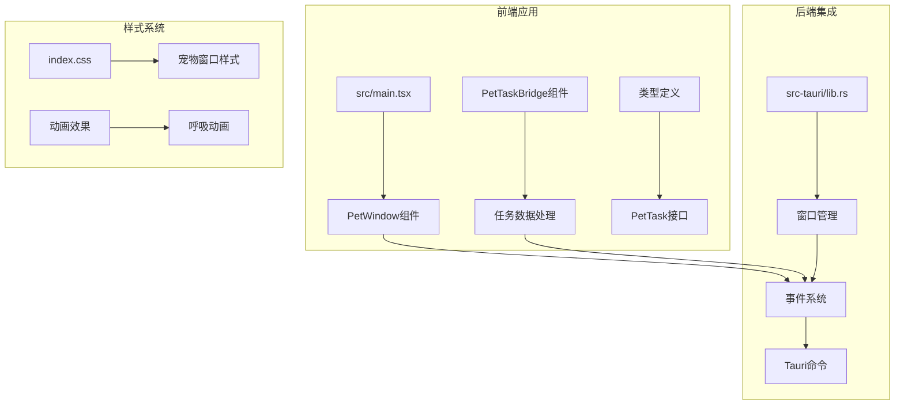
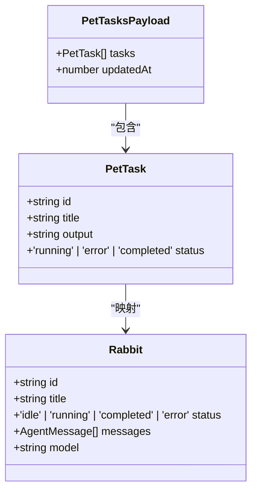
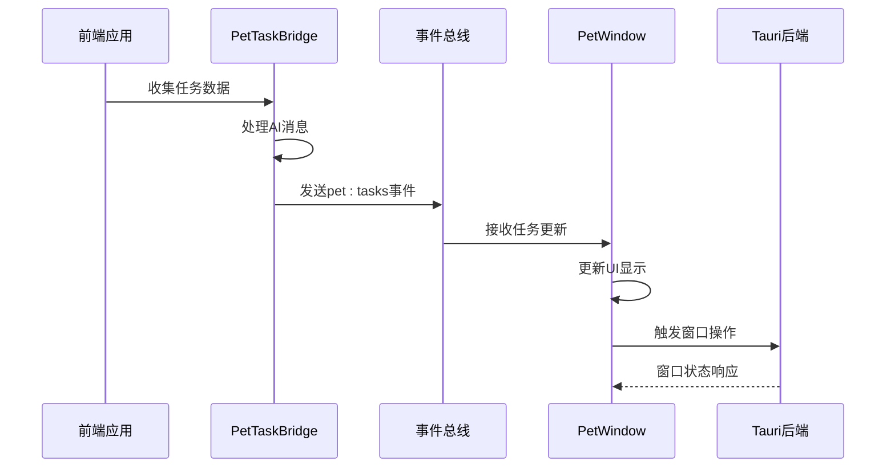
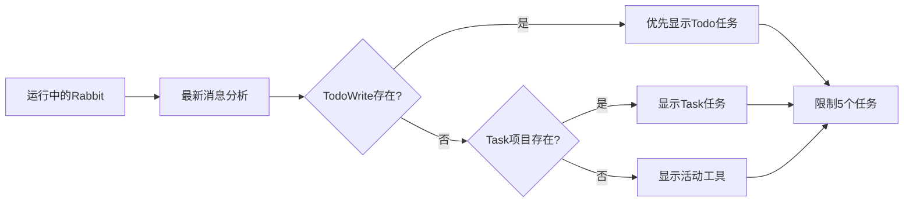
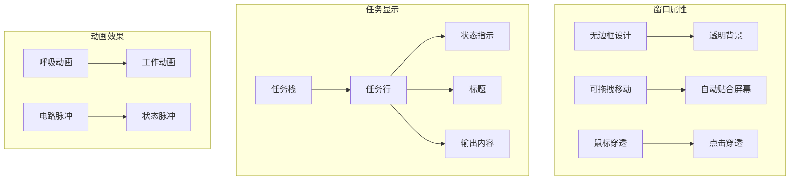
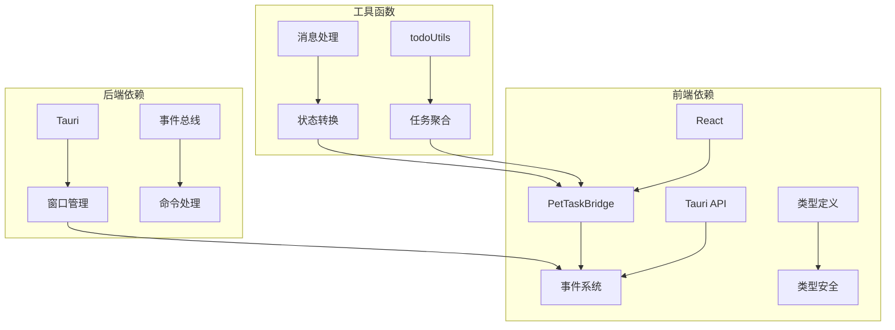
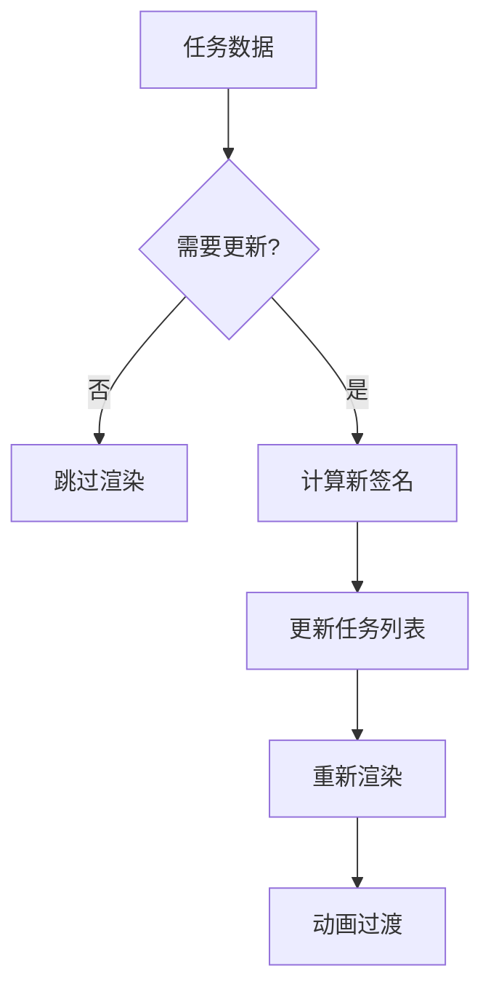

# Pet任务集成

<cite>
**本文档引用的文件**
- [PetTaskBridge.tsx](file://src/components/pet/PetTaskBridge.tsx)
- [PetWindow.tsx](file://src/components/pet/PetWindow.tsx)
- [types.ts](file://src/components/pet/types.ts)
- [todoUtils.ts](file://src/components/agent/todoUtils.ts)
- [index.tsx](file://src/main.tsx)
- [index.css](file://src/index.css)
- [lib.rs](file://src-tauri/src/lib.rs)
- [index.html](file://index.html)
- [package.json](file://package.json)
</cite>

## 目录
1. [简介](#简介)
2. [项目结构](#项目结构)
3. [核心组件](#核心组件)
4. [架构概览](#架构概览)
5. [详细组件分析](#详细组件分析)
6. [依赖关系分析](#依赖关系分析)
7. [性能考虑](#性能考虑)
8. [故障排除指南](#故障排除指南)
9. [结论](#结论)

## 简介

Pet任务集成为Rabbit Coding项目提供了一个创新的宠物窗口功能，允许用户在桌面上看到AI助手的工作状态。该功能通过实时同步AI任务状态，为用户提供了一个可视化的方式来跟踪正在进行的AI操作。

这个集成包括两个主要部分：
- **PetTaskBridge**: 负责从AI助手收集任务信息并转换为宠物窗口可以理解的格式
- **PetWindow**: 负责渲染和显示这些任务状态的视觉界面

## 项目结构

项目采用模块化架构，Pet任务集成位于以下关键位置：



**图表来源**
- [index.tsx:1-14](file://src/main.tsx#L1-L14)
- [PetWindow.tsx:120-248](file://src/components/pet/PetWindow.tsx#L120-L248)
- [PetTaskBridge.tsx:142-172](file://src/components/pet/PetTaskBridge.tsx#L142-L172)

**章节来源**
- [index.tsx:1-14](file://src/main.tsx#L1-L14)
- [package.json:1-48](file://package.json#L1-L48)

## 核心组件

### PetTask接口定义

Pet任务系统的核心数据结构定义如下：



**图表来源**
- [types.ts:1-12](file://src/components/pet/types.ts#L1-L12)
- [index.tsx:8-32](file://src/types/index.ts#L8-L32)

### 任务构建算法

系统通过以下流程将AI助手的状态转换为可视化的任务：

```mermaid
flowchart TD
A[收集工作区数据] --> B[过滤运行中的Rabbit]
B --> C[提取最新消息]
C --> D{检查TodoWrite}
D --> |找到| E[提取Todo项目]
D --> |未找到| F[聚合Task项目]
F --> G[查找活动工具]
E --> H[构建任务列表]
G --> H
H --> I[限制数量(最多5个)]
I --> J[清理文本格式]
J --> K[发送到宠物窗口]
```

**图表来源**
- [PetTaskBridge.tsx:72-128](file://src/components/pet/PetTaskBridge.tsx#L72-L128)
- [todoUtils.ts:30-39](file://src/components/agent/todoUtils.ts#L30-L39)

**章节来源**
- [types.ts:1-12](file://src/components/pet/types.ts#L1-L12)
- [PetTaskBridge.tsx:72-128](file://src/components/pet/PetTaskBridge.tsx#L72-L128)

## 架构概览

Pet任务集成采用事件驱动的架构模式，通过Tauri的事件系统实现前后端通信：



**图表来源**
- [PetTaskBridge.tsx:130-140](file://src/components/pet/PetTaskBridge.tsx#L130-L140)
- [PetWindow.tsx:190-210](file://src/components/pet/PetWindow.tsx#L190-L210)

## 详细组件分析

### PetTaskBridge组件

PetTaskBridge是整个Pet任务系统的核心协调器，负责：

#### 主要职责
- **数据收集**: 从工作区中收集所有运行中的AI助手信息
- **消息处理**: 解析AI助手产生的各种消息类型
- **任务构建**: 将复杂的消息转换为简洁的任务条目
- **事件发送**: 通过Tauri事件系统向宠物窗口发送数据

#### 任务优先级策略

系统实现了智能的任务优先级排序机制：



**图表来源**
- [PetTaskBridge.tsx:72-113](file://src/components/pet/PetTaskBridge.tsx#L72-L113)

#### 文本清理和摘要生成

为了确保显示效果，系统实现了智能的文本处理机制：

| 消息类型 | 处理方式 | 示例输出 |
|---------|---------|---------|
| Assistant Text | 直接显示 | "正在分析代码..." |
| Assistant Thinking | 转换为思考过程 | "分析中..." |
| Tool Use | 生成工具摘要 | "读取文件: main.js" |
| Tool Result | 显示结果摘要 | "文件读取完成" |
| Error | 显示错误信息 | "操作失败" |

**章节来源**
- [PetTaskBridge.tsx:14-62](file://src/components/pet/PetTaskBridge.tsx#L14-L62)
- [PetTaskBridge.tsx:115-128](file://src/components/pet/PetTaskBridge.tsx#L115-L128)

### PetWindow组件

PetWindow负责渲染宠物窗口的用户界面，提供了现代化的视觉体验：

#### 窗口特性



**图表来源**
- [PetWindow.tsx:120-248](file://src/components/pet/PetWindow.tsx#L120-L248)
- [index.css:57-84](file://src/index.css#L57-L84)

#### 交互功能

宠物窗口实现了多种用户交互功能：

| 功能 | 实现方式 | 效果 |
|------|---------|------|
| 拖拽移动 | startDragging() | 可自由移动宠物位置 |
| 点击激活 | invoke('activate_main_window') | 点击宠物激活主窗口 |
| 鼠标穿透 | set_ignore_cursor_events | 透明区域可穿透 |
| 自动贴合 | clampWindowToScreen | 窗口保持在屏幕内 |

**章节来源**
- [PetWindow.tsx:212-234](file://src/components/pet/PetWindow.tsx#L212-L234)
- [lib.rs:431-460](file://src-tauri/src/lib.rs#L431-L460)

### 样式系统

系统采用了精心设计的CSS样式系统，为宠物窗口提供了独特的视觉效果：

#### 动画系统

```mermaid
graph LR
A[呼吸动画] --> B[@keyframes pet-rabbit-breathe]
C[工作动画] --> D[@keyframes pet-rabbit-work]
E[电路脉冲] --> F[@keyframes pet-circuit-pulse]
G[状态脉冲] --> H[@keyframes pet-status-pulse]
I[输出滚动] --> J[@keyframes pet-output-scroll]
```

**图表来源**
- [index.css:57-89](file://src/index.css#L57-L89)

#### 窗口样式

宠物窗口使用了特殊的CSS类来实现透明效果：

| 样式类 | 作用 | 特性 |
|-------|------|------|
| pet-window-document | 根元素样式 | 透明背景，无溢出 |
| pet-window-root | 容器样式 | 全屏覆盖，无选择 |
| pet-window-stage | 舞台样式 | 弹性布局，居中对齐 |
| pet-task-stack | 任务堆栈 | 响应式宽度，垂直排列 |

**章节来源**
- [index.css:91-133](file://src/index.css#L91-L133)
- [index.css:100-200](file://src/index.css#L100-L200)

## 依赖关系分析

Pet任务集成涉及多个层面的依赖关系：



**图表来源**
- [PetTaskBridge.tsx:1-10](file://src/components/pet/PetTaskBridge.tsx#L1-L10)
- [todoUtils.ts:1-96](file://src/components/agent/todoUtils.ts#L1-L96)

### 核心依赖

| 依赖项 | 版本 | 用途 |
|-------|------|-----|
| @tauri-apps/api | ^2 | 事件系统和窗口管理 |
| react | ^19.1.0 | 组件框架 |
| @anthropic-ai/claude-agent-sdk | 本地安装 | AI助手集成 |
| zod | 本地安装 | 数据验证 |

**章节来源**
- [package.json:14-38](file://package.json#L14-L38)
- [PetTaskBridge.tsx:1-6](file://src/components/pet/PetTaskBridge.tsx#L1-L6)

## 性能考虑

### 内存管理

系统实现了高效的内存管理策略：

- **任务数量限制**: 最多同时显示5个任务，防止内存泄漏
- **文本截断**: 自动截断过长的标题和输出内容
- **事件去重**: 使用签名机制避免重复发送相同数据

### 渲染优化



**图表来源**
- [PetTaskBridge.tsx:142-148](file://src/components/pet/PetTaskBridge.tsx#L142-L148)

### 窗口性能

宠物窗口采用了多项性能优化技术：

- **硬件加速**: SVG图形使用GPU加速
- **动画节流**: 50ms轮询频率平衡性能和响应性
- **条件渲染**: 任务为空时隐藏容器元素

## 故障排除指南

### 常见问题及解决方案

| 问题 | 症状 | 解决方案 |
|------|------|---------|
| 宠物窗口不显示 | 窗口空白 | 检查URL参数 window=pet |
| 任务不更新 | 界面冻结 | 检查事件监听是否正常 |
| 窗口无法拖拽 | 无法移动 | 验证Tauri权限设置 |
| 鼠标穿透无效 | 点击穿透 | 检查平台支持情况 |

### 调试方法

1. **开发者工具**: 使用浏览器开发者工具检查控制台日志
2. **事件监控**: 监听pet:tasks和pet:request-sync事件
3. **窗口状态**: 检查窗口位置和尺寸变化
4. **性能分析**: 使用性能面板分析渲染性能

**章节来源**
- [PetWindow.tsx:167-188](file://src/components/pet/PetWindow.tsx#L167-L188)
- [PetTaskBridge.tsx:150-168](file://src/components/pet/PetTaskBridge.tsx#L150-L168)

## 结论

Pet任务集成为Rabbit Coding项目提供了一个优雅而实用的功能增强，通过以下方式提升了用户体验：

### 技术成就

- **实时同步**: 通过事件驱动架构实现实时任务状态更新
- **跨平台支持**: 支持Windows、macOS和Linux平台
- **性能优化**: 采用多项优化技术确保流畅的用户体验
- **类型安全**: 完整的TypeScript类型定义保证代码质量

### 设计亮点

- **视觉设计**: 独特的Cyber Rabbit宠物形象和动画效果
- **交互体验**: 智能的鼠标穿透和窗口贴合功能
- **响应式布局**: 适配不同屏幕尺寸和分辨率
- **无障碍支持**: 考虑了不同用户的需求和使用场景

这个集成为AI助手应用提供了一个创新的可视化界面，展示了现代前端技术与AI系统的完美结合。通过模块化的设计和清晰的架构，为未来的功能扩展奠定了坚实的基础。