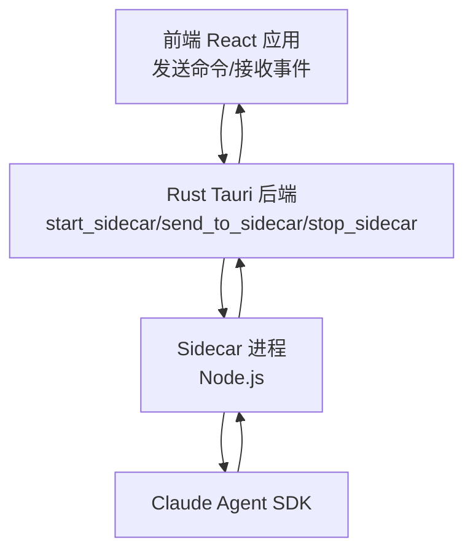
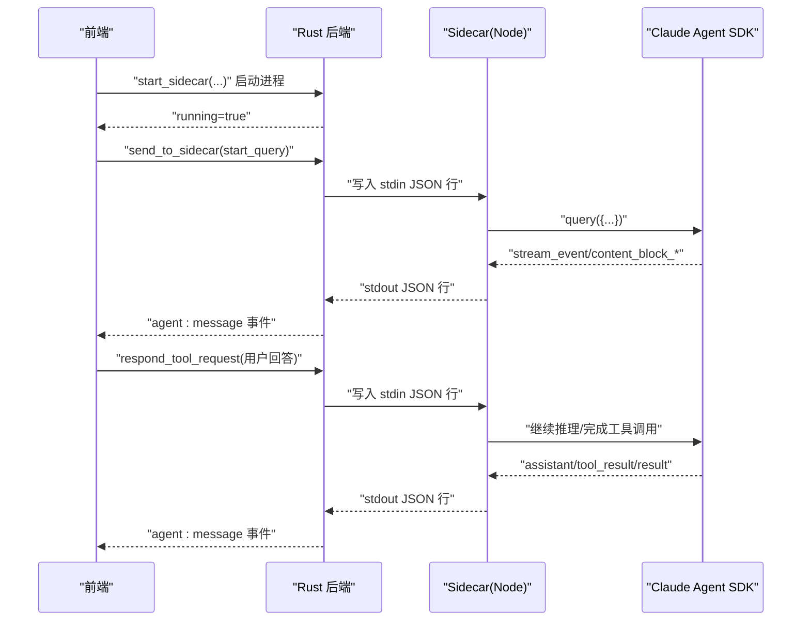
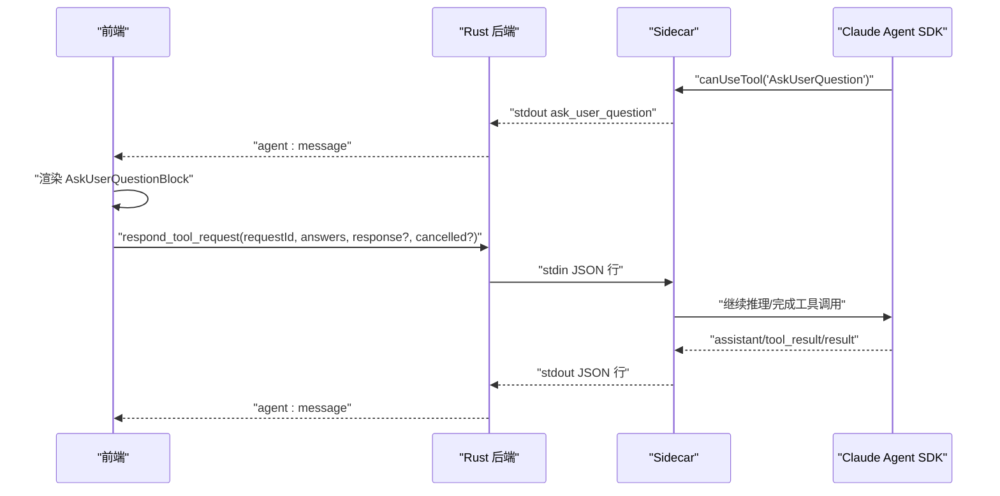
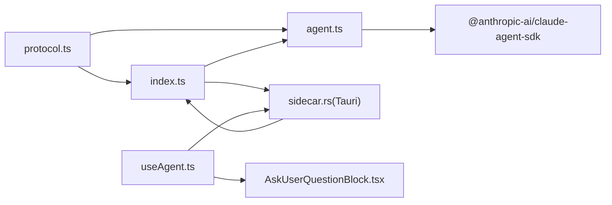

# Sidecar 进程通信

<cite>
**本文引用的文件**
- [sidecar/src/index.ts](file://sidecar/src/index.ts)
- [sidecar/src/agent.ts](file://sidecar/src/agent.ts)
- [sidecar/src/protocol.ts](file://sidecar/src/protocol.ts)
- [src-tauri/src/sidecar.rs](file://src-tauri/src/sidecar.rs)
- [src/hooks/useAgent.ts](file://src/hooks/useAgent.ts)
- [src/components/agent/AskUserQuestionBlock.tsx](file://src/components/agent/AskUserQuestionBlock.tsx)
- [sidecar/package.json](file://sidecar/package.json)
- [src-tauri/Cargo.toml](file://src-tauri/Cargo.toml)
</cite>

## 目录
1. [简介](#简介)
2. [项目结构](#项目结构)
3. [核心组件](#核心组件)
4. [架构总览](#架构总览)
5. [详细组件分析](#详细组件分析)
6. [依赖关系分析](#依赖关系分析)
7. [性能考量](#性能考量)
8. [故障排除指南](#故障排除指南)
9. [结论](#结论)
10. [附录](#附录)

## 简介
本文件面向 Sidecar 进程通信，系统性阐述 Agent 与 Sidecar 进程之间的通信协议、消息格式、连接管理与生命周期控制。文档覆盖以下要点：
- 协议定义：前端 → Sidecar（stdin）与 Sidecar → 前端（stdout）的消息类型与字段
- 消息序列化：JSON-lines 格式，逐行传输
- 双向通信机制：命令下发、流式增量输出、工具调用与用户问答
- 生命周期管理：进程启动、优雅关闭、异常恢复
- 超时与重连：看门狗机制、思考态放宽、重连策略
- 数据完整性：增量流式、工具调用配对、最终结果
- 调试与排障：日志、事件监听、常见问题定位

## 项目结构
该项目采用“前端 React + Rust Tauri 后端 + Node.js Sidecar”的三层架构：
- 前端（React）：通过 Tauri Commands 与 Sidecar 交互，监听 Tauri Events 接收流式消息
- Rust 后端（Tauri）：管理 Sidecar 进程生命周期，转发 stdin/stdout
- Sidecar（Node.js）：消费 stdin 命令，驱动 Claude Agent SDK，将增量消息以 JSON-lines 输出

图表来源
- [src-tauri/src/sidecar.rs:59-214](file://src-tauri/src/sidecar.rs#L59-L214)
- [sidecar/src/index.ts:96-128](file://sidecar/src/index.ts#L96-L128)

章节来源
- [src-tauri/src/sidecar.rs:59-214](file://src-tauri/src/sidecar.rs#L59-L214)
- [sidecar/src/index.ts:96-128](file://sidecar/src/index.ts#L96-L128)

## 核心组件
- 协议定义（TypeScript）：定义前端与 Sidecar 的消息类型、字段与语义
- Sidecar 入口（Node.js）：读取 stdin JSON-lines，分发命令，输出 JSON-lines
- Agent 封装（Node.js）：封装 Claude Agent SDK，转换为增量流式消息
- Tauri 侧车（Rust）：进程生命周期、stdin/stdout 管道、事件转发
- 前端 Hook（React）：命令发送、事件监听、看门狗与超时处理

章节来源
- [sidecar/src/protocol.ts:13-78](file://sidecar/src/protocol.ts#L13-L78)
- [sidecar/src/index.ts:37-91](file://sidecar/src/index.ts#L37-L91)
- [sidecar/src/agent.ts:241-465](file://sidecar/src/agent.ts#L241-L465)
- [src-tauri/src/sidecar.rs:59-214](file://src-tauri/src/sidecar.rs#L59-L214)
- [src/hooks/useAgent.ts:153-200](file://src/hooks/useAgent.ts#L153-L200)

## 架构总览
下面的序列图展示了典型的消息往返流程：前端发起查询，Sidecar 通过 SDK 流式输出增量消息，前端渲染并处理工具调用与用户问答。

图表来源
- [src-tauri/src/sidecar.rs:59-214](file://src-tauri/src/sidecar.rs#L59-L214)
- [sidecar/src/index.ts:37-91](file://sidecar/src/index.ts#L37-L91)
- [sidecar/src/agent.ts:320-438](file://sidecar/src/agent.ts#L320-L438)
- [src/hooks/useAgent.ts:153-200](file://src/hooks/useAgent.ts#L153-L200)

## 详细组件分析

### 1) 协议定义与消息格式
- 前端 → Sidecar（stdin JSON-lines）
  - start_query/resume_query：启动/恢复会话，携带 id、prompt、cwd、options
  - cancel_query：取消指定查询
  - compact_query：触发会话压缩
  - respond_tool_request：响应 AskUserQuestion 的用户回答
  - shutdown：优雅关闭 Sidecar
- Sidecar → 前端（stdout JSON-lines）
  - system/init：初始化，包含 sessionId
  - assistant/text/thinking：文本/思考增量与结束信号
  - assistant/tool_use/tool_result：工具调用与结果
  - result/error：最终结果与错误
  - compaction/status/result：会话压缩状态与统计
  - usage_update：实时 token 用量
  - ask_user_question：向前端发起用户问答
  - spec_written：WriteSpec 工具写入规范文档的通知

章节来源
- [sidecar/src/protocol.ts:13-78](file://sidecar/src/protocol.ts#L13-L78)
- [sidecar/src/protocol.ts:84-252](file://sidecar/src/protocol.ts#L84-L252)

### 2) Sidecar 入口与命令分发
- 通过 readline 逐行读取 stdin，解析为 InboundMessage
- 根据 type 分发到对应处理器：start/resume/cancel/compact/respond/shutdown
- 所有输出统一以 JSON-lines 写入 stdout，错误通过 error 类型消息返回
- 启动时发送 system/ready 事件，便于前端感知就绪

章节来源
- [sidecar/src/index.ts:96-128](file://sidecar/src/index.ts#L96-L128)
- [sidecar/src/index.ts:37-91](file://sidecar/src/index.ts#L37-L91)

### 3) Agent 封装与流式增量处理
- runQuery：封装 Claude Agent SDK 的异步生成器，转换为增量消息
- 流式事件处理：
  - stream_event：content_block_start/delta/stop，映射为 thinking/text 增量与结束信号
  - assistant：每个 turn 结束后，补充 thinking_done 与 text_done，并抽取 tool_use/tool_result
- 工具调用与用户问答：
  - AskUserQuestion：向前端发送 ask_user_question，等待前端 respond_tool_request
  - 超时与取消：5 分钟超时、查询取消时中断等待
- 会话压缩：根据 SDK 的 status/compact_boundary 事件，上报压缩阶段与结果

章节来源
- [sidecar/src/agent.ts:241-465](file://sidecar/src/agent.ts#L241-L465)
- [sidecar/src/agent.ts:146-199](file://sidecar/src/agent.ts#L146-L199)
- [sidecar/src/agent.ts:502-573](file://sidecar/src/agent.ts#L502-L573)
- [sidecar/src/agent.ts:491-497](file://sidecar/src/agent.ts#L491-L497)

### 4) Tauri 侧车：进程生命周期与管道
- 启动：构建 Command，注入环境变量（API Key/Base URL/自定义），重定向 CLAUDE_CONFIG_DIR 隔离全局配置
- 管道：捕获 stdout/stderr，分别转发为 agent:message 事件与日志输出
- 发送：将前端命令写入 Sidecar stdin
- 关闭：先发送 shutdown 命令，再强制终止子进程

章节来源
- [src-tauri/src/sidecar.rs:59-214](file://src-tauri/src/sidecar.rs#L59-L214)
- [src-tauri/src/sidecar.rs:216-270](file://src-tauri/src/sidecar.rs#L216-L270)

### 5) 前端 Hook：命令发送与事件监听
- startQuery/resumeQuery/compactQuery/cancelQuery：构造命令并调用 send_to_sidecar
- 事件监听：listen("agent:message") 接收 Sidecar 输出，按 AgentMessage 类型渲染
- 看门狗：每条 query 独立计时，常态 10 分钟、思考态 30 分钟，超时触发回调
- 用户问答：AskUserQuestionBlock 渲染问题卡片，提交后调用 respondToolRequest

章节来源
- [src/hooks/useAgent.ts:153-200](file://src/hooks/useAgent.ts#L153-L200)
- [src/hooks/useAgent.ts:245-263](file://src/hooks/useAgent.ts#L245-L263)
- [src/hooks/useAgent.ts:66-95](file://src/hooks/useAgent.ts#L66-L95)
- [src/components/agent/AskUserQuestionBlock.tsx:21-73](file://src/components/agent/AskUserQuestionBlock.tsx#L21-L73)

### 6) 用户问答流程（AskUserQuestion）

图表来源
- [sidecar/src/agent.ts:502-573](file://sidecar/src/agent.ts#L502-L573)
- [src-tauri/src/sidecar.rs:216-243](file://src-tauri/src/sidecar.rs#L216-L243)
- [src/components/agent/AskUserQuestionBlock.tsx:21-73](file://src/components/agent/AskUserQuestionBlock.tsx#L21-L73)

### 7) 会话压缩流程
- compact_query：以 /compact prompt 恢复会话，触发 SDK 压缩
- 状态上报：compaction/compaction_result/usage_update
- 压缩完成后，前端可基于 token 统计决定后续操作

章节来源
- [sidecar/src/agent.ts:491-497](file://sidecar/src/agent.ts#L491-L497)
- [sidecar/src/protocol.ts:202-222](file://sidecar/src/protocol.ts#L202-L222)

### 8) 错误处理与异常恢复
- 未捕获异常：Node.js 未捕获异常/拒绝，记录日志并发送 error 消息
- JSON 解析失败：记录无效 JSON 并返回 error
- 询问超时：AskUserQuestion 5 分钟未回复自动 deny
- 进程异常：stdout 关闭时发送 agent:sidecar-exit 事件

章节来源
- [sidecar/src/index.ts:131-139](file://sidecar/src/index.ts#L131-L139)
- [sidecar/src/index.ts:113-116](file://sidecar/src/index.ts#L113-L116)
- [sidecar/src/agent.ts:518-542](file://sidecar/src/agent.ts#L518-L542)
- [src-tauri/src/sidecar.rs:190-194](file://src-tauri/src/sidecar.rs#L190-L194)

## 依赖关系分析
- sidecar/src/protocol.ts：定义所有消息类型，被 index.ts 与 agent.ts 引用
- sidecar/src/index.ts：依赖 protocol.ts 类型，调用 agent.ts 的命令处理器
- sidecar/src/agent.ts：依赖 @anthropic-ai/claude-agent-sdk，内部封装 SDK 流式事件
- src-tauri/src/sidecar.rs：依赖 serde，负责进程生命周期与 stdin/stdout 管道
- src/hooks/useAgent.ts：依赖 @tauri-apps/api，封装命令发送与事件监听
- src/components/agent/AskUserQuestionBlock.tsx：依赖 useAgentContext 与 useWorkspaces，处理用户交互

图表来源
- [sidecar/src/protocol.ts:13-78](file://sidecar/src/protocol.ts#L13-L78)
- [sidecar/src/index.ts:9-18](file://sidecar/src/index.ts#L9-L18)
- [sidecar/src/agent.ts:12-26](file://sidecar/src/agent.ts#L12-L26)
- [src-tauri/src/sidecar.rs:1-4](file://src-tauri/src/sidecar.rs#L1-L4)
- [src/hooks/useAgent.ts:8-17](file://src/hooks/useAgent.ts#L8-L17)
- [src/components/agent/AskUserQuestionBlock.tsx:9-13](file://src/components/agent/AskUserQuestionBlock.tsx#L9-L13)

章节来源
- [sidecar/package.json:12-14](file://sidecar/package.json#L12-L14)
- [src-tauri/Cargo.toml:20-38](file://src-tauri/Cargo.toml#L20-L38)

## 性能考量
- 流式增量：通过 content_block_delta 与 message_delta 实时推送，降低前端等待时间
- 并发查询：start_query 不 await，允许多查询并发，提高吞吐
- 看门狗：区分常态与思考态超时，避免长思考被误判
- 环境隔离：通过 CLAUDE_CONFIG_DIR 防止全局配置影响，减少不必要的 IO 与网络请求

## 故障排除指南
- 无法启动 Sidecar
  - 检查 start_sidecar 返回的错误信息
  - 确认 API Key/Base URL 环境变量正确注入
  - 查看 stderr 日志（Rust 线程打印）
- 无消息输出
  - 确认已发送 start_query 并收到 system/ready
  - 检查 agent:message 事件是否被监听
  - 观察 stdout 是否被消费（Rust 线程）
- 用户问答无响应
  - 确认 ask_user_question 已发送
  - 检查前端是否在 5 分钟内提交 respond_tool_request
  - 若取消，确保 cancelled 标记正确
- 查询长时间无进展
  - 观察是否处于思考态（thinking_delta/thinking_done）
  - 超时触发 onQueryTimeout，必要时取消查询
- 进程异常退出
  - 查看 agent:sidecar-exit 事件原因
  - 重新启动 Sidecar 并重试

章节来源
- [src-tauri/src/sidecar.rs:59-214](file://src-tauri/src/sidecar.rs#L59-L214)
- [src/hooks/useAgent.ts:66-95](file://src/hooks/useAgent.ts#L66-L95)
- [sidecar/src/agent.ts:518-542](file://sidecar/src/agent.ts#L518-L542)

## 结论
本方案通过 JSON-lines 的简单协议实现前端、Rust 后端与 Sidecar 的稳定通信。协议清晰、消息粒度细、支持流式增量与工具调用，结合看门狗与超时策略，能够有效应对长时间思考与网络波动等场景。建议在生产环境中：
- 严格校验命令与消息格式，避免无效 JSON 导致的错误传播
- 在前端实现重连与退避策略，提升鲁棒性
- 使用 CLAUDE_CONFIG_DIR 与 settingSources 隔离全局配置，确保 BYOK 安全

## 附录

### A. 协议字段速查
- 前端 → Sidecar（stdin）
  - start_query/resume_query：id、prompt、cwd、options(model/allowedTools/permissionMode/maxTurns/maxBudgetUsd/specEnabled)
  - cancel_query：id
  - compact_query：id、sessionId、cwd、options
  - respond_tool_request：requestId、answers、response、cancelled
  - shutdown：无额外字段
- Sidecar → 前端（stdout）
  - system/init：sessionId
  - assistant/text/thinking：text/thinking、durationMs
  - assistant/text_delta/thinking_delta：delta
  - assistant/text_done/thinking_done：结束信号
  - assistant/tool_use：toolUseId、toolName、toolInput
  - tool_result：toolUseId、output、isError
  - result：subtype(success/error)、result/totalCostUsd/durationMs/error/numTurns/usage
  - error：queryId/message
  - compaction/status：phase(compacting/done/failed)/error
  - compaction_result：trigger/auto/manual、preTokens/postTokens/durationMs
  - usage_update：usage(inputTokens/outputTokens/cacheCreationInputTokens/cacheReadInputTokens)
  - ask_user_question：requestId、questions
  - spec_written：specContent、specFilePath

章节来源
- [sidecar/src/protocol.ts:13-78](file://sidecar/src/protocol.ts#L13-L78)
- [sidecar/src/protocol.ts:84-252](file://sidecar/src/protocol.ts#L84-L252)

### B. 示例：消息发送与接收的完整流程（步骤化）
- 启动 Sidecar
  - 前端调用 start_sidecar，Rust 启动 Node 进程并转发 stdout/stderr
- 发送查询命令
  - 前端构造 start_query，调用 send_to_sidecar 写入 stdin
- Sidecar 处理
  - index.ts 读取 stdin，分发到 agent.ts 的 runQuery
  - agent.ts 通过 SDK 流式输出增量消息
- 前端接收
  - useAgent.ts 监听 agent:message，按类型渲染
- 用户问答
  - Sidecar 发送 ask_user_question，前端渲染卡片，提交 respond_tool_request
- 结束
  - SDK 返回 result，前端显示最终状态与统计

章节来源
- [src-tauri/src/sidecar.rs:59-214](file://src-tauri/src/sidecar.rs#L59-L214)
- [sidecar/src/index.ts:37-91](file://sidecar/src/index.ts#L37-L91)
- [sidecar/src/agent.ts:241-465](file://sidecar/src/agent.ts#L241-L465)
- [src/hooks/useAgent.ts:153-200](file://src/hooks/useAgent.ts#L153-L200)
- [src/components/agent/AskUserQuestionBlock.tsx:21-73](file://src/components/agent/AskUserQuestionBlock.tsx#L21-L73)