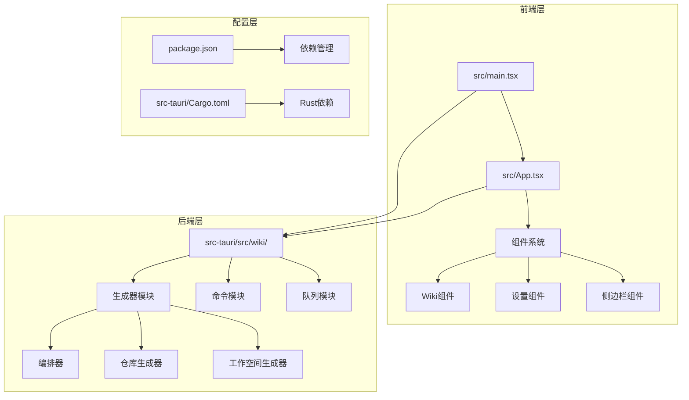
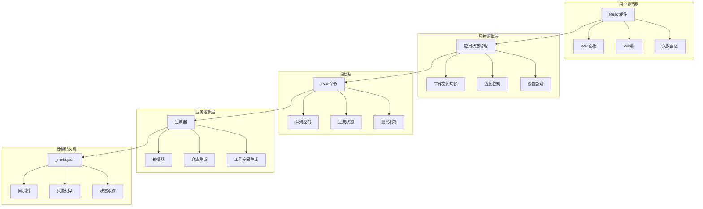
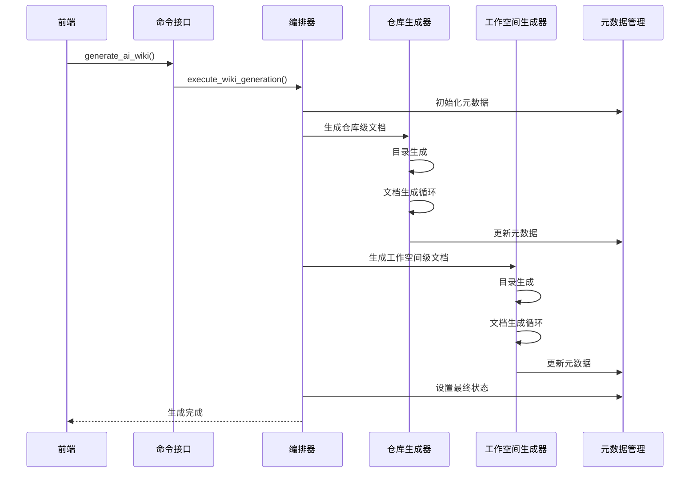
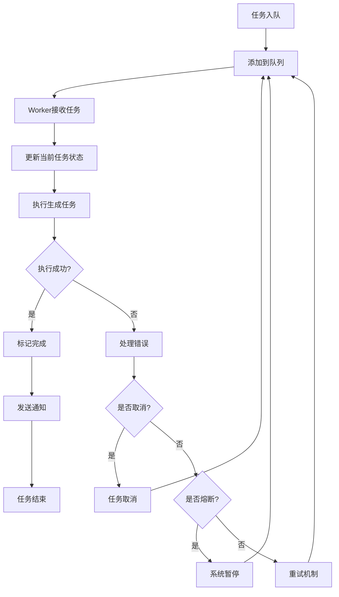
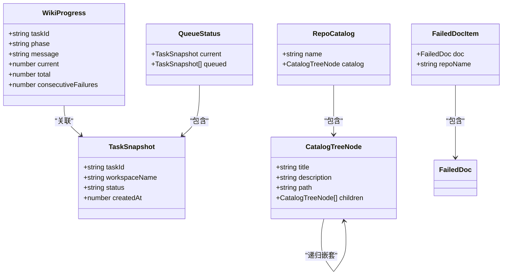

# Wiki生成系统

<cite>
**本文档引用的文件**
- [README.md](file://README.md)
- [package.json](file://package.json)
- [src/main.tsx](file://src/main.tsx)
- [src/App.tsx](file://src/App.tsx)
- [src-tauri/Cargo.toml](file://src-tauri/Cargo.toml)
- [src/components/wiki/WikiPanels.tsx](file://src/components/wiki/WikiPanels.tsx)
- [src/components/wiki/WikiTree.tsx](file://src/components/wiki/WikiTree.tsx)
- [src/components/wiki/wikiTypes.ts](file://src/components/wiki/wikiTypes.ts)
- [src-tauri/src/wiki/mod.rs](file://src-tauri/src/wiki/mod.rs)
- [src-tauri/src/wiki/generator/mod.rs](file://src-tauri/src/wiki/generator/mod.rs)
- [src-tauri/src/wiki/generator/orchestrator.rs](file://src-tauri/src/wiki/generator/orchestrator.rs)
- [src-tauri/src/wiki/generator/repo.rs](file://src-tauri/src/wiki/generator/repo.rs)
- [src-tauri/src/wiki/generator/workspace.rs](file://src-tauri/src/wiki/generator/workspace.rs)
- [src-tauri/src/wiki/commands.rs](file://src-tauri/src/wiki/commands.rs)
- [src-tauri/src/wiki/queue.rs](file://src-tauri/src/wiki/queue.rs)
</cite>

## 目录
1. [简介](#简介)
2. [项目结构](#项目结构)
3. [核心组件](#核心组件)
4. [架构概览](#架构概览)
5. [详细组件分析](#详细组件分析)
6. [依赖关系分析](#依赖关系分析)
7. [性能考虑](#性能考虑)
8. [故障排除指南](#故障排除指南)
9. [结论](#结论)

## 简介

Wiki生成系统是一个基于Tauri + React + TypeScript构建的智能文档生成平台。该系统能够自动分析代码库，生成高质量的技术文档和知识库。系统采用两层生成架构（代码库级 + 工作空间级），支持断点续传、连续失败熔断、单文件重试等高级功能。

## 项目结构

该项目采用现代化的全栈架构设计，主要分为前端React应用和后端Rust服务两大部分：



**图表来源**
- [src/main.tsx:1-14](file://src/main.tsx#L1-L14)
- [src/App.tsx:1-151](file://src/App.tsx#L1-L151)
- [src-tauri/src/wiki/mod.rs:1-62](file://src-tauri/src/wiki/mod.rs#L1-L62)

**章节来源**
- [README.md:1-8](file://README.md#L1-L8)
- [package.json:1-48](file://package.json#L1-L48)
- [src-tauri/Cargo.toml:1-40](file://src-tauri/Cargo.toml#L1-L40)

## 核心组件

### 前端组件系统

系统包含完整的Wiki功能组件，主要包括：

- **Wiki进度面板**：显示生成进度和队列状态
- **Wiki树形结构**：展示文档目录和文件导航
- **失败项面板**：管理失败文档的重试机制
- **暂停警告**：提示系统熔断状态

### 后端生成引擎

Rust后端提供高性能的AI驱动文档生成能力：

- **两层生成架构**：先生成代码库级文档，再生成工作空间级文档
- **断点续传**：支持任务中断后的恢复
- **熔断保护**：连续失败时自动暂停，防止资源浪费
- **工具集成**：提供文件读取、目录遍历等开发工具

**章节来源**
- [src/components/wiki/WikiPanels.tsx:1-162](file://src/components/wiki/WikiPanels.tsx#L1-L162)
- [src/components/wiki/WikiTree.tsx:1-172](file://src/components/wiki/WikiTree.tsx#L1-L172)
- [src-tauri/src/wiki/mod.rs:1-62](file://src-tauri/src/wiki/mod.rs#L1-L62)

## 架构概览

系统采用分层架构设计，实现了前后端的清晰分离：



**图表来源**
- [src/App.tsx:33-151](file://src/App.tsx#L33-L151)
- [src-tauri/src/wiki/commands.rs:16-506](file://src-tauri/src/wiki/commands.rs#L16-L506)
- [src-tauri/src/wiki/generator/orchestrator.rs:15-127](file://src-tauri/src/wiki/generator/orchestrator.rs#L15-L127)

## 详细组件分析

### Wiki生成编排器

编排器负责协调整个生成流程，实现两层架构的有序执行：



**图表来源**
- [src-tauri/src/wiki/generator/orchestrator.rs:16-127](file://src-tauri/src/wiki/generator/orchestrator.rs#L16-L127)
- [src-tauri/src/wiki/generator/repo.rs:20-302](file://src-tauri/src/wiki/generator/repo.rs#L20-L302)
- [src-tauri/src/wiki/generator/workspace.rs:20-241](file://src-tauri/src/wiki/generator/workspace.rs#L20-L241)

### 任务队列管理系统

系统采用消息队列实现异步任务处理：



**图表来源**
- [src-tauri/src/wiki/queue.rs:69-171](file://src-tauri/src/wiki/queue.rs#L69-L171)
- [src-tauri/src/wiki/commands.rs:16-88](file://src-tauri/src/wiki/commands.rs#L16-L88)

### 数据模型架构

系统定义了完整的数据模型来管理生成状态：



**图表来源**
- [src/components/wiki/wikiTypes.ts:11-104](file://src/components/wiki/wikiTypes.ts#L11-L104)

**章节来源**
- [src-tauri/src/wiki/generator/orchestrator.rs:15-127](file://src-tauri/src/wiki/generator/orchestrator.rs#L15-L127)
- [src-tauri/src/wiki/queue.rs:17-63](file://src-tauri/src/wiki/queue.rs#L17-L63)
- [src/components/wiki/wikiTypes.ts:34-104](file://src/components/wiki/wikiTypes.ts#L34-L104)

## 依赖关系分析

系统依赖关系清晰，前后端分离良好：

```mermaid
graph LR
subgraph "前端依赖"
FR[React] --> ANT[Ant Design]
FR --> MON[Monaco Editor]
FR --> TAU[Tauri API]
end
subgraph "后端依赖"
RS[Rust] --> TAU2[Tauri]
RS --> SER[Serde JSON]
RS --> TOK[Tokio]
RS --> REQ[Reqwest]
end
subgraph "系统集成"
FE[前端] < --> BE[后端]
FE --> CMD[Tauri命令]
BE --> FS[文件系统]
BE --> NET[网络请求]
end
ANT --> FR
MON --> FR
TAU --> FE
TAU2 --> BE
SER --> BE
TOK --> BE
REQ --> BE
```

**图表来源**
- [package.json:14-46](file://package.json#L14-L46)
- [src-tauri/Cargo.toml:20-40](file://src-tauri/Cargo.toml#L20-L40)

**章节来源**
- [package.json:14-46](file://package.json#L14-L46)
- [src-tauri/Cargo.toml:20-40](file://src-tauri/Cargo.toml#L20-L40)

## 性能考虑

系统在多个层面进行了性能优化：

### 并发控制
- 单线程执行器避免资源竞争
- 异步任务队列提高吞吐量
- 原子操作保证状态一致性

### 内存管理
- 智能缓存策略减少重复计算
- 及时释放不再使用的资源
- 分批处理大文件内容

### I/O优化
- 批量文件操作减少系统调用
- 智能目录遍历跳过无关文件
- 增量更新元数据文件

## 故障排除指南

### 常见问题及解决方案

**任务长时间无响应**
1. 检查网络连接状态
2. 验证API密钥有效性
3. 查看系统资源使用情况

**生成文档缺失**
1. 确认AI工具调用是否成功
2. 检查输出目录权限
3. 验证文件命名规范

**队列卡住**
1. 检查取消标志状态
2. 重启Worker进程
3. 清理异常任务

**章节来源**
- [src-tauri/src/wiki/queue.rs:160-171](file://src-tauri/src/wiki/queue.rs#L160-L171)
- [src-tauri/src/wiki/commands.rs:56-88](file://src-tauri/src/wiki/commands.rs#L56-L88)

## 结论

Wiki生成系统是一个功能完整、架构清晰的智能文档生成平台。系统通过两层生成架构实现了从代码库到工作空间的全面覆盖，配合断点续传、熔断保护等高级特性，为开发者提供了高效可靠的文档生成解决方案。

系统的主要优势包括：
- **双层架构设计**：确保文档生成的完整性和层次性
- **智能状态管理**：提供完善的进度跟踪和错误处理
- **高性能实现**：Rust后端保证了优秀的执行效率
- **用户友好界面**：React组件提供直观的操作体验