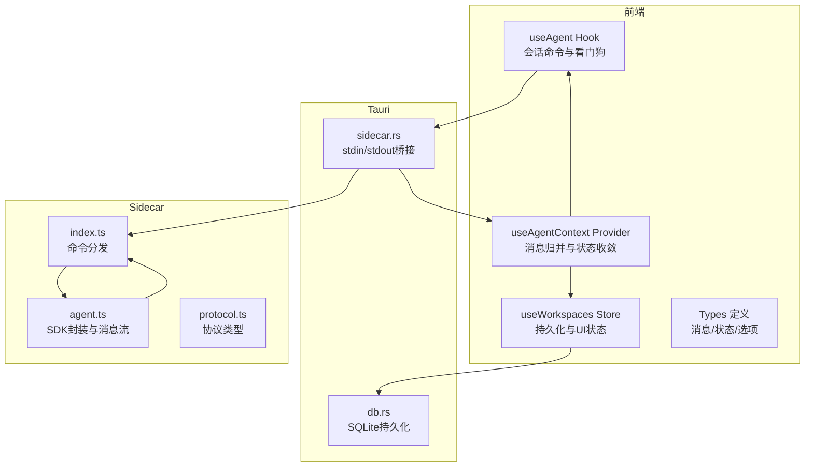
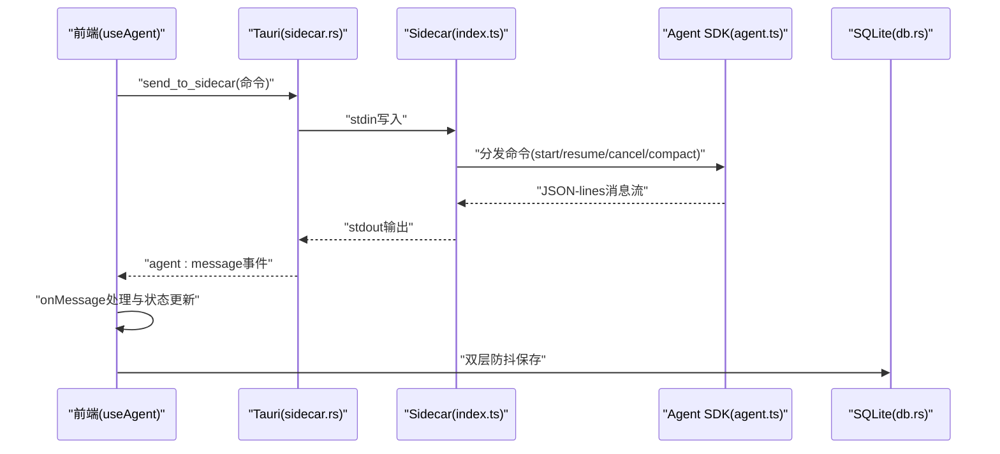
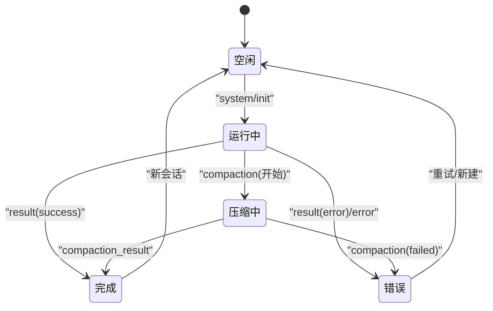
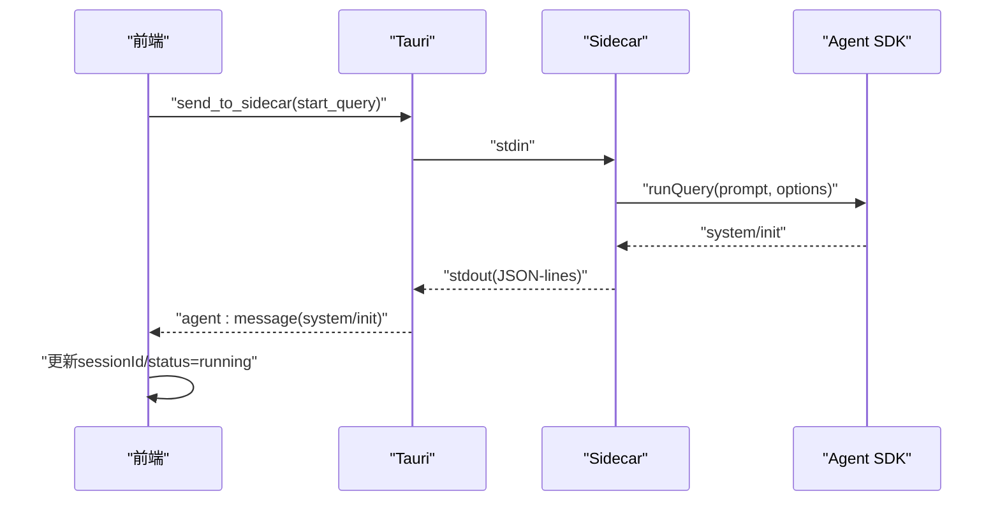
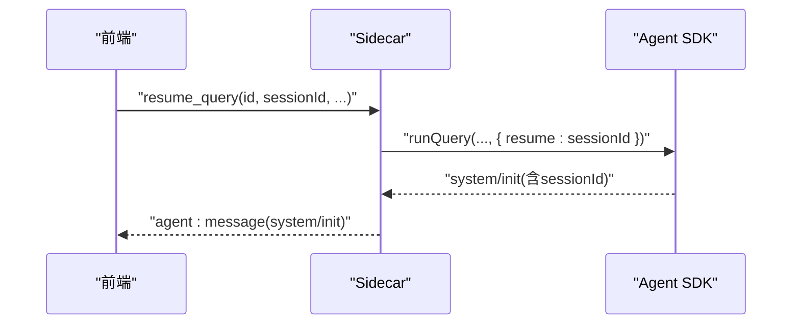
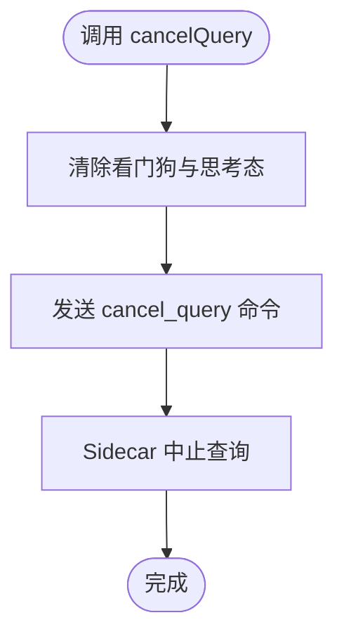
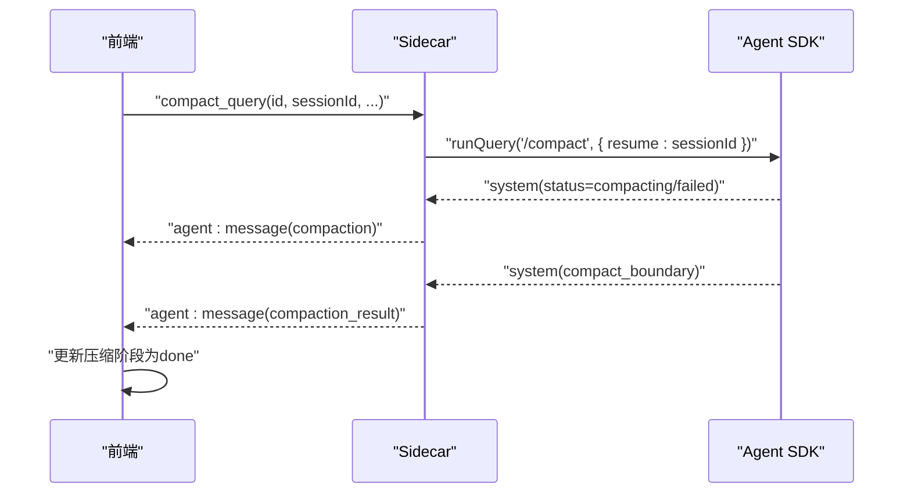
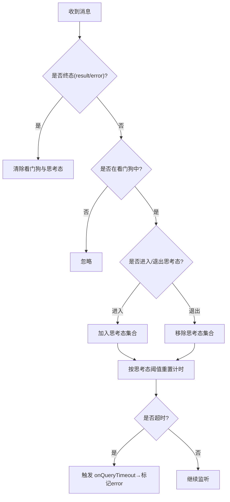
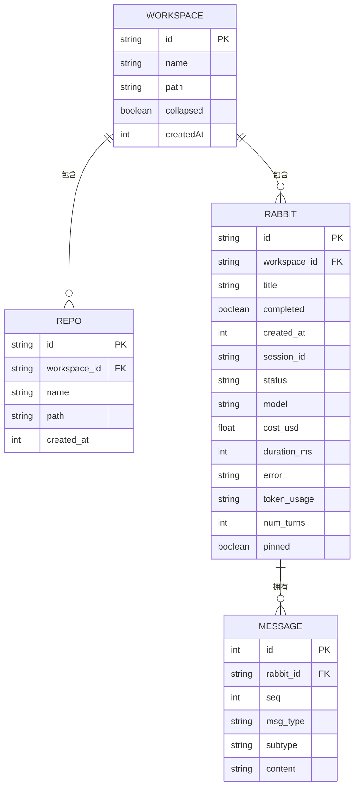
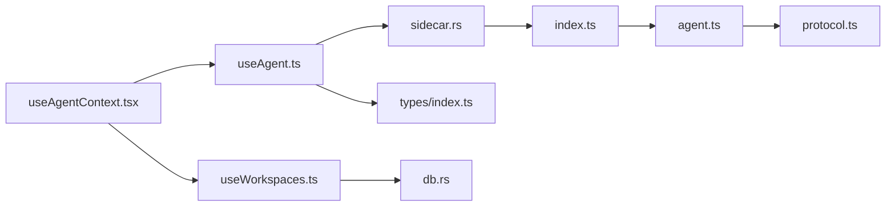

# 会话管理与状态控制

<cite>
**本文档引用的文件**
- [src/hooks/useAgent.ts](file://src/hooks/useAgent.ts)
- [src/hooks/useAgentContext.tsx](file://src/hooks/useAgentContext.tsx)
- [src/hooks/useWorkspaces.ts](file://src/hooks/useWorkspaces.ts)
- [src/types/index.ts](file://src/types/index.ts)
- [src-tauri/src/sidecar.rs](file://src-tauri/src/sidecar.rs)
- [src-tauri/src/db.rs](file://src-tauri/src/db.rs)
- [sidecar/src/agent.ts](file://sidecar/src/agent.ts)
- [sidecar/src/index.ts](file://sidecar/src/index.ts)
- [sidecar/src/protocol.ts](file://sidecar/src/protocol.ts)
</cite>

## 目录
1. [简介](#简介)
2. [项目结构](#项目结构)
3. [核心组件](#核心组件)
4. [架构总览](#架构总览)
5. [详细组件分析](#详细组件分析)
6. [依赖关系分析](#依赖关系分析)
7. [性能考虑](#性能考虑)
8. [故障排查指南](#故障排查指南)
9. [结论](#结论)
10. [附录](#附录)

## 简介
本文件围绕“会话管理与状态控制”主题，系统性梳理前端会话生命周期、状态转换、持久化策略与关键操作（startQuery、resumeQuery、cancelQuery、compactQuery）。文档重点解释：
- 会话状态机与消息流转
- 超时检测与异常恢复机制
- 会话数据结构与持久化策略
- 并发控制与UI一致性保障
- 完整流程示例（创建、恢复、取消、压缩）

## 项目结构
整体采用“前端 React Hook + Tauri Bridge + Rust Sidecar + SQLite”的分层架构：
- 前端负责会话生命周期编排、状态渲染与持久化调度
- Tauri 负责进程管理与事件桥接
- Sidecar 负责与 Claude Agent SDK 交互，产生流式消息
- SQLite 负责会话与消息的持久化

**图表来源**
- [src/hooks/useAgent.ts:1-334](file://src/hooks/useAgent.ts#L1-L334)
- [src/hooks/useAgentContext.tsx:1-298](file://src/hooks/useAgentContext.tsx#L1-L298)
- [src/hooks/useWorkspaces.ts:1-541](file://src/hooks/useWorkspaces.ts#L1-L541)
- [src-tauri/src/sidecar.rs:170-222](file://src-tauri/src/sidecar.rs#L170-L222)
- [src-tauri/src/db.rs:116-365](file://src-tauri/src/db.rs#L116-L365)
- [sidecar/src/index.ts:48-144](file://sidecar/src/index.ts#L48-L144)
- [sidecar/src/agent.ts:1-200](file://sidecar/src/agent.ts#L1-L200)
- [sidecar/src/protocol.ts:1-114](file://sidecar/src/protocol.ts#L1-L114)

**章节来源**
- [src/hooks/useAgent.ts:1-334](file://src/hooks/useAgent.ts#L1-L334)
- [src/hooks/useAgentContext.tsx:1-298](file://src/hooks/useAgentContext.tsx#L1-L298)
- [src/hooks/useWorkspaces.ts:1-541](file://src/hooks/useWorkspaces.ts#L1-L541)
- [src-tauri/src/sidecar.rs:170-222](file://src-tauri/src/sidecar.rs#L170-L222)
- [src-tauri/src/db.rs:116-365](file://src-tauri/src/db.rs#L116-L365)
- [sidecar/src/index.ts:48-144](file://sidecar/src/index.ts#L48-L144)
- [sidecar/src/agent.ts:1-200](file://sidecar/src/agent.ts#L1-L200)
- [sidecar/src/protocol.ts:1-114](file://sidecar/src/protocol.ts#L1-L114)

## 核心组件
- useAgent：会话命令发送、消息监听、看门狗与思考态识别
- useAgentContext：消息归并、状态收敛、取消查询去重
- useWorkspaces：会话数据结构、消息追加/去重、持久化调度
- Types：会话状态、消息类型、查询选项
- sidecar.rs：Tauri与Sidecar进程间stdin/stdout桥接
- db.rs：SQLite建表、读写、索引与迁移
- agent.ts：SDK封装、流式增量处理、压缩与工具请求
- protocol.ts：前后端协议类型定义

**章节来源**
- [src/hooks/useAgent.ts:53-333](file://src/hooks/useAgent.ts#L53-L333)
- [src/hooks/useAgentContext.tsx:88-285](file://src/hooks/useAgentContext.tsx#L88-L285)
- [src/hooks/useWorkspaces.ts:28-541](file://src/hooks/useWorkspaces.ts#L28-L541)
- [src/types/index.ts:8-292](file://src/types/index.ts#L8-L292)
- [src-tauri/src/sidecar.rs:170-222](file://src-tauri/src/sidecar.rs#L170-L222)
- [src-tauri/src/db.rs:116-365](file://src-tauri/src/db.rs#L116-L365)
- [sidecar/src/agent.ts:1-200](file://sidecar/src/agent.ts#L1-L200)
- [sidecar/src/protocol.ts:1-114](file://sidecar/src/protocol.ts#L1-L114)

## 架构总览
前端通过 Tauri Commands 将命令写入 Sidecar stdin，Sidecar 以 JSON-lines 形式将 Agent 消息写入 stdout，Rust 读取 stdout 并通过事件转发至前端。前端根据消息类型更新会话状态与UI。

**图表来源**
- [src-tauri/src/sidecar.rs:170-222](file://src-tauri/src/sidecar.rs#L170-L222)
- [sidecar/src/index.ts:48-144](file://sidecar/src/index.ts#L48-L144)
- [sidecar/src/agent.ts:1-200](file://sidecar/src/agent.ts#L1-L200)
- [src-tauri/src/db.rs:116-365](file://src-tauri/src/db.rs#L116-L365)

## 详细组件分析

### 会话状态机与生命周期
- 状态枚举：idle → running → completed/error
- 生命周期关键节点：
  - system/init：记录 sessionId，状态置为 running
  - assistant/text/thinking/tool_use：消息追加，状态 running
  - result/error：状态收敛为 completed/error，统计耗时/费用/用量
  - compaction/compaction_result：压缩阶段状态更新
  - usage_update：当前turn上下文占用实时更新

**图表来源**
- [src/hooks/useAgentContext.tsx:104-178](file://src/hooks/useAgentContext.tsx#L104-L178)
- [src/types/index.ts:8-32](file://src/types/index.ts#L8-L32)

**章节来源**
- [src/hooks/useAgentContext.tsx:104-178](file://src/hooks/useAgentContext.tsx#L104-L178)
- [src/types/index.ts:8-32](file://src/types/index.ts#L8-L32)

### 关键操作实现原理

#### startQuery（启动新会话）
- 前端构造命令：type=start_query，携带 queryId、prompt、cwd、options
- 发送到 Sidecar，Sidecar 调用 SDK runQuery
- SDK 产出 system/init（含 sessionId）、流式增量、最终 result/error

**图表来源**
- [src/hooks/useAgent.ts:155-177](file://src/hooks/useAgent.ts#L155-L177)
- [sidecar/src/index.ts:48-54](file://sidecar/src/index.ts#L48-L54)
- [sidecar/src/agent.ts:320-356](file://sidecar/src/agent.ts#L320-L356)

**章节来源**
- [src/hooks/useAgent.ts:155-177](file://src/hooks/useAgent.ts#L155-L177)
- [sidecar/src/index.ts:48-54](file://sidecar/src/index.ts#L48-L54)
- [sidecar/src/agent.ts:320-356](file://sidecar/src/agent.ts#L320-L356)

#### resumeQuery（恢复已有会话）
- 前端构造命令：type=resume_query，携带 sessionId、prompt、cwd、options
- Sidecar 以 resume 模式调用 SDK，继续历史上下文

**图表来源**
- [src/hooks/useAgent.ts:181-205](file://src/hooks/useAgent.ts#L181-L205)
- [sidecar/src/index.ts:48-54](file://sidecar/src/index.ts#L48-L54)
- [sidecar/src/agent.ts:482-488](file://sidecar/src/agent.ts#L482-L488)

**章节来源**
- [src/hooks/useAgent.ts:181-205](file://src/hooks/useAgent.ts#L181-L205)
- [sidecar/src/index.ts:48-54](file://sidecar/src/index.ts#L48-L54)
- [sidecar/src/agent.ts:482-488](file://sidecar/src/agent.ts#L482-L488)

#### cancelQuery（取消查询）
- 前端清除看门狗与思考态标记，发送 cancel_query 命令
- Sidecar 中止对应查询（AbortController）

**图表来源**
- [src/hooks/useAgent.ts:209-216](file://src/hooks/useAgent.ts#L209-L216)
- [sidecar/src/index.ts:56-59](file://sidecar/src/index.ts#L56-L59)

**章节来源**
- [src/hooks/useAgent.ts:209-216](file://src/hooks/useAgent.ts#L209-L216)
- [sidecar/src/index.ts:56-59](file://sidecar/src/index.ts#L56-L59)

#### compactQuery（手动触发会话压缩）
- 前端发送 compact_query 命令，Sidecar 以 /compact prompt 恢复会话并触发 SDK 压缩
- 产出 compaction/status 与 compaction_result

**图表来源**
- [src/hooks/useAgent.ts:221-243](file://src/hooks/useAgent.ts#L221-L243)
- [sidecar/src/index.ts:61-67](file://sidecar/src/index.ts#L61-L67)
- [sidecar/src/agent.ts:333-356](file://sidecar/src/agent.ts#L333-L356)

**章节来源**
- [src/hooks/useAgent.ts:221-243](file://src/hooks/useAgent.ts#L221-L243)
- [sidecar/src/index.ts:61-67](file://sidecar/src/index.ts#L61-L67)
- [sidecar/src/agent.ts:333-356](file://sidecar/src/agent.ts#L333-L356)

### 会话状态跟踪与超时检测
- 看门狗：每条 query 独立计时，收到任意消息重置
- 思考态豁免：识别 thinking/thinking_delta/thinking_done/text_delta/text 的进入/退出，动态调整阈值
- 超时阈值：正常态 10 分钟，思考态 30 分钟
- 进程退出兜底：统一收敛 running→error，避免 UI 永远 loading

**图表来源**
- [src/hooks/useAgent.ts:66-101](file://src/hooks/useAgent.ts#L66-L101)
- [src/hooks/useAgent.ts:265-296](file://src/hooks/useAgent.ts#L265-L296)
- [src/hooks/useAgentContext.tsx:180-193](file://src/hooks/useAgentContext.tsx#L180-L193)

**章节来源**
- [src/hooks/useAgent.ts:66-101](file://src/hooks/useAgent.ts#L66-L101)
- [src/hooks/useAgent.ts:265-296](file://src/hooks/useAgent.ts#L265-L296)
- [src/hooks/useAgentContext.tsx:180-193](file://src/hooks/useAgentContext.tsx#L180-L193)

### 异常恢复机制
- 侧车退出：统一收敛 running→error，清理所有看门狗
- 查询失败兜底：start/resume 失败时回滚状态为 error
- 重启后清理：加载持久化数据时将进行中状态收敛，压缩中断置空

**章节来源**
- [src/hooks/useAgentContext.tsx:180-212](file://src/hooks/useAgentContext.tsx#L180-L212)
- [src/hooks/useWorkspaces.ts:14-26](file://src/hooks/useWorkspaces.ts#L14-L26)

### 会话数据结构与持久化策略
- 会话实体（Rabbit）包含：id、title、status、messages、sessionId、tokenUsage、currentUsage、compactionPhase、specFilePaths 等
- 消息去重：result 类型消息仅保留最后一条
- 持久化：
  - 双层防抖：500ms 触发保存，3s 强制保存
  - DB 不可用时降级到 localStorage
  - Schema 包含 rabbits、repos、messages 表及索引

**图表来源**
- [src/types/index.ts:8-42](file://src/types/index.ts#L8-L42)
- [src-tauri/src/db.rs:116-138](file://src-tauri/src/db.rs#L116-L138)
- [src-tauri/src/db.rs:200-365](file://src-tauri/src/db.rs#L200-L365)

**章节来源**
- [src/types/index.ts:8-42](file://src/types/index.ts#L8-L42)
- [src-tauri/src/db.rs:116-138](file://src-tauri/src/db.rs#L116-L138)
- [src-tauri/src/db.rs:200-365](file://src-tauri/src/db.rs#L200-L365)

### 并发控制与UI一致性
- useAgentContext 将监听提升至应用层级，避免页面切换导致消息丢失
- 取消查询：先标记 queryId，30s 后清理，确保 Sidecar 后续消息被过滤
- 流式增量：同类型消息合并，避免 UI 闪烁

**章节来源**
- [src/hooks/useAgentContext.tsx:88-193](file://src/hooks/useAgentContext.tsx#L88-L193)

## 依赖关系分析

**图表来源**
- [src/hooks/useAgent.ts:1-334](file://src/hooks/useAgent.ts#L1-L334)
- [src/hooks/useAgentContext.tsx:1-298](file://src/hooks/useAgentContext.tsx#L1-L298)
- [src/hooks/useWorkspaces.ts:1-541](file://src/hooks/useWorkspaces.ts#L1-L541)
- [src-tauri/src/sidecar.rs:170-222](file://src-tauri/src/sidecar.rs#L170-L222)
- [sidecar/src/index.ts:48-144](file://sidecar/src/index.ts#L48-L144)
- [sidecar/src/agent.ts:1-200](file://sidecar/src/agent.ts#L1-L200)
- [sidecar/src/protocol.ts:1-114](file://sidecar/src/protocol.ts#L1-L114)

**章节来源**
- [src/hooks/useAgent.ts:1-334](file://src/hooks/useAgent.ts#L1-L334)
- [src/hooks/useAgentContext.tsx:1-298](file://src/hooks/useAgentContext.tsx#L1-L298)
- [src/hooks/useWorkspaces.ts:1-541](file://src/hooks/useWorkspaces.ts#L1-L541)
- [src-tauri/src/sidecar.rs:170-222](file://src-tauri/src/sidecar.rs#L170-L222)
- [sidecar/src/index.ts:48-144](file://sidecar/src/index.ts#L48-L144)
- [sidecar/src/agent.ts:1-200](file://sidecar/src/agent.ts#L1-L200)
- [sidecar/src/protocol.ts:1-114](file://sidecar/src/protocol.ts#L1-L114)

## 性能考虑
- 流式增量渲染：同类型消息合并，减少 UI 重绘
- 双层防抖保存：降低频繁写入带来的 IO 压力
- 索引优化：messages 表按 (rabbit_id, seq) 建索引，加速消息排序
- 思考态放宽阈值：避免长思考被误判超时，提升用户体验
- 取消查询即时清理：避免无效监听与内存泄漏

## 故障排查指南
- 会话长时间无响应
  - 检查看门狗是否触发（终端/日志）
  - 查看 UI 是否标记为 error
  - 确认 Sidecar 进程是否退出
- 侧车异常退出
  - 观察 agent:sidecar-exit 事件
  - 前端统一收敛 running→error
- 查询启动失败
  - start/resume 失败时回滚状态为 error
  - 检查命令序列与权限模式
- 压缩失败
  - 关注 compaction/status 与 compaction_result
  - 确认 /compact 触发逻辑与 resume sessionId

**章节来源**
- [src/hooks/useAgentContext.tsx:180-193](file://src/hooks/useAgentContext.tsx#L180-L193)
- [src/hooks/useAgent.ts:265-296](file://src/hooks/useAgent.ts#L265-L296)
- [sidecar/src/index.ts:48-144](file://sidecar/src/index.ts#L48-L144)

## 结论
本系统通过“前端命令编排 + Sidecar SDK 封装 + Rust 事件桥接 + SQLite 持久化”的架构，实现了可靠的会话生命周期管理与状态控制。关键特性包括：
- 清晰的状态机与消息流
- 看门狗与思考态识别的超时检测
- 取消与压缩的原子化操作
- 持久化的双层防抖与索引优化
- 异常恢复与 UI 一致性保障

## 附录

### 会话创建、恢复、取消、压缩的完整流程示例（步骤说明）
- 创建新会话
  - 前端发送 start_query 命令
  - Sidecar 调用 SDK，产出 system/init
  - 前端更新 sessionId 与状态为 running
- 恢复会话
  - 前端发送 resume_query 命令（携带 sessionId）
  - Sidecar 以 resume 模式继续上下文
- 取消查询
  - 前端清除看门狗与思考态，发送 cancel_query
  - Sidecar 中止对应查询
- 手动压缩
  - 前端发送 compact_query 命令
  - Sidecar 以 /compact 触发 SDK 压缩
  - 产出 compaction/status 与 compaction_result

**章节来源**
- [src/hooks/useAgent.ts:155-243](file://src/hooks/useAgent.ts#L155-L243)
- [sidecar/src/index.ts:48-67](file://sidecar/src/index.ts#L48-L67)
- [sidecar/src/agent.ts:333-356](file://sidecar/src/agent.ts#L333-L356)