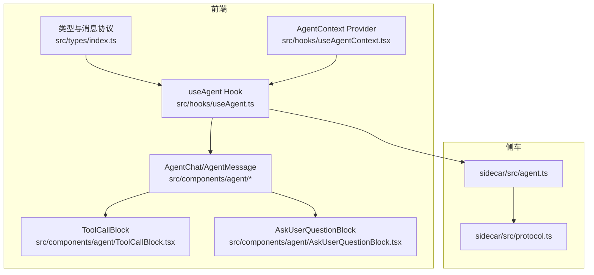
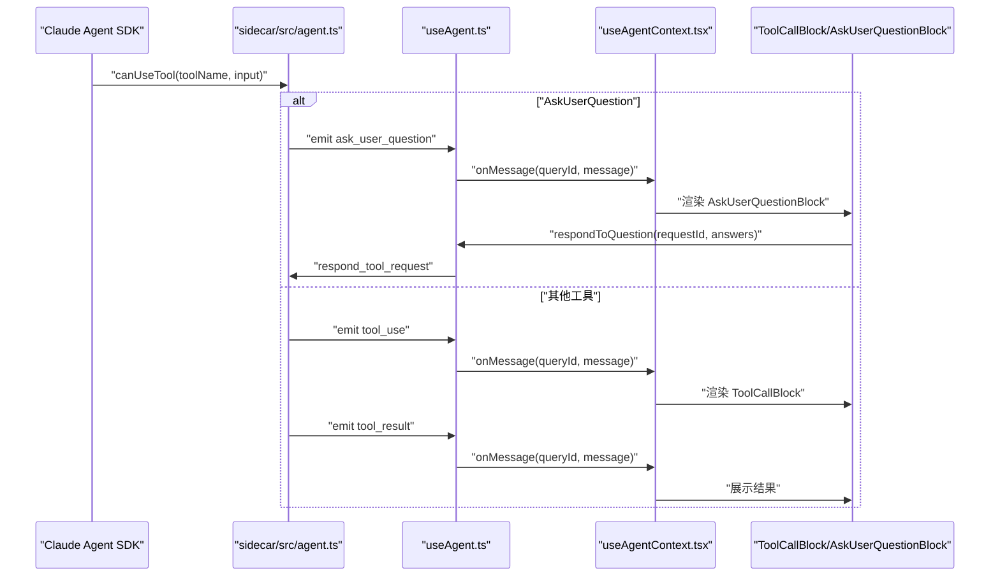
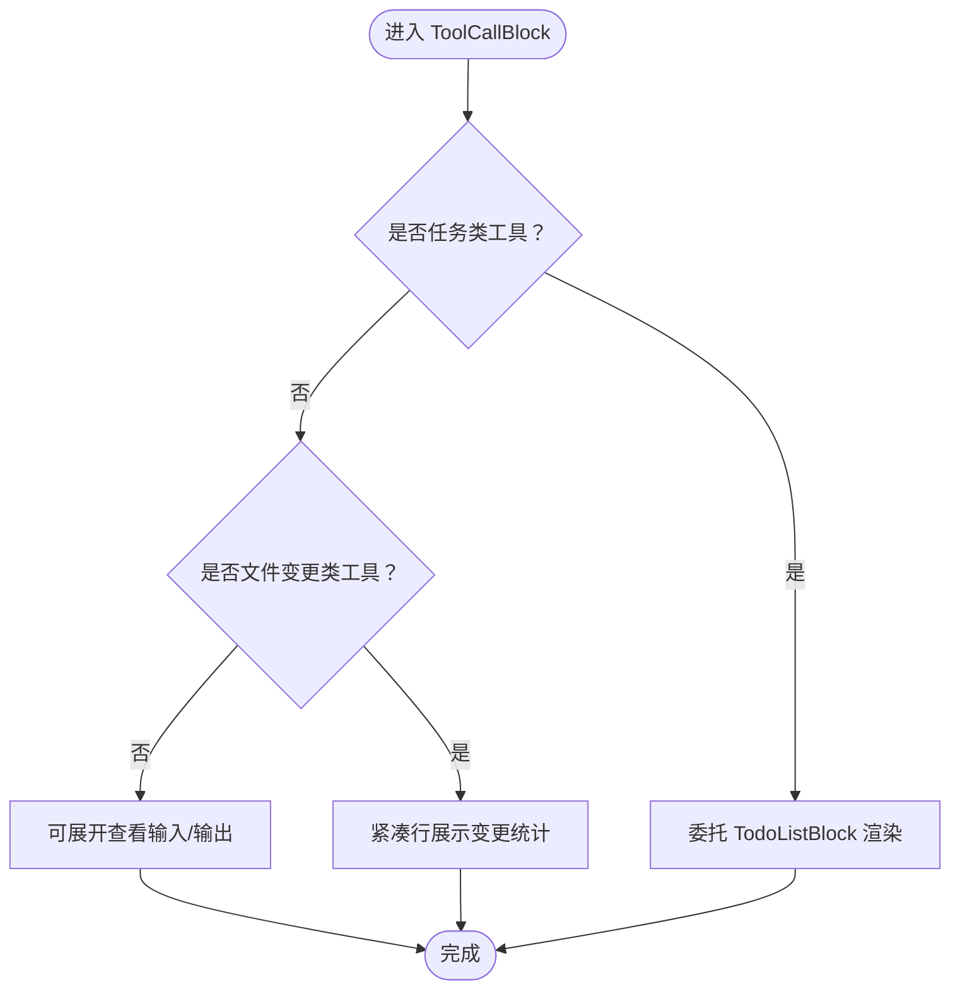
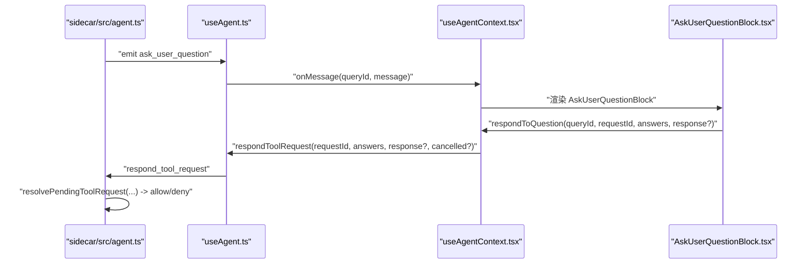
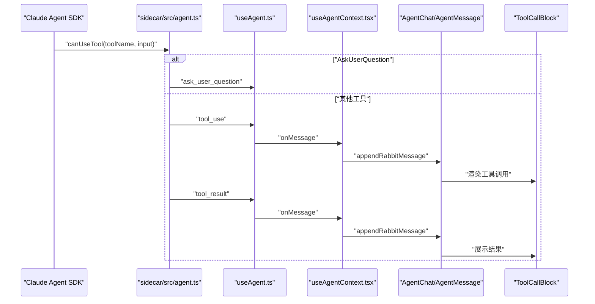
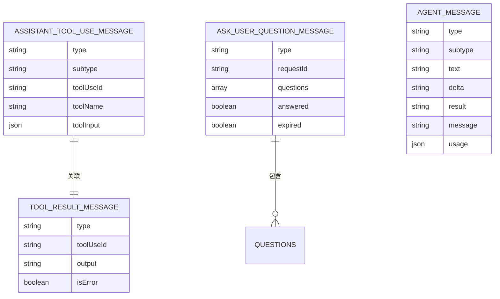
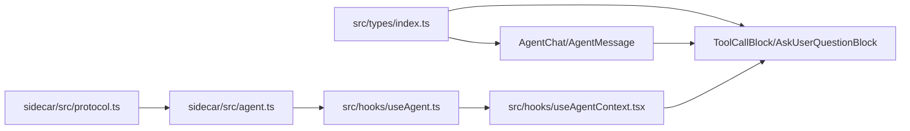

# 工具调用机制

<cite>
**本文引用的文件**
- [ToolCallBlock.tsx](file://src/components/agent/ToolCallBlock.tsx)
- [AskUserQuestionBlock.tsx](file://src/components/agent/AskUserQuestionBlock.tsx)
- [types/index.ts](file://src/types/index.ts)
- [useAgent.ts](file://src/hooks/useAgent.ts)
- [useAgentContext.tsx](file://src/hooks/useAgentContext.tsx)
- [agent.ts](file://sidecar/src/agent.ts)
- [protocol.ts](file://sidecar/src/protocol.ts)
- [todoUtils.ts](file://src/components/agent/todoUtils.ts)
- [AgentChat.tsx](file://src/components/agent/AgentChat.tsx)
- [AgentMessage.tsx](file://src/components/agent/AgentMessage.tsx)
</cite>

## 目录
1. [简介](#简介)
2. [项目结构](#项目结构)
3. [核心组件](#核心组件)
4. [架构总览](#架构总览)
5. [详细组件分析](#详细组件分析)
6. [依赖关系分析](#依赖关系分析)
7. [性能考量](#性能考量)
8. [故障排查指南](#故障排查指南)
9. [结论](#结论)
10. [附录](#附录)

## 简介
本文件面向工具调用机制，系统性阐述触发条件、消息格式、执行流程、结果处理与安全控制。重点包括：
- ToolCallBlock 的实现原理、工具参数解析、执行结果处理
- AskUserQuestion 交互机制、用户问答处理、响应验证流程
- 从发起、执行到结果返回的完整链路
- 安全机制、权限控制、错误处理策略
- 工具扩展开发指南与最佳实践

## 项目结构
围绕工具调用机制的关键模块分布如下：
- 前端类型与消息协议：src/types/index.ts
- 前端侧车桥接与事件监听：src/hooks/useAgent.ts
- 前端上下文与消息路由：src/hooks/useAgentContext.tsx
- 前端 UI 组件：src/components/agent/*
- 侧车（Rust/Node）实现：sidecar/src/agent.ts、sidecar/src/protocol.ts

图表来源
- [types/index.ts:82-102](file://src/types/index.ts#L82-L102)
- [useAgent.ts:106-177](file://src/hooks/useAgent.ts#L106-L177)
- [useAgentContext.tsx:88-193](file://src/hooks/useAgentContext.tsx#L88-L193)
- [ToolCallBlock.tsx:135-200](file://src/components/agent/ToolCallBlock.tsx#L135-L200)
- [AskUserQuestionBlock.tsx:21-138](file://src/components/agent/AskUserQuestionBlock.tsx#L21-L138)
- [agent.ts:470-497](file://sidecar/src/agent.ts#L470-L497)
- [protocol.ts:167-173](file://sidecar/src/protocol.ts#L167-L173)

章节来源
- [types/index.ts:82-102](file://src/types/index.ts#L82-L102)
- [useAgent.ts:106-177](file://src/hooks/useAgent.ts#L106-L177)
- [useAgentContext.tsx:88-193](file://src/hooks/useAgentContext.tsx#L88-L193)
- [ToolCallBlock.tsx:135-200](file://src/components/agent/ToolCallBlock.tsx#L135-L200)
- [AskUserQuestionBlock.tsx:21-138](file://src/components/agent/AskUserQuestionBlock.tsx#L21-L138)
- [agent.ts:470-497](file://sidecar/src/agent.ts#L470-L497)
- [protocol.ts:167-173](file://sidecar/src/protocol.ts#L167-L173)

## 核心组件
- 工具调用消息与结果消息类型定义
- 前端侧车桥接与事件监听
- 工具调用 UI 展示与交互
- AskUserQuestion 交互 UI 与上下文路由
- 侧车工具权限决策与执行流程

章节来源
- [types/index.ts:159-174](file://src/types/index.ts#L159-L174)
- [useAgent.ts:106-177](file://src/hooks/useAgent.ts#L106-L177)
- [ToolCallBlock.tsx:135-200](file://src/components/agent/ToolCallBlock.tsx#L135-L200)
- [AskUserQuestionBlock.tsx:21-138](file://src/components/agent/AskUserQuestionBlock.tsx#L21-L138)
- [agent.ts:254-289](file://sidecar/src/agent.ts#L254-L289)

## 架构总览
工具调用从 Claude Agent SDK 触发，经 sidecar 转换为 JSON-lines 流式消息，前端 useAgent 监听事件并分发到 AgentContext，UI 组件根据消息类型渲染 ToolCallBlock 或 AskUserQuestionBlock。

图表来源
- [agent.ts:254-289](file://sidecar/src/agent.ts#L254-L289)
- [agent.ts:502-543](file://sidecar/src/agent.ts#L502-L543)
- [useAgent.ts:262-320](file://src/hooks/useAgent.ts#L262-L320)
- [useAgentContext.tsx:168-171](file://src/hooks/useAgentContext.tsx#L168-L171)
- [AskUserQuestionBlock.tsx:58-73](file://src/components/agent/AskUserQuestionBlock.tsx#L58-L73)
- [ToolCallBlock.tsx:135-200](file://src/components/agent/ToolCallBlock.tsx#L135-L200)

## 详细组件分析

### ToolCallBlock 组件
- 功能职责
  - 展示工具调用（Read、Write、Edit、Bash、Glob、Grep、WebSearch、WebFetch 等）
  - 文件变更类工具（Write/Edit/SearchReplace）以紧凑行展示增删行数
  - 非文件变更类工具支持展开查看输入与结果
  - 任务类工具（TodoWrite/TaskCreate/TaskUpdate）委托 TodoListBlock 处理
- 参数解析与摘要
  - 依据工具名从输入对象提取摘要（如文件路径、命令、查询等）
  - 文件变更计算新增/删除行数，区分 Add/Modify
- 结果处理
  - 若存在 tool_result，展示输出内容并截断过长文本
  - 错误状态高亮提示

图表来源
- [ToolCallBlock.tsx:135-200](file://src/components/agent/ToolCallBlock.tsx#L135-L200)
- [todoUtils.ts:10-13](file://src/components/agent/todoUtils.ts#L10-L13)

章节来源
- [ToolCallBlock.tsx:135-200](file://src/components/agent/ToolCallBlock.tsx#L135-L200)
- [todoUtils.ts:10-13](file://src/components/agent/todoUtils.ts#L10-L13)

### AskUserQuestion 交互机制
- 触发与等待
  - 侧车在 canUseTool 中识别 AskUserQuestion，向前端发送 ask_user_question 消息
  - 侧车为每个 AskUserQuestion 生成 requestId 并设置 5 分钟超时
- 前端处理
  - useAgentContext 将 ask_user_question 追加到消息列表
  - AskUserQuestionBlock 渲染问题列表，支持单选/多选与自由文本
  - 用户提交后，前端调用 respondToQuestion，发送 respond_tool_request
- 响应验证
  - 侧车 resolvePendingToolRequest 将 answers 与可选 response 注入工具输入
  - 超时或取消时拒绝请求并返回 deny

图表来源
- [agent.ts:502-543](file://sidecar/src/agent.ts#L502-L543)
- [agent.ts:548-573](file://sidecar/src/agent.ts#L548-L573)
- [useAgent.ts:248-256](file://src/hooks/useAgent.ts#L248-L256)
- [useAgentContext.tsx:244-269](file://src/hooks/useAgentContext.tsx#L244-L269)
- [AskUserQuestionBlock.tsx:58-73](file://src/components/agent/AskUserQuestionBlock.tsx#L58-L73)

章节来源
- [AskUserQuestionBlock.tsx:21-138](file://src/components/agent/AskUserQuestionBlock.tsx#L21-L138)
- [useAgentContext.tsx:244-269](file://src/hooks/useAgentContext.tsx#L244-L269)
- [agent.ts:502-573](file://sidecar/src/agent.ts#L502-L573)

### 工具调用执行流程（从触发到结果）
- 触发条件
  - SDK 在 canUseTool 中对工具进行权限决策
  - AskUserQuestion 特殊处理：发消息到前端等待用户回答
  - 其他工具：直接放行（behavior: allow）
- 执行与消息转换
  - 侧车将 SDK 的 assistant/tool_use/tool_result 转换为 JSON-lines 消息
  - 前端 useAgent 监听事件，分类思考态/文本态，维护看门狗
  - AgentContext 将消息分发到 UI 组件
- 结果处理
  - ToolCallBlock 展示 tool_use 与 tool_result
  - AgentChat/AgentMessage 负责消息分组与展示

图表来源
- [agent.ts:254-289](file://sidecar/src/agent.ts#L254-L289)
- [agent.ts:205-236](file://sidecar/src/agent.ts#L205-L236)
- [useAgent.ts:262-320](file://src/hooks/useAgent.ts#L262-L320)
- [useAgentContext.tsx:104-171](file://src/hooks/useAgentContext.tsx#L104-L171)
- [AgentChat.tsx:38-69](file://src/components/agent/AgentChat.tsx#L38-L69)
- [AgentMessage.tsx:32-41](file://src/components/agent/AgentMessage.tsx#L32-L41)
- [ToolCallBlock.tsx:135-200](file://src/components/agent/ToolCallBlock.tsx#L135-L200)

章节来源
- [agent.ts:205-236](file://sidecar/src/agent.ts#L205-L236)
- [useAgent.ts:262-320](file://src/hooks/useAgent.ts#L262-L320)
- [useAgentContext.tsx:104-171](file://src/hooks/useAgentContext.tsx#L104-L171)
- [AgentChat.tsx:38-69](file://src/components/agent/AgentChat.tsx#L38-L69)
- [AgentMessage.tsx:32-41](file://src/components/agent/AgentMessage.tsx#L32-L41)

### 消息格式与数据模型
- 工具调用消息
  - AssistantToolUseMessage：包含 toolUseId、toolName、toolInput
- 工具结果消息
  - ToolResultMessage：包含 toolUseId、output、isError
- AskUserQuestion 消息
  - AskUserQuestionMessage：包含 requestId、questions、answered/expired 等前端状态
- 其他消息类型
  - Text/Thinking 流式增量、最终结果、错误、压缩状态等

图表来源
- [types/index.ts:159-174](file://src/types/index.ts#L159-L174)
- [types/index.ts:262-272](file://src/types/index.ts#L262-L272)
- [protocol.ts:167-173](file://sidecar/src/protocol.ts#L167-L173)

章节来源
- [types/index.ts:159-174](file://src/types/index.ts#L159-L174)
- [types/index.ts:262-272](file://src/types/index.ts#L262-L272)
- [protocol.ts:167-173](file://sidecar/src/protocol.ts#L167-L173)

## 依赖关系分析
- 前端类型与消息协议
  - 前端组件与上下文依赖 src/types/index.ts 中的 AgentMessage 联合类型
- 侧车协议
  - sidecar/src/protocol.ts 定义 ToolResultMessage 等消息结构
- 事件监听与消息分发
  - useAgent.ts 通过 Tauri 事件监听 agent:message，分发到 useAgentContext.tsx
- UI 渲染
  - AgentChat/AgentMessage 负责消息分组与展示，ToolCallBlock/AskUserQuestionBlock 负责具体组件渲染

图表来源
- [types/index.ts:82-102](file://src/types/index.ts#L82-L102)
- [protocol.ts:167-173](file://sidecar/src/protocol.ts#L167-L173)
- [agent.ts:75-78](file://sidecar/src/agent.ts#L75-L78)
- [useAgent.ts:262-320](file://src/hooks/useAgent.ts#L262-L320)
- [useAgentContext.tsx:88-193](file://src/hooks/useAgentContext.tsx#L88-L193)

章节来源
- [types/index.ts:82-102](file://src/types/index.ts#L82-L102)
- [protocol.ts:167-173](file://sidecar/src/protocol.ts#L167-L173)
- [agent.ts:75-78](file://sidecar/src/agent.ts#L75-L78)
- [useAgent.ts:262-320](file://src/hooks/useAgent.ts#L262-L320)
- [useAgentContext.tsx:88-193](file://src/hooks/useAgentContext.tsx#L88-L193)

## 性能考量
- 流式增量与看门狗
  - useAgent.ts 对 assistant/thinking/text/tool_use 等消息进行分类，维持 query 级别的看门狗
  - 思考态使用更宽松阈值，避免误判
- UI 渲染优化
  - ToolCallBlock 对结果输出进行截断，避免大文本影响渲染性能
  - 任务类工具委托 TodoListBlock，减少 ToolCallBlock 的复杂度
- 侧车消息转换
  - 仅提取 tool_use/tool_result，text/thinking 已通过 delta 流式发送，降低前端处理压力

章节来源
- [useAgent.ts:66-95](file://src/hooks/useAgent.ts#L66-L95)
- [ToolCallBlock.tsx:188-191](file://src/components/agent/ToolCallBlock.tsx#L188-L191)
- [agent.ts:146-199](file://sidecar/src/agent.ts#L146-L199)
- [agent.ts:205-236](file://sidecar/src/agent.ts#L205-L236)

## 故障排查指南
- 侧车进程退出
  - useAgent.ts 在 agent:sidecar-exit 事件中统一收敛为 error，避免 UI 永远 loading
- 查询超时
  - 看门狗触发 onQueryTimeout，区分思考态与正常态阈值
- AskUserQuestion 未响应
  - 侧车 5 分钟超时自动 deny，前端可取消请求
- 取消查询
  - cancelQuery 同时标记已取消并发送取消命令，清理 pending tool requests

章节来源
- [useAgent.ts:180-192](file://src/hooks/useAgent.ts#L180-L192)
- [useAgent.ts:83-95](file://src/hooks/useAgent.ts#L83-L95)
- [agent.ts:578-595](file://sidecar/src/agent.ts#L578-L595)
- [agent.ts:518-542](file://sidecar/src/agent.ts#L518-L542)

## 结论
工具调用机制通过前端与侧车的清晰分工实现了安全可控的工具执行与交互体验：
- 侧车负责权限决策与消息转换，前端负责事件监听与 UI 渲染
- AskUserQuestion 采用“阻塞式”交互并通过超时与取消保障稳定性
- ToolCallBlock 提供直观的工具调用与结果展示，支持任务类工具的聚合处理
- 通过看门狗、错误收敛与权限控制，整体具备良好的健壮性与安全性

## 附录

### 工具调用的发起、执行、结果返回示例（代码片段路径）
- 发起工具调用（侧车权限决策）
  - [agent.ts:254-289](file://sidecar/src/agent.ts#L254-L289)
- 执行工具（侧车转 JSON-lines）
  - [agent.ts:205-236](file://sidecar/src/agent.ts#L205-L236)
- 前端监听与分发
  - [useAgent.ts:262-320](file://src/hooks/useAgent.ts#L262-L320)
  - [useAgentContext.tsx:104-171](file://src/hooks/useAgentContext.tsx#L104-L171)
- UI 展示工具调用与结果
  - [ToolCallBlock.tsx:135-200](file://src/components/agent/ToolCallBlock.tsx#L135-L200)
- AskUserQuestion 交互
  - [AskUserQuestionBlock.tsx:58-73](file://src/components/agent/AskUserQuestionBlock.tsx#L58-L73)
  - [agent.ts:502-543](file://sidecar/src/agent.ts#L502-L543)
  - [agent.ts:548-573](file://sidecar/src/agent.ts#L548-L573)

### 安全机制与权限控制
- 工具白名单与权限模式
  - allowedTools、permissionMode 由 AgentQueryOptions 控制
- AskUserQuestion 特殊处理
  - 仅在前端等待用户确认，否则一律阻断
- 侧车隔离
  - settingSources 置空，CLAUDE_CONFIG_DIR 指向应用专用空目录，避免全局资源污染

章节来源
- [types/index.ts:285-292](file://src/types/index.ts#L285-L292)
- [agent.ts:255-302](file://sidecar/src/agent.ts#L255-L302)

### 错误处理策略
- 终态消息清除看门狗与思考态标记
- 取消查询时清理 pending tool requests
- 侧车异常统一转为 error/result，前端收敛为 error

章节来源
- [useAgent.ts:272-284](file://src/hooks/useAgent.ts#L272-L284)
- [agent.ts:439-464](file://sidecar/src/agent.ts#L439-L464)
- [agent.ts:578-595](file://sidecar/src/agent.ts#L578-L595)

### 工具扩展开发指南与最佳实践
- 新增工具步骤
  - 在前端 types/index.ts 中定义工具消息类型（若需要）
  - 在侧车 protocol.ts 中定义对应消息结构（若需要）
  - 在 sidecar/src/agent.ts 的 canUseTool 中添加权限判断与必要处理
  - 在前端 UI 中新增或复用 ToolCallBlock 展示逻辑
- 参数解析与摘要
  - 参考 ToolCallBlock 的 getToolSummary 与 computeFileChange，确保输入解析与摘要展示一致
- 交互与验证
  - 对需要用户确认的工具，优先采用 AskUserQuestion 模式，并设置合理超时
- 性能与健壮性
  - 对大输出进行截断展示
  - 使用看门狗与错误收敛，避免 UI 卡顿与资源泄漏

章节来源
- [ToolCallBlock.tsx:56-100](file://src/components/agent/ToolCallBlock.tsx#L56-L100)
- [agent.ts:254-289](file://sidecar/src/agent.ts#L254-L289)
- [types/index.ts:159-174](file://src/types/index.ts#L159-L174)
- [protocol.ts:167-173](file://sidecar/src/protocol.ts#L167-L173)