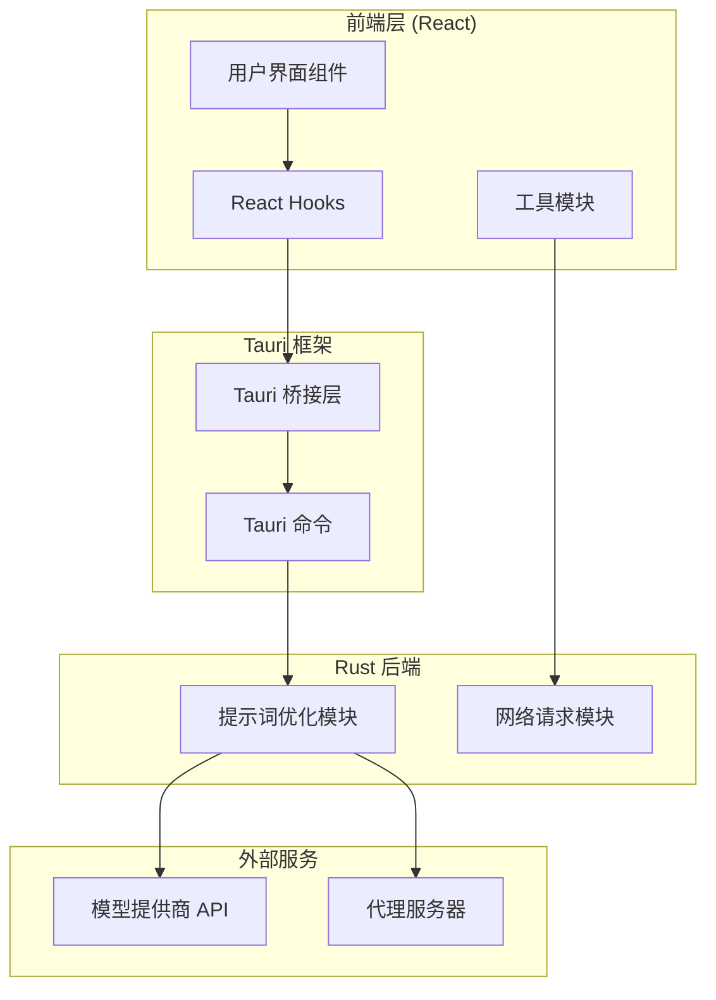
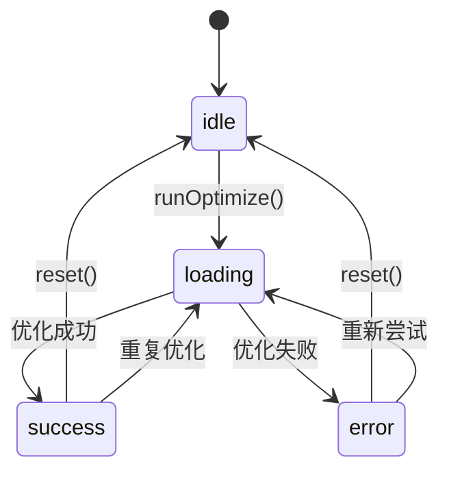
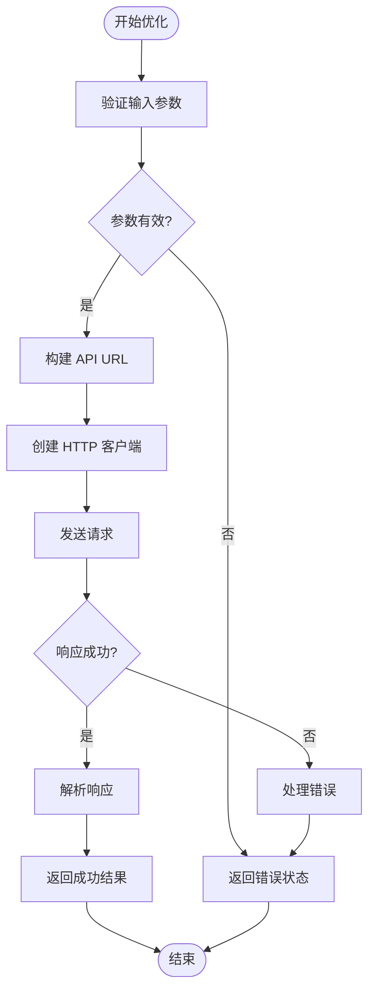
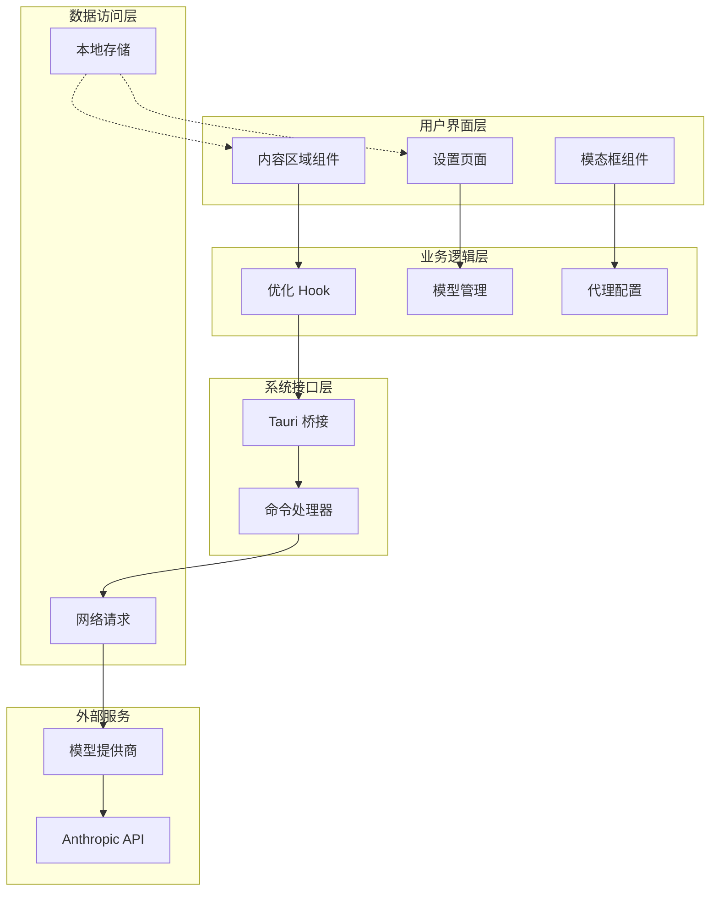
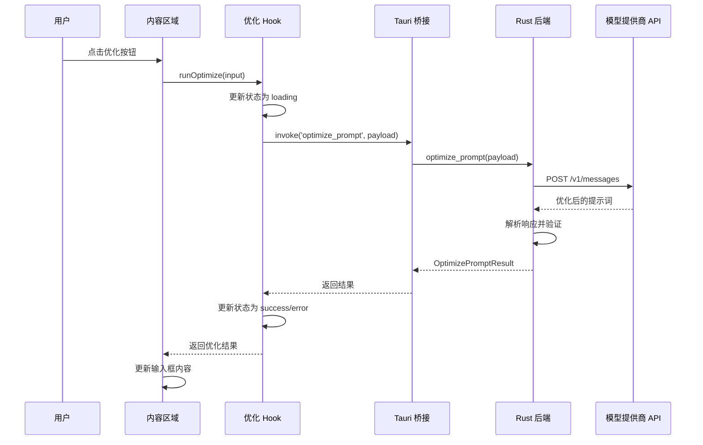
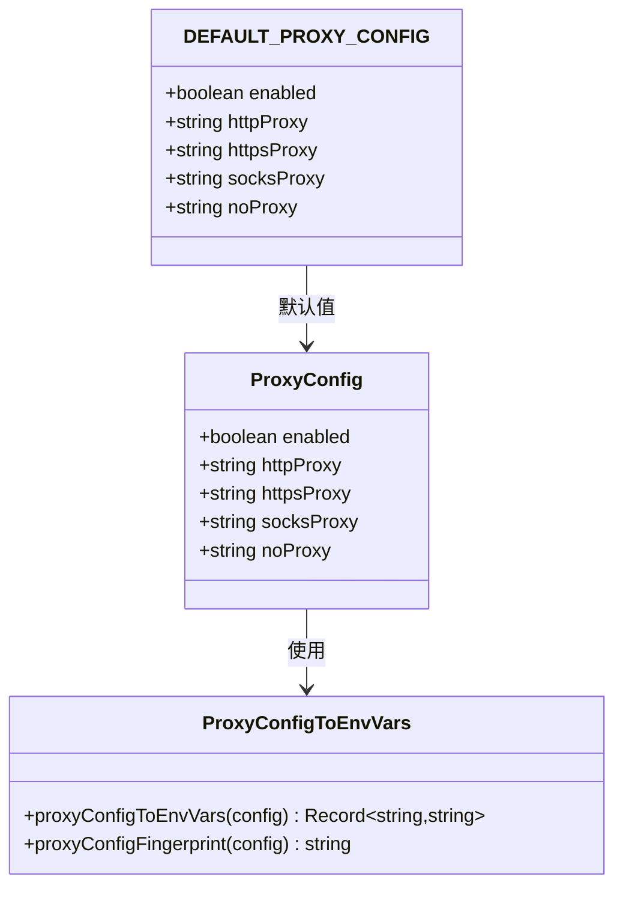

# 提示优化系统

<cite>
**本文档引用的文件**
- [README.md](file://README.md)
- [src/hooks/useOptimizePrompt.ts](file://src/hooks/useOptimizePrompt.ts)
- [src-tauri/src/prompt_optimize.rs](file://src-tauri/src/prompt_optimize.rs)
- [src-tauri/src/lib.rs](file://src-tauri/src/lib.rs)
- [src-tauri/src/main.rs](file://src-tauri/src/main.rs)
- [src-tauri/Cargo.toml](file://src-tauri/Cargo.toml)
- [src/types/index.ts](file://src/types/index.ts)
- [src/components/ContentArea.tsx](file://src/components/ContentArea.tsx)
- [src/components/settings/ModelsPanel.tsx](file://src/components/settings/ModelsPanel.tsx)
- [src/components/settings/ModelEditModal.tsx](file://src/components/settings/ModelEditModal.tsx)
- [src/components/settings/AdvancedPanel.tsx](file://src/components/settings/AdvancedPanel.tsx)
- [src/constants/providers.ts](file://src/constants/providers.ts)
- [src/utils/proxy.ts](file://src/utils/proxy.ts)
- [src/components/settings/SettingsPage.tsx](file://src/components/settings/SettingsPage.tsx)
</cite>

## 目录
1. [简介](#简介)
2. [项目结构](#项目结构)
3. [核心组件](#核心组件)
4. [架构概览](#架构概览)
5. [详细组件分析](#详细组件分析)
6. [依赖关系分析](#依赖关系分析)
7. [性能考虑](#性能考虑)
8. [故障排除指南](#故障排除指南)
9. [结论](#结论)

## 简介

提示优化系统是一个基于 Tauri + React + TypeScript 构建的智能提示词优化工具。该系统允许用户通过厂商兼容的 Anthropic Messages API 将原始的、模糊的提示词转换为清晰、结构化、可执行的优化提示词。

系统的核心特性包括：
- 直接调用厂商 API 进行提示词优化
- 支持多种模型提供商（GLM、Minimax、阿里云、Kimi、DeepSeek）
- 实时状态管理和错误处理
- 代理配置支持
- 一键优化功能集成到聊天界面

## 项目结构

该项目采用现代化的前端框架架构，结合 Rust 后端提供高性能的系统调用能力：



**图表来源**
- [src-tauri/src/lib.rs:657-800](file://src-tauri/src/lib.rs#L657-L800)
- [src-tauri/src/prompt_optimize.rs:1-245](file://src-tauri/src/prompt_optimize.rs#L1-L245)

**章节来源**
- [README.md:1-8](file://README.md#L1-L8)
- [src-tauri/Cargo.toml:1-41](file://src-tauri/Cargo.toml#L1-L41)

## 核心组件

### 提示优化 Hook (useOptimizePrompt)

`useOptimizePrompt` 是系统的核心 Hook，负责封装提示词优化的调用与状态管理：



**图表来源**
- [src/hooks/useOptimizePrompt.ts:14-20](file://src/hooks/useOptimizePrompt.ts#L14-L20)

### 提示词优化命令 (optimize_prompt)

Rust 后端实现了完整的提示词优化逻辑，包括参数验证、HTTP 请求处理和错误恢复：



**图表来源**
- [src-tauri/src/prompt_optimize.rs:86-235](file://src-tauri/src/prompt_optimize.rs#L86-L235)

**章节来源**
- [src/hooks/useOptimizePrompt.ts:1-78](file://src/hooks/useOptimizePrompt.ts#L1-L78)
- [src-tauri/src/prompt_optimize.rs:1-245](file://src-tauri/src/prompt_optimize.rs#L1-L245)

## 架构概览

系统采用分层架构设计，确保前后端分离和职责明确：



**图表来源**
- [src/components/ContentArea.tsx:129-152](file://src/components/ContentArea.tsx#L129-L152)
- [src-tauri/src/lib.rs:657-800](file://src-tauri/src/lib.rs#L657-L800)

## 详细组件分析

### 提示词优化流程

系统的核心优化流程如下：



**图表来源**
- [src/components/ContentArea.tsx:135-152](file://src/components/ContentArea.tsx#L135-L152)
- [src/hooks/useOptimizePrompt.ts:44-71](file://src/hooks/useOptimizePrompt.ts#L44-L71)
- [src-tauri/src/prompt_optimize.rs:86-192](file://src-tauri/src/prompt_optimize.rs#L86-L192)

### 模型配置管理系统

系统支持多种模型提供商的配置管理：

| 厂商 | 基础 URL | 默认模型 | API 密钥环境变量 |
|------|----------|----------|-------------------|
| GLM | https://open.bigmodel.cn/api/anthropic | glm-5.1 | ANTHROPIC_API_KEY |
| Minimax | https://api.minimaxi.com/anthropic | MiniMax-M3 | ANTHROPIC_API_KEY |
| 阿里云 | https://coding.dashscope.aliyuncs.com/apps/anthropic | glm-5 | ANTHROPIC_API_KEY |
| Kimi | https://api.kimi.com/coding | kimi-for-coding | ANTHROPIC_API_KEY |
| DeepSeek | https://api.deepseek.com/v1/ | deepseek-v4-pro | ANTHROPIC_API_KEY |
| 自定义 | 空 | 空 | ANTHROPIC_API_KEY |

**章节来源**
- [src/constants/providers.ts:14-57](file://src/constants/providers.ts#L14-L57)
- [src/components/settings/ModelsPanel.tsx:1-148](file://src/components/settings/ModelsPanel.tsx#L1-L148)

### 代理配置系统

系统提供了灵活的代理配置支持：



**图表来源**
- [src/utils/proxy.ts:1-62](file://src/utils/proxy.ts#L1-L62)
- [src-tauri/src/prompt_optimize.rs:1-245](file://src-tauri/src/prompt_optimize.rs#L1-L245)

**章节来源**
- [src/utils/proxy.ts:1-62](file://src/utils/proxy.ts#L1-L62)
- [src/components/settings/AdvancedPanel.tsx:1-101](file://src/components/settings/AdvancedPanel.tsx#L1-L101)

## 依赖关系分析

系统的关键依赖关系如下：

```mermaid
graph TD
subgraph "前端依赖"
React[React 18+]
TauriAPI[@tauri-apps/api]
Lucide[Lucide Icons]
Zustand[Zustand 状态管理]
end
subgraph "Rust 依赖"
Tauri[Tauri 2.0]
Reqwest[Reqwest HTTP]
Serde[Serde JSON]
Tokio[Tokio 异步]
end
subgraph "开发工具"
Vite[Vite 构建]
TypeScript[TypeScript]
ESLint[ESLint]
Prettier[Prettier]
end
React --> TauriAPI
TauriAPI --> Tauri
Tauri --> Reqwest
Reqwest --> Serde
Serde --> Tokio
```

**图表来源**
- [src-tauri/Cargo.toml:20-41](file://src-tauri/Cargo.toml#L20-L41)
- [src-tauri/src/main.rs:1-7](file://src-tauri/src/main.rs#L1-L7)

**章节来源**
- [src-tauri/Cargo.toml:1-41](file://src-tauri/Cargo.toml#L1-L41)

## 性能考虑

### 超时配置
- 请求超时时间：60 秒（适合长文本生成）
- HTTP 客户端超时：60 秒
- 错误响应体截断：最多 300 个字符

### 内存管理
- 使用 `Instant::now()` 精确测量请求耗时
- 响应体解析采用流式处理
- 错误信息进行字符边界安全截断

### 网络优化
- 支持 HTTP/HTTPS/ SOCKS 代理
- 自动检测代理配置变更
- 代理环境变量自动注入

## 故障排除指南

### 常见错误类型

| 错误类型 | HTTP 状态码 | 描述 | 解决方案 |
|----------|-------------|------|----------|
| 认证失败 | 401/403 | API Key 错误或权限不足 | 检查 API Key 配置 |
| 端点不存在 | 404 | Base URL 配置错误 | 验证厂商 API 地址 |
| 请求被拒绝 | 400 | 参数非法或模型不存在 | 检查模型 ID 和参数 |
| 请求过于频繁 | 429 | 触发限流 | 等待后重试或升级套餐 |
| 服务端错误 | 500-599 | 服务器内部错误 | 稍后重试或联系服务商 |

### 调试步骤

1. **检查模型配置**
   - 确认 API Key 有效
   - 验证 Base URL 正确性
   - 检查模型 ID 是否存在

2. **网络诊断**
   - 测试代理配置
   - 检查防火墙设置
   - 验证网络连接

3. **日志分析**
   - 查看前端控制台错误
   - 检查 Rust 后端日志
   - 分析请求响应详情

**章节来源**
- [src-tauri/src/prompt_optimize.rs:201-234](file://src-tauri/src/prompt_optimize.rs#L201-L234)

## 结论

提示优化系统通过精心设计的架构和完善的错误处理机制，为用户提供了一个强大而可靠的提示词优化工具。系统的主要优势包括：

1. **高性能**：直接调用厂商 API，避免中间层开销
2. **可靠性**：完整的错误处理和状态管理
3. **易用性**：直观的用户界面和一键优化功能
4. **扩展性**：支持多种模型提供商和自定义配置
5. **安全性**：本地存储敏感信息，网络请求经过严格验证

该系统为开发者提供了一个高效的提示词优化解决方案，能够显著提升与 AI 模型交互的质量和效率。