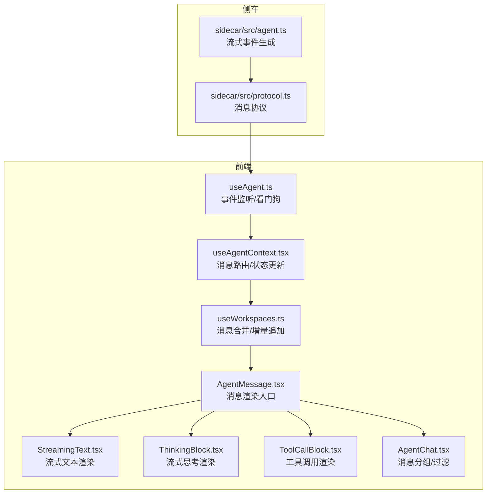
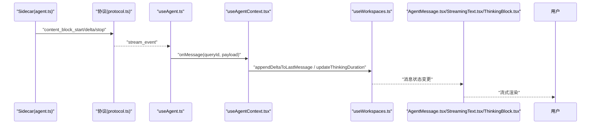
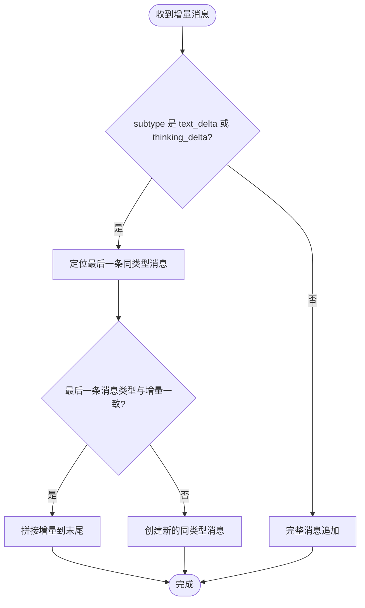
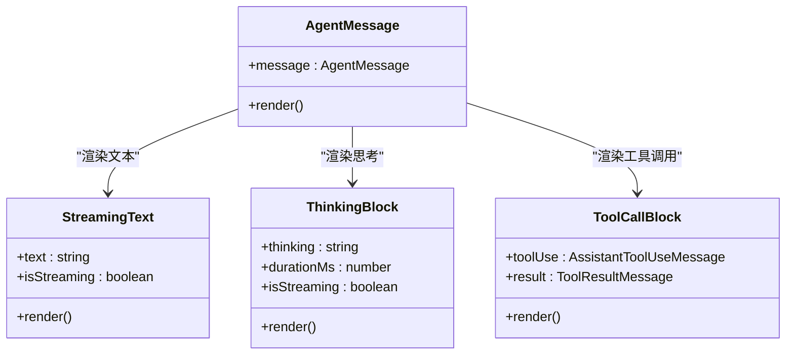
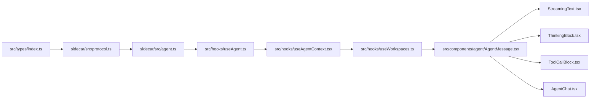

# 流式响应处理机制

<cite>
**本文引用的文件**
- [StreamingText.tsx](file://src/components/agent/StreamingText.tsx)
- [ThinkingBlock.tsx](file://src/components/agent/ThinkingBlock.tsx)
- [ToolCallBlock.tsx](file://src/components/agent/ToolCallBlock.tsx)
- [AgentMessage.tsx](file://src/components/agent/AgentMessage.tsx)
- [AgentChat.tsx](file://src/components/agent/AgentChat.tsx)
- [useAgent.ts](file://src/hooks/useAgent.ts)
- [useAgentContext.tsx](file://src/hooks/useAgentContext.tsx)
- [useWorkspaces.ts](file://src/hooks/useWorkspaces.ts)
- [types/index.ts](file://src/types/index.ts)
- [protocol.ts](file://sidecar/src/protocol.ts)
- [agent.ts](file://sidecar/src/agent.ts)
</cite>

## 目录
1. [简介](#简介)
2. [项目结构](#项目结构)
3. [核心组件](#核心组件)
4. [架构总览](#架构总览)
5. [详细组件分析](#详细组件分析)
6. [依赖关系分析](#依赖关系分析)
7. [性能考量](#性能考量)
8. [故障排查指南](#故障排查指南)
9. [结论](#结论)

## 简介
本文件系统性阐述流式响应处理机制，聚焦以下目标：
- 解释流式增量消息的接收、解析与渲染流程
- 深入说明 AssistantTextDeltaMessage 与 AssistantThinkingDeltaMessage 的解析与合并规则
- 描述流式文本渲染算法、实时更新策略与消息合并策略
- 对比流式响应与完整消息的差异、处理优先级与状态同步机制
- 提供性能优化技巧、内存管理策略与用户体验优化方案
- 给出常见问题排查与调试方法

## 项目结构
围绕流式响应的关键模块分布如下：
- 前端类型与消息协议：src/types/index.ts、sidecar/src/protocol.ts
- 侧车（Sidecar）消息生成：sidecar/src/agent.ts
- 前端事件监听与状态管理：src/hooks/useAgent.ts、src/hooks/useAgentContext.tsx、src/hooks/useWorkspaces.ts
- 渲染组件：src/components/agent/StreamingText.tsx、ThinkingBlock.tsx、ToolCallBlock.tsx、AgentMessage.tsx、AgentChat.tsx

图表来源
- [useAgent.ts:262-320](file://src/hooks/useAgent.ts#L262-L320)
- [useAgentContext.tsx:104-178](file://src/hooks/useAgentContext.tsx#L104-L178)
- [useWorkspaces.ts:404-449](file://src/hooks/useWorkspaces.ts#L404-L449)
- [AgentMessage.tsx:43-142](file://src/components/agent/AgentMessage.tsx#L43-L142)
- [StreamingText.tsx:44-66](file://src/components/agent/StreamingText.tsx#L44-L66)
- [ThinkingBlock.tsx:22-84](file://src/components/agent/ThinkingBlock.tsx#L22-L84)
- [ToolCallBlock.tsx:135-201](file://src/components/agent/ToolCallBlock.tsx#L135-L201)
- [AgentChat.tsx:38-69](file://src/components/agent/AgentChat.tsx#L38-L69)
- [protocol.ts:131-156](file://sidecar/src/protocol.ts#L131-L156)
- [agent.ts:166-198](file://sidecar/src/agent.ts#L166-L198)

章节来源
- [useAgent.ts:262-320](file://src/hooks/useAgent.ts#L262-L320)
- [useAgentContext.tsx:104-178](file://src/hooks/useAgentContext.tsx#L104-L178)
- [useWorkspaces.ts:404-449](file://src/hooks/useWorkspaces.ts#L404-L449)
- [AgentMessage.tsx:43-142](file://src/components/agent/AgentMessage.tsx#L43-L142)
- [StreamingText.tsx:44-66](file://src/components/agent/StreamingText.tsx#L44-L66)
- [ThinkingBlock.tsx:22-84](file://src/components/agent/ThinkingBlock.tsx#L22-L84)
- [ToolCallBlock.tsx:135-201](file://src/components/agent/ToolCallBlock.tsx#L135-L201)
- [AgentChat.tsx:38-69](file://src/components/agent/AgentChat.tsx#L38-L69)
- [protocol.ts:131-156](file://sidecar/src/protocol.ts#L131-L156)
- [agent.ts:166-198](file://sidecar/src/agent.ts#L166-L198)

## 核心组件
- AssistantTextDeltaMessage 与 AssistantThinkingDeltaMessage：分别承载流式文本与思考的增量片段
- useAgent：负责与 Sidecar 通信、事件监听、看门狗（超时保护）、消息分类
- useAgentContext：根据消息类型进行路由与状态更新
- useWorkspaces：负责消息合并、增量追加、思考时长更新
- 渲染组件：StreamingText、ThinkingBlock、ToolCallBlock、AgentMessage、AgentChat

章节来源
- [types/index.ts:115-140](file://src/types/index.ts#L115-L140)
- [protocol.ts:131-156](file://sidecar/src/protocol.ts#L131-L156)
- [useAgent.ts:23-37](file://src/hooks/useAgent.ts#L23-L37)
- [useAgentContext.tsx:104-178](file://src/hooks/useAgentContext.tsx#L104-L178)
- [useWorkspaces.ts:404-503](file://src/hooks/useWorkspaces.ts#L404-L503)
- [StreamingText.tsx:44-66](file://src/components/agent/StreamingText.tsx#L44-L66)
- [ThinkingBlock.tsx:22-84](file://src/components/agent/ThinkingBlock.tsx#L22-L84)
- [ToolCallBlock.tsx:135-201](file://src/components/agent/ToolCallBlock.tsx#L135-L201)
- [AgentMessage.tsx:43-142](file://src/components/agent/AgentMessage.tsx#L43-L142)
- [AgentChat.tsx:38-69](file://src/components/agent/AgentChat.tsx#L38-L69)

## 架构总览
流式响应从 Sidecar 产生，经前端事件通道到达 useAgent，再由 useAgentContext 路由到 useWorkspaces，最终驱动渲染组件更新 UI。

图表来源
- [agent.ts:166-198](file://sidecar/src/agent.ts#L166-L198)
- [protocol.ts:131-156](file://sidecar/src/protocol.ts#L131-L156)
- [useAgent.ts:262-320](file://src/hooks/useAgent.ts#L262-L320)
- [useAgentContext.tsx:104-178](file://src/hooks/useAgentContext.tsx#L104-L178)
- [useWorkspaces.ts:404-449](file://src/hooks/useWorkspaces.ts#L404-L449)
- [AgentMessage.tsx:43-142](file://src/components/agent/AgentMessage.tsx#L43-L142)
- [StreamingText.tsx:44-66](file://src/components/agent/StreamingText.tsx#L44-L66)
- [ThinkingBlock.tsx:22-84](file://src/components/agent/ThinkingBlock.tsx#L22-L84)

## 详细组件分析

### 流式增量消息解析与合并
- AssistantTextDeltaMessage 与 AssistantThinkingDeltaMessage 的解析由 Sidecar 在 content_block_start/delta/stop 事件中生成，并通过 stream_event 传递到前端
- 前端在 useAgentContext 中根据 subtype 将 text_delta/thinking_delta 路由到增量追加逻辑，其他类型（如 text/thinking/tool_use）走完整消息追加
- useWorkspaces 的 appendDeltaToLastMessage 实现了“向最后一条同类型消息追加增量文本”的合并规则：
  - 若最后一条消息与增量类型一致，则直接拼接
  - 若最后一条消息类型不同或为空，则创建新的同类型消息
- thinking_done 到达后，通过 updateThinkingDuration 将最后一条 thinking 消息的 durationMs 更新为精确值

图表来源
- [useAgentContext.tsx:114-127](file://src/hooks/useAgentContext.tsx#L114-L127)
- [useWorkspaces.ts:404-449](file://src/hooks/useWorkspaces.ts#L404-L449)

章节来源
- [agent.ts:166-198](file://sidecar/src/agent.ts#L166-L198)
- [protocol.ts:131-156](file://sidecar/src/protocol.ts#L131-L156)
- [useAgentContext.tsx:114-127](file://src/hooks/useAgentContext.tsx#L114-L127)
- [useWorkspaces.ts:404-449](file://src/hooks/useWorkspaces.ts#L404-L449)

### 流式文本渲染算法与实时更新策略
- StreamingText 基于 @ant-design/x-markdown 的流式渲染能力，通过 streaming 配置开启 hasNextChunk、enableAnimation、tail 等参数，实现“有下一帧增量”时的动画与滚动尾随
- ThinkingBlock 在流式期间以 100ms 粒度的实时计时器显示递增秒数，思考结束后切换为精确 durationMs
- ToolCallBlock 以可折叠方式展示工具调用与结果，支持文件变更类工具的增删行统计

图表来源
- [StreamingText.tsx:44-66](file://src/components/agent/StreamingText.tsx#L44-L66)
- [ThinkingBlock.tsx:22-84](file://src/components/agent/ThinkingBlock.tsx#L22-L84)
- [ToolCallBlock.tsx:135-201](file://src/components/agent/ToolCallBlock.tsx#L135-L201)
- [AgentMessage.tsx:43-142](file://src/components/agent/AgentMessage.tsx#L43-L142)

章节来源
- [StreamingText.tsx:44-66](file://src/components/agent/StreamingText.tsx#L44-L66)
- [ThinkingBlock.tsx:22-84](file://src/components/agent/ThinkingBlock.tsx#L22-L84)
- [ToolCallBlock.tsx:135-201](file://src/components/agent/ToolCallBlock.tsx#L135-L201)
- [AgentMessage.tsx:43-142](file://src/components/agent/AgentMessage.tsx#L43-L142)

### 流式响应与完整消息的区别、处理优先级与状态同步
- 区别
  - 流式响应：以增量消息（text_delta/thinking_delta）形式逐步到达，UI 需要合并与实时渲染
  - 完整消息：一次性到达的完整内容（text/thinking/tool_use），直接追加到消息列表
- 处理优先级
  - text_delta/thinking_delta：优先合并到最近同类型消息，保持渲染连续性
  - thinking_done：更新最后一条 thinking 消息的 durationMs
  - text_done：作为流式结束信号，用于 UI 状态提示（如停止滚动尾随）
  - 其他完整消息：直接追加
- 状态同步
  - useAgentContext 负责消息路由与状态更新（如 status、cost、duration、tokenUsage、compactionPhase 等）
  - useWorkspaces 负责消息合并与增量追加，确保 UI 与数据层一致

章节来源
- [useAgentContext.tsx:104-178](file://src/hooks/useAgentContext.tsx#L104-L178)
- [useWorkspaces.ts:404-503](file://src/hooks/useWorkspaces.ts#L404-L503)
- [AgentMessage.tsx:43-142](file://src/components/agent/AgentMessage.tsx#L43-L142)

### 代码示例：流式消息的接收、解析、渲染
- 接收与解析
  - useAgent 监听 agent:message 事件，解析 payload 并根据类型分类（思考态/非思考态），同时维护看门狗计时
  - useAgentContext 将 text_delta/thinking_delta 路由到增量追加，thinking_done 更新时长，其他类型完整消息追加
- 渲染
  - AgentMessage 根据 subtype 选择 StreamingText、ThinkingBlock、ToolCallBlock 等组件
  - StreamingText 通过 XMarkdown 的 streaming 配置实现流式渲染
  - ThinkingBlock 在流式期间使用实时计时器，结束后使用精确时长

章节来源
- [useAgent.ts:262-320](file://src/hooks/useAgent.ts#L262-L320)
- [useAgentContext.tsx:104-178](file://src/hooks/useAgentContext.tsx#L104-L178)
- [AgentMessage.tsx:43-142](file://src/components/agent/AgentMessage.tsx#L43-L142)
- [StreamingText.tsx:44-66](file://src/components/agent/StreamingText.tsx#L44-L66)
- [ThinkingBlock.tsx:22-84](file://src/components/agent/ThinkingBlock.tsx#L22-L84)

## 依赖关系分析
- 类型与协议
  - src/types/index.ts 与 sidecar/src/protocol.ts 定义了 AssistantTextDeltaMessage、AssistantThinkingDeltaMessage 等消息结构
- 事件链路
  - sidecar/src/agent.ts 生成流式事件并通过 protocol.ts 协议传输
  - 前端 useAgent.ts 监听事件，useAgentContext.tsx 路由消息，useWorkspaces.ts 合并与更新状态
- 渲染链路
  - AgentMessage.tsx 作为入口，调度 StreamingText、ThinkingBlock、ToolCallBlock
  - AgentChat.tsx 负责消息分组与过滤（如去重最后一个 result）

图表来源
- [types/index.ts:115-140](file://src/types/index.ts#L115-L140)
- [protocol.ts:131-156](file://sidecar/src/protocol.ts#L131-L156)
- [agent.ts:166-198](file://sidecar/src/agent.ts#L166-L198)
- [useAgent.ts:262-320](file://src/hooks/useAgent.ts#L262-L320)
- [useAgentContext.tsx:104-178](file://src/hooks/useAgentContext.tsx#L104-L178)
- [useWorkspaces.ts:404-449](file://src/hooks/useWorkspaces.ts#L404-L449)
- [AgentMessage.tsx:43-142](file://src/components/agent/AgentMessage.tsx#L43-L142)
- [StreamingText.tsx:44-66](file://src/components/agent/StreamingText.tsx#L44-L66)
- [ThinkingBlock.tsx:22-84](file://src/components/agent/ThinkingBlock.tsx#L22-L84)
- [ToolCallBlock.tsx:135-201](file://src/components/agent/ToolCallBlock.tsx#L135-L201)
- [AgentChat.tsx:38-69](file://src/components/agent/AgentChat.tsx#L38-L69)

章节来源
- [types/index.ts:115-140](file://src/types/index.ts#L115-L140)
- [protocol.ts:131-156](file://sidecar/src/protocol.ts#L131-L156)
- [agent.ts:166-198](file://sidecar/src/agent.ts#L166-L198)
- [useAgent.ts:262-320](file://src/hooks/useAgent.ts#L262-L320)
- [useAgentContext.tsx:104-178](file://src/hooks/useAgentContext.tsx#L104-L178)
- [useWorkspaces.ts:404-449](file://src/hooks/useWorkspaces.ts#L404-L449)
- [AgentMessage.tsx:43-142](file://src/components/agent/AgentMessage.tsx#L43-L142)
- [AgentChat.tsx:38-69](file://src/components/agent/AgentChat.tsx#L38-L69)

## 性能考量
- 流式渲染优化
  - 使用 XMarkdown 的 streaming 配置，仅在存在增量时触发渲染，减少不必要的重绘
  - ThinkingBlock 的 100ms 实时计时器在非流式时清空，避免无谓定时器累积
- 内存管理策略
  - 增量合并采用“就地拼接”，避免频繁创建大对象
  - 看门狗计时器按 queryId 独立管理，取消/重启时及时清理，防止内存泄漏
- 用户体验优化
  - 流式文本滚动尾随与动画增强阅读体验
  - 思考态延长超时阈值，避免长思考被误判为卡死
  - 工具调用结果截断显示，避免大输出阻塞 UI

章节来源
- [StreamingText.tsx:44-66](file://src/components/agent/StreamingText.tsx#L44-L66)
- [ThinkingBlock.tsx:22-84](file://src/components/agent/ThinkingBlock.tsx#L22-L84)
- [useAgent.ts:66-95](file://src/hooks/useAgent.ts#L66-L95)
- [useWorkspaces.ts:404-449](file://src/hooks/useWorkspaces.ts#L404-L449)

## 故障排查指南
- 无响应或长时间无消息
  - 检查 Sidecar 进程状态与事件通道是否正常
  - 查看 useAgent 的看门狗是否触发（思考态与非思考态阈值不同）
- 流式渲染异常
  - 确认 isStreaming 标志正确传递至 StreamingText
  - 检查增量消息是否按 subtype 正确合并（text_delta 与 thinking_delta）
- 思考时长不准确
  - 确保 thinking_done 消息到达后，updateThinkingDuration 已执行
- 工具调用结果未显示
  - 检查 tool_use 与 tool_result 的 toolUseId 是否匹配
  - 确认 AgentChat 的消息过滤逻辑未误删 tool_result

章节来源
- [useAgent.ts:262-320](file://src/hooks/useAgent.ts#L262-L320)
- [useAgentContext.tsx:104-178](file://src/hooks/useAgentContext.tsx#L104-L178)
- [useWorkspaces.ts:404-503](file://src/hooks/useWorkspaces.ts#L404-L503)
- [AgentChat.tsx:38-69](file://src/components/agent/AgentChat.tsx#L38-L69)

## 结论
本机制通过 Sidecar 生成流式增量消息，前端以 useAgent 事件监听为核心，结合 useAgentContext 与 useWorkspaces 的消息路由与合并策略，最终由渲染组件实现流畅的实时 UI 更新。通过明确的增量合并规则、思考态超时豁免与精确时长回填，系统在性能与用户体验之间取得平衡。建议在实际部署中关注事件通道稳定性、增量消息完整性与 UI 渲染节流，以进一步提升可靠性与交互质量。