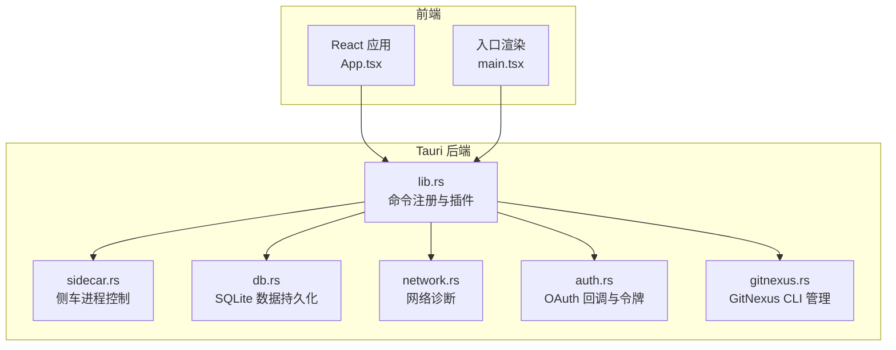
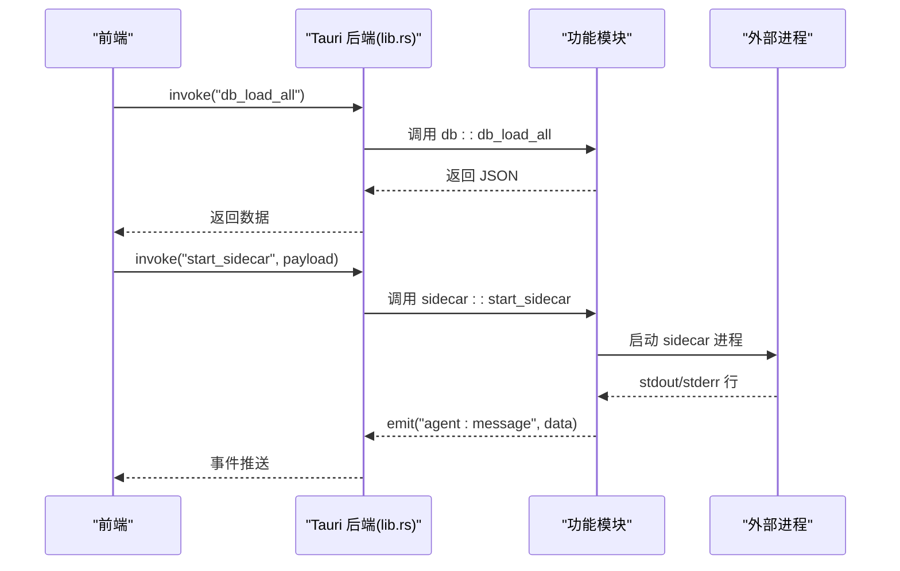
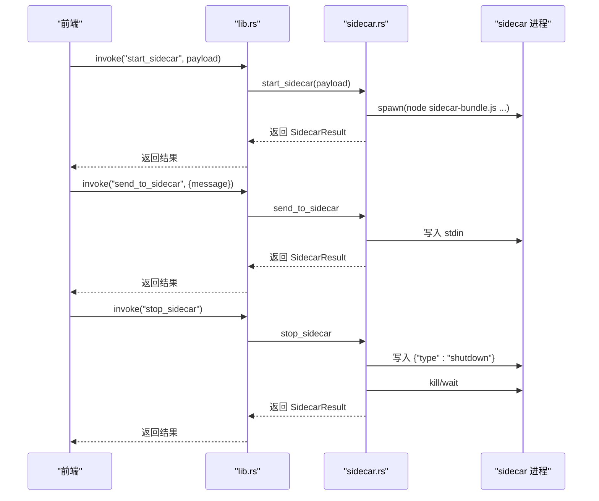
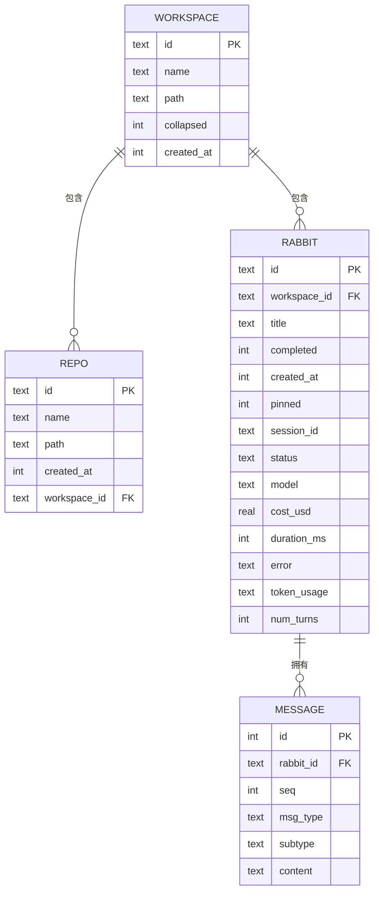
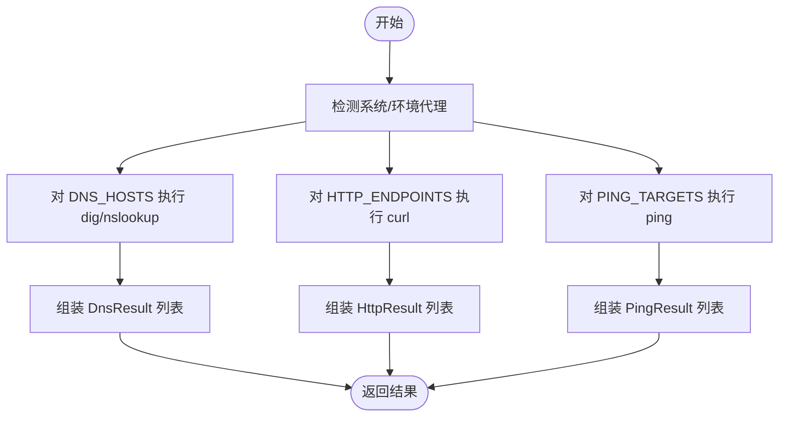
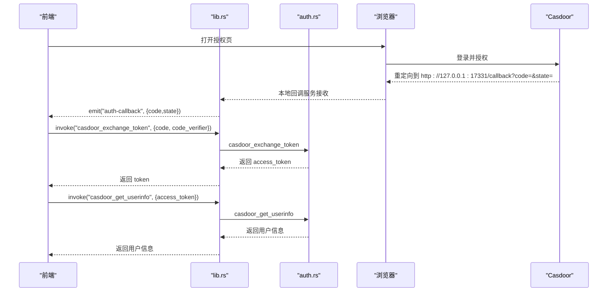
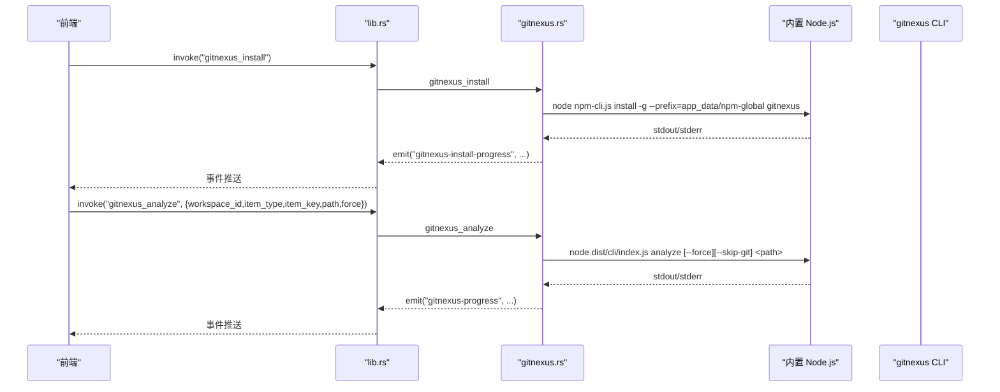
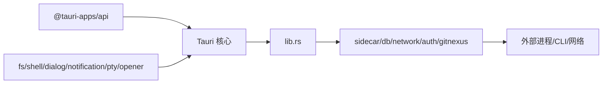

# API 参考

<cite>
**本文引用的文件**
- [README.md](file://README.md)
- [package.json](file://package.json)
- [Cargo.toml](file://src-tauri/Cargo.toml)
- [tauri.conf.json](file://src-tauri/tauri.conf.json)
- [main.tsx](file://src/main.tsx)
- [App.tsx](file://src/App.tsx)
- [lib.rs](file://src-tauri/src/lib.rs)
- [main.rs](file://src-tauri/src/main.rs)
- [sidecar.rs](file://src-tauri/src/sidecar.rs)
- [db.rs](file://src-tauri/src/db.rs)
- [network.rs](file://src-tauri/src/network.rs)
- [auth.rs](file://src-tauri/src/auth.rs)
- [gitnexus.rs](file://src-tauri/src/gitnexus.rs)
</cite>

## 目录
1. [简介](#简介)
2. [项目结构](#项目结构)
3. [核心组件](#核心组件)
4. [架构总览](#架构总览)
5. [详细组件分析](#详细组件分析)
6. [依赖关系分析](#依赖关系分析)
7. [性能考量](#性能考量)
8. [故障排查指南](#故障排查指南)
9. [结论](#结论)
10. [附录](#附录)

## 简介
本文件为 RabbitCoding 的 API 参考文档，覆盖前端与后端交互、Tauri 命令接口、IPC 通信、以及与外部系统的集成点。文档面向开发者与集成者，提供命令清单、数据模型、错误处理策略、安全与性能建议，并给出常见用例与调试方法。

## 项目结构
RabbitCoding 采用 Tauri + React + TypeScript 技术栈，前端通过 Tauri 的 invoke 机制调用后端命令，后端以 Rust 实现，提供数据库、网络诊断、身份认证、侧车进程管理、GitNexus 集成等功能模块。

**图表来源**
- [App.tsx:1-102](file://src/App.tsx#L1-L102)
- [main.tsx:1-11](file://src/main.tsx#L1-L11)
- [lib.rs:125-316](file://src-tauri/src/lib.rs#L125-L316)

**章节来源**
- [README.md:1-8](file://README.md#L1-L8)
- [package.json:1-46](file://package.json#L1-L46)
- [Cargo.toml:1-40](file://src-tauri/Cargo.toml#L1-L40)
- [tauri.conf.json:1-52](file://src-tauri/tauri.conf.json#L1-L52)

## 核心组件
- 前端应用：React + Ant Design，提供工作区、代理、终端、设置等界面。
- Tauri 后端：Rust 模块化命令，统一在 lib.rs 中注册，通过 generate_handler 暴露给前端。
- 侧车进程：通过 sidecar.rs 管理外部进程（如 Claude Code），支持启动、消息发送、停止与状态查询。
- 数据库：基于 rusqlite 的本地 SQLite，提供工作区、兔子（对话）、仓库与消息的持久化。
- 网络诊断：封装 DNS、HTTP、Ping 诊断，输出标准化结果。
- 身份认证：内置 Casdoor OAuth 流程，本地 loopback 回调服务，简化前端交互。
- GitNexus 集成：内置 Node.js 运行时，安装/卸载/检测 CLI，分析/列出/分组/同步索引。

**章节来源**
- [lib.rs:125-316](file://src-tauri/src/lib.rs#L125-L316)
- [sidecar.rs:1-359](file://src-tauri/src/sidecar.rs#L1-L359)
- [db.rs:1-417](file://src-tauri/src/db.rs#L1-L417)
- [network.rs:1-864](file://src-tauri/src/network.rs#L1-L864)
- [auth.rs:1-376](file://src-tauri/src/auth.rs#L1-L376)
- [gitnexus.rs:1-761](file://src-tauri/src/gitnexus.rs#L1-L761)

## 架构总览
前端通过 Tauri 的 invoke 通道调用后端命令，后端命令根据职责分发至对应模块。侧车进程与外部 CLI 通过子进程方式运行，通过 stdout/stderr 线程向前端推送事件。数据库命令负责全量加载/保存，网络与认证命令提供诊断与授权能力。

**图表来源**
- [lib.rs:272-313](file://src-tauri/src/lib.rs#L272-L313)
- [sidecar.rs:60-214](file://src-tauri/src/sidecar.rs#L60-L214)

**章节来源**
- [lib.rs:125-316](file://src-tauri/src/lib.rs#L125-L316)

## 详细组件分析

### Tauri 命令总览
以下命令由 lib.rs 注册并通过 generate_handler 暴露给前端。命令按功能分组，统一通过 invoke 调用。

- 通用工具
  - greet(name: string) -> string
  - ensure_workspace_docs_dir(path: string) -> Result<(), String>
  - ensure_rabbit_specs_dir(path: string) -> Result<(), String>
  - read_text_file_unrestricted(path: string) -> Result<String, String>
  - open_notification_settings() -> Result<(), String>
  - send_desktop_notification(title: string, body: string) -> Result<bool, String>

- 侧车进程（Agent）
  - start_sidecar(payload: StartSidecarPayload) -> SidecarResult
  - send_to_sidecar(message: string) -> SidecarResult
  - stop_sidecar() -> SidecarResult
  - get_sidecar_status() -> SidecarStatus

- 数据库（SQLite）
  - db_load_all() -> Result<String, String>
  - db_save_all(json: string) -> Result<(), String>
  - db_has_data() -> Result<bool, String>

- 网络诊断
  - diag_dns() -> Result<Vec<DnsResult>, String>
  - diag_http() -> Result<Vec<HttpResult>, String>
  - diag_ping() -> Result<Vec<PingResult>, String>
  - diag_marketplace() -> Result<MarketplaceResult, String>

- 模型测试
  - test_model_connection(...) -> ...

- GitNexus 集成
  - gitnexus_install() -> Result<bool, String>
  - gitnexus_uninstall() -> Result<bool, String>
  - gitnexus_check() -> Result<GitnexusCheckResult, String>
  - gitnexus_analyze(workspace_id, item_type, item_key, path, force) -> Result<GitnexusItem, String>
  - gitnexus_list() -> Result<Vec<GitnexusItem>, String>
  - gitnexus_group_create(name) -> Result<bool, String>
  - gitnexus_group_add(group, group_path, registry_name) -> Result<bool, String>
  - gitnexus_group_sync(workspace_id, name) -> Result<bool, String>
  - gitnexus_group_status(name) -> Result<String, String>

- 身份认证（Casdoor）
  - casdoor_complete_login(code, code_verifier) -> Result<CasdoorLoginResult, String>
  - casdoor_exchange_token(code, code_verifier) -> Result<CasdoorTokenResponse, String>
  - casdoor_get_userinfo(access_token) -> Result<CasdoorUserInfo, String>

- 反馈收集
  - capture_app_window() -> ...
  - collect_system_info() -> ...
  - collect_performance_metrics() -> ...
  - submit_feedback(...) -> ...

**章节来源**
- [lib.rs:14-313](file://src-tauri/src/lib.rs#L14-L313)

### 侧车进程（Agent）命令
- StartSidecarPayload
  - api_key: string
  - base_url?: string
  - env_vars?: Map<string, string>
- SidecarResult
  - success: boolean
  - error?: string
- SidecarStatus
  - running: boolean

流程要点
- 启动时清理 ANTHROPIC_* 环境变量，确保 BYOK 注入生效。
- 将 Claude Code 配置根目录重定向到应用专用目录，隔离用户全局配置。
- 启动 stdout/stderr 读取线程，逐行推送 agent:message 事件。
- 发送 shutdown 命令后优雅退出，随后 kill 强制终止。

**图表来源**
- [sidecar.rs:60-279](file://src-tauri/src/sidecar.rs#L60-L279)

**章节来源**
- [sidecar.rs:16-50](file://src-tauri/src/sidecar.rs#L16-L50)
- [sidecar.rs:60-279](file://src-tauri/src/sidecar.rs#L60-L279)

### 数据库（SQLite）命令
- 数据模型（驼峰命名）
  - WorkspaceData: id, name, path?, collapsed, created_at, rabbits[], repos[]
  - RabbitData: id, title, completed, created_at, pinned?, session_id?, status, model, cost_usd?, duration_ms?, error?, token_usage?, num_turns?, messages[]
  - TokenUsageData: input_tokens, output_tokens, cache_creation_input_tokens, cache_read_input_tokens
  - RepoData: id, name, path, created_at

- 命令
  - db_load_all(): 返回完整 Workspace[] JSON
  - db_save_all(json): 接收 Workspace[] JSON，事务内全量替换
  - db_has_data(): 判断是否存在数据（用于迁移）

**图表来源**
- [db.rs:85-138](file://src-tauri/src/db.rs#L85-L138)

**章节来源**
- [db.rs:10-74](file://src-tauri/src/db.rs#L10-L74)
- [db.rs:140-161](file://src-tauri/src/db.rs#L140-L161)
- [db.rs:392-416](file://src-tauri/src/db.rs#L392-L416)

### 网络诊断命令
- 诊断目标预设
  - DNS_HOSTS: center.qoder.sh, qts2.qoder.sh, openapi.qoder.sh, repo2.qoder.sh, api3.qoder.sh
  - HTTP_ENDPOINTS: https://center.qoder.sh/algo/api/v1/ping 等
  - PING_TARGETS: center.qoder.sh, openapi.qoder.sh
  - MARKETPLACE_ENDPOINT: https://marketplace.qoder.sh

- 数据结构（camelCase）
  - ProxyInfo: enabled, source?, address?
  - DnsResult: host, proxy, server?, resolved_ips[], resolution_ms?, status, error?
  - HttpResult: endpoint, method, proxy, status_code?, http_version?, tls_version?, response_time_ms?, content_type?, remote_ip?, status, error?
  - PingResult: target, ip?, packets_sent?, packets_received?, packet_loss_percent?, rtt_min_ms?, rtt_avg_ms?, rtt_max_ms?, status, error?
  - MarketplaceResult: endpoint, proxy, connection_ok, api_available, status_code?, response_time_ms?, status, error?

- 命令
  - diag_dns() -> Vec<DnsResult>
  - diag_http() -> Vec<HttpResult>
  - diag_ping() -> Vec<PingResult>
  - diag_marketplace() -> MarketplaceResult

**图表来源**
- [network.rs:10-26](file://src-tauri/src/network.rs#L10-L26)
- [network.rs:366-375](file://src-tauri/src/network.rs#L366-L375)
- [network.rs:538-550](file://src-tauri/src/network.rs#L538-L550)
- [network.rs:556-800](file://src-tauri/src/network.rs#L556-L800)

**章节来源**
- [network.rs:10-94](file://src-tauri/src/network.rs#L10-L94)
- [network.rs:366-550](file://src-tauri/src/network.rs#L366-L550)

### 身份认证（Casdoor）命令
- 常量
  - CASDOOR_BASE_URL: https://auth.rabbitai-lab.com
  - CLIENT_ID: 1a2b435570a36765109d
  - AUTH_CALLBACK_PORT: 17331
  - REDIRECT_URI: http://127.0.0.1:17331/callback
  - AUTH_CALLBACK_EVENT: "auth-callback"

- 数据结构（camelCase）
  - CasdoorTokenResponse: access_token, token_type?, expires_in?, refresh_token?
  - CasdoorUserInfo: username, display_name, email, avatar
  - CasdoorLoginResult: access_token, username, display_name, email, avatar

- 命令
  - casdoor_exchange_token(code, code_verifier) -> CasdoorTokenResponse
  - casdoor_get_userinfo(access_token) -> CasdoorUserInfo
  - casdoor_complete_login(code, code_verifier) -> CasdoorLoginResult
  - 内部：start_auth_callback_server(app) 启动本地 loopback 回调服务

**图表来源**
- [auth.rs:118-245](file://src-tauri/src/auth.rs#L118-L245)
- [auth.rs:258-350](file://src-tauri/src/auth.rs#L258-L350)

**章节来源**
- [auth.rs:9-17](file://src-tauri/src/auth.rs#L9-L17)
- [auth.rs:118-245](file://src-tauri/src/auth.rs#L118-L245)
- [auth.rs:258-350](file://src-tauri/src/auth.rs#L258-L350)

### GitNexus 集成命令
- 内置 Node.js 运行时与 npm-cli.js，安装/卸载/检测 CLI，避免系统依赖。
- analyze 支持强制重索引与跳过 git 根查找，针对 docs 与 repo 目录分别处理。
- group create/add/sync/status 提供分组与契约同步能力。
- 通过事件推送安装/分析/分组同步进度。

**图表来源**
- [gitnexus.rs:183-311](file://src-tauri/src/gitnexus.rs#L183-L311)
- [gitnexus.rs:384-561](file://src-tauri/src/gitnexus.rs#L384-L561)

**章节来源**
- [gitnexus.rs:180-379](file://src-tauri/src/gitnexus.rs#L180-L379)
- [gitnexus.rs:381-761](file://src-tauri/src/gitnexus.rs#L381-L761)

## 依赖关系分析
- 前端依赖
  - @tauri-apps/api、各插件（fs、shell、dialog、notification、opener、pty 等）
  - React、Ant Design、Monaco Editor、TailwindCSS
- 后端依赖
  - tauri、serde、rusqlite、reqwest、image、tauri-plugin-* 等
  - tokio（并发任务）、xcap/sysinfo（系统信息）、base64（编码）

**图表来源**
- [package.json:14-36](file://package.json#L14-L36)
- [Cargo.toml:20-39](file://src-tauri/Cargo.toml#L20-L39)
- [lib.rs:125-133](file://src-tauri/src/lib.rs#L125-L133)

**章节来源**
- [package.json:14-36](file://package.json#L14-L36)
- [Cargo.toml:20-39](file://src-tauri/Cargo.toml#L20-L39)

## 性能考量
- 侧车进程
  - stdout/stderr 分别读取，避免阻塞与死锁。
  - 启动时清理 ANTHROPIC_* 环境变量，防止 shell 继承变量影响。
  - 通过 CLAUDE_CONFIG_DIR 隔离配置，避免全局资源泄漏。
- 数据库
  - 使用 WAL 模式、外键约束与索引提升查询效率。
  - 事务批量保存，减少 I/O 次数。
- 网络诊断
  - 使用 tokio::task::spawn_blocking 避免阻塞主线程。
  - curl 仅获取必要指标，降低开销。
- GitNexus
  - 内置 Node.js 运行时，避免系统 PATH 与权限问题。
  - 安装/分析过程通过事件流反馈进度，避免长时间阻塞。

[本节为通用指导，无需“章节来源”]

## 故障排查指南
- 侧车进程
  - 若启动失败，检查 SidecarResult.error；确认内置 Node.js 与 sidecar-bundle.js 路径正确。
  - stdout/stderr 线程异常时，查看后端日志与事件推送。
- 数据库
  - db_load_all/db_save_all 失败时，检查 JSON 结构与序列化/反序列化。
  - 如需迁移，使用 db_has_data 判断是否已有数据。
- 网络诊断
  - diag_dns/diag_http/diag_ping 返回 error 时，检查系统代理与网络连通性。
  - Windows/macOS/Linux 平台差异（dig/nslookup/ping 参数）。
- 身份认证
  - 本地回调服务绑定失败时，检查端口占用与防火墙。
  - token 交换失败时，核对 code_verifier 与 redirect_uri。
- GitNexus
  - 未安装 CLI 时，先执行 gitnexus_install；安装失败查看 stderr 累积信息。
  - analyze 失败时，确认路径存在且具备访问权限。

**章节来源**
- [sidecar.rs:151-164](file://src-tauri/src/sidecar.rs#L151-L164)
- [db.rs:392-416](file://src-tauri/src/db.rs#L392-L416)
- [network.rs:207-375](file://src-tauri/src/network.rs#L207-L375)
- [auth.rs:258-350](file://src-tauri/src/auth.rs#L258-L350)
- [gitnexus.rs:183-311](file://src-tauri/src/gitnexus.rs#L183-L311)

## 结论
RabbitCoding 的 API 以 Tauri 命令为核心，结合侧车进程与本地 SQLite，提供稳定、可控的桌面应用体验。通过清晰的事件流与数据模型，前端可高效地驱动后端能力，满足开发与运维场景需求。建议在生产环境中关注进程隔离、代理检测与错误上报，持续优化用户体验与稳定性。

[本节为总结，无需“章节来源”]

## 附录

### 安全与合规
- 侧车进程环境变量隔离与配置根目录重定向，避免全局资源泄漏。
- 本地 OAuth 回调服务仅监听 127.0.0.1，降低外网风险。
- 数据库文件位于应用数据目录，避免用户空间污染。

**章节来源**
- [sidecar.rs:96-131](file://src-tauri/src/sidecar.rs#L96-L131)
- [auth.rs:258-284](file://src-tauri/src/auth.rs#L258-L284)
- [lib.rs:135-149](file://src-tauri/src/lib.rs#L135-L149)

### 版本与构建
- 前端与后端版本号在各自配置文件中声明，构建脚本通过 Tauri CLI 与 Vite 驱动。
- tauri.conf.json 指定开发/构建 URL、窗口属性与插件配置。

**章节来源**
- [package.json:1-13](file://package.json#L1-L13)
- [tauri.conf.json:6-11](file://src-tauri/tauri.conf.json#L6-L11)

### 常见用例与最佳实践
- 初始化工作区：ensure_workspace_docs_dir / ensure_rabbit_specs_dir
- 侧车消息流：start_sidecar -> send_to_sidecar -> agent:message 事件 -> stop_sidecar
- 数据迁移：db_has_data -> db_load_all -> db_save_all
- 网络诊断：diag_dns / diag_http / diag_ping 组合排查
- 认证流程：本地回调 -> 交换 token -> 获取用户信息
- GitNexus：安装 CLI -> analyze 索引 -> group 同步

**章节来源**
- [lib.rs:14-33](file://src-tauri/src/lib.rs#L14-L33)
- [sidecar.rs:60-279](file://src-tauri/src/sidecar.rs#L60-L279)
- [db.rs:392-416](file://src-tauri/src/db.rs#L392-L416)
- [network.rs:366-550](file://src-tauri/src/network.rs#L366-L550)
- [auth.rs:118-245](file://src-tauri/src/auth.rs#L118-L245)
- [gitnexus.rs:183-311](file://src-tauri/src/gitnexus.rs#L183-L311)