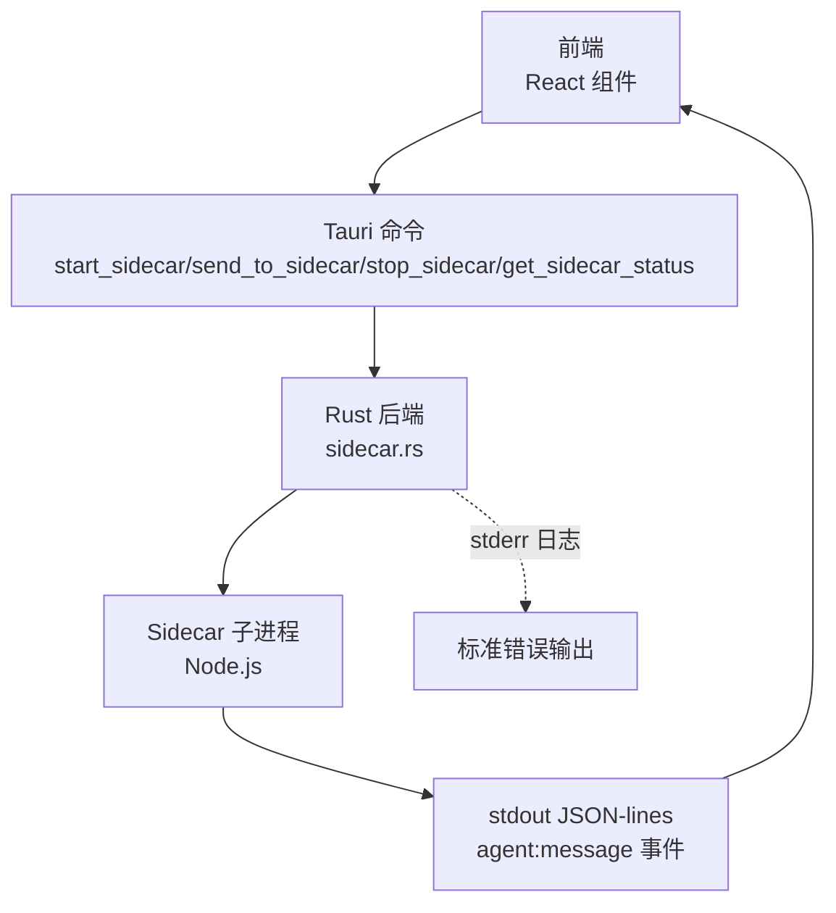
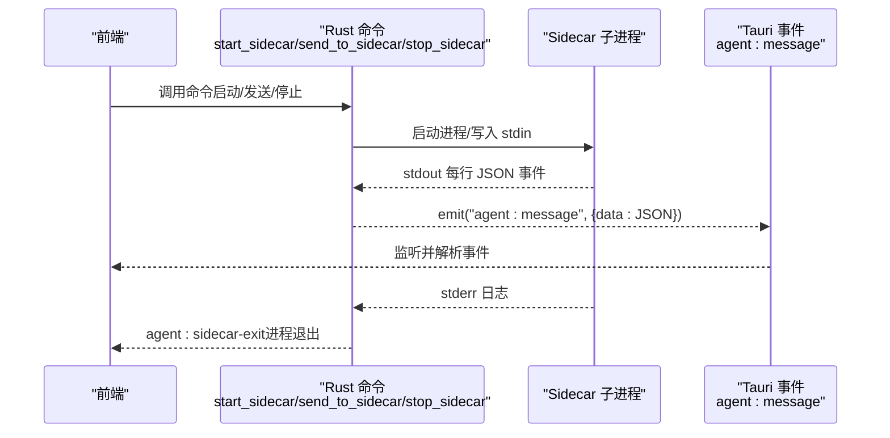
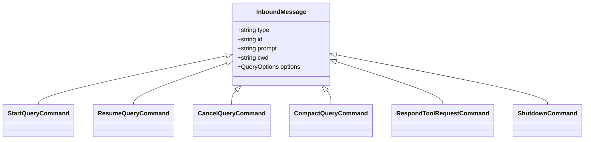
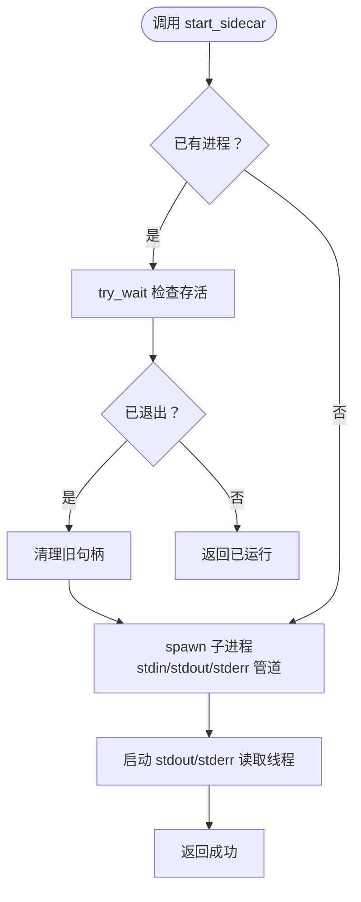
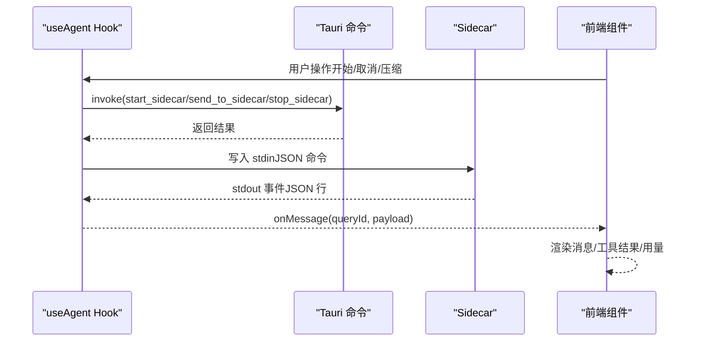
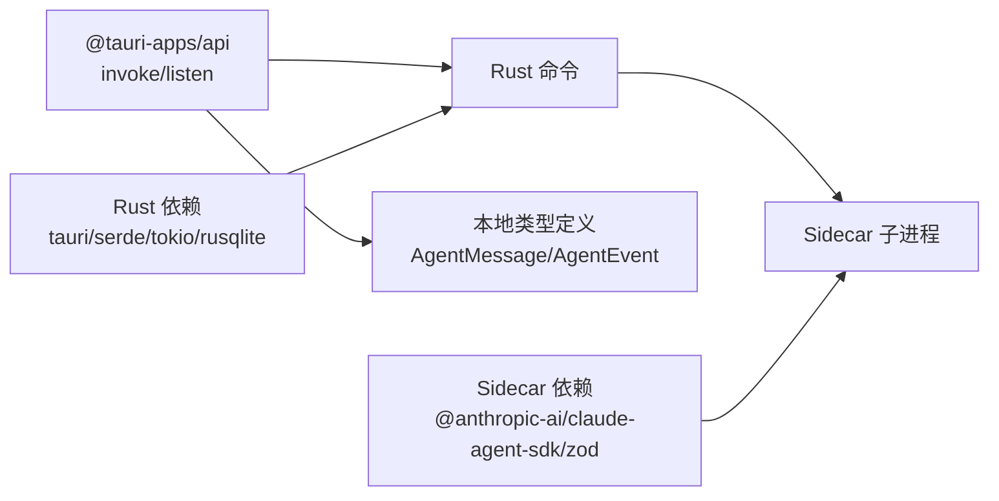

# IPC 通信

<cite>
**本文引用的文件**
- [src-tauri/src/main.rs](file://src-tauri/src/main.rs)
- [src-tauri/src/lib.rs](file://src-tauri/src/lib.rs)
- [src-tauri/src/sidecar.rs](file://src-tauri/src/sidecar.rs)
- [sidecar/src/index.ts](file://sidecar/src/index.ts)
- [sidecar/src/protocol.ts](file://sidecar/src/protocol.ts)
- [src/hooks/useAgent.ts](file://src/hooks/useAgent.ts)
- [src/types/index.ts](file://src/types/index.ts)
- [package.json](file://package.json)
- [sidecar/package.json](file://sidecar/package.json)
- [src-tauri/Cargo.toml](file://src-tauri/Cargo.toml)
</cite>

## 目录
1. [简介](#简介)
2. [项目结构](#项目结构)
3. [核心组件](#核心组件)
4. [架构总览](#架构总览)
5. [详细组件分析](#详细组件分析)
6. [依赖关系分析](#依赖关系分析)
7. [性能考量](#性能考量)
8. [故障排查指南](#故障排查指南)
9. [结论](#结论)
10. [附录](#附录)

## 简介
本文件面向 RabbitCoding 的 IPC 通信协议，聚焦前端与 Rust 后端之间的进程间通信，以及 Rust 后端与 Sidecar 子进程之间的交互。文档涵盖：
- 消息格式与数据传输（JSON-lines 协议）
- 事件处理机制与错误传播
- Sidecar 生命周期管理（启动、停止、状态查询）
- 超时与看门狗策略
- 版本兼容性与向后兼容性保障
- 通信示例与调试方法

## 项目结构
RabbitCoding 的 IPC 通信涉及三层：
- 前端（React + Tauri 前端 API）
- Rust 后端（Tauri 命令与事件）
- Sidecar 子进程（Node.js，Claude Agent SDK）

图表来源
- [src-tauri/src/lib.rs:344-387](file://src-tauri/src/lib.rs#L344-L387)
- [src-tauri/src/sidecar.rs:60-214](file://src-tauri/src/sidecar.rs#L60-L214)
- [sidecar/src/index.ts:96-128](file://sidecar/src/index.ts#L96-L128)

章节来源
- [src-tauri/src/lib.rs:197-390](file://src-tauri/src/lib.rs#L197-L390)
- [src-tauri/src/sidecar.rs:1-359](file://src-tauri/src/sidecar.rs#L1-L359)
- [sidecar/src/index.ts:1-145](file://sidecar/src/index.ts#L1-L145)

## 核心组件
- Rust 后端命令
  - start_sidecar：启动 Sidecar 子进程，注入环境变量，建立 stdout/stderr 读取线程，转发 agent:message 事件。
  - send_to_sidecar：向 Sidecar stdin 写入 JSON 命令行。
  - stop_sidecar：发送 shutdown 命令并强制终止进程。
  - get_sidecar_status：查询 Sidecar 是否正在运行。
- Sidecar 协议
  - stdin 命令：start_query/resume_query/cancel_query/compact_query/respond_tool_request/shutdown
  - stdout 事件：系统消息、助手文本/思考流、工具调用、结果/错误、用量更新、AskUserQuestion 等
- 前端 Hook
  - useAgent：封装启动/停止/查询/取消/压缩/响应提问；监听 agent:message 与 agent:sidecar-exit；实现查询看门狗与思考态超时。

章节来源
- [src-tauri/src/sidecar.rs:60-279](file://src-tauri/src/sidecar.rs#L60-L279)
- [sidecar/src/protocol.ts:13-78](file://sidecar/src/protocol.ts#L13-L78)
- [sidecar/src/index.ts:37-91](file://sidecar/src/index.ts#L37-L91)
- [src/hooks/useAgent.ts:106-333](file://src/hooks/useAgent.ts#L106-L333)

## 架构总览
Rust 后端通过 Tauri 命令与 Sidecar 子进程进行双向通信：前端通过 Tauri 命令向 Rust 发起控制，Rust 将 Sidecar 的 stdout 逐行 JSON 事件通过 agent:message 事件转发给前端；stderr 仅用于日志输出。

图表来源
- [src-tauri/src/sidecar.rs:175-208](file://src-tauri/src/sidecar.rs#L175-L208)
- [sidecar/src/index.ts:96-128](file://sidecar/src/index.ts#L96-L128)
- [src/hooks/useAgent.ts:262-320](file://src/hooks/useAgent.ts#L262-L320)

## 详细组件分析

### Sidecar 协议与消息格式
- 协议基础
  - stdin：JSON-lines 命令，每行一条
  - stdout：JSON-lines 事件，每行一条
  - stderr：日志，不影响协议消息
- 前端 → Sidecar（stdin）
  - start_query/resume_query：携带 queryId、prompt、cwd、options
  - cancel_query：取消指定 query
  - compact_query：手动触发会话压缩
  - respond_tool_request：回答 AskUserQuestion
  - shutdown：优雅关闭
- Sidecar → 前端（stdout → Rust 事件 → 前端）
  - system/init：初始化，包含 sessionId
  - assistant/text/thinking：文本/思考流与增量
  - assistant/text_done/thinking_done：流结束
  - tool_use/tool_result：工具调用与结果
  - result/error：最终结果/错误
  - usage_update：当前轮次用量更新
  - ask_user_question：向前端提问
  - spec_written：WriteSpec 写入完成

图表来源
- [sidecar/src/protocol.ts:13-78](file://sidecar/src/protocol.ts#L13-L78)

章节来源
- [sidecar/src/protocol.ts:1-252](file://sidecar/src/protocol.ts#L1-L252)
- [sidecar/src/index.ts:37-91](file://sidecar/src/index.ts#L37-L91)

### Rust 后端与 Sidecar 子进程
- 启动流程
  - 解析 payload（API Key/Base URL/自定义 env），清理潜在冲突的 Anthropic 环境变量，隔离 Claude 配置根目录
  - 以管道方式启动子进程，捕获 stdin/stdout/stderr
  - 启动 stdout/stderr 读取线程，将 stdout 行事件通过 Tauri 事件 agent:message 转发，stderr 输出到 eprintln
- 发送消息
  - 将 JSON 字符串写入子进程 stdin，每条命令一行
- 停止流程
  - 先发送 shutdown 命令，等待短暂时间后强制 kill 并 wait
- 状态查询
  - 通过内部状态判断是否运行

图表来源
- [src-tauri/src/sidecar.rs:60-214](file://src-tauri/src/sidecar.rs#L60-L214)

章节来源
- [src-tauri/src/sidecar.rs:60-279](file://src-tauri/src/sidecar.rs#L60-L279)

### 前端 Hook：useAgent
- 启动/停止/状态查询
  - 调用 Rust 命令，更新 sidecarStatus
- 发送查询
  - startQuery/resumeQuery/compactQuery/cancelQuery/respondToolRequest
  - 将命令序列化为 JSON 字符串并通过 send_to_sidecar 发送
- 事件监听
  - 监听 agent:message，解析为 AgentEvent，分发到 onMessage 回调
  - 监听 agent:sidecar-exit，更新状态并清理看门狗
- 超时与思考态
  - 为每个 queryId 维护独立定时器
  - 思考态（thinking/thinking_delta）使用更长超时（30 分钟），普通态 10 分钟
  - result/error 视为终态，清除计时与思考态标记

图表来源
- [src/hooks/useAgent.ts:106-333](file://src/hooks/useAgent.ts#L106-L333)
- [src-tauri/src/sidecar.rs:216-243](file://src-tauri/src/sidecar.rs#L216-L243)

章节来源
- [src/hooks/useAgent.ts:1-334](file://src/hooks/useAgent.ts#L1-L334)
- [src/types/index.ts:274-295](file://src/types/index.ts#L274-L295)

## 依赖关系分析
- 前端依赖
  - @tauri-apps/api：invoke 与 listen
  - 本地类型定义：AgentMessage、AgentEvent、AgentQueryOptions、SidecarStatus
- Rust 依赖
  - tauri、serde、tokio、rusqlite 等
  - 通过 tauri::generate_handler 注册命令
- Sidecar 依赖
  - @anthropic-ai/claude-agent-sdk、zod
  - esbuild 用于打包 sidecar-bundle.js

图表来源
- [package.json:14-36](file://package.json#L14-L36)
- [src-tauri/Cargo.toml:20-39](file://src-tauri/Cargo.toml#L20-L39)
- [sidecar/package.json:12-20](file://sidecar/package.json#L12-L20)

章节来源
- [package.json:1-46](file://package.json#L1-L46)
- [src-tauri/Cargo.toml:1-40](file://src-tauri/Cargo.toml#L1-L40)
- [sidecar/package.json:1-25](file://sidecar/package.json#L1-L25)

## 性能考量
- JSON-lines 流式传输：stdin 与 stdout 均采用逐行 JSON，便于边产生边消费，降低内存峰值
- 多线程读取：Rust 后端为 stdout/stderr 分别开启读取线程，避免阻塞
- 环境隔离：启动时清理潜在冲突的环境变量，确保模型配置由应用注入，减少不必要的重试与错误
- 前端渲染优化：消息分组、工具结果映射、仅在底部时自动滚动，提升大消息流体验

## 故障排查指南
- 启动失败
  - 检查 start_sidecar 返回的 error 字段
  - 确认 API Key/Base URL/env_vars 注入正确
  - 查看 stderr 日志（eprintln 输出）
- 无事件/卡住
  - 确认 Sidecar 已发送 ready（stdout 第一条事件）
  - 检查前端是否正确监听 agent:message
  - 查看查询看门狗是否触发（普通态 10 分钟，思考态 30 分钟）
- 进程退出
  - 监听 agent:sidecar-exit，确认原因（如 stdout 关闭）
  - 重新启动 Sidecar 并重发命令
- 错误传播
  - Sidecar 发生错误时会通过 stdout 发送 error 消息
  - Rust 后端将错误消息通过 agent:message 事件传递给前端
  - 前端 onMessage 回调中处理 AgentErrorMessage

章节来源
- [src-tauri/src/sidecar.rs:175-208](file://src-tauri/src/sidecar.rs#L175-L208)
- [sidecar/src/index.ts:119-139](file://sidecar/src/index.ts#L119-L139)
- [src/hooks/useAgent.ts:262-320](file://src/hooks/useAgent.ts#L262-L320)

## 结论
RabbitCoding 的 IPC 通信以 JSON-lines 为核心，通过 Tauri 命令与事件实现前端、Rust 后端与 Sidecar 子进程之间的稳定协作。协议设计简洁、事件驱动、具备完善的错误传播与超时处理机制。生产模式下通过内置 Node.js 与 sidecar-bundle.js 提升部署一致性与性能。

## 附录

### 通信协议要点
- 消息格式
  - stdin：JSON 对象，每行一条
  - stdout：JSON 对象，每行一条
  - stderr：纯文本日志
- 事件命名
  - agent:message：承载 Sidecar 的 stdout 事件
  - agent:sidecar-exit：Sidecar 退出事件
- 错误处理
  - Sidecar 通过 stdout 发送 error 消息
  - Rust 后端捕获 stderr 并输出到 eprintln
  - 前端 onMessage 中识别 AgentErrorMessage 并展示

章节来源
- [sidecar/src/index.ts:24-32](file://sidecar/src/index.ts#L24-L32)
- [src-tauri/src/sidecar.rs:180-208](file://src-tauri/src/sidecar.rs#L180-L208)
- [src/types/index.ts:196-201](file://src/types/index.ts#L196-L201)

### Sidecar 生命周期 API
- 启动
  - 命令：start_sidecar
  - 输入：api_key/base_url/env_vars
  - 输出：SidecarResult
- 发送消息
  - 命令：send_to_sidecar
  - 输入：message（JSON 字符串）
  - 输出：SidecarResult
- 停止
  - 命令：stop_sidecar
  - 行为：发送 shutdown，等待后 kill
- 状态查询
  - 命令：get_sidecar_status
  - 输出：SidecarStatus

章节来源
- [src-tauri/src/sidecar.rs:60-279](file://src-tauri/src/sidecar.rs#L60-L279)
- [src-tauri/src/lib.rs:353-356](file://src-tauri/src/lib.rs#L353-L356)

### 前端调用示例（步骤说明）
- 启动 Sidecar
  - 调用 invoke('start_sidecar', { api_key, base_url, env_vars })
  - 成功后 sidecarStatus 变为 running
- 发送查询
  - 构造 start_query/resume_query 命令对象，序列化为 JSON 字符串
  - 调用 invoke('send_to_sidecar', { message: JSON })
- 监听事件
  - listen('agent:message', (event) => { 解析 event.payload.data 为 AgentEvent })
  - 在回调中根据 payload.type 分发到 UI
- 取消/压缩/回答提问
  - cancel_query/compact_query/respond_tool_request
  - 通过 send_to_sidecar 发送对应命令
- 停止 Sidecar
  - invoke('stop_sidecar')
  - 监听 agent:sidecar-exit，清理本地状态

章节来源
- [src/hooks/useAgent.ts:106-333](file://src/hooks/useAgent.ts#L106-L333)
- [src-tauri/src/lib.rs:353-356](file://src-tauri/src/lib.rs#L353-L356)

### 版本兼容性与向后兼容性
- 协议稳定性
  - JSON-lines 事件结构保持稳定，前端通过 AgentMessage 联合类型适配
- 前端类型对齐
  - 前端 src/types/index.ts 与 sidecar/src/protocol.ts 的消息类型一一对应，确保跨语言一致性
- 命令扩展
  - Rust 侧通过 generate_handler 注册命令，新增命令需同时更新前端调用点与类型定义
- Sidecar 打包
  - 生产模式使用 sidecar-bundle.js，避免运行时依赖差异带来的兼容性问题

章节来源
- [src/types/index.ts:82-102](file://src/types/index.ts#L82-L102)
- [sidecar/src/protocol.ts:90-107](file://sidecar/src/protocol.ts#L90-L107)
- [src-tauri/src/lib.rs:344-387](file://src-tauri/src/lib.rs#L344-L387)