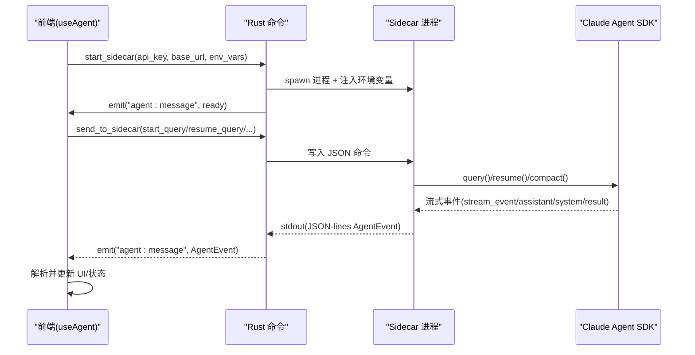
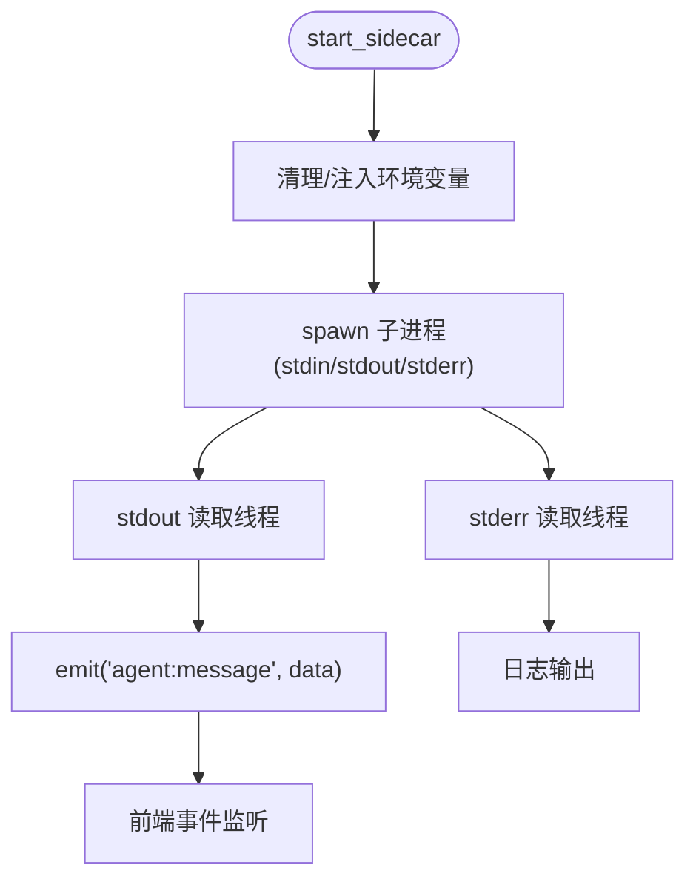
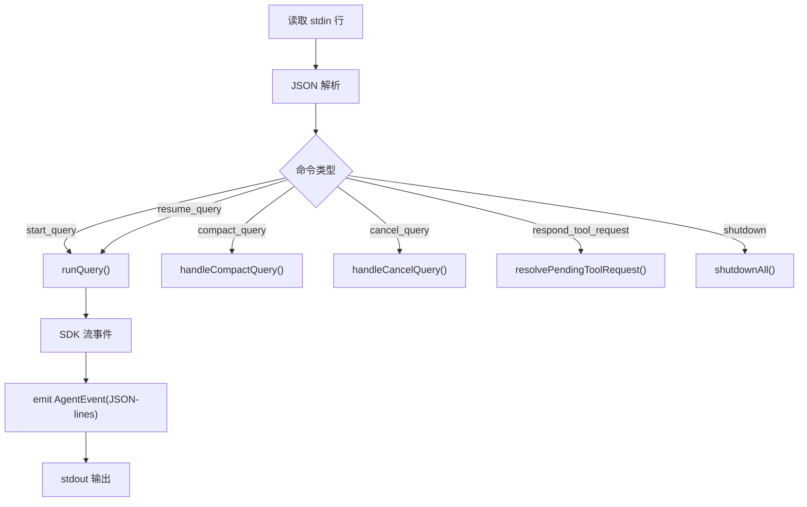
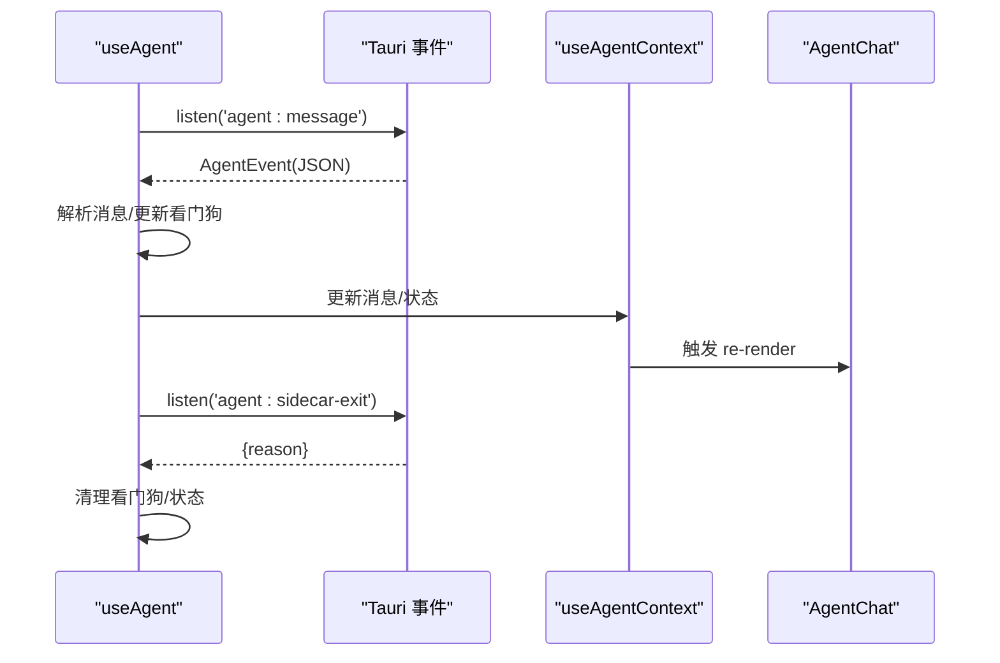
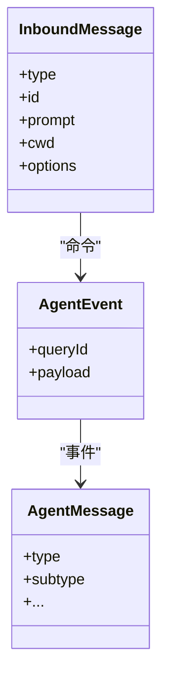
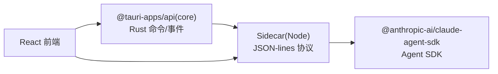

# WebSocket API

<cite>
**本文档引用的文件**
- [src-tauri/src/main.rs](file://src-tauri/src/main.rs)
- [src-tauri/src/lib.rs](file://src-tauri/src/lib.rs)
- [src-tauri/src/sidecar.rs](file://src-tauri/src/sidecar.rs)
- [sidecar/src/index.ts](file://sidecar/src/index.ts)
- [sidecar/src/agent.ts](file://sidecar/src/agent.ts)
- [sidecar/src/protocol.ts](file://sidecar/src/protocol.ts)
- [src/hooks/useAgent.ts](file://src/hooks/useAgent.ts)
- [src/hooks/useAgentContext.tsx](file://src/hooks/useAgentContext.tsx)
- [src/components/agent/AgentChat.tsx](file://src/components/agent/AgentChat.tsx)
- [src/types/index.ts](file://src/types/index.ts)
</cite>

## 目录
1. [简介](#简介)
2. [项目结构](#项目结构)
3. [核心组件](#核心组件)
4. [架构总览](#架构总览)
5. [详细组件分析](#详细组件分析)
6. [依赖关系分析](#依赖关系分析)
7. [性能考虑](#性能考虑)
8. [故障排查指南](#故障排查指南)
9. [结论](#结论)
10. [附录](#附录)

## 简介
本文件为 RabbitCoding 的 AI 代理实时通信接口文档，聚焦基于 Tauri 与 Node.js Sidecar 的消息通道设计与实现。该系统通过 Rust 后端启动 Node Sidecar 进程，前端通过 Tauri 命令向 Sidecar 发送 JSON-lines 命令，Sidecar 将 Claude Agent SDK 的流式事件转换为 JSON-lines 消息并通过 stdout 输出，Rust 后端监听 stdout 并通过 Tauri 事件转发至前端，前端使用 React Hook 管理连接、订阅事件、处理流式响应与错误恢复。

本系统并未采用传统 WebSocket，而是通过“进程间 JSON-lines 协议 + Tauri 事件”实现近似 WebSocket 的实时通信体验，具备流式增量、订阅、断线重连、背压控制与错误恢复能力。

## 项目结构
- Rust 后端负责启动/管理 Sidecar 进程，读取 stdout/stderr，通过 Tauri 事件向前端推送消息。
- Sidecar 进程负责与 Claude Agent SDK 交互，将 SDK 的异步流事件转换为 JSON-lines 消息。
- 前端通过 Tauri 命令控制 Sidecar 生命周期，通过事件监听消费流式消息，渲染聊天界面。

```mermaid
graph TB
subgraph "前端"
FE["React 前端<br/>useAgent Hook"]
Chat["AgentChat 组件"]
end
subgraph "Rust 后端"
Main["main.rs<br/>入口"]
Lib["lib.rs<br/>命令与插件"]
SidecarCmd["sidecar.rs<br/>进程管理/事件转发"]
end
subgraph "Sidecar(Node)"
IDX["index.ts<br/>stdin/stdout 循环"]
AGENT["agent.ts<br/>SDK 事件处理"]
PROTO["protocol.ts<br/>消息协议"]
end
FE --> |Tauri 命令| Lib
Lib --> |start_sidecar/send_to_sidecar/stop_sidecar| SidecarCmd
SidecarCmd --> |启动/写入/读取| IDX
IDX --> |JSON-lines| AGENT
AGENT --> |JSON-lines| IDX
IDX --> |stdout 行| SidecarCmd
SidecarCmd --> |emit("agent:message")| FE
FE --> |事件监听| Chat
```

**图表来源**
- [src-tauri/src/main.rs:4-6](file://src-tauri/src/main.rs#L4-L6)
- [src-tauri/src/lib.rs:197-390](file://src-tauri/src/lib.rs#L197-L390)
- [src-tauri/src/sidecar.rs:59-214](file://src-tauri/src/sidecar.rs#L59-L214)
- [sidecar/src/index.ts:96-128](file://sidecar/src/index.ts#L96-L128)
- [sidecar/src/agent.ts:241-465](file://sidecar/src/agent.ts#L241-L465)
- [sidecar/src/protocol.ts:1-252](file://sidecar/src/protocol.ts#L1-L252)
- [src/hooks/useAgent.ts:262-320](file://src/hooks/useAgent.ts#L262-L320)
- [src/components/agent/AgentChat.tsx:87-214](file://src/components/agent/AgentChat.tsx#L87-L214)

**章节来源**
- [src-tauri/src/main.rs:4-6](file://src-tauri/src/main.rs#L4-L6)
- [src-tauri/src/lib.rs:197-390](file://src-tauri/src/lib.rs#L197-L390)
- [src-tauri/src/sidecar.rs:59-214](file://src-tauri/src/sidecar.rs#L59-L214)
- [sidecar/src/index.ts:96-128](file://sidecar/src/index.ts#L96-L128)
- [sidecar/src/agent.ts:241-465](file://sidecar/src/agent.ts#L241-L465)
- [sidecar/src/protocol.ts:1-252](file://sidecar/src/protocol.ts#L1-L252)
- [src/hooks/useAgent.ts:262-320](file://src/hooks/useAgent.ts#L262-L320)
- [src/components/agent/AgentChat.tsx:87-214](file://src/components/agent/AgentChat.tsx#L87-L214)

## 核心组件
- Rust 后端命令与事件
  - start_sidecar：启动 Sidecar 进程，注入环境变量，读取 stdout/stderr，转发 agent:message 事件。
  - send_to_sidecar：向 Sidecar stdin 写入 JSON 命令。
  - stop_sidecar/get_sidecar_status：停止进程与状态查询。
- Sidecar 主循环
  - 读取 stdin JSON 命令，派发到对应处理器。
  - 通过 stdout 以 JSON-lines 输出 Agent 事件。
  - 通过 stderr 输出日志。
- Agent 事件处理
  - 将 Claude SDK 的流式事件转换为统一的 AgentMessage 类型，包括流式增量、工具调用、压缩状态、用量更新等。
- 前端 Hook
  - useAgent：封装 Sidecar 生命周期、命令发送、事件监听、看门狗超时、思考态宽限。
  - useAgentContext：将消息持久化到 store，处理流式增量、工具结果关联、压缩状态等。
- 类型系统
  - protocol.ts 与 types/index.ts 定义了完整的消息协议与前端类型，确保前后端一致性。

**章节来源**
- [src-tauri/src/sidecar.rs:59-214](file://src-tauri/src/sidecar.rs#L59-L214)
- [sidecar/src/index.ts:37-91](file://sidecar/src/index.ts#L37-L91)
- [sidecar/src/agent.ts:146-465](file://sidecar/src/agent.ts#L146-L465)
- [sidecar/src/protocol.ts:1-252](file://sidecar/src/protocol.ts#L1-L252)
- [src/hooks/useAgent.ts:106-333](file://src/hooks/useAgent.ts#L106-L333)
- [src/hooks/useAgentContext.tsx:104-193](file://src/hooks/useAgentContext.tsx#L104-L193)
- [src/types/index.ts:82-283](file://src/types/index.ts#L82-L283)

## 架构总览
系统采用“命令-事件”模式替代传统 WebSocket：
- 前端通过 Tauri 命令发送 JSON-lines 命令（start_query/resume_query/cancel_query/compact_query/respond_tool_request/shutdown）。
- Sidecar 以 JSON-lines 流式输出 Agent 事件（system/init、assistant/text_delta/thinking_delta/tool_use/tool_result/result/error/usage_update/compaction/status 等）。
- Rust 后端将 stdout 行包装为事件并转发给前端，前端统一处理。



**图表来源**
- [src-tauri/src/sidecar.rs:59-214](file://src-tauri/src/sidecar.rs#L59-L214)
- [sidecar/src/index.ts:96-128](file://sidecar/src/index.ts#L96-L128)
- [sidecar/src/agent.ts:241-465](file://sidecar/src/agent.ts#L241-L465)
- [src/hooks/useAgent.ts:106-333](file://src/hooks/useAgent.ts#L106-L333)

## 详细组件分析

### Rust 后端：进程管理与事件转发
- 进程生命周期
  - start_sidecar：清理历史环境变量，注入 CLAUDE_CONFIG_DIR、API Key、Base URL 与自定义环境变量，启动子进程并开启 stdout/stderr 读取线程。
  - send_to_sidecar：向 stdin 写入 JSON 命令，支持 shutdown。
  - stop_sidecar：发送 shutdown 命令后 kill 子进程。
- 事件转发
  - stdout 每行 JSON 文本通过 emit("agent:message") 推送到前端。
  - stderr 作为日志输出，便于定位问题。



**图表来源**
- [src-tauri/src/sidecar.rs:59-214](file://src-tauri/src/sidecar.rs#L59-L214)

**章节来源**
- [src-tauri/src/sidecar.rs:59-214](file://src-tauri/src/sidecar.rs#L59-L214)

### Sidecar：命令解析与流式事件处理
- 命令循环
  - 逐行读取 stdin，解析 JSON，分发到对应处理器（start_query/resume_query/cancel_query/compact_query/respond_tool_request/shutdown）。
  - ready 事件通过 stdout 输出，告知前端 Sidecar 就绪。
- 流式事件处理
  - 将 Claude SDK 的 stream_event/content_block_*/message_* 转换为统一 AgentMessage（text_delta/thinking_delta/tool_use/tool_result/usage_update/result/error 等）。
  - 支持 AskUserQuestion 的等待与响应，带超时与取消处理。
- 会话压缩
  - compact_query 通过 /compact prompt 触发 SDK 压缩流程，上报压缩状态与结果。



**图表来源**
- [sidecar/src/index.ts:96-128](file://sidecar/src/index.ts#L96-L128)
- [sidecar/src/agent.ts:241-465](file://sidecar/src/agent.ts#L241-L465)
- [sidecar/src/protocol.ts:1-252](file://sidecar/src/protocol.ts#L1-L252)

**章节来源**
- [sidecar/src/index.ts:37-91](file://sidecar/src/index.ts#L37-L91)
- [sidecar/src/agent.ts:146-465](file://sidecar/src/agent.ts#L146-L465)
- [sidecar/src/protocol.ts:1-252](file://sidecar/src/protocol.ts#L1-L252)

### 前端 Hook：连接管理与事件订阅
- 连接管理
  - startSidecar/stopSidecar/checkStatus：控制 Sidecar 生命周期与状态。
  - startQuery/resumeQuery/compactQuery/cancelQuery/respondToolRequest：发送命令到 Sidecar。
- 事件订阅
  - 监听 agent:message 事件，解析 AgentEvent，按消息类型更新 UI。
  - 监听 agent:sidecar-exit，统一清理看门狗与状态。
- 超时与背压
  - 看门狗：每条 query 独立计时，收到消息重置；思考态使用更长阈值，避免误判。
  - 背压：前端按消息增量渲染，避免一次性渲染大量历史消息。



**图表来源**
- [src/hooks/useAgent.ts:262-320](file://src/hooks/useAgent.ts#L262-L320)
- [src/hooks/useAgentContext.tsx:104-193](file://src/hooks/useAgentContext.tsx#L104-L193)
- [src/components/agent/AgentChat.tsx:87-214](file://src/components/agent/AgentChat.tsx#L87-L214)

**章节来源**
- [src/hooks/useAgent.ts:106-333](file://src/hooks/useAgent.ts#L106-L333)
- [src/hooks/useAgentContext.tsx:104-193](file://src/hooks/useAgentContext.tsx#L104-L193)
- [src/components/agent/AgentChat.tsx:87-214](file://src/components/agent/AgentChat.tsx#L87-L214)

### 消息协议与数据模型
- 前端 → Sidecar 命令
  - start_query/resume_query/cancel_query/compact_query/respond_tool_request/shutdown。
- Sidecar → 前端 事件
  - system/init、assistant/text/thinking/text_delta/thinking_delta/text_done/thinking_done、tool_use/tool_result、result/error、usage_update、compaction/status/compaction_result、ask_user_question、spec_written 等。
- 类型定义
  - protocol.ts 与 types/index.ts 定义完整消息类型与字段，确保前后端一致。



**图表来源**
- [sidecar/src/protocol.ts:13-78](file://sidecar/src/protocol.ts#L13-L78)
- [sidecar/src/protocol.ts:84-107](file://sidecar/src/protocol.ts#L84-L107)
- [src/types/index.ts:82-283](file://src/types/index.ts#L82-L283)

**章节来源**
- [sidecar/src/protocol.ts:13-78](file://sidecar/src/protocol.ts#L13-L78)
- [sidecar/src/protocol.ts:84-107](file://sidecar/src/protocol.ts#L84-L107)
- [src/types/index.ts:82-283](file://src/types/index.ts#L82-L283)

## 依赖关系分析
- Rust 后端依赖
  - tauri：命令、事件、插件。
  - 子进程：std::process::Command 管理 Sidecar。
- Sidecar 依赖
  - @anthropic-ai/claude-agent-sdk：与 Claude 交互。
  - readline：stdin JSON-lines 循环。
- 前端依赖
  - @tauri-apps/api：invoke/listen。
  - React：组件渲染与状态管理。



**图表来源**
- [src-tauri/src/sidecar.rs:1-5](file://src-tauri/src/sidecar.rs#L1-L5)
- [sidecar/src/index.ts:9-18](file://sidecar/src/index.ts#L9-L18)
- [src/hooks/useAgent.ts:8-17](file://src/hooks/useAgent.ts#L8-L17)

**章节来源**
- [src-tauri/src/sidecar.rs:1-5](file://src-tauri/src/sidecar.rs#L1-L5)
- [sidecar/src/index.ts:9-18](file://sidecar/src/index.ts#L9-L18)
- [src/hooks/useAgent.ts:8-17](file://src/hooks/useAgent.ts#L8-L17)

## 性能考虑
- 流式增量渲染：前端按 text_delta/thinking_delta 增量拼接，避免大块文本重绘。
- 背压控制：前端按消息到达顺序渲染，必要时延迟或节流历史消息渲染。
- 看门狗：区分“思考态”与“正常态”，避免长思考被误判为超时。
- 进程隔离：Sidecar 与主进程分离，stderr 日志不影响 stdout 流，降低阻塞风险。
- 环境隔离：通过 CLAUDE_CONFIG_DIR 与环境变量注入，避免外部配置污染。

## 故障排查指南
- Sidecar 未就绪
  - 检查 start_sidecar 返回值与 stdout 是否输出 ready 事件。
  - 查看 stderr 日志定位 Node/SDK 启动问题。
- 无消息或静默卡死
  - 前端看门狗会在阈值时间内无消息时触发 onQueryTimeout，检查 SDK 流是否中断。
  - Sidecar 进程退出会触发 agent:sidecar-exit，前端统一清理并标记错误。
- 流式消息缺失
  - 确认 Sidecar stdout 是否正确输出 JSON-lines，Rust 事件是否转发成功。
  - 检查前端事件监听是否正确解析 JSON。
- AskUserQuestion 无响应
  - 确认前端已发送 respond_tool_request，Sidecar pending 请求是否超时（默认 5 分钟）。
- 取消查询无效
  - 确认 cancel_query 已发送，且 Sidecar 中 AbortController 是否生效。

**章节来源**
- [src-tauri/src/sidecar.rs:175-214](file://src-tauri/src/sidecar.rs#L175-L214)
- [sidecar/src/index.ts:119-127](file://sidecar/src/index.ts#L119-L127)
- [src/hooks/useAgent.ts:262-320](file://src/hooks/useAgent.ts#L262-L320)
- [src/hooks/useAgent.ts:83-95](file://src/hooks/useAgent.ts#L83-L95)
- [sidecar/src/agent.ts:502-573](file://sidecar/src/agent.ts#L502-L573)

## 结论
本系统通过“命令-事件”模式实现了类 WebSocket 的实时通信：Rust 后端负责进程生命周期与事件转发，Sidecar 负责与 SDK 的流式交互，前端通过 Hook 管理连接、订阅事件、处理流式响应与错误恢复。该方案具备良好的解耦性、可观测性与可扩展性，适合在桌面应用中稳定运行。

## 附录

### API 定义（命令与事件）
- 前端 → Sidecar 命令
  - start_query：启动新查询。
  - resume_query：恢复会话。
  - cancel_query：取消查询。
  - compact_query：触发会话压缩。
  - respond_tool_request：响应 AskUserQuestion。
  - shutdown：优雅关闭 Sidecar。
- Sidecar → 前端 事件
  - system/init：初始化，包含 sessionId。
  - assistant：text/thinking/text_delta/thinking_delta/text_done/thinking_done/tool_use/tool_result。
  - result/error：最终结果与错误。
  - usage_update：当前轮次上下文占用。
  - compaction/status/compaction_result：会话压缩状态与结果。
  - ask_user_question：等待用户输入。
  - spec_written：WriteSpec 工具写入完成。

**章节来源**
- [sidecar/src/protocol.ts:13-78](file://sidecar/src/protocol.ts#L13-L78)
- [sidecar/src/protocol.ts:84-252](file://sidecar/src/protocol.ts#L84-L252)
- [src/types/index.ts:82-283](file://src/types/index.ts#L82-L283)

### 客户端实现要点（步骤）
- 启动 Sidecar
  - 调用 startSidecar，注入 API Key/Base URL/环境变量。
  - 监听 agent:message，解析 AgentEvent。
- 发送命令
  - startQuery/resumeQuery/compactQuery/cancelQuery/respondToolRequest。
- 处理流式响应
  - text_delta/thinking_delta 增量拼接；text_done/thinking_done 标记流式结束。
  - tool_use 与 tool_result 关联展示。
- 错误与超时
  - 监听 agent:sidecar-exit，统一清理状态。
  - 看门狗在阈值内无消息时触发 onQueryTimeout。

**章节来源**
- [src/hooks/useAgent.ts:106-333](file://src/hooks/useAgent.ts#L106-L333)
- [src/hooks/useAgentContext.tsx:104-193](file://src/hooks/useAgentContext.tsx#L104-L193)
- [src/components/agent/AgentChat.tsx:87-214](file://src/components/agent/AgentChat.tsx#L87-L214)