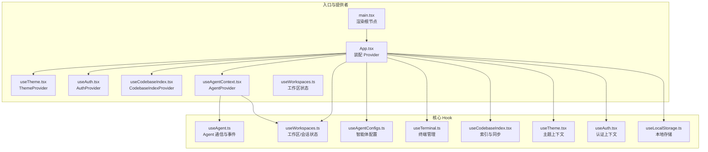
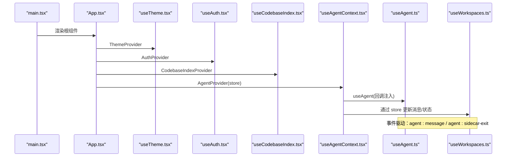
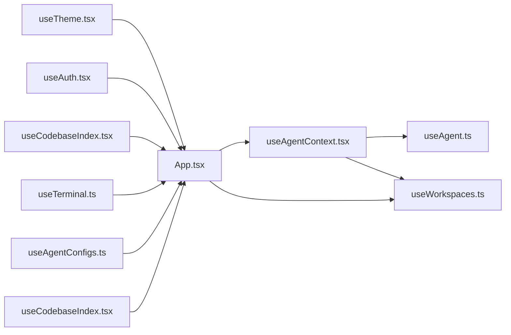

# 前端 API

<cite>
**本文引用的文件**
- [src/hooks/useAgent.ts](file://src/hooks/useAgent.ts)
- [src/hooks/useAgentContext.tsx](file://src/hooks/useAgentContext.tsx)
- [src/hooks/useWorkspaces.ts](file://src/hooks/useWorkspaces.ts)
- [src/hooks/useAgentConfigs.ts](file://src/hooks/useAgentConfigs.ts)
- [src/hooks/useCodebaseIndex.tsx](file://src/hooks/useCodebaseIndex.tsx)
- [src/hooks/useTheme.tsx](file://src/hooks/useTheme.tsx)
- [src/hooks/useAuth.tsx](file://src/hooks/useAuth.tsx)
- [src/hooks/useLocalStorage.ts](file://src/hooks/useLocalStorage.ts)
- [src/components/terminal/useTerminal.ts](file://src/components/terminal/useTerminal.ts)
- [src/types/index.ts](file://src/types/index.ts)
- [src/types/terminal.ts](file://src/types/terminal.ts)
- [src/App.tsx](file://src/App.tsx)
- [src/main.tsx](file://src/main.tsx)
</cite>

## 目录
1. [简介](#简介)
2. [项目结构](#项目结构)
3. [核心组件](#核心组件)
4. [架构总览](#架构总览)
5. [详细组件分析](#详细组件分析)
6. [依赖关系分析](#依赖关系分析)
7. [性能考量](#性能考量)
8. [故障排查指南](#故障排查指南)
9. [结论](#结论)
10. [附录](#附录)

## 简介
本文件为 RabbitCoding 前端 API 的权威文档，聚焦 React Hooks 与状态管理接口，涵盖以下核心能力：
- useAgent：与 Claude Agent SDK Sidecar 的通信与事件处理，支持启动/停止 Sidecar、发起/恢复/取消/压缩查询、响应 AskUserQuestion 等。
- useWorkspaces：工作区与 Rabbit（会话）的全量状态管理，含持久化、归档、消息流式增量、AskUserQuestion 状态、会话压缩阶段等。
- useAgentContext：将 Agent 事件提升至应用层级，统一处理流式消息、状态收敛与错误回滚。
- useTerminal：基于 xterm.js 与 PTY 的终端生命周期管理，支持适配、主题切换、跨平台默认 Shell。
- useAgentConfigs：智能体配置的增删改查与默认配置补齐。
- useCodebaseIndex：代码库索引安装、进度监听、分组同步等。
- useTheme/useAuth/useLocalStorage：主题、认证与本地存储抽象。

文档提供接口契约、类型定义、错误处理策略、常见使用场景与最佳实践，帮助开发者快速集成与扩展。

## 项目结构
前端采用“Hook + Context + 类型定义”的分层设计，核心入口在 App.tsx 中装配 Provider，形成稳定的上下文生态。

图表来源
- [src/main.tsx:1-11](file://src/main.tsx#L1-L11)
- [src/App.tsx:30-104](file://src/App.tsx#L30-L104)
- [src/hooks/useTheme.tsx:25-56](file://src/hooks/useTheme.tsx#L25-L56)
- [src/hooks/useAuth.tsx:94-241](file://src/hooks/useAuth.tsx#L94-L241)
- [src/hooks/useCodebaseIndex.tsx:79-500](file://src/hooks/useCodebaseIndex.tsx#L79-L500)
- [src/hooks/useAgentContext.tsx:88-285](file://src/hooks/useAgentContext.tsx#L88-L285)
- [src/hooks/useWorkspaces.ts:28-541](file://src/hooks/useWorkspaces.ts#L28-L541)
- [src/hooks/useAgent.ts:53-334](file://src/hooks/useAgent.ts#L53-L334)
- [src/hooks/useAgentConfigs.ts:17-130](file://src/hooks/useAgentConfigs.ts#L17-L130)
- [src/components/terminal/useTerminal.ts:33-202](file://src/components/terminal/useTerminal.ts#L33-L202)
- [src/hooks/useCodebaseIndex.tsx:79-500](file://src/hooks/useCodebaseIndex.tsx#L79-L500)
- [src/hooks/useTheme.tsx:25-56](file://src/hooks/useTheme.tsx#L25-L56)
- [src/hooks/useAuth.tsx:94-241](file://src/hooks/useAuth.tsx#L94-L241)
- [src/hooks/useLocalStorage.ts:3-26](file://src/hooks/useLocalStorage.ts#L3-L26)

章节来源
- [src/App.tsx:30-104](file://src/App.tsx#L30-L104)
- [src/main.tsx:1-11](file://src/main.tsx#L1-L11)

## 核心组件
本节概述关键 Hook 的职责、输入输出与典型用法。

- useAgent
  - 职责：与 Sidecar 交互，封装命令发送、事件监听、看门狗与思考态处理。
  - 关键导出：sidecarStatus、startSidecar、stopSidecar、checkStatus、startQuery、resumeQuery、cancelQuery、compactQuery、respondToolRequest。
  - 事件：agent:message、agent:sidecar-exit；内部解析 JSON 并分类处理。
  - 超时与思考态：独立看门狗，思考态延长阈值，避免纯静默思考误判。
  - 错误处理：启动/停止/检查状态失败时设置 error 状态并抛出。

- useWorkspaces
  - 职责：工作区与 Rabbit 的全量状态管理，含持久化、消息流式增量、AskUserQuestion 状态、压缩阶段、规格文件路径等。
  - 关键导出：工作区列表、选中项、编辑/新增状态、增删改查、消息追加与增量合并、状态收敛、AskUserQuestion 状态更新、压缩阶段更新等。
  - 持久化：SQLite 优先，回退 localStorage；双层防抖保存与周期强制保存。
  - 兼容性：旧数据补全、消息去重与类型收敛。

- useAgentContext
  - 职责：将 Agent 事件提升至应用层，统一处理流式消息、状态收敛与错误回滚。
  - 关键导出：startSidecar、stopSidecar、checkStatus、startQuery、resumeQuery、cancelQuery、compactQuery、respondToQuestion、cancelQuestion。
  - 机制：过滤 Spec 查询、取消查询标记、侧车退出统一收敛、看门狗超时兜底。

- useTerminal
  - 职责：xterm.js + PTY 终端生命周期管理，适配容器尺寸、主题切换、跨平台默认 Shell。
  - 关键导出：containerRef、ready、error、terminal、fit。
  - 机制：初始化 Terminal 与 FitAddon，加载 Canvas 渲染器，创建 PTY，双向数据流，ResizeObserver 防抖适配，清理时 kill PTY 并 dispose 终端。

- useAgentConfigs
  - 职责：智能体配置的增删改查，localStorage 持久化，默认配置补齐。
  - 关键导出：configs、getScopeConfig、updateBuiltinAgent、addCustomAgent、updateCustomAgent、deleteCustomAgent。

- useCodebaseIndex
  - 职责：Gitnexus 安装、索引状态管理、分组同步。
  - 关键导出：gitnexusAvailable、indexStates、syncStates、installStatus、installMessage、triggerIndex、syncWorkspace、refreshStatus、installGitnexus。
  - 机制：监听 gitnexus-progress 与 gitnexus-install-progress 事件，维护索引与同步状态。

- useTheme/useAuth/useLocalStorage
  - useTheme：主题选择与解析，同步到 <html>，驱动暗色模式。
  - useAuth：OAuth 2.0 Authorization Code + PKCE 登录流程，本地 loopback 回调处理。
  - useLocalStorage：通用本地存储 Hook，带容错。

章节来源
- [src/hooks/useAgent.ts:53-334](file://src/hooks/useAgent.ts#L53-L334)
- [src/hooks/useWorkspaces.ts:28-541](file://src/hooks/useWorkspaces.ts#L28-L541)
- [src/hooks/useAgentContext.tsx:88-285](file://src/hooks/useAgentContext.tsx#L88-L285)
- [src/components/terminal/useTerminal.ts:33-202](file://src/components/terminal/useTerminal.ts#L33-L202)
- [src/hooks/useAgentConfigs.ts:17-130](file://src/hooks/useAgentConfigs.ts#L17-L130)
- [src/hooks/useCodebaseIndex.tsx:79-500](file://src/hooks/useCodebaseIndex.tsx#L79-L500)
- [src/hooks/useTheme.tsx:25-56](file://src/hooks/useTheme.tsx#L25-L56)
- [src/hooks/useAuth.tsx:94-241](file://src/hooks/useAuth.tsx#L94-L241)
- [src/hooks/useLocalStorage.ts:3-26](file://src/hooks/useLocalStorage.ts#L3-L26)

## 架构总览
下图展示应用启动后 Provider 的装配顺序与数据流向，体现“状态提升 + 事件驱动 + 持久化”的整体架构。

图表来源
- [src/main.tsx:6-10](file://src/main.tsx#L6-L10)
- [src/App.tsx:64-103](file://src/App.tsx#L64-L103)
- [src/hooks/useTheme.tsx:25-56](file://src/hooks/useTheme.tsx#L25-L56)
- [src/hooks/useAuth.tsx:94-241](file://src/hooks/useAuth.tsx#L94-L241)
- [src/hooks/useCodebaseIndex.tsx:79-500](file://src/hooks/useCodebaseIndex.tsx#L79-L500)
- [src/hooks/useAgentContext.tsx:88-285](file://src/hooks/useAgentContext.tsx#L88-L285)
- [src/hooks/useAgent.ts:262-320](file://src/hooks/useAgent.ts#L262-L320)
- [src/hooks/useWorkspaces.ts:324-541](file://src/hooks/useWorkspaces.ts#L324-L541)

## 详细组件分析

### useAgent Hook
- 参数与返回
  - options?: UseAgentOptions
    - onMessage?: (queryId: string, message: AgentMessage) => void
    - onSidecarExit?: (reason: string) => void
    - onQueryTimeout?: (queryId: string) => void
  - 返回：sidecarStatus、startSidecar、stopSidecar、checkStatus、startQuery、resumeQuery、cancelQuery、compactQuery、respondToolRequest
- 关键实现要点
  - 事件监听：同时监听 agent:message 与 agent:sidecar-exit，使用 ref 存储回调以避免重复注册。
  - 看门狗：每条 query 独立计时，收到任意消息重置；思考态使用更宽松阈值。
  - 思考态分类：根据 payload.type/subtype 判断进入/退出思考态，影响下次超时阈值。
  - 命令发送：通过 invoke('send_to_sidecar') 发送 JSON 序列化命令；startQuery/resumeQuery/compactQuery/cancelQuery/respondToolRequest 对应不同命令类型。
  - Sidecar 生命周期：startSidecar/stopSidecar/checkStatus 通过 invoke('start_sidecar'|'stop_sidecar'|'get_sidecar_status') 控制。
- 错误处理
  - 启动失败：设置 sidecarStatus='error' 并抛出错误。
  - 侧车退出：统一清理看门狗并回调 onSidecarExit。
  - 超时：onQueryTimeout 回调触发，清理相关状态。
- 使用建议
  - 在组件卸载时无需手动清理 Agent 事件监听，useEffect 已在返回的清理函数中统一处理。
  - 对于需要跨路由保持流式消息的场景，推荐使用 AgentProvider 提升上下文。

章节来源
- [src/hooks/useAgent.ts:39-44](file://src/hooks/useAgent.ts#L39-L44)
- [src/hooks/useAgent.ts:106-126](file://src/hooks/useAgent.ts#L106-L126)
- [src/hooks/useAgent.ts:131-137](file://src/hooks/useAgent.ts#L131-L137)
- [src/hooks/useAgent.ts:142-151](file://src/hooks/useAgent.ts#L142-L151)
- [src/hooks/useAgent.ts:156-177](file://src/hooks/useAgent.ts#L156-L177)
- [src/hooks/useAgent.ts:182-205](file://src/hooks/useAgent.ts#L182-L205)
- [src/hooks/useAgent.ts:210-216](file://src/hooks/useAgent.ts#L210-L216)
- [src/hooks/useAgent.ts:222-243](file://src/hooks/useAgent.ts#L222-L243)
- [src/hooks/useAgent.ts:248-256](file://src/hooks/useAgent.ts#L248-L256)
- [src/hooks/useAgent.ts:262-320](file://src/hooks/useAgent.ts#L262-L320)
- [src/hooks/useAgent.ts:23-37](file://src/hooks/useAgent.ts#L23-L37)
- [src/hooks/useAgent.ts:69-95](file://src/hooks/useAgent.ts#L69-L95)

### useWorkspaces Hook
- 参数与返回
  - 无参数；返回工作区列表、选中项、编辑/新增状态、以及大量更新方法。
- 关键实现要点
  - 数据源：优先 SQLite，回退 localStorage；首次启动尝试迁移。
  - 持久化：双层防抖（500ms）+ 周期保存（3s）；DB 不可用时写 localStorage。
  - 消息处理：appendRabbitMessage、appendDeltaToLastMessage、updateThinkingDuration、updateAskUserQuestionStatus、appendSpecPath。
  - 状态收敛：resetAllRunningRabbits；重启后清理“进行中”状态，避免 UI 永远 loading。
  - 兼容性：normalize 兼容旧数据，确保字段存在。
- 使用建议
  - 在 UI 中使用 normalizedWorkspaces，避免直接操作原始数据。
  - 流式消息请通过 AgentProvider 与 useAgentContext 自动注入，减少手动拼接。

章节来源
- [src/hooks/useWorkspaces.ts:48-95](file://src/hooks/useWorkspaces.ts#L48-L95)
- [src/hooks/useWorkspaces.ts:101-119](file://src/hooks/useWorkspaces.ts#L101-L119)
- [src/hooks/useWorkspaces.ts:122-129](file://src/hooks/useWorkspaces.ts#L122-L129)
- [src/hooks/useWorkspaces.ts:132-147](file://src/hooks/useWorkspaces.ts#L132-L147)
- [src/hooks/useWorkspaces.ts:324-541](file://src/hooks/useWorkspaces.ts#L324-L541)

### useAgentContext Provider
- 参数与返回
  - props.store: ReturnType<typeof useWorkspaces>
  - 提供：sidecarStatus、startSidecar、stopSidecar、checkStatus、startQuery、resumeQuery、cancelQuery、compactQuery、respondToQuestion、cancelQuestion。
- 关键实现要点
  - 事件处理：onMessage 中根据消息类型更新 store，包括流式增量、最终结果、错误、压缩阶段、AskUserQuestion 状态、UsageUpdate 等。
  - 取消查询：先标记再发送命令，30s 后清理标记，防止内存泄漏。
  - 失败回滚：startQuery/resumeQuery 失败时回滚 Rabbit 状态为 error。
  - 侧车退出：统一收敛所有 running Rabbit 为 error。
  - 超时兜底：onQueryTimeout 回滚状态并设置错误信息。
- 使用建议
  - 在需要跨组件共享 Agent 事件与状态时，使用 AgentProvider 包裹业务组件树。
  - 对 AskUserQuestion 的响应需先更新前端状态，再发送命令。

章节来源
- [src/hooks/useAgentContext.tsx:88-285](file://src/hooks/useAgentContext.tsx#L88-L285)
- [src/hooks/useAgentContext.tsx:92-193](file://src/hooks/useAgentContext.tsx#L92-L193)
- [src/hooks/useAgentContext.tsx:196-212](file://src/hooks/useAgentContext.tsx#L196-L212)
- [src/hooks/useAgentContext.tsx:215-241](file://src/hooks/useAgentContext.tsx#L215-L241)
- [src/hooks/useAgentContext.tsx:244-269](file://src/hooks/useAgentContext.tsx#L244-L269)

### useTerminal Hook
- 参数与返回
  - options: UseTerminalOptions
    - cwd?: string
    - visible?: boolean
    - resolvedTheme?: ResolvedTheme
  - 返回：containerRef、ready、error、terminal、fit
- 关键实现要点
  - 默认 Shell：Windows 使用 PowerShell，类 Unix 使用 zsh。
  - 初始化：创建 Terminal、FitAddon、CanvasAddon（失败回退 DOM）、spawn PTY。
  - 双向数据流：PTY -> Terminal、Terminal -> PTY。
  - 适配：ResizeObserver 防抖 200ms，fit() 同步 cols/rows。
  - 清理：kill PTY、dispose Terminal、断开 ResizeObserver。
- 使用建议
  - 在容器可见时调用 fit()，避免 fitAddon.fit() 在 display:none 时抛异常。
  - 主题切换时通过 resolvedTheme 动态更新终端主题。

章节来源
- [src/components/terminal/useTerminal.ts:33-202](file://src/components/terminal/useTerminal.ts#L33-L202)
- [src/components/terminal/useTerminal.ts:64-129](file://src/components/terminal/useTerminal.ts#L64-L129)
- [src/components/terminal/useTerminal.ts:161-183](file://src/components/terminal/useTerminal.ts#L161-L183)
- [src/components/terminal/useTerminal.ts:186-192](file://src/components/terminal/useTerminal.ts#L186-L192)

### useAgentConfigs Hook
- 参数与返回
  - 无参数；返回 configs、getScopeConfig、updateBuiltinAgent、addCustomAgent、updateCustomAgent、deleteCustomAgent。
- 关键实现要点
  - 默认配置补齐：若内置角色缺失，自动补全。
  - 作用域隔离：按 scope 管理配置，确保不存在时写入默认值。
  - 持久化：localStorage('agent-configs')。
- 使用建议
  - 读取配置前先调用 getScopeConfig，确保返回完整默认配置。

章节来源
- [src/hooks/useAgentConfigs.ts:17-130](file://src/hooks/useAgentConfigs.ts#L17-L130)
- [src/hooks/useAgentConfigs.ts:25-38](file://src/hooks/useAgentConfigs.ts#L25-L38)
- [src/hooks/useAgentConfigs.ts:41-47](file://src/hooks/useAgentConfigs.ts#L41-L47)
- [src/hooks/useAgentConfigs.ts:50-64](file://src/hooks/useAgentConfigs.ts#L50-L64)
- [src/hooks/useAgentConfigs.ts:67-87](file://src/hooks/useAgentConfigs.ts#L67-L87)
- [src/hooks/useAgentConfigs.ts:89-104](file://src/hooks/useAgentConfigs.ts#L89-L104)
- [src/hooks/useAgentConfigs.ts:107-119](file://src/hooks/useAgentConfigs.ts#L107-L119)

### useCodebaseIndex Provider
- 参数与返回
  - props.workspaces: Workspace[]
  - 提供：gitnexusAvailable、indexStates、syncStates、installStatus、installMessage、triggerIndex、syncWorkspace、refreshStatus、installGitnexus。
- 关键实现要点
  - 初始化：检测 gitnexus、加载已索引列表，构建 docs/repo 索引项。
  - 事件监听：gitnexus-progress 更新索引状态；gitnexus-install-progress 更新安装状态。
  - 分组同步：创建 group → 添加 docs/repo → group sync。
  - 防重入：triggerIndex 使用 Set 防止并发重复触发。
- 使用建议
  - 在 UI 中根据 indexStates 与 syncStates 渲染索引与同步状态。
  - 安装完成后调用 refreshStatus 重新检测与加载索引列表。

章节来源
- [src/hooks/useCodebaseIndex.tsx:79-500](file://src/hooks/useCodebaseIndex.tsx#L79-L500)
- [src/hooks/useCodebaseIndex.tsx:102-141](file://src/hooks/useCodebaseIndex.tsx#L102-L141)
- [src/hooks/useCodebaseIndex.tsx:146-192](file://src/hooks/useCodebaseIndex.tsx#L146-L192)
- [src/hooks/useCodebaseIndex.tsx:197-249](file://src/hooks/useCodebaseIndex.tsx#L197-L249)
- [src/hooks/useCodebaseIndex.tsx:254-275](file://src/hooks/useCodebaseIndex.tsx#L254-L275)
- [src/hooks/useCodebaseIndex.tsx:280-316](file://src/hooks/useCodebaseIndex.tsx#L280-L316)
- [src/hooks/useCodebaseIndex.tsx:321-380](file://src/hooks/useCodebaseIndex.tsx#L321-L380)
- [src/hooks/useCodebaseIndex.tsx:385-444](file://src/hooks/useCodebaseIndex.tsx#L385-L444)
- [src/hooks/useCodebaseIndex.tsx:449-477](file://src/hooks/useCodebaseIndex.tsx#L449-L477)

### useTheme/useAuth/useLocalStorage
- useTheme
  - 提供 theme、resolvedTheme、setTheme；监听系统深色偏好；同步到 <html>。
- useAuth
  - OAuth 2.0 Authorization Code + PKCE 登录；监听本地 loopback 回调；持久化用户信息。
- useLocalStorage
  - 通用本地存储 Hook，带容错处理。

章节来源
- [src/hooks/useTheme.tsx:25-56](file://src/hooks/useTheme.tsx#L25-L56)
- [src/hooks/useAuth.tsx:94-241](file://src/hooks/useAuth.tsx#L94-L241)
- [src/hooks/useLocalStorage.ts:3-26](file://src/hooks/useLocalStorage.ts#L3-L26)

## 依赖关系分析
- Provider 装配顺序：Theme -> Auth -> CodebaseIndex -> AgentProvider -> App 内容区域。
- AgentProvider 依赖 useAgent 与 useWorkspaces，将事件处理与状态更新解耦。
- useWorkspaces 依赖 useLocalStorage 与 SQLite/本地存储持久化。
- useTerminal 依赖 xterm.js 与 tauri-pty，跨平台默认 Shell 选择。
- useCodebaseIndex 依赖 Rust 侧命令与事件，监听 gitnexus-progress/install-progress。

图表来源
- [src/App.tsx:64-103](file://src/App.tsx#L64-L103)
- [src/hooks/useAgentContext.tsx:88-285](file://src/hooks/useAgentContext.tsx#L88-L285)
- [src/hooks/useAgent.ts:53-334](file://src/hooks/useAgent.ts#L53-L334)
- [src/hooks/useWorkspaces.ts:28-541](file://src/hooks/useWorkspaces.ts#L28-L541)
- [src/components/terminal/useTerminal.ts:33-202](file://src/components/terminal/useTerminal.ts#L33-L202)
- [src/hooks/useAgentConfigs.ts:17-130](file://src/hooks/useAgentConfigs.ts#L17-L130)
- [src/hooks/useCodebaseIndex.tsx:79-500](file://src/hooks/useCodebaseIndex.tsx#L79-L500)

## 性能考量
- useWorkspaces
  - 双层防抖与周期保存降低 IO 压力，避免频繁写入。
  - normalizedWorkspaces 与 ref 持有最新状态，减少渲染抖动。
- useAgent
  - 看门狗按 query 粒度计时，避免全局阻塞；思考态放宽阈值减少误判。
  - 事件监听使用 ref 存储回调，避免因 options 引用变化重复注册。
- useTerminal
  - ResizeObserver 防抖 200ms，fit() 在 ready 且 visible 时触发，避免无效计算。
  - CanvasAddon 加载失败回退 DOM 渲染，兼顾性能与兼容性。
- useCodebaseIndex
  - 防重入 Set 避免并发重复触发；done/error 事件驱动状态更新，减少轮询。

## 故障排查指南
- Agent 侧车启动失败
  - 现象：sidecarStatus='error'，startSidecar 抛错。
  - 排查：检查 API Key、Base URL、环境变量；查看 onSidecarExit 回调与错误日志。
- Agent 查询无响应或卡死
  - 现象：status 永远 running。
  - 排查：确认看门狗是否触发 onQueryTimeout；检查思考态是否过长；必要时调用 cancelQuery。
- 侧车退出后消息丢失
  - 现象：UI 永远 loading。
  - 排查：AgentProvider 是否正确收敛；onSidecarExit 是否触发 resetAllRunningRabbits。
- 终端初始化失败
  - 现象：error 非空，ready=false。
  - 排查：检查默认 Shell、权限、容器尺寸；fitAddon.fit() 在 display:none 时会抛异常，需在可见时调用 fit。
- 索引安装/同步失败
  - 现象：installStatus='error' 或 syncStates='error'。
  - 排查：查看 gitnexus-install-progress 与 gitnexus-progress 事件详情；确认网络与磁盘权限。

章节来源
- [src/hooks/useAgent.ts:106-126](file://src/hooks/useAgent.ts#L106-L126)
- [src/hooks/useAgent.ts:182-205](file://src/hooks/useAgent.ts#L182-L205)
- [src/hooks/useAgentContext.tsx:180-192](file://src/hooks/useAgentContext.tsx#L180-L192)
- [src/components/terminal/useTerminal.ts:94-109](file://src/components/terminal/useTerminal.ts#L94-L109)
- [src/hooks/useCodebaseIndex.tsx:254-275](file://src/hooks/useCodebaseIndex.tsx#L254-L275)

## 结论
本文档系统梳理了 RabbitCoding 前端 API 的核心 Hook 与上下文，明确了接口契约、数据流与错误处理策略。通过 Provider 装配与事件驱动模型，实现了稳定的状态管理与良好的用户体验。建议在实际开发中遵循本文的最佳实践，结合具体场景选择合适的 Hook 与 Provider 组合。

## 附录
- TypeScript 类型定义参考
  - Agent 消息类型、查询选项、Sidecar 状态、TokenUsage、AskUserQuestion 等。
  - 终端会话类型 TerminalSession。
- 常见使用场景
  - 发起查询：AgentProvider.startQuery -> 流式消息 -> 最终结果/错误 -> UI 更新。
  - 管理工作区：useWorkspaces 增删改查 + 持久化。
  - 终端集成：useTerminal 初始化 -> 适配 -> 清理。
  - 索引与同步：installGitnexus -> triggerIndex -> syncWorkspace -> 监听进度事件。

章节来源
- [src/types/index.ts:82-295](file://src/types/index.ts#L82-L295)
- [src/types/terminal.ts:1-6](file://src/types/terminal.ts#L1-L6)
- [src/hooks/useAgent.ts:53-334](file://src/hooks/useAgent.ts#L53-L334)
- [src/hooks/useWorkspaces.ts:28-541](file://src/hooks/useWorkspaces.ts#L28-L541)
- [src/components/terminal/useTerminal.ts:33-202](file://src/components/terminal/useTerminal.ts#L33-L202)
- [src/hooks/useCodebaseIndex.tsx:79-500](file://src/hooks/useCodebaseIndex.tsx#L79-L500)