# GitNexus 命令

<cite>
**本文档引用的文件**
- [gitnexus.rs](file://src-tauri/src/gitnexus.rs)
- [lib.rs](file://src-tauri/src/lib.rs)
- [main.rs](file://src-tauri/src/main.rs)
- [useCodebaseIndex.tsx](file://src/hooks/useCodebaseIndex.tsx)
- [index.ts](file://src/types/index.ts)
</cite>

## 目录
1. [简介](#简介)
2. [项目结构](#项目结构)
3. [核心组件](#核心组件)
4. [架构概览](#架构概览)
5. [详细组件分析](#详细组件分析)
6. [依赖关系分析](#依赖关系分析)
7. [性能考虑](#性能考虑)
8. [故障排除指南](#故障排除指南)
9. [结论](#结论)

## 简介

GitNexus 是 RabbitCoding 项目中的代码索引和管理模块，基于 GitNexus CLI 工具构建。它提供了完整的 Git 仓库管理、代码分析、分组管理和同步机制，支持多工作区的代码知识库构建和维护。

该模块通过 Tauri 框架在 Rust 后端执行 GitNexus CLI 命令，同时在前端提供实时的状态跟踪和用户界面更新。所有操作都经过严格的权限验证和错误处理，确保系统的稳定性和可靠性。

## 项目结构

GitNexus 功能分布在以下关键文件中：

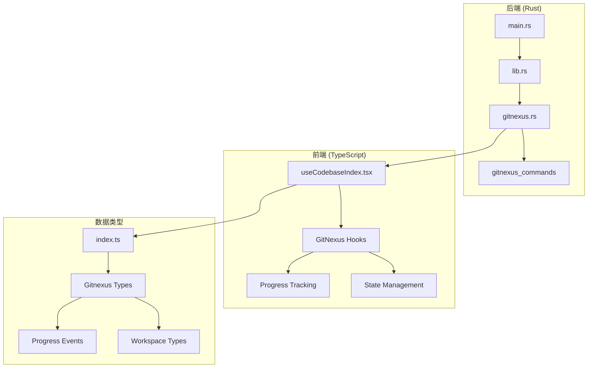

**图表来源**
- [main.rs:1-7](file://src-tauri/src/main.rs#L1-L7)
- [lib.rs:522-566](file://src-tauri/src/lib.rs#L522-L566)
- [gitnexus.rs:176-761](file://src-tauri/src/gitnexus.rs#L176-L761)

**章节来源**
- [main.rs:1-7](file://src-tauri/src/main.rs#L1-L7)
- [lib.rs:375-569](file://src-tauri/src/lib.rs#L375-L569)

## 核心组件

### 数据结构设计

GitNexus 模块定义了完整的数据结构体系，确保前后端数据的一致性：

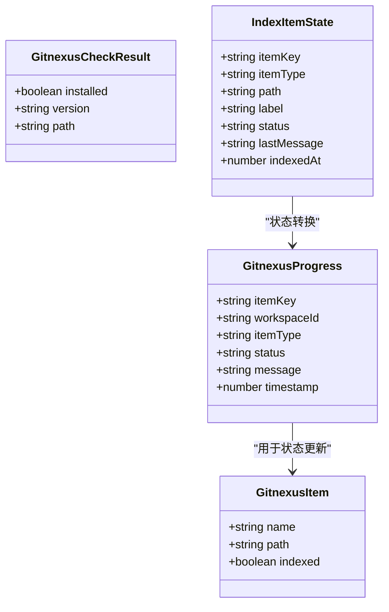

**图表来源**
- [gitnexus.rs:13-38](file://src-tauri/src/gitnexus.rs#L13-L38)
- [index.ts:579-605](file://src/types/index.ts#L579-L605)

### 命令注册机制

所有 GitNexus 命令都在主入口点集中注册，确保统一的生命周期管理：

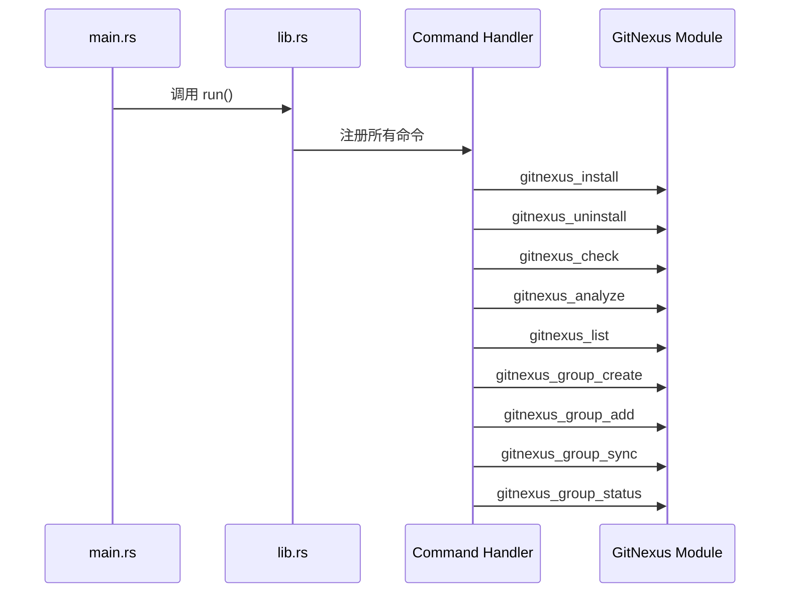

**图表来源**
- [lib.rs:544-552](file://src-tauri/src/lib.rs#L544-L552)
- [gitnexus.rs:180-760](file://src-tauri/src/gitnexus.rs#L180-L760)

**章节来源**
- [gitnexus.rs:9-77](file://src-tauri/src/gitnexus.rs#L9-L77)
- [lib.rs:522-566](file://src-tauri/src/lib.rs#L522-L566)

## 架构概览

GitNexus 采用分层架构设计，确保功能模块的清晰分离和高内聚低耦合：

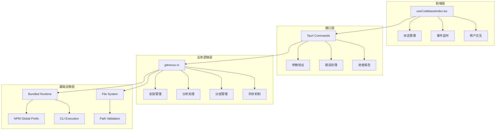

**图表来源**
- [gitnexus.rs:40-174](file://src-tauri/src/gitnexus.rs#L40-L174)
- [useCodebaseIndex.tsx:79-500](file://src/hooks/useCodebaseIndex.tsx#L79-L500)

### 内置运行时架构

GitNexus 采用完全隔离的内置运行时架构，避免系统依赖冲突：

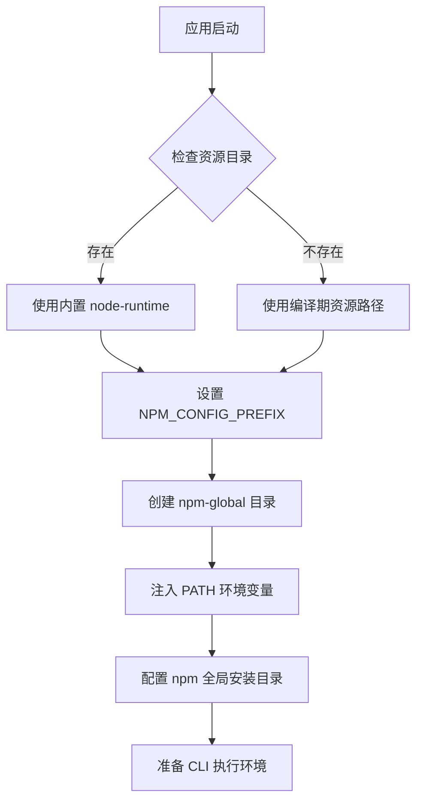

**图表来源**
- [gitnexus.rs:57-111](file://src-tauri/src/gitnexus.rs#L57-L111)
- [lib.rs:407-461](file://src-tauri/src/lib.rs#L407-L461)

**章节来源**
- [gitnexus.rs:40-133](file://src-tauri/src/gitnexus.rs#L40-L133)
- [lib.rs:375-520](file://src-tauri/src/lib.rs#L375-L520)

## 详细组件分析

### 安装管理组件

安装管理组件负责 GitNexus CLI 的安装、卸载和状态检测：

#### 安装流程

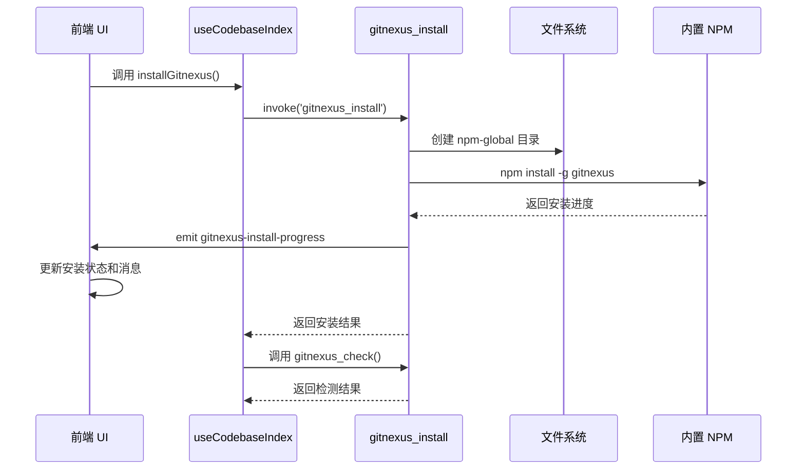

**图表来源**
- [gitnexus.rs:180-311](file://src-tauri/src/gitnexus.rs#L180-L311)
- [useCodebaseIndex.tsx:278-316](file://src/hooks/useCodebaseIndex.tsx#L278-L316)

#### 卸载流程

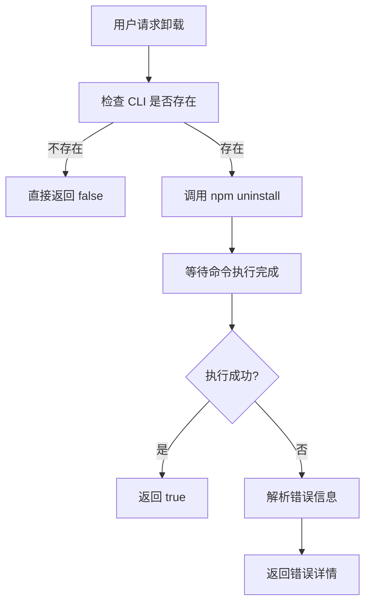

**图表来源**
- [gitnexus.rs:313-348](file://src-tauri/src/gitnexus.rs#L313-L348)

**章节来源**
- [gitnexus.rs:180-348](file://src-tauri/src/gitnexus.rs#L180-L348)
- [useCodebaseIndex.tsx:278-316](file://src/hooks/useCodebaseIndex.tsx#L278-L316)

### 代码分析组件

代码分析组件负责对指定路径进行代码索引和分析：

#### 分析流程

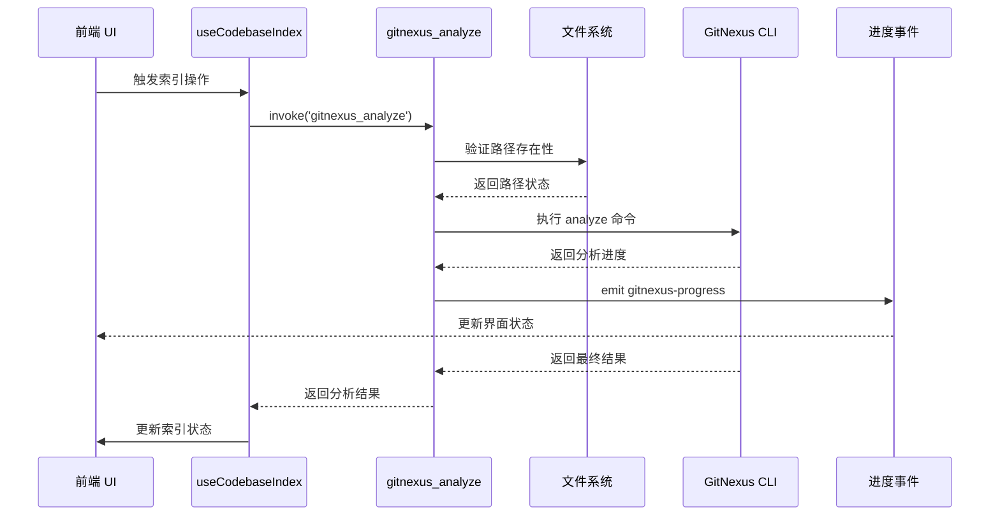

**图表来源**
- [gitnexus.rs:381-561](file://src-tauri/src/gitnexus.rs#L381-L561)
- [useCodebaseIndex.tsx:318-380](file://src/hooks/useCodebaseIndex.tsx#L318-L380)

#### Git 仓库检测机制

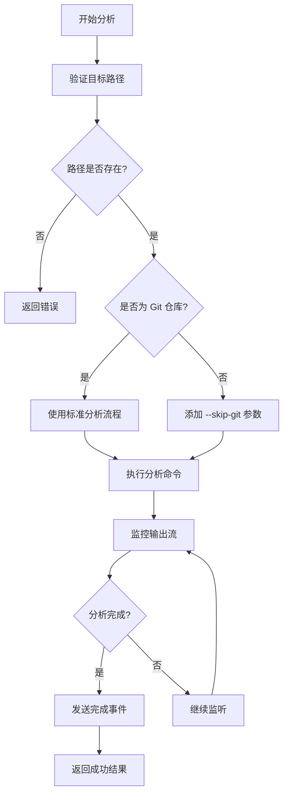

**图表来源**
- [gitnexus.rs:408-427](file://src-tauri/src/gitnexus.rs#L408-L427)

**章节来源**
- [gitnexus.rs:381-561](file://src-tauri/src/gitnexus.rs#L381-L561)
- [useCodebaseIndex.tsx:318-380](file://src/hooks/useCodebaseIndex.tsx#L318-L380)

### 分组管理组件

分组管理组件提供工作区级别的代码组织和同步功能：

#### 分组同步流程

```mermaid
sequenceDiagram
participant UI as 前端 UI
participant Hook as useCodebaseIndex
participant Create as group_create
participant Add as group_add
participant Sync as group_sync
participant Status as group_status
UI->>Hook : 调用 syncWorkspace()
Hook->>Create : 创建分组
Create-->>Hook : 返回创建结果
Hook->>Add : 添加 docs 项
Add-->>Hook : 返回添加结果
Hook->>Add : 添加所有已索引的 repo
Add-->>Hook : 返回添加结果
Hook->>Sync : 执行分组同步
Sync-->>Hook : 返回同步结果
Hook->>Status : 查询同步状态
Status-->>Hook : 返回状态信息
Hook->>UI : 更新同步状态
```

**图表来源**
- [gitnexus.rs:603-760](file://src-tauri/src/gitnexus.rs#L603-L760)
- [useCodebaseIndex.tsx:382-444](file://src/hooks/useCodebaseIndex.tsx#L382-L444)

#### 分组状态管理

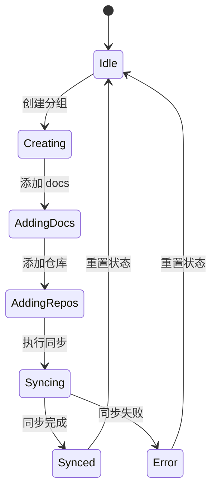

**图表来源**
- [useCodebaseIndex.tsx:382-444](file://src/hooks/useCodebaseIndex.tsx#L382-L444)

**章节来源**
- [gitnexus.rs:603-760](file://src-tauri/src/gitnexus.rs#L603-L760)
- [useCodebaseIndex.tsx:382-444](file://src/hooks/useCodebaseIndex.tsx#L382-L444)

### 进度跟踪组件

进度跟踪组件提供实时的操作状态反馈：

#### 事件监听机制

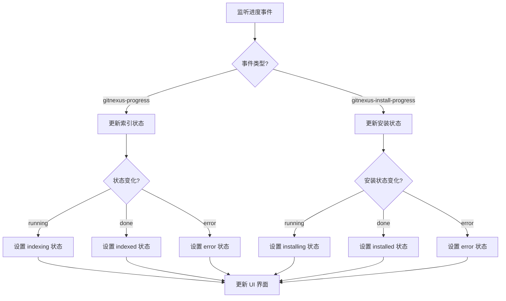

**图表来源**
- [useCodebaseIndex.tsx:194-275](file://src/hooks/useCodebaseIndex.tsx#L194-L275)

**章节来源**
- [useCodebaseIndex.tsx:194-275](file://src/hooks/useCodebaseIndex.tsx#L194-L275)

## 依赖关系分析

### 外部依赖

GitNexus 模块的外部依赖关系如下：

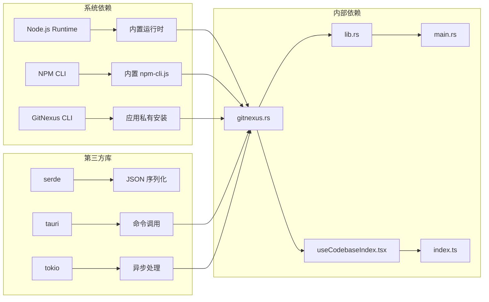

**图表来源**
- [gitnexus.rs:1-7](file://src-tauri/src/gitnexus.rs#L1-L7)
- [lib.rs:1-10](file://src-tauri/src/lib.rs#L1-L10)

### 内部模块依赖

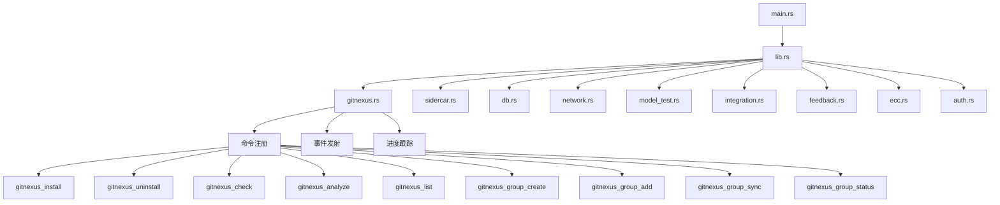

**图表来源**
- [lib.rs:522-566](file://src-tauri/src/lib.rs#L522-L566)
- [gitnexus.rs:176-761](file://src-tauri/src/gitnexus.rs#L176-L761)

**章节来源**
- [lib.rs:522-566](file://src-tauri/src/lib.rs#L522-L566)
- [gitnexus.rs:176-761](file://src-tauri/src/gitnexus.rs#L176-L761)

## 性能考虑

### 异步处理优化

GitNexus 模块采用异步处理机制，确保 UI 响应性和系统稳定性：

1. **并发执行**: 所有长时间运行的操作都在独立的 Tokio 任务中执行
2. **流式输出**: 通过标准输出流实时获取进度信息，避免阻塞
3. **内存管理**: 使用 Arc<Mutex<T>> 确保线程间安全的数据共享
4. **资源清理**: 正确关闭文件描述符和清理临时资源

### 缓存策略

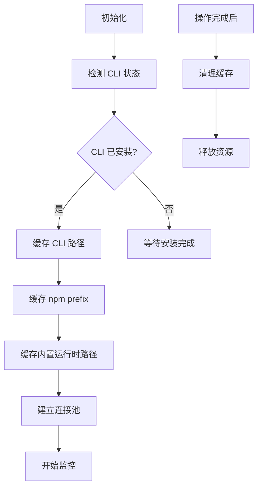

### 错误恢复机制

GitNexus 提供多层次的错误恢复机制：

1. **渐进式失败**: 单个操作失败不会影响其他操作
2. **状态回滚**: 支持部分成功的状态回滚
3. **重试机制**: 对暂时性错误提供自动重试
4. **降级处理**: 在严重错误时提供基本功能降级

## 故障排除指南

### 常见问题诊断

#### 安装问题

| 问题症状 | 可能原因 | 解决方案 |
|---------|---------|---------|
| 安装失败 | 网络连接问题 | 检查网络连接，使用代理设置 |
| 权限错误 | 文件系统权限不足 | 检查 npm-global 目录权限 |
| 资源缺失 | 内置运行时损坏 | 重新安装应用或修复资源文件 |

#### 分析问题

| 问题症状 | 可能原因 | 解决方案 |
|---------|---------|---------|
| 分析卡住 | 大型仓库处理缓慢 | 增加超时时间，检查磁盘空间 |
| 权限拒绝 | 文件访问权限不足 | 检查仓库访问权限 |
| 内存溢出 | 仓库过大 | 分批处理，增加系统内存 |

#### 同步问题

| 问题症状 | 可能原因 | 解决方案 |
|---------|---------|---------|
| 同步失败 | 网络连接中断 | 检查网络连接，重试同步 |
| 状态不一致 | 并发操作冲突 | 等待当前操作完成，避免并发同步 |
| 性能问题 | 仓库数量过多 | 分批同步，优化仓库结构 |

### 调试技巧

1. **启用详细日志**: 在开发模式下查看详细的进度事件
2. **监控系统资源**: 使用系统监控工具检查 CPU 和内存使用
3. **检查文件权限**: 确保应用对工作区目录有足够权限
4. **验证网络连接**: 确保能够访问必要的网络资源

**章节来源**
- [gitnexus.rs:268-307](file://src-tauri/src/gitnexus.rs#L268-L307)
- [gitnexus.rs:516-557](file://src-tauri/src/gitnexus.rs#L516-L557)

## 结论

GitNexus 模块为 RabbitCoding 提供了完整的代码索引和管理解决方案。通过精心设计的架构和完善的错误处理机制，它确保了系统的稳定性、可扩展性和用户体验。

主要特点包括：

1. **完全隔离的运行时**: 避免系统依赖冲突，确保跨平台兼容性
2. **实时状态跟踪**: 提供详细的进度反馈和状态更新
3. **强大的错误处理**: 多层次的错误恢复和降级机制
4. **灵活的配置选项**: 支持多种工作区和仓库管理模式
5. **高性能的异步处理**: 确保 UI 响应性和系统稳定性

该模块为后续的功能扩展奠定了坚实的基础，包括更高级的代码分析、智能推荐和协作功能。