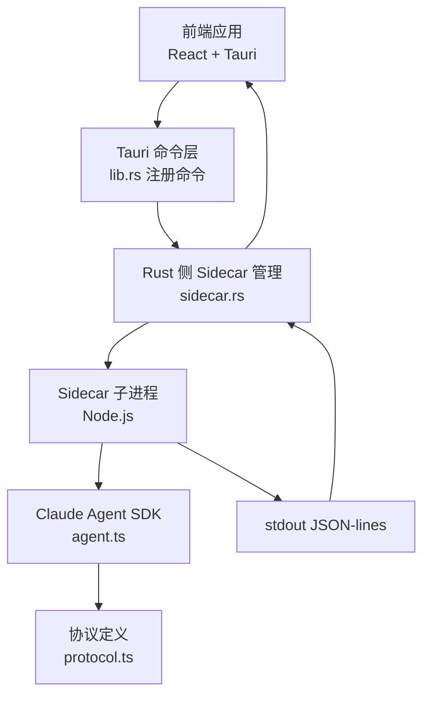
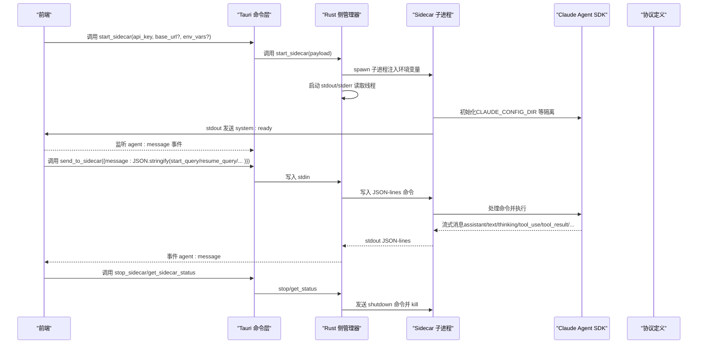
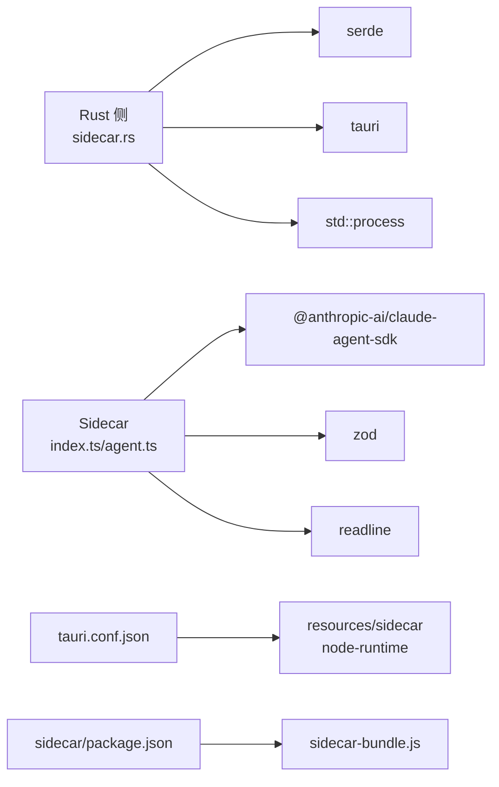

# Sidecar 进程命令

<cite>
**本文引用的文件**
- [src-tauri/src/sidecar.rs](file://src-tauri/src/sidecar.rs)
- [src-tauri/src/lib.rs](file://src-tauri/src/lib.rs)
- [sidecar/src/index.ts](file://sidecar/src/index.ts)
- [sidecar/src/protocol.ts](file://sidecar/src/protocol.ts)
- [sidecar/src/agent.ts](file://sidecar/src/agent.ts)
- [src/hooks/useAgent.ts](file://src/hooks/useAgent.ts)
- [src-tauri/tauri.conf.json](file://src-tauri/tauri.conf.json)
- [sidecar/package.json](file://sidecar/package.json)
</cite>

## 目录
1. [简介](#简介)
2. [项目结构](#项目结构)
3. [核心组件](#核心组件)
4. [架构总览](#架构总览)
5. [详细组件分析](#详细组件分析)
6. [依赖关系分析](#依赖关系分析)
7. [性能考量](#性能考量)
8. [故障排查指南](#故障排查指南)
9. [结论](#结论)
10. [附录](#附录)

## 简介
本文面向 RabbitCoding 的 Sidecar 进程控制命令，系统性梳理以下 API 的参数、返回值、错误处理与生命周期管理：
- start_sidecar：启动 Sidecar 进程
- send_to_sidecar：向 Sidecar 发送命令（JSON-lines）
- stop_sidecar：停止 Sidecar 进程
- get_sidecar_status：查询 Sidecar 运行状态

同时覆盖 Sidecar 的进程间通信协议、事件流转、状态同步、启动参数与环境变量、工作目录等配置项，并提供前端调用示例与错误恢复策略。

## 项目结构
- Rust 后端（Tauri）负责：
  - 管理 Sidecar 进程生命周期
  - 通过 stdin/stdout 与 Sidecar 交互
  - 将 Sidecar 的 stdout 事件转发给前端
- Sidecar（Node.js）负责：
  - 解析前端下发的 JSON-lines 命令
  - 通过 Claude Agent SDK 执行查询、工具调用、会话压缩等
  - 将流式消息以 JSON-lines 输出到 stdout

图表来源
- [src-tauri/src/lib.rs:521-566](file://src-tauri/src/lib.rs#L521-L566)
- [src-tauri/src/sidecar.rs:61-214](file://src-tauri/src/sidecar.rs#L61-L214)
- [sidecar/src/index.ts:96-128](file://sidecar/src/index.ts#L96-L128)
- [sidecar/src/agent.ts:241-465](file://sidecar/src/agent.ts#L241-L465)
- [sidecar/src/protocol.ts:13-78](file://sidecar/src/protocol.ts#L13-L78)

章节来源
- [src-tauri/src/lib.rs:521-566](file://src-tauri/src/lib.rs#L521-L566)
- [src-tauri/src/sidecar.rs:61-214](file://src-tauri/src/sidecar.rs#L61-L214)
- [sidecar/src/index.ts:96-128](file://sidecar/src/index.ts#L96-L128)
- [sidecar/src/agent.ts:241-465](file://sidecar/src/agent.ts#L241-L465)
- [sidecar/src/protocol.ts:13-78](file://sidecar/src/protocol.ts#L13-L78)

## 核心组件
- Rust 侧命令与状态管理
  - start_sidecar：启动 Sidecar，注入环境变量，建立 stdout/stderr 读取线程，转发事件到前端
  - send_to_sidecar：向 Sidecar stdin 写入 JSON-lines 命令
  - stop_sidecar：优雅关闭 Sidecar（先写 shutdown 命令，再 kill）
  - get_sidecar_status：查询当前进程是否存在且存活
- Sidecar 协议与消息
  - InboundMessage：前端 → Sidecar 的命令集合（start/resume/cancel/compact/respond/shutdown）
  - AgentMessage：Sidecar → 前端的流式消息集合（system/init、assistant/text/thinking/tool_use/tool_result/result/error 等）

章节来源
- [src-tauri/src/sidecar.rs:16-49](file://src-tauri/src/sidecar.rs#L16-L49)
- [sidecar/src/protocol.ts:13-78](file://sidecar/src/protocol.ts#L13-L78)
- [sidecar/src/protocol.ts:84-252](file://sidecar/src/protocol.ts#L84-L252)

## 架构总览
下面的序列图展示了从前端发起 start_sidecar 到 Sidecar 就绪、再到查询命令下发与事件回传的完整流程。

图表来源
- [src-tauri/src/sidecar.rs:61-214](file://src-tauri/src/sidecar.rs#L61-L214)
- [sidecar/src/index.ts:96-128](file://sidecar/src/index.ts#L96-L128)
- [sidecar/src/agent.ts:241-465](file://sidecar/src/agent.ts#L241-L465)
- [sidecar/src/protocol.ts:13-78](file://sidecar/src/protocol.ts#L13-L78)

## 详细组件分析

### start_sidecar 命令
- 触发方式
  - 前端通过 Tauri invoke 调用
  - Rust 侧命令函数接收 StartSidecarPayload
- 参数
  - api_key: 必填，注入到 ANTHROPIC_API_KEY
  - base_url: 可选，注入到 ANTHROPIC_BASE_URL
  - env_vars: 可选，自定义环境变量映射
- 返回值
  - SidecarResult：success（布尔），error（可选字符串）
- 行为与错误处理
  - 若已有运行中的子进程，先尝试 wait 判断是否存活，若已退出则清理句柄
  - 清理可能污染的 ANTHROPIC_* 环境变量，确保 BYOK 完全生效
  - 将 Claude 配置根目录重定向到应用专用目录（CLAUDE_CONFIG_DIR），隔离用户全局配置
  - 注入 api_key/base_url/env_vars
  - 启动 stdout/stderr 读取线程，将 stdout 行转为 agent:message 事件，stderr 输出日志
  - 返回成功或失败（spawn 失败时包含错误信息）
- 生命周期
  - 子进程句柄保存在 SidecarState 中，供后续命令使用
  - stdout 读取线程在 stdout 关闭时发出 agent:sidecar-exit 事件

章节来源
- [src-tauri/src/sidecar.rs:61-214](file://src-tauri/src/sidecar.rs#L61-L214)
- [src-tauri/src/lib.rs:532-532](file://src-tauri/src/lib.rs#L532-L532)

### send_to_sidecar 命令
- 触发方式
  - 前端通过 Tauri invoke 调用
  - Rust 侧命令函数接收 SendMessagePayload
- 参数
  - message: 字符串，应为一条合法的 JSON-lines 命令
- 返回值
  - SidecarResult：success（布尔），error（可选字符串）
- 行为与错误处理
  - 若无运行中的子进程，返回错误
  - 向子进程 stdin 写入一行 JSON
  - 写入失败返回错误，成功返回成功
- 协议
  - 前端应构造符合 protocol.ts 的 InboundMessage（如 start_query/resume_query/cancel_query/compact_query/respond_tool_request/shutdown）

章节来源
- [src-tauri/src/sidecar.rs:216-243](file://src-tauri/src/sidecar.rs#L216-L243)
- [sidecar/src/protocol.ts:13-78](file://sidecar/src/protocol.ts#L13-L78)

### stop_sidecar 命令
- 触发方式
  - 前端通过 Tauri invoke 调用
- 行为与错误处理
  - 若无运行中的子进程，仍视为成功
  - 向 stdin 写入 shutdown 命令，等待短暂时间后 kill 子进程并 wait
  - 清理状态，返回成功
- 生命周期
  - 停止后前端应清理查询看门狗与状态

章节来源
- [src-tauri/src/sidecar.rs:245-270](file://src-tauri/src/sidecar.rs#L245-L270)

### get_sidecar_status 命令
- 触发方式
  - 前端通过 Tauri invoke 调用
- 返回值
  - SidecarStatus：running（布尔）
- 行为
  - 仅判断是否存在有效子进程句柄

章节来源
- [src-tauri/src/sidecar.rs:272-279](file://src-tauri/src/sidecar.rs#L272-L279)

### Sidecar 进程启动参数与环境变量
- 启动参数
  - 开发模式：优先使用 dist/index.js；若不存在则使用 npx tsx 直接运行 src/index.ts
  - 生产模式：使用内置 Node.js 运行 sidecar-bundle.js
- 环境变量注入
  - 清理 ANTHROPIC_* 环境变量，避免 shell 遗留变量影响
  - 设置 CLAUDE_CONFIG_DIR 指向应用专用目录，隔离用户全局 ~/.claude/
  - 注入 ANTHROPIC_API_KEY、ANTHROPIC_BASE_URL、自定义 env_vars
- 工作目录
  - 通过 InboundMessage 的 cwd 字段传递给 Sidecar，用于 SDK 的工作目录设置

章节来源
- [src-tauri/src/sidecar.rs:287-358](file://src-tauri/src/sidecar.rs#L287-L358)
- [sidecar/src/index.ts:96-128](file://sidecar/src/index.ts#L96-L128)
- [sidecar/src/agent.ts:254-303](file://sidecar/src/agent.ts#L254-L303)

### 事件与消息协议
- 前端 → Sidecar（stdin）
  - start_query/resume_query/cancel_query/compact_query/respond_tool_request/shutdown
- Sidecar → 前端（stdout）
  - system/init、assistant/text/thinking/tool_use/tool_result/result/error/compaction/usage_update/ask_user_question/spec_written 等
- 事件转发
  - Rust 侧将 stdout 的 JSON 行转换为 agent:message 事件，stderr 输出日志

章节来源
- [sidecar/src/protocol.ts:13-78](file://sidecar/src/protocol.ts#L13-L78)
- [sidecar/src/protocol.ts:84-252](file://sidecar/src/protocol.ts#L84-L252)
- [src-tauri/src/sidecar.rs:175-208](file://src-tauri/src/sidecar.rs#L175-L208)

### 前端调用示例与最佳实践
- 启动 Sidecar
  - 调用 start_sidecar，传入 api_key/base_url/env_vars
  - 监听 agent:message 事件，解析 AgentEvent 并渲染
- 发送查询命令
  - 构造 start_query/resume_query/compact_query 命令对象，序列化为 JSON 字符串后调用 send_to_sidecar
- 取消与压缩
  - cancel_query：发送取消命令
  - compact_query：发送 /compact 恢复会话触发压缩
- 响应回调
  - 当收到 ask_user_question 时，前端收集用户输入并通过 respond_tool_request 回复
- 错误恢复
  - 监听 agent:sidecar-exit，统一清理查询看门狗与状态
  - 使用查询看门狗（默认 10 分钟，思考态 30 分钟）兜底静默卡死
  - 通过 get_sidecar_status 定期校验状态，必要时重启

章节来源
- [src/hooks/useAgent.ts:106-126](file://src/hooks/useAgent.ts#L106-L126)
- [src/hooks/useAgent.ts:156-177](file://src/hooks/useAgent.ts#L156-L177)
- [src/hooks/useAgent.ts:182-205](file://src/hooks/useAgent.ts#L182-L205)
- [src/hooks/useAgent.ts:207-216](file://src/hooks/useAgent.ts#L207-L216)
- [src/hooks/useAgent.ts:222-243](file://src/hooks/useAgent.ts#L222-L243)
- [src/hooks/useAgent.ts:246-256](file://src/hooks/useAgent.ts#L246-L256)
- [src/hooks/useAgent.ts:262-320](file://src/hooks/useAgent.ts#L262-L320)

## 依赖关系分析
- Rust 侧依赖
  - serde：序列化/反序列化
  - tauri：命令、事件、状态管理
  - std::process：子进程管理
- Sidecar 依赖
  - @anthropic-ai/claude-agent-sdk：Agent 查询与工具调用
  - zod：参数校验
  - readline：stdin 行读取
- 打包与资源
  - tauri.conf.json 配置资源目录 resources/sidecar 与 node-runtime
  - sidecar/package.json 定义打包脚本与依赖

图表来源
- [src-tauri/src/sidecar.rs:1-4](file://src-tauri/src/sidecar.rs#L1-L4)
- [sidecar/src/index.ts:9-18](file://sidecar/src/index.ts#L9-L18)
- [sidecar/src/agent.ts:12-17](file://sidecar/src/agent.ts#L12-L17)
- [sidecar/package.json:12-24](file://sidecar/package.json#L12-L24)
- [src-tauri/tauri.conf.json:43-46](file://src-tauri/tauri.conf.json#L43-L46)

章节来源
- [src-tauri/src/sidecar.rs:1-4](file://src-tauri/src/sidecar.rs#L1-L4)
- [sidecar/src/index.ts:9-18](file://sidecar/src/index.ts#L9-L18)
- [sidecar/src/agent.ts:12-17](file://sidecar/src/agent.ts#L12-L17)
- [sidecar/package.json:12-24](file://sidecar/package.json#L12-L24)
- [src-tauri/tauri.conf.json:43-46](file://src-tauri/tauri.conf.json#L43-L46)

## 性能考量
- stdout/stderr 读取采用缓冲行读取，避免阻塞主线程
- 查询并发：start/resume/compact 命令不 await，允许多查询并行
- 流式输出：使用 JSON-lines，前端可边接收边渲染，降低延迟
- 环境隔离：通过 CLAUDE_CONFIG_DIR 隔离用户全局配置，减少不必要的 IO 与加载

## 故障排查指南
- 启动失败
  - 检查 ANTHROPIC_* 环境变量是否被 shell 遗留覆盖（Rust 已清理）
  - 确认 CLAUDE_CONFIG_DIR 是否可写
  - 查看 stderr 日志定位具体错误
- 无响应
  - 使用 get_sidecar_status 检查状态
  - 监听 agent:sidecar-exit，进程退出时统一清理
  - 启用查询看门狗，超时后进行重试或提示
- 无法写入
  - 确认 Sidecar 是否已启动
  - 检查 send_to_sidecar 的 message 是否为合法 JSON-lines
- 会话卡住
  - 发送 cancel_query 或 compact_query 触发中断/压缩
  - 检查 AskUserQuestion 请求是否超时（默认 5 分钟）

章节来源
- [src-tauri/src/sidecar.rs:175-208](file://src-tauri/src/sidecar.rs#L175-L208)
- [src/hooks/useAgent.ts:66-101](file://src/hooks/useAgent.ts#L66-L101)
- [src/hooks/useAgent.ts:262-320](file://src/hooks/useAgent.ts#L262-L320)

## 结论
RabbitCoding 的 Sidecar 命令体系通过 Rust 与 Node.js 的清晰分工，实现了稳定可靠的进程生命周期管理与事件驱动的消息流。前端通过 Tauri 命令与事件即可完成 Sidecar 的启动、查询、取消、压缩与停止，并具备完善的错误恢复与状态同步能力。建议在生产环境中严格遵循环境隔离与资源打包策略，确保 Sidecar 的稳定性与安全性。

## 附录

### API 定义与调用规范

- start_sidecar
  - 参数：StartSidecarPayload
    - api_key: string（必填）
    - base_url: string | null（可选）
    - env_vars: Record<string, string> | null（可选）
  - 返回：SidecarResult
    - success: boolean
    - error: string | null
  - 前端调用示例路径
    - [src/hooks/useAgent.ts:106-126](file://src/hooks/useAgent.ts#L106-L126)

- send_to_sidecar
  - 参数：SendMessagePayload
    - message: string（JSON-lines 命令）
  - 返回：SidecarResult
    - success: boolean
    - error: string | null
  - 前端调用示例路径
    - [src/hooks/useAgent.ts:156-177](file://src/hooks/useAgent.ts#L156-L177)
    - [src/hooks/useAgent.ts:182-205](file://src/hooks/useAgent.ts#L182-L205)
    - [src/hooks/useAgent.ts:207-216](file://src/hooks/useAgent.ts#L207-L216)
    - [src/hooks/useAgent.ts:222-243](file://src/hooks/useAgent.ts#L222-L243)
    - [src/hooks/useAgent.ts:246-256](file://src/hooks/useAgent.ts#L246-L256)

- stop_sidecar
  - 参数：无
  - 返回：SidecarResult
    - success: boolean
    - error: string | null
  - 前端调用示例路径
    - [src/hooks/useAgent.ts:131-137](file://src/hooks/useAgent.ts#L131-L137)

- get_sidecar_status
  - 参数：无
  - 返回：SidecarStatus
    - running: boolean
  - 前端调用示例路径
    - [src/hooks/useAgent.ts:142-151](file://src/hooks/useAgent.ts#L142-L151)

### 协议消息类型参考
- InboundMessage（前端 → Sidecar）
  - start_query/resume_query/cancel_query/compact_query/respond_tool_request/shutdown
- AgentMessage（Sidecar → 前端）
  - system/init、assistant/text/thinking/tool_use/tool_result/result/error/compaction/usage_update/ask_user_question/spec_written

章节来源
- [sidecar/src/protocol.ts:13-78](file://sidecar/src/protocol.ts#L13-L78)
- [sidecar/src/protocol.ts:84-252](file://sidecar/src/protocol.ts#L84-L252)