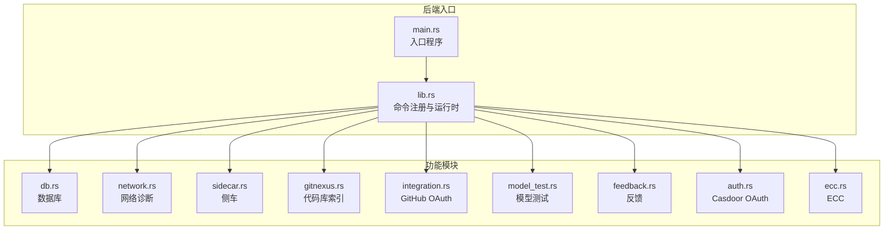
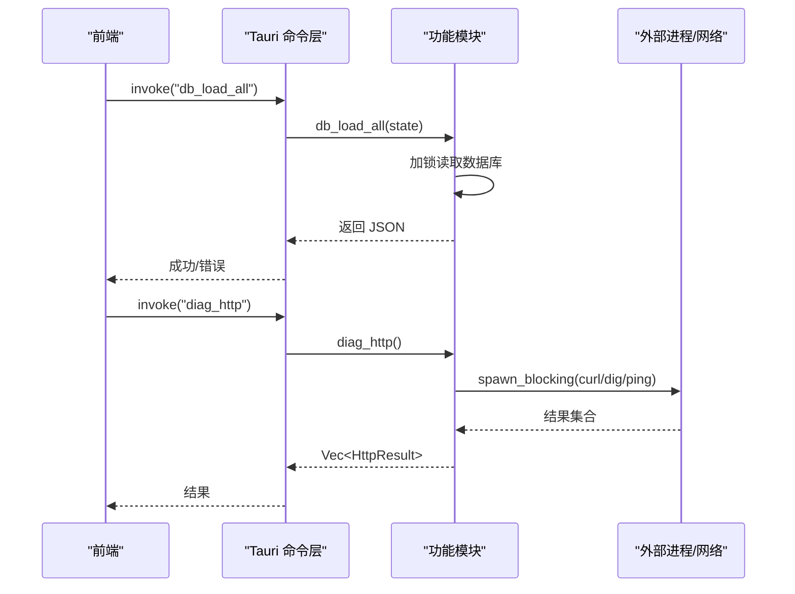
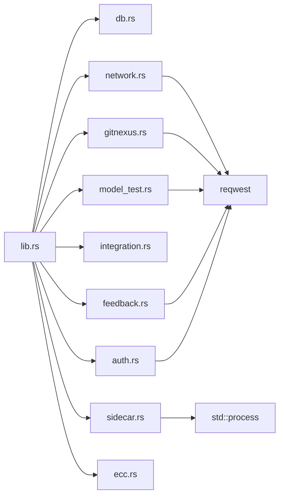

# 后端 API

<cite>
**本文引用的文件**
- [main.rs](file://src-tauri/src/main.rs)
- [lib.rs](file://src-tauri/src/lib.rs)
- [Cargo.toml](file://src-tauri/Cargo.toml)
- [db.rs](file://src-tauri/src/db.rs)
- [network.rs](file://src-tauri/src/network.rs)
- [sidecar.rs](file://src-tauri/src/sidecar.rs)
- [gitnexus.rs](file://src-tauri/src/gitnexus.rs)
- [integration.rs](file://src-tauri/src/integration.rs)
- [model_test.rs](file://src-tauri/src/model_test.rs)
- [ecc.rs](file://src-tauri/src/ecc.rs)
- [feedback.rs](file://src-tauri/src/feedback.rs)
- [auth.rs](file://src-tauri/src/auth.rs)
</cite>

## 目录
1. [简介](#简介)
2. [项目结构](#项目结构)
3. [核心组件](#核心组件)
4. [架构总览](#架构总览)
5. [详细组件分析](#详细组件分析)
6. [依赖关系分析](#依赖关系分析)
7. [性能考量](#性能考量)
8. [故障排查指南](#故障排查指南)
9. [结论](#结论)
10. [附录](#附录)

## 简介
本文件为 RabbitCoding 后端 API 的权威文档，覆盖 Rust 后端通过 Tauri 暴露的所有命令接口，包括数据库操作、网络诊断、文件系统访问、子进程侧车（sidecar）、第三方集成（GitHub、Casdoor）、模型连通性测试、系统反馈收集与提交等能力。文档面向前端与集成开发者，提供命令签名、参数类型、返回值格式、错误处理、并发与异步特性、前置条件与约束、性能建议以及前端调用参考。

## 项目结构
RabbitCoding 后端位于 src-tauri 目录，采用模块化组织：
- 入口与运行时：main.rs、lib.rs
- 数据库：db.rs（SQLite + rusqlite）
- 网络诊断：network.rs（DNS/Ping/HTTP/Marketplace）
- 子进程侧车：sidecar.rs（Claude Code sidecar 生命周期管理）
- 代码库索引：gitnexus.rs（内置 Node 运行时 + 私有 npm prefix）
- 第三方集成：integration.rs（GitHub 设备码流程）、auth.rs（Casdoor OAuth）
- 模型测试：model_test.rs（Anthropic 兼容端点连通性）
- 系统反馈：feedback.rs（截图、系统信息、性能指标、提交）
- ECC：ecc.rs（ECC 安装/卸载/检测）

图表来源
- [main.rs:1-7](file://src-tauri/src/main.rs#L1-L7)
- [lib.rs:196-390](file://src-tauri/src/lib.rs#L196-L390)

章节来源
- [main.rs:1-7](file://src-tauri/src/main.rs#L1-L7)
- [lib.rs:196-390](file://src-tauri/src/lib.rs#L196-L390)

## 核心组件
- 命令注册与运行时：lib.rs 中通过 tauri::Builder 注册所有命令，并初始化数据库、窗口状态、通知、深链等插件。
- 数据库：基于 SQLite 的轻量持久化，提供全量导入导出、HasData 检测。
- 网络诊断：跨平台 DNS/Ping/HTTP/Marketplace 诊断，自动探测系统/环境代理。
- 子进程侧车：启动/停止 Claude Code sidecar，注入 API Key/Base URL/环境变量，转发 stdout 事件。
- 代码库索引：通过内置 Node/npm 在应用私有 prefix 安装/运行 gitnexus，后台任务实时上报进度。
- 第三方集成：GitHub 设备码流程与 Casdoor OAuth，均通过 reqwest 发起 HTTP 请求。
- 模型测试：向 Anthropic 兼容端点发起最小请求，校验 Base URL/API Key/Model。
- 系统反馈：窗口截图、系统信息、性能指标采集与服务端提交。
- ECC：检测/安装/卸载 ECC，扫描 ~/.claude 下相关目录。

章节来源
- [lib.rs:196-390](file://src-tauri/src/lib.rs#L196-L390)
- [db.rs:392-417](file://src-tauri/src/db.rs#L392-L417)
- [network.rs:366-864](file://src-tauri/src/network.rs#L366-L864)
- [sidecar.rs:60-280](file://src-tauri/src/sidecar.rs#L60-L280)
- [gitnexus.rs:180-761](file://src-tauri/src/gitnexus.rs#L180-L761)
- [integration.rs:140-231](file://src-tauri/src/integration.rs#L140-L231)
- [model_test.rs:78-217](file://src-tauri/src/model_test.rs#L78-L217)
- [feedback.rs:119-282](file://src-tauri/src/feedback.rs#L119-L282)
- [auth.rs:118-245](file://src-tauri/src/auth.rs#L118-L245)
- [ecc.rs:144-355](file://src-tauri/src/ecc.rs#L144-L355)

## 架构总览
后端通过 Tauri 暴露命令，前端以 invoke 方式调用。部分命令为异步（spawn_blocking/tokio::task），涉及外部进程或网络请求。数据库通过 State 注入，确保并发安全；网络与外部工具命令通过线程池隔离执行；侧车与 gitnexus 通过子进程与 stdout/stderr 管道进行事件通信。

图表来源
- [lib.rs:344-387](file://src-tauri/src/lib.rs#L344-L387)
- [db.rs:392-397](file://src-tauri/src/db.rs#L392-L397)
- [network.rs:538-550](file://src-tauri/src/network.rs#L538-L550)

## 详细组件分析

### 数据库命令（db_*）
- db_load_all
  - 功能：查询 workspaces/repos/rabbits/messages，组装为 Workspace[] JSON。
  - 参数：无
  - 返回：Result<String, String>（JSON 字符串或错误）
  - 并发：State<Database> 内部使用 Mutex 保护连接
  - 错误：数据库打开/初始化/序列化失败
  - 性能：单次事务内批量查询，索引覆盖 workspace/repo/rabbit/message
  - 前置条件：数据库已初始化
- db_save_all
  - 功能：接收完整 Workspace[] JSON，事务内全量替换
  - 参数：json: String
  - 返回：Result<(), String>
  - 并发：State<Database> + 事务
  - 错误：JSON 解析失败、SQL 执行失败、事务回滚
- db_has_data
  - 功能：检查是否存在工作区数据
  - 参数：无
  - 返回：Result<bool, String>
  - 并发：State<Database>

章节来源
- [db.rs:392-417](file://src-tauri/src/db.rs#L392-L417)
- [db.rs:167-288](file://src-tauri/src/db.rs#L167-L288)
- [db.rs:290-386](file://src-tauri/src/db.rs#L290-L386)

### 网络诊断命令（diag_*）
- diag_dns
  - 功能：对预设域名执行 DNS 解析，返回各域名解析结果
  - 参数：无
  - 返回：Result<Vec<DnsResult>, String>
  - 异步：spawn_blocking
  - 平台：Windows 使用 nslookup；macOS/Linux 使用 dig
  - 代理：自动检测系统/环境代理
- diag_http
  - 功能：对预设端点执行 HTTP GET，返回状态码、响应时间、TLS 版本、远端 IP 等
  - 参数：无
  - 返回：Result<Vec<HttpResult>, String>
  - 异步：spawn_blocking
  - 代理：自动检测系统/环境代理
- diag_ping
  - 功能：对预设目标执行 ICMP/Ping，统计丢包率与 RTT
  - 参数：无
  - 返回：Result<Vec<PingResult>, String>
  - 异步：spawn_blocking
- diag_marketplace
  - 功能：对市场站端点进行连通性与可用性检测
  - 参数：无
  - 返回：Result<MarketplaceResult, String>
  - 异步：spawn_blocking

章节来源
- [network.rs:366-375](file://src-tauri/src/network.rs#L366-L375)
- [network.rs:538-550](file://src-tauri/src/network.rs#L538-L550)
- [network.rs:810-822](file://src-tauri/src/network.rs#L810-L822)
- [network.rs:828-863](file://src-tauri/src/network.rs#L828-L863)

### 文件系统与系统工具命令
- ensure_workspace_docs_dir(path: String)
  - 功能：确保工作区 docs 目录存在（幂等）
  - 返回：Result<(), String>
- ensure_rabbit_specs_dir(path: String)
  - 功能：确保 .rabbit/specs 目录存在（幂等）
  - 返回：Result<(), String>
- ensure_rabbit_codewiki_dir(path: String)
  - 功能：确保 .rabbit/codewiki 目录存在并返回路径
  - 返回：Result<String, String>
- list_rabbit_codewiki_files(path: String)
  - 功能：列出 .rabbit/codewiki 下内容（树形结构）
  - 返回：Result<Vec<CodeWikiEntry>, String>
- read_text_file_unrestricted(path: String)
  - 功能：绕过 Tauri fs:scope 限制读取任意文本文件
  - 返回：Result<String, String>
- open_notification_settings()
  - 功能：打开系统通知设置页面（macOS/Windows）
  - 返回：Result<(), String>
- send_desktop_notification(title: String, body: String)
  - 功能：发送桌面通知（绕过 Tauri 插件签名限制）
  - 返回：Result<bool, String>

章节来源
- [lib.rs:20-43](file://src-tauri/src/lib.rs#L20-L43)
- [lib.rs:94-105](file://src-tauri/src/lib.rs#L94-L105)
- [lib.rs:107-112](file://src-tauri/src/lib.rs#L107-L112)
- [lib.rs:114-132](file://src-tauri/src/lib.rs#L114-L132)
- [lib.rs:134-186](file://src-tauri/src/lib.rs#L134-L186)

### 侧车命令（sidecar::*）
- start_sidecar(payload: StartSidecarPayload)
  - 功能：启动 sidecar 进程，注入 API Key/Base URL/自定义环境变量，隔离 Claude 配置根目录
  - 返回：Result<SidecarResult, String>
  - 并发：State<SidecarState>（Mutex<Option<SidecarHandle>>）
  - 事件：agent:message（stdout 行事件）、agent:sidecar-exit
- send_to_sidecar(message: String)
  - 功能：向 sidecar stdin 写入消息
  - 返回：Result<SidecarResult, String>
- stop_sidecar()
  - 功能：优雅关闭 sidecar
  - 返回：Result<SidecarResult, String>
- get_sidecar_status()
  - 功能：查询运行状态
  - 返回：Result<SidecarStatus, String>

章节来源
- [sidecar.rs:60-280](file://src-tauri/src/sidecar.rs#L60-L280)

### 代码库索引命令（gitnexus::*）
- gitnexus_install()
  - 功能：在应用私有 prefix 安装 gitnexus CLI（内置 Node/npm）
  - 返回：Result<bool, String>
  - 事件：gitnexus-install-progress（实时进度）
- gitnexus_uninstall()
  - 功能：卸载 gitnexus CLI
  - 返回：Result<bool, String>
- gitnexus_check()
  - 功能：检测安装状态与版本
  - 返回：Result<GitnexusCheckResult, String>
- gitnexus_analyze(workspace_id, item_type, item_key, path, force)
  - 功能：后台分析路径并索引，按行 emit 进度
  - 返回：Result<GitnexusItem, String>
  - 事件：gitnexus-progress
- gitnexus_list()
  - 功能：列出已索引仓库（兼容 JSON/文本）
  - 返回：Result<Vec<GitnexusItem>, String>
- gitnexus_group_create(name)
- gitnexus_group_add(group, group_path, registry_name)
- gitnexus_group_sync(workspace_id, name)
  - 功能：组管理与同步，emit 进度
  - 返回：Result<bool, String>
- gitnexus_group_status(name)
  - 返回：Result<String, String>

章节来源
- [gitnexus.rs:180-761](file://src-tauri/src/gitnexus.rs#L180-L761)

### 第三方集成命令
- GitHub 设备码流程
  - github_device_code(): 获取设备码
  - github_device_poll(device_code): 轮询令牌（pending/slow_down/expired/error）
  - github_get_user(token): 获取用户信息
- Casdoor OAuth
  - casdoor_exchange_token(code, code_verifier): 交换 access_token
  - casdoor_get_userinfo(access_token): 获取用户信息
  - casdoor_complete_login(code, code_verifier): 组合命令（先换 token 再取用户信息）

章节来源
- [integration.rs:140-231](file://src-tauri/src/integration.rs#L140-L231)
- [auth.rs:118-245](file://src-tauri/src/auth.rs#L118-L245)

### 模型连通性测试命令（model_test::*）
- test_model_connection(payload: { base_url, api_key, model_id })
  - 功能：向 {base_url}/v1/messages 发送最小请求，验证连通性与鉴权
  - 返回：Result<ModelTestResult, String>
  - 行为：成功返回 2xx 且解析到 model echo；失败根据状态码与响应体生成友好提示

章节来源
- [model_test.rs:78-217](file://src-tauri/src/model_test.rs#L78-L217)

### 系统反馈命令（feedback::*）
- capture_app_window(): 截取应用窗口并返回 base64 JPEG
- collect_system_info(app): 收集系统信息（OS/版本/架构/内存/CPU）
- collect_performance_metrics(app, webview_metrics): 收集性能指标（应用/系统 CPU/内存、WebView 指标）
- submit_feedback(payload): 提交反馈到服务端

章节来源
- [feedback.rs:119-282](file://src-tauri/src/feedback.rs#L119-L282)

### ECC 命令（ecc::*）
- ecc_check(): 检测安装状态与版本
- ecc_install(): 一键安装（npx ecc-install --profile minimal）
- ecc_uninstall(): 卸载（删除 ~/.claude 下相关文件）

章节来源
- [ecc.rs:144-355](file://src-tauri/src/ecc.rs#L144-L355)

## 依赖关系分析
- 运行时依赖：Tauri v2、rusqlite、reqwest、tokio、xcap、sysinfo、image、tauri 插件等
- 并发与异步：大量命令通过 tokio::task::spawn_blocking 或线程池执行外部进程/网络请求，避免阻塞主线程
- 数据库并发：rusqlite + Mutex，命令内部加锁访问连接
- 外部工具：curl/dig/nslookup/ping、npx、node、gitnexus、git

图表来源
- [lib.rs:344-387](file://src-tauri/src/lib.rs#L344-L387)
- [Cargo.toml:20-39](file://src-tauri/Cargo.toml#L20-L39)

章节来源
- [Cargo.toml:20-39](file://src-tauri/Cargo.toml#L20-L39)

## 性能考量
- 网络诊断：diag_* 使用 spawn_blocking 隔离外部进程，避免阻塞事件循环；建议前端批量并发调用时控制速率，避免系统负载过高。
- 数据库：db_save_all 使用事务批量写入，db_load_all 通过索引查询；建议前端在数据量较大时分页或增量更新。
- 侧车与 gitnexus：后台任务通过线程读取 stdout/stderr，注意避免过多并发任务导致 I/O 抖动；前端监听进度事件时及时清理订阅。
- 模型测试：短超时（20s）避免阻塞，失败时区分超时/连接错误/业务错误，前端可据此优化重试策略。
- 反馈采集：截图与性能指标采集为 CPU 密集型，建议在用户主动触发时执行，避免频繁调用。

## 故障排查指南
- 数据库
  - 症状：db_load_all/db_save_all 报错
  - 排查：确认数据库初始化成功、Schema 正确、事务未被中断
- 网络诊断
  - 症状：diag_dns/diag_http/diag_ping 返回 error
  - 排查：检查系统代理、防火墙、DNS 服务；确认 curl/dig/nslookup/ping 可用
- 侧车
  - 症状：start_sidecar 返回失败或 get_sidecar_status=false
  - 排查：查看 stderr 日志、确认 API Key/Base URL 正确、CLAUDE_CONFIG_DIR 隔离生效
- gitnexus
  - 症状：安装/分析失败
  - 排查：确认内置 Node/npm 可用、私有 prefix 权限、网络可达、--skip-git 参数正确
- GitHub OAuth
  - 症状：设备码轮询停滞或失败
  - 排查：检查网络连通性、轮询间隔、token 交换与用户授权状态
- Casdoor OAuth
  - 症状：token 交换/获取用户信息失败
  - 排查：核对 client_id、redirect_uri、code_verifier、access_token 有效性
- 模型测试
  - 症状：超时/401/403/404/429
  - 排查：检查 base_url 去尾斜杠、API Key 权限、模型 ID、限流策略
- 反馈
  - 症状：截图失败/提交失败
  - 排查：确认窗口可见、图像编码成功、服务端可达、响应体解析

章节来源
- [db.rs:392-417](file://src-tauri/src/db.rs#L392-L417)
- [network.rs:366-864](file://src-tauri/src/network.rs#L366-L864)
- [sidecar.rs:60-280](file://src-tauri/src/sidecar.rs#L60-L280)
- [gitnexus.rs:180-761](file://src-tauri/src/gitnexus.rs#L180-L761)
- [integration.rs:140-231](file://src-tauri/src/integration.rs#L140-L231)
- [auth.rs:118-245](file://src-tauri/src/auth.rs#L118-L245)
- [model_test.rs:78-217](file://src-tauri/src/model_test.rs#L78-L217)
- [feedback.rs:119-282](file://src-tauri/src/feedback.rs#L119-L282)

## 结论
RabbitCoding 后端通过模块化设计与 Tauri 命令体系，提供了从数据库、网络诊断、文件系统、侧车管理、第三方集成到反馈收集的完整能力。命令普遍具备良好的错误处理与异步执行特性，适合在前端以 invoke 方式安全调用。建议前端在高频调用场景下合理控制并发与重试策略，并关注代理与网络环境对诊断类命令的影响。

## 附录

### 命令清单与调用方式（摘要）
- 数据库
  - db_load_all(): 无参，返回 Workspace[] JSON
  - db_save_all(json): 传入 Workspace[] JSON
  - db_has_data(): 无参，返回布尔
- 网络诊断
  - diag_dns(): 无参，返回 DNS 结果数组
  - diag_http(): 无参，返回 HTTP 结果数组
  - diag_ping(): 无参，返回 Ping 结果数组
  - diag_marketplace(): 无参，返回 Marketplace 结果
- 文件系统与系统工具
  - ensure_workspace_docs_dir(path)
  - ensure_rabbit_specs_dir(path)
  - ensure_rabbit_codewiki_dir(path)
  - list_rabbit_codewiki_files(path)
  - read_text_file_unrestricted(path)
  - open_notification_settings()
  - send_desktop_notification(title, body)
- 侧车
  - start_sidecar(payload)
  - send_to_sidecar(message)
  - stop_sidecar()
  - get_sidecar_status()
- 代码库索引
  - gitnexus_install()
  - gitnexus_uninstall()
  - gitnexus_check()
  - gitnexus_analyze(...)
  - gitnexus_list()
  - gitnexus_group_create(name)
  - gitnexus_group_add(group, group_path, registry_name)
  - gitnexus_group_sync(workspace_id, name)
  - gitnexus_group_status(name)
- 第三方集成
  - github_device_code()
  - github_device_poll(device_code)
  - github_get_user(token)
  - casdoor_exchange_token(code, code_verifier)
  - casdoor_get_userinfo(access_token)
  - casdoor_complete_login(code, code_verifier)
- 模型测试
  - test_model_connection({ base_url, api_key, model_id })
- 反馈
  - capture_app_window()
  - collect_system_info(app)
  - collect_performance_metrics(app, webview_metrics)
  - submit_feedback(payload)
- ECC
  - ecc_check()
  - ecc_install()
  - ecc_uninstall()

章节来源
- [lib.rs:344-387](file://src-tauri/src/lib.rs#L344-L387)
- [db.rs:392-417](file://src-tauri/src/db.rs#L392-L417)
- [network.rs:366-864](file://src-tauri/src/network.rs#L366-L864)
- [sidecar.rs:60-280](file://src-tauri/src/sidecar.rs#L60-L280)
- [gitnexus.rs:180-761](file://src-tauri/src/gitnexus.rs#L180-L761)
- [integration.rs:140-231](file://src-tauri/src/integration.rs#L140-L231)
- [auth.rs:118-245](file://src-tauri/src/auth.rs#L118-L245)
- [model_test.rs:78-217](file://src-tauri/src/model_test.rs#L78-L217)
- [feedback.rs:119-282](file://src-tauri/src/feedback.rs#L119-L282)
- [ecc.rs:144-355](file://src-tauri/src/ecc.rs#L144-L355)