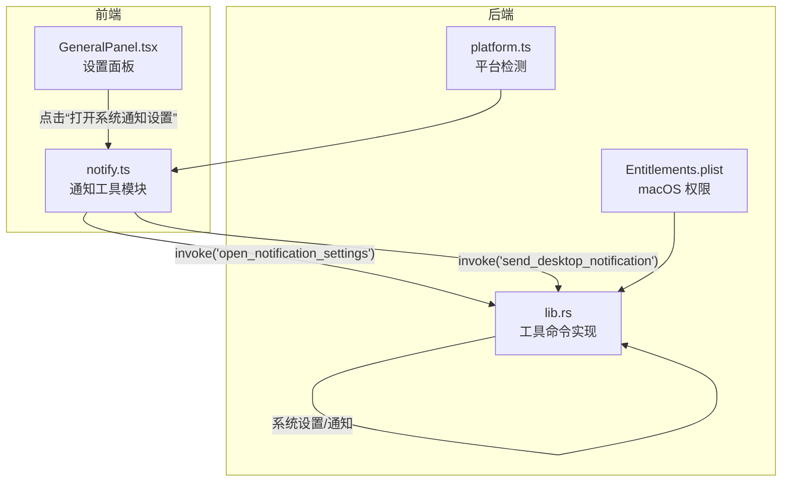
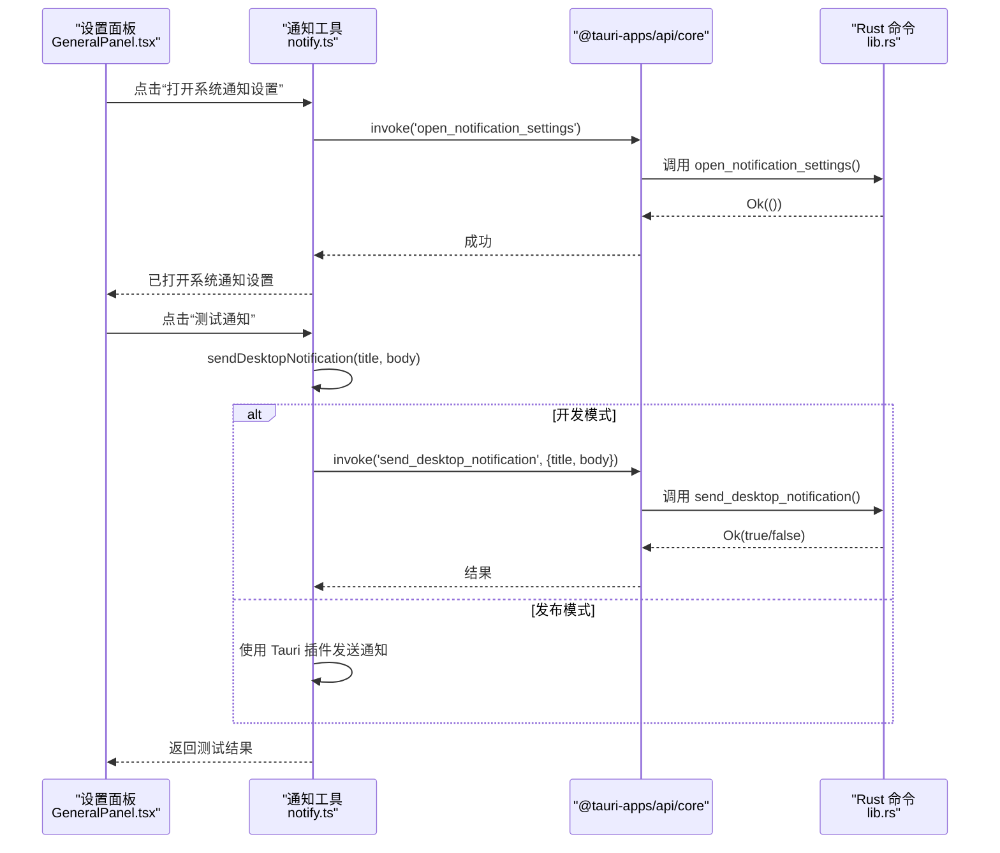
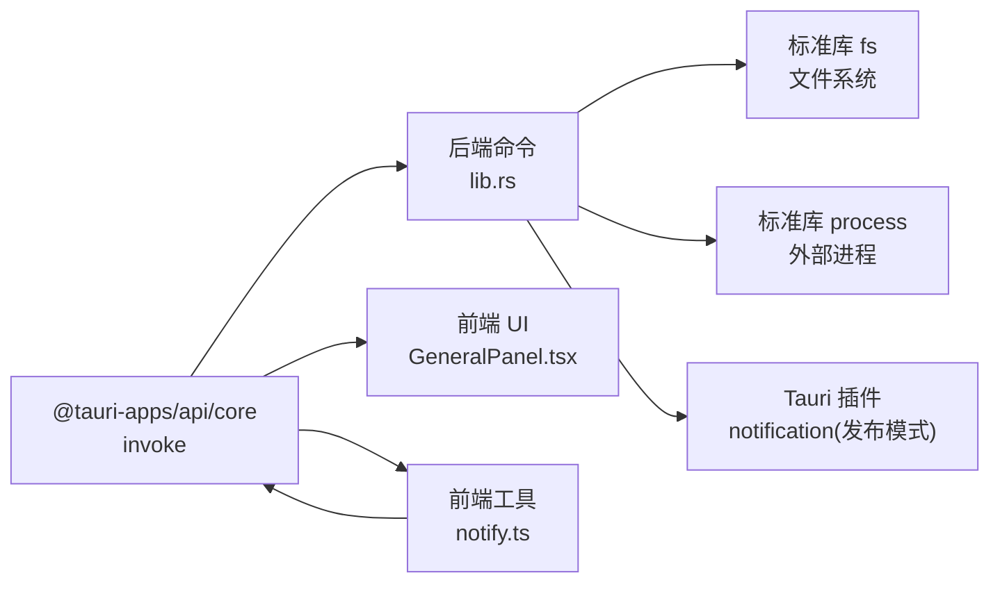

# 工具命令

<cite>
**本文引用的文件列表**
- [lib.rs](file://src-tauri/src/lib.rs)
- [notify.ts](file://src/utils/notify.ts)
- [GeneralPanel.tsx](file://src/components/settings/GeneralPanel.tsx)
- [platform.ts](file://src/utils/platform.ts)
- [Entitlements.plist](file://src-tauri/Entitlements.plist)
</cite>

## 目录
1. [简介](#简介)
2. [项目结构](#项目结构)
3. [核心组件](#核心组件)
4. [架构总览](#架构总览)
5. [详细组件分析](#详细组件分析)
6. [依赖关系分析](#依赖关系分析)
7. [性能考量](#性能考量)
8. [故障排除指南](#故障排除指南)
9. [结论](#结论)
10. [附录](#附录)

## 简介
本文件为 RabbitCoding 工具类命令的详细 API 文档，覆盖以下实用工具命令：
- ensure_workspace_docs_dir：确保工作区存在 docs 目录（幂等）
- ensure_rabbit_specs_dir：确保工作区存在 .rabbit/specs 目录（幂等）
- read_text_file_unrestricted：绕过 Tauri fs:scope 限制读取任意文本文件（含隐藏目录）
- open_notification_settings：打开系统通知设置（macOS / Windows），绕过 Tauri ACL 限制
- send_desktop_notification：发送桌面通知（macOS / Windows），绕过 Tauri 插件签名限制

文档将详细说明每个命令的参数类型、返回值格式、错误处理机制，并结合前端调用示例展示如何在不同平台上正确使用这些命令，同时涵盖跨平台兼容性、权限检查、异常处理与用户体验优化建议。

## 项目结构
工具命令主要分布在 Rust 后端与前端 JavaScript/TypeScript 两部分：
- 后端（Rust）：通过 #[tauri::command] 暴露命令，负责文件系统操作、系统设置与桌面通知。
- 前端（TypeScript）：封装通知逻辑、偏好读取、跨平台回退策略与 UI 交互。

图表来源
- [lib.rs:21-364](file://src-tauri/src/lib.rs#L21-L364)
- [notify.ts:122-132](file://src/utils/notify.ts#L122-L132)
- [GeneralPanel.tsx:193-198](file://src/components/settings/GeneralPanel.tsx#L193-L198)
- [platform.ts:6-12](file://src/utils/platform.ts#L6-L12)
- [Entitlements.plist:1-18](file://src-tauri/Entitlements.plist#L1-L18)

章节来源
- [lib.rs:21-364](file://src-tauri/src/lib.rs#L21-L364)
- [notify.ts:1-274](file://src/utils/notify.ts#L1-L274)
- [GeneralPanel.tsx:132-200](file://src/components/settings/GeneralPanel.tsx#L132-L200)
- [platform.ts:1-18](file://src/utils/platform.ts#L1-L18)
- [Entitlements.plist:1-18](file://src-tauri/Entitlements.plist#L1-L18)

## 核心组件
- ensure_workspace_docs_dir(path: String) -> Result<(), String>
  - 功能：在指定工作区路径下创建 docs 目录（幂等）
  - 参数：path（字符串，工作区根路径）
  - 返回：成功时 Ok(())，失败时 Err(String)
  - 错误：创建失败抛出错误信息
- ensure_rabbit_specs_dir(path: String) -> Result<(), String>
  - 功能：在指定工作区路径下创建 .rabbit/specs 目录（幂等）
  - 参数：path（字符串，工作区根路径）
  - 返回：成功时 Ok(())，失败时 Err(String)
  - 错误：创建失败抛出错误信息
- read_text_file_unrestricted(path: String) -> Result<String, String>
  - 功能：绕过 Tauri fs:scope 限制读取任意文本文件（含隐藏目录）
  - 参数：path（字符串，文件绝对路径）
  - 返回：成功时 Ok(文件内容)，失败时 Err(String)
  - 错误：读取失败抛出错误信息
- open_notification_settings() -> Result<(), String>
  - 功能：打开系统通知设置（macOS / Windows），绕过 Tauri ACL 限制
  - 参数：无
  - 返回：成功时 Ok(())，失败时 Err(String)
  - 平台：macOS 使用 open x-apple.systempreferences:...，Windows 使用 cmd /C start ms-settings:notifications
- send_desktop_notification(title: String, body: String) -> Result<bool, String>
  - 功能：发送桌面通知（macOS / Windows），绕过 Tauri 插件签名限制
  - 参数：title（字符串，通知标题）、body（字符串，通知正文）
  - 返回：成功时 Ok(true)，失败时 Ok(false) 或 Err(String)
  - 平台：macOS 使用 osascript，Windows 使用 PowerShell（NotifyIcon）

章节来源
- [lib.rs:21-364](file://src-tauri/src/lib.rs#L21-L364)

## 架构总览
工具命令的调用链路如下：
- 前端通过 @tauri-apps/api/core 的 invoke 调用后端命令
- 后端命令执行系统级操作（文件系统、进程、系统设置）
- 前端根据返回结果与偏好设置决定是否显示通知与声音

图表来源
- [GeneralPanel.tsx:170-184](file://src/components/settings/GeneralPanel.tsx#L170-L184)
- [notify.ts:122-132](file://src/utils/notify.ts#L122-L132)
- [notify.ts:97-120](file://src/utils/notify.ts#L97-L120)
- [lib.rs:292-364](file://src-tauri/src/lib.rs#L292-L364)

## 详细组件分析

### ensure_workspace_docs_dir
- 功能：确保工作区存在 docs 目录（幂等）
- 参数
  - path: String（工作区根路径）
- 返回
  - Ok(()) 表示成功
  - Err(String) 表示失败（如权限不足、磁盘空间不足等）
- 处理流程
  - 将 path 与 docs 组合为完整目录路径
  - 使用 create_dir_all 创建目录（若已存在则不报错）
  - 若创建失败，返回错误信息
- 错误处理
  - 文件系统权限不足、磁盘空间不足、路径非法等情况会返回错误
- 跨平台
  - 路径分隔符由标准库处理，无需额外适配
- 用户体验
  - 作为幂等操作，可在初始化或首次使用时调用，保证后续流程可用

章节来源
- [lib.rs:21-27](file://src-tauri/src/lib.rs#L21-L27)

### ensure_rabbit_specs_dir
- 功能：确保工作区存在 .rabbit/specs 目录（幂等）
- 参数
  - path: String（工作区根路径）
- 返回
  - Ok(()) 表示成功
  - Err(String) 表示失败
- 处理流程
  - 将 path 与 .rabbit/specs 组合为完整目录路径
  - 使用 create_dir_all 创建目录
  - 若创建失败，返回错误信息
- 错误处理
  - 与 ensure_workspace_docs_dir 类似，捕获文件系统异常
- 跨平台
  - 与 ensure_workspace_docs_dir 一致
- 用户体验
  - 用于存放规格说明文件，便于后续生成与管理

章节来源
- [lib.rs:29-35](file://src-tauri/src/lib.rs#L29-L35)

### read_text_file_unrestricted
- 功能：绕过 Tauri fs:scope 限制读取任意文本文件（含隐藏目录）
- 参数
  - path: String（文件绝对路径）
- 返回
  - Ok(String) 表示读取成功
  - Err(String) 表示失败
- 处理流程
  - 直接使用标准库读取文件内容
  - 若读取失败，返回错误信息
- 错误处理
  - 文件不存在、权限不足、路径非法、编码问题等均会返回错误
- 跨平台
  - 与平台无关，统一使用标准库
- 用户体验
  - 适用于读取 .rabbit 等隐藏目录中的配置或说明文件

章节来源
- [lib.rs:285-290](file://src-tauri/src/lib.rs#L285-L290)

### open_notification_settings
- 功能：打开系统通知设置（macOS / Windows），绕过 Tauri ACL 限制
- 参数：无
- 返回
  - Ok(()) 表示成功
  - Err(String) 表示失败
- 处理流程
  - macOS：使用 open 命令打开系统设置的通知扩展页面
  - Windows：使用 cmd /C start 打开 ms-settings:notifications 页面
- 错误处理
  - 启动外部程序失败时返回错误信息
- 跨平台
  - 通过条件编译区分 macOS 与 Windows
- 用户体验
  - 前端通过 invoke 调用，无需关心底层实现

章节来源
- [lib.rs:292-310](file://src-tauri/src/lib.rs#L292-L310)

### send_desktop_notification
- 功能：发送桌面通知（macOS / Windows），绕过 Tauri 插件签名限制
- 参数
  - title: String（通知标题）
  - body: String（通知正文）
- 返回
  - Ok(true) 表示发送成功
  - Ok(false) 表示发送失败（但不抛错）
  - Err(String) 表示严重错误
- 处理流程
  - macOS：使用 osascript 执行 display notification
  - Windows：使用 PowerShell 创建 NotifyIcon 弹窗
  - 其他平台：返回 false
- 错误处理
  - 外部命令执行失败或返回非成功状态码时返回 false
  - 严重错误（如无法启动外部程序）返回 Err(String)
- 跨平台
  - 通过条件编译区分平台
- 用户体验
  - 前端封装了 dev/release 模式的回退策略，提升稳定性

章节来源
- [lib.rs:315-364](file://src-tauri/src/lib.rs#L315-L364)

## 依赖关系分析
- 前端依赖
  - @tauri-apps/api/core：用于 invoke 后端命令
  - @tauri-apps/plugin-notification：用于发布模式下的原生通知（需应用签名）
- 后端依赖
  - 标准库：文件系统、进程执行
  - Tauri 插件：dialog、fs、opener、pty、window_state、notification、deep_link
- 平台相关
  - macOS：osascript、系统设置 URL Scheme
  - Windows：PowerShell、系统设置 URL Scheme
  - iOS：占位注释，当前不支持

图表来源
- [lib.rs:374-514](file://src-tauri/src/lib.rs#L374-L514)
- [notify.ts:55-90](file://src/utils/notify.ts#L55-L90)
- [GeneralPanel.tsx:170-184](file://src/components/settings/GeneralPanel.tsx#L170-L184)

章节来源
- [lib.rs:374-514](file://src-tauri/src/lib.rs#L374-L514)
- [notify.ts:55-90](file://src/utils/notify.ts#L55-L90)
- [GeneralPanel.tsx:170-184](file://src/components/settings/GeneralPanel.tsx#L170-L184)

## 性能考量
- 目录创建与文件读取均为同步阻塞操作，建议在后台线程或异步上下文调用，避免阻塞主线程
- 通知发送涉及外部进程调用，应避免频繁调用；前端已做回退策略，减少失败影响
- 跨平台条件编译在编译期确定，运行时无额外开销

## 故障排除指南
- 目录创建失败
  - 检查工作区路径是否存在且具有写权限
  - 确认磁盘空间充足
- 文件读取失败
  - 确认文件路径正确且文件存在
  - 检查文件编码与权限
- 打开系统通知设置失败
  - 确认平台支持（macOS / Windows）
  - 检查系统设置 URL Scheme 是否可用
- 发送桌面通知失败
  - 开发模式：确认 osascript（macOS）或 PowerShell（Windows）可用
  - 发布模式：确认应用已签名且 Tauri notification 插件可用
- 前端偏好设置无效
  - 确认 localStorage 中的偏好键值正确
  - 检查语言设置是否影响文案

章节来源
- [lib.rs:21-364](file://src-tauri/src/lib.rs#L21-L364)
- [notify.ts:33-41](file://src/utils/notify.ts#L33-L41)
- [GeneralPanel.tsx:186-200](file://src/components/settings/GeneralPanel.tsx#L186-L200)

## 结论
上述工具命令提供了 RabbitCoding 在文件系统、系统设置与桌面通知方面的关键能力。通过后端命令与前端封装的结合，实现了跨平台兼容、错误处理与用户体验优化。建议在生产环境中优先使用发布模式的原生通知通道，并在开发模式下利用 Rust 后端进行回退，确保通知的稳定送达。

## 附录

### 前端调用示例（概念性说明）
- 打开系统通知设置
  - 前端：点击设置面板中的“打开系统通知设置”按钮
  - 后端：调用 open_notification_settings，打开对应系统设置页面
- 测试通知
  - 前端：点击设置面板中的“测试通知”，发送标题与正文
  - 后端：调用 send_desktop_notification，返回成功/失败
  - 前端：根据返回结果更新 UI 状态

章节来源
- [GeneralPanel.tsx:170-184](file://src/components/settings/GeneralPanel.tsx#L170-L184)
- [notify.ts:122-132](file://src/utils/notify.ts#L122-L132)
- [notify.ts:208-219](file://src/utils/notify.ts#L208-L219)

### 平台差异与权限
- 平台检测
  - 前端通过 platform.ts 判断 macOS/Windows，用于 UI 适配
- macOS 权限
  - 应用签名与 Entitlements.plist 配置影响某些系统级能力
- Windows 权限
  - PowerShell 与系统设置页面访问需满足系统策略

章节来源
- [platform.ts:6-12](file://src/utils/platform.ts#L6-L12)
- [Entitlements.plist:1-18](file://src-tauri/Entitlements.plist#L1-L18)