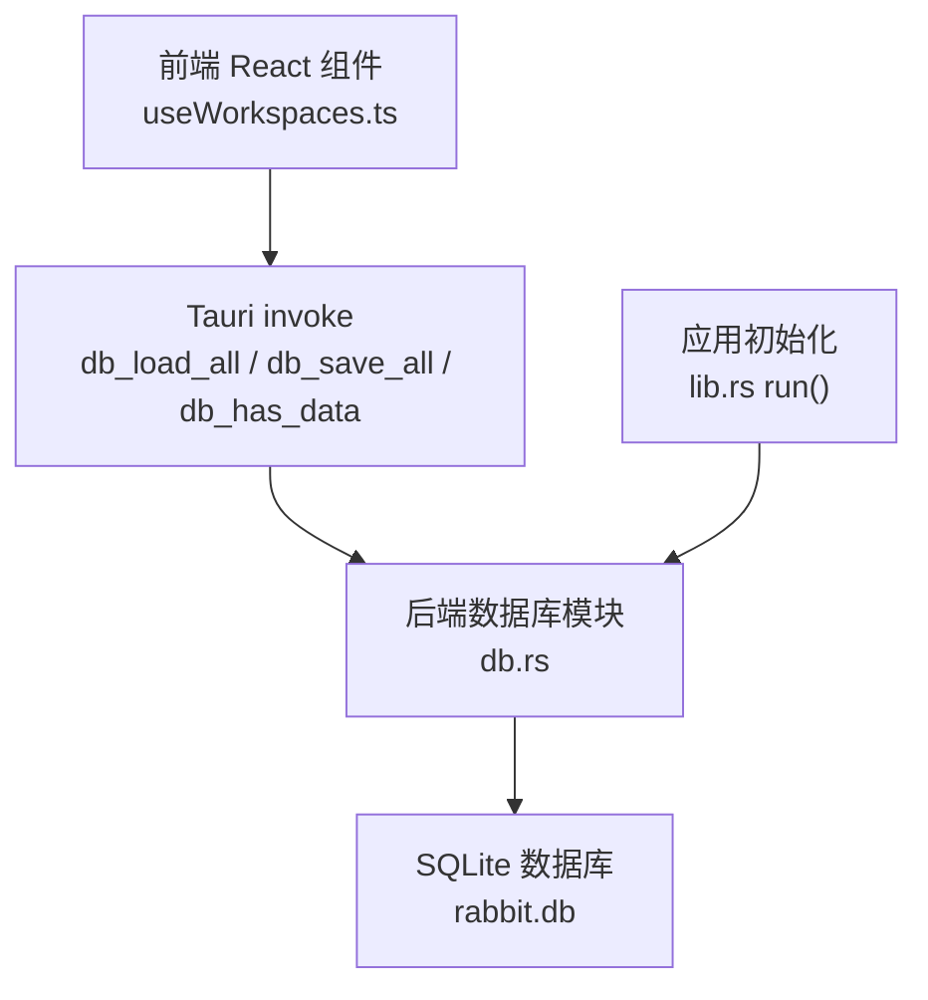
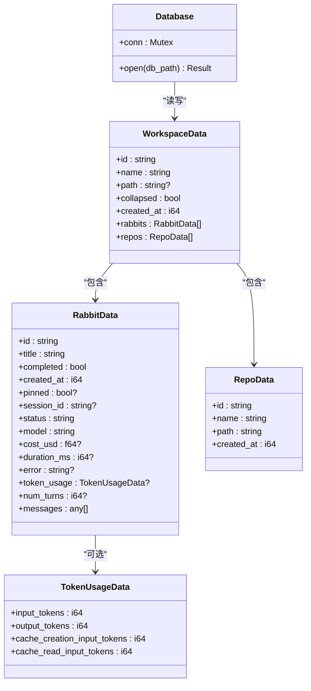
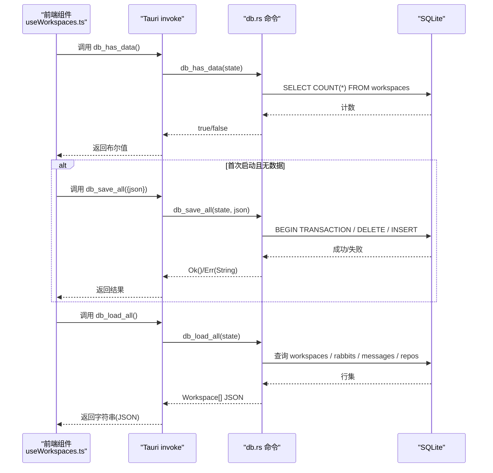
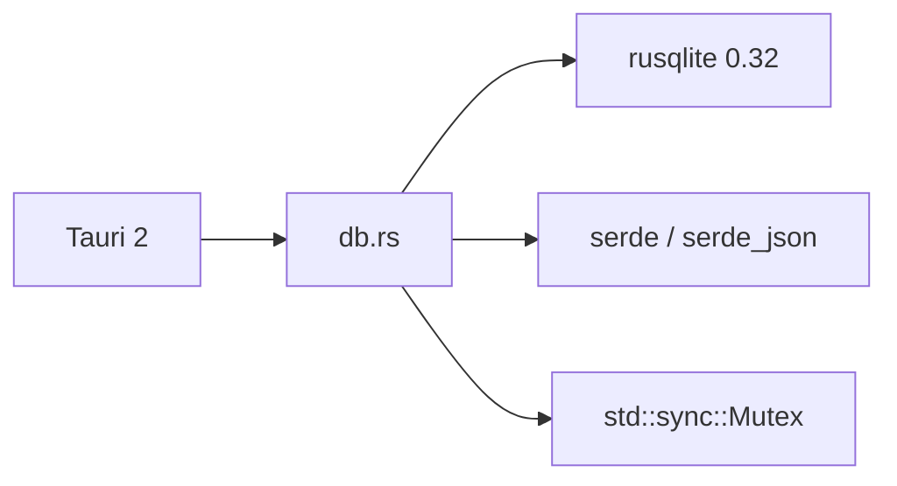
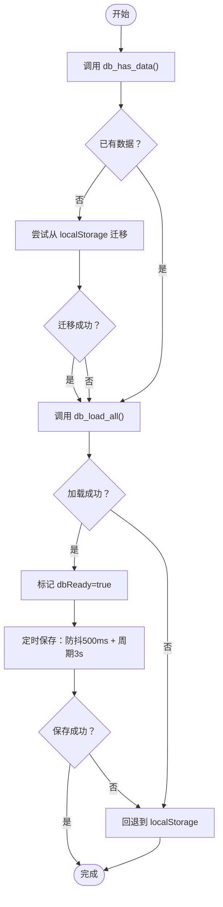
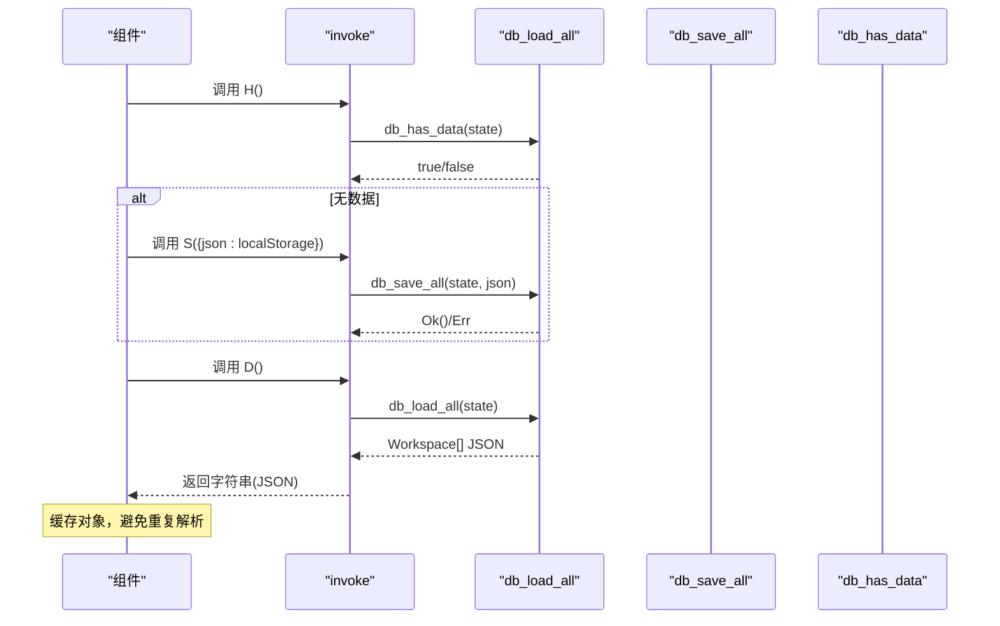

# 数据库命令

<cite>
**本文引用的文件列表**
- [db.rs](file://src-tauri/src/db.rs)
- [lib.rs](file://src-tauri/src/lib.rs)
- [main.rs](file://src-tauri/src/main.rs)
- [useWorkspaces.ts](file://src/hooks/useWorkspaces.ts)
- [Cargo.toml](file://src-tauri/Cargo.toml)
</cite>

## 目录
1. [简介](#简介)
2. [项目结构与入口](#项目结构与入口)
3. [核心组件与数据模型](#核心组件与数据模型)
4. [架构总览](#架构总览)
5. [详细命令 API 文档](#详细命令-api-文档)
6. [依赖关系分析](#依赖关系分析)
7. [性能与并发特性](#性能与并发特性)
8. [错误处理与降级策略](#错误处理与降级策略)
9. [前端调用示例与最佳实践](#前端调用示例与最佳实践)
10. [结论](#结论)

## 简介
本文件面向 RabbitCoding 的数据库相关命令，聚焦以下三个 Tauri 命令：
- db_load_all：从数据库加载全部数据，返回序列化后的 Workspace 数组 JSON
- db_save_all：接收完整 Workspace 数组 JSON，事务内全量写入数据库
- db_has_data：检查数据库是否已有数据，用于迁移与降级判断

文档将详细说明每个命令的参数类型、返回值格式、错误处理机制，以及数据库连接管理、事务处理、并发访问等特性，并提供前端调用示例与注意事项。

## 项目结构与入口
- 后端入口位于 main.rs，调用 lib.rs 的 run 函数初始化应用与插件。
- 数据库模块位于 src-tauri/src/db.rs，定义了数据库结构、SQL 模式、内部加载/保存逻辑与三个命令。
- 前端通过 @tauri-apps/api/core 的 invoke 调用后端命令，实现数据持久化与迁移。

图表来源
- [lib.rs:374-569](file://src-tauri/src/lib.rs#L374-L569)
- [db.rs:1-417](file://src-tauri/src/db.rs#L1-L417)
- [useWorkspaces.ts:45-129](file://src/hooks/useWorkspaces.ts#L45-L129)

章节来源
- [main.rs:1-7](file://src-tauri/src/main.rs#L1-L7)
- [lib.rs:374-569](file://src-tauri/src/lib.rs#L374-L569)
- [db.rs:1-417](file://src-tauri/src/db.rs#L1-L417)

## 核心组件与数据模型
- 数据库结构 Database：封装一个互斥锁保护的 rusqlite 连接，作为全局状态通过 Tauri manage 注入。
- SQL 模式：包含 workspaces、rabbits、repos、messages 四张表，含必要的索引与外键约束。
- 数据模型（Serde）：WorkspaceData、RabbitData、RepoData、TokenUsageData，字段与数据库列一一对应，采用 camelCase 与 serde 的默认序列化策略。

图表来源
- [db.rs:10-74](file://src-tauri/src/db.rs#L10-L74)
- [db.rs:80-161](file://src-tauri/src/db.rs#L80-L161)

章节来源
- [db.rs:10-74](file://src-tauri/src/db.rs#L10-L74)
- [db.rs:80-161](file://src-tauri/src/db.rs#L80-L161)

## 架构总览
- 初始化阶段：应用启动时创建应用数据目录，构造 rabbit.db 路径，尝试打开数据库并注册为全局状态。
- 命令注册：db_load_all、db_save_all、db_has_data 通过 generate_handler 注册到 Tauri invoke。
- 前端调用：前端在组件挂载时先检查是否有数据，必要时迁移 localStorage 到数据库，再加载数据；随后定期保存，异常时降级到 localStorage。

图表来源
- [lib.rs:374-569](file://src-tauri/src/lib.rs#L374-L569)
- [db.rs:392-416](file://src-tauri/src/db.rs#L392-L416)
- [useWorkspaces.ts:45-129](file://src/hooks/useWorkspaces.ts#L45-L129)

章节来源
- [lib.rs:374-569](file://src-tauri/src/lib.rs#L374-L569)
- [db.rs:392-416](file://src-tauri/src/db.rs#L392-L416)
- [useWorkspaces.ts:45-129](file://src/hooks/useWorkspaces.ts#L45-L129)

## 详细命令 API 文档

### db_load_all
- 功能：查询全部四表，拼装为 Workspace[] JSON 返回
- 参数
  - state: Tauri State<Database>（全局数据库状态）
- 返回值
  - Result<String, String>
  - 成功：返回序列化后的 Workspace 数组 JSON 字符串
  - 失败：返回错误字符串
- 前置条件
  - 数据库已初始化并成功打开
- 约束条件
  - 读取顺序：workspaces（按 created_at DESC）、rabbits（按 created_at DESC）、messages（按 seq ASC）、repos（按 created_at ASC）
  - messages 字段为 JSON 值数组，按序号排列
- 错误处理
  - 获取连接失败：返回错误字符串
  - SQL 查询失败：返回错误字符串
  - JSON 序列化失败：返回错误字符串
- 性能考虑
  - 单次查询多表，涉及多次 prepare/query_map，建议在前端做缓存与节流
  - 建议在前端解析一次后缓存对象，避免重复 JSON 解析

章节来源
- [db.rs:392-397](file://src-tauri/src/db.rs#L392-L397)
- [db.rs:167-288](file://src-tauri/src/db.rs#L167-L288)

### db_save_all
- 功能：接收完整 Workspace[] JSON，事务内全量替换
- 参数
  - state: Tauri State<Database>
  - json: String（Workspace 数组 JSON）
- 返回值
  - Result<(), String>
  - 成功：Ok(())
  - 失败：返回错误字符串
- 前置条件
  - 数据库已初始化并成功打开
- 约束条件
  - 事务：BEGIN/COMMIT/ROLLBACK
  - 删除顺序：messages → repos → rabbits → workspaces
  - 插入顺序：workspaces → rabbits（含 messages）→ repos
  - token_usage 字段以 JSON 文本形式存储
- 错误处理
  - JSON 反序列化失败：返回错误字符串
  - 任意 SQL 执行失败：回滚事务并返回错误字符串
- 性能考虑
  - 事务保证一致性，但一次性删除/插入大量数据可能阻塞 IO
  - 建议前端做防抖与周期性保存，避免频繁写入

章节来源
- [db.rs:399-406](file://src-tauri/src/db.rs#L399-L406)
- [db.rs:290-386](file://src-tauri/src/db.rs#L290-L386)

### db_has_data
- 功能：检查数据库是否已有数据（用于判断是否需要迁移）
- 参数
  - state: Tauri State<Database>
- 返回值
  - Result<bool, String>
  - 成功：true 表示已有数据，false 表示空库
  - 失败：返回错误字符串
- 前置条件
  - 数据库已初始化并成功打开
- 约束条件
  - 仅检查 workspaces 表是否存在数据
- 错误处理
  - 查询失败：返回错误字符串
- 性能考虑
  - 单条 COUNT 查询，开销极低

章节来源
- [db.rs:408-416](file://src-tauri/src/db.rs#L408-L416)

## 依赖关系分析
- 数据库驱动：rusqlite 0.32（bundled 特性）
- 序列化：serde 与 serde_json
- 并发：std::sync::Mutex 包裹 Connection，单线程访问
- Tauri：tauri 2，命令通过 generate_handler 注册

图表来源
- [Cargo.toml:20-39](file://src-tauri/Cargo.toml#L20-L39)
- [db.rs:1-5](file://src-tauri/src/db.rs#L1-L5)

章节来源
- [Cargo.toml:20-39](file://src-tauri/Cargo.toml#L20-L39)
- [db.rs:1-5](file://src-tauri/src/db.rs#L1-L5)

## 性能与并发特性
- 连接管理
  - Database::open 打开数据库并执行建表与列迁移，返回受 Mutex 保护的连接
- 事务处理
  - db_save_all 使用 save_all_inner 包裹 BEGIN/COMMIT/ROLLBACK，保证原子性
- 并发访问
  - 通过 Mutex 串行化对数据库连接的访问，避免并发冲突
  - 前端侧通过防抖与周期保存减少写入频率
- 索引与查询
  - 为 rabbits/workspace_id、repos/workspace_id、messages(rabbit_id, seq) 建立索引，优化 JOIN 与排序查询
- WAL 模式
  - PRAGMA journal_mode=WAL 提升并发读取性能

章节来源
- [db.rs:85-138](file://src-tauri/src/db.rs#L85-L138)
- [db.rs:290-305](file://src-tauri/src/db.rs#L290-L305)
- [db.rs:140-161](file://src-tauri/src/db.rs#L140-L161)

## 错误处理与降级策略
- 后端错误
  - 数据库打开失败、Schema 初始化失败、SQL 执行失败、JSON 序列化/反序列化失败
- 前端降级
  - 若 db_* 命令失败，前端回退到 localStorage 存储
  - 首次启动若数据库为空，尝试从 localStorage 迁移后再加载
- 保存策略
  - 双层防抖：500ms 防抖 + 3s 周期强制保存
  - DB 不可用时写 localStorage

图表来源
- [useWorkspaces.ts:45-129](file://src/hooks/useWorkspaces.ts#L45-L129)

章节来源
- [useWorkspaces.ts:45-129](file://src/hooks/useWorkspaces.ts#L45-L129)
- [lib.rs:390-399](file://src-tauri/src/lib.rs#L390-L399)

## 前端调用示例与最佳实践

### 前端调用流程（概念图）

图表来源
- [useWorkspaces.ts:45-129](file://src/hooks/useWorkspaces.ts#L45-L129)
- [db.rs:392-416](file://src-tauri/src/db.rs#L392-L416)

### 关键调用点与注意事项
- 首次启动与迁移
  - 调用 db_has_data 判断是否需要迁移
  - 如需迁移，从 localStorage 读取原始 JSON，调用 db_save_all 写入数据库
- 加载数据
  - 调用 db_load_all，得到 JSON 字符串后解析为对象，清理“进行中”状态
- 保存数据
  - 防抖：500ms 定时器触发
  - 周期：3s 强制保存，覆盖流式输出场景
  - 异常：捕获错误，不中断 UI
- 降级
  - DB 不可用时，写入 localStorage，下次启动优先从 localStorage 加载

章节来源
- [useWorkspaces.ts:45-129](file://src/hooks/useWorkspaces.ts#L45-L129)

## 结论
- db_load_all、db_save_all、db_has_data 三命令构成 RabbitCoding 的核心数据持久化能力，配合事务与索引设计，满足多表复杂数据的读写需求。
- 前端通过双层防抖与周期保存降低写入压力，结合数据库初始化失败的降级策略，提升用户体验与稳定性。
- 建议在前端对返回的 JSON 进行缓存与对象化，避免重复序列化/反序列化；同时注意大体量数据的分页或懒加载策略以进一步优化性能。