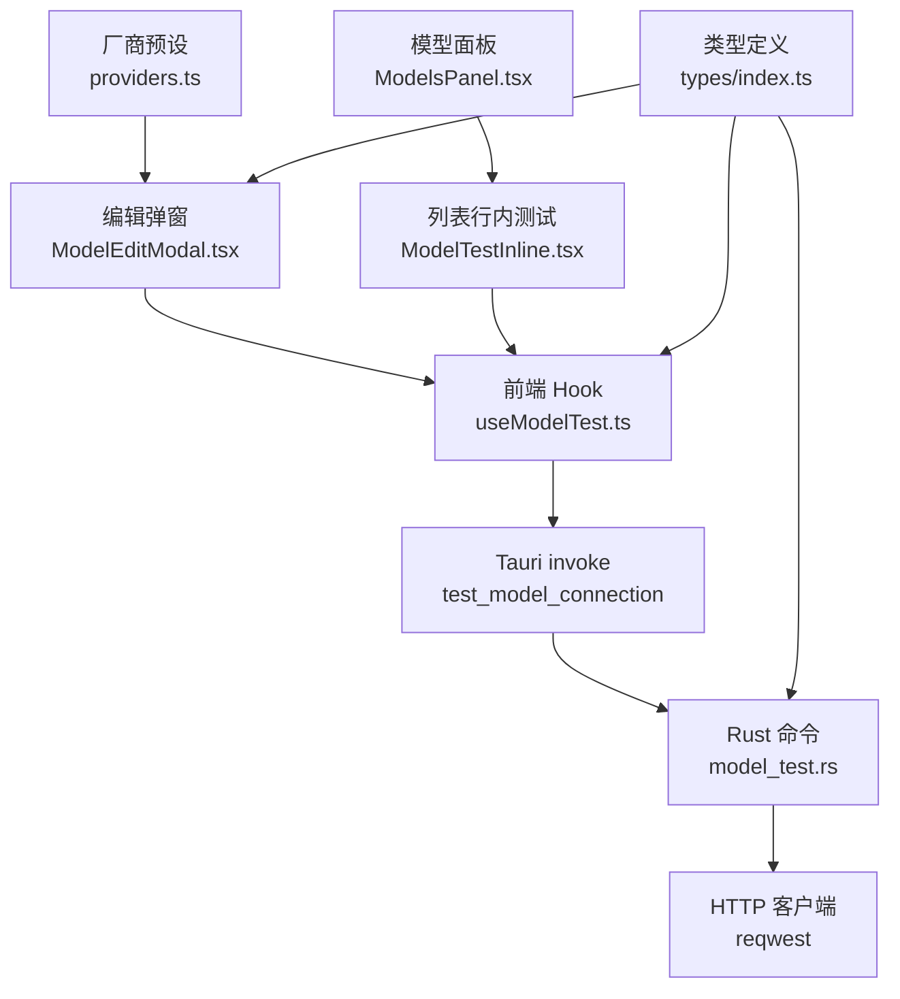
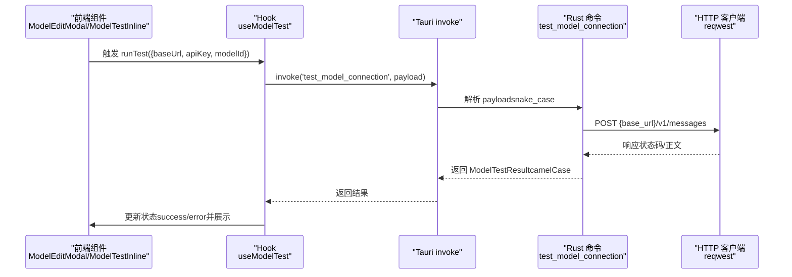
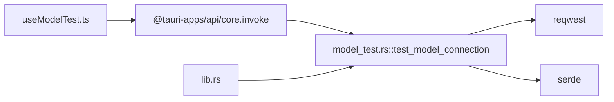

# 模型测试命令

<cite>
**本文引用的文件**
- [src-tauri/src/model_test.rs](file://src-tauri/src/model_test.rs)
- [src-tauri/src/lib.rs](file://src-tauri/src/lib.rs)
- [src/hooks/useModelTest.ts](file://src/hooks/useModelTest.ts)
- [src/components/settings/ModelEditModal.tsx](file://src/components/settings/ModelEditModal.tsx)
- [src/components/settings/ModelTestInline.tsx](file://src/components/settings/ModelTestInline.tsx)
- [src/components/settings/ModelsPanel.tsx](file://src/components/settings/ModelsPanel.tsx)
- [src/constants/providers.ts](file://src/constants/providers.ts)
- [src/types/index.ts](file://src/types/index.ts)
</cite>

## 目录
1. [简介](#简介)
2. [项目结构](#项目结构)
3. [核心组件](#核心组件)
4. [架构总览](#架构总览)
5. [详细组件分析](#详细组件分析)
6. [依赖关系分析](#依赖关系分析)
7. [性能考量](#性能考量)
8. [故障排查指南](#故障排查指南)
9. [结论](#结论)
10. [附录](#附录)

## 简介
本文件面向 RabbitCoding 的“模型测试命令”，系统化梳理 test_model_connection 命令的参数、返回值、错误处理、兼容性与前端集成方式。该命令通过向目标厂商的 Anthropic 兼容端点发起最小 Messages 请求，验证 Base URL、API Key、模型 ID 的连通性与可用性，并返回延迟、模型回显与可读错误信息，便于用户快速定位配置问题。

## 项目结构
围绕模型测试的关键文件分布如下：
- 前端 Hook 与组件：封装测试调用、状态管理与 UI 展示
- 后端命令：实现测试逻辑、错误分类与响应
- 类型定义：前后端数据契约对齐
- 厂商预设：辅助配置与测试

图表来源
- [src/hooks/useModelTest.ts:35-70](file://src/hooks/useModelTest.ts#L35-L70)
- [src-tauri/src/model_test.rs:78-207](file://src-tauri/src/model_test.rs#L78-L207)
- [src/components/settings/ModelEditModal.tsx:161-168](file://src/components/settings/ModelEditModal.tsx#L161-L168)
- [src/components/settings/ModelTestInline.tsx:17-38](file://src/components/settings/ModelTestInline.tsx#L17-L38)
- [src/components/settings/ModelsPanel.tsx:86-133](file://src/components/settings/ModelsPanel.tsx#L86-L133)
- [src/constants/providers.ts:14-57](file://src/constants/providers.ts#L14-L57)
- [src/types/index.ts:346-358](file://src/types/index.ts#L346-L358)

章节来源
- [src/hooks/useModelTest.ts:1-70](file://src/hooks/useModelTest.ts#L1-L70)
- [src-tauri/src/model_test.rs:1-217](file://src-tauri/src/model_test.rs#L1-L217)
- [src/components/settings/ModelEditModal.tsx:1-384](file://src/components/settings/ModelEditModal.tsx#L1-L384)
- [src/components/settings/ModelTestInline.tsx:1-38](file://src/components/settings/ModelTestInline.tsx#L1-L38)
- [src/components/settings/ModelsPanel.tsx:1-148](file://src/components/settings/ModelsPanel.tsx#L1-L148)
- [src/constants/providers.ts:1-63](file://src/constants/providers.ts#L1-L63)
- [src/types/index.ts:317-358](file://src/types/index.ts#L317-L358)

## 核心组件
- 前端 Hook（useModelTest）
  - 职责：封装测试调用、状态机（idle/loading/success/error）、错误透传
  - 参数：baseUrl、apiKey、modelId（均为字符串）
  - 返回：ModelTestResult（success/statusCode/latencyMs/modelEcho/error）
- Rust 命令（test_model_connection）
  - 职责：校验参数、构造 Anthropic Messages 请求、统计耗时、分类错误并返回友好提示
  - 参数：snake_case 的 base_url、api_key、model_id
  - 返回：camelCase 的 ModelTestResult
- 前端组件
  - ModelEditModal：弹窗内“测试连接”按钮，草稿参数即时测试
  - ModelTestInline：列表项内的行内测试按钮
  - ModelsPanel：模型列表，承载行内测试入口
- 类型定义
  - ModelTestResult：前后端契约对齐
  - ModelConfig：模型配置（含 baseUrl、apiKey、modelId）

章节来源
- [src/hooks/useModelTest.ts:14-70](file://src/hooks/useModelTest.ts#L14-L70)
- [src-tauri/src/model_test.rs:28-50](file://src-tauri/src/model_test.rs#L28-L50)
- [src-tauri/src/model_test.rs:78-207](file://src-tauri/src/model_test.rs#L78-L207)
- [src/components/settings/ModelEditModal.tsx:161-168](file://src/components/settings/ModelEditModal.tsx#L161-L168)
- [src/components/settings/ModelTestInline.tsx:17-38](file://src/components/settings/ModelTestInline.tsx#L17-L38)
- [src/components/settings/ModelsPanel.tsx:86-133](file://src/components/settings/ModelsPanel.tsx#L86-L133)
- [src/types/index.ts:346-358](file://src/types/index.ts#L346-L358)

## 架构总览
从前端到后端的调用链路如下：

图表来源
- [src/hooks/useModelTest.ts:42-64](file://src/hooks/useModelTest.ts#L42-L64)
- [src-tauri/src/model_test.rs:78-207](file://src-tauri/src/model_test.rs#L78-L207)
- [src-tauri/src/lib.rs:542-543](file://src-tauri/src/lib.rs#L542-L543)

章节来源
- [src/hooks/useModelTest.ts:35-70](file://src/hooks/useModelTest.ts#L35-L70)
- [src-tauri/src/model_test.rs:78-207](file://src-tauri/src/model_test.rs#L78-L207)
- [src-tauri/src/lib.rs:542-543](file://src-tauri/src/lib.rs#L542-L543)

## 详细组件分析

### 命令：test_model_connection（Rust）
- 参数校验
  - 三要素任一为空即返回失败，error 字段包含明确提示
- URL 构造
  - 去除 base_url 末尾斜杠，拼接 /v1/messages，与 @anthropic-ai/sdk 保持一致
- 请求与超时
  - 设置超时时间，区分 connect/timeout/other 失败场景
- 成功路径
  - HTTP 2xx 且响应可解析，返回 success=true、latency_ms、model_echo
- 失败路径
  - 根据 HTTP 状态码与服务端 message 生成可读错误
  - 附带截断后的原始响应体（最多限定字符数），便于高级用户排障
- 返回结构
  - success、statusCode、latencyMs、modelEcho、error（均为可选或存在时填充）

章节来源
- [src-tauri/src/model_test.rs:82-94](file://src-tauri/src/model_test.rs#L82-L94)
- [src-tauri/src/model_test.rs:96-107](file://src-tauri/src/model_test.rs#L96-L107)
- [src-tauri/src/model_test.rs:111-142](file://src-tauri/src/model_test.rs#L111-L142)
- [src-tauri/src/model_test.rs:148-162](file://src-tauri/src/model_test.rs#L148-L162)
- [src-tauri/src/model_test.rs:164-207](file://src-tauri/src/model_test.rs#L164-L207)
- [src-tauri/src/model_test.rs:28-42](file://src-tauri/src/model_test.rs#L28-L42)

### 前端 Hook：useModelTest
- 状态机
  - idle → loading → success | error
- 调用流程
  - runTest 将输入参数 trim 后以 snake_case 键传递给 invoke
  - 根据 result.success 切换 success/error 分支
  - 异常捕获统一映射为 error 状态
- 返回值
  - state.status、state.result（ModelTestResult）、state.error

章节来源
- [src/hooks/useModelTest.ts:14-20](file://src/hooks/useModelTest.ts#L14-L20)
- [src/hooks/useModelTest.ts:22-27](file://src/hooks/useModelTest.ts#L22-L27)
- [src/hooks/useModelTest.ts:35-70](file://src/hooks/useModelTest.ts#L35-L70)

### 前端组件：ModelEditModal
- 草稿测试
  - “测试连接”按钮使用当前表单参数（无需保存）立即发起测试
  - 成功时展示延迟与 modelEcho，失败时展示可读错误
- 表单校验
  - 名称、模型 ID、Base URL、API Key 均必填

章节来源
- [src/components/settings/ModelEditModal.tsx:161-168](file://src/components/settings/ModelEditModal.tsx#L161-L168)
- [src/components/settings/ModelEditModal.tsx:322-349](file://src/components/settings/ModelEditModal.tsx#L322-L349)
- [src/components/settings/ModelEditModal.tsx:120-128](file://src/components/settings/ModelEditModal.tsx#L120-L128)

### 前端组件：ModelTestInline
- 列表项内测试入口
  - 从 ModelConfig 读取 baseUrl、apiKey、modelId
  - 加载态与图标态切换，避免并发测试

章节来源
- [src/components/settings/ModelTestInline.tsx:17-38](file://src/components/settings/ModelTestInline.tsx#L17-L38)

### 前端组件：ModelsPanel
- 模型列表承载行内测试入口
- 支持新增/编辑/删除/启用切换

章节来源
- [src/components/settings/ModelsPanel.tsx:86-133](file://src/components/settings/ModelsPanel.tsx#L86-L133)

### 厂商预设：providers.ts
- 一键填充常用厂商的 baseUrl、默认 modelId、API Key 环境变量
- 与测试命令配合，提升配置效率

章节来源
- [src/constants/providers.ts:14-57](file://src/constants/providers.ts#L14-L57)

### 类型定义：ModelTestResult
- 前后端字段对齐（camelCase）
- 字段语义清晰，便于前端展示与判断

章节来源
- [src/types/index.ts:346-358](file://src/types/index.ts#L346-L358)

## 依赖关系分析
- 前端依赖
  - @tauri-apps/api/core：invoke 调用后端命令
  - React Hooks：状态管理与副作用
- 后端依赖
  - reqwest：HTTP 客户端
  - serde：序列化/反序列化
  - tauri::command：暴露命令接口
- 命令注册
  - 在 lib.rs 中通过 generate_handler 注册 test_model_connection

图表来源
- [src/hooks/useModelTest.ts:11-12](file://src/hooks/useModelTest.ts#L11-L12)
- [src-tauri/src/model_test.rs:9-11](file://src-tauri/src/model_test.rs#L9-L11)
- [src-tauri/src/lib.rs:542-543](file://src-tauri/src/lib.rs#L542-L543)

章节来源
- [src/hooks/useModelTest.ts:10-12](file://src/hooks/useModelTest.ts#L10-L12)
- [src-tauri/src/model_test.rs:9-11](file://src-tauri/src/model_test.rs#L9-L11)
- [src-tauri/src/lib.rs:542-543](file://src-tauri/src/lib.rs#L542-L543)

## 性能考量
- 超时控制
  - 后端设置固定超时阈值，避免长时间阻塞
- 延迟统计
  - 精确到毫秒，便于用户感知网络与服务端性能
- 响应体截断
  - 错误时仅展示有限长度的原始响应体，兼顾可观测性与可读性

章节来源
- [src-tauri/src/model_test.rs:19-22](file://src-tauri/src/model_test.rs#L19-L22)
- [src-tauri/src/model_test.rs:144-145](file://src-tauri/src/model_test.rs#L144-L145)
- [src-tauri/src/model_test.rs:192-198](file://src-tauri/src/model_test.rs#L192-L198)

## 故障排查指南
- 缺少必要参数
  - 现象：立即返回失败，error 提示三要素不能为空
  - 排查：确认 baseUrl、apiKey、modelId 均已填写且非空
- 请求超时
  - 现象：error 提示超时（含秒数），latency_ms 仍返回
  - 排查：检查网络连通性、代理设置、Base URL 正确性
- 连接错误
  - 现象：error 提示无法连接到服务器
  - 排查：确认 Base URL 正确、DNS 解析正常、防火墙放行
- HTTP 401/403
  - 现象：认证失败，提示 API Key 错误或无访问权限
  - 排查：核对 API Key、权限范围、厂商控制台配额
- HTTP 404
  - 现象：端点不存在，附带实际请求地址
  - 排查：确认 Base URL 末尾无多余斜杠、路径正确
- HTTP 400
  - 现象：请求被拒，message 或提示 modelId 不存在/参数非法
  - 排查：核对 modelId 是否存在于厂商控制台
- HTTP 429
  - 现象：触发限流
  - 排查：降低请求频率或等待配额恢复
- 5xx 服务端错误
  - 现象：服务端错误，建议稍后重试
- 其他 HTTP 码
  - 现象：通用失败，包含服务端 message（若存在）
  - 排查：结合截断后的原始响应体进一步诊断

章节来源
- [src-tauri/src/model_test.rs:86-94](file://src-tauri/src/model_test.rs#L86-L94)
- [src-tauri/src/model_test.rs:120-142](file://src-tauri/src/model_test.rs#L120-L142)
- [src-tauri/src/model_test.rs:171-190](file://src-tauri/src/model_test.rs#L171-L190)
- [src-tauri/src/model_test.rs:192-206](file://src-tauri/src/model_test.rs#L192-L206)

## 结论
test_model_connection 命令以最小化请求覆盖了模型连通性、鉴权与端点可用性的关键验证点，结合前后端状态机与可读错误提示，能够显著降低用户配置成本并提升问题定位效率。通过厂商预设与弹窗草稿测试，用户可在不保存配置的前提下快速验证参数正确性。

## 附录

### API 定义与调用示例

- 命令名称
  - test_model_connection
- 前端调用方式（伪代码）
  - 调用：invoke('test_model_connection', { payload: { base_url, api_key, model_id } })
  - 返回：ModelTestResult（success、statusCode、latencyMs、modelEcho、error）
- 前端状态机
  - idle → loading → success | error
- 常见调用位置
  - ModelEditModal：草稿测试
  - ModelTestInline：列表项测试

章节来源
- [src-tauri/src/model_test.rs:74-77](file://src-tauri/src/model_test.rs#L74-L77)
- [src/hooks/useModelTest.ts:42-64](file://src/hooks/useModelTest.ts#L42-L64)
- [src/components/settings/ModelEditModal.tsx:161-168](file://src/components/settings/ModelEditModal.tsx#L161-L168)
- [src/components/settings/ModelTestInline.tsx:17-38](file://src/components/settings/ModelTestInline.tsx#L17-L38)

### 数据结构与字段说明

- ModelTestResult（Rust 输出，camelCase）
  - success：是否连通且鉴权通过、模型可用
  - statusCode：HTTP 状态码（网络层失败时为 None）
  - latencyMs：请求耗时（毫秒）
  - modelEcho：服务端回显的 model 字段
  - error：友好错误描述（失败时填充）
- ModelTestResult（前端类型，camelCase）
  - 字段与上述一致，用于 TypeScript 类型约束与展示

章节来源
- [src-tauri/src/model_test.rs:28-42](file://src-tauri/src/model_test.rs#L28-L42)
- [src/types/index.ts:346-358](file://src/types/index.ts#L346-L358)

### 兼容性与厂商适配
- URL 规范
  - 与 @anthropic-ai/sdk 保持一致，确保“测试通过”等价于“sidecar 实际调用可用”
- 厂商预设
  - 提供常见厂商的 baseUrl 与默认 modelId，减少用户配置负担

章节来源
- [src-tauri/src/model_test.rs:3-8](file://src-tauri/src/model_test.rs#L3-L8)
- [src/constants/providers.ts:14-57](file://src/constants/providers.ts#L14-L57)