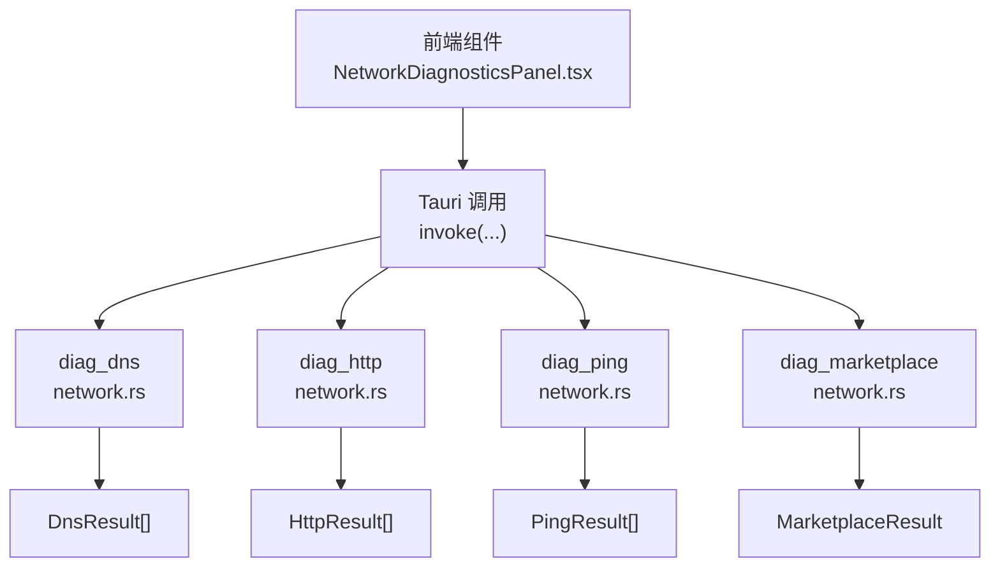
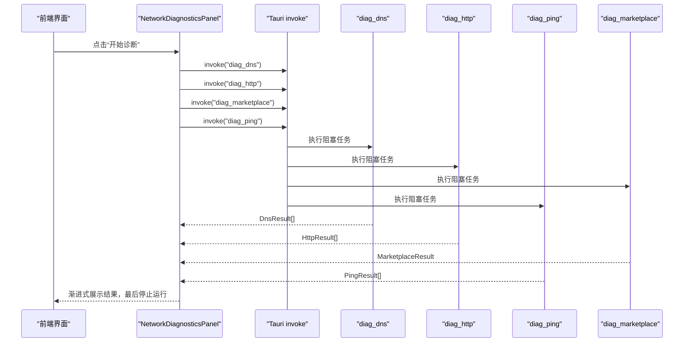

# 网络诊断命令

<cite>
**本文引用的文件**
- [src-tauri/src/network.rs](file://src-tauri/src/network.rs)
- [src/components/settings/NetworkDiagnosticsPanel.tsx](file://src/components/settings/NetworkDiagnosticsPanel.tsx)
- [src/types/index.ts](file://src/types/index.ts)
- [src/i18n/locales/zh.ts](file://src/i18n/locales/zh.ts)
- [src/i18n/locales/en.ts](file://src/i18n/locales/en.ts)
</cite>

## 目录
1. [简介](#简介)
2. [项目结构](#项目结构)
3. [核心组件](#核心组件)
4. [架构总览](#架构总览)
5. [详细组件分析](#详细组件分析)
6. [依赖关系分析](#依赖关系分析)
7. [性能考量](#性能考量)
8. [故障排查指南](#故障排查指南)
9. [结论](#结论)
10. [附录](#附录)

## 简介
本文件面向 RabbitCoding 的网络诊断功能，系统性梳理并记录以下四类诊断命令的 API 规范与实现要点：
- diag_dns：DNS 解析验证
- diag_http：HTTP 请求测试
- diag_ping：网络连通性与延迟测试
- diag_marketplace：市场连接检查

文档涵盖：
- 命令参数与返回值结构
- 错误处理机制
- 超时与并发策略
- 前端调用示例与结果解析建议
- 国际化文案映射

## 项目结构
网络诊断功能由前端 React 组件发起调用，通过 Tauri invoke 触发后端 Rust 命令，最终以结构化结果返回。



图表来源
- [src/components/settings/NetworkDiagnosticsPanel.tsx:353-369](file://src/components/settings/NetworkDiagnosticsPanel.tsx#L353-L369)
- [src-tauri/src/network.rs:366-375](file://src-tauri/src/network.rs#L366-L375)
- [src-tauri/src/network.rs:538-550](file://src-tauri/src/network.rs#L538-L550)
- [src-tauri/src/network.rs:810-822](file://src-tauri/src/network.rs#L810-L822)
- [src-tauri/src/network.rs:828-863](file://src-tauri/src/network.rs#L828-L863)

章节来源
- [src/components/settings/NetworkDiagnosticsPanel.tsx:318-424](file://src/components/settings/NetworkDiagnosticsPanel.tsx#L318-L424)
- [src-tauri/src/network.rs:10-26](file://src-tauri/src/network.rs#L10-L26)

## 核心组件
- 前端面板组件负责触发并聚合四个诊断命令的结果，采用并行调用策略，最后统一重置运行状态。
- 后端 Rust 模块提供四个命令，均通过线程池阻塞任务执行，避免阻塞 Tokio 异步运行时。
- 数据结构在前后端保持一致，使用 camelCase 字段名，便于序列化与反序列化。

章节来源
- [src/components/settings/NetworkDiagnosticsPanel.tsx:343-370](file://src/components/settings/NetworkDiagnosticsPanel.tsx#L343-L370)
- [src-tauri/src/network.rs:32-94](file://src-tauri/src/network.rs#L32-L94)
- [src/types/index.ts:457-514](file://src/types/index.ts#L457-L514)

## 架构总览
下面的时序图展示了前端调用四个诊断命令的典型流程，以及后端命令的执行与返回。



图表来源
- [src/components/settings/NetworkDiagnosticsPanel.tsx:343-370](file://src/components/settings/NetworkDiagnosticsPanel.tsx#L343-L370)
- [src-tauri/src/network.rs:366-375](file://src-tauri/src/network.rs#L366-L375)
- [src-tauri/src/network.rs:538-550](file://src-tauri/src/network.rs#L538-L550)
- [src-tauri/src/network.rs:810-822](file://src-tauri/src/network.rs#L810-L822)
- [src-tauri/src/network.rs:828-863](file://src-tauri/src/network.rs#L828-L863)

## 详细组件分析

### diag_dns（DNS 解析）
- 命令签名
  - 前端：invoke("diag_dns")
  - 后端：#[command] async fn diag_dns() -> Result<Vec<DnsResult>, String>
- 功能概述
  - 针对一组预设主机名执行 DNS 解析，跨平台分别使用 nslookup（Windows）与 dig（非 Windows）。
  - 支持代理检测，解析结果包含解析耗时、解析到的 IPv4 地址、DNS 服务器来源等。
- 参数与返回
  - 无参数
  - 返回：Vec<DnsResult>
- 数据结构要点
  - DnsResult.host：被解析主机名
  - DnsResult.resolvedIps：解析到的 IPv4 地址列表
  - DnsResult.resolutionMs：解析耗时（毫秒）
  - DnsResult.server：DNS 服务器来源（Windows 来自 nslookup 输出；非 Windows 为 system）
  - DnsResult.status/error：ok/error 与错误信息
  - DnsResult.proxy：代理检测信息
- 错误处理
  - 子过程失败或未解析到有效 IPv4 地址时，status 设为 error，并附带 error 描述。
- 并发与超时
  - 后端在阻塞任务中顺序遍历预设主机，整体超时取决于系统命令执行时间。
  - 预设主机集合见常量 DNS_HOSTS。
- 前端调用与展示
  - 前端并行调用该命令，收到结果后更新对应区块状态。
  - 展示列名与文案来源于国际化键值。

章节来源
- [src-tauri/src/network.rs:10-16](file://src-tauri/src/network.rs#L10-L16)
- [src-tauri/src/network.rs:207-364](file://src-tauri/src/network.rs#L207-L364)
- [src-tauri/src/network.rs:366-375](file://src-tauri/src/network.rs#L366-L375)
- [src/types/index.ts:464-473](file://src/types/index.ts#L464-L473)
- [src/components/settings/NetworkDiagnosticsPanel.tsx:100-148](file://src/components/settings/NetworkDiagnosticsPanel.tsx#L100-L148)

### diag_http（HTTP 请求测试）
- 命令签名
  - 前端：invoke("diag_http")
  - 后端：#[command] async fn diag_http() -> Result<Vec<HttpResult>, String>
- 功能概述
  - 对一组预设 HTTP/HTTPS 端点发起请求，获取状态码、HTTP 版本、TLS 版本、响应时间、内容类型、远端 IP 等。
  - 使用两阶段抓取：一次仅抓取指标，一次通过详细模式解析 TLS 与远端 IP。
- 参数与返回
  - 无参数
  - 返回：Vec<HttpResult>
- 数据结构要点
  - HttpResult.endpoint/method：目标端点与方法
  - HttpResult.statusCode/httpVersion/tlsVersion：状态码、HTTP 版本、TLS 版本
  - HttpResult.responseTimeMs：响应时间（毫秒）
  - HttpResult.contentType/remoteIp：内容类型、远端 IP
  - HttpResult.status/error：ok/error 与错误信息
  - HttpResult.proxy：代理检测信息
- 超时与限制
  - curl 调用设置最大时长为 10 秒。
- 错误处理
  - 任一阶段失败或无法解析关键字段时，status 设为 error，并附带错误信息。
- 并发与超时
  - 后端在阻塞任务中顺序遍历预设端点，整体超时受系统命令与网络影响。
  - 预设端点集合见常量 HTTP_ENDPOINTS。
- 前端调用与展示
  - 前端并行调用该命令，收到结果后更新对应区块状态。
  - 展示列名与文案来源于国际化键值。

章节来源
- [src-tauri/src/network.rs:18-22](file://src-tauri/src/network.rs#L18-L22)
- [src-tauri/src/network.rs:391-536](file://src-tauri/src/network.rs#L391-L536)
- [src-tauri/src/network.rs:538-550](file://src-tauri/src/network.rs#L538-L550)
- [src/types/index.ts:475-488](file://src/types/index.ts#L475-L488)
- [src/components/settings/NetworkDiagnosticsPanel.tsx:153-199](file://src/components/settings/NetworkDiagnosticsPanel.tsx#L153-L199)

### diag_ping（网络连通性与延迟测试）
- 命令签名
  - 前端：invoke("diag_ping")
  - 后端：#[command] async fn diag_ping() -> Result<Vec<PingResult>, String>
- 功能概述
  - 对一组预设目标执行 ping，统计包数、丢包率与往返时间（最小/平均/最大）。
  - 跨平台解析不同输出格式，提取 IP 与统计信息。
- 参数与返回
  - 无参数
  - 返回：Vec<PingResult>
- 数据结构要点
  - PingResult.target/ip：目标与解析到的 IP
  - PingResult.packetsSent/packetsReceived/packetLossPercent：包数与丢包率
  - PingResult.rttMinMs/rttAvgMs/rttMaxMs：往返时间
  - PingResult.status/error：ok/error 与错误信息
- 超时与限制
  - 每个目标发送固定数量的数据包（Windows 使用 -n，非 Windows 使用 -c），整体耗时取决于网络状况。
- 错误处理
  - 无法执行或完全无法解析输出时，status 设为 error，并附带错误信息。
- 并发与超时
  - 后端在阻塞任务中顺序遍历预设目标，整体耗时受网络状况影响。
  - 预设目标集合见常量 PING_TARGETS。
- 前端调用与展示
  - 前端并行调用该命令，收到结果后更新对应区块状态。
  - 展示列名与文案来源于国际化键值。

章节来源
- [src-tauri/src/network.rs:24](file://src-tauri/src/network.rs#L24)
- [src-tauri/src/network.rs:556-808](file://src-tauri/src/network.rs#L556-L808)
- [src-tauri/src/network.rs:810-822](file://src-tauri/src/network.rs#L810-L822)
- [src/types/index.ts:490-502](file://src/types/index.ts#L490-L502)
- [src/components/settings/NetworkDiagnosticsPanel.tsx:208-253](file://src/components/settings/NetworkDiagnosticsPanel.tsx#L208-L253)

### diag_marketplace（市场连接检查）
- 命令签名
  - 前端：invoke("diag_marketplace")
  - 后端：#[command] async fn diag_marketplace() -> Result<MarketplaceResult, String>
- 功能概述
  - 对市场端点发起请求，判断连接是否建立、API 是否可用（状态码 200），并返回响应时间与代理信息。
- 参数与返回
  - 无参数
  - 返回：MarketplaceResult
- 数据结构要点
  - MarketplaceResult.endpoint：市场端点
  - MarketplaceResult.connectionOk/apiAvailable：连接建立与否、API 可用与否
  - MarketplaceResult.statusCode/responseTimeMs：状态码、响应时间
  - MarketplaceResult.status/error：ok/error 与错误信息
  - MarketplaceResult.proxy：代理检测信息
- 超时与限制
  - 使用与 HTTP 诊断相同的超时策略（curl 最大时长 10 秒）。
- 错误处理
  - 若底层 HTTP 请求失败，status 设为 error，并附带错误信息。
- 并发与超时
  - 后端在阻塞任务中执行一次请求，整体耗时受网络状况影响。
- 前端调用与展示
  - 前端并行调用该命令，收到结果后更新对应区块状态。
  - 展示列名与文案来源于国际化键值。

章节来源
- [src-tauri/src/network.rs:26](file://src-tauri/src/network.rs#L26)
- [src-tauri/src/network.rs:828-863](file://src-tauri/src/network.rs#L828-L863)
- [src/types/index.ts:504-514](file://src/types/index.ts#L504-L514)
- [src/components/settings/NetworkDiagnosticsPanel.tsx:258-312](file://src/components/settings/NetworkDiagnosticsPanel.tsx#L258-L312)

### 代理检测与数据模型
- 代理检测
  - 优先读取环境变量（HTTP_PROXY/HTTPS_PROXY 等），若未命中则尝试系统代理（Windows 使用 netsh，macOS/Linux 使用 scutil）。
  - 返回 ProxyInfo：enabled/source/address。
- 数据模型（camelCase）
  - ProxyInfo、DnsResult、HttpResult、PingResult、MarketplaceResult 在前后端保持一致字段名，便于序列化。

章节来源
- [src-tauri/src/network.rs:100-201](file://src-tauri/src/network.rs#L100-L201)
- [src/types/index.ts:457-514](file://src/types/index.ts#L457-L514)

## 依赖关系分析
- 前端依赖
  - @tauri-apps/api/core 的 invoke 接口发起命令调用。
  - 国际化模块提供文案键值。
- 后端依赖
  - 标准库 process::Command 执行系统命令（nslookup/dig/curl/ping）。
  - serde Serialize 用于结构化序列化。
  - tokio::task::spawn_blocking 将阻塞操作移至线程池。
- 数据契约
  - 前后端共享类型定义，确保字段名与语义一致。

```mermaid
graph LR
Types["类型定义<br/>src/types/index.ts"] <- --> Panel["前端面板<br/>NetworkDiagnosticsPanel.tsx"]
Panel --> Invoke["@tauri-apps/api/core<br/>invoke(...)"]
Invoke --> Cmd["Rust 命令<br/>network.rs"]
Cmd --> OS["系统命令<br/>nslookup/dig/curl/ping"]
```

图表来源
- [src/types/index.ts:457-514](file://src/types/index.ts#L457-L514)
- [src/components/settings/NetworkDiagnosticsPanel.tsx:9](file://src/components/settings/NetworkDiagnosticsPanel.tsx#L9)
- [src-tauri/src/network.rs:1-4](file://src-tauri/src/network.rs#L1-L4)

章节来源
- [src/components/settings/NetworkDiagnosticsPanel.tsx:318-424](file://src/components/settings/NetworkDiagnosticsPanel.tsx#L318-L424)
- [src-tauri/src/network.rs:366-863](file://src-tauri/src/network.rs#L366-L863)

## 性能考量
- 并发策略
  - 前端对四个命令采用并行调用，缩短总等待时间；Ping 通常最慢，作为最终完成信号重置运行态。
- 阻塞任务
  - 后端将 DNS/HTTP/Ping/Marketplace 的实际执行放入阻塞任务，避免阻塞异步运行时。
- 超时控制
  - HTTP/Marketplace 使用 curl 的最大时长限制；Ping/DNS 依赖系统命令行为。
- I/O 与解析
  - 解析系统命令输出存在格式差异，需兼容多平台输出格式。

章节来源
- [src/components/settings/NetworkDiagnosticsPanel.tsx:343-370](file://src/components/settings/NetworkDiagnosticsPanel.tsx#L343-L370)
- [src-tauri/src/network.rs:391-536](file://src-tauri/src/network.rs#L391-L536)
- [src-tauri/src/network.rs:556-808](file://src-tauri/src/network.rs#L556-L808)
- [src-tauri/src/network.rs:828-863](file://src-tauri/src/network.rs#L828-L863)

## 故障排查指南
- 常见错误类型
  - 命令执行失败：例如无法启动 nslookup/dig/curl/ping，或解析输出失败。
  - 无有效结果：DNS 未解析到 IPv4 地址；HTTP 请求无状态码；Ping 无法解析统计。
- 前端处理建议
  - 对每个诊断区块维护独立的状态对象（status/data/error），在 error 分支显示错误信息。
  - 对于 Marketplace，区分“连接建立但 API 不可用”和“连接失败”的场景。
- 后端错误包装
  - 所有命令在阻塞任务结束后统一包装为 Result，错误信息通过 String 返回，前端直接展示。

章节来源
- [src-tauri/src/network.rs:220-285](file://src-tauri/src/network.rs#L220-L285)
- [src-tauri/src/network.rs:487-536](file://src-tauri/src/network.rs#L487-L536)
- [src-tauri/src/network.rs:779-794](file://src-tauri/src/network.rs#L779-L794)
- [src-tauri/src/network.rs:837-863](file://src-tauri/src/network.rs#L837-L863)
- [src/components/settings/NetworkDiagnosticsPanel.tsx:106-108](file://src/components/settings/NetworkDiagnosticsPanel.tsx#L106-L108)
- [src/components/settings/NetworkDiagnosticsPanel.tsx:159-161](file://src/components/settings/NetworkDiagnosticsPanel.tsx#L159-L161)
- [src/components/settings/NetworkDiagnosticsPanel.tsx:214-216](file://src/components/settings/NetworkDiagnosticsPanel.tsx#L214-L216)
- [src/components/settings/NetworkDiagnosticsPanel.tsx:263-265](file://src/components/settings/NetworkDiagnosticsPanel.tsx#L263-L265)

## 结论
RabbitCoding 的网络诊断命令提供了从 DNS、HTTP、连通性到市场连接的全面能力。前端采用并行调用与渐进式展示，后端通过阻塞任务与系统命令实现跨平台兼容。建议在生产环境中结合日志与错误分类，进一步细化超时与重试策略，提升用户体验与稳定性。

## 附录

### API 定义与调用示例（前端）
- 并行调用四个诊断命令
  - diag_dns：invoke("diag_dns")
  - diag_http：invoke("diag_http")
  - diag_marketplace：invoke("diag_marketplace")
  - diag_ping：invoke("diag_ping")
- 结果解析与状态管理
  - 使用独立的 DiagState 对象管理每个区块的状态与错误。
  - 在 diag_ping 完成后统一重置运行态。
- 国际化键值
  - 面板标题、列名、提示文案等均来自国际化键值，确保多语言一致性。

章节来源
- [src/components/settings/NetworkDiagnosticsPanel.tsx:343-370](file://src/components/settings/NetworkDiagnosticsPanel.tsx#L343-L370)
- [src/i18n/locales/zh.ts:537](file://src/i18n/locales/zh.ts#L537)
- [src/i18n/locales/en.ts:537](file://src/i18n/locales/en.ts#L537)

### 数据模型一览（camelCase 字段）
- ProxyInfo
  - enabled, source?, address?
- DnsResult
  - host, proxy, server?, resolvedIps, resolutionMs?, status, error?
- HttpResult
  - endpoint, method, proxy, statusCode?, httpVersion?, tlsVersion?, responseTimeMs?, contentType?, remoteIp?, status, error?
- PingResult
  - target, ip?, packetsSent?, packetsReceived?, packetLossPercent?, rttMinMs?, rttAvgMs?, rttMaxMs?, status, error?
- MarketplaceResult
  - endpoint, proxy, connectionOk, apiAvailable, statusCode?, responseTimeMs?, status, error?

章节来源
- [src/types/index.ts:457-514](file://src/types/index.ts#L457-L514)
- [src-tauri/src/network.rs:32-94](file://src-tauri/src/network.rs#L32-L94)