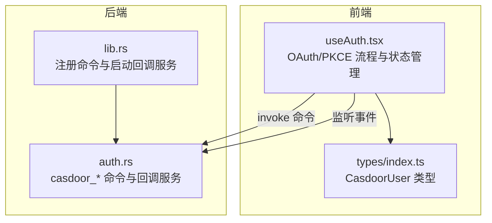
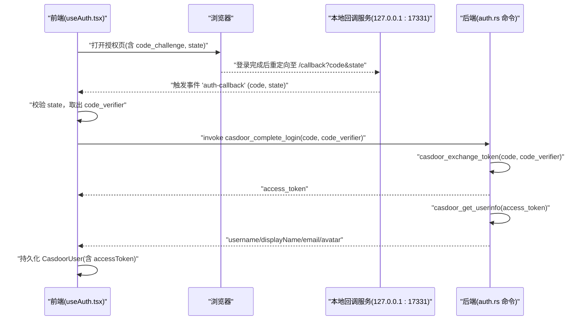
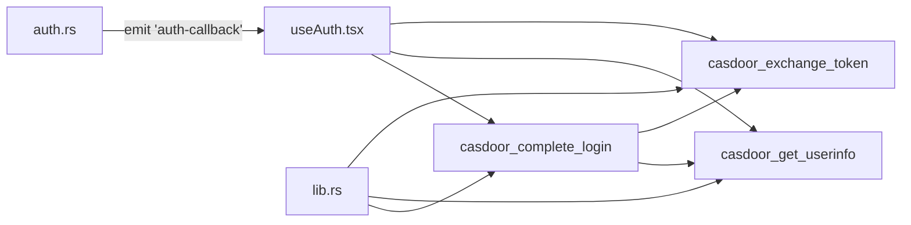

# 认证命令

<cite>
**本文引用的文件**
- [src-tauri/src/auth.rs](file://src-tauri/src/auth.rs)
- [src/hooks/useAuth.tsx](file://src/hooks/useAuth.tsx)
- [src-tauri/src/lib.rs](file://src-tauri/src/lib.rs)
- [src/types/index.ts](file://src/types/index.ts)
</cite>

## 目录
1. [简介](#简介)
2. [项目结构](#项目结构)
3. [核心组件](#核心组件)
4. [架构总览](#架构总览)
5. [详细组件分析](#详细组件分析)
6. [依赖关系分析](#依赖关系分析)
7. [性能考量](#性能考量)
8. [故障排查指南](#故障排查指南)
9. [结论](#结论)
10. [附录](#附录)

## 简介
本文件面向 RabbitCoding 的 Casdoor 认证相关命令，系统性梳理以下命令的参数、返回值、错误处理与安全特性：
- casdoor_exchange_token：使用 authorization code + code_verifier 交换 access_token
- casdoor_get_userinfo：使用 access_token 获取用户信息
- casdoor_complete_login：一次性完成 token 交换与用户信息获取

文档同时解释 OAuth 2.0 授权码 + PKCE 流程、本地 loopback 回调（127.0.0.1:17331/callback）与 Tauri 事件“auth-callback”的交互、前端登录状态管理与安全令牌处理。

## 项目结构
认证相关代码分布在后端 Rust 模块与前端 React Hook 中：
- 后端（Tauri 命令）：src-tauri/src/auth.rs
- 前端（登录流程与状态）：src/hooks/useAuth.tsx
- 类型定义（用户信息）：src/types/index.ts
- 应用入口（注册命令与启动回调服务）：src-tauri/src/lib.rs

图表来源
- [src/hooks/useAuth.tsx:1-252](file://src/hooks/useAuth.tsx#L1-L252)
- [src-tauri/src/auth.rs:1-376](file://src-tauri/src/auth.rs#L1-L376)
- [src-tauri/src/lib.rs:400-570](file://src-tauri/src/lib.rs#L400-L570)
- [src/types/index.ts:715-733](file://src/types/index.ts#L715-L733)

章节来源
- [src-tauri/src/auth.rs:1-376](file://src-tauri/src/auth.rs#L1-L376)
- [src/hooks/useAuth.tsx:1-252](file://src/hooks/useAuth.tsx#L1-L252)
- [src-tauri/src/lib.rs:400-570](file://src-tauri/src/lib.rs#L400-L570)
- [src/types/index.ts:715-733](file://src/types/index.ts#L715-L733)

## 核心组件
- 后端命令
  - casdoor_exchange_token：POST /api/login/oauth/access_token，参数为 code 与 code_verifier，返回 access_token 等
  - casdoor_get_userinfo：GET /api/get-account，参数为 access_token，返回用户名、显示名、邮箱、头像
  - casdoor_complete_login：组合命令，先交换 token 再获取用户信息
- 前端 Hook
  - useAuth：负责 PKCE 生成、构建授权 URL、打开浏览器、监听 auth-callback 事件、调用后端命令、持久化用户信息
- 类型定义
  - CasdoorUser：前端保存的完整用户信息（含 accessToken 与登录时间戳）

章节来源
- [src-tauri/src/auth.rs:23-52](file://src-tauri/src/auth.rs#L23-L52)
- [src/hooks/useAuth.tsx:46-57](file://src/hooks/useAuth.tsx#L46-L57)
- [src/types/index.ts:718-732](file://src/types/index.ts#L718-L732)

## 架构总览
下图展示了 OAuth 2.0 授权码 + PKCE 在 RabbitCoding 中的端到端流程，包括前端发起、本地回调、后端命令与前端状态更新。

图表来源
- [src/hooks/useAuth.tsx:100-187](file://src/hooks/useAuth.tsx#L100-L187)
- [src-tauri/src/auth.rs:227-245](file://src-tauri/src/auth.rs#L227-L245)
- [src-tauri/src/auth.rs:118-172](file://src-tauri/src/auth.rs#L118-L172)
- [src-tauri/src/auth.rs:179-220](file://src-tauri/src/auth.rs#L179-L220)
- [src-tauri/src/lib.rs:400-403](file://src-tauri/src/lib.rs#L400-L403)

## 详细组件分析

### 命令一：casdoor_exchange_token
- 功能
  - 将授权码与 PKCE code_verifier 交换为 access_token
- 参数
  - code: string（授权码）
  - code_verifier: string（PKCE 验证器）
- 返回值
  - 成功：CasdoorTokenResponse
    - access_token: string
    - token_type: string?
    - expires_in: number?
    - refresh_token: string?
  - 失败：字符串错误信息（包含 error 与 error_description）
- 错误处理
  - HTTP 请求失败、响应解析失败、无 access_token 时返回具体错误
- 安全特性
  - 使用 PKCE（S256）与 code_challenge，防止授权码拦截
  - 仅在本地 loopback 地址回调，降低中间人风险
- 调用方
  - casdoor_complete_login 内部调用

章节来源
- [src-tauri/src/auth.rs:118-172](file://src-tauri/src/auth.rs#L118-L172)
- [src-tauri/src/auth.rs:23-31](file://src-tauri/src/auth.rs#L23-L31)

### 命令二：casdoor_get_userinfo
- 功能
  - 使用 access_token 调用 /api/get-account 获取用户资料
- 参数
  - access_token: string
- 返回值
  - 成功：CasdoorUserInfo
    - username: string
    - display_name: string
    - email: string
    - avatar: string
  - 失败：字符串错误信息（缺失 data 或 msg）
- 错误处理
  - HTTP 请求失败、响应解析失败、data 缺失时返回具体错误
- 安全特性
  - 使用 Bearer Token 访问受保护资源
- 调用方
  - casdoor_complete_login 内部调用

章节来源
- [src-tauri/src/auth.rs:179-220](file://src-tauri/src/auth.rs#L179-L220)
- [src-tauri/src/auth.rs:34-41](file://src-tauri/src/auth.rs#L34-L41)

### 命令三：casdoor_complete_login
- 功能
  - 一次性完成 token 交换与用户信息获取，减少前端往返
- 参数
  - code: string
  - code_verifier: string
- 返回值
  - 成功：CasdoorLoginResult
    - access_token: string
    - username: string
    - display_name: string
    - email: string
    - avatar: string
- 错误处理
  - 任一步失败则返回错误（例如 token 交换失败或 userinfo 获取失败）
- 安全特性
  - 串联两个命令，避免前端暴露 access_token 过长生命周期

章节来源
- [src-tauri/src/auth.rs:227-245](file://src-tauri/src/auth.rs#L227-L245)
- [src-tauri/src/auth.rs:44-52](file://src-tauri/src/auth.rs#L44-L52)

### 前端登录流程（useAuth）
- PKCE 与 state 生成
  - 生成 code_verifier（64 字符）、计算 code_challenge（S256 + base64url）
  - 生成 state（32 字符），二者存入 localStorage
- 打开授权页
  - 构造 /login/oauth/authorize URL，包含 client_id、redirect_uri、response_type=code、scope、code_challenge、code_challenge_method=S256、state
- 本地回调与事件监听
  - 监听 Tauri 事件 'auth-callback'，收到 code 与 state
  - 校验 state 与 localStorage 中保存的一致，防止 CSRF
  - 读取 code_verifier 并清理临时数据
- 调用后端命令
  - invoke casdoor_complete_login(code, code_verifier)
  - 成功后持久化 CasdoorUser（含 accessToken 与登录时间戳）
- 退出登录
  - 清空用户状态与 localStorage 中的 PKCE 与 state

章节来源
- [src/hooks/useAuth.tsx:63-82](file://src/hooks/useAuth.tsx#L63-L82)
- [src/hooks/useAuth.tsx:190-224](file://src/hooks/useAuth.tsx#L190-L224)
- [src/hooks/useAuth.tsx:100-187](file://src/hooks/useAuth.tsx#L100-L187)
- [src/hooks/useAuth.tsx:226-232](file://src/hooks/useAuth.tsx#L226-L232)
- [src/types/index.ts:718-732](file://src/types/index.ts#L718-L732)

### 本地 OAuth 回调服务（Loopback）
- 启动时机
  - 应用启动时调用 start_auth_callback_server(app.handle().clone())
- 行为
  - 监听 127.0.0.1:17331，解析 /callback?code&state&error
  - 若存在 code：通过事件 'auth-callback' 通知前端；返回“登录成功”页面
  - 若存在 error：返回“登录失败”页面
- 安全性
  - 仅本地环回地址，避免外部访问
  - 与前端 state 校验配合，抵御 CSRF

章节来源
- [src-tauri/src/lib.rs:400-403](file://src-tauri/src/lib.rs#L400-L403)
- [src-tauri/src/auth.rs:251-376](file://src-tauri/src/auth.rs#L251-L376)

### 类型定义（CasdoorUser）
- 字段
  - username: string
  - displayName: string
  - email: string
  - avatar: string
  - accessToken: string
  - loggedInAt: number（登录时间戳）

章节来源
- [src/types/index.ts:718-732](file://src/types/index.ts#L718-L732)

## 依赖关系分析
- 命令注册
  - lib.rs 在 run 生命周期中注册 casdoor_* 命令，供前端 invoke
- 事件通信
  - auth.rs 启动回调服务并通过事件 'auth-callback' 通知前端
- 前端依赖
  - useAuth.tsx 依赖 @tauri-apps/api（invoke、listen、opener）与 useLocalStorage

图表来源
- [src-tauri/src/lib.rs:562-566](file://src-tauri/src/lib.rs#L562-L566)
- [src-tauri/src/auth.rs:251-376](file://src-tauri/src/auth.rs#L251-L376)
- [src/hooks/useAuth.tsx:100-187](file://src/hooks/useAuth.tsx#L100-L187)

章节来源
- [src-tauri/src/lib.rs:562-566](file://src-tauri/src/lib.rs#L562-L566)
- [src-tauri/src/auth.rs:251-376](file://src-tauri/src/auth.rs#L251-L376)
- [src/hooks/useAuth.tsx:100-187](file://src/hooks/useAuth.tsx#L100-L187)

## 性能考量
- 减少往返：casdoor_complete_login 将 token 交换与用户信息获取合并，降低前端等待时间
- 超时控制：后端 HTTP 客户端设置 30 秒超时，避免阻塞
- 本地回调：loopback 服务在本地线程处理，避免额外依赖与复杂路由

## 故障排查指南
- 常见错误与定位
  - Token 交换失败：检查 code 与 code_verifier 是否匹配、redirect_uri 是否一致、Casdoor 返回的 error/error_description
  - 用户信息缺失：检查 access_token 是否有效、/api/get-account 返回的 data/msg
  - 回调无响应：确认本地回调服务已启动、端口 17331 未被占用、前端已监听 'auth-callback' 事件
  - CSRF 风险：state 不匹配时需重新发起登录流程
- 日志与调试
  - 后端在关键步骤输出 eprintln 日志，便于定位响应状态与内容片段
  - 前端在回调处理中记录错误并设置 loginError，便于 UI 展示

章节来源
- [src-tauri/src/auth.rs:118-172](file://src-tauri/src/auth.rs#L118-L172)
- [src-tauri/src/auth.rs:179-220](file://src-tauri/src/auth.rs#L179-L220)
- [src-tauri/src/auth.rs:251-376](file://src-tauri/src/auth.rs#L251-L376)
- [src/hooks/useAuth.tsx:106-168](file://src/hooks/useAuth.tsx#L106-L168)

## 结论
RabbitCoding 的 Casdoor 认证采用 OAuth 2.0 授权码 + PKCE，结合本地 loopback 回调与 Tauri 事件，实现了安全、简洁的登录体验。后端命令封装了 token 交换与用户信息获取，前端 Hook 负责 PKCE、授权页打开、回调处理与状态持久化。整体设计在安全性与易用性之间取得平衡。

## 附录

### API 定义与调用示例（路径指引）
- 调用方式
  - 前端使用 @tauri-apps/api 的 invoke 调用后端命令
  - 示例路径（不展示具体代码内容）：
    - [前端调用 casdoor_complete_login:138-148](file://src/hooks/useAuth.tsx#L138-L148)
    - [前端监听 auth-callback 事件:170-177](file://src/hooks/useAuth.tsx#L170-L177)
- 命令与参数
  - [casdoor_exchange_token:118-172](file://src-tauri/src/auth.rs#L118-L172)
  - [casdoor_get_userinfo:179-220](file://src-tauri/src/auth.rs#L179-L220)
  - [casdoor_complete_login:227-245](file://src-tauri/src/auth.rs#L227-L245)
- 类型定义
  - [CasdoorUser:718-732](file://src/types/index.ts#L718-L732)