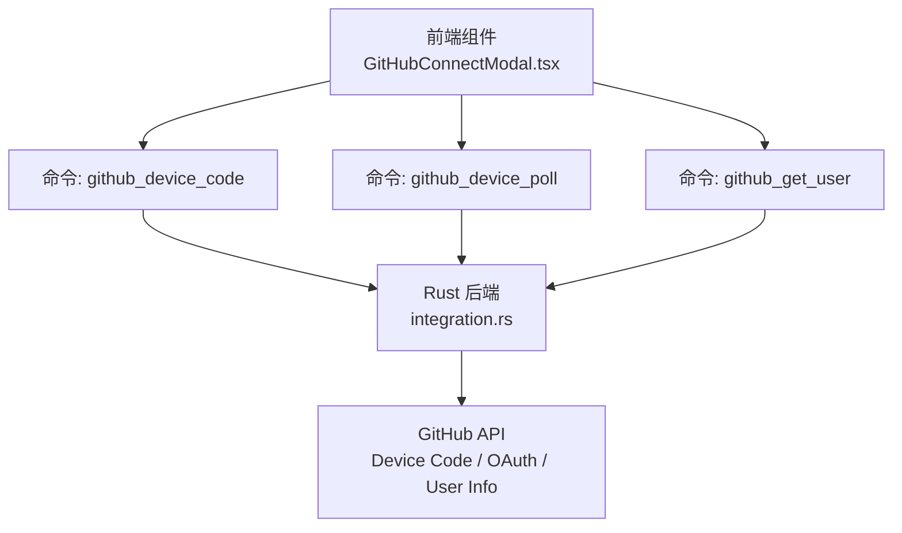
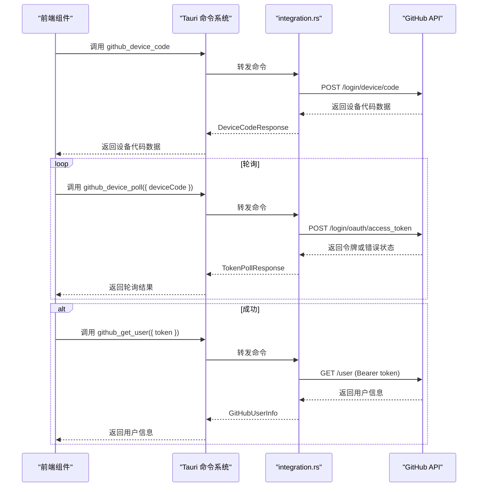
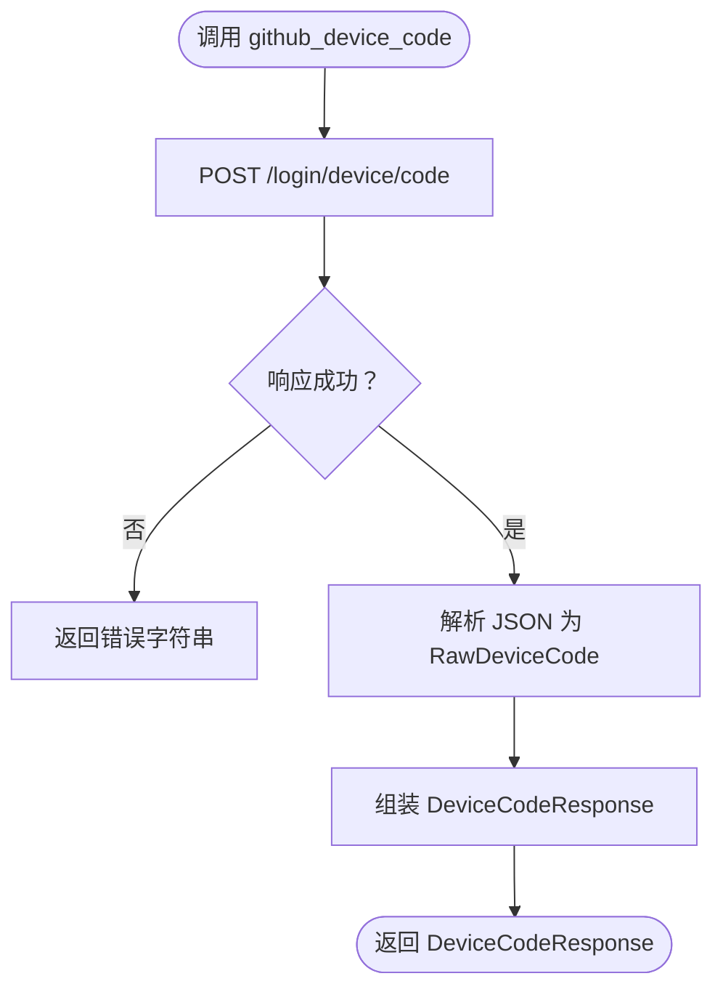
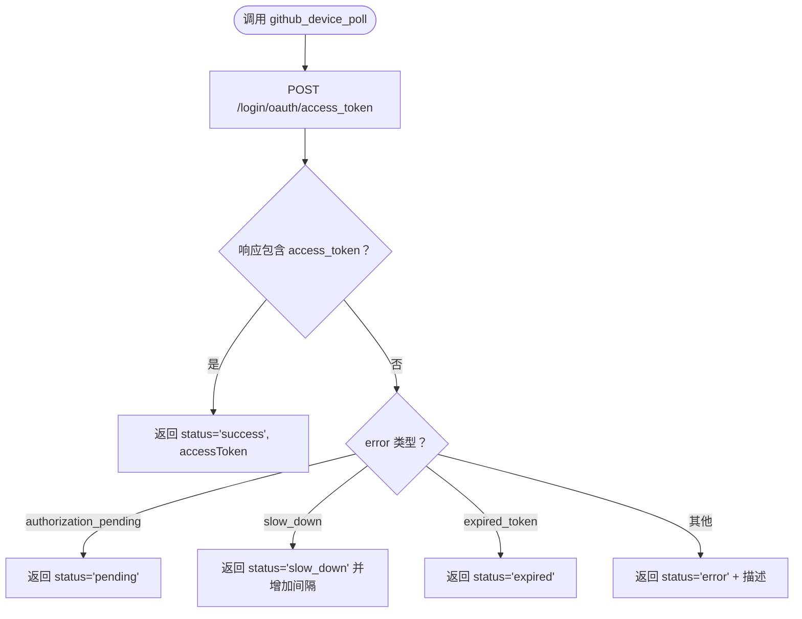
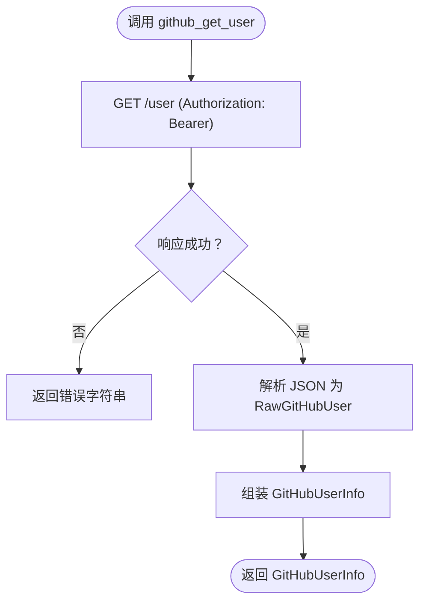
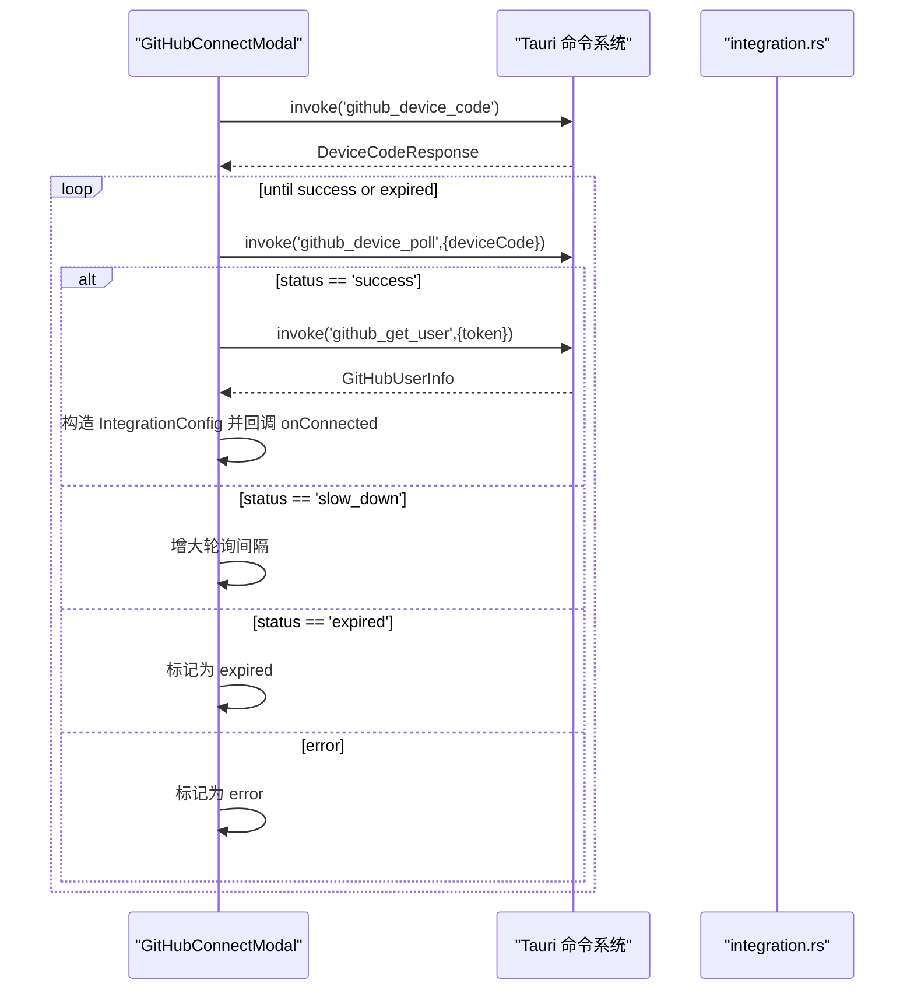
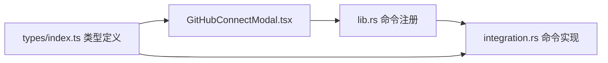

# 集成命令

<cite>
**本文引用的文件**
- [src-tauri/src/integration.rs](file://src-tauri/src/integration.rs)
- [src-tauri/src/lib.rs](file://src-tauri/src/lib.rs)
- [src/components/settings/GitHubConnectModal.tsx](file://src/components/settings/GitHubConnectModal.tsx)
- [src/types/index.ts](file://src/types/index.ts)
- [src-tauri/src/auth.rs](file://src-tauri/src/auth.rs)
</cite>

## 目录
1. [简介](#简介)
2. [项目结构](#项目结构)
3. [核心组件](#核心组件)
4. [架构总览](#架构总览)
5. [详细组件分析](#详细组件分析)
6. [依赖关系分析](#依赖关系分析)
7. [性能考量](#性能考量)
8. [故障排查指南](#故障排查指南)
9. [结论](#结论)
10. [附录](#附录)

## 简介
本文件面向 RabbitCoding 的“集成命令”能力，聚焦于 GitHub 设备代码（Device Flow）认证流程与相关 API 的设计与使用说明。文档涵盖以下命令：
- github_device_code：请求设备验证码
- github_device_poll：轮询访问令牌
- github_get_user：获取用户信息

同时，文档详细说明各命令的参数类型、返回值格式、错误处理机制；解释 OAuth 设备代码流程、轮询机制、用户信息获取；并提供前端正确调用方式与认证状态管理、错误处理策略的最佳实践。

## 项目结构
与集成命令直接相关的代码分布在如下位置：
- 后端（Tauri Rust）：src-tauri/src/integration.rs 定义了三个命令；src-tauri/src/lib.rs 将其注册为可调用命令。
- 前端（React + Tauri）：src/components/settings/GitHubConnectModal.tsx 实现设备代码认证的前端交互与轮询控制。
- 类型定义：src/types/index.ts 定义了集成配置与相关接口类型。

图表来源
- [src-tauri/src/integration.rs:140-230](file://src-tauri/src/integration.rs#L140-L230)
- [src-tauri/src/lib.rs:555-558](file://src-tauri/src/lib.rs#L555-L558)
- [src/components/settings/GitHubConnectModal.tsx:197-232](file://src/components/settings/GitHubConnectModal.tsx#L197-L232)

章节来源
- [src-tauri/src/integration.rs:140-230](file://src-tauri/src/integration.rs#L140-L230)
- [src-tauri/src/lib.rs:555-558](file://src-tauri/src/lib.rs#L555-L558)
- [src/components/settings/GitHubConnectModal.tsx:197-232](file://src/components/settings/GitHubConnectModal.tsx#L197-L232)

## 核心组件
本节概述三个集成命令的职责、输入输出与错误处理策略。

- github_device_code
  - 功能：向 GitHub 发起设备代码申请，返回设备验证码、用户验证码、验证地址、过期时间与轮询间隔。
  - 参数：无
  - 返回：DeviceCodeResponse（包含 device_code、user_code、verification_uri、expires_in、interval）
  - 错误：网络异常、解析失败、非 2xx 状态等均转换为字符串错误返回
  - 安全：使用固定 client_id 与限定 scope（read:user repo）

- github_device_poll
  - 功能：以设备代码轮询换取访问令牌，支持 pending、slow_down、expired、error 等状态反馈。
  - 参数：device_code（String）
  - 返回：TokenPollResponse（包含 status、accessToken、error）
  - 错误：当 error 非空时，status 为 error，并附带错误描述
  - 安全：使用固定 client_id 与标准 grant_type

- github_get_user
  - 功能：使用访问令牌调用 GitHub 用户信息接口，返回登录名、头像与可选姓名。
  - 参数：token（String）
  - 返回：GitHubUserInfo（包含 login、avatar_url、name）
  - 错误：网络异常、解析失败、非 2xx 状态等均转换为字符串错误返回

章节来源
- [src-tauri/src/integration.rs:140-230](file://src-tauri/src/integration.rs#L140-L230)

## 架构总览
下图展示了从前端发起设备代码请求，到轮询令牌、获取用户信息的整体流程。

图表来源
- [src-tauri/src/integration.rs:140-230](file://src-tauri/src/integration.rs#L140-L230)
- [src/components/settings/GitHubConnectModal.tsx:197-232](file://src/components/settings/GitHubConnectModal.tsx#L197-L232)
- [src/components/settings/GitHubConnectModal.tsx:114-195](file://src/components/settings/GitHubConnectModal.tsx#L114-L195)

## 详细组件分析

### 设备代码请求（github_device_code）
- 输入：无
- 输出：DeviceCodeResponse
  - device_code：设备代码，用于后续轮询
  - user_code：用户验证码，需在浏览器验证页输入
  - verification_uri：GitHub 验证页地址
  - expires_in：设备代码有效期（秒）
  - interval：首次轮询建议间隔（秒）
- 错误处理：网络错误、JSON 解析失败、非 2xx 均转为字符串错误
- 安全要点：使用固定 client_id 与限定 scope（read:user repo）

图表来源
- [src-tauri/src/integration.rs:140-159](file://src-tauri/src/integration.rs#L140-L159)

章节来源
- [src-tauri/src/integration.rs:140-159](file://src-tauri/src/integration.rs#L140-L159)

### 轮询令牌（github_device_poll）
- 输入：device_code（String）
- 输出：TokenPollResponse
  - status：success | pending | slow_down | expired | error
  - accessToken：当 status 为 success 时存在
  - error：当 status 为 error 时存在
- 状态映射：
  - authorization_pending → pending
  - slow_down → slow_down
  - expired_token → expired
  - 其他 error → error（附带错误描述）
- 错误处理：网络错误、JSON 解析失败、非 2xx 均转为字符串错误
- 安全要点：使用固定 client_id 与标准 grant_type

图表来源
- [src-tauri/src/integration.rs:165-212](file://src-tauri/src/integration.rs#L165-L212)

章节来源
- [src-tauri/src/integration.rs:165-212](file://src-tauri/src/integration.rs#L165-L212)

### 获取用户信息（github_get_user）
- 输入：token（String）
- 输出：GitHubUserInfo
  - login：GitHub 登录名
  - avatar_url：头像 URL
  - name：可选，真实姓名
- 错误处理：网络错误、JSON 解析失败、非 2xx 均转为字符串错误
- 安全要点：使用 Bearer token 调用 GitHub 用户接口

图表来源
- [src-tauri/src/integration.rs:218-230](file://src-tauri/src/integration.rs#L218-L230)

章节来源
- [src-tauri/src/integration.rs:218-230](file://src-tauri/src/integration.rs#L218-L230)

### 前端调用与状态管理（GitHubConnectModal）
- 状态机：requesting → awaiting → polling → success | error
- 关键行为：
  - 请求设备代码：调用 github_device_code，得到 device_code、user_code、verification_uri、expires_in、interval
  - 自动打开浏览器：打开 verification_uri
  - 轮询令牌：按 interval 秒延迟调用 github_device_poll，根据返回状态切换 awaiting/polling/success/error
  - 慢速降级：当返回 slow_down 时，逐步增加轮询间隔
  - 过期处理：若超过 expires_in，标记为 expired
  - 成功后：调用 github_get_user 获取用户信息，构造 IntegrationConfig 并回调 onConnected
- 错误处理：
  - 轮询阶段：捕获异常，设置 error 状态并显示错误信息
  - 用户信息获取失败：回滚 successRef，允许重试
  - 严格模式与竞态：使用 cancelledRef、successRef、定时器清理避免重复执行

图表来源
- [src/components/settings/GitHubConnectModal.tsx:197-232](file://src/components/settings/GitHubConnectModal.tsx#L197-L232)
- [src/components/settings/GitHubConnectModal.tsx:114-195](file://src/components/settings/GitHubConnectModal.tsx#L114-L195)
- [src-tauri/src/integration.rs:165-212](file://src-tauri/src/integration.rs#L165-L212)
- [src-tauri/src/integration.rs:218-230](file://src-tauri/src/integration.rs#L218-L230)

章节来源
- [src/components/settings/GitHubConnectModal.tsx:197-232](file://src/components/settings/GitHubConnectModal.tsx#L197-L232)
- [src/components/settings/GitHubConnectModal.tsx:114-195](file://src/components/settings/GitHubConnectModal.tsx#L114-L195)

## 依赖关系分析
- 命令注册：lib.rs 将 integration 模块中的三个命令注册为可调用命令。
- 前端调用：GitHubConnectModal 使用 @tauri-apps/api 的 invoke 调用后端命令。
- 数据结构：前端 TypeScript 接口与后端 Rust 序列化结构一一对应（camelCase 对齐）。

图表来源
- [src-tauri/src/lib.rs:555-558](file://src-tauri/src/lib.rs#L555-L558)
- [src-tauri/src/integration.rs:14-38](file://src-tauri/src/integration.rs#L14-L38)
- [src/types/index.ts:541-557](file://src/types/index.ts#L541-L557)

章节来源
- [src-tauri/src/lib.rs:555-558](file://src-tauri/src/lib.rs#L555-L558)
- [src-tauri/src/integration.rs:14-38](file://src-tauri/src/integration.rs#L14-L38)
- [src/types/index.ts:541-557](file://src/types/index.ts#L541-L557)

## 性能考量
- 轮询策略：初次 interval 来自后端响应；当收到 slow_down 时逐步增加轮询间隔，避免频繁请求导致 GitHub 限流。
- 超时与重试：HTTP 客户端统一 30 秒超时；前端在错误状态下提供重试按钮。
- 资源释放：严格模式下使用清理函数与取消标志，确保组件卸载时清除定时器，避免内存泄漏与竞态。

## 故障排查指南
- 设备代码请求失败
  - 检查网络连通性与 DNS 解析
  - 查看后端日志（eprintln 输出）了解具体错误
  - 确认 client_id 与 scope 正确
- 轮询阶段反复 pending
  - 确认用户已在 GitHub 验证页输入 user_code
  - 若出现 slow_down，等待并增大轮询间隔
  - 超过 expires_in 会返回 expired，需重新发起设备代码请求
- 获取用户信息失败
  - 检查 token 是否有效
  - 确认 GitHub API 可达
- 前端状态异常
  - 严格模式可能导致 useEffect 双次执行，需依赖 cancelledRef、successRef 控制
  - 定时器未清理会导致竞态，务必在 cleanup 中清除

章节来源
- [src-tauri/src/integration.rs:44-82](file://src-tauri/src/integration.rs#L44-L82)
- [src/components/settings/GitHubConnectModal.tsx:84-94](file://src/components/settings/GitHubConnectModal.tsx#L84-L94)
- [src/components/settings/GitHubConnectModal.tsx:163-177](file://src/components/settings/GitHubConnectModal.tsx#L163-L177)

## 结论
RabbitCoding 的 GitHub 集成命令以设备代码流程为核心，结合前后端协作实现了安全、稳定的认证体验。后端提供清晰的命令接口与错误处理，前端通过状态机与轮询策略保障用户体验。遵循本文的参数、返回值与错误处理规范，可在前端正确调用并妥善管理认证状态。

## 附录

### API 规范与类型定义

- github_device_code
  - 输入：无
  - 输出：DeviceCodeResponse
    - device_code: string
    - user_code: string
    - verification_uri: string
    - expires_in: number
    - interval: number

- github_device_poll
  - 输入：device_code: string
  - 输出：TokenPollResponse
    - status: "success" | "pending" | "slow_down" | "expired" | "error"
    - accessToken?: string
    - error?: string

- github_get_user
  - 输入：token: string
  - 输出：GitHubUserInfo
    - login: string
    - avatar_url: string
    - name?: string

- 集成配置（前端存储）
  - IntegrationConfig
    - id: string
    - provider: "github"
    - connected: boolean
    - accountName: string
    - avatarUrl: string
    - token: string
    - connectedAt: number

章节来源
- [src-tauri/src/integration.rs:14-38](file://src-tauri/src/integration.rs#L14-L38)
- [src-tauri/src/integration.rs:140-230](file://src-tauri/src/integration.rs#L140-L230)
- [src/types/index.ts:541-557](file://src/types/index.ts#L541-L557)

### 前端调用示例（步骤说明）
以下为前端调用的步骤说明，便于在项目中正确集成：
- 步骤 1：请求设备代码
  - 调用 invoke('github_device_code')
  - 得到 device_code、user_code、verification_uri、expires_in、interval
  - 自动打开 verification_uri
- 步骤 2：轮询令牌
  - 按 interval 秒延迟调用 invoke('github_device_poll',{ deviceCode })
  - 根据 status 切换状态：pending → awaiting；slow_down → 增大间隔；expired → 提示过期；error → 显示错误
- 步骤 3：获取用户信息
  - 当 status 为 success 且存在 accessToken 时，调用 invoke('github_get_user',{ token })
  - 构造 IntegrationConfig 并回调 onConnected
- 步骤 4：错误处理与重试
  - 捕获异常并设置 error 状态
  - 提供重试按钮重新发起流程

章节来源
- [src/components/settings/GitHubConnectModal.tsx:197-232](file://src/components/settings/GitHubConnectModal.tsx#L197-L232)
- [src/components/settings/GitHubConnectModal.tsx:114-195](file://src/components/settings/GitHubConnectModal.tsx#L114-L195)

### 安全特性与最佳实践
- OAuth 设备代码流程
  - 使用固定 client_id 与限定 scope（read:user repo）
  - 令牌仅在成功后传递给前端，避免泄露
- 令牌管理
  - 前端仅在成功后保存 token 与用户信息
  - 过期检测与错误回滚，保证状态一致性
- 权限范围
  - 当前 scope 为 read:user repo，满足用户信息与仓库相关操作需求
- 本地回调（对比）
  - 项目中还包含 Casdoor 本地回调实现（loopback HTTP 服务），可作为 OAuth 流程的参考实现

章节来源
- [src-tauri/src/integration.rs:8,142-144:8-144](file://src-tauri/src/integration.rs#L8-L144)
- [src-tauri/src/auth.rs:258-375](file://src-tauri/src/auth.rs#L258-L375)