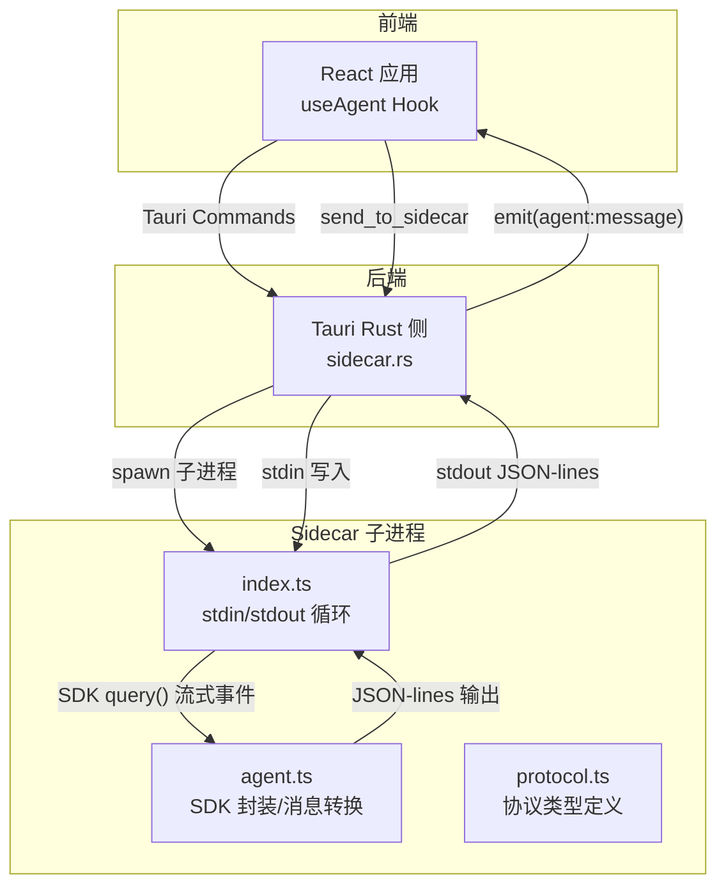
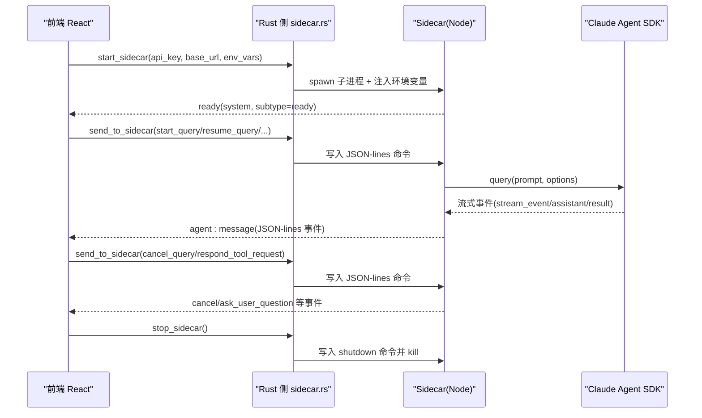
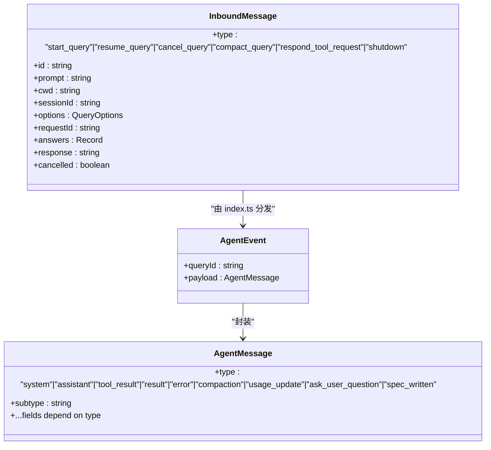
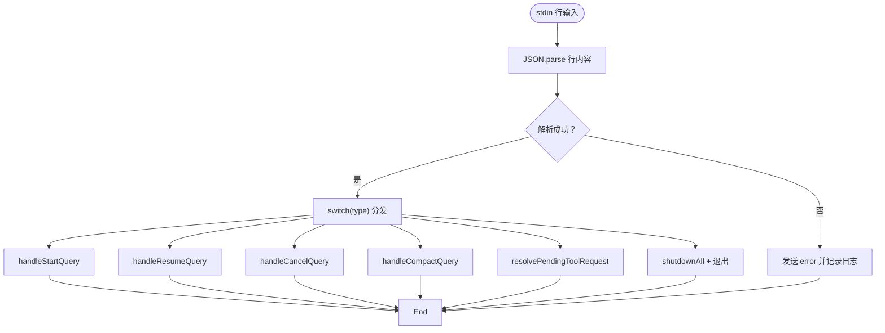
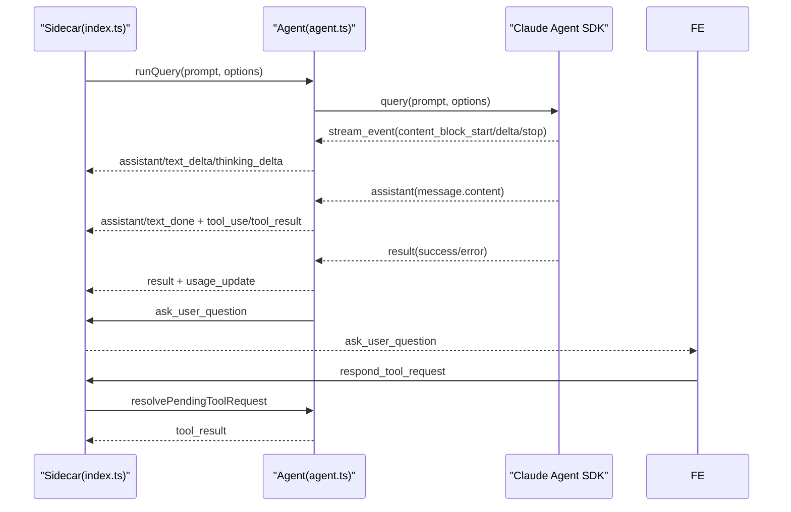
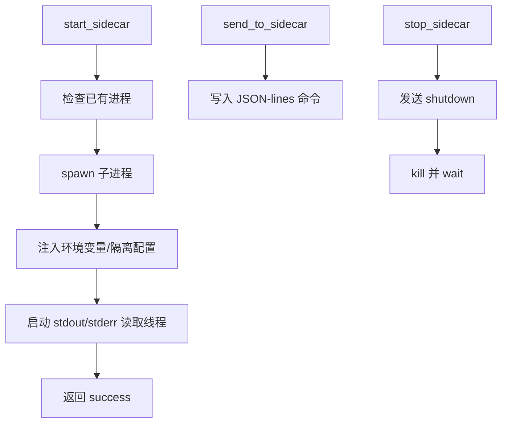
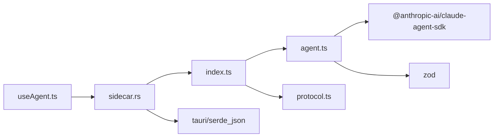

# Sidecar 设计原理

<cite>
**本文引用的文件列表**
- [sidecar/src/index.ts](file://sidecar/src/index.ts)
- [sidecar/src/protocol.ts](file://sidecar/src/protocol.ts)
- [sidecar/src/agent.ts](file://sidecar/src/agent.ts)
- [sidecar/scripts/setup-resources.mjs](file://sidecar/scripts/setup-resources.mjs)
- [sidecar/package.json](file://sidecar/package.json)
- [src-tauri/src/sidecar.rs](file://src-tauri/src/sidecar.rs)
- [src-tauri/Cargo.toml](file://src-tauri/Cargo.toml)
- [src/hooks/useAgent.ts](file://src/hooks/useAgent.ts)
</cite>

## 目录
1. [引言](#引言)
2. [项目结构](#项目结构)
3. [核心组件](#核心组件)
4. [架构总览](#架构总览)
5. [详细组件分析](#详细组件分析)
6. [依赖关系分析](#依赖关系分析)
7. [性能考虑](#性能考虑)
8. [故障排查指南](#故障排查指南)
9. [结论](#结论)
10. [附录](#附录)

## 引言
本文件面向 Sidecar 进程的设计与实现，系统化阐述其架构理念、进程隔离机制、与主应用的解耦设计，以及 JSON-lines 协议的设计思路、消息格式规范与数据传输机制。文档同时覆盖职责边界、模块划分原则、扩展性设计，并给出性能优化策略、资源管理方案与最佳实践指导，帮助读者在理解技术细节的同时，能够安全、稳定地集成与扩展 Sidecar 能力。

## 项目结构
Sidecar 采用“前端（React + Tauri）—后端（Rust）—子进程（Node.js Sidecar）”三层协作架构：
- 前端负责 UI 交互与业务编排，通过 Tauri Commands 触发后端命令。
- 后端（Rust）负责进程生命周期管理、stdin/stdout/stderr 管道读写、事件转发。
- Sidecar（Node.js）负责与 Claude Agent SDK 交互，将流式消息转换为 JSON-lines 协议消息。

图表来源
- [sidecar/src/index.ts:96-128](file://sidecar/src/index.ts#L96-L128)
- [sidecar/src/agent.ts:241-465](file://sidecar/src/agent.ts#L241-L465)
- [sidecar/src/protocol.ts:1-252](file://sidecar/src/protocol.ts#L1-L252)
- [src-tauri/src/sidecar.rs:60-214](file://src-tauri/src/sidecar.rs#L60-L214)

章节来源
- [sidecar/src/index.ts:1-145](file://sidecar/src/index.ts#L1-L145)
- [sidecar/src/agent.ts:1-606](file://sidecar/src/agent.ts#L1-L606)
- [sidecar/src/protocol.ts:1-252](file://sidecar/src/protocol.ts#L1-L252)
- [src-tauri/src/sidecar.rs:1-359](file://src-tauri/src/sidecar.rs#L1-L359)
- [src/hooks/useAgent.ts:1-200](file://src/hooks/useAgent.ts#L1-L200)

## 核心组件
- 协议层（protocol.ts）：定义前端→Sidecar 的入站命令与 Sidecar→前端的出站消息类型，统一消息结构与字段语义。
- 入口与协议处理（index.ts）：基于 readline 的 JSON-lines 输入循环，分发命令到具体处理器，输出标准化消息，处理异常与关闭事件。
- Agent 封装（agent.ts）：封装 Claude Agent SDK，将 SDK 的流式事件转换为 JSON-lines 消息，管理活跃查询、工具调用、会话压缩、AskUserQuestion 等。
- Rust 进程桥接（src/sidecar.rs）：启动/停止 Sidecar 子进程，注入环境变量与配置隔离，读取 stdout/stderr 并通过 Tauri 事件转发到前端。
- 资源准备（setup-resources.mjs）：构建并复制 sidecar-bundle.js 与平台原生二进制到 Tauri resources 目录，确保生产模式可用。
- 前端集成（useAgent.ts）：通过 Tauri Commands 启停 Sidecar，监听 agent:message 事件，实现看门狗与消息分发。

章节来源
- [sidecar/src/protocol.ts:13-78](file://sidecar/src/protocol.ts#L13-L78)
- [sidecar/src/index.ts:37-91](file://sidecar/src/index.ts#L37-L91)
- [sidecar/src/agent.ts:241-465](file://sidecar/src/agent.ts#L241-L465)
- [src-tauri/src/sidecar.rs:60-214](file://src-tauri/src/sidecar.rs#L60-L214)
- [sidecar/scripts/setup-resources.mjs:105-153](file://sidecar/scripts/setup-resources.mjs#L105-L153)
- [src/hooks/useAgent.ts:103-200](file://src/hooks/useAgent.ts#L103-L200)

## 架构总览
Sidecar 的核心设计目标是“安全、可控、可观测”的外部进程，通过以下机制实现：
- 进程隔离：通过 CLAUDE_CONFIG_DIR 将 Claude Code 的配置根目录重定向至应用专属目录，彻底阻断用户全局 ~/.claude/ 的影响。
- 环境变量隔离：启动前移除从父进程继承的 ANTHROPIC_* 环境变量，确保 API Key、Base URL 等均由应用注入。
- 通信协议：stdin 写入 JSON-lines 命令，stdout 输出 JSON-lines 事件，stderr 专用于日志，互不干扰。
- 流式输出：将 SDK 的增量事件映射为 JSON-lines 的 assistant/text_delta/thinking_delta 等消息，前端逐条渲染。
- 可控工具：对 AskUserQuestion、ExitPlanMode 等工具进行细粒度控制，必要时阻断或要求前端确认。
- 资源打包：生产模式下使用内置 Node.js 运行 sidecar-bundle.js，配合原生二进制，减少外部依赖。

图表来源
- [src-tauri/src/sidecar.rs:60-214](file://src-tauri/src/sidecar.rs#L60-L214)
- [sidecar/src/index.ts:96-128](file://sidecar/src/index.ts#L96-L128)
- [sidecar/src/agent.ts:241-465](file://sidecar/src/agent.ts#L241-L465)
- [src/hooks/useAgent.ts:103-200](file://src/hooks/useAgent.ts#L103-L200)

## 详细组件分析

### JSON-lines 协议设计与消息格式
- 入站命令（前端→Sidecar）：start_query、resume_query、cancel_query、compact_query、respond_tool_request、shutdown。
- 出站消息（Sidecar→前端）：system/init、assistant/text/thinking/text_delta/thinking_delta/text_done/thinking_done、tool_result、result、error、compaction/status/result、usage_update、ask_user_question、spec_written。
- 事件包装：每个出站消息均包裹为 { queryId, payload } 的 AgentEvent 结构，便于前端按 queryId 聚合与路由。
- 传输通道：stdin 写入命令，stdout 输出事件，stderr 输出日志，三者严格分离，互不干扰。

图表来源
- [sidecar/src/protocol.ts:72-107](file://sidecar/src/protocol.ts#L72-L107)
- [sidecar/src/protocol.ts:84-107](file://sidecar/src/protocol.ts#L84-L107)
- [sidecar/src/protocol.ts:110-251](file://sidecar/src/protocol.ts#L110-L251)

章节来源
- [sidecar/src/protocol.ts:13-78](file://sidecar/src/protocol.ts#L13-L78)
- [sidecar/src/protocol.ts:84-107](file://sidecar/src/protocol.ts#L84-L107)
- [sidecar/src/protocol.ts:110-251](file://sidecar/src/protocol.ts#L110-L251)

### Sidecar 入口与命令分发（index.ts）
- stdin 循环：基于 readline 逐行读取 JSON-lines，解析为 InboundMessage，分发到对应处理器。
- 并发处理：start_query/resume_query/compact_query 不 await，支持多查询并发。
- 错误处理：捕获解析异常与处理器异常，统一发送 error 消息并记录日志。
- 关闭与退出：stdin close 时触发 shutdownAll；收到 shutdown 命令后延时退出，保证 stdout flush。

图表来源
- [sidecar/src/index.ts:104-117](file://sidecar/src/index.ts#L104-L117)
- [sidecar/src/index.ts:37-91](file://sidecar/src/index.ts#L37-L91)

章节来源
- [sidecar/src/index.ts:96-128](file://sidecar/src/index.ts#L96-L128)
- [sidecar/src/index.ts:130-144](file://sidecar/src/index.ts#L130-L144)

### Agent 封装与消息转换（agent.ts）
- SDK 封装：将 SDK 的 query() AsyncGenerator 转换为 JSON-lines 流式输出，覆盖 system/init、stream_event、assistant、result 等类型。
- 工具控制：canUseTool 钩子中对 AskUserQuestion、ExitPlanMode、WriteSpec 等工具进行细粒度控制，必要时阻断或要求前端确认。
- 会话压缩：通过发送 /compact prompt 触发 SDK 的压缩流程，上报 compaction/status/result 与 usage_update。
- AskUserQuestion：向前端发送 ask_user_question，等待前端 respond_tool_request，带超时与取消处理。
- 写入 Spec：在 plan 模式下提供 WriteSpec MCP 工具，写入 .rabbit/specs/ 目录并通知前端。

图表来源
- [sidecar/src/agent.ts:241-465](file://sidecar/src/agent.ts#L241-L465)
- [sidecar/src/agent.ts:502-573](file://sidecar/src/agent.ts#L502-L573)

章节来源
- [sidecar/src/agent.ts:241-465](file://sidecar/src/agent.ts#L241-L465)
- [sidecar/src/agent.ts:502-573](file://sidecar/src/agent.ts#L502-L573)

### Rust 进程桥接（src/sidecar.rs）
- 进程生命周期：start_sidecar 检查并复用已有子进程，spawn 子进程，注入环境变量与配置隔离，启动 stdout/stderr 读取线程。
- 环境隔离：移除 ANTHROPIC_* 环境变量，设置 CLAUDE_CONFIG_DIR 指向应用专属目录，阻断用户全局资源泄漏。
- 通信接口：send_to_sidecar 写入 JSON-lines 命令；stop_sidecar 发送 shutdown 并 kill 子进程。
- 事件转发：stdout 每行 JSON-lines 事件通过 Tauri emit("agent:message") 转发到前端；stderr 输出日志。

图表来源
- [src-tauri/src/sidecar.rs:60-214](file://src-tauri/src/sidecar.rs#L60-L214)
- [src-tauri/src/sidecar.rs:245-270](file://src-tauri/src/sidecar.rs#L245-L270)

章节来源
- [src-tauri/src/sidecar.rs:60-214](file://src-tauri/src/sidecar.rs#L60-L214)
- [src-tauri/src/sidecar.rs:245-270](file://src-tauri/src/sidecar.rs#L245-L270)

### 资源准备与打包（setup-resources.mjs）
- 构建与复制：先执行 esbuild 打包 sidecar-bundle.js，再复制到 Tauri resources/sidecar/ 目录。
- 原生二进制：从 @anthropic-ai/claude-agent-sdk 平台包解析并复制 claude/claude.exe 至 resources/sidecar/。
- ESM 支持：在 resources/sidecar/ 写入 { type: "module" } 的 package.json，确保 esbuild 产物正确解析。
- 校验：验证 sidecar-bundle.js 与原生二进制存在，缺失时报错退出。

章节来源
- [sidecar/scripts/setup-resources.mjs:105-153](file://sidecar/scripts/setup-resources.mjs#L105-L153)
- [sidecar/package.json:1-25](file://sidecar/package.json#L1-L25)

### 前端集成（useAgent.ts）
- 生命周期：通过 start_sidecar/stop_sidecar/get_sidecar_status 管理 Sidecar 状态。
- 事件监听：listen("agent:message") 接收 JSON-lines 事件，按 queryId 路由到 onMessage 回调。
- 看门狗：为每条 query 维护 watchdog，区分“思考态”与“正常态”，避免长思考被误判超时。
- 查询操作：startQuery/resumeQuery/compactQuery/cancelQuery/send_to_sidecar 的封装。

章节来源
- [src/hooks/useAgent.ts:103-200](file://src/hooks/useAgent.ts#L103-L200)

## 依赖关系分析
- sidecar/src/index.ts 依赖 sidecar/src/agent.ts 与 sidecar/src/protocol.ts。
- sidecar/src/agent.ts 依赖 @anthropic-ai/claude-agent-sdk、zod、Node FS/Path。
- src-tauri/src/sidecar.rs 依赖 tauri、serde、serde_json，负责进程管理与事件转发。
- 前端 src/hooks/useAgent.ts 依赖 @tauri-apps/api，通过 Tauri Commands/Events 与后端交互。

图表来源
- [sidecar/src/index.ts:11-18](file://sidecar/src/index.ts#L11-L18)
- [sidecar/src/agent.ts:12-26](file://sidecar/src/agent.ts#L12-L26)
- [src-tauri/src/sidecar.rs:1-4](file://src-tauri/src/sidecar.rs#L1-L4)
- [src/hooks/useAgent.ts:8-17](file://src/hooks/useAgent.ts#L8-L17)

章节来源
- [sidecar/src/index.ts:11-18](file://sidecar/src/index.ts#L11-L18)
- [sidecar/src/agent.ts:12-26](file://sidecar/src/agent.ts#L12-L26)
- [src-tauri/src/sidecar.rs:1-4](file://src-tauri/src/sidecar.rs#L1-L4)
- [src/hooks/useAgent.ts:8-17](file://src/hooks/useAgent.ts#L8-L17)

## 性能考虑
- 并发查询：index.ts 对 start/resume/compact 不 await，允许多查询并发，提升吞吐。
- 流式输出：将 SDK 的增量事件映射为 text_delta/thinking_delta，前端边接收边渲染，降低首帧延迟。
- 资源隔离：通过 CLAUDE_CONFIG_DIR 与 settingSources:[] 防止加载用户全局资源，减少不必要的 IO 与初始化开销。
- 看门狗：前端为每条 query 维护独立 watchdog，避免长时间无响应导致 UI 卡死。
- 原生二进制：生产模式使用内置 Node.js 与原生二进制，减少冷启动与依赖解析成本。

## 故障排查指南
- Sidecar 未启动或频繁退出
  - 检查 start_sidecar 返回的 error 信息，确认环境变量注入与 CLAUDE_CONFIG_DIR 设置。
  - 查看 stderr 日志（Rust 侧打印），定位启动失败原因。
- JSON 解析错误
  - index.ts 会在解析失败时发送 error 并记录日志，检查前端发送的 JSON-lines 格式。
- 查询无响应
  - 前端 watchdog 会触发 onQueryTimeout，区分“思考态”与“正常态”阈值。
  - 检查 agent.ts 中的 canUseTool 阻断逻辑（如 AskUserQuestion 未回复）。
- 工具调用被阻断
  - 检查 agent.ts 的工具控制策略，确认是否需要前端 respond_tool_request。
- 会话压缩失败
  - 关注 compaction/status 与 compaction_result 消息，查看错误信息与耗时统计。

章节来源
- [src-tauri/src/sidecar.rs:151-164](file://src-tauri/src/sidecar.rs#L151-L164)
- [sidecar/src/index.ts:113-116](file://sidecar/src/index.ts#L113-L116)
- [src/hooks/useAgent.ts:66-95](file://src/hooks/useAgent.ts#L66-L95)
- [sidecar/src/agent.ts:260-289](file://sidecar/src/agent.ts#L260-L289)

## 结论
Sidecar 通过清晰的职责边界与严格的进程隔离，实现了与主应用的高内聚低耦合。JSON-lines 协议提供了简洁、可靠、可扩展的通信范式；Rust 侧的进程桥接确保了跨语言交互的稳定性；前端的看门狗与事件路由提升了用户体验。整体设计兼顾安全性、性能与可维护性，适合在复杂桌面应用中长期演进。

## 附录
- 最佳实践
  - 始终通过 Rust 侧注入环境变量与配置隔离，避免 shell 环境污染。
  - 使用 JSON-lines 协议，保持 stdin/stdout/stderr 通道分离。
  - 对工具调用进行细粒度控制，必要时引入前端确认流程。
  - 在生产模式下使用 setup-resources.mjs 完成资源打包与校验。
  - 前端为每条 query 维护 watchdog，合理区分“思考态”与“正常态”。