# Sidecar 进程

<cite>
**本文档引用的文件**
- [index.ts](file://sidecar/src/index.ts)
- [agent.ts](file://sidecar/src/agent.ts)
- [protocol.ts](file://sidecar/src/protocol.ts)
- [sidecar.rs](file://src-tauri/src/sidecar.rs)
- [setup-resources.mjs](file://sidecar/scripts/setup-resources.mjs)
- [package.json](file://sidecar/package.json)
- [tsconfig.json](file://sidecar/tsconfig.json)
- [useAgent.ts](file://src/hooks/useAgent.ts)
- [AgentChat.tsx](file://src/components/agent/AgentChat.tsx)
- [types/index.ts](file://src/types/index.ts)
- [tauri.conf.json](file://src-tauri/tauri.conf.json)
- [Cargo.toml](file://src-tauri/Cargo.toml)
</cite>

## 更新摘要
**变更内容**
- 更新了开发模式配置，从编译JavaScript切换到直接TypeScript执行
- 新增了开发调试体验改进说明
- 更新了进程启动机制，支持 npx tsx 直接运行 TypeScript 源码
- 完善了资源准备脚本的工作流程

## 目录
1. [简介](#简介)
2. [项目结构](#项目结构)
3. [核心组件](#核心组件)
4. [架构概览](#架构概览)
5. [详细组件分析](#详细组件分析)
6. [依赖关系分析](#依赖关系分析)
7. [开发模式配置](#开发模式配置)
8. [性能考虑](#性能考虑)
9. [故障排除指南](#故障排除指南)
10. [结论](#结论)

## 简介

RabbitCoding Sidecar 是一个独立的进程，负责与 Anthropic Claude Agent SDK 交互，提供流式对话、工具调用、会话管理和资源隔离等功能。它通过 JSON-lines 协议与主应用通信，实现了安全的沙箱环境和高效的异步处理机制。

**更新** Sidecar 进程现已支持直接TypeScript执行模式，显著改善了开发调试体验。在开发模式下，Sidecar 通过 npx tsx 直接运行 TypeScript 源码，无需预编译步骤，实现了真正的热重载开发体验。

Sidecar 进程在整体架构中扮演着关键角色：
- **安全隔离**：通过独立进程和配置目录隔离，防止全局配置污染
- **流式处理**：支持 Claude 的深度思考和文本流式输出
- **工具集成**：提供 AskUserQuestion 等交互式工具调用
- **会话管理**：支持会话恢复、压缩和取消操作
- **资源控制**：通过预算限制和超时机制防止资源滥用
- **开发友好**：支持直接TypeScript执行，提升开发效率

## 项目结构

Sidecar 相关的项目结构组织如下：

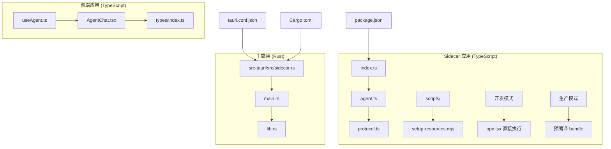

**图表来源**
- [index.ts:1-151](file://sidecar/src/index.ts#L1-L151)
- [sidecar.rs:288-347](file://src-tauri/src/sidecar.rs#L288-L347)
- [useAgent.ts:1-334](file://src/hooks/useAgent.ts#L1-L334)

**章节来源**
- [index.ts:1-151](file://sidecar/src/index.ts#L1-L151)
- [sidecar.rs:1-348](file://src-tauri/src/sidecar.rs#L1-L348)
- [package.json:1-25](file://sidecar/package.json#L1-L25)

## 核心组件

### 1. 通信协议层

Sidecar 实现了基于 JSON-lines 的双向通信协议：

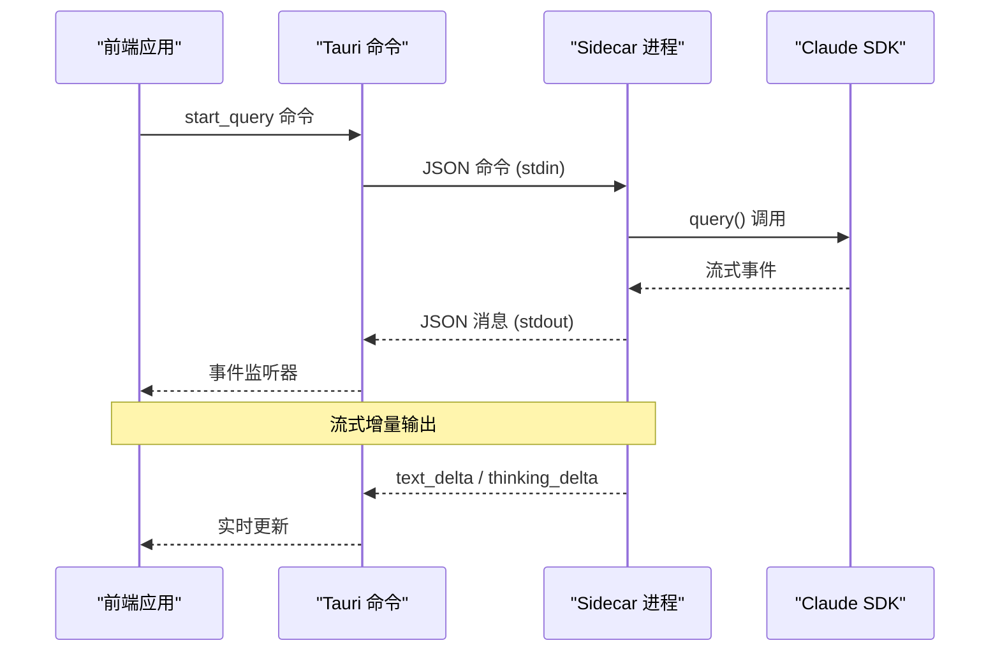

**图表来源**
- [protocol.ts:13-78](file://sidecar/src/protocol.ts#L13-L78)
- [index.ts:37-91](file://sidecar/src/index.ts#L37-L91)

### 2. 代理管理器

代理管理器负责处理各种查询操作：

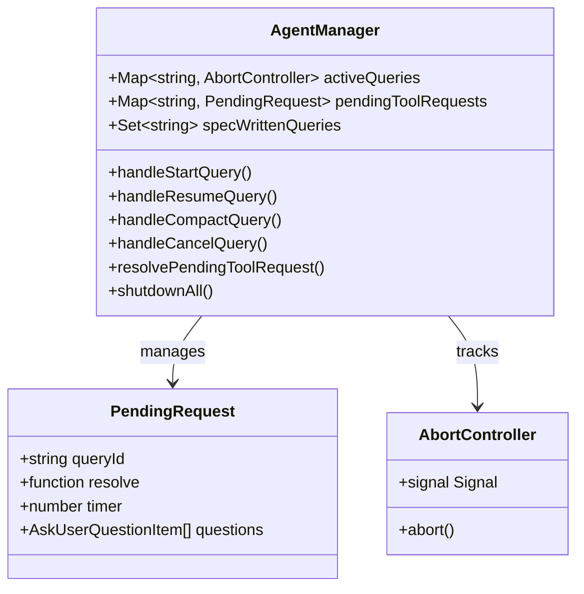

**图表来源**
- [agent.ts:47-63](file://sidecar/src/agent.ts#L47-L63)
- [agent.ts:54-60](file://sidecar/src/agent.ts#L54-L60)

**章节来源**
- [agent.ts:1-755](file://sidecar/src/agent.ts#L1-L755)
- [protocol.ts:1-252](file://sidecar/src/protocol.ts#L1-L252)

## 架构概览

Sidecar 采用多层架构设计，确保安全性、可扩展性和可靠性：

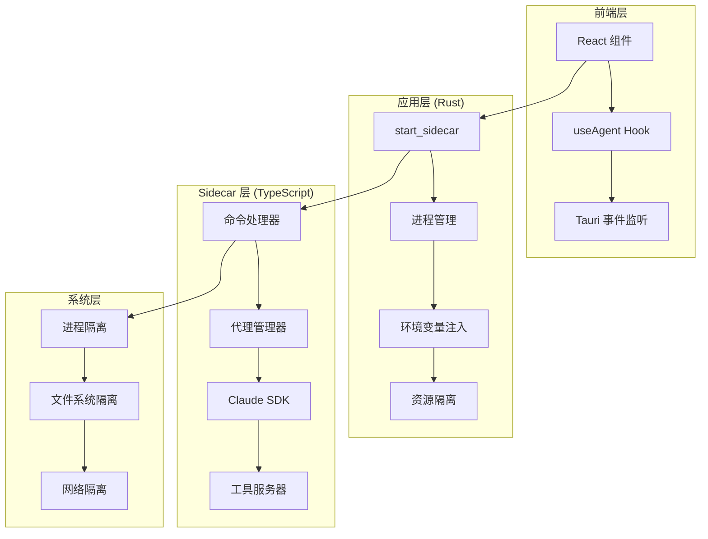

**图表来源**
- [sidecar.rs:60-214](file://src-tauri/src/sidecar.rs#L60-L214)
- [index.ts:96-128](file://sidecar/src/index.ts#L96-L128)

## 详细组件分析

### 1. 命令处理器 (index.ts)

命令处理器是 Sidecar 的入口点，负责解析和分发命令：

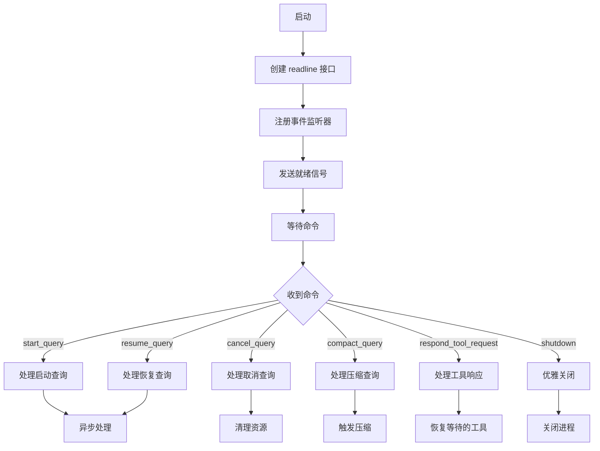

**图表来源**
- [index.ts:37-91](file://sidecar/src/index.ts#L37-L91)
- [index.ts:96-128](file://sidecar/src/index.ts#L96-L128)

**章节来源**
- [index.ts:1-151](file://sidecar/src/index.ts#L1-L151)

### 2. 代理管理器 (agent.ts)

代理管理器封装了 Claude SDK 的复杂性，提供了高级抽象：

#### 2.1 查询生命周期管理

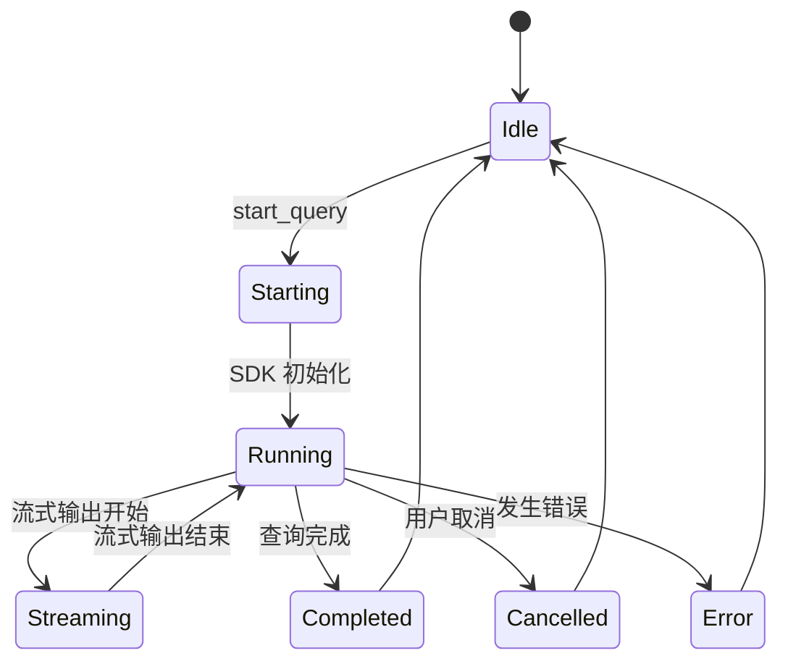

**图表来源**
- [agent.ts:241-465](file://sidecar/src/agent.ts#L241-L465)

#### 2.2 工具调用处理

代理管理器支持多种工具调用模式：

| 工具类型 | 功能描述 | 处理方式 |
|---------|----------|----------|
| WriteSpec | 规范文档写入 | MCP 服务器，异步中止查询 |
| AskUserQuestion | 用户问答 | 异步等待，超时处理 |
| ExitPlanMode | 退出规划模式 | 特殊规则，阻止自动退出 |

**章节来源**
- [agent.ts:1-755](file://sidecar/src/agent.ts#L1-L755)

### 3. 通信协议 (protocol.ts)

协议定义了 Sidecar 与主应用之间的消息格式：

#### 3.1 前端→Sidecar 命令

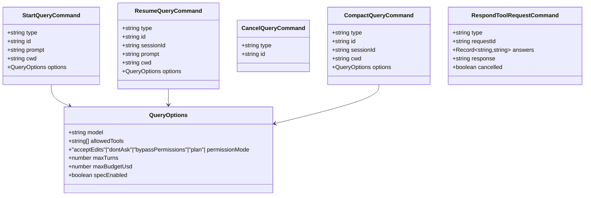

**图表来源**
- [protocol.ts:14-78](file://sidecar/src/protocol.ts#L14-L78)

#### 3.2 Sidecar→前端消息

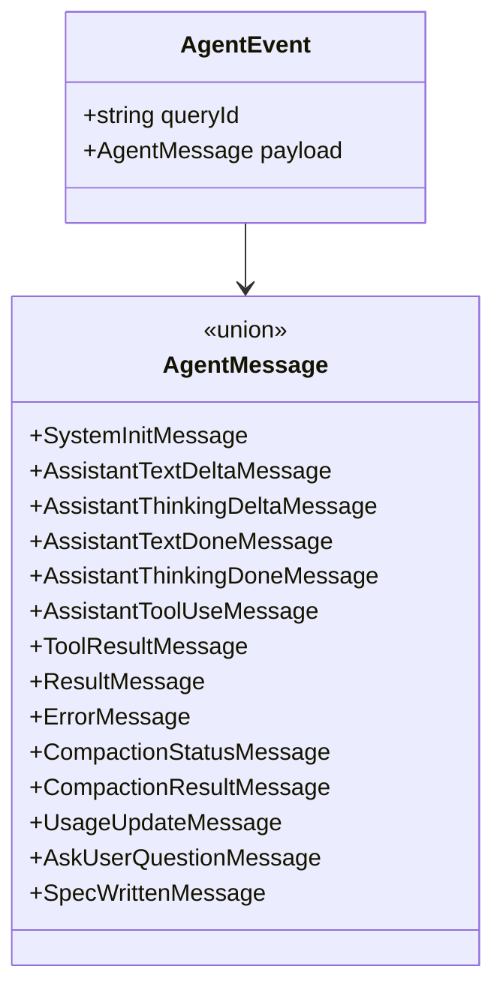

**图表来源**
- [protocol.ts:85-107](file://sidecar/src/protocol.ts#L85-L107)

**章节来源**
- [protocol.ts:1-252](file://sidecar/src/protocol.ts#L1-L252)

### 4. Rust 集成层 (sidecar.rs)

Rust 层负责进程管理和环境隔离：

#### 4.1 进程生命周期管理

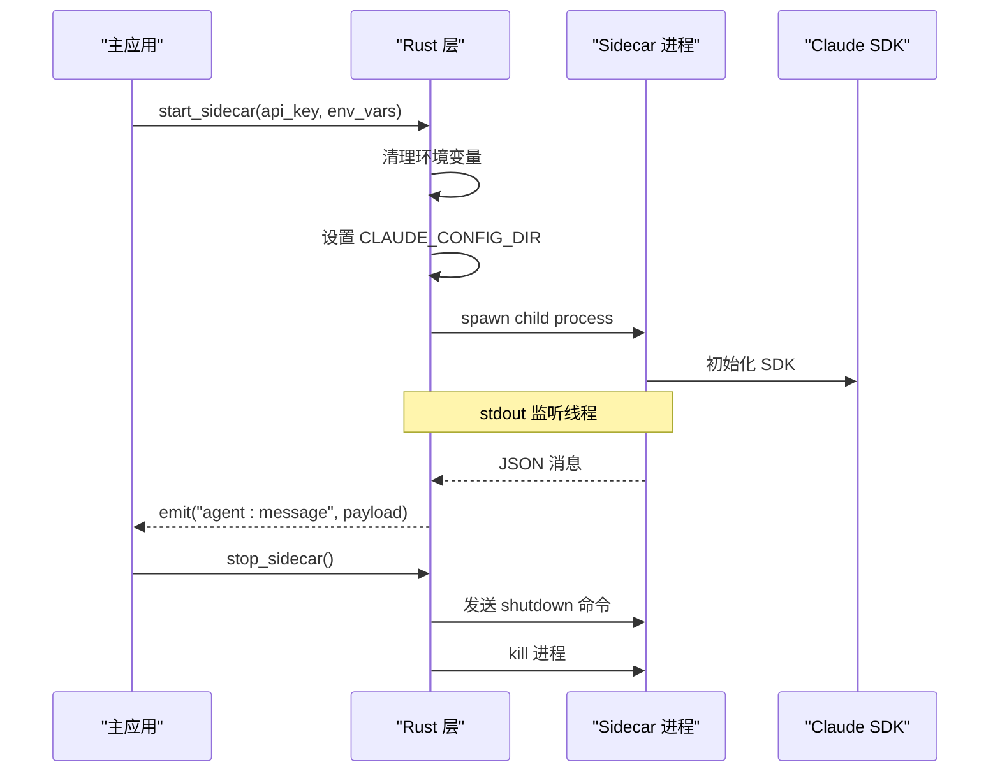

**图表来源**
- [sidecar.rs:60-214](file://src-tauri/src/sidecar.rs#L60-L214)

#### 4.2 环境隔离机制

Rust 层实施了多层环境隔离：

1. **全局变量清理**：移除所有 ANTHROPIC_* 环境变量
2. **配置目录隔离**：重定向 CLAUDE_CONFIG_DIR 到应用专用目录
3. **进程隔离**：独立的子进程，无文件系统共享
4. **网络隔离**：通过 SDK 的安全限制

#### 4.3 开发模式与生产模式切换

**更新** Sidecar 现在支持两种运行模式：

**开发模式**：
- 使用 npx tsx 直接运行 TypeScript 源码
- 无需预编译步骤，实现热重载开发
- 支持实时调试 TypeScript 源码

**生产模式**：
- 使用内置 Node.js 运行预编译的 sidecar-bundle.js
- 通过资源目录部署，确保跨平台兼容性

**章节来源**
- [sidecar.rs:1-348](file://src-tauri/src/sidecar.rs#L1-L348)

## 依赖关系分析

### 1. 外部依赖

```mermaid
graph LR
subgraph "Sidecar 应用"
A[TypeScript Runtime]
B[Claude Agent SDK]
C[Zod]
D[npx tsx (开发模式)]
end
subgraph "主应用"
E[Rust Runtime]
F[Tauri Framework]
G[Node.js Runtime]
end
subgraph "系统依赖"
H[操作系统进程管理]
I[文件系统权限]
J[网络访问控制]
end
A --> B
A --> C
E --> F
E --> G
F --> H
G --> I
H --> J
D --> A
```

**图表来源**
- [package.json:12-20](file://sidecar/package.json#L12-L20)
- [Cargo.toml:20-39](file://src-tauri/Cargo.toml#L20-L39)

### 2. 内部模块依赖

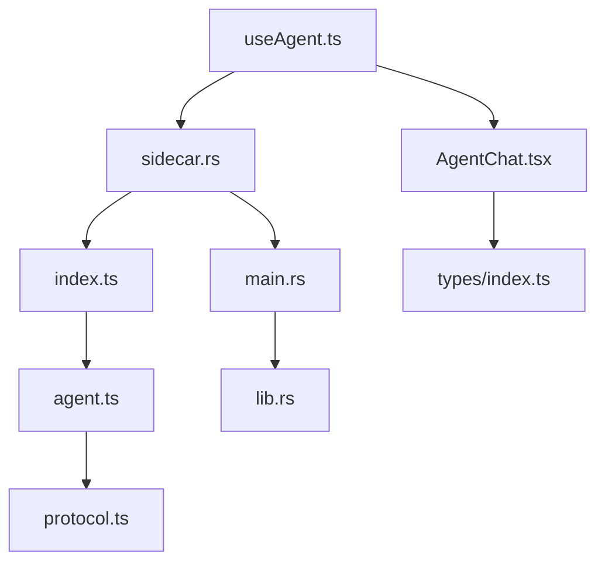

**图表来源**
- [index.ts:9-18](file://sidecar/src/index.ts#L9-L18)
- [sidecar.rs:1-4](file://src-tauri/src/sidecar.rs#L1-L4)

**章节来源**
- [package.json:1-25](file://sidecar/package.json#L1-L25)
- [Cargo.toml:1-40](file://src-tauri/Cargo.toml#L1-L40)

## 开发模式配置

### 1. 开发模式启动机制

**更新** Sidecar 现在支持直接TypeScript执行模式，显著改善开发体验：

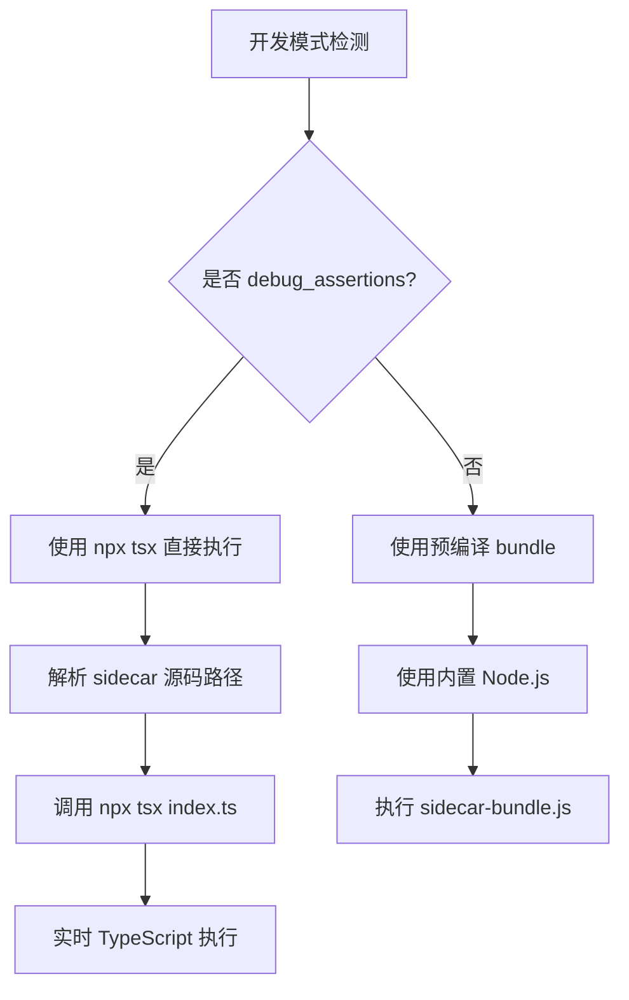

**图表来源**
- [sidecar.rs:288-347](file://src-tauri/src/sidecar.rs#L288-L347)

### 2. TypeScript 编译配置

Sidecar 使用 TypeScript 编译器配置确保最佳开发体验：

**编译选项特点**：
- **目标版本**：ES2022，支持现代 JavaScript 特性
- **模块系统**：Node16，与 Node.js 模块解析兼容
- **严格模式**：开启类型检查，提高代码质量
- **声明文件**：生成 .d.ts 文件，支持 IDE 智能提示

**章节来源**
- [tsconfig.json:1-18](file://sidecar/tsconfig.json#L1-L18)
- [sidecar.rs:288-347](file://src-tauri/src/sidecar.rs#L288-L347)

### 3. 资源准备脚本

**更新** 资源准备脚本现在支持两种模式：

```mermaid
flowchart TD
A[setup-resources.mjs] --> B{是否 --no-bundle?}
B --> |否| C[执行 esbuild bundle]
B --> |是| D[跳过 bundle 步骤]
C --> E[复制 bundle 到资源目录]
D --> E
E --> F[复制原生二进制到资源目录]
F --> G[确保 package.json (type: module)]
G --> H[验证资源完整性]
```

**图表来源**
- [setup-resources.mjs:105-133](file://sidecar/scripts/setup-resources.mjs#L105-L133)

**章节来源**
- [setup-resources.mjs:1-153](file://sidecar/scripts/setup-resources.mjs#L1-L153)

## 性能考虑

### 1. 资源管理

Sidecar 实施了多层次的资源管理策略：

#### 1.1 内存管理
- **活跃查询跟踪**：使用 Map 管理所有活跃查询
- **定时器清理**：自动清理超时的等待请求
- **内存泄漏防护**：查询完成后及时释放资源

#### 1.2 CPU 优化
- **并发处理**：多个查询可以同时进行
- **流式处理**：避免大块数据一次性处理
- **智能缓存**：利用 Claude SDK 的缓存机制

#### 1.3 I/O 优化
- **缓冲读取**：使用 BufReader 提高读取效率
- **批量写入**：减少系统调用次数
- **异步处理**：非阻塞的事件处理

### 2. 性能监控指标

Sidecar 提供了丰富的性能监控能力：

| 指标类型 | 描述 | 更新频率 |
|---------|------|----------|
| Token 使用量 | 输入/输出 token 统计 | 每个 turn 结束时 |
| 查询耗时 | 整个查询的执行时间 | 查询结束时 |
| Turn 数量 | 交互轮次统计 | 查询结束时 |
| 成本估算 | API 调用成本计算 | 查询结束时 |
| 思考时间 | Claude 深度思考时长 | 思考结束时 |

**章节来源**
- [agent.ts:414-433](file://sidecar/src/agent.ts#L414-L433)
- [agent.ts:150-162](file://sidecar/src/agent.ts#L150-L162)

## 故障排除指南

### 1. 常见问题诊断

#### 1.1 进程启动失败

**症状**：start_sidecar 返回失败

**可能原因**：
- Node.js 环境缺失
- 资源文件未正确打包
- 权限不足

**解决方案**：
1. 检查 Node.js 可执行文件是否存在
2. 验证 sidecar-bundle.js 是否正确复制
3. 确认文件权限设置

#### 1.2 TypeScript 执行问题

**症状**：开发模式下 npx tsx 执行失败

**可能原因**：
- tsx 依赖未安装
- TypeScript 源码语法错误
- Node.js 版本不兼容

**解决方案**：
1. 确认已安装 npx 和 tsx
2. 检查 TypeScript 源码语法
3. 验证 Node.js 版本兼容性

#### 1.3 查询超时

**症状**：查询长时间无响应

**可能原因**：
- 网络连接问题
- API 速率限制
- Claude 服务异常

**解决方案**：
1. 检查网络连接状态
2. 验证 API 密钥有效性
3. 查看 Claude 服务状态

#### 1.4 工具调用失败

**症状**：AskUserQuestion 等工具调用超时

**可能原因**：
- 前端未及时响应
- 请求 ID 错误
- 超时时间不足

**解决方案**：
1. 确认前端正确处理工具调用
2. 检查 requestId 的一致性
3. 调整超时时间设置

### 2. 调试技巧

#### 2.1 日志分析

Sidecar 提供了多层级的日志输出：

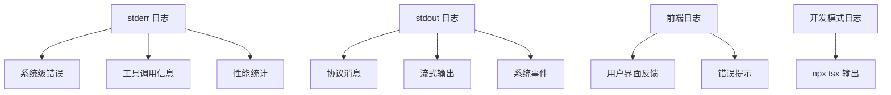

**图表来源**
- [index.ts:20-22](file://sidecar/src/index.ts#L20-L22)
- [sidecar.rs:200-208](file://src-tauri/src/sidecar.rs#L200-L208)

#### 2.2 状态监控

建议使用以下方法监控 Sidecar 状态：

1. **进程状态检查**：定期调用 get_sidecar_status
2. **查询 Watchdog**：为每个查询设置超时监控
3. **资源使用监控**：跟踪内存和 CPU 使用情况
4. **网络连接监控**：验证 API 连接状态

**章节来源**
- [useAgent.ts:66-101](file://src/hooks/useAgent.ts#L66-L101)
- [sidecar.rs:272-279](file://src-tauri/src/sidecar.rs#L272-L279)

## 结论

RabbitCoding Sidecar 进程是一个设计精良的独立服务，通过以下关键特性确保了系统的稳定性和安全性：

### 核心优势

1. **安全隔离**：通过进程和配置目录隔离，有效防止全局配置污染
2. **流式处理**：支持 Claude 的深度思考和文本流式输出，提供优秀的用户体验
3. **工具集成**：灵活的工具调用机制，支持用户交互和外部系统集成
4. **资源控制**：通过预算限制和超时机制，有效防止资源滥用
5. **错误处理**：完善的异常处理和恢复机制，提高系统可靠性
6. **开发友好**：支持直接TypeScript执行，显著改善开发调试体验

### 技术亮点

- **多层架构**：清晰的职责分离和模块化设计
- **异步处理**：非阻塞的事件驱动架构
- **协议标准化**：基于 JSON-lines 的标准化通信协议
- **环境隔离**：多维度的安全隔离机制
- **性能优化**：针对流式处理的专门优化
- **开发模式**：支持 npx tsx 直接执行 TypeScript 源码

### 未来改进方向

1. **监控增强**：添加更详细的性能指标和监控告警
2. **配置管理**：提供更灵活的配置选项和热重载
3. **错误恢复**：增强自动恢复和故障转移能力
4. **扩展性**：支持更多的工具和插件集成
5. **安全性**：进一步强化安全隔离和访问控制
6. **开发体验**：继续优化 TypeScript 开发工作流

**更新** Sidecar 进程现已支持直接TypeScript执行模式，开发者可以在开发过程中享受真正的热重载体验，无需预编译步骤即可实时调试代码变更。这种改进显著提升了开发效率，简化了开发流程，同时保持了生产环境的稳定性和可靠性。

Sidecar 进程作为 RabbitCoding 的核心组件，为整个系统的稳定运行和良好用户体验提供了坚实的基础。