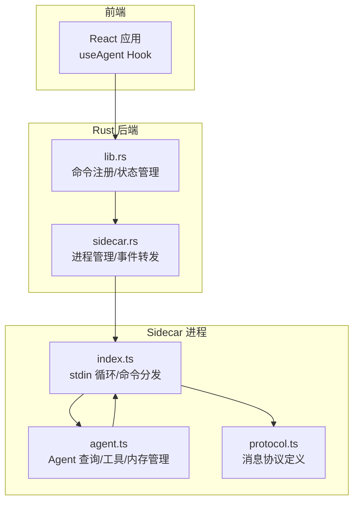
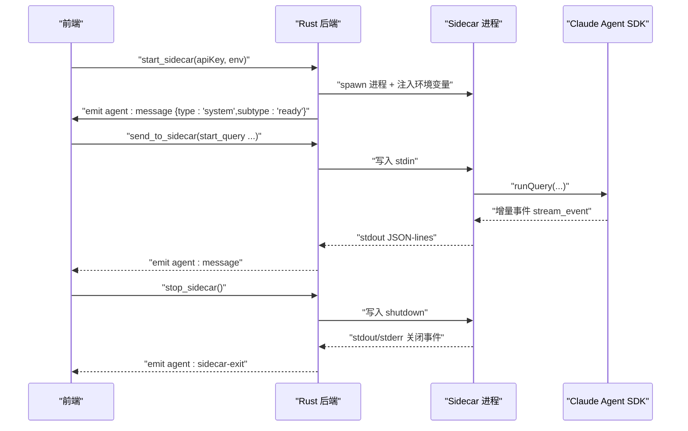
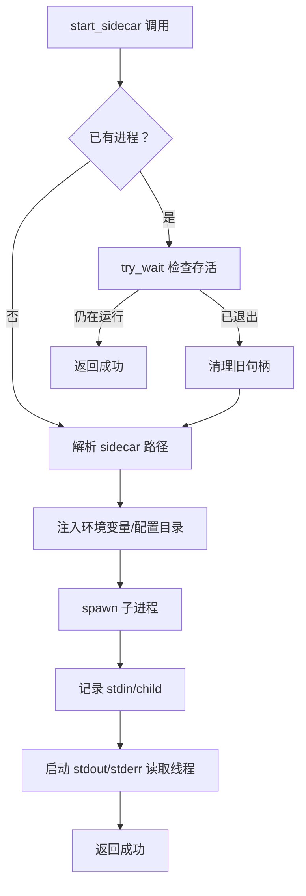
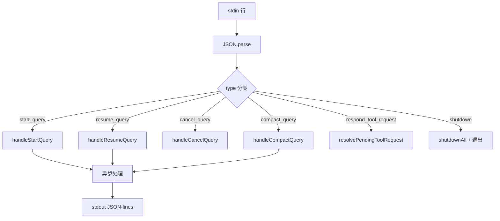
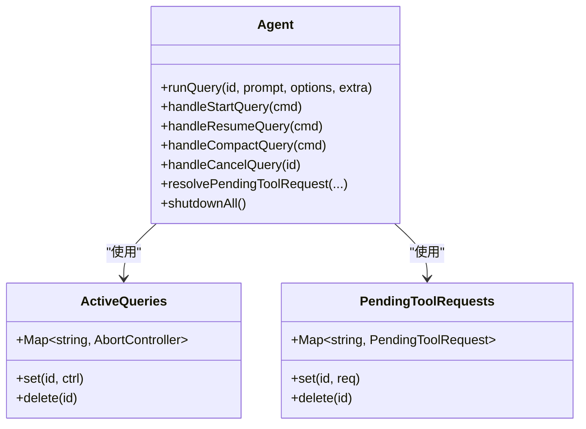
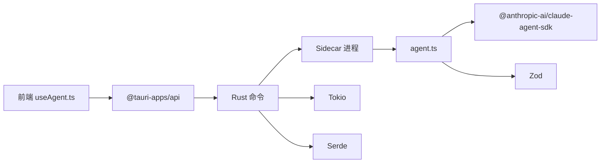

# 进程生命周期管理

<cite>
**本文引用的文件列表**
- [sidecar/src/index.ts](file://sidecar/src/index.ts)
- [sidecar/src/agent.ts](file://sidecar/src/agent.ts)
- [sidecar/src/protocol.ts](file://sidecar/src/protocol.ts)
- [src-tauri/src/sidecar.rs](file://src-tauri/src/sidecar.rs)
- [src-tauri/src/lib.rs](file://src-tauri/src/lib.rs)
- [src-tauri/src/main.rs](file://src-tauri/src/main.rs)
- [sidecar/scripts/setup-resources.mjs](file://sidecar/scripts/setup-resources.mjs)
- [sidecar/package.json](file://sidecar/package.json)
- [src/hooks/useAgent.ts](file://src/hooks/useAgent.ts)
</cite>

## 目录
1. [简介](#简介)
2. [项目结构](#项目结构)
3. [核心组件](#核心组件)
4. [架构总览](#架构总览)
5. [详细组件分析](#详细组件分析)
6. [依赖关系分析](#依赖关系分析)
7. [性能考量](#性能考量)
8. [故障排查指南](#故障排查指南)
9. [结论](#结论)

## 简介
本文面向 Sidecar 进程生命周期管理，系统性阐述其启动流程、初始化步骤、资源分配机制、运行时状态管理、并发查询处理、内存管理策略、优雅关闭流程、资源清理机制、异常终止处理、监控指标与健康检查、自动重启策略，以及调试与性能监控方法。目标读者包括开发者、运维工程师与高级用户。

## 项目结构
该项目采用“前端（React + Tauri）+ Rust 后端 + Sidecar（Node.js）”三层架构：
- 前端通过 Tauri 命令与事件与 Rust 后端交互，Rust 后端负责启动/停止/监控 Sidecar 进程，并转发 Sidecar 的 stdout/stderr。
- Sidecar 通过 stdin 接收前端指令，通过 stdout 输出 JSON-lines 事件，stderr 输出日志。
- 资源准备脚本负责将 Sidecar 打包与平台原生二进制复制到 Tauri 资源目录，确保生产模式可用。

图表来源
- [src-tauri/src/lib.rs:343-387](file://src-tauri/src/lib.rs#L343-L387)
- [src-tauri/src/sidecar.rs:60-214](file://src-tauri/src/sidecar.rs#L60-L214)
- [sidecar/src/index.ts:96-128](file://sidecar/src/index.ts#L96-L128)
- [sidecar/src/agent.ts:241-465](file://sidecar/src/agent.ts#L241-L465)
- [sidecar/src/protocol.ts:13-78](file://sidecar/src/protocol.ts#L13-L78)

章节来源
- [src-tauri/src/lib.rs:197-390](file://src-tauri/src/lib.rs#L197-L390)
- [src-tauri/src/sidecar.rs:1-359](file://src-tauri/src/sidecar.rs#L1-L359)
- [sidecar/src/index.ts:1-145](file://sidecar/src/index.ts#L1-L145)
- [sidecar/src/agent.ts:1-606](file://sidecar/src/agent.ts#L1-L606)
- [sidecar/src/protocol.ts:1-252](file://sidecar/src/protocol.ts#L1-L252)

## 核心组件
- Sidecar 进程管理器（Rust）：负责启动/停止/状态查询、stdin/stdout/stderr 管道、事件转发、环境变量注入、资源路径隔离。
- Sidecar 主程序（Node.js）：基于 readline 的 JSON-lines 命令循环，分发 start/resume/cancel/compact/shutdown 等命令，异步并发处理查询，流式输出事件。
- Agent 封装（Node.js）：封装 Claude Agent SDK，将 SDK 的增量事件转换为 JSON-lines，管理活跃查询、AskUserQuestion 请求、内存与定时器清理。
- 协议层（TypeScript）：定义前后端通信的消息结构，涵盖查询、工具、结果、错误、压缩、用量等。
- 前端 Hook（React）：封装 Tauri 命令与事件监听，提供查询看门狗、状态机、自动重启策略等。

章节来源
- [src-tauri/src/sidecar.rs:6-57](file://src-tauri/src/sidecar.rs#L6-L57)
- [sidecar/src/index.ts:37-91](file://sidecar/src/index.ts#L37-L91)
- [sidecar/src/agent.ts:47-63](file://sidecar/src/agent.ts#L47-L63)
- [sidecar/src/protocol.ts:13-78](file://sidecar/src/protocol.ts#L13-L78)
- [src/hooks/useAgent.ts:53-151](file://src/hooks/useAgent.ts#L53-L151)

## 架构总览
Sidecar 生命周期贯穿“启动 → 就绪 → 运行 → 关闭/重启”的完整闭环。Rust 后端负责进程生命周期与事件桥接，Node.js Sidecar 负责业务逻辑与并发查询处理。

图表来源
- [src-tauri/src/sidecar.rs:60-214](file://src-tauri/src/sidecar.rs#L60-L214)
- [sidecar/src/index.ts:96-128](file://sidecar/src/index.ts#L96-L128)
- [sidecar/src/agent.ts:241-465](file://sidecar/src/agent.ts#L241-L465)

## 详细组件分析

### Sidecar 进程管理（Rust）
- 进程状态：使用互斥锁保护 SidecarHandle（stdin、child），支持“检查存活 → 清理旧句柄 → 重新启动”的幂等启动。
- 环境隔离：启动前移除 ANTHROPIC_* 环境变量，注入 CLAUDE_CONFIG_DIR 指向应用专用目录，确保与系统全局配置隔离。
- 资源注入：根据构建模式选择 dev（npx tsx）或 prod（内置 Node.js + sidecar-bundle.js），并复制原生二进制到资源目录。
- 事件桥接：启动 stdout/stderr 读取线程，将 stdout 行事件通过 Tauri 事件转发给前端，stderr 输出到控制台。
- 命令接口：start_sidecar/send_to_sidecar/stop_sidecar/get_sidecar_status。

图表来源
- [src-tauri/src/sidecar.rs:60-214](file://src-tauri/src/sidecar.rs#L60-L214)

章节来源
- [src-tauri/src/sidecar.rs:6-57](file://src-tauri/src/sidecar.rs#L6-L57)
- [src-tauri/src/sidecar.rs:281-359](file://src-tauri/src/sidecar.rs#L281-L359)

### Sidecar 主程序（Node.js）
- 命令循环：基于 readline 逐行读取 stdin JSON，解析为 InboundMessage，分发到对应处理器。
- 并发处理：start/resume/compact 查询不 await，允许多查询并发；错误通过 sendError 返回。
- 就绪信号：启动后发送 system/ready 事件，前端据此标记就绪。
- 异常处理：未捕获异常与未处理拒绝统一记录并上报。

图表来源
- [sidecar/src/index.ts:37-91](file://sidecar/src/index.ts#L37-L91)
- [sidecar/src/index.ts:96-128](file://sidecar/src/index.ts#L96-L128)

章节来源
- [sidecar/src/index.ts:1-145](file://sidecar/src/index.ts#L1-L145)

### Agent 查询与工具管理（Node.js）
- 查询生命周期：runQuery 统一调度，包含 AbortController 管理、AskUserQuestion 请求队列、WriteSpec MCP 工具、会话压缩、Token 用量统计。
- 并发与内存：activeQueries Map 保存 AbortController，pendingToolRequests Map 保存用户问答请求，定时器与 Set 用于超时与去重。
- 事件映射：将 SDK 的 stream_event/assistant/result 等消息映射为 JSON-lines 事件，便于前端增量渲染。
- 优雅取消：handleCancelQuery 清理 pending 请求并 abort 对应查询；shutdownAll 统一 abort。

图表来源
- [sidecar/src/agent.ts:47-63](file://sidecar/src/agent.ts#L47-L63)
- [sidecar/src/agent.ts:241-465](file://sidecar/src/agent.ts#L241-L465)

章节来源
- [sidecar/src/agent.ts:1-606](file://sidecar/src/agent.ts#L1-L606)

### 协议与消息流（TypeScript）
- 前端 → Sidecar：start_query/resume_query/cancel_query/compact_query/respond_tool_request/shutdown。
- Sidecar → 前端：system/init、assistant/text_delta/thinking_delta/text_done/thinking_done/tool_use/tool_result/result/error/compaction/usage_update/ask_user_question/spec_written。
- 类型安全：通过 Zod/联合类型约束消息结构，保障跨进程通信一致性。

章节来源
- [sidecar/src/protocol.ts:13-78](file://sidecar/src/protocol.ts#L13-L78)
- [sidecar/src/protocol.ts:91-252](file://sidecar/src/protocol.ts#L91-L252)

### 前端 Hook 与状态机（React）
- 状态机：stopped/starting/running/error，通过 Tauri 命令与事件驱动。
- 查询看门狗：每条 query 独立计时，收到任意消息重置；正常态 10 分钟，思考态 30 分钟，避免误判。
- 自动重启：当代理配置变化导致 sidecar 运行环境不一致时，先 stop 再重新 start。

章节来源
- [src/hooks/useAgent.ts:53-151](file://src/hooks/useAgent.ts#L53-L151)
- [src/hooks/useAgent.ts:155-200](file://src/hooks/useAgent.ts#L155-L200)

## 依赖关系分析
- Rust 后端依赖 Tauri 生态（命令、事件、状态插件）、Tokio（异步运行时）、serde（序列化）。
- Sidecar 依赖 @anthropic-ai/claude-agent-sdk 与 Zod，生产模式下通过 esbuild 打包为 sidecar-bundle.js，并复制原生二进制。
- 前端通过 @tauri-apps/api 调用命令与监听事件，useAgent Hook 封装生命周期与错误处理。

图表来源
- [src/hooks/useAgent.ts:8-17](file://src/hooks/useAgent.ts#L8-L17)
- [src-tauri/src/lib.rs:343-387](file://src-tauri/src/lib.rs#L343-L387)
- [src-tauri/src/sidecar.rs:1-359](file://src-tauri/src/sidecar.rs#L1-L359)
- [sidecar/src/agent.ts:12-18](file://sidecar/src/agent.ts#L12-L18)
- [sidecar/package.json:12-20](file://sidecar/package.json#L12-L20)

章节来源
- [src-tauri/Cargo.toml:20-37](file://src-tauri/Cargo.toml#L20-L37)
- [sidecar/package.json:1-25](file://sidecar/package.json#L1-L25)

## 性能考量
- 并发查询：Node.js Sidecar 对 start/resume/compact 查询不 await，允许并发处理，提升吞吐。
- 流式增量：将 SDK 的增量事件映射为 text_delta/thinking_delta，前端可即时渲染，降低首帧延迟。
- 内存与定时器：使用 Map/Set 管理活跃查询与 pending 请求，及时清理避免内存泄漏。
- I/O 优化：Rust 后端使用 BufReader 读取 stdout/stderr，减少系统调用次数。
- 资源隔离：生产模式下注入 CLAUDE_CONFIG_DIR 与内置 Node.js，避免外部环境干扰，稳定性能表现。

章节来源
- [sidecar/src/index.ts:41-46](file://sidecar/src/index.ts#L41-L46)
- [sidecar/src/agent.ts:47-63](file://sidecar/src/agent.ts#L47-L63)
- [sidecar/src/agent.ts:146-199](file://sidecar/src/agent.ts#L146-L199)
- [src-tauri/src/sidecar.rs:175-208](file://src-tauri/src/sidecar.rs#L175-L208)

## 故障排查指南

### 启动阶段
- 症状：start_sidecar 返回失败或前端状态停留在 starting。
- 排查要点：
  - 检查 ANTHROPIC_* 环境变量是否被正确移除与注入。
  - 确认 sidecar-bundle.js 与原生二进制已复制到资源目录。
  - 查看 stderr 日志（Rust 后端打印）定位具体错误。
- 相关实现参考：
  - [src-tauri/src/sidecar.rs:96-149](file://src-tauri/src/sidecar.rs#L96-L149)
  - [sidecar/scripts/setup-resources.mjs:33-103](file://sidecar/scripts/setup-resources.mjs#L33-L103)

### 运行阶段
- 症状：查询长时间无响应。
- 排查要点：
  - 前端看门狗：检查是否处于思考态（更长超时），确认是否收到 thinking_done 或 text_done。
  - Sidecar 日志：查看 stderr 是否出现异常或阻塞。
  - 代理配置：若代理变更，需重启 sidecar。
- 相关实现参考：
  - [src/hooks/useAgent.ts:66-95](file://src/hooks/useAgent.ts#L66-L95)
  - [src/hooks/useAgent.ts:141-151](file://src/hooks/useAgent.ts#L141-L151)

### 关闭与重启
- 症状：stop_sidecar 后前端仍显示 running。
- 排查要点：
  - Rust 后端会先发送 shutdown 命令，再强制 kill，确认 sidecar 是否正确处理 shutdown。
  - 检查 agent:sidecar-exit 事件是否触发。
- 相关实现参考：
  - [src-tauri/src/sidecar.rs:245-270](file://src-tauri/src/sidecar.rs#L245-L270)
  - [sidecar/src/index.ts:80-85](file://sidecar/src/index.ts#L80-L85)

### 资源与打包
- 症状：生产模式找不到 sidecar-bundle.js 或原生二进制。
- 排查要点：
  - 运行 setup-resources.mjs，确保 dist 与原生二进制复制到 src-tauri/resources/sidecar。
  - 确认 package.json（type: module）存在，避免 ES Module 解析失败。
- 相关实现参考：
  - [sidecar/scripts/setup-resources.mjs:105-147](file://sidecar/scripts/setup-resources.mjs#L105-L147)
  - [sidecar/package.json:1-25](file://sidecar/package.json#L1-L25)

## 结论
该 Sidecar 生命周期管理方案通过 Rust 后端与 Node.js Sidecar 的分工协作，实现了稳定的进程生命周期控制、健壮的并发查询处理、清晰的事件流与完善的异常处理。结合前端看门狗与自动重启策略，能够在复杂环境下保持高可用与良好用户体验。建议在生产环境中严格遵循资源准备流程与环境隔离策略，以获得最佳稳定性与性能。