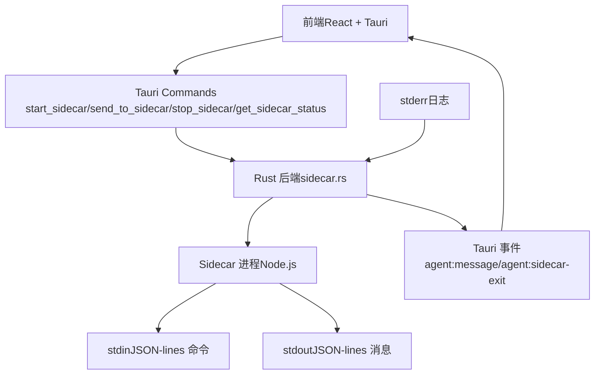
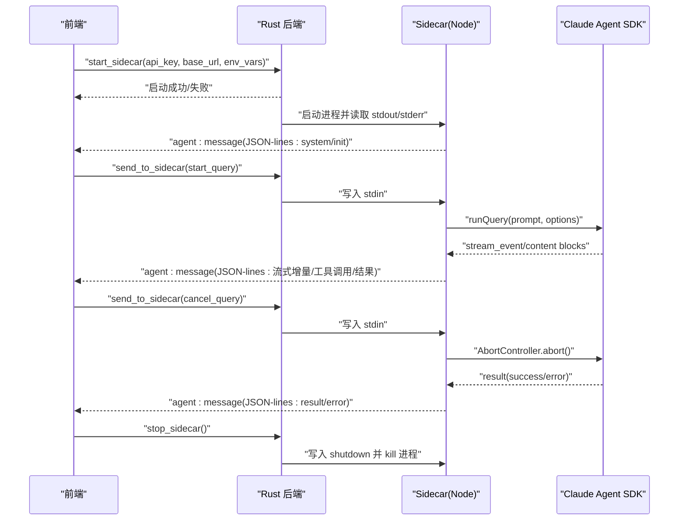
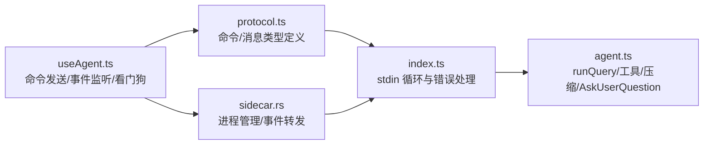

# 通信协议

<cite>
**本文引用的文件**
- [protocol.ts](file://sidecar/src/protocol.ts)
- [index.ts](file://sidecar/src/index.ts)
- [agent.ts](file://sidecar/src/agent.ts)
- [sidecar.rs](file://src-tauri/src/sidecar.rs)
- [useAgent.ts](file://src/hooks/useAgent.ts)
- [index.ts（类型定义）](file://src/types/index.ts)
</cite>

## 目录
1. [简介](#简介)
2. [项目结构](#项目结构)
3. [核心组件](#核心组件)
4. [架构总览](#架构总览)
5. [详细组件分析](#详细组件分析)
6. [依赖关系分析](#依赖关系分析)
7. [性能考量](#性能考量)
8. [故障排查指南](#故障排查指南)
9. [结论](#结论)
10. [附录](#附录)

## 简介
本文件为 Sidecar 通信协议的详细 API 文档，聚焦于 JSON-lines 协议的消息格式、字段定义、数据类型与交互流程。协议采用“前端通过 Tauri Commands 写入 Sidecar stdin，Sidecar 通过 stdout 输出 JSON-lines 消息”的双向通道，Rust 后端负责启动/管理 Sidecar 进程并将 stdout 逐行转发为 Tauri 事件，前端通过事件监听消费消息并驱动 UI。

协议支持以下命令类型：
- start_query：启动新查询
- resume_query：恢复已有会话
- cancel_query：取消当前查询
- compact_query：手动触发会话压缩
- respond_tool_request：响应 AskUserQuestion 提问
- shutdown：关闭 Sidecar

同时，协议定义了丰富的消息类型用于流式输出，包括系统初始化、流式文本/思考增量、工具调用、工具结果、最终结果、错误、会话压缩状态/结果、Token 用量更新、AskUserQuestion 提问以及 Spec 写入完成等。

## 项目结构
- 前端（React + Tauri）通过 useAgent Hook 与 Sidecar 交互，使用 Tauri Commands 发送命令，使用事件监听接收消息。
- Rust 后端负责启动 Sidecar 进程，读取其 stdout/stderr 并通过 Tauri 事件转发到前端。
- Sidecar（Node.js）通过 stdin 读取命令，通过 stdout 以 JSON-lines 输出消息，stderr 输出日志。

图表来源
- [sidecar.rs:59-214](file://src-tauri/src/sidecar.rs#L59-L214)
- [index.ts:96-128](file://sidecar/src/index.ts#L96-L128)
- [useAgent.ts:106-151](file://src/hooks/useAgent.ts#L106-L151)

章节来源
- [sidecar.rs:59-214](file://src-tauri/src/sidecar.rs#L59-L214)
- [index.ts:96-128](file://sidecar/src/index.ts#L96-L128)
- [useAgent.ts:106-151](file://src/hooks/useAgent.ts#L106-L151)

## 核心组件
- 协议类型定义：定义了所有命令与消息的接口、字段与数据类型，确保前后端一致。
- Sidecar 入口：负责读取 stdin 命令、分发处理、输出 stdout 消息、记录 stderr 日志。
- Agent 封装：封装 Claude Agent SDK，将 SDK 的异步生成器转换为 JSON-lines 流式消息。
- Rust 后端：启动/管理 Sidecar 进程，读取 stdout/stderr 并转发为 Tauri 事件。
- 前端 Hook：封装命令发送、事件监听、看门狗超时控制、UI 状态更新。

章节来源
- [protocol.ts:14-59](file://sidecar/src/protocol.ts#L14-L59)
- [index.ts:37-91](file://sidecar/src/index.ts#L37-L91)
- [agent.ts:470-497](file://sidecar/src/agent.ts#L470-L497)
- [sidecar.rs:61-214](file://src-tauri/src/sidecar.rs#L61-L214)
- [useAgent.ts:156-256](file://src/hooks/useAgent.ts#L156-L256)

## 架构总览
下面的序列图展示了典型查询生命周期：启动 Sidecar、发送 start_query、接收系统初始化、流式消息、最终结果或错误、取消查询、关闭 Sidecar。

图表来源
- [useAgent.ts:106-151](file://src/hooks/useAgent.ts#L106-L151)
- [sidecar.rs:61-214](file://src-tauri/src/sidecar.rs#L61-L214)
- [index.ts:37-91](file://sidecar/src/index.ts#L37-L91)
- [agent.ts:470-497](file://sidecar/src/agent.ts#L470-L497)

## 详细组件分析

### JSON-lines 协议消息格式与字段定义
- 消息包装：每行 JSON 对象，包含 queryId 与 payload 两部分，payload 为具体消息类型。
- 命令类型（前端 → Sidecar）：
  - start_query：启动新查询，包含 id、prompt、cwd、options。
  - resume_query：恢复会话，包含 id、sessionId、prompt、cwd、options。
  - cancel_query：取消查询，包含 id。
  - compact_query：手动触发压缩，包含 id、sessionId、cwd、options。
  - respond_tool_request：响应 AskUserQuestion，包含 requestId、answers、response、cancelled。
  - shutdown：关闭 Sidecar。
- 消息类型（Sidecar → 前端）：
  - system/init：系统初始化，包含 sessionId。
  - assistant/text/thinking：完整文本/思考消息。
  - assistant/text_delta/thinking_delta：流式增量。
  - assistant/text_done/thinking_done：流式结束信号。
  - assistant/tool_use：工具调用。
  - tool_result：工具执行结果。
  - result/success/error：最终结果。
  - error：错误消息。
  - compaction/compaction_result：会话压缩状态与结果。
  - usage_update：实时 Token 用量更新。
  - ask_user_question：AskUserQuestion 提问。
  - spec_written：WriteSpec 工具写入完成。

章节来源
- [protocol.ts:84-251](file://sidecar/src/protocol.ts#L84-L251)
- [index.ts:24-32](file://sidecar/src/index.ts#L24-L32)
- [agent.ts:320-438](file://sidecar/src/agent.ts#L320-L438)

### 命令类型详解

#### start_query
- 作用：启动新的 Agent 查询。
- 关键字段：
  - id：查询唯一标识。
  - prompt：用户输入提示词。
  - cwd：工作目录。
  - options：查询选项（模型、允许工具、权限模式、最大轮次、预算、是否启用 spec 等）。
- 处理流程：Sidecar 接收后异步运行查询，流式输出消息，最终输出 result 或 error。

章节来源
- [protocol.ts:14-20](file://sidecar/src/protocol.ts#L14-L20)
- [index.ts:39-45](file://sidecar/src/index.ts#L39-L45)
- [agent.ts:470-475](file://sidecar/src/agent.ts#L470-L475)

#### resume_query
- 作用：基于已有 sessionId 恢复会话。
- 关键字段：id、sessionId、prompt、cwd、options。
- 处理流程：通过 resume 选项恢复会话上下文，继续流式输出。

章节来源
- [protocol.ts:23-29](file://sidecar/src/protocol.ts#L23-L29)
- [index.ts:48-54](file://sidecar/src/index.ts#L48-L54)
- [agent.ts:480-485](file://sidecar/src/agent.ts#L480-L485)

#### cancel_query
- 作用：取消指定 id 的查询。
- 关键字段：id。
- 处理流程：查找对应 AbortController 并 abort，清理 pending tool requests；返回成功。

章节来源
- [protocol.ts:33-36](file://sidecar/src/protocol.ts#L33-L36)
- [index.ts:56-59](file://sidecar/src/index.ts#L56-L59)
- [agent.ts:578-595](file://sidecar/src/agent.ts#L578-L595)

#### compact_query
- 作用：手动触发会话压缩。
- 关键字段：id、sessionId、cwd、options。
- 处理流程：以 /compact prompt 恢复会话，SDK 触发压缩；输出压缩状态与结果。

章节来源
- [protocol.ts:44-50](file://sidecar/src/protocol.ts#L44-L50)
- [index.ts:61-67](file://sidecar/src/index.ts#L61-L67)
- [agent.ts:491-497](file://sidecar/src/agent.ts#L491-L497)

#### respond_tool_request
- 作用：响应 AskUserQuestion 提问。
- 关键字段：requestId、answers、response、cancelled。
- 处理流程：根据 requestId 解锁等待的工具调用，将答案与可选 response 传递给 SDK。

章节来源
- [protocol.ts:53-59](file://sidecar/src/protocol.ts#L53-L59)
- [index.ts:69-77](file://sidecar/src/index.ts#L69-L77)
- [agent.ts:548-573](file://sidecar/src/agent.ts#L548-L573)

#### shutdown
- 作用：优雅关闭 Sidecar。
- 处理流程：Rust 后端先写入 shutdown 命令，等待一段时间后强制 kill 进程。

章节来源
- [protocol.ts:39-41](file://sidecar/src/protocol.ts#L39-L41)
- [index.ts:80-85](file://sidecar/src/index.ts#L80-L85)
- [sidecar.rs:246-270](file://src-tauri/src/sidecar.rs#L246-L270)

### 消息类型详解

#### 系统消息
- system/init：查询初始化，携带 sessionId。
- system/ready：Sidecar 就绪信号（启动后发送）。

章节来源
- [protocol.ts:110-114](file://sidecar/src/protocol.ts#L110-L114)
- [index.ts:125-127](file://sidecar/src/index.ts#L125-L127)

#### 流式消息
- assistant/text_delta/thinking_delta：流式增量。
- assistant/text_done/thinking_done：流式结束信号。
- assistant/text/thinking：完整文本/思考消息。
- assistant/tool_use：工具调用（含 toolUseId、toolName、toolInput）。
- tool_result：工具结果（含 toolUseId、output、isError）。

章节来源
- [protocol.ts:117-173](file://sidecar/src/protocol.ts#L117-L173)
- [agent.ts:146-199](file://sidecar/src/agent.ts#L146-L199)
- [agent.ts:205-236](file://sidecar/src/agent.ts#L205-L236)

#### 最终结果与错误
- result/success/error：最终结果，包含 subtype、result、totalCostUsd、durationMs、error、numTurns、usage。
- error：错误消息，包含 queryId 与 message。

章节来源
- [protocol.ts:184-200](file://sidecar/src/protocol.ts#L184-L200)
- [index.ts:29-32](file://sidecar/src/index.ts#L29-L32)
- [agent.ts:391-438](file://sidecar/src/agent.ts#L391-L438)

#### 会话压缩
- compaction/compaction_result：压缩状态与结果，包含 phase、error、trigger、preTokens、postTokens、durationMs。

章节来源
- [protocol.ts:203-222](file://sidecar/src/protocol.ts#L203-L222)
- [agent.ts:334-356](file://sidecar/src/agent.ts#L334-L356)

#### Token 用量更新
- usage_update：实时 Token 用量更新，包含 inputTokens、outputTokens、cacheCreationInputTokens、cacheReadInputTokens。

章节来源
- [protocol.ts:210-213](file://sidecar/src/protocol.ts#L210-L213)
- [agent.ts:150-163](file://sidecar/src/agent.ts#L150-L163)

#### AskUserQuestion
- ask_user_question：前端发起提问，包含 requestId、questions。
- respond_tool_request：前端响应，包含 answers、response、cancelled。

章节来源
- [protocol.ts:240-244](file://sidecar/src/protocol.ts#L240-L244)
- [agent.ts:502-543](file://sidecar/src/agent.ts#L502-L543)
- [agent.ts:548-573](file://sidecar/src/agent.ts#L548-L573)

#### Spec 写入完成
- spec_written：WriteSpec 工具写入完成后通知前端，包含 specContent、specFilePath。

章节来源
- [protocol.ts:247-251](file://sidecar/src/protocol.ts#L247-L251)
- [agent.ts:84-135](file://sidecar/src/agent.ts#L84-L135)

### 发送与接收流程

#### 前端 → Sidecar（stdin）
- 前端通过 Tauri Commands 调用 send_to_sidecar，将 JSON 字符串写入 Sidecar stdin。
- Sidecar 逐行读取，解析为 InboundMessage，分发到对应处理器。

章节来源
- [useAgent.ts:156-256](file://src/hooks/useAgent.ts#L156-L256)
- [sidecar.rs:217-243](file://src-tauri/src/sidecar.rs#L217-L243)
- [index.ts:104-117](file://sidecar/src/index.ts#L104-L117)

#### Sidecar → 前端（stdout）
- Sidecar 将 AgentEvent 序列化为 JSON-lines，Rust 后端读取 stdout 并通过 Tauri 事件 agent:message 转发。
- 前端监听 agent:message，解析 AgentEvent 并更新 UI。

章节来源
- [index.ts:24-27](file://sidecar/src/index.ts#L24-L27)
- [sidecar.rs:175-194](file://src-tauri/src/sidecar.rs#L175-L194)
- [useAgent.ts:262-296](file://src/hooks/useAgent.ts#L262-L296)

### 错误处理机制
- JSON 解析错误：当 stdin 行不是合法 JSON 时，Sidecar 发送 error 消息并记录日志。
- 未捕获异常：Sidecar 捕获 uncaughtException/unhandledRejection，发送 error 并记录日志。
- Agent 运行错误：runQuery 捕获 SDK 抛出的错误，发送 error 与 result(error)。
- 取消查询：handleCancelQuery 中断对应查询并清理 pending tool requests。
- Sidecar 退出：Rust 后端监听 stdout 关闭，发出 agent:sidecar-exit 事件，前端统一收敛为 error。

章节来源
- [index.ts:113-116](file://sidecar/src/index.ts#L113-L116)
- [index.ts:131-139](file://sidecar/src/index.ts#L131-L139)
- [agent.ts:439-465](file://sidecar/src/agent.ts#L439-L465)
- [agent.ts:578-595](file://sidecar/src/agent.ts#L578-L595)
- [sidecar.rs:189-194](file://src-tauri/src/sidecar.rs#L189-L194)
- [useAgent.ts:180-193](file://src/hooks/useAgent.ts#L180-L193)

### 超时与重试策略
- 前端看门狗：每条 query 独立计时，收到任意消息重置；普通态 10 分钟、思考态 30 分钟；超时触发 onQueryTimeout。
- AskUserQuestion：超时 5 分钟未回复自动 deny。
- 重试：协议未定义自动重试；建议前端在错误或超时后由业务层决定是否重试。

章节来源
- [useAgent.ts:66-95](file://src/hooks/useAgent.ts#L66-L95)
- [agent.ts:518-522](file://sidecar/src/agent.ts#L518-L522)

### 协议版本管理与扩展
- 版本：协议未显式声明版本号；当前实现基于现有消息类型与命令类型。
- 向后兼容：新增消息类型时，旧前端应忽略未知 type/subtype；新增命令类型时，旧 Sidecar 应返回 Unknown command 类型错误。
- 扩展方法：新增字段建议保持可选；新增消息类型应在前端做兼容判断；新增命令类型需在 Rust 与 Sidecar 两端增加解析与处理分支。

章节来源
- [index.ts:87-90](file://sidecar/src/index.ts#L87-L90)
- [protocol.ts:90-107](file://sidecar/src/protocol.ts#L90-L107)

### 调试工具与建议
- stderr 日志：Sidecar 将调试信息输出到 stderr，Rust 后端也打印日志，便于定位问题。
- 事件监听：前端监听 agent:message 与 agent:sidecar-exit，结合看门狗与错误消息进行调试。
- 建议：在开发环境使用较短超时阈值快速发现问题；生产环境使用默认阈值避免误判。

章节来源
- [index.ts:20-22](file://sidecar/src/index.ts#L20-L22)
- [sidecar.rs:197-208](file://src-tauri/src/sidecar.rs#L197-L208)
- [useAgent.ts:180-193](file://src/hooks/useAgent.ts#L180-L193)

## 依赖关系分析

图表来源
- [protocol.ts:14-59](file://sidecar/src/protocol.ts#L14-L59)
- [index.ts:37-91](file://sidecar/src/index.ts#L37-L91)
- [agent.ts:241-465](file://sidecar/src/agent.ts#L241-L465)
- [sidecar.rs:61-214](file://src-tauri/src/sidecar.rs#L61-L214)
- [useAgent.ts:156-256](file://src/hooks/useAgent.ts#L156-L256)

章节来源
- [protocol.ts:14-59](file://sidecar/src/protocol.ts#L14-L59)
- [index.ts:37-91](file://sidecar/src/index.ts#L37-L91)
- [agent.ts:241-465](file://sidecar/src/agent.ts#L241-L465)
- [sidecar.rs:61-214](file://src-tauri/src/sidecar.rs#L61-L214)
- [useAgent.ts:156-256](file://src/hooks/useAgent.ts#L156-L256)

## 性能考量
- 并发查询：Sidecar 不 await 各查询处理，允许多个查询并发运行。
- 流式输出：通过 text_delta/thinking_delta 降低首字节延迟，提升用户体验。
- Token 用量：实时 usage_update 有助于前端优化 UI 与成本控制。
- 压缩：compact_query 可减少上下文长度，提高后续查询效率。

章节来源
- [index.ts:41-45](file://sidecar/src/index.ts#L41-L45)
- [agent.ts:150-163](file://sidecar/src/agent.ts#L150-L163)
- [agent.ts:491-497](file://sidecar/src/agent.ts#L491-L497)

## 故障排查指南
- 无法启动 Sidecar：检查 start_sidecar 返回的错误信息，确认 API Key、Base URL、环境变量配置正确。
- 无消息：检查 agent:message 事件是否监听成功；确认 stdin 写入成功；查看 stderr 日志。
- 超时：检查前端看门狗是否触发；确认查询是否处于思考态；必要时延长阈值或重试。
- AskUserQuestion 未响应：确认前端已发送 respond_tool_request；检查 requestId 是否匹配。
- 取消无效：确认 cancel_query 发送成功；检查 activeQueries 中是否存在对应 id。

章节来源
- [sidecar.rs:61-214](file://src-tauri/src/sidecar.rs#L61-L214)
- [useAgent.ts:180-193](file://src/hooks/useAgent.ts#L180-L193)
- [agent.ts:548-573](file://sidecar/src/agent.ts#L548-L573)
- [agent.ts:578-595](file://sidecar/src/agent.ts#L578-L595)

## 结论
本协议以 JSON-lines 为核心，通过 stdin/stdout 实现前端与 Sidecar 的稳定通信。协议定义清晰、消息类型丰富，覆盖了从查询启动、流式输出、工具调用到最终结果与错误处理的完整生命周期。配合 Rust 后端的进程管理与事件转发，以及前端的看门狗与事件监听，形成了可靠的异步交互体系。建议在扩展新功能时遵循向后兼容原则，谨慎引入破坏性变更。

## 附录

### 消息与命令字段速查
- 命令
  - start_query：id, prompt, cwd, options
  - resume_query：id, sessionId, prompt, cwd, options
  - cancel_query：id
  - compact_query：id, sessionId, cwd, options
  - respond_tool_request：requestId, answers, response?, cancelled?
  - shutdown：无
- 消息
  - system/init：sessionId
  - assistant/text/thinking：text/thinking, durationMs?
  - assistant/text_delta/thinking_delta：delta
  - assistant/text_done/thinking_done：durationMs?
  - assistant/tool_use：toolUseId, toolName, toolInput
  - tool_result：toolUseId, output, isError
  - result/success/error：subtype, result?, totalCostUsd?, durationMs?, error?, numTurns?, usage?
  - error：queryId?, message
  - compaction：phase, error?
  - compaction_result：trigger, preTokens, postTokens?, durationMs?
  - usage_update：usage
  - ask_user_question：requestId, questions
  - spec_written：specContent, specFilePath

章节来源
- [protocol.ts:14-251](file://sidecar/src/protocol.ts#L14-L251)
- [index.ts:24-32](file://sidecar/src/index.ts#L24-L32)
- [agent.ts:320-438](file://sidecar/src/agent.ts#L320-L438)