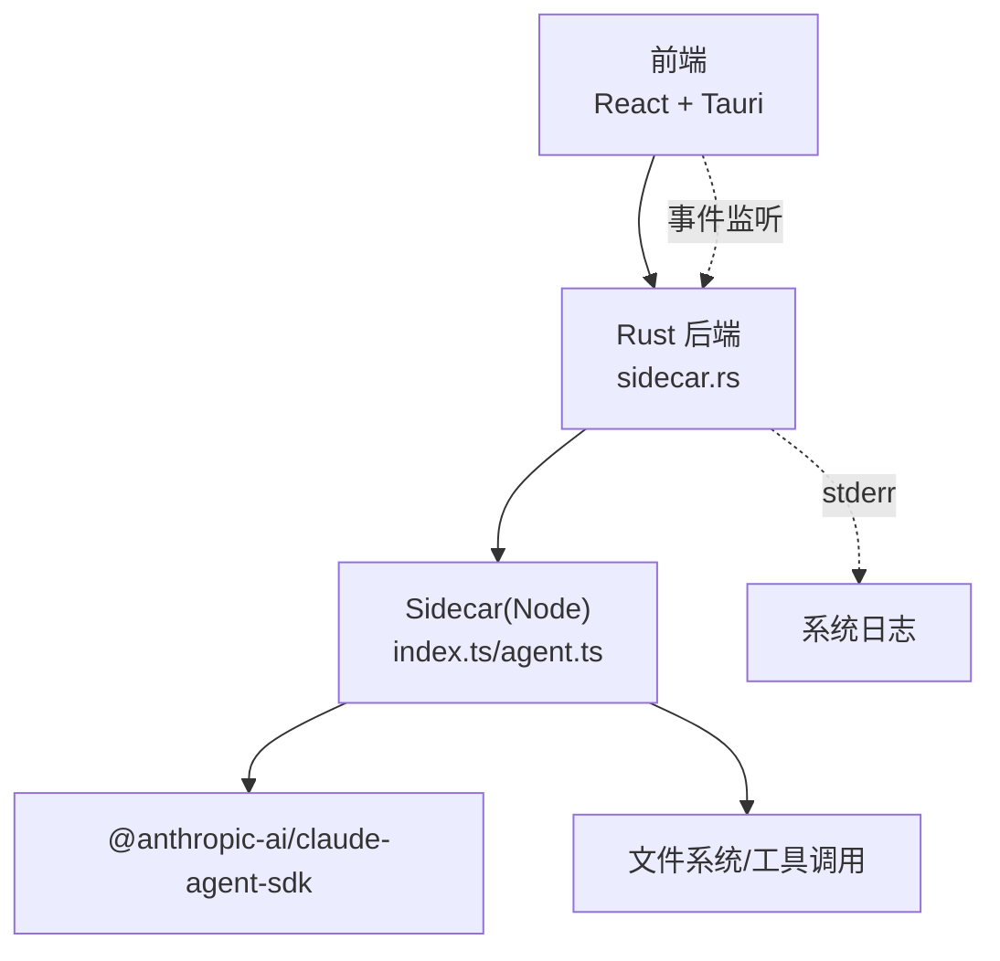
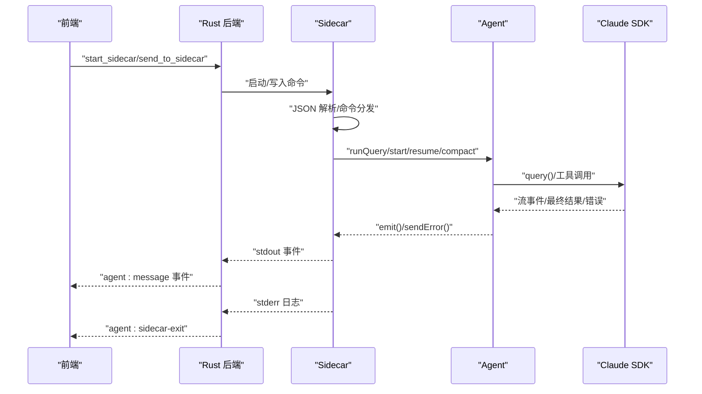
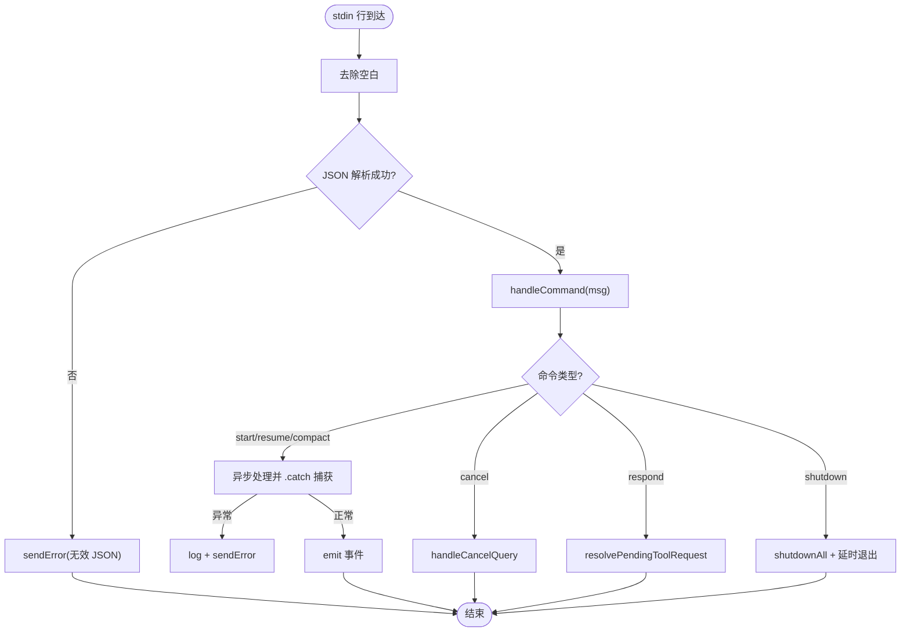
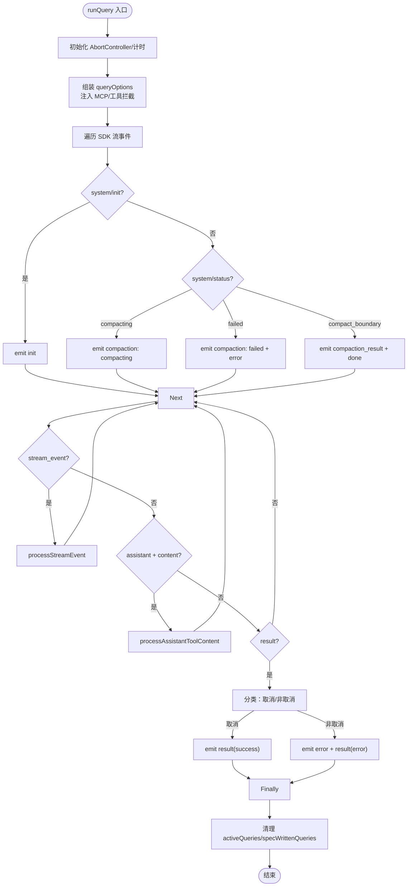
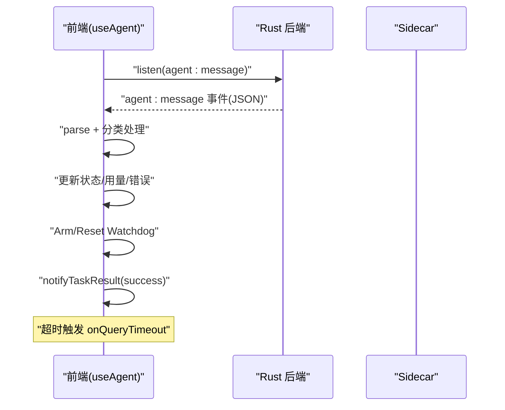
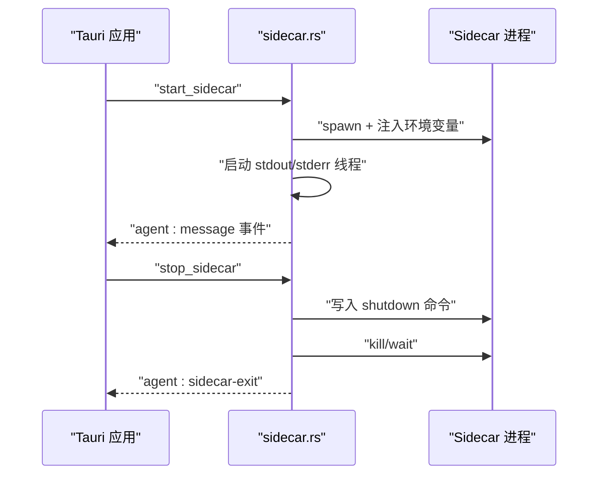
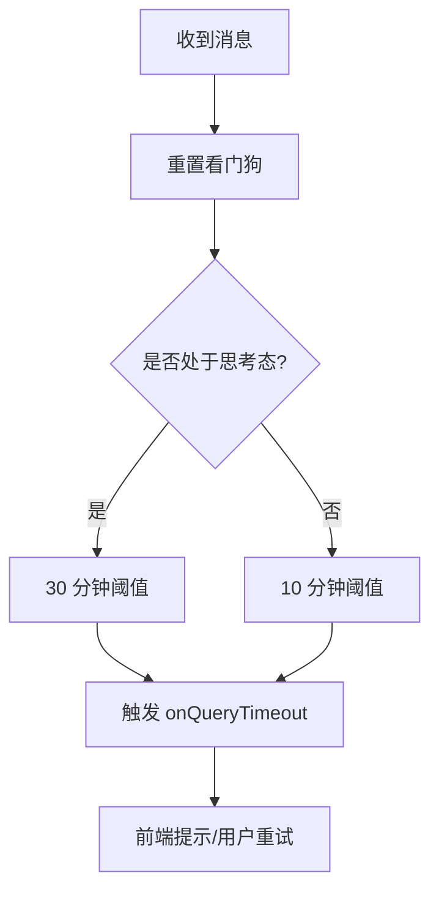
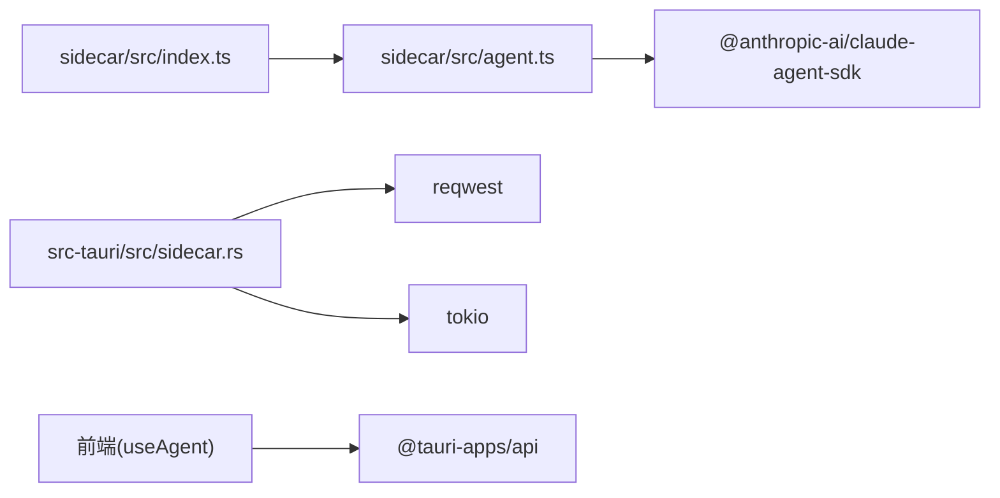

# 错误处理机制

<cite>
**本文引用的文件**
- [index.ts](file://sidecar/src/index.ts)
- [agent.ts](file://sidecar/src/agent.ts)
- [protocol.ts](file://sidecar/src/protocol.ts)
- [sidecar.rs](file://src-tauri/src/sidecar.rs)
- [useAgent.ts](file://src/hooks/useAgent.ts)
- [useAgentContext.tsx](file://src/hooks/useAgentContext.tsx)
- [notify.ts](file://src/utils/notify.ts)
- [model_test.rs](file://src-tauri/src/model_test.rs)
- [integration.rs](file://src-tauri/src/integration.rs)
- [types/index.ts](file://src/types/index.ts)
</cite>

## 目录
1. [简介](#简介)
2. [项目结构](#项目结构)
3. [核心组件](#核心组件)
4. [架构总览](#架构总览)
5. [详细组件分析](#详细组件分析)
6. [依赖关系分析](#依赖关系分析)
7. [性能考量](#性能考量)
8. [故障排查指南](#故障排查指南)
9. [结论](#结论)

## 简介
本文件系统性梳理 Sidecar 的错误处理机制，涵盖错误分类体系、异常处理策略、错误传播路径、未捕获异常与未处理拒绝处理、JSON 解析错误处理、错误恢复与重试策略、降级方案、错误日志与报告格式、调试信息收集，以及常见错误场景的解决方案、监控告警与故障诊断工具使用指导。目标是帮助开发者与运维人员快速定位问题、理解错误传播链路，并建立完善的监控与告警体系。

## 项目结构
Sidecar 错误处理涉及三层：
- 前端（React + Tauri）：负责监听 sidecar 事件、超时看门狗、错误展示与用户交互（如 AskUserQuestion）。
- Rust 后端（Tauri）：负责 sidecar 进程生命周期管理、stdin/stdout/stderr 管道、事件转发与日志打印。
- Sidecar（Node.js）：负责 JSON-lines 协议解析、命令分发、Agent 查询执行、工具调用、错误上报与优雅退出。

图表来源
- [sidecar.rs:175-208](file://src-tauri/src/sidecar.rs#L175-L208)
- [index.ts:96-128](file://sidecar/src/index.ts#L96-L128)
- [agent.ts:241-465](file://sidecar/src/agent.ts#L241-L465)

章节来源
- [sidecar.rs:175-208](file://src-tauri/src/sidecar.rs#L175-L208)
- [index.ts:96-128](file://sidecar/src/index.ts#L96-L128)
- [agent.ts:241-465](file://sidecar/src/agent.ts#L241-L465)

## 核心组件
- JSON-lines 协议与消息类型：定义了前端与 Sidecar 的双向通信格式，包括系统初始化、流式文本/思考、工具调用、最终结果、错误、会话压缩、用量更新、AskUserQuestion 等。
- Sidecar 主循环与错误捕获：stdin 行解析、命令分发、异常捕获、未捕获异常与未处理拒绝处理处理、JSON 解析错误处理。
- Agent 查询执行与错误上报：SDK 流事件处理、工具调用、取消与中断、最终结果与错误上报。
- 前端错误处理与监控：事件监听、看门狗超时、错误展示、通知与用户交互。
- Rust 后端进程与日志：进程启动、stdin/stdout/stderr 管道、事件转发、日志打印。

章节来源
- [protocol.ts:72-107](file://sidecar/src/protocol.ts#L72-L107)
- [index.ts:104-139](file://sidecar/src/index.ts#L104-L139)
- [agent.ts:241-465](file://sidecar/src/agent.ts#L241-L465)
- [useAgent.ts:66-101](file://src/hooks/useAgent.ts#L66-L101)
- [sidecar.rs:175-208](file://src-tauri/src/sidecar.rs#L175-L208)

## 架构总览
错误处理的关键流程如下：
- 输入层：前端通过 Tauri 命令向 Sidecar 写入 JSON-lines 命令；Sidecar 逐行解析，遇到无效 JSON 直接上报错误。
- 处理层：Sidecar 根据命令类型分发至对应处理器；Agent 查询过程中捕获 SDK 抛出的异常，区分取消与非取消错误，分别上报成功或错误结果。
- 输出层：Sidecar 通过 stdout 以 JSON-lines 格式输出事件；Rust 后端将 stdout 事件转发给前端；stderr 用于日志打印。
- 监控层：前端维护每条查询的看门狗，若长时间无消息则触发超时回调；Rust 后端在 stdout 关闭时发出 sidecar-exit 事件。

图表来源
- [sidecar.rs:175-208](file://src-tauri/src/sidecar.rs#L175-L208)
- [index.ts:104-127](file://sidecar/src/index.ts#L104-L127)
- [agent.ts:241-465](file://sidecar/src/agent.ts#L241-L465)

## 详细组件分析

### JSON-lines 协议与错误消息
- 协议类型：InboundMessage（前端→Sidecar）与 AgentMessage（Sidecar→前端）。
- 错误消息类型：ErrorMessage，包含 type、queryId（可选）、message。
- 用途：统一错误上报格式，便于前端展示与日志记录。

章节来源
- [protocol.ts:72-107](file://sidecar/src/protocol.ts#L72-L107)
- [protocol.ts:196-200](file://sidecar/src/protocol.ts#L196-L200)

### Sidecar 主循环与错误捕获
- stdin 行解析：逐行读取，trim 后尝试 JSON.parse；解析失败时调用 sendError 上报“无效 JSON”。
- 命令分发：根据 msg.type 分发到 handleStartQuery、handleResumeQuery、handleCancelQuery、handleCompactQuery、respond_tool_request、shutdown。
- 异常捕获：handleCommand 内部各处理器均使用 .catch 捕获异常，记录日志并通过 sendError 上报。
- 未捕获异常：process.on('uncaughtException') 与 process.on('unhandledRejection') 统一上报错误并继续运行。
- 优雅退出：收到 shutdown 命令后，先调用 shutdownAll，再延时退出，确保 stdout flush。

图表来源
- [index.ts:104-139](file://sidecar/src/index.ts#L104-L139)

章节来源
- [index.ts:104-139](file://sidecar/src/index.ts#L104-L139)

### Agent 查询执行与错误上报
- runQuery：封装 SDK 查询流程，处理系统初始化、流式增量事件、完整 assistant 消息、最终结果与错误。
- 工具调用拦截：canUseTool 中对 AskUserQuestion 特殊处理，支持前端交互；对 WriteSpec/MCP 工具在 spec 查询模式下放行。
- 取消与中断：AbortController 支持主动取消；SDK 抛出 AbortError 时视为取消，上报“查询已取消”。
- 错误分类：区分取消与非取消错误；非取消错误通过 emit('error') 与 emit('result', subtype='error') 上报。
- 会话压缩：处理 status/compact_boundary 消息，失败时上报错误。

图表来源
- [agent.ts:241-465](file://sidecar/src/agent.ts#L241-L465)

章节来源
- [agent.ts:241-465](file://sidecar/src/agent.ts#L241-L465)

### 前端错误处理与监控
- 事件监听：useAgent 监听 agent:message 事件，根据消息类型更新状态、计算 token 用量、处理 AskUserQuestion。
- 看门狗：每条 query 独立计时，收到任意消息重置；思考态使用更宽松阈值，避免误判。
- 错误展示：收到 error 消息时更新 Rabbit 状态为 error，并记录 message。
- 通知：任务完成/失败时根据用户偏好发送桌面通知与声音提示。

图表来源
- [useAgent.ts:66-101](file://src/hooks/useAgent.ts#L66-L101)
- [useAgentContext.tsx:131-161](file://src/hooks/useAgentContext.tsx#L131-L161)
- [notify.ts:227-237](file://src/utils/notify.ts#L227-L237)

章节来源
- [useAgent.ts:66-101](file://src/hooks/useAgent.ts#L66-L101)
- [useAgentContext.tsx:131-161](file://src/hooks/useAgentContext.tsx#L131-L161)
- [notify.ts:227-237](file://src/utils/notify.ts#L227-L237)

### Rust 后端进程与日志
- 进程启动：清理环境变量、重定向 CLAUDE_CONFIG_DIR、注入 API Key/Base URL/自定义环境变量，启动 sidecar 进程。
- 管道处理：stdout 逐行读取并转发为 agent:message 事件；stderr 逐行读取并打印到 eprintln。
- 优雅退出：stop_sidecar 发送 shutdown 命令，等待一段时间后强制 kill，并发出 agent:sidecar-exit。

图表来源
- [sidecar.rs:61-214](file://src-tauri/src/sidecar.rs#L61-L214)
- [sidecar.rs:216-270](file://src-tauri/src/sidecar.rs#L216-L270)

章节来源
- [sidecar.rs:61-214](file://src-tauri/src/sidecar.rs#L61-L214)
- [sidecar.rs:216-270](file://src-tauri/src/sidecar.rs#L216-L270)

### 错误分类体系
- 按来源分类：
  - 协议层：JSON 解析错误（Invalid JSON）。
  - 应用层：命令类型未知、工具调用超时、用户取消。
  - SDK 层：模型调用错误、限流、认证失败、网络错误。
  - 进程层：Sidecar 未捕获异常、未处理拒绝、进程退出。
- 按影响范围分类：
  - 可恢复：网络抖动、临时限流、工具调用超时。
  - 不可恢复：API Key 无效、模型不存在、配置错误。
- 按严重程度分类：
  - 低：工具调用超时、非关键操作失败。
  - 中：查询被取消、部分工具执行失败。
  - 高：认证失败、网络不可达、Sidecar 异常退出。

章节来源
- [index.ts:113-116](file://sidecar/src/index.ts#L113-L116)
- [agent.ts:439-460](file://sidecar/src/agent.ts#L439-L460)
- [model_test.rs:171-190](file://src-tauri/src/model_test.rs#L171-L190)

### 异常处理策略
- 协议层异常：立即上报 ErrorMessage，避免阻塞后续处理。
- 应用层异常：在处理器内部 .catch 捕获，记录日志并上报错误；对于取消操作，上报“查询已取消”。
- SDK 层异常：区分 AbortError 与其它错误；AbortError 视为正常取消路径。
- 进程层异常：通过 uncaughtException/unhandledRejection 统一上报，保持 Sidecar 运行。

章节来源
- [index.ts:42-53](file://sidecar/src/index.ts#L42-L53)
- [agent.ts:442-460](file://sidecar/src/agent.ts#L442-L460)
- [index.ts:131-139](file://sidecar/src/index.ts#L131-L139)

### 错误传播机制
- 传播路径：前端命令 → Sidecar stdin → Sidecar 处理器 → Agent 查询 → SDK → 事件流 → Sidecar stdout → Rust 后端转发 → 前端事件。
- 错误传播：任何环节异常都会通过 ErrorMessage 或 result(error) 传播到前端；stderr 用于进程级日志。
- 传播控制：Rust 后端在 stdout 关闭时发出 sidecar-exit 事件，前端据此清理状态。

章节来源
- [protocol.ts:84-107](file://sidecar/src/protocol.ts#L84-L107)
- [sidecar.rs:175-208](file://src-tauri/src/sidecar.rs#L175-L208)

### 未捕获异常处理与未处理拒绝处理
- 未捕获异常：process.on('uncaughtException') 捕获并上报 ErrorMessage，随后继续运行，避免进程崩溃。
- 未处理拒绝：process.on('unhandledRejection') 捕获并上报 ErrorMessage，记录原因字符串。
- 建议：在开发阶段尽量避免未捕获异常；生产环境通过上述钩子兜底。

章节来源
- [index.ts:131-139](file://sidecar/src/index.ts#L131-L139)

### JSON 解析错误处理
- 解析失败：在 stdin 行解析处捕获异常，记录日志并发送 Invalid JSON 错误。
- 建议：前端发送命令前进行基本校验，避免发送非法 JSON。

章节来源
- [index.ts:108-116](file://sidecar/src/index.ts#L108-L116)

### 错误恢复策略与重试机制
- 看门狗超时：前端为每条 query 维护独立计时器，收到消息则重置；思考态使用更宽松阈值，避免误判。
- 工具调用超时：AskUserQuestion 设置 5 分钟超时，超时后拒绝工具调用并上报错误。
- 网络错误：Rust 层集成模块使用 30 秒超时客户端，POST/GET 失败时返回友好错误描述。
- 模型连接测试：根据 HTTP 状态码映射为友好提示，附带截断后的响应体便于诊断。

图表来源
- [useAgent.ts:66-95](file://src/hooks/useAgent.ts#L66-L95)

章节来源
- [useAgent.ts:66-95](file://src/hooks/useAgent.ts#L66-L95)
- [integration.rs:44-82](file://src-tauri/src/integration.rs#L44-L82)
- [model_test.rs:171-190](file://src-tauri/src/model_test.rs#L171-L190)

### 降级方案
- 工具调用降级：AskUserQuestion 超时或取消时，拒绝工具调用并返回友好提示。
- 会话压缩降级：压缩失败时上报错误，前端显示失败状态。
- 进程降级：Rust 后端在 stdout 关闭时发出 sidecar-exit，前端清理状态并提示用户。

章节来源
- [agent.ts:518-542](file://sidecar/src/agent.ts#L518-L542)
- [agent.ts:337-341](file://sidecar/src/agent.ts#L337-L341)
- [sidecar.rs:190-194](file://src-tauri/src/sidecar.rs#L190-L194)

### 错误日志记录与报告格式
- 日志来源：
  - Sidecar：process.stderr 输出，包含 start_query/resume_query/compact_query 等关键步骤。
  - Rust 后端：stderr 输出 sidecar 进程日志；stdout 事件通过 agent:message 转发。
- 报告格式：
  - 错误消息：ErrorMessage，包含 type、queryId（可选）、message。
  - 结果消息：ResultMessage，包含 subtype、result、totalCostUsd、durationMs、error、numTurns、usage。
  - 用量更新：UsageUpdateMessage，包含 input/output/cache 相关 tokens。
  - 会话压缩：CompactionStatusMessage/CompactionResultMessage。
  - AskUserQuestion：AskUserQuestionMessage，携带 requestId 与问题列表。

章节来源
- [index.ts:20-32](file://sidecar/src/index.ts#L20-L32)
- [protocol.ts:196-200](file://sidecar/src/protocol.ts#L196-L200)
- [protocol.ts:184-193](file://sidecar/src/protocol.ts#L184-L193)
- [protocol.ts:202-222](file://sidecar/src/protocol.ts#L202-L222)
- [protocol.ts:239-244](file://sidecar/src/protocol.ts#L239-L244)

### 调试信息收集
- 前端调试：useAgentContext 将错误信息写入 Rabbit 状态，便于 UI 展示；前端状态包含 cost、duration、tokenUsage、numTurns。
- 后端调试：Rust 后端在 stderr 输出 sidecar 日志；stdout 事件用于诊断。
- 类型对齐：前端 types/index.ts 与 Sidecar protocol.ts 保持消息类型一致，减少调试歧义。

章节来源
- [useAgentContext.tsx:131-161](file://src/hooks/useAgentContext.tsx#L131-L161)
- [types/index.ts:82-102](file://src/types/index.ts#L82-L102)
- [protocol.ts:90-107](file://sidecar/src/protocol.ts#L90-L107)

### 常见错误场景与解决方案
- 无效 JSON：检查前端发送命令格式，确保 JSON 有效；Sidecar 会直接上报 Invalid JSON。
- 工具调用超时：前端等待 AskUserQuestion 5 分钟；超时后拒绝工具调用，建议用户重试或调整工具输入。
- 查询被取消：SDK 抛出 AbortError 或包含 abort 的错误信息；前端显示“查询已取消”，可重新发起。
- 认证失败：HTTP 401/403，检查 API Key/Base URL；模型连接测试提供友好提示。
- 限流：HTTP 429，等待后重试；前端看门狗避免长时间静默。
- 网络不可达：HTTP 5xx，检查网络与代理；集成模块提供详细诊断信息。
- Sidecar 异常退出：Rust 后端发出 sidecar-exit 事件，前端清理状态并提示用户重启。

章节来源
- [index.ts:113-116](file://sidecar/src/index.ts#L113-L116)
- [agent.ts:518-542](file://sidecar/src/agent.ts#L518-L542)
- [agent.ts:442-460](file://sidecar/src/agent.ts#L442-L460)
- [model_test.rs:171-190](file://src-tauri/src/model_test.rs#L171-L190)
- [integration.rs:44-82](file://src-tauri/src/integration.rs#L44-L82)
- [sidecar.rs:190-194](file://src-tauri/src/sidecar.rs#L190-L194)

### 错误监控告警与故障诊断
- 监控指标：
  - 查询成功率、平均耗时、Token 用量、错误分布（取消/网络/认证/工具）。
  - Sidecar 进程存活状态、stdout 关闭事件。
- 告警策略：
  - 连续多次无效 JSON 或工具调用超时触发告警。
  - 认证失败率过高触发告警。
  - Sidecar 频繁异常退出触发告警。
- 诊断工具：
  - 模型连接测试：HTTP 状态码映射与友好提示。
  - 网络诊断：DNS、HTTP、Ping、Marketplace 诊断结果。
  - 反馈提交：截图、系统信息、配置摘要、性能指标。

章节来源
- [model_test.rs:171-190](file://src-tauri/src/model_test.rs#L171-L190)
- [integration.rs:44-82](file://src-tauri/src/integration.rs#L44-L82)
- [types/index.ts:456-514](file://src/types/index.ts#L456-L514)
- [types/index.ts:611-700](file://src/types/index.ts#L611-L700)

## 依赖关系分析
- Sidecar 依赖 @anthropic-ai/claude-agent-sdk 进行查询与工具调用。
- Rust 后端依赖 reqwest 进行 HTTP 请求，tokio 提供异步运行时。
- 前端依赖 @tauri-apps/api 进行命令调用与事件监听。

图表来源
- [index.ts:11-18](file://sidecar/src/index.ts#L11-L18)
- [agent.ts:12-18](file://sidecar/src/agent.ts#L12-L18)
- [sidecar.rs:20-37](file://src-tauri/src/sidecar.rs#L20-L37)
- [useAgent.ts:9-17](file://src/hooks/useAgent.ts#L9-L17)

章节来源
- [index.ts:11-18](file://sidecar/src/index.ts#L11-L18)
- [agent.ts:12-18](file://sidecar/src/agent.ts#L12-L18)
- [sidecar.rs:20-37](file://src-tauri/src/sidecar.rs#L20-L37)
- [useAgent.ts:9-17](file://src/hooks/useAgent.ts#L9-L17)

## 性能考量
- 流式输出：Sidecar 通过 stdout 逐行输出事件，避免一次性大块数据导致内存压力。
- 异步处理：命令分发与查询执行均为异步，允许并发处理多个查询。
- 超时控制：前端看门狗与 Rust HTTP 客户端超时，防止长时间阻塞。
- 日志分离：stderr 专门用于日志，不影响 stdout 的 JSON-lines 协议。

[本节为通用指导，不直接分析具体文件]

## 故障排查指南
- 确认 Sidecar 进程状态：通过 get_sidecar_status 检查运行状态；若异常退出，关注 agent:sidecar-exit 事件。
- 检查 stderr 日志：Rust 后端会将 sidecar 日志打印到 stderr，包含 start_query/resume_query/compact_query 等关键步骤。
- 查看前端事件：监听 agent:message，确认是否收到 system/init、usage_update、assistant/text_delta、result/error 等事件。
- 工具调用问题：检查 AskUserQuestion 是否在 5 分钟内得到响应；超时后拒绝工具调用。
- 网络问题：使用模型连接测试与网络诊断工具，获取 HTTP 状态码与响应体片段。
- 重试策略：对于临时性错误（网络抖动、限流），前端可基于看门狗与错误类型进行重试；对于认证失败、模型不存在等不可恢复错误，需修正配置后重试。

章节来源
- [sidecar.rs:175-208](file://src-tauri/src/sidecar.rs#L175-L208)
- [useAgent.ts:66-101](file://src/hooks/useAgent.ts#L66-L101)
- [model_test.rs:171-190](file://src-tauri/src/model_test.rs#L171-L190)
- [integration.rs:44-82](file://src-tauri/src/integration.rs#L44-L82)

## 结论
Sidecar 的错误处理机制通过清晰的协议、严格的异常捕获、完善的日志与监控、以及前端看门狗与 Rust 后端的协同，形成了从输入到输出的全链路错误处理闭环。建议在生产环境中结合模型连接测试与网络诊断工具，建立完善的告警与重试策略，确保系统的稳定性与可观测性。