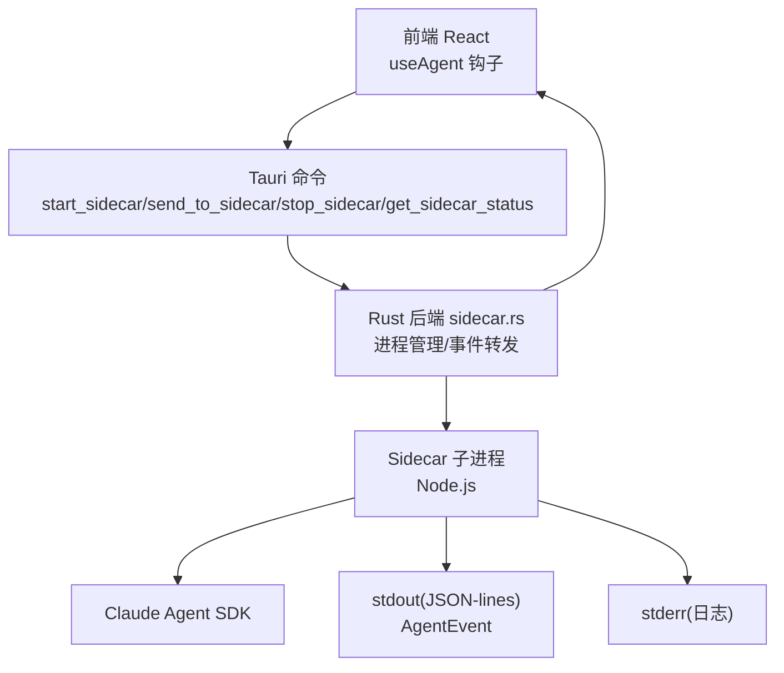
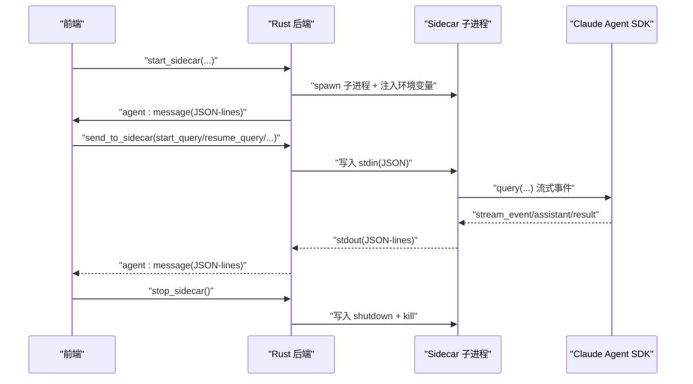
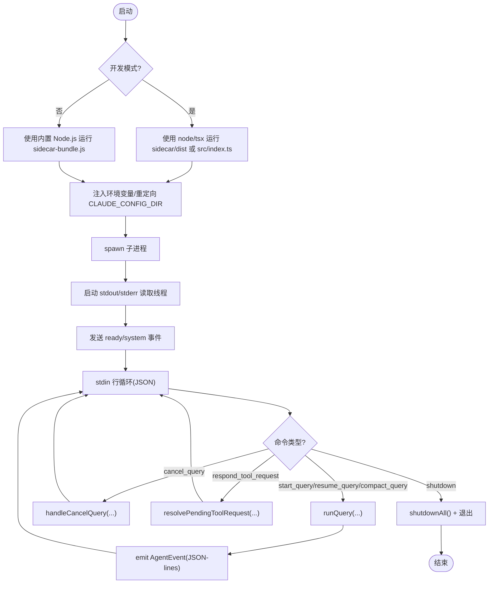
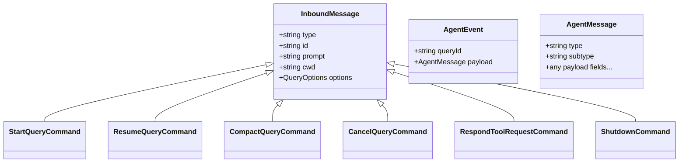
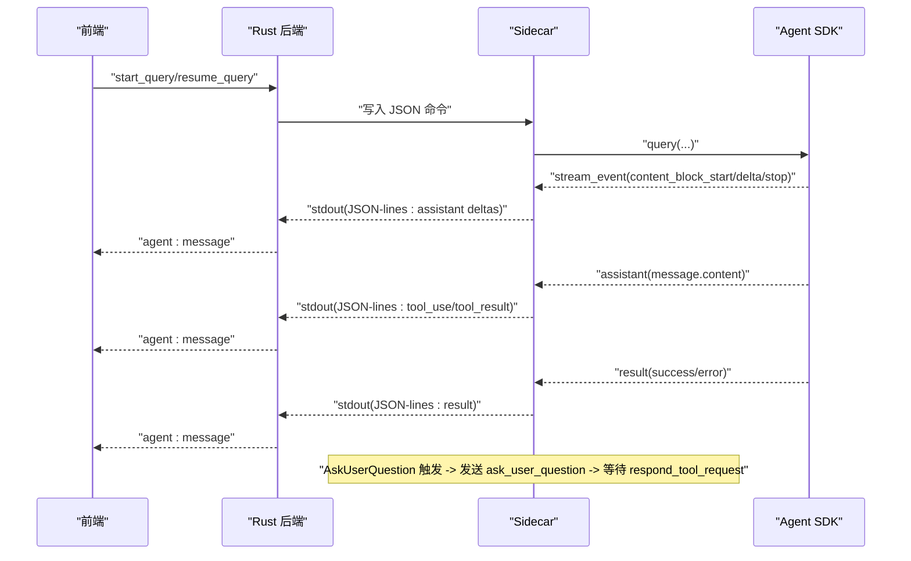
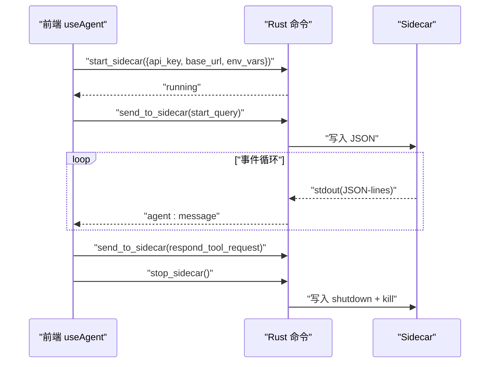
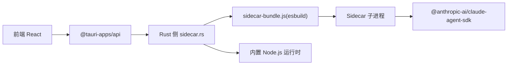

# Sidecar 进程管理

<cite>
**本文引用的文件**
- [sidecar/src/index.ts](file://sidecar/src/index.ts)
- [sidecar/src/agent.ts](file://sidecar/src/agent.ts)
- [sidecar/src/protocol.ts](file://sidecar/src/protocol.ts)
- [src-tauri/src/sidecar.rs](file://src-tauri/src/sidecar.rs)
- [src-tauri/src/lib.rs](file://src-tauri/src/lib.rs)
- [src-tauri/src/main.rs](file://src-tauri/src/main.rs)
- [src/hooks/useAgent.ts](file://src/hooks/useAgent.ts)
- [src/components/agent/AskUserQuestionBlock.tsx](file://src/components/agent/AskUserQuestionBlock.tsx)
- [src/types/index.ts](file://src/types/index.ts)
- [sidecar/package.json](file://sidecar/package.json)
- [src-tauri/Cargo.toml](file://src-tauri/Cargo.toml)
</cite>

## 目录
1. [简介](#简介)
2. [项目结构](#项目结构)
3. [核心组件](#核心组件)
4. [架构总览](#架构总览)
5. [详细组件分析](#详细组件分析)
6. [依赖关系分析](#依赖关系分析)
7. [性能考量](#性能考量)
8. [故障排查指南](#故障排查指南)
9. [结论](#结论)

## 简介
本文件面向 RabbitCoding 的 Sidecar 进程管理，系统性阐述其启动机制、生命周期、进程间通信协议、状态监控、错误恢复与资源清理、与主应用的通信方式、消息传递格式与异步处理模式，并提供具体代码片段路径以便快速定位实现细节。同时涵盖进程隔离策略、安全沙箱、性能监控与故障诊断方法。

## 项目结构
- 前端（React + Tauri）通过 Tauri 命令与 Rust 后端交互，Rust 后端负责启动/管理 Sidecar 子进程，并将 Sidecar 的 stdout/stderr 事件转发至前端。
- Sidecar 以 Node.js 进程运行，通过 stdin 接收命令，通过 stdout 输出 JSON-lines 格式的消息，stderr 输出日志。
- 协议层定义了前后端与 Sidecar 的消息类型，确保跨语言一致性。

图表来源
- [src-tauri/src/sidecar.rs:61-214](file://src-tauri/src/sidecar.rs#L61-L214)
- [src/hooks/useAgent.ts:106-177](file://src/hooks/useAgent.ts#L106-L177)
- [sidecar/src/index.ts:96-128](file://sidecar/src/index.ts#L96-L128)

章节来源
- [src-tauri/src/lib.rs:343-387](file://src-tauri/src/lib.rs#L343-L387)
- [src-tauri/src/sidecar.rs:61-214](file://src-tauri/src/sidecar.rs#L61-L214)
- [sidecar/src/index.ts:96-128](file://sidecar/src/index.ts#L96-L128)

## 核心组件
- Rust 进程管理与事件转发：负责启动/停止 Sidecar、读取 stdout/stderr、通过 Tauri 事件向前端广播。
- Sidecar 主循环与命令分发：从 stdin 逐行读取 JSON 命令，分发到对应处理器，输出 JSON-lines 事件。
- Agent 会话引擎：封装 Claude Agent SDK，将流式增量事件转换为前端友好的消息类型。
- 协议层：统一定义前端→Sidecar、Sidecar→前端的消息结构。
- 前端集成：useAgent 钩子负责监听事件、发送命令、看门狗超时控制、与 AskUserQuestion 交互。

章节来源
- [src-tauri/src/sidecar.rs:61-214](file://src-tauri/src/sidecar.rs#L61-L214)
- [sidecar/src/index.ts:37-91](file://sidecar/src/index.ts#L37-L91)
- [sidecar/src/agent.ts:241-465](file://sidecar/src/agent.ts#L241-L465)
- [sidecar/src/protocol.ts:13-78](file://sidecar/src/protocol.ts#L13-L78)

## 架构总览
整体采用“前端命令 → Rust 进程管理 → Sidecar 子进程”的三层结构。Rust 线程分别读取 Sidecar 的 stdout/stderr，前者通过 Tauri 事件通道转发到前端，后者仅作日志输出。Sidecar 通过 Claude Agent SDK 与外部模型交互，期间将增量事件与最终结果以 JSON-lines 形式输出。

图表来源
- [src-tauri/src/sidecar.rs:61-214](file://src-tauri/src/sidecar.rs#L61-L214)
- [sidecar/src/index.ts:96-128](file://sidecar/src/index.ts#L96-L128)
- [sidecar/src/agent.ts:241-465](file://sidecar/src/agent.ts#L241-L465)

## 详细组件分析

### 1) Sidecar 启动与生命周期管理
- 启动流程
  - Rust 侧根据是否开发模式选择运行方式：开发模式下可直接运行 dist 或 tsx；生产模式使用内置 Node.js 运行打包脚本。
  - 启动时清理并注入关键环境变量，重定向 Claude 配置根目录，确保与系统全局配置隔离。
  - 启动 stdout/stderr 读取线程，分别转发事件与输出日志。
- 生命周期
  - 主循环基于 readline 逐行读取 stdin，解析为 InboundMessage 并分发处理。
  - 收到 shutdown 命令或 stdin 关闭时，触发优雅关闭，清理活跃查询与 pending 请求。
  - 未捕获异常与未处理拒绝在主循环中统一上报为错误消息。

图表来源
- [src-tauri/src/sidecar.rs:288-358](file://src-tauri/src/sidecar.rs#L288-L358)
- [sidecar/src/index.ts:96-128](file://sidecar/src/index.ts#L96-L128)
- [sidecar/src/agent.ts:470-497](file://sidecar/src/agent.ts#L470-L497)

章节来源
- [src-tauri/src/sidecar.rs:61-214](file://src-tauri/src/sidecar.rs#L61-L214)
- [sidecar/src/index.ts:96-144](file://sidecar/src/index.ts#L96-L144)

### 2) 进程间通信协议与消息格式
- 前端 → Sidecar（stdin）
  - start_query/resume_query/compact_query/cancel_query/respond_tool_request/shutdown
- Sidecar → 前端（stdout JSON-lines）
  - system/init、assistant(text/thinking/delta/done/tool_use)、tool_result、result、error、compaction/status/result、usage_update、ask_user_question、spec_written

图表来源
- [sidecar/src/protocol.ts:13-78](file://sidecar/src/protocol.ts#L13-L78)
- [sidecar/src/protocol.ts:84-107](file://sidecar/src/protocol.ts#L84-L107)

章节来源
- [sidecar/src/protocol.ts:13-252](file://sidecar/src/protocol.ts#L13-L252)

### 3) Agent 会话引擎与工具交互
- runQuery
  - 统一处理系统初始化、流式增量、完整 assistant 消息、会话压缩状态、最终结果与错误。
  - 对 AskUserQuestion 进行拦截与等待，支持超时与取消。
  - 对 WriteSpec 工具进行特殊处理，写入 .rabbit/specs 并触发查询中断以退出计划模式。
- 工具权限控制
  - 通过 canUseTool 钩子实现细粒度控制，Spec 查询对 ExitPlanMode 进行拦截，要求先写入规范文档。
- 令牌统计与成本
  - 从 SDK usage 中提取 input/output/cache 相关统计，实时上报 usage_update，并在 result 中汇总。

图表来源
- [sidecar/src/agent.ts:241-465](file://sidecar/src/agent.ts#L241-L465)
- [sidecar/src/agent.ts:502-573](file://sidecar/src/agent.ts#L502-L573)

章节来源
- [sidecar/src/agent.ts:241-465](file://sidecar/src/agent.ts#L241-L465)
- [sidecar/src/agent.ts:502-573](file://sidecar/src/agent.ts#L502-L573)

### 4) 与主应用的通信方式与异步处理
- Rust 后端
  - start_sidecar：spawn 子进程，注入环境变量，启动 stdout/stderr 读取线程，转发 agent:message 事件。
  - send_to_sidecar：将 JSON 字符串写入子进程 stdin。
  - stop_sidecar：发送 shutdown 命令，等待片刻后强制 kill。
  - get_sidecar_status：查询当前运行状态。
- 前端 useAgent
  - 通过 invoke 调用上述命令，listen agent:message 事件，解析 JSON-lines 并更新消息流。
  - 看门狗：针对每条 queryId 维护定时器，区分“思考态”与普通态的超时阈值，兜底静默卡死场景。
  - 与 AskUserQuestionBlock 集成：渲染问题卡片，收集答案后调用 respondToQuestion，发送 respond_tool_request。

图表来源
- [src-tauri/src/sidecar.rs:61-214](file://src-tauri/src/sidecar.rs#L61-L214)
- [src/hooks/useAgent.ts:106-200](file://src/hooks/useAgent.ts#L106-L200)
- [src/components/agent/AskUserQuestionBlock.tsx:58-73](file://src/components/agent/AskUserQuestionBlock.tsx#L58-L73)

章节来源
- [src-tauri/src/sidecar.rs:61-279](file://src-tauri/src/sidecar.rs#L61-L279)
- [src/hooks/useAgent.ts:106-200](file://src/hooks/useAgent.ts#L106-L200)
- [src/components/agent/AskUserQuestionBlock.tsx:58-73](file://src/components/agent/AskUserQuestionBlock.tsx#L58-L73)

### 5) 进程隔离策略与安全沙箱
- 环境变量隔离
  - 启动前移除 ANTHROPIC_* 与 CLAUDE_CODE_DISABLE_1M_CONTEXT 等可能影响 SDK 行为的环境变量，确保 BYOK 完全可控。
- 配置根目录隔离
  - 通过 CLAUDE_CONFIG_DIR 指向应用专属目录，阻断 ~/.claude/ 下的全局资源泄漏，实现“安全沙箱”。
- SDK 级冗余兜底
  - settingSources:[] 防止残留 settings.env 覆盖 BYOK。
- 原生二进制路径解析
  - 生产模式下，原生 CLI 二进制位于打包资源同目录，避免通过 node_modules 解析平台特定二进制导致的不可预测行为。

章节来源
- [src-tauri/src/sidecar.rs:96-150](file://src-tauri/src/sidecar.rs#L96-L150)
- [sidecar/src/agent.ts:29-45](file://sidecar/src/agent.ts#L29-L45)

### 6) 资源清理与错误恢复
- 资源清理
  - shutdownAll：遍历活跃查询并 abort，清空 pending tool requests，释放内存与句柄。
  - 会话压缩完成后清理临时状态，避免悬挂资源。
- 错误恢复
  - 未捕获异常与未处理拒绝统一上报为 error 消息，前端据此更新状态。
  - cancel_query：清理对应 pending 请求并 abort 查询，保证快速回收。
  - stop_sidecar：先优雅 shutdown，再 kill，确保日志与资源有序释放。

章节来源
- [sidecar/src/agent.ts:599-605](file://sidecar/src/agent.ts#L599-L605)
- [sidecar/src/index.ts:131-139](file://sidecar/src/index.ts#L131-L139)
- [src-tauri/src/sidecar.rs:245-270](file://src-tauri/src/sidecar.rs#L245-L270)

### 7) 性能监控与指标
- 令牌统计
  - usage_update：每轮消息增量更新当前 turn 的上下文占用。
  - result：汇总总耗时、总成本、turn 数与最终 usage。
- 思考时长
  - thinking_start/thinking_done：记录单轮思考耗时，便于前端展示与分析。
- 会话压缩
  - compaction/status/result：跟踪压缩阶段、失败原因与前后 token 数变化。

章节来源
- [sidecar/src/agent.ts:146-199](file://sidecar/src/agent.ts#L146-L199)
- [sidecar/src/agent.ts:334-356](file://sidecar/src/agent.ts#L334-L356)
- [sidecar/src/protocol.ts:202-222](file://sidecar/src/protocol.ts#L202-L222)

### 8) 故障诊断方法
- 日志定位
  - stderr 输出的 [sidecar] 前缀日志，便于区分业务事件与调试信息。
- 事件追踪
  - 前端监听 agent:message，结合 queryId 串联一次完整对话链路。
- 看门狗告警
  - 若长时间无事件，触发 onQueryTimeout，辅助定位 SDK 卡死或网络异常。
- 常见问题
  - 未正确注入 CLAUDE_CONFIG_DIR 导致加载全局配置：检查启动参数与环境变量。
  - 5 分钟 AskUserQuestion 超时：前端应提示用户尽快回复或取消。
  - 优雅关闭无效：确认 Rust 线程已启动，且子进程未被外部信号中断。

章节来源
- [src-tauri/src/sidecar.rs:196-208](file://src-tauri/src/sidecar.rs#L196-L208)
- [src/hooks/useAgent.ts:66-101](file://src/hooks/useAgent.ts#L66-L101)
- [sidecar/src/agent.ts:518-542](file://sidecar/src/agent.ts#L518-L542)

## 依赖关系分析
- 语言与框架
  - 前端：React + Tauri（@tauri-apps/api）。
  - 后端：Rust（tauri、serde、tokio）。
  - Sidecar：Node.js（readline、@anthropic-ai/claude-agent-sdk、zod）。
- 构建与打包
  - sidecar 使用 esbuild 打包为 sidecar-bundle.js，Rust 侧在生产模式下直接运行该 bundle。
  - Tauri 通过资源目录嵌入内置 Node.js 运行时与 sidecar 资源。

图表来源
- [src-tauri/Cargo.toml:20-39](file://src-tauri/Cargo.toml#L20-L39)
- [sidecar/package.json:7-11](file://sidecar/package.json#L7-L11)
- [src-tauri/src/sidecar.rs:322-358](file://src-tauri/src/sidecar.rs#L322-L358)

章节来源
- [src-tauri/Cargo.toml:20-39](file://src-tauri/Cargo.toml#L20-L39)
- [sidecar/package.json:7-11](file://sidecar/package.json#L7-L11)
- [src-tauri/src/sidecar.rs:288-358](file://src-tauri/src/sidecar.rs#L288-L358)

## 性能考量
- I/O 与并发
  - stdin 逐行解析，stdout 逐行输出，避免缓冲堆积；并发处理多个查询，提高吞吐。
- 资源隔离
  - 通过 CLAUDE_CONFIG_DIR 与 settingSources:[] 防止全局配置与插件污染，减少不必要的 IO 与初始化开销。
- 事件粒度
  - 流式增量事件（text_delta/thinking_delta）降低前端渲染压力，提升交互体验。
- 超时与节流
  - 看门狗与思考态阈值避免长时间静默占用资源；合理设置 maxTurns 与 maxBudgetUsd 控制成本。

## 故障排查指南
- 启动失败
  - 检查 start_sidecar 返回的 error 字段；确认内置 Node.js 路径与 sidecar-bundle.js 是否存在。
- 无事件
  - 确认 stdout 读取线程正常；检查前端是否正确监听 agent:message；查看看门狗是否触发。
- AskUserQuestion 无响应
  - 前端应在 5 分钟内收到超时；检查前端 respondToQuestion 是否被调用。
- 优雅关闭无效
  - 确认 Rust 已发送 shutdown 命令并等待；必要时强制 kill 并清理进程句柄。

章节来源
- [src-tauri/src/sidecar.rs:245-270](file://src-tauri/src/sidecar.rs#L245-L270)
- [src/hooks/useAgent.ts:66-101](file://src/hooks/useAgent.ts#L66-L101)
- [sidecar/src/agent.ts:518-542](file://sidecar/src/agent.ts#L518-L542)

## 结论
RabbitCoding 的 Sidecar 进程管理通过清晰的三层架构实现了稳定、可观测、可恢复的 AI 会话能力。Rust 后端负责进程生命周期与事件桥接，Sidecar 专注会话与工具交互，前端通过统一协议与事件驱动完成用户体验闭环。配合严格的隔离策略与完善的错误恢复机制，系统在安全性与性能之间取得良好平衡。