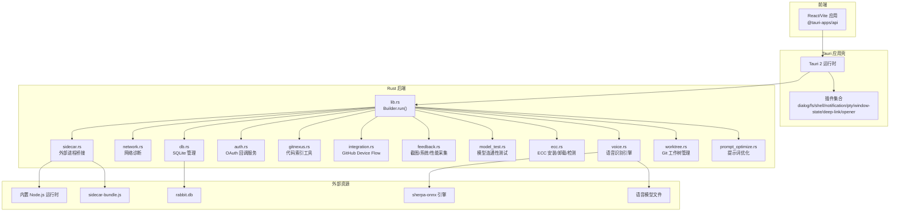
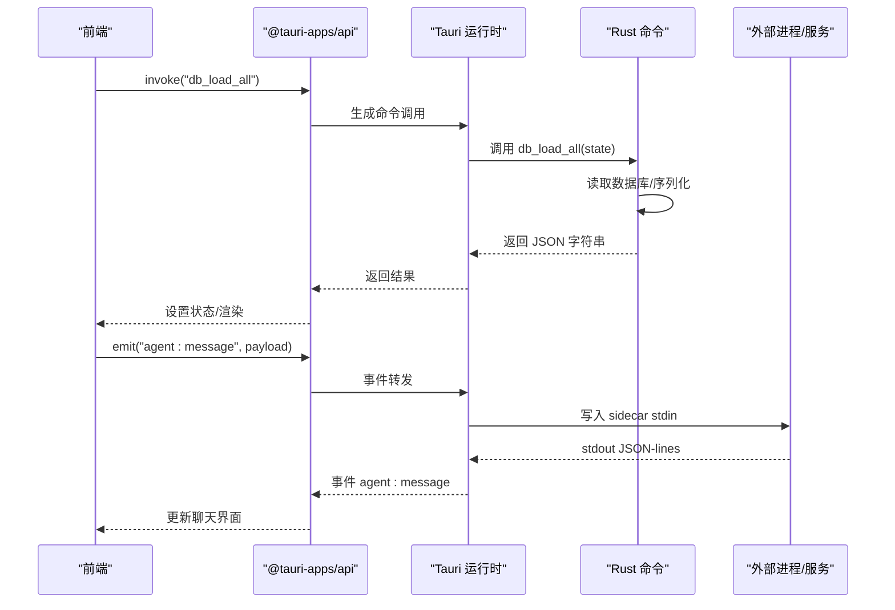
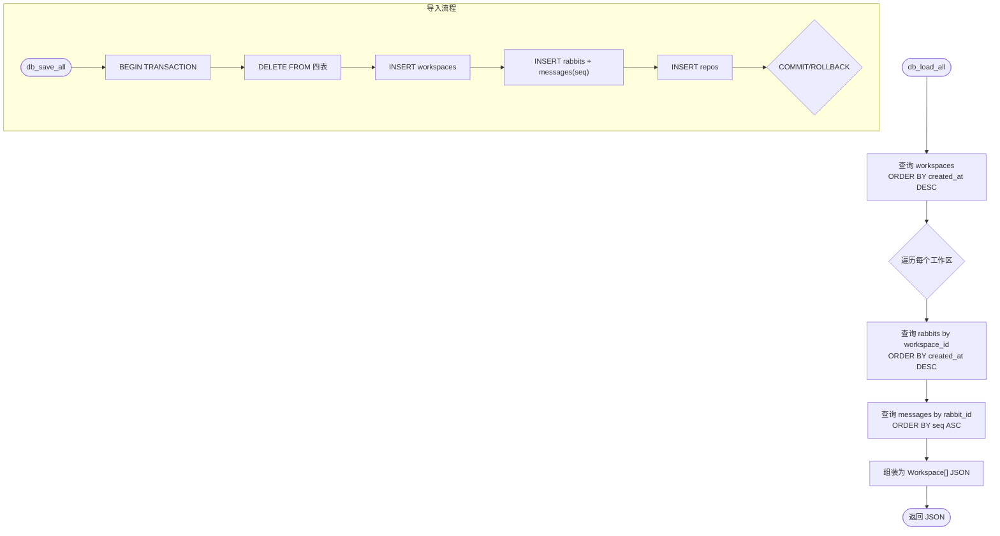
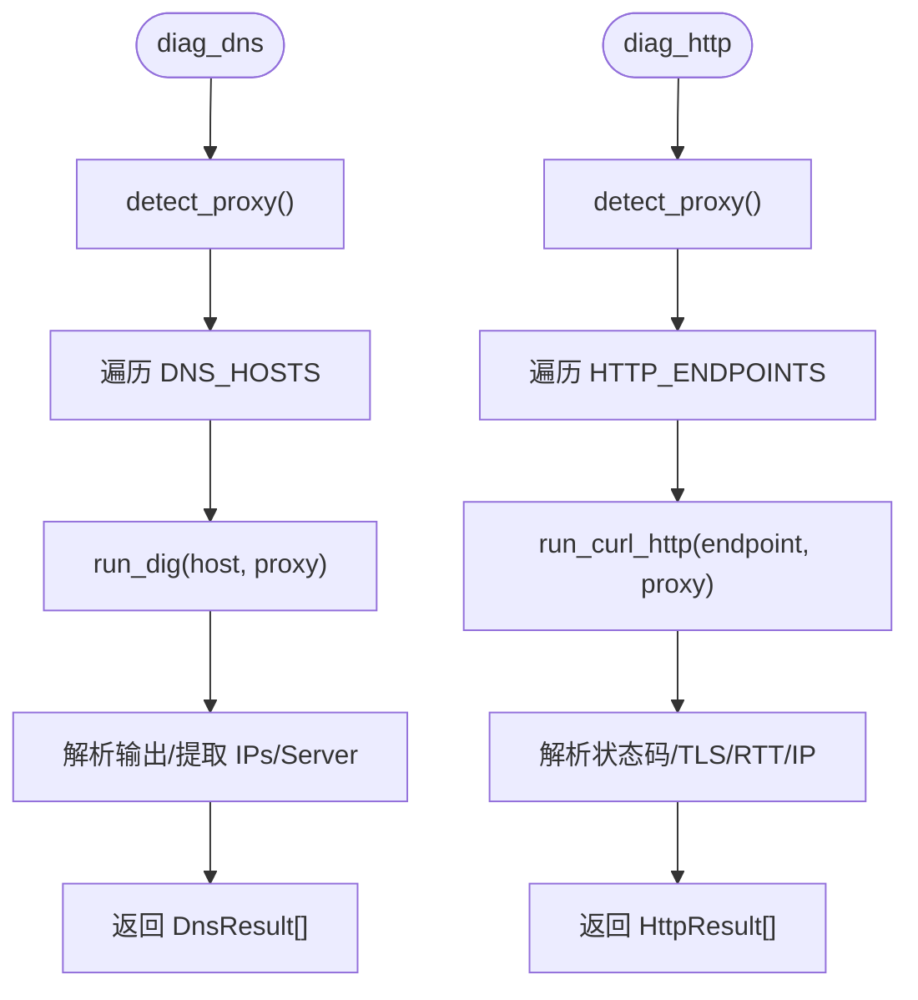
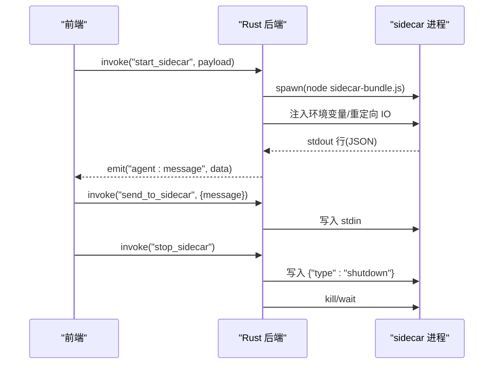
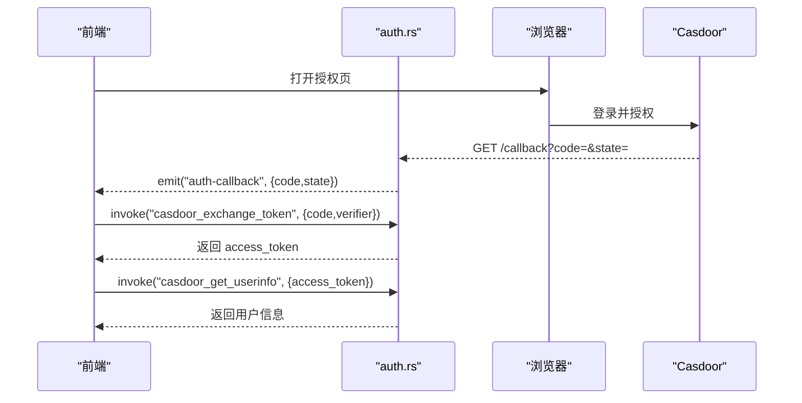
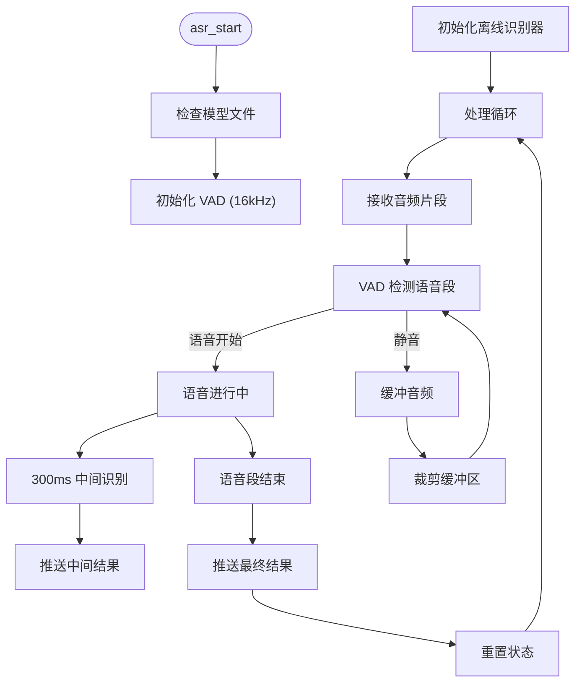
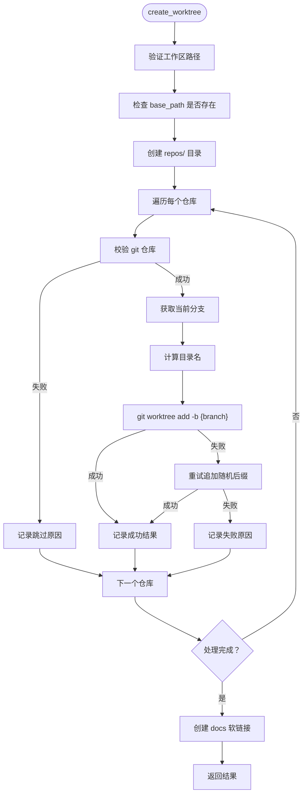
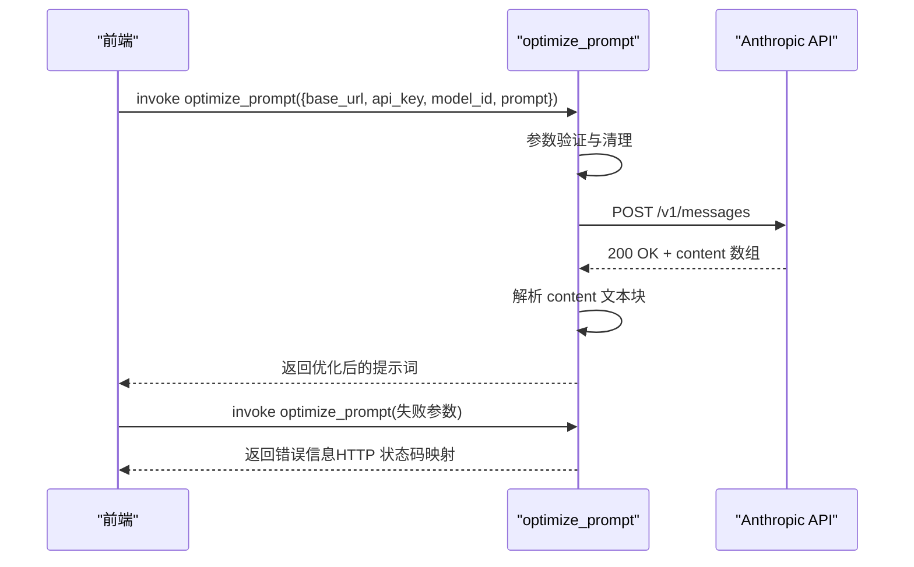
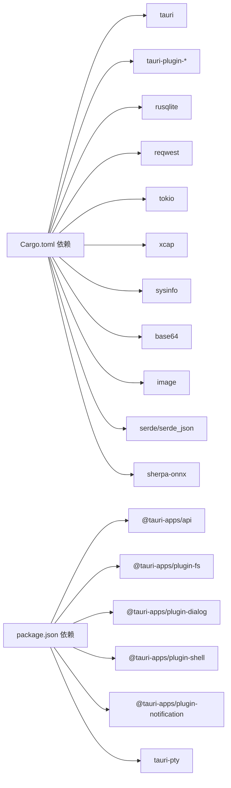

# Tauri 后端

<cite>
**本文引用的文件**
- [Cargo.toml](file://src-tauri/Cargo.toml)
- [main.rs](file://src-tauri/src/main.rs)
- [lib.rs](file://src-tauri/src/lib.rs)
- [tauri.conf.json](file://src-tauri/tauri.conf.json)
- [package.json](file://package.json)
- [db.rs](file://src-tauri/src/db.rs)
- [network.rs](file://src-tauri/src/network.rs)
- [sidecar.rs](file://src-tauri/src/sidecar.rs)
- [auth.rs](file://src-tauri/src/auth.rs)
- [gitnexus.rs](file://src-tauri/src/gitnexus.rs)
- [integration.rs](file://src-tauri/src/integration.rs)
- [feedback.rs](file://src-tauri/src/feedback.rs)
- [model_test.rs](file://src-tauri/src/model_test.rs)
- [ecc.rs](file://src-tauri/src/ecc.rs)
- [index.ts](file://sidecar/src/index.ts)
- [voice.rs](file://src-tauri/src/voice.rs)
- [worktree.rs](file://src-tauri/src/worktree.rs)
- [prompt_optimize.rs](file://src-tauri/src/prompt_optimize.rs)
</cite>

## 目录
1. [简介](#简介)
2. [项目结构](#项目结构)
3. [核心组件](#核心组件)
4. [架构总览](#架构总览)
5. [详细组件分析](#详细组件分析)
6. [依赖关系分析](#依赖关系分析)
7. [性能考量](#性能考量)
8. [故障排查指南](#故障排查指南)
9. [结论](#结论)
10. [附录](#附录)

## 简介
本文件面向 RabbitCoding 的 Tauri 后端，系统性梳理 Rust 后端设计与实现、Tauri 插件体系、文件系统与网络能力、命令接口与错误处理、前后端通信协议与安全策略、性能优化与并发处理、第三方库使用与依赖管理、版本兼容性等。文档既服务于开发者，也兼顾对技术背景有限的读者。

**更新** 本次更新新增了语音处理、工作树管理和提示优化三大核心功能模块，显著扩展了后端的能力边界。

## 项目结构
RabbitCoding 的后端位于 src-tauri 目录，采用 Tauri 2 的原生 Rust 侧与前端 React/Vite 前端协同。Rust 后端通过 Tauri 的命令系统暴露能力，前端通过 @tauri-apps/api 调用。构建产物包含：
- Tauri 应用壳与插件（dialog/fs/shell/notification/pty/window-state/deep-link/opener）
- 内置 Node.js 运行时与 sidecar 资源
- SQLite 数据库存储工作区与对话历史
- **新增** 语音识别引擎（sherpa-onnx）与模型管理
- **新增** Git 工作树管理与镜像同步
- **新增** AI 提示词优化服务

**图示来源**
- [lib.rs:125-316](file://src-tauri/src/lib.rs#L125-L316)
- [tauri.conf.json:1-52](file://src-tauri/tauri.conf.json#L1-L52)
- [Cargo.toml:20-39](file://src-tauri/Cargo.toml#L20-L39)
- [voice.rs:1-110](file://src-tauri/src/voice.rs#L1-L110)
- [worktree.rs:1-60](file://src-tauri/src/worktree.rs#L1-L60)
- [prompt_optimize.rs:1-25](file://src-tauri/src/prompt_optimize.rs#L1-L25)

**章节来源**
- [Cargo.toml:1-41](file://src-tauri/Cargo.toml#L1-L41)
- [tauri.conf.json:1-52](file://src-tauri/tauri.conf.json#L1-L52)
- [lib.rs:125-316](file://src-tauri/src/lib.rs#L125-L316)

## 核心组件
- 应用入口与生命周期
  - 入口函数 main.rs 调用 lib.rs::run，初始化 Builder、注册插件、管理数据库、启动本地 OAuth 回调服务、注入内置 Node.js PATH、监听窗口事件并持久化状态。
- 数据层
  - db.rs 提供工作区/兔子/仓库/消息四表的建模与 CRUD，支持事务全量导入导出、列迁移、序列化为前端所需的驼峰字段。
- 网络诊断
  - network.rs 提供 DNS/PING/HTTP/MKT 等诊断，跨平台解析系统代理、调用系统工具收集指标，返回统一结构。
- Sidecar 进程桥接
  - sidecar.rs 启停外部进程（sidecar-bundle.js），注入环境变量（含 CLAUDE_CONFIG_DIR 隔离），转发 stdout/stderr 事件，支持发送 JSON 命令与优雅关闭。
- 认证与授权
  - auth.rs 启动本地 loopback 回调服务，处理 Casdoor OAuth 交换 token 与获取用户信息，前端通过事件接收回调。
- 第三方集成
  - gitnexus.rs 通过内置 Node/npm 安装/卸载/检测 gitnexus CLI，后台执行分析并实时上报进度事件。
  - integration.rs 实现 GitHub Device Flow 的设备码申请、轮询令牌与用户信息获取。
- 反馈与诊断
  - feedback.rs 截取应用窗口、采集系统与 WebView 性能指标、提交反馈。
- 模型连通性测试
  - model_test.rs 向 anthropic 兼容端点发起最小请求，校验 base_url/api_key/model_id。
- ECC 管理
  - ecc.rs 检测/安装/卸载 ECC，扫描 ~/.claude 下相关目录与文件。
- **新增** 语音处理引擎
  - voice.rs 基于 sherpa-onnx 的实时语音识别，支持多模型、多镜像源、VAD 检测、离线识别。
- **新增** 工作树管理
  - worktree.rs 管理 Git 工作树的创建、删除、列表，支持软链接同步与分支管理。
- **新增** 提示优化服务
  - prompt_optimize.rs 通过 Anthropic Messages API 优化用户提示词，支持多语言保持与结构化输出。

**章节来源**
- [main.rs:1-7](file://src-tauri/src/main.rs#L1-L7)
- [lib.rs:125-316](file://src-tauri/src/lib.rs#L125-L316)
- [db.rs:1-417](file://src-tauri/src/db.rs#L1-L417)
- [network.rs:1-864](file://src-tauri/src/network.rs#L1-L864)
- [sidecar.rs:1-359](file://src-tauri/src/sidecar.rs#L1-L359)
- [auth.rs:1-376](file://src-tauri/src/auth.rs#L1-L376)
- [gitnexus.rs:1-761](file://src-tauri/src/gitnexus.rs#L1-L761)
- [integration.rs:1-231](file://src-tauri/src/integration.rs#L1-L231)
- [feedback.rs:1-282](file://src-tauri/src/feedback.rs#L1-L282)
- [model_test.rs:1-217](file://src-tauri/src/model_test.rs#L1-L217)
- [ecc.rs:1-355](file://src-tauri/src/ecc.rs#L1-L355)
- [voice.rs:1-1014](file://src-tauri/src/voice.rs#L1-L1014)
- [worktree.rs:1-414](file://src-tauri/src/worktree.rs#L1-L414)
- [prompt_optimize.rs:1-245](file://src-tauri/src/prompt_optimize.rs#L1-L245)

## 架构总览
Rust 后端以 Tauri Builder 为核心，集中注册插件与命令，管理全局状态（如数据库、Sidecar 进程状态），并通过事件系统与前端通信。前端通过 @tauri-apps/api 的 invoke/emit/on 与后端交互；后端通过 tauri::Emitter 发布 sidecar/gitnexus 等异步事件。

**图示来源**
- [lib.rs:272-313](file://src-tauri/src/lib.rs#L272-L313)
- [sidecar.rs:216-243](file://src-tauri/src/sidecar.rs#L216-L243)
- [index.ts:37-91](file://sidecar/src/index.ts#L37-L91)

## 详细组件分析

### 数据库与状态持久化（db.rs）
- 数据模型
  - 工作区（workspaces）、兔子（rabbits）、仓库（repos）、消息（messages）四表，rabbits/messages/repo 与 workspaces 通过外键关联，CASCADE 删除。
  - 使用 serde 的 camelCase 序列化，字段与前端一致。
- 初始化与迁移
  - 打开/创建数据库并执行建表 SQL；对既有数据库进行列迁移（幂等）。
- 读写流程
  - 导出：按 created_at 顺序查询 workspaces，再对每个工作区查询 rabbits、messages（按 seq 升序），最终序列化为 JSON。
  - 导入：开启事务，清空四表后按顺序插入；messages 以 seq 递增写入。
- 并发与锁
  - 通过 Mutex<Connection> 保护连接，命令中获取锁后再执行 SQL。

**图示来源**
- [db.rs:167-288](file://src-tauri/src/db.rs#L167-L288)
- [db.rs:290-386](file://src-tauri/src/db.rs#L290-L386)

**章节来源**
- [db.rs:1-417](file://src-tauri/src/db.rs#L1-L417)

### 网络诊断（network.rs）
- 诊断目标
  - DNS：中心域名列表，跨平台 dig/nslookup，提取 A 记录与 DNS 服务器。
  - HTTP：预设端点，使用 curl 获取状态码、HTTP 版本、TLS 版本、远端 IP、响应时间。
  - PING：跨平台 ping，解析丢包率与 RTT。
  - Marketplace：检测市场可达性与可用性。
- 代理检测
  - 优先读取环境变量，其次系统代理（Windows netsh、macOS scutil），返回 ProxyInfo。
- 异步执行
  - 通过 tokio::task::spawn_blocking 在阻塞线程池执行系统命令，避免阻塞事件循环。

**图示来源**
- [network.rs:100-201](file://src-tauri/src/network.rs#L100-L201)
- [network.rs:207-375](file://src-tauri/src/network.rs#L207-L375)
- [network.rs:391-550](file://src-tauri/src/network.rs#L391-L550)

**章节来源**
- [network.rs:1-864](file://src-tauri/src/network.rs#L1-L864)

### Sidecar 进程桥接（sidecar.rs）
- 进程生命周期
  - start_sidecar：清理残留句柄，构建 Command，注入环境变量（含 CLAUDE_CONFIG_DIR 隔离），启动 stdout/stderr 读取线程，发布 agent:message 事件。
  - send_to_sidecar：向 stdin 写入 JSON 命令。
  - stop_sidecar：先发送 shutdown 命令，等待优雅退出，随后 kill。
  - get_sidecar_status：查询运行状态。
- 资源定位
  - 开发模式：优先使用已编译的 dist/index.js，否则使用 npx tsx 直接运行 TS 源码。
  - 生产模式：使用内置 Node.js 与 sidecar-bundle.js。
- 事件协议
  - 后端通过 Emitter 发布 agent:message；前端订阅并更新 UI。

**图示来源**
- [sidecar.rs:60-214](file://src-tauri/src/sidecar.rs#L60-L214)
- [sidecar.rs:216-270](file://src-tauri/src/sidecar.rs#L216-L270)
- [index.ts:37-91](file://sidecar/src/index.ts#L37-L91)

**章节来源**
- [sidecar.rs:1-359](file://src-tauri/src/sidecar.rs#L1-L359)
- [index.ts:1-145](file://sidecar/src/index.ts#L1-L145)

### 认证与授权（auth.rs）
- 本地 OAuth 回调
  - 启动 TCP Listener 监听 127.0.0.1:17331，解析 /callback?code=&state=，通过事件通知前端，返回"登录成功/失败"页面。
- Casdoor 令牌交换与用户信息
  - casdoor_exchange_token：使用 authorization_code + code_verifier 换取 access_token。
  - casdoor_get_userinfo：携带 Bearer Token 获取用户信息。
  - casdoor_complete_login：组合命令，一次性完成 token 交换与用户信息获取。
- 安全要点
  - 使用 loopback 回调避免注册自定义 scheme，前后端行为一致；日志输出到 stderr，避免污染 stdout 协议。

**图示来源**
- [auth.rs:258-350](file://src-tauri/src/auth.rs#L258-L350)
- [auth.rs:118-245](file://src-tauri/src/auth.rs#L118-L245)

**章节来源**
- [auth.rs:1-376](file://src-tauri/src/auth.rs#L1-L376)

### 第三方集成（gitnexus.rs）
- 内置 Node/npm 管道
  - 通过内置 node-runtime 与 npm-cli.js 安装/卸载/检测 gitnexus CLI，确保 dev/prod 一致且不依赖系统 PATH。
- 后台任务与进度事件
  - analyze/group_sync 等操作在阻塞线程池执行，实时 emit gitnexus-progress 事件，前端可显示进度。
- 路径与隔离
  - 使用 app_data_dir 下的 npm-global 作为 prefix，避免系统权限问题；对 docs 目录使用 --skip-git 以避免误索引到上级仓库根。

**章节来源**
- [gitnexus.rs:1-761](file://src-tauri/src/gitnexus.rs#L1-L761)

### GitHub Device Flow（integration.rs）
- 设备码申请：POST /login/device/code 获取 device_code/user_code/verification_uri。
- 轮询令牌：POST /login/oauth/access_token，根据 error 类型返回 pending/slow_down/expired/error。
- 获取用户信息：GET /user 携带 Bearer Token。

**章节来源**
- [integration.rs:1-231](file://src-tauri/src/integration.rs#L1-L231)

### 反馈与诊断（feedback.rs）
- 屏幕截图：基于 xcap 捕获应用窗口，转 RGB8 并编码为 JPEG，返回 base64 与尺寸。
- 系统信息：采集 OS/版本/架构/应用版本/标识/CPU/内存等。
- 性能指标：采集应用进程 CPU/内存与系统整体 CPU/内存使用，结合前端 WebView 指标。
- 提交反馈：POST 到服务端 API，解析返回的 ticketId。

**章节来源**
- [feedback.rs:1-282](file://src-tauri/src/feedback.rs#L1-L282)

### 模型连通性测试（model_test.rs）
- 行为说明
  - 向 {base_url}/v1/messages 发起最小请求，校验 API Key、模型 ID 与端点正确性。
  - 区分超时/连接错误/HTTP 状态码，返回友好错误与截断的原始响应体。
- 与 sidecar 一致性
  - URL 拼接规则与 SDK 一致，测试通过即等价于 sidecar 实际调用可用。

**章节来源**
- [model_test.rs:1-217](file://src-tauri/src/model_test.rs#L1-L217)

### ECC 管理（ecc.rs）
- 检测：扫描 ~/.claude/agents 与 skills 目录，识别 ECC 相关文件；检测 ecc2/state-store 目录。
- 安装：通过 npx ecc-install --profile minimal --target claude，实时 emit 进度事件。
- 卸载：删除 ecc2/state-store 与相关文件/目录。

**章节来源**
- [ecc.rs:1-355](file://src-tauri/src/ecc.rs#L1-L355)

### **新增** 语音处理引擎（voice.rs）

#### 功能概述
基于 sherpa-onnx 的实时语音识别系统，提供接近语音输入法体验的语音转文字能力。系统采用 VAD（Voice Activity Detection）+ SenseVoice 的分段识别策略，支持多模型、多镜像源、离线识别。

#### 核心特性
- **实时识别**：VAD 检测语音段 → 每段调用 SenseVoice 离线识别 → 通过 Tauri event 推送结果
- **多模型支持**：当前支持 SenseVoice-Small，支持中/英/日/韩/粤语
- **多镜像源**：GitHub（全球）与 ModelScope（国内加速）双镜像源
- **离线识别**：模型文件打包到应用资源，无需在线下载
- **标点恢复**：支持中文标点与 ITN（Inverse Text Normalization）

#### 模型管理
- **模型定义**：支持多个模型配置，包含文件列表与近似大小
- **镜像源管理**：GitHub 与 ModelScope 双镜像源，自动选择最优源
- **下载机制**：支持增量下载、断点续传、压缩包解压
- **配置持久化**：模型与镜像源配置持久化到 app_data_dir

#### 语音识别流程

**图示来源**
- [voice.rs:612-822](file://src-tauri/src/voice.rs#L612-L822)

#### 事件协议
- **asr://status**：状态变化事件（downloading/ready/listening/idle）
- **asr://download_progress**：模型下载进度事件
- **asr://partial**：中间识别结果（isFinal=false）
- **asr://final**：最终识别结果（isFinal=true）
- **asr://error**：错误事件

#### 命令接口
- `asr_status`：查询 ASR 状态（模型状态、监听状态）
- `asr_ensure_model`：确保模型已下载
- `asr_redownload_model`：重新下载指定模型
- `asr_start`：开始语音识别会话
- `asr_feed_chunk`：喂入音频数据
- `asr_stop`：停止语音识别会话
- `asr_list_models`：列出可用模型
- `asr_get_config`：获取当前配置
- `asr_set_config`：设置语音配置

**章节来源**
- [voice.rs:1-1014](file://src-tauri/src/voice.rs#L1-L1014)

### **新增** 工作树管理（worktree.rs）

#### 功能概述
Git 工作树管理系统，允许为工作区创建多个独立的工作树镜像，支持多仓库管理、分支隔离与软链接同步。

#### 核心功能
- **工作树创建**：为多个仓库创建独立的工作树，支持自定义分支名
- **工作树删除**：安全删除工作树，清理软链接与残留目录
- **工作树列表**：扫描并列出所有工作树，按创建时间排序
- **软链接同步**：自动创建 docs 目录软链接，实现多工作树共享

#### 数据结构
- **CreateWorktreeInput**：创建工作树的输入参数
- **WorktreeRepoInput**：仓库输入信息（repo_id, repo_name, path）
- **WorktreeRepoResult**：仓库处理结果（包含跳过原因）
- **CreateWorktreeOutput**：创建工作树的输出结果
- **RemoveWorktreeInput**：删除工作树的输入参数
- **WorktreeListEntry**：工作树列表条目

#### 工作树创建流程

**图示来源**
- [worktree.rs:163-280](file://src-tauri/src/worktree.rs#L163-L280)

#### 命令接口
- `create_worktree`：创建工作树镜像
- `remove_worktree`：删除工作树镜像
- `list_worktrees`：列出所有工作树

#### 软链接策略
- **源目录**：workspace/.rabbit/docs
- **目标目录**：worktree_base_path/docs
- **跨平台支持**：Unix 使用符号链接，Windows 降级为普通目录

**章节来源**
- [worktree.rs:1-414](file://src-tauri/src/worktree.rs#L1-L414)

### **新增** 提示优化服务（prompt_optimize.rs）

#### 功能概述
基于 Anthropic Messages API 的智能提示词优化服务，将用户的原始需求改写为清晰、结构化、可执行的提示词。

#### 核心特性
- **智能优化**：保持原文语言，输出结构化提示词正文
- **规则约束**：检测语言、结构化输出、保持原意、合理假设
- **长文本支持**：60秒超时，支持复杂需求的详细描述
- **错误处理**：友好的错误信息与响应体截断

#### 优化规则
1. **语言保持**：输入什么语言，输出什么语言
2. **结构化**：包含目标、关键约束、预期输出、边界条件
3. **原意保持**：不虚构技术细节、库或需求
4. **简洁完整**：用明确假设扩展模糊部分
5. **纯文本**：仅输出优化后的提示词正文

#### 请求流程

**图示来源**
- [prompt_optimize.rs:85-235](file://src-tauri/src/prompt_optimize.rs#L85-L235)

#### 命令接口
- `optimize_prompt`：优化提示词（异步命令）

#### 错误处理
- **HTTP 401/403**：认证失败（API Key 错误或无访问权限）
- **HTTP 404**：端点不存在（Base URL 错误）
- **HTTP 400**：请求被拒绝（modelId 不存在或参数非法）
- **HTTP 429**：请求过于频繁（触发限流）
- **HTTP 5xx**：服务端错误
- **超时**：60秒超时（REQUEST_TIMEOUT_SECS）

**章节来源**
- [prompt_optimize.rs:1-245](file://src-tauri/src/prompt_optimize.rs#L1-L245)

## 依赖关系分析
- Rust 依赖
  - tauri、tauri-plugin-*：应用壳与插件生态
  - rusqlite：SQLite 访问
  - reqwest：HTTP 客户端
  - tokio：异步运行时
  - xcap/sysinfo/base64/image：屏幕捕获、系统信息、编码与性能采集
  - serde/serde_json：序列化与反序列化
  - **新增** sherpa-onnx：语音识别引擎
- 前端依赖
  - @tauri-apps/api 与各插件：文件系统、对话框、通知、Shell、PTY、深链等
  - React/antd/monaco-editor 等：UI 与编辑器

**图示来源**
- [Cargo.toml:20-41](file://src-tauri/Cargo.toml#L20-L41)
- [package.json:14-36](file://package.json#L14-L36)

**章节来源**
- [Cargo.toml:1-41](file://src-tauri/Cargo.toml#L1-L41)
- [package.json:1-46](file://package.json#L1-L46)

## 性能考量
- 异步与阻塞分离
  - 网络诊断、gitnexus 分析、ECC 安装、屏幕捕获、**语音识别处理**等 I/O 密集任务通过 tokio::task::spawn_blocking 放入阻塞线程池，避免阻塞事件循环。
- 数据库事务
  - 导入流程使用 BEGIN/COMMIT/ROLLBACK，批量写入减少磁盘碎片与锁竞争。
- 资源隔离与缓存
  - 内置 Node.js 与 npm prefix 避免重复下载与权限问题；CLAUDE_CONFIG_DIR 隔离配置，减少全局资源泄漏。
  - **新增** 语音模型文件缓存，避免重复下载；VAD 模型从打包资源复制，无需网络。
- 事件驱动
  - sidecar/gitnexus 通过事件流推送进度，前端按需渲染，降低轮询成本。
  - **新增** 语音识别通过事件流推送中间与最终结果，实现实时交互。
- I/O 优化
  - 屏幕截图使用 JPEG 编码并控制质量，减少体积；消息表按 seq 排序，读取时顺序遍历，避免随机 IO。
  - **新增** 语音识别采用分段处理，300ms 中间结果推送，平衡延迟与准确性。

## 故障排查指南
- 数据库初始化失败
  - 现象：应用启动后数据库不可用，前端降级到本地存储。
  - 排查：检查 app_data_dir 创建权限、数据库文件路径与权限。
- Sidecar 启动失败
  - 现象：无法启动/无事件返回。
  - 排查：确认内置 Node.js 路径存在、sidecar-bundle.js 可用、环境变量注入正确（尤其是 CLAUDE_CONFIG_DIR）。
- OAuth 回调失败
  - 现象：浏览器重定向后无事件或错误页面。
  - 排查：确认 127.0.0.1:17331 可绑定、防火墙放行、前端已注册 auth-callback 事件监听。
- 网络诊断异常
  - 现象：DNS/PING/HTTP 诊断失败。
  - 排查：检查系统代理、防火墙、DNS 工具可用性（dig/nslookup/curl/ping）。
- gitnexus 安装失败
  - 现象：安装卡住或报错。
  - 排查：确认内置 npm-cli.js 存在、npm global prefix 可写、网络可达、跳过可选语法树编译的环境变量设置。
- 反馈提交失败
  - 现象：服务端返回错误或无响应。
  - 排查：检查网络连通性、服务端地址、请求体结构与大小限制。
- **新增** 语音识别失败
  - 现象：无法开始识别或无结果。
  - 排查：确认模型已下载、麦克风权限、音频格式正确（16kHz mono f32）、VAD 初始化成功。
- **新增** 工作树创建失败
  - 现象：git worktree add 失败或分支冲突。
  - 排查：检查仓库路径、分支名合法性、权限问题、软链接创建失败。
- **新增** 提示优化失败
  - 现象：优化请求超时或认证失败。
  - 排查：检查 Base URL 正确性、API Key 有效性、网络连通性、请求超时设置。

**章节来源**
- [lib.rs:141-149](file://src-tauri/src/lib.rs#L141-L149)
- [sidecar.rs:290-358](file://src-tauri/src/sidecar.rs#L290-L358)
- [auth.rs:258-350](file://src-tauri/src/auth.rs#L258-L350)
- [network.rs:207-375](file://src-tauri/src/network.rs#L207-L375)
- [gitnexus.rs:183-311](file://src-tauri/src/gitnexus.rs#L183-L311)
- [feedback.rs:238-281](file://src-tauri/src/feedback.rs#L238-L281)
- [voice.rs:824-858](file://src-tauri/src/voice.rs#L824-L858)
- [worktree.rs:163-280](file://src-tauri/src/worktree.rs#L163-L280)
- [prompt_optimize.rs:136-235](file://src-tauri/src/prompt_optimize.rs#L136-L235)

## 结论
RabbitCoding 的 Tauri 后端以模块化方式组织，围绕 Tauri 命令系统与插件生态构建，覆盖数据库、网络诊断、外部进程桥接、认证授权、第三方工具集成、反馈与性能采集等关键能力。**本次更新显著增强了后端的功能边界**，新增的语音处理引擎提供了实时语音识别能力，工作树管理系统支持多仓库并行开发，提示优化服务提升了AI交互体验。通过事件驱动与异步执行，兼顾易用性与性能；通过内置 Node 与资源打包，提升跨平台一致性与安全性。建议在后续迭代中进一步完善错误分类与可观测性、增强并发场景下的锁粒度与批处理策略。

## 附录
- 前后端通信协议
  - 命令调用：前端通过 @tauri-apps/api 的 invoke 调用后端命令，返回值为 JSON。
  - 事件通信：后端通过 Emitter 发布事件（如 agent:message、gitnexus-progress、auth-callback、**asr://status**、**asr://download_progress**），前端订阅并更新 UI。
- 安全考虑
  - 本地 OAuth 回调使用 loopback，避免自定义 scheme 注册；CLAUDE_CONFIG_DIR 隔离用户全局配置。
  - 内置 Node/npm prefix 与 PATH 注入，避免系统权限问题与路径污染。
  - **新增** 语音模型文件权限控制，避免恶意替换。
- 版本与兼容性
  - Tauri 2 与插件版本在 Cargo.toml 与 package.json 中声明；前端 @tauri-apps/* 与插件版本与 CLI 保持一致。
  - **新增** sherpa-onnx 1.13 版本，支持静态链接。
- 集成指导
  - 新增命令：在 lib.rs 中注册 invoke_handler，并在前端通过 invoke 调用。
  - 新增事件：在命令中使用 app.emit 发布事件，前端通过 tauri::listen 订阅。
  - 新增插件：在 lib.rs 的 Builder 中启用相应插件并在 Cargo.toml 中声明版本。
  - **新增** 语音处理：前端通过 asr://* 事件与语音识别模块交互，支持实时语音输入。
  - **新增** 工作树管理：前端通过 create_worktree/remove_worktree/list_worktrees 命令管理 Git 工作树。
  - **新增** 提示优化：前端通过 optimize_prompt 命令调用 AI 提示词优化服务。