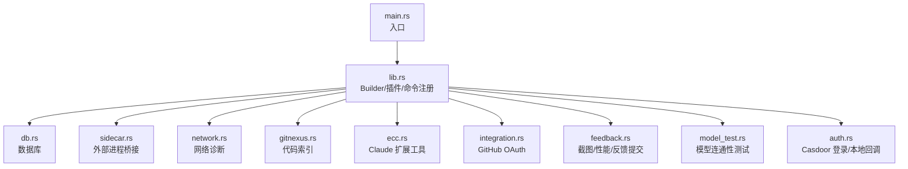
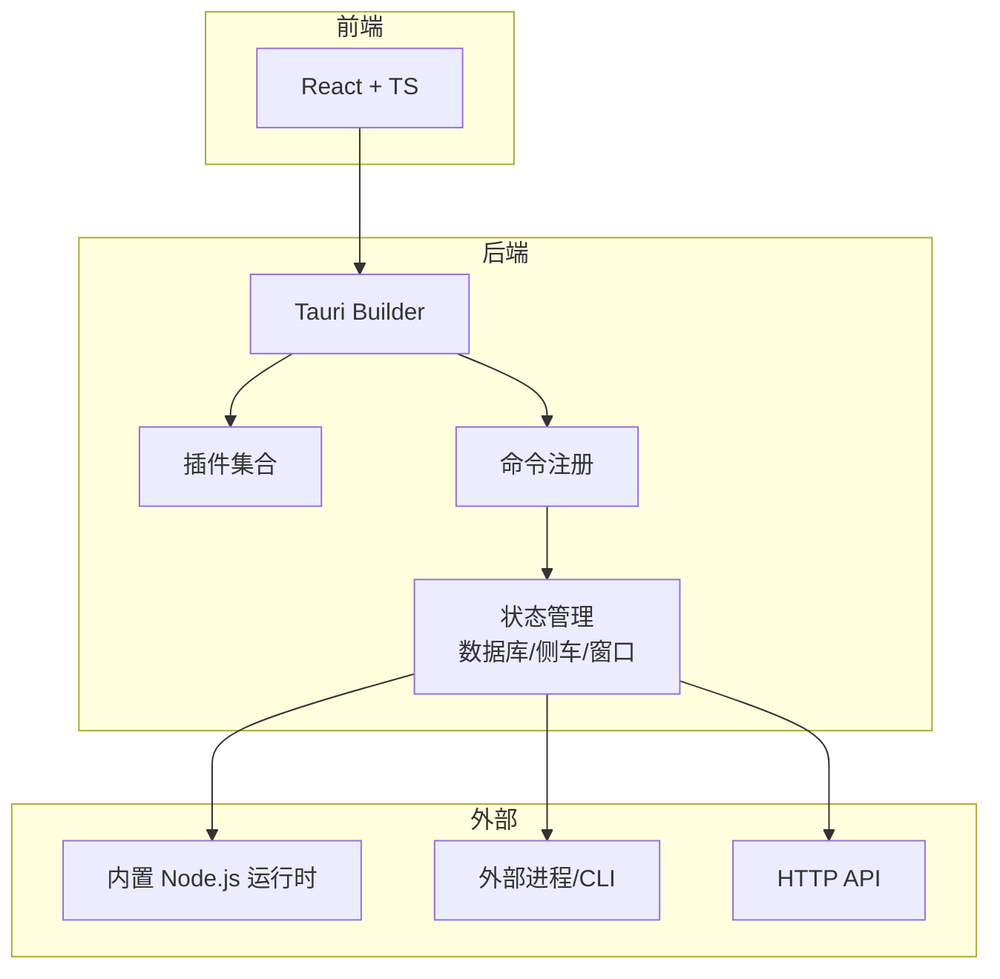
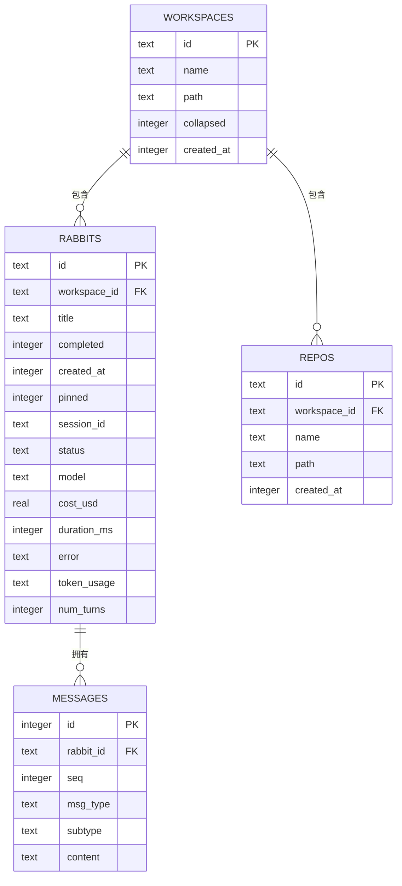
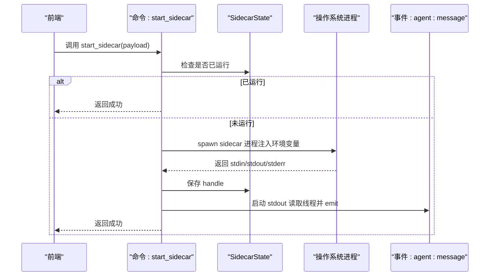
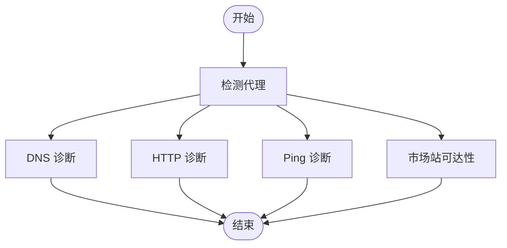
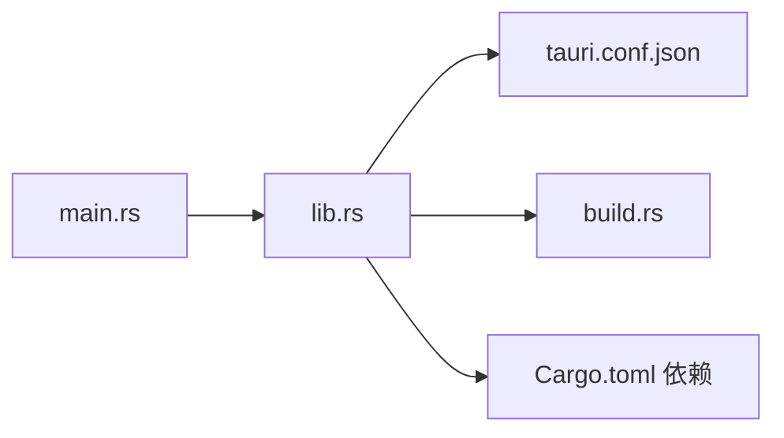

# 后端架构设计

<cite>
**本文引用的文件**
- [main.rs](file://src-tauri/src/main.rs)
- [lib.rs](file://src-tauri/src/lib.rs)
- [Cargo.toml](file://src-tauri/Cargo.toml)
- [tauri.conf.json](file://src-tauri/tauri.conf.json)
- [build.rs](file://src-tauri/build.rs)
- [db.rs](file://src-tauri/src/db.rs)
- [sidecar.rs](file://src-tauri/src/sidecar.rs)
- [network.rs](file://src-tauri/src/network.rs)
- [gitnexus.rs](file://src-tauri/src/gitnexus.rs)
- [ecc.rs](file://src-tauri/src/ecc.rs)
- [integration.rs](file://src-tauri/src/integration.rs)
- [feedback.rs](file://src-tauri/src/feedback.rs)
- [model_test.rs](file://src-tauri/src/model_test.rs)
- [auth.rs](file://src-tauri/src/auth.rs)
</cite>

## 目录
1. [简介](#简介)
2. [项目结构](#项目结构)
3. [核心组件](#核心组件)
4. [架构总览](#架构总览)
5. [详细组件分析](#详细组件分析)
6. [依赖关系分析](#依赖关系分析)
7. [性能考虑](#性能考虑)
8. [故障排除指南](#故障排除指南)
9. [结论](#结论)
10. [附录](#附录)

## 简介
本文件面向 RabbitCoding 的 Tauri 后端（Rust 层）提供系统化的技术文档，聚焦以下主题：
- 整体架构模式与模块组织
- 初始化流程与生命周期管理
- Tauri Builder 配置与插件系统
- 命令注册机制与异步处理
- 启动流程、错误处理策略
- 架构决策的技术考量、性能优化与内存管理
- 实操指引：新增命令、集成第三方插件、处理异步操作

## 项目结构
后端位于 src-tauri 目录，采用“模块化功能 + Tauri 命令”的组织方式：
- 入口与运行时：main.rs（入口）、lib.rs（构建器、插件、命令注册、生命周期）
- 配置：tauri.conf.json（窗口、安全、打包、插件）、Cargo.toml（依赖与特性）、build.rs（资源占位）
- 功能模块：db（SQLite 数据持久化）、sidecar（外部进程桥接）、network（网络诊断）、gitnexus（代码索引）、ecc（Claude 扩展工具）、integration（GitHub OAuth）、feedback（截图与性能采集）、model_test（模型连通性测试）、auth（Casdoor 登录与本地回调）

图表来源
- [main.rs:1-7](file://src-tauri/src/main.rs#L1-L7)
- [lib.rs:1-317](file://src-tauri/src/lib.rs#L1-L317)
- [db.rs:1-417](file://src-tauri/src/db.rs#L1-L417)
- [sidecar.rs:1-359](file://src-tauri/src/sidecar.rs#L1-L359)
- [network.rs:1-864](file://src-tauri/src/network.rs#L1-L864)
- [gitnexus.rs:1-761](file://src-tauri/src/gitnexus.rs#L1-L761)
- [ecc.rs:1-355](file://src-tauri/src/ecc.rs#L1-L355)
- [integration.rs:1-231](file://src-tauri/src/integration.rs#L1-L231)
- [feedback.rs:1-282](file://src-tauri/src/feedback.rs#L1-L282)
- [model_test.rs:1-217](file://src-tauri/src/model_test.rs#L1-L217)
- [auth.rs:1-376](file://src-tauri/src/auth.rs#L1-L376)

章节来源
- [main.rs:1-7](file://src-tauri/src/main.rs#L1-L7)
- [lib.rs:1-317](file://src-tauri/src/lib.rs#L1-L317)
- [Cargo.toml:1-40](file://src-tauri/Cargo.toml#L1-L40)
- [tauri.conf.json:1-52](file://src-tauri/tauri.conf.json#L1-L52)
- [build.rs:1-45](file://src-tauri/build.rs#L1-L45)

## 核心组件
- Tauri Builder 与插件系统
  - 默认 Builder，注册对话框、文件系统、打开器、PTY、窗口状态、通知、深链接等插件
  - 在 setup 阶段创建应用数据目录、初始化 SQLite 数据库、启动本地 OAuth 回调 HTTP 服务、注入内置 Node.js 运行时 PATH 与 NPM 前缀、监听窗口事件并保存状态
- 命令注册
  - 通过 generate_handler! 将各模块命令集中注册，覆盖侧车控制、数据库、网络诊断、代码索引、扩展工具、OAuth、反馈、模型测试、认证等
- 异步与并发
  - 大量命令使用 async/await，配合 tokio::task::spawn_blocking 执行系统调用（如 curl、ping、截图、进程 IO）
  - 子进程 stdout/stderr 通过线程读取并以事件形式上报前端

章节来源
- [lib.rs:124-316](file://src-tauri/src/lib.rs#L124-L316)
- [Cargo.toml:20-39](file://src-tauri/Cargo.toml#L20-L39)
- [tauri.conf.json:44-50](file://src-tauri/tauri.conf.json#L44-L50)

## 架构总览
RabbitCoding 后端采用“轻量嵌入式应用框架 + 多功能模块”的设计：
- 前端（React + TS）通过 Tauri invoke 调用后端命令
- 后端通过 Builder 组合插件，集中注册命令，统一管理状态（数据库、侧车、窗口状态）
- 外部能力通过子进程或 HTTP 客户端实现，确保与前端一致的用户体验

图表来源
- [lib.rs:124-316](file://src-tauri/src/lib.rs#L124-L316)
- [db.rs:80-161](file://src-tauri/src/db.rs#L80-L161)
- [sidecar.rs:59-214](file://src-tauri/src/sidecar.rs#L59-L214)
- [network.rs:366-375](file://src-tauri/src/network.rs#L366-L375)
- [gitnexus.rs:182-311](file://src-tauri/src/gitnexus.rs#L182-L311)
- [integration.rs:140-230](file://src-tauri/src/integration.rs#L140-L230)
- [feedback.rs:119-235](file://src-tauri/src/feedback.rs#L119-L235)
- [model_test.rs:78-207](file://src-tauri/src/model_test.rs#L78-L207)
- [auth.rs:258-350](file://src-tauri/src/auth.rs#L258-L350)

## 详细组件分析

### 数据库模块（db.rs）
职责
- 提供工作区、兔子、仓库、消息的建模与持久化
- 提供全量导入/导出、是否存在数据等命令
- 使用 SQLite（rusqlite）与 WAL、外键约束、索引优化

关键点
- 数据结构采用 camelCase 与前端对齐
- Schema 初始化与列迁移（幂等）
- 导入：按工作区聚合，批量插入；导出：JSON 序列化
- 事务封装，失败回滚

图表来源
- [db.rs:85-138](file://src-tauri/src/db.rs#L85-L138)

章节来源
- [db.rs:1-417](file://src-tauri/src/db.rs#L1-L417)

### 侧车模块（sidecar.rs）
职责
- 管理外部 sidecar 进程（Node.js 脚本）
- 注入环境变量（API Key、Base URL、Claude 配置根目录隔离）
- 读取 stdout/stderr 并以事件上报前端
- 提供启动、停止、发送消息、状态查询命令

关键技术点
- 进程生命周期管理：try_wait 检查存活、优雅关闭与强制 kill
- 环境隔离：清理父进程遗留的 ANTHROPIC_* 变量，重定向 CLAUDE_CONFIG_DIR
- 资源路径：开发/生产模式分别定位脚本与内置 Node.js

图表来源
- [sidecar.rs:59-214](file://src-tauri/src/sidecar.rs#L59-L214)

章节来源
- [sidecar.rs:1-359](file://src-tauri/src/sidecar.rs#L1-L359)

### 网络诊断模块（network.rs）
职责
- DNS 解析、HTTP 连通性、Ping、市场站可达性诊断
- 代理检测（环境变量与系统设置）
- 跨平台命令调用（dig/nslookup/curl/ping）

实现要点
- 代理检测：优先环境变量，其次系统命令（Windows netsh、macOS/Linux scutil）
- DNS：Windows 使用 nslookup，类 Unix 使用 dig +short
- HTTP：两阶段采集（-w 获取指标，-v 解析 TLS/远端 IP）
- Ping：解析不同平台输出，提取丢包率与 RTT

图表来源
- [network.rs:100-201](file://src-tauri/src/network.rs#L100-L201)
- [network.rs:207-364](file://src-tauri/src/network.rs#L207-L364)
- [network.rs:391-536](file://src-tauri/src/network.rs#L391-L536)
- [network.rs:556-800](file://src-tauri/src/network.rs#L556-L800)

章节来源
- [network.rs:1-864](file://src-tauri/src/network.rs#L1-L864)

### 代码索引模块（gitnexus.rs）
职责
- 通过内置 Node.js 运行 gitnexus CLI
- 安装/卸载/检测、索引路径、列出仓库、组管理与同步
- 实时进度事件上报

实现要点
- 资源路径解析：dev/prod 双保险，定位内置 node 与 npm-cli.js
- 安装：npm install -g --prefix 应用私有目录，跳过可选语法树编译
- 索引：子进程 stdout/stderr 分线程读取并 emit 进度

章节来源
- [gitnexus.rs:1-761](file://src-tauri/src/gitnexus.rs#L1-L761)

### 扩展工具模块（ecc.rs）
职责
- 检测、安装、卸载 ECC（Claude 扩展工具）
- 通过 npx ecc-install 安装，按用户主目录隔离

实现要点
- npx 查找：跨平台定位 npx 可执行文件
- 安装：后台线程读取 stdout/stderr 并上报进度

章节来源
- [ecc.rs:1-355](file://src-tauri/src/ecc.rs#L1-L355)

### 集成模块（integration.rs）
职责
- GitHub OAuth 设备码流程：申请设备码、轮询令牌、获取用户信息
- 使用 reqwest 异步 HTTP 客户端

章节来源
- [integration.rs:1-231](file://src-tauri/src/integration.rs#L1-L231)

### 反馈模块（feedback.rs）
职责
- 截图（xcap + image 编码）、系统信息收集、性能指标采集、反馈提交

实现要点
- 截图：基于窗口标题匹配，RGB8 编码为 JPEG，base64 返回
- 性能：结合 sysinfo 与前端 WebView 指标

章节来源
- [feedback.rs:1-282](file://src-tauri/src/feedback.rs#L1-L282)

### 模型测试模块（model_test.rs）
职责
- 向厂商兼容端点发起最小 Messages 请求，验证 Base URL/API Key/Model 配置

实现要点
- URL 规则与 SDK 一致，超时、鉴权、限流、服务端错误分类处理

章节来源
- [model_test.rs:1-217](file://src-tauri/src/model_test.rs#L1-L217)

### 认证模块（auth.rs）
职责
- Casdoor 登录：授权码交换、用户信息获取、本地 loopback 回调服务
- 本地回调：std::net TcpListener 监听 127.0.0.1:17331，解析 code/state 并 emit 事件

章节来源
- [auth.rs:1-376](file://src-tauri/src/auth.rs#L1-L376)

## 依赖关系分析
- 构建与运行
  - main.rs 仅调用 lib.rs::run，lib.rs 负责 Builder、插件、命令注册、生命周期
  - build.rs 确保 resources/ 占位文件存在，便于打包
  - tauri.conf.json 定义窗口、安全、打包资源与插件配置
  - Cargo.toml 声明依赖与特性（tokio rt-multi-thread、reqwest json、rusqlite bundled 等）

图表来源
- [main.rs:1-7](file://src-tauri/src/main.rs#L1-L7)
- [lib.rs:124-316](file://src-tauri/src/lib.rs#L124-L316)
- [tauri.conf.json:1-52](file://src-tauri/tauri.conf.json#L1-L52)
- [build.rs:1-45](file://src-tauri/build.rs#L1-L45)
- [Cargo.toml:1-40](file://src-tauri/Cargo.toml#L1-L40)

章节来源
- [main.rs:1-7](file://src-tauri/src/main.rs#L1-L7)
- [lib.rs:124-316](file://src-tauri/src/lib.rs#L124-L316)
- [tauri.conf.json:1-52](file://src-tauri/tauri.conf.json#L1-L52)
- [build.rs:1-45](file://src-tauri/build.rs#L1-L45)
- [Cargo.toml:1-40](file://src-tauri/Cargo.toml#L1-L40)

## 性能考虑
- 异步与阻塞分离
  - 大量系统调用（curl、ping、截图、进程 IO）通过 tokio::task::spawn_blocking 放入阻塞线程池，避免阻塞事件循环
- I/O 与网络
  - 使用 reqwest 异步客户端，合理设置超时；网络诊断分阶段采集指标，减少重复调用
- 数据库
  - WAL 模式、外键约束、索引优化；导入/导出使用事务，降低碎片与锁竞争
- 进程与资源
  - 内置 Node.js 运行时与 npm 前缀隔离，避免系统权限问题；侧车进程 stdout/stderr 线程化读取，防止阻塞与死锁
- 内存管理
  - 事件上报采用增量缓冲与截断策略（如模型测试错误响应截断），避免前端渲染压力

## 故障排除指南
- 数据库初始化失败
  - 现象：应用数据目录不可写或数据库打开失败
  - 处理：检查 app_data_dir 创建与权限；命令会降级到前端本地存储
- 侧车启动失败
  - 现象：spawn 失败或 stdin/stdout 不可用
  - 处理：检查 sidecar 脚本路径与内置 Node.js；确认环境变量注入与 CLAUDE_CONFIG_DIR 隔离
- 网络诊断异常
  - 现象：dig/nslookup/curl/ping 命令失败
  - 处理：确认系统工具可用；代理检测优先级与平台差异
- GitNexus 安装/索引失败
  - 现象：npm install/uninstall 失败或索引无输出
  - 处理：检查内置 node/npm-cli.js 路径；关注 stderr 累积信息
- 反馈截图失败
  - 现象：窗口枚举或编码失败
  - 处理：确认窗口标题匹配；JPEG 编码质量与尺寸
- 模型测试失败
  - 现象：超时、401/403、429、5xx
  - 处理：区分网络连接、鉴权、限流与服务端错误；查看截断后的响应体
- 认证回调
  - 现象：端口占用或回调参数解析失败
  - 处理：确认 127.0.0.1:17331 可用；检查 percent-decode 逻辑

章节来源
- [lib.rs:141-149](file://src-tauri/src/lib.rs#L141-L149)
- [sidecar.rs:151-164](file://src-tauri/src/sidecar.rs#L151-L164)
- [gitnexus.rs:187-311](file://src-tauri/src/gitnexus.rs#L187-L311)
- [feedback.rs:121-158](file://src-tauri/src/feedback.rs#L121-L158)
- [model_test.rs:120-207](file://src-tauri/src/model_test.rs#L120-L207)
- [auth.rs:258-350](file://src-tauri/src/auth.rs#L258-L350)

## 结论
RabbitCoding 的后端以 Tauri Builder 为核心，通过插件系统与命令注册实现模块化能力整合。架构强调：
- 外部能力的可控接入（内置 Node.js、子进程隔离、HTTP 客户端）
- 异步与阻塞的清晰边界，保障 UI 流畅
- 数据持久化与诊断工具的完备性
- 认证与反馈闭环的用户体验

## 附录

### 新增命令实操指引
- 步骤
  - 在对应模块新增 #[tauri::command] 函数
  - 若涉及共享状态，使用 tauri::State 获取；若涉及外部进程或系统调用，使用 async/await + spawn_blocking
  - 在 lib.rs 的 invoke_handler 中通过 generate_handler! 注册
- 示例参考
  - 基础命令：[greet:14-17](file://src-tauri/src/lib.rs#L14-L17)
  - 文件系统相关：[ensure_workspace_docs_dir:20-25](file://src-tauri/src/lib.rs#L20-L25)
  - 事件上报：[sidecar::start_sidecar:176-194](file://src-tauri/src/sidecar.rs#L176-L194)

章节来源
- [lib.rs:272-313](file://src-tauri/src/lib.rs#L272-L313)
- [sidecar.rs:59-214](file://src-tauri/src/sidecar.rs#L59-L214)

### 集成第三方插件
- 方法
  - 在 Cargo.toml 添加依赖
  - 在 lib.rs 的 Builder::default() 中 plugin(...) 注册
  - 如需状态管理，使用 app.manage(...) 注入
- 参考
  - 插件注册位置：[lib.rs:126-133](file://src-tauri/src/lib.rs#L126-L133)
  - 插件依赖声明：[Cargo.toml:22-38](file://src-tauri/Cargo.toml#L22-L38)

章节来源
- [lib.rs:126-133](file://src-tauri/src/lib.rs#L126-L133)
- [Cargo.toml:22-38](file://src-tauri/Cargo.toml#L22-L38)

### 处理异步操作
- 网络请求
  - 使用 reqwest::Client，设置超时与 UA
  - 参考：[integration.rs:44-107](file://src-tauri/src/integration.rs#L44-L107)
- 系统命令
  - 使用 tokio::task::spawn_blocking 包裹阻塞调用
  - 参考：[network.rs:366-375](file://src-tauri/src/network.rs#L366-L375)、[gitnexus.rs:187-311](file://src-tauri/src/gitnexus.rs#L187-L311)
- 进程 IO
  - stdout/stderr 线程化读取并 emit 事件
  - 参考：[sidecar.rs:176-208](file://src-tauri/src/sidecar.rs#L176-L208)

章节来源
- [integration.rs:44-107](file://src-tauri/src/integration.rs#L44-L107)
- [network.rs:366-375](file://src-tauri/src/network.rs#L366-L375)
- [gitnexus.rs:187-311](file://src-tauri/src/gitnexus.rs#L187-L311)
- [sidecar.rs:176-208](file://src-tauri/src/sidecar.rs#L176-L208)