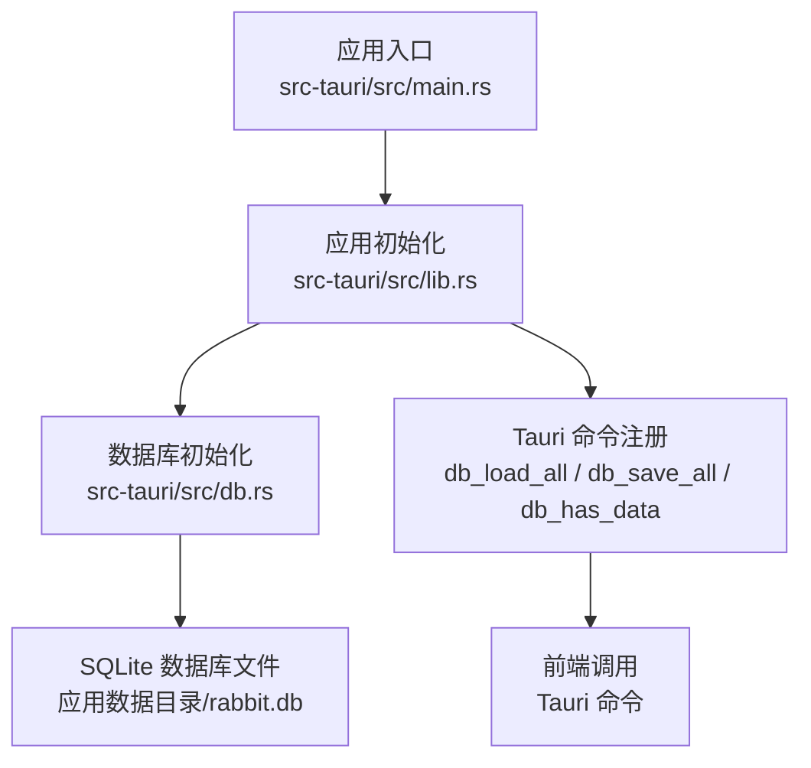
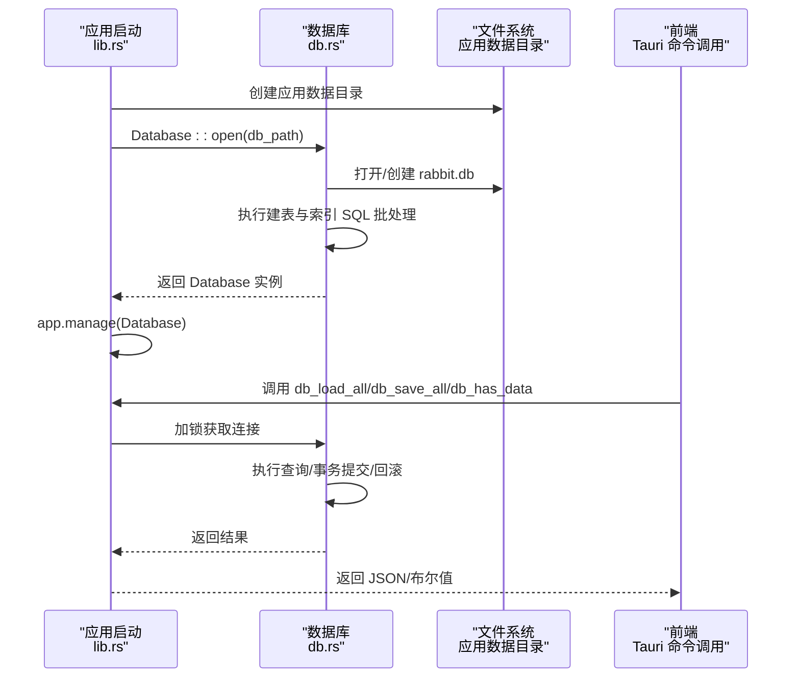
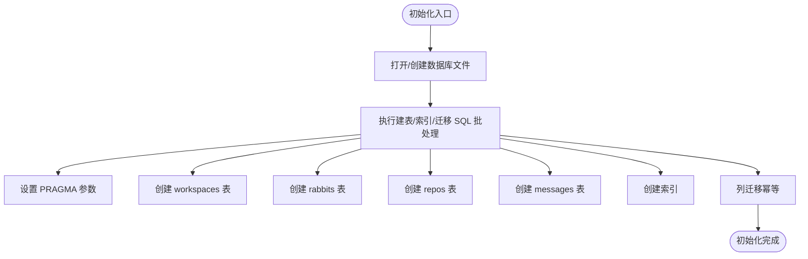
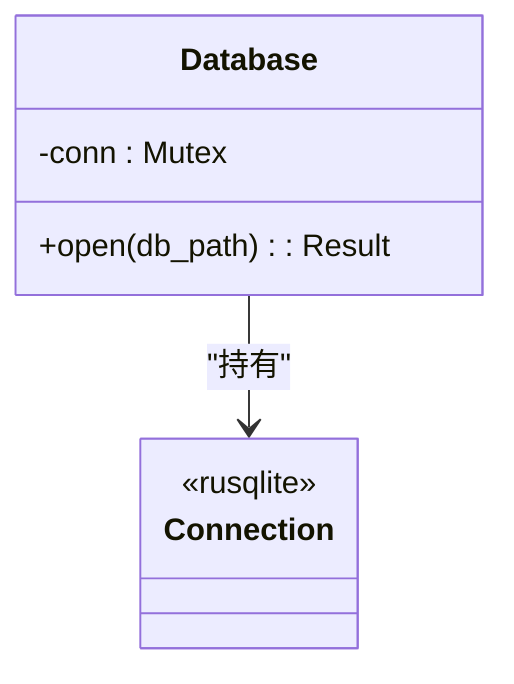
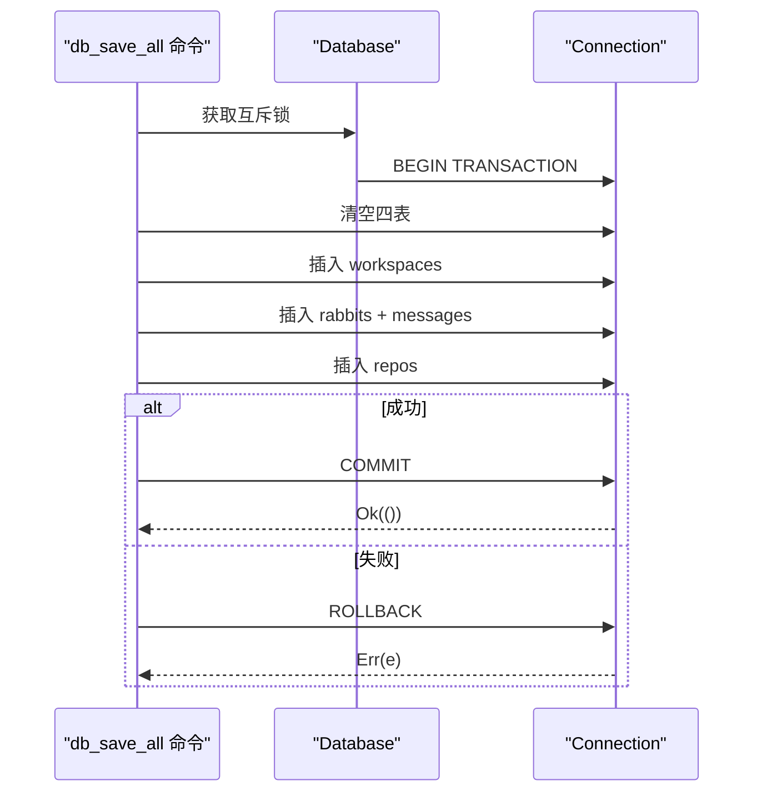
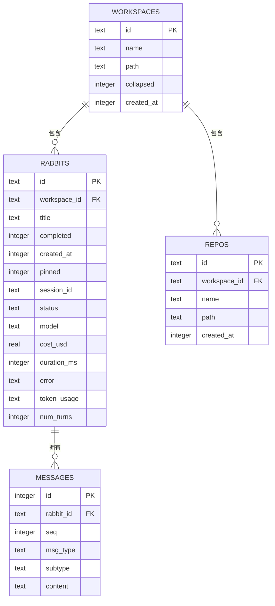
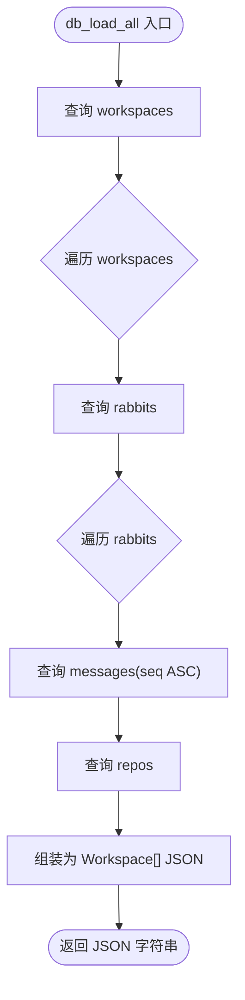
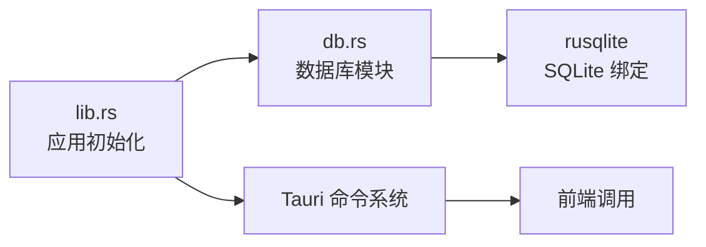

# 数据库集成

<cite>
**本文引用的文件列表**
- [db.rs](file://src-tauri/src/db.rs)
- [lib.rs](file://src-tauri/src/lib.rs)
- [Cargo.toml](file://src-tauri/Cargo.toml)
- [main.rs](file://src-tauri/src/main.rs)
- [tauri.conf.json](file://src-tauri/tauri.conf.json)
</cite>

## 目录
1. [简介](#简介)
2. [项目结构](#项目结构)
3. [核心组件](#核心组件)
4. [架构总览](#架构总览)
5. [详细组件分析](#详细组件分析)
6. [依赖关系分析](#依赖关系分析)
7. [性能考量](#性能考量)
8. [故障排查指南](#故障排查指南)
9. [结论](#结论)
10. [附录](#附录)

## 简介
本文件面向 RabbitCoding 的数据库集成，聚焦于 SQLite 的初始化流程、连接管理、事务处理与模式设计。文档从系统架构、组件关系、数据流、处理逻辑、集成点、错误处理、性能优化等方面进行深入说明，并提供可视化图示与实践建议，帮助开发者理解并维护数据库层。

## 项目结构
数据库相关代码集中在 Tauri 后端模块中，采用 Rust + rusqlite 实现，配合 Tauri 的命令系统暴露给前端使用。核心文件包括：
- 数据库初始化与模式定义：src-tauri/src/db.rs
- 应用启动与数据库注册：src-tauri/src/lib.rs
- 依赖声明与构建配置：src-tauri/Cargo.toml
- 应用入口：src-tauri/src/main.rs
- 应用配置：src-tauri/tauri.conf.json

图表来源
- [main.rs:1-7](file://src-tauri/src/main.rs#L1-L7)
- [lib.rs:196-390](file://src-tauri/src/lib.rs#L196-L390)
- [db.rs:80-161](file://src-tauri/src/db.rs#L80-L161)

章节来源
- [main.rs:1-7](file://src-tauri/src/main.rs#L1-L7)
- [lib.rs:196-390](file://src-tauri/src/lib.rs#L196-L390)
- [Cargo.toml:1-40](file://src-tauri/Cargo.toml#L1-L40)
- [tauri.conf.json:1-52](file://src-tauri/tauri.conf.json#L1-L52)

## 核心组件
- 数据库结构体 Database：封装 SQLite 连接，使用互斥锁保护并发访问。
- 模式定义与迁移：通过一次性执行的 SQL 批处理完成建表、索引与列迁移。
- 事务封装：提供全量保存的事务包装，确保一致性。
- Tauri 命令：db_load_all、db_save_all、db_has_data，供前端调用。

章节来源
- [db.rs:80-161](file://src-tauri/src/db.rs#L80-L161)
- [db.rs:290-305](file://src-tauri/src/db.rs#L290-L305)
- [db.rs:392-416](file://src-tauri/src/db.rs#L392-L416)
- [lib.rs:356-359](file://src-tauri/src/lib.rs#L356-L359)

## 架构总览
数据库层在应用启动阶段初始化，将数据库实例注册为全局状态，随后通过 Tauri 命令向前端开放读写接口。整体交互如下：

图表来源
- [lib.rs:206-221](file://src-tauri/src/lib.rs#L206-L221)
- [db.rs:142-160](file://src-tauri/src/db.rs#L142-L160)
- [db.rs:392-416](file://src-tauri/src/db.rs#L392-L416)

## 详细组件分析

### 数据库初始化与模式设计
- 初始化流程
  - 应用启动时在应用数据目录创建数据库文件路径，调用 Database::open 打开或创建数据库。
  - 打开成功后执行一次性的 SQL 批处理，完成以下操作：
    - 设置 PRAGMA：WAL 日志模式、外键约束、同步级别。
    - 创建四张主表：workspaces、rabbits、repos、messages。
    - 创建索引：rabbits.workspace_id、repos.workspace_id、messages.rabbit_id+seq。
    - 列迁移：对 rabbits 表追加新列（幂等，忽略重复列错误）。
- 模式设计要点
  - 外键约束：rabbits.workspace_id、repos.workspace_id 引用 workspaces.id，并设置级联删除。
  - 主键与自增：messages.id 使用自增主键，便于有序存储消息。
  - JSON 存储：rabbits.token_usage 以 JSON 文本形式存储，便于扩展统计信息。
  - 索引策略：针对频繁过滤的列建立索引，提升查询效率。

图表来源
- [db.rs:142-160](file://src-tauri/src/db.rs#L142-L160)
- [db.rs:85-138](file://src-tauri/src/db.rs#L85-L138)
- [db.rs:149-155](file://src-tauri/src/db.rs#L149-L155)

章节来源
- [db.rs:85-138](file://src-tauri/src/db.rs#L85-L138)
- [db.rs:142-160](file://src-tauri/src/db.rs#L142-L160)

### 连接管理与并发控制
- 连接封装：Database 使用 Mutex 包裹 rusqlite::Connection，确保多线程安全访问。
- 并发模型：前端通过 Tauri 命令调用，后端在命令处理函数中获取互斥锁，避免并发冲突。
- 生命周期：数据库实例在应用启动时注册为全局状态，随应用生命周期存在。

图表来源
- [db.rs:80-83](file://src-tauri/src/db.rs#L80-L83)
- [db.rs:142-144](file://src-tauri/src/db.rs#L142-L144)

章节来源
- [db.rs:80-83](file://src-tauri/src/db.rs#L80-L83)
- [db.rs:392-416](file://src-tauri/src/db.rs#L392-L416)

### 事务处理机制
- 全量保存事务：save_all_inner 将清理与插入操作包裹在 BEGIN/COMMIT/ROLLBACK 事务中，确保原子性。
- 保存流程：
  - 清空四表数据（DELETE）。
  - 逐条插入 workspaces、rabbits、messages、repos。
  - 消息序列按序插入，保持对话顺序。
- 错误处理：任一步骤失败即回滚，返回错误信息；成功则提交。

图表来源
- [db.rs:290-305](file://src-tauri/src/db.rs#L290-L305)
- [db.rs:307-386](file://src-tauri/src/db.rs#L307-L386)

章节来源
- [db.rs:290-305](file://src-tauri/src/db.rs#L290-L305)
- [db.rs:307-386](file://src-tauri/src/db.rs#L307-L386)

### 数据持久化策略与数据模型
- 数据模型（简化）
  - workspaces：工作空间基本信息。
  - rabbits：工作空间内的“兔子”（任务/会话）。
  - repos：工作空间关联的仓库。
  - messages：兔子的消息历史，按 seq 有序存储。
- 持久化策略
  - 全量替换：db_save_all 会先清空再插入，确保与前端传入的数据一致。
  - JSON 序列化：rabbits.token_usage 以 JSON 文本存储，便于扩展统计字段。
  - 消息分表：messages 单独表存储，避免 rabbits 表过大，提高查询灵活性。

图表来源
- [db.rs:90-133](file://src-tauri/src/db.rs#L90-L133)

章节来源
- [db.rs:90-133](file://src-tauri/src/db.rs#L90-L133)

### 查询与结果处理
- 全量加载：db_load_all 通过多步查询组装数据，按 created_at 顺序返回。
- 查询流程
  - 查询 workspaces，按 created_at DESC。
  - 对每个工作空间查询 rabbits，按 created_at DESC。
  - 对每个兔子查询 messages，按 seq ASC。
  - 查询 repos，按 created_at ASC。
  - 最终序列化为 JSON 返回。
- 结果处理：前端接收 JSON 字符串，解析为 Workspace[] 结构。

图表来源
- [db.rs:167-288](file://src-tauri/src/db.rs#L167-L288)

章节来源
- [db.rs:167-288](file://src-tauri/src/db.rs#L167-L288)

### 备份与恢复机制
- 当前实现未提供显式的备份/恢复命令或脚本。
- 建议方案（概念性）
  - 备份：复制应用数据目录下的 rabbit.db 文件。
  - 恢复：停止应用后替换目标数据库文件。
  - 注意：生产环境建议在关闭应用后再进行文件级备份，避免 WAL 文件状态不一致。

[本节为概念性建议，不直接分析具体文件]

### 数据迁移方案
- 列迁移：通过 ALTER TABLE 幂等执行，忽略重复列错误，确保旧版本数据库可平滑升级。
- 表结构迁移：通过一次性执行建表 SQL 批处理，保证新旧版本的一致性。
- 版本控制：可通过新增迁移脚本或在应用启动时检查版本并执行相应迁移。

章节来源
- [db.rs:149-155](file://src-tauri/src/db.rs#L149-L155)
- [db.rs:146-147](file://src-tauri/src/db.rs#L146-L147)

### 错误处理与数据完整性
- 错误处理
  - 打开数据库失败：记录错误并降级，前端检测命令失败后可回退到本地存储。
  - 查询/序列化失败：返回字符串错误信息，前端据此提示用户。
  - 事务失败：捕获错误并回滚，确保数据一致性。
- 数据完整性
  - 外键约束：启用外键，删除工作空间时级联删除其下实体。
  - PRAGMA 设置：WAL 模式提升并发写入能力；同步级别 NORMAL 平衡性能与可靠性。

章节来源
- [lib.rs:213-221](file://src-tauri/src/lib.rs#L213-L221)
- [db.rs:146-147](file://src-tauri/src/db.rs#L146-L147)
- [db.rs:290-304](file://src-tauri/src/db.rs#L290-L304)

## 依赖关系分析
- rusqlite：SQLite 绑定库，提供连接、SQL 执行与参数绑定。
- Tauri：提供命令系统、应用生命周期管理与状态注册。
- tokio：运行时支持（用于异步场景，当前数据库层主要使用同步 API）。

图表来源
- [lib.rs:356-359](file://src-tauri/src/lib.rs#L356-L359)
- [Cargo.toml:30](file://src-tauri/Cargo.toml#L30)

章节来源
- [Cargo.toml:20-40](file://src-tauri/Cargo.toml#L20-L40)
- [lib.rs:356-359](file://src-tauri/src/lib.rs#L356-L359)

## 性能考量
- WAL 模式：提升并发写入与读写分离能力，适合频繁更新的场景。
- 索引策略：为外键与常用过滤列建立索引，减少全表扫描。
- 事务批量：全量保存使用单事务，降低多次提交开销。
- JSON 文本存储：rabbits.token_usage 以 JSON 文本存储，避免复杂 JOIN，但需注意查询时的解析成本。
- 建议
  - 对高频查询列考虑添加复合索引（如 messages(rabbit_id, seq) 已存在）。
  - 控制单次查询返回的数据量，必要时增加分页或限制条件。
  - 定期检查数据库大小与碎片，必要时执行 VACUUM（谨慎使用）。

[本节提供通用建议，不直接分析具体文件]

## 故障排查指南
- 数据库无法初始化
  - 检查应用数据目录是否存在写权限。
  - 查看启动日志中数据库初始化错误信息。
- 命令调用失败
  - 前端检测到 db_* 命令失败时，应降级到本地存储。
- 事务异常
  - 若保存失败，确认网络/磁盘状态，重试或回滚后修复数据。
- 数据不一致
  - 确认外键约束与 PRAGMA 设置是否生效。
  - 如需强制修复，可手动执行重建表与索引的 SQL 批处理。

章节来源
- [lib.rs:213-221](file://src-tauri/src/lib.rs#L213-L221)
- [db.rs:290-304](file://src-tauri/src/db.rs#L290-L304)

## 结论
RabbitCoding 的数据库层以 rusqlite 为核心，结合 Tauri 命令系统实现了简洁可靠的本地数据持久化。通过 WAL 模式、外键约束与索引策略保障了性能与一致性；通过事务封装确保批量操作的原子性；通过幂等迁移与 PRAGMA 设置提升了可维护性。建议在生产环境中完善备份/恢复流程，并持续评估查询性能与索引策略。

## 附录
- 前端调用示例（路径参考）
  - 调用全量加载：[db_load_all 命令:392-397](file://src-tauri/src/db.rs#L392-L397)
  - 调用全量保存：[db_save_all 命令:399-406](file://src-tauri/src/db.rs#L399-L406)
  - 检查是否有数据：[db_has_data 命令:408-416](file://src-tauri/src/db.rs#L408-L416)
- 应用启动与数据库注册
  - 启动阶段初始化数据库并注册为全局状态：[应用初始化:206-221](file://src-tauri/src/lib.rs#L206-L221)