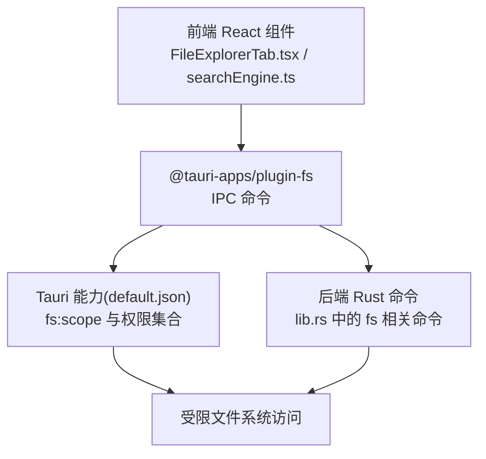
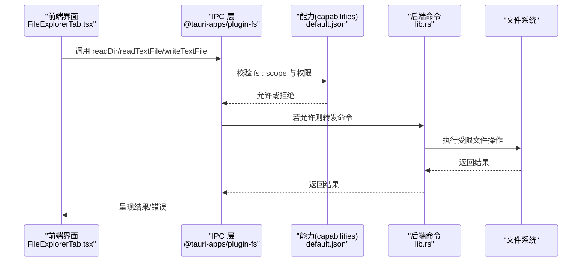
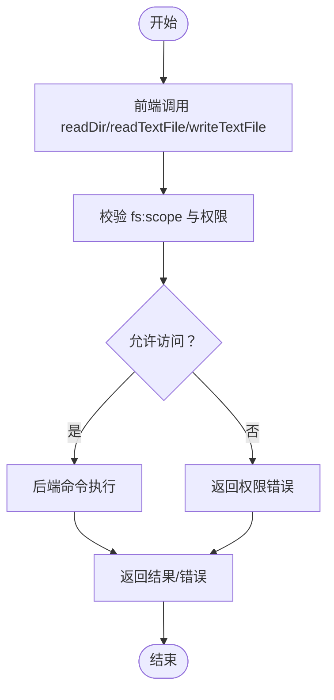
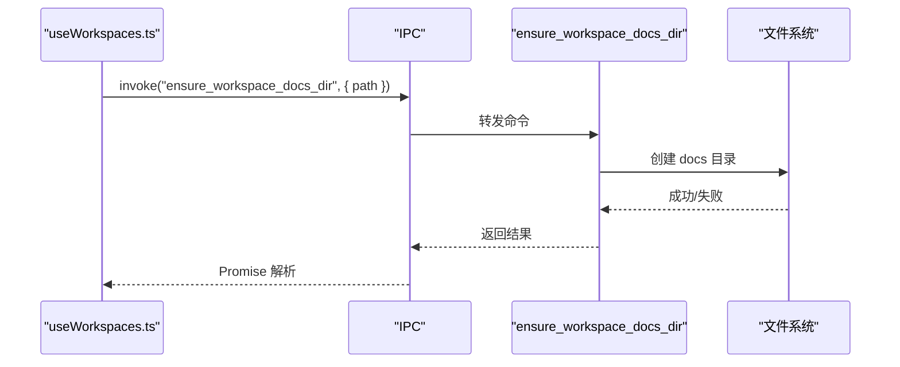

# 文件系统访问

<cite>
**本文引用的文件**
- [src-tauri/tauri.conf.json](file://src-tauri/tauri.conf.json)
- [src-tauri/Cargo.toml](file://src-tauri/Cargo.toml)
- [src-tauri/src/lib.rs](file://src-tauri/src/lib.rs)
- [src-tauri/capabilities/default.json](file://src-tauri/capabilities/default.json)
- [src-tauri/gen/schemas/desktop-schema.json](file://src-tauri/gen/schemas/desktop-schema.json)
- [src-tauri/gen/schemas/macOS-schema.json](file://src-tauri/gen/schemas/macOS-schema.json)
- [src/components/files/FileExplorerTab.tsx](file://src/components/files/FileExplorerTab.tsx)
- [src/components/files/FileTree.tsx](file://src/components/files/FileTree.tsx)
- [src/components/files/types.ts](file://src/components/files/types.ts)
- [src/hooks/useWorkspaces.ts](file://src/hooks/useWorkspaces.ts)
- [src/components/files/searchEngine.ts](file://src/components/files/searchEngine.ts)
</cite>

## 目录
1. [简介](#简介)
2. [项目结构](#项目结构)
3. [核心组件](#核心组件)
4. [架构总览](#架构总览)
5. [详细组件分析](#详细组件分析)
6. [依赖关系分析](#依赖关系分析)
7. [性能考量](#性能考量)
8. [故障排查指南](#故障排查指南)
9. [结论](#结论)
10. [附录](#附录)

## 简介
本文件系统访问技术文档围绕 RabbitCoding 的 Tauri 文件系统插件使用与安全边界展开，重点说明：
- Tauri fs 插件的权限配置与能力(capabilities)模型
- 受限制与不受限制的文件访问方式
- 路径解析规则与权限检查流程
- 工作空间目录管理策略，以及 docs 与 .rabbit/specs、.rabbit/codewiki 的创建与使用逻辑
- 跨平台文件系统差异、路径分隔符处理、符号链接支持
- 实战示例：读取文件、创建目录、处理权限错误

## 项目结构
RabbitCoding 的文件系统能力由前端 React 组件与后端 Rust 插件共同构成：
- 前端通过 @tauri-apps/plugin-fs 提供的 readDir、readTextFile、writeTextFile 等命令访问受限文件系统
- 后端通过 tauri-plugin-fs 初始化并暴露受限命令；另有若干“绕过 Tauri ACL”的命令用于特定场景
- 能力(capabilities)通过 default.json 控制 fs:scope 与具体允许的 fs 权限集合

图表来源
- [src-tauri/src/lib.rs:197-390](file://src-tauri/src/lib.rs#L197-L390)
- [src-tauri/capabilities/default.json:1-41](file://src-tauri/capabilities/default.json#L1-L41)
- [src/components/files/FileExplorerTab.tsx:1-490](file://src/components/files/FileExplorerTab.tsx#L1-L490)

章节来源
- [src-tauri/tauri.conf.json:1-52](file://src-tauri/tauri.conf.json#L1-L52)
- [src-tauri/Cargo.toml:1-40](file://src-tauri/Cargo.toml#L1-L40)
- [src-tauri/src/lib.rs:197-390](file://src-tauri/src/lib.rs#L197-L390)
- [src-tauri/capabilities/default.json:1-41](file://src-tauri/capabilities/default.json#L1-L41)

## 核心组件
- 前端文件浏览器与搜索引擎
  - FileExplorerTab.tsx：提供目录树浏览、文件选择、大文件保护、编辑/保存能力
  - searchEngine.ts：基于 readDir 的递归遍历与并发控制，支持包含/排除模式
- 后端命令与能力
  - lib.rs：初始化 fs 插件，暴露 ensure_workspace_docs_dir、ensure_rabbit_specs_dir、ensure_rabbit_codewiki_dir、list_rabbit_codewiki_files、read_text_file_unrestricted 等命令
  - capabilities/default.json：定义 fs:scope 与允许的 fs 权限集合
- 工作空间管理
  - useWorkspaces.ts：在新增/更新工作空间路径时自动创建 docs 目录

章节来源
- [src/components/files/FileExplorerTab.tsx:1-490](file://src/components/files/FileExplorerTab.tsx#L1-L490)
- [src/components/files/searchEngine.ts:87-258](file://src/components/files/searchEngine.ts#L87-L258)
- [src-tauri/src/lib.rs:20-112](file://src-tauri/src/lib.rs#L20-L112)
- [src-tauri/capabilities/default.json:22-33](file://src-tauri/capabilities/default.json#L22-L33)
- [src/hooks/useWorkspaces.ts:181-185](file://src/hooks/useWorkspaces.ts#L181-L185)

## 架构总览
下图展示了从前端到后端再到文件系统的调用链路与权限边界。

图表来源
- [src-tauri/src/lib.rs:197-390](file://src-tauri/src/lib.rs#L197-L390)
- [src-tauri/capabilities/default.json:22-33](file://src-tauri/capabilities/default.json#L22-L33)
- [src/components/files/FileExplorerTab.tsx:220-245](file://src/components/files/FileExplorerTab.tsx#L220-L245)

## 详细组件分析

### 1) Tauri 文件系统插件与能力配置
- 插件初始化
  - 后端在 run() 中初始化 tauri-plugin-fs，随后通过 invoke_handler 暴露命令
- 能力(capabilities)与 fs:scope
  - default.json 中声明了 fs:read-dirs、fs:read-files、fs:allow-read-text-file、fs:allow-write-text-file 等权限
  - fs:scope 允许访问路径包括：根目录通配符、$HOME/**、$HOME/.agents/**
- 默认权限集
  - desktop-schema.json/macOS-schema.json 中描述了 fs:default 的默认行为：读取应用特定目录及其子目录，禁止访问 WebView 数据目录等关键组件

章节来源
- [src-tauri/src/lib.rs:197-205](file://src-tauri/src/lib.rs#L197-L205)
- [src-tauri/capabilities/default.json:22-33](file://src-tauri/capabilities/default.json#L22-L33)
- [src-tauri/gen/schemas/desktop-schema.json:138-4526](file://src-tauri/gen/schemas/desktop-schema.json#L138-L4526)
- [src-tauri/gen/schemas/macOS-schema.json:138-4526](file://src-tauri/gen/schemas/macOS-schema.json#L138-L4526)

### 2) 受限制文件访问流程
- 前端调用 readDir/readTextFile/writeTextFile
- IPC 层根据 capabilities/default.json 的 fs:scope 与权限集合进行校验
- 若路径在 scope 内且具备相应权限，则后端命令被执行；否则返回权限错误

图表来源
- [src-tauri/capabilities/default.json:22-33](file://src-tauri/capabilities/default.json#L22-L33)
- [src-tauri/src/lib.rs:197-390](file://src-tauri/src/lib.rs#L197-L390)

### 3) 不受限制的文件访问方式
- 特定命令绕过 Tauri ACL
  - read_text_file_unrestricted：直接使用标准库读取任意路径文本文件（用于读取 .rabbit 等隐藏目录中的文件）
  - open_notification_settings：在 macOS/Windows 上直接打开系统通知设置页面
- 使用建议
  - 仅在必要时使用不受限命令，严格限定输入来源与路径合法性，避免任意路径读取带来的安全风险

章节来源
- [src-tauri/src/lib.rs:107-132](file://src-tauri/src/lib.rs#L107-L132)

### 4) 路径解析规则与权限检查
- 路径解析
  - 前端 FileExplorerTab.tsx 使用 “根路径 + '/' + 文件名” 拼接绝对路径
  - searchEngine.ts 在递归收集文件时，使用绝对路径与相对路径分离处理
- 权限检查
  - capabilities/default.json 的 fs:scope 明确允许 $HOME/** 与 $HOME/.agents/**，因此在这些范围内的文件可被受限访问
  - 对于其他路径，需在 default.json 中显式添加 allow 条目

章节来源
- [src/components/files/FileExplorerTab.tsx:42-49](file://src/components/files/FileExplorerTab.tsx#L42-L49)
- [src/components/files/searchEngine.ts:225-236](file://src/components/files/searchEngine.ts#L225-L236)
- [src-tauri/capabilities/default.json:29-32](file://src-tauri/capabilities/default.json#L29-L32)

### 5) 工作空间目录管理策略
- docs 目录创建
  - useWorkspaces.ts 在新增工作空间或更新路径时，调用后端 ensure_workspace_docs_dir，确保 docs 子目录存在
- .rabbit/specs 与 .rabbit/codewiki 目录
  - 后端命令 ensure_rabbit_specs_dir、ensure_rabbit_codewiki_dir 分别创建 .rabbit/specs 与 .rabbit/codewiki
  - list_rabbit_codewiki_files 用于列出 .rabbit/codewiki 下的内容（目录不存在时返回空数组）

图表来源
- [src/hooks/useWorkspaces.ts:181-185](file://src/hooks/useWorkspaces.ts#L181-L185)
- [src-tauri/src/lib.rs:20-34](file://src-tauri/src/lib.rs#L20-L34)

章节来源
- [src/hooks/useWorkspaces.ts:181-185](file://src/hooks/useWorkspaces.ts#L181-L185)
- [src-tauri/src/lib.rs:20-43](file://src-tauri/src/lib.rs#L20-L43)

### 6) docs 目录与 .rabbit 目录的创建逻辑
- ensure_workspace_docs_dir：在工作空间根目录下创建 docs 子目录（幂等）
- ensure_rabbit_specs_dir：在工作空间根目录下创建 .rabbit/specs 子目录（幂等）
- ensure_rabbit_codewiki_dir：在工作空间根目录下创建 .rabbit/codewiki 子目录（幂等），并返回目录路径
- list_rabbit_codewiki_files：读取 .rabbit/codewiki 树形结构，忽略 .DS_Store，按目录优先排序

章节来源
- [src-tauri/src/lib.rs:20-105](file://src-tauri/src/lib.rs#L20-L105)

### 7) 前端文件浏览与搜索
- FileExplorerTab.tsx
  - 通过 readDir 获取目录条目，过滤隐藏与忽略项，按目录优先排序
  - 读取文本文件时对大文件进行保护（超过 1MB 视为过大）
  - 支持编辑/保存、刷新、折叠全部、搜索模式切换
- searchEngine.ts
  - 递归遍历目录，支持包含/排除模式与并发池控制
  - 跳过隐藏文件与二进制扩展名

章节来源
- [src/components/files/FileExplorerTab.tsx:31-295](file://src/components/files/FileExplorerTab.tsx#L31-L295)
- [src/components/files/searchEngine.ts:87-258](file://src/components/files/searchEngine.ts#L87-L258)

### 8) 跨平台文件系统差异、路径分隔符与符号链接
- 路径分隔符
  - 前端使用 “/” 拼接路径；后端使用标准库路径拼接，天然适配各平台
- 符号链接
  - Tauri fs 插件默认遵循操作系统语义；若需处理符号链接，应在后端命令中显式处理（例如使用 canonicalize 或 symlink 解析策略）
- 权限与可见性
  - macOS 的 .DS_Store 文件在读取目录时会被忽略
  - 由于 capabilities/default.json 的 fs:scope 限制，部分隐藏目录（如 .git、node_modules）不会出现在前端目录树中

章节来源
- [src/components/files/FileExplorerTab.tsx:16-20](file://src/components/files/FileExplorerTab.tsx#L16-L20)
- [src/components/files/FileExplorerTab.tsx:32-50](file://src/components/files/FileExplorerTab.tsx#L32-L50)

### 9) 代码示例（以路径代替具体代码）
- 读取文件（受限访问）
  - 前端调用 readTextFile(path)，后端受 fs:scope 与权限约束
  - 参考路径：[src/components/files/FileExplorerTab.tsx:220-245](file://src/components/files/FileExplorerTab.tsx#L220-L245)
- 创建目录（受限命令）
  - 前端调用 ensure_workspace_docs_dir(path) 或 ensure_rabbit_specs_dir(path)
  - 参考路径：[src/hooks/useWorkspaces.ts:181-185](file://src/hooks/useWorkspaces.ts#L181-L185)、[src-tauri/src/lib.rs:20-34](file://src-tauri/src/lib.rs#L20-L34)
- 处理文件权限错误
  - 前端在读取文件失败时捕获异常并提示“二进制文件”或“文件过大”
  - 参考路径：[src/components/files/FileExplorerTab.tsx:240-244](file://src/components/files/FileExplorerTab.tsx#L240-L244)
- 绕过 ACL 读取隐藏目录文件
  - 使用 read_text_file_unrestricted(path) 直接读取任意路径文本文件
  - 参考路径：[src-tauri/src/lib.rs:107-112](file://src-tauri/src/lib.rs#L107-L112)

章节来源
- [src/components/files/FileExplorerTab.tsx:220-245](file://src/components/files/FileExplorerTab.tsx#L220-L245)
- [src/hooks/useWorkspaces.ts:181-185](file://src/hooks/useWorkspaces.ts#L181-L185)
- [src-tauri/src/lib.rs:107-112](file://src-tauri/src/lib.rs#L107-L112)

## 依赖关系分析
- 前端依赖
  - @tauri-apps/plugin-fs：提供 readDir、readTextFile、writeTextFile 等命令
  - @tauri-apps/api/core：invoke 用于调用后端命令
- 后端依赖
  - tauri-plugin-fs：初始化并提供文件系统能力
  - capabilities/default.json：定义权限边界
- 关系图

图表来源
- [src-tauri/Cargo.toml:29-29](file://src-tauri/Cargo.toml#L29-L29)
- [src-tauri/capabilities/default.json:22-33](file://src-tauri/capabilities/default.json#L22-L33)
- [src-tauri/src/lib.rs:197-205](file://src-tauri/src/lib.rs#L197-L205)

章节来源
- [src-tauri/Cargo.toml:29-29](file://src-tauri/Cargo.toml#L29-L29)
- [src-tauri/capabilities/default.json:22-33](file://src-tauri/capabilities/default.json#L22-L33)

## 性能考量
- 目录懒加载与递归遍历
  - FileExplorerTab.tsx 在展开目录时才加载子项，减少一次性 IO 压力
- 并发控制与上限
  - searchEngine.ts 使用并发池控制同时处理的文件数量，避免高负载
- 大文件保护
  - FileExplorerTab.tsx 对大于 1MB 的文件直接提示“文件过大”，避免内存压力

章节来源
- [src/components/files/FileExplorerTab.tsx:81-109](file://src/components/files/FileExplorerTab.tsx#L81-L109)
- [src/components/files/searchEngine.ts:240-258](file://src/components/files/searchEngine.ts#L240-L258)
- [src/components/files/FileExplorerTab.tsx:231-236](file://src/components/files/FileExplorerTab.tsx#L231-L236)

## 故障排查指南
- 无法读取文件
  - 检查路径是否在 capabilities/default.json 的 fs:scope 允许范围内
  - 若需读取隐藏目录（如 .rabbit），使用 read_text_file_unrestricted
- 目录为空或缺少某些文件
  - 确认是否被忽略列表（如 .DS_Store、node_modules、.git）过滤
  - 检查 capabilities/default.json 的 fs:scope 是否覆盖该路径
- 创建目录失败
  - 确认工作空间路径有效且具有写权限
  - 检查 ensure_workspace_docs_dir/ensure_rabbit_specs_dir/ensure_rabbit_codewiki_dir 的返回错误信息

章节来源
- [src-tauri/capabilities/default.json:22-33](file://src-tauri/capabilities/default.json#L22-L33)
- [src-tauri/src/lib.rs:20-43](file://src-tauri/src/lib.rs#L20-L43)
- [src/components/files/FileExplorerTab.tsx:16-20](file://src/components/files/FileExplorerTab.tsx#L16-L20)

## 结论
RabbitCoding 采用“受限 + 受控”的文件系统访问策略：通过 Tauri 能力与 fs:scope 管控通用文件访问，同时在必要场景下提供不受限命令以满足特殊需求。配合工作空间目录管理与前端目录树/搜索组件，实现了安全、可控且易用的文件系统体验。建议在扩展新功能时遵循“最小权限原则”，尽量使用受限命令，仅在确有必要时使用不受限命令并严格校验输入。

## 附录
- 相关类型定义
  - FileNode：文件树节点数据结构
  - 参考路径：[src/components/files/types.ts:1-10](file://src/components/files/types.ts#L1-L10)

章节来源
- [src/components/files/types.ts:1-10](file://src/components/files/types.ts#L1-L10)