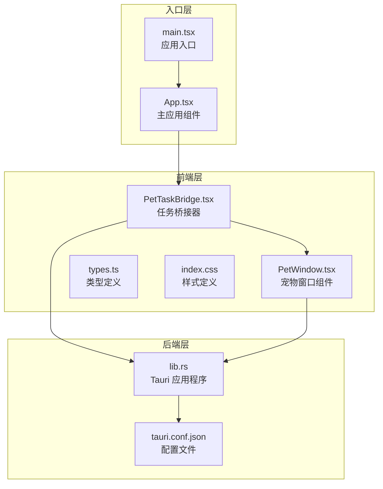
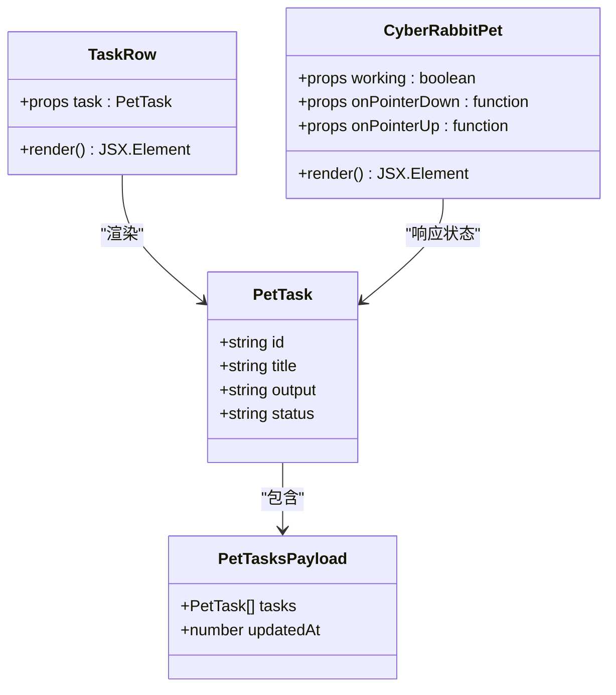
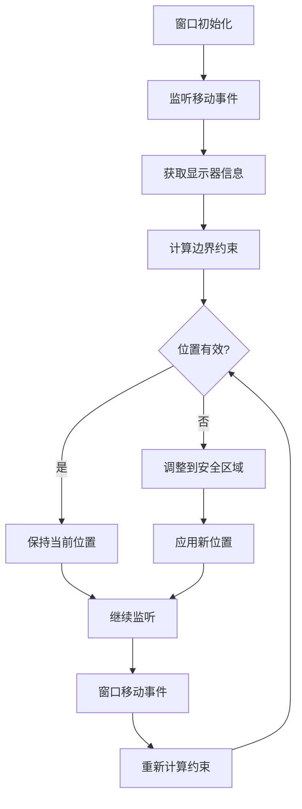
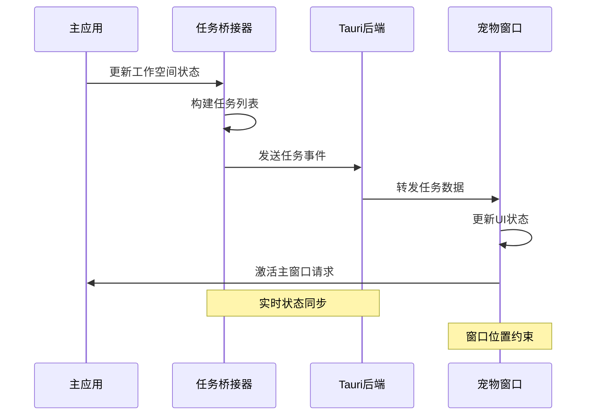
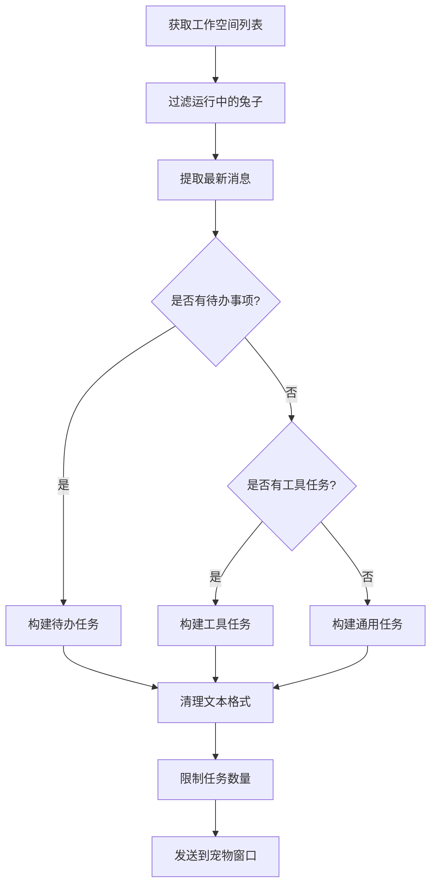
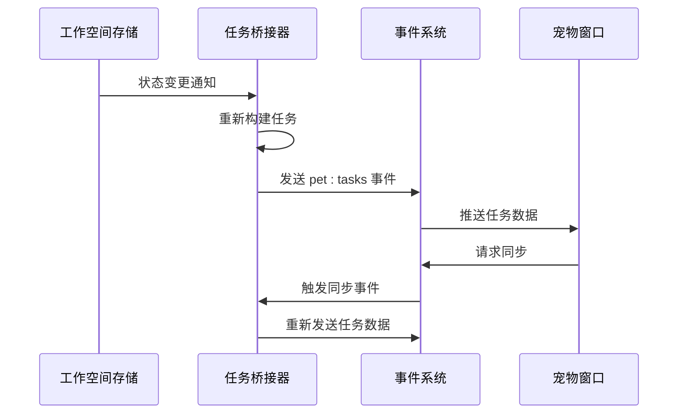
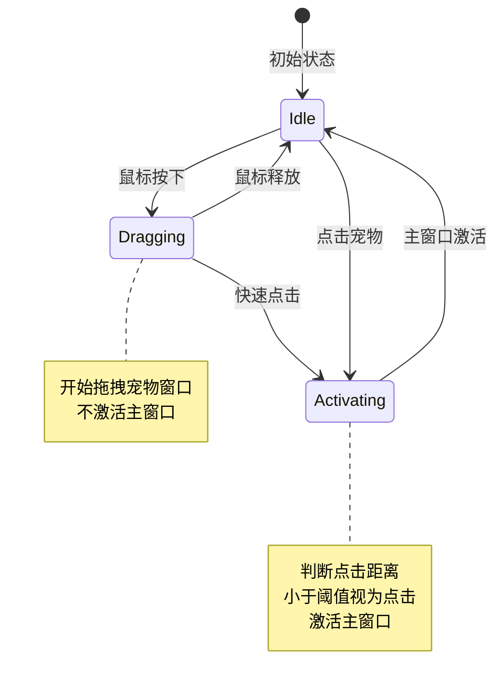
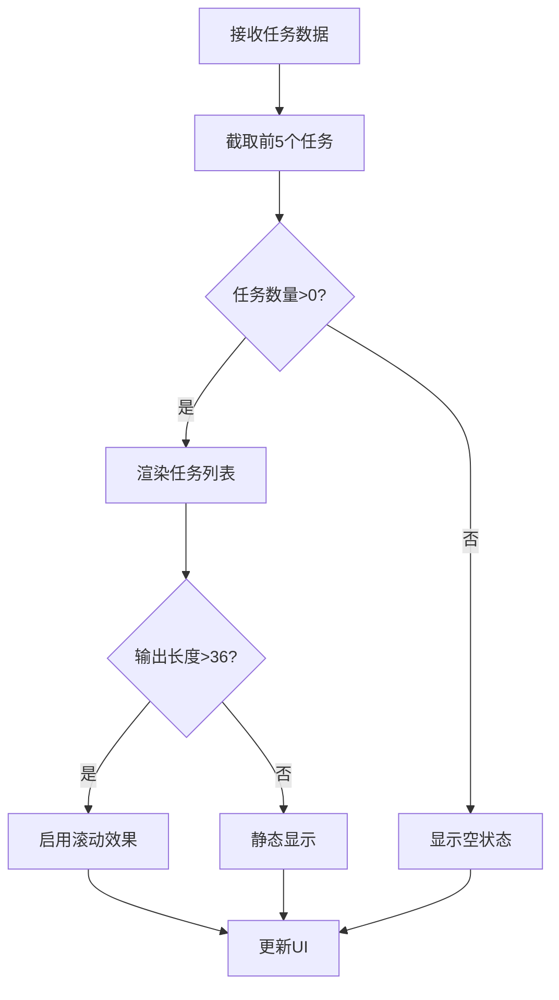
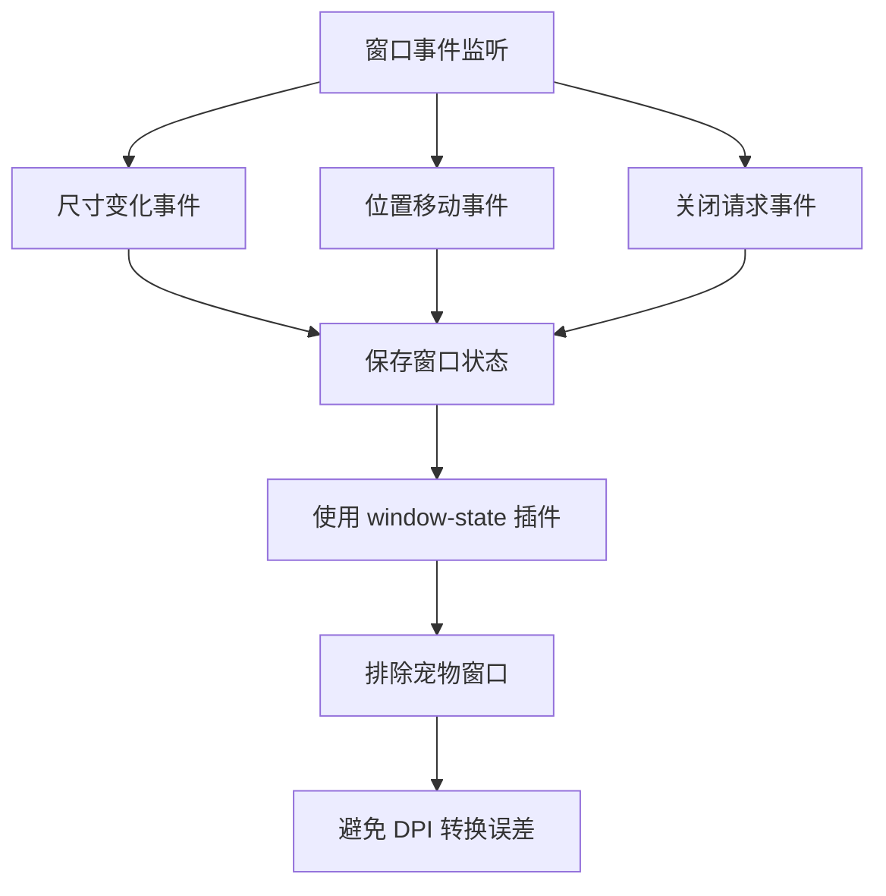
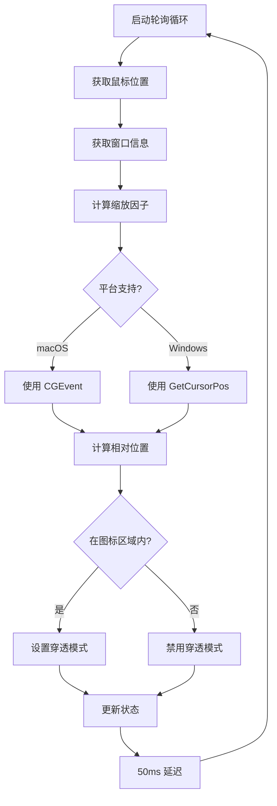

# 桌面宠物窗口状态管理

<cite>
**本文档引用的文件**
- [PetWindow.tsx](file://src/components/pet/PetWindow.tsx)
- [types.ts](file://src/components/pet/types.ts)
- [PetTaskBridge.tsx](file://src/components/pet/PetTaskBridge.tsx)
- [lib.rs](file://src-tauri/src/lib.rs)
- [tauri.conf.json](file://src-tauri/tauri.conf.json)
- [main.tsx](file://src/main.tsx)
- [index.css](file://src/index.css)
- [App.tsx](file://src/App.tsx)
</cite>

## 目录
1. [简介](#简介)
2. [项目结构](#项目结构)
3. [核心组件](#核心组件)
4. [架构概览](#架构概览)
5. [详细组件分析](#详细组件分析)
6. [依赖关系分析](#依赖关系分析)
7. [性能考虑](#性能考虑)
8. [故障排除指南](#故障排除指南)
9. [结论](#结论)

## 简介

桌面宠物窗口状态管理系统是 Rabbit Coding 应用程序中的一个创新功能，它提供了一个可交互的桌面宠物窗口，能够实时显示正在运行的任务状态。该系统通过事件驱动的方式实现了主应用程序与宠物窗口之间的状态同步，确保用户可以随时了解后台任务的执行情况。

该系统的核心特点包括：
- 实时任务状态同步
- 智能窗口定位和边界约束
- 动态鼠标穿透检测
- 跨平台兼容性（macOS 和 Windows）
- 流畅的动画效果和视觉反馈

## 项目结构

桌面宠物窗口状态管理功能主要分布在以下模块中：



**图表来源**
- [PetWindow.tsx:1-248](file://src/components/pet/PetWindow.tsx#L1-L248)
- [PetTaskBridge.tsx:1-172](file://src/components/pet/PetTaskBridge.tsx#L1-L172)
- [lib.rs:657-916](file://src-tauri/src/lib.rs#L657-L916)

**章节来源**
- [main.tsx:1-13](file://src/main.tsx#L1-L13)
- [App.tsx:101](file://src/App.tsx#L101)

## 核心组件

### 任务数据模型

系统使用标准化的数据模型来表示宠物任务状态：



**图表来源**
- [types.ts:1-12](file://src/components/pet/types.ts#L1-L12)
- [PetWindow.tsx:8-27](file://src/components/pet/PetWindow.tsx#L8-L27)

### 窗口状态管理

宠物窗口实现了智能的状态管理和位置约束机制：



**图表来源**
- [PetWindow.tsx:135-165](file://src/components/pet/PetWindow.tsx#L135-L165)

**章节来源**
- [types.ts:1-12](file://src/components/pet/types.ts#L1-L12)
- [PetWindow.tsx:120-247](file://src/components/pet/PetWindow.tsx#L120-L247)

## 架构概览

桌面宠物窗口状态管理系统采用事件驱动的架构模式，实现了前后端的解耦和高效通信：



**图表来源**
- [PetTaskBridge.tsx:142-171](file://src/components/pet/PetTaskBridge.tsx#L142-L171)
- [PetWindow.tsx:190-210](file://src/components/pet/PetWindow.tsx#L190-L210)

## 详细组件分析

### PetTaskBridge 组件

PetTaskBridge 是整个系统的核心协调器，负责将主应用的工作状态转换为宠物窗口可理解的任务格式：

#### 任务构建算法



**图表来源**
- [PetTaskBridge.tsx:72-113](file://src/components/pet/PetTaskBridge.tsx#L72-L113)
- [PetTaskBridge.tsx:115-128](file://src/components/pet/PetTaskBridge.tsx#L115-L128)

#### 事件处理机制

PetTaskBridge 实现了双向事件通信：



**图表来源**
- [PetTaskBridge.tsx:146-168](file://src/components/pet/PetTaskBridge.tsx#L146-L168)

**章节来源**
- [PetTaskBridge.tsx:1-172](file://src/components/pet/PetTaskBridge.tsx#L1-L172)

### PetWindow 组件

PetWindow 负责渲染宠物窗口的用户界面，并实现窗口状态的可视化：

#### 窗口拖拽和激活机制



**图表来源**
- [PetWindow.tsx:214-233](file://src/components/pet/PetWindow.tsx#L214-L233)

#### 任务显示逻辑

PetWindow 实现了智能的任务列表显示：



**图表来源**
- [PetWindow.tsx:124](file://src/components/pet/PetWindow.tsx#L124)
- [PetWindow.tsx:8-27](file://src/components/pet/PetWindow.tsx#L8-L27)

**章节来源**
- [PetWindow.tsx:1-248](file://src/components/pet/PetWindow.tsx#L1-L248)

### 后端集成

Tauri 后端提供了关键的系统级功能支持：

#### 窗口状态持久化



**图表来源**
- [lib.rs:753-797](file://src-tauri/src/lib.rs#L753-L797)
- [lib.rs:667-670](file://src-tauri/src/lib.rs#L667-L670)

#### 鼠标穿透检测

系统实现了智能的鼠标穿透检测机制：



**图表来源**
- [lib.rs:817-830](file://src-tauri/src/lib.rs#L817-L830)
- [lib.rs:611-654](file://src-tauri/src/lib.rs#L611-L654)

**章节来源**
- [lib.rs:657-916](file://src-tauri/src/lib.rs#L657-L916)

## 依赖关系分析

桌面宠物窗口状态管理系统展现了良好的模块化设计和清晰的依赖关系：

```mermaid
graph TB
subgraph "外部依赖"
A[@tauri-apps/api<br/>事件系统]
B[React<br/>组件框架]
C[Tauri<br/>桌面平台]
end
subgraph "内部模块"
D[PetTaskBridge]
E[PetWindow]
F[类型定义]
G[样式系统]
end
subgraph "系统接口"
H[事件总线]
I[窗口管理]
J[状态持久化]
end
A --> D
B --> D
C --> E
D --> H
E --> I
F --> D
F --> E
G --> E
C --> J
J --> I
```

**图表来源**
- [PetTaskBridge.tsx:1-6](file://src/components/pet/PetTaskBridge.tsx#L1-L6)
- [PetWindow.tsx:1-6](file://src/components/pet/PetWindow.tsx#L1-L6)

**章节来源**
- [tauri.conf.json:14-36](file://src-tauri/tauri.conf.json#L14-L36)

## 性能考虑

系统在设计时充分考虑了性能优化：

### 内存管理
- 使用 `useMemo` 优化任务构建过程
- 限制任务显示数量（最多5个）
- 合理的事件监听生命周期管理

### 渲染优化
- CSS 动画替代 JavaScript 动画
- 智能的文本截断和滚动处理
- 最小化的 DOM 操作

### 系统资源
- 鼠标穿透检测每50ms轮询一次
- 窗口位置约束的防抖处理
- 事件监听的及时清理

## 故障排除指南

### 常见问题及解决方案

#### 窗口位置异常
**症状**: 宠物窗口出现在屏幕外或无法移动
**解决方案**: 
1. 检查显示器配置变化
2. 重启应用程序
3. 验证窗口边界计算逻辑

#### 任务状态不同步
**症状**: 宠物窗口不显示最新的任务状态
**解决方案**:
1. 检查事件监听是否正常工作
2. 验证 `emitTo` 函数调用
3. 确认 `pet:request-sync` 事件处理

#### 鼠标穿透失效
**症状**: 宠物窗口无法正确响应鼠标点击
**解决方案**:
1. 检查平台特定的 FFI 调用
2. 验证窗口句柄有效性
3. 确认缩放因子计算准确性

**章节来源**
- [PetWindow.tsx:135-165](file://src/components/pet/PetWindow.tsx#L135-L165)
- [lib.rs:817-830](file://src-tauri/src/lib.rs#L817-L830)

## 结论

桌面宠物窗口状态管理系统展现了现代桌面应用程序的优秀实践，通过精心设计的架构实现了以下目标：

### 技术成就
- **事件驱动架构**: 实现了前后端的松耦合通信
- **跨平台兼容**: 支持 macOS 和 Windows 的差异化处理
- **性能优化**: 通过多种技术手段确保流畅的用户体验
- **状态管理**: 提供了完整且可靠的状态同步机制

### 设计亮点
- **智能约束**: 自动处理窗口边界和显示器适配
- **交互体验**: 提供直观的拖拽和点击操作
- **视觉反馈**: 丰富的动画效果增强用户感知
- **错误处理**: 完善的异常处理和降级策略

该系统为桌面应用程序的宠物功能提供了一个可扩展的参考实现，其设计理念和技术方案值得在类似项目中借鉴和应用。