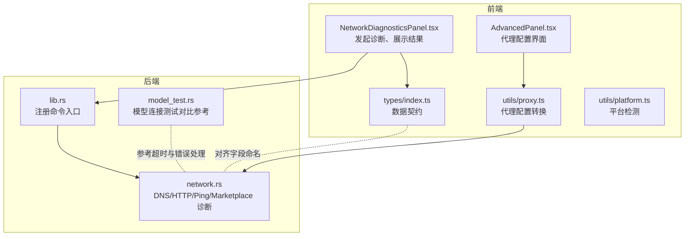
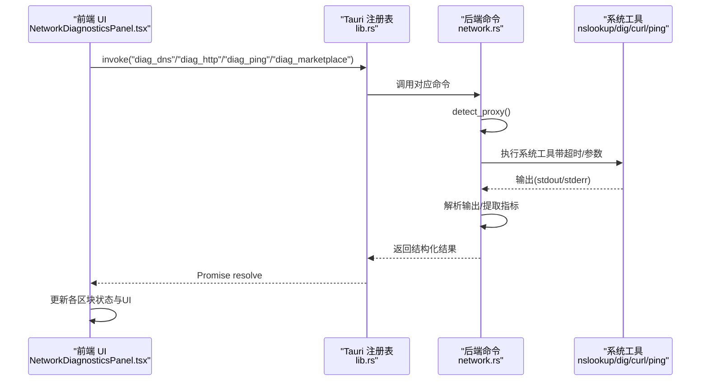
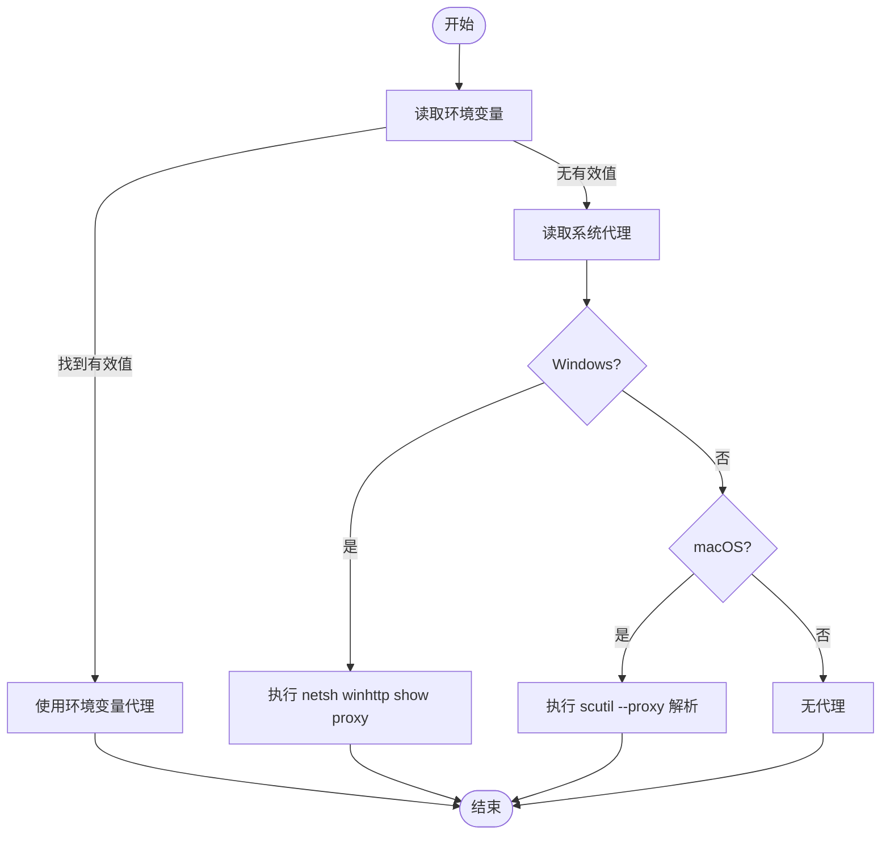
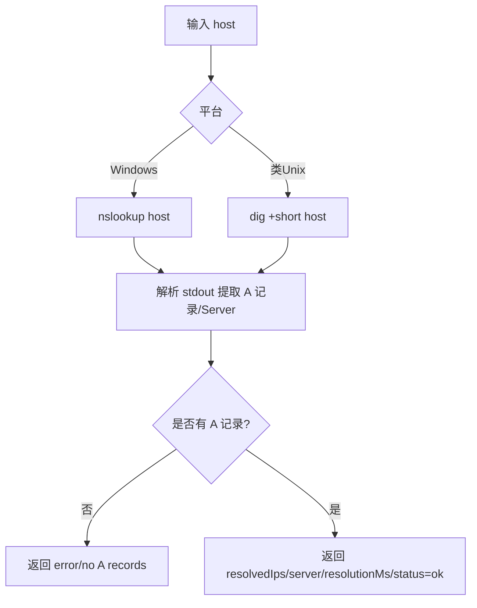
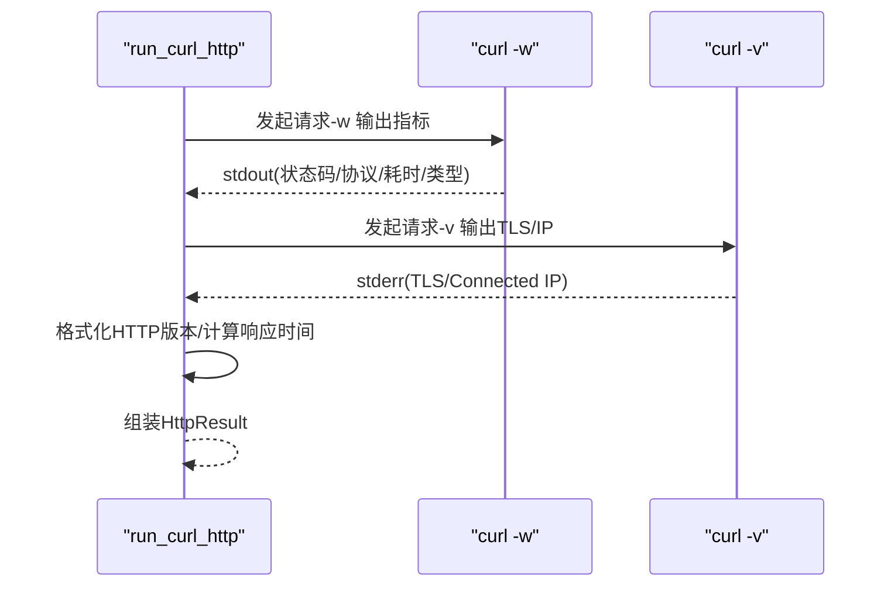
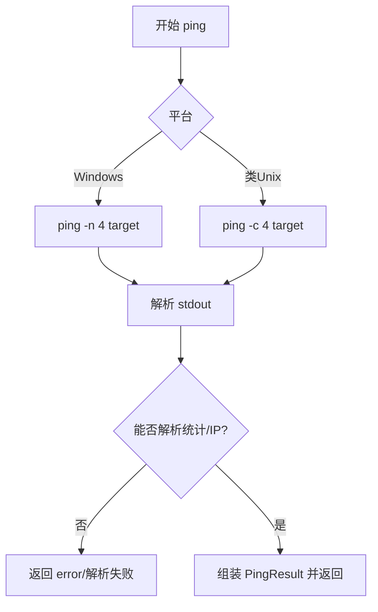
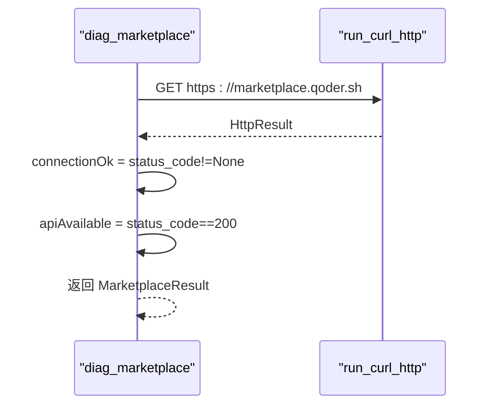
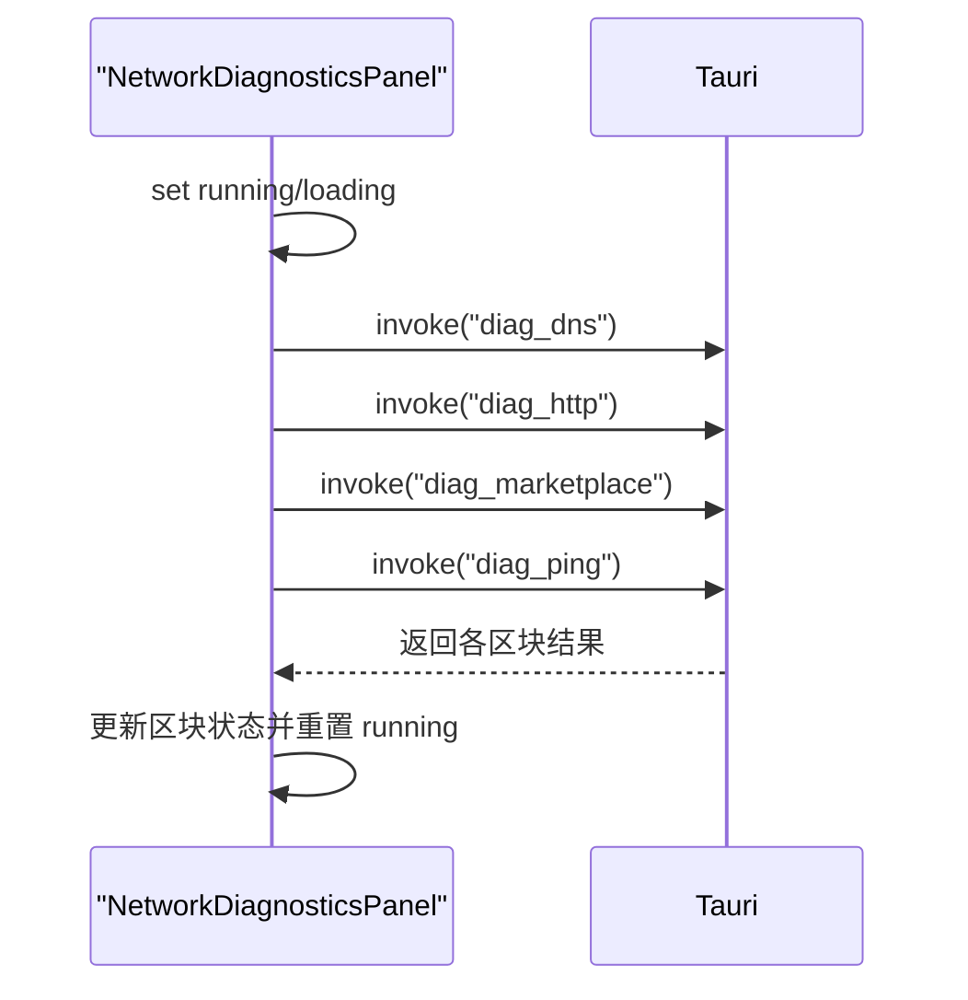
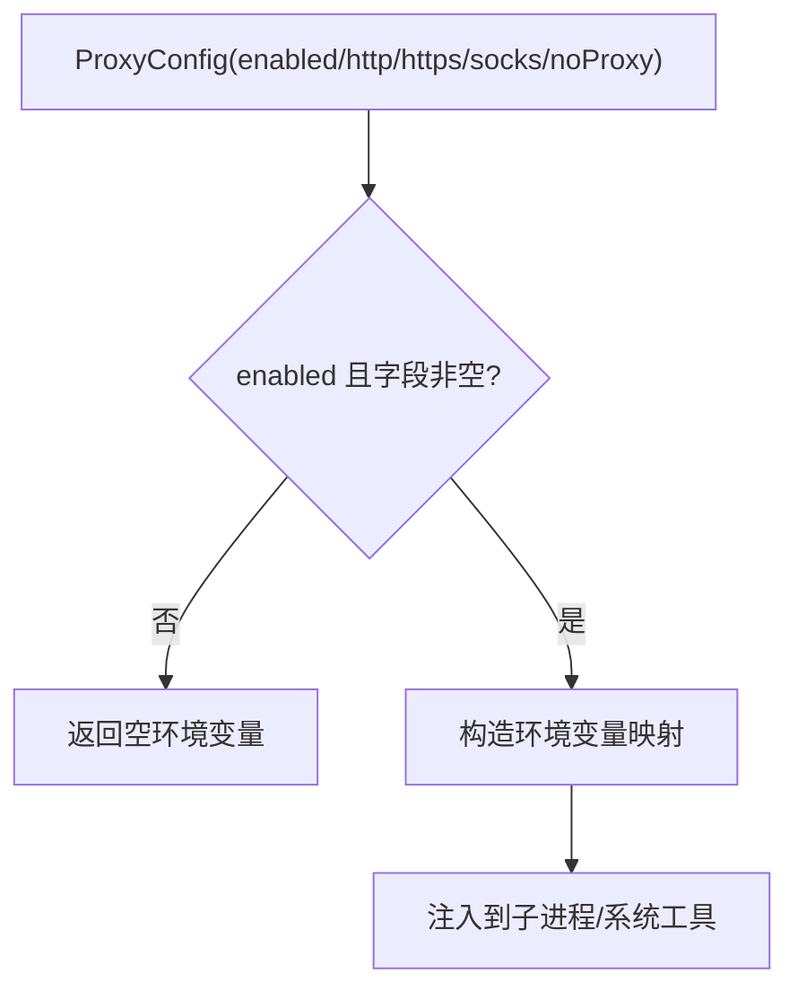
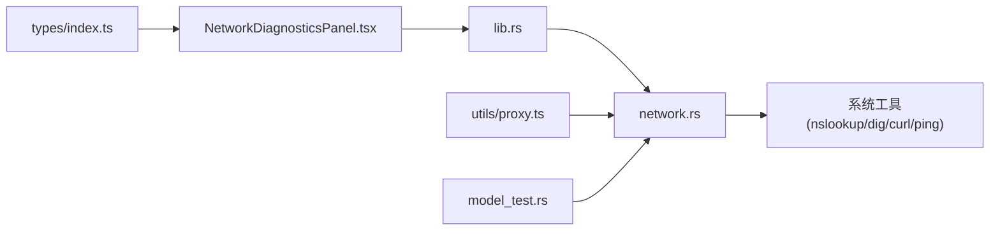

# 网络功能

<cite>
**本文引用的文件**
- [src-tauri/src/network.rs](file://src-tauri/src/network.rs)
- [src/components/settings/NetworkDiagnosticsPanel.tsx](file://src/components/settings/NetworkDiagnosticsPanel.tsx)
- [src/utils/proxy.ts](file://src/utils/proxy.ts)
- [src/utils/platform.ts](file://src/utils/platform.ts)
- [src/types/index.ts](file://src/types/index.ts)
- [src-tauri/src/lib.rs](file://src-tauri/src/lib.rs)
- [src-tauri/src/model_test.rs](file://src-tauri/src/model_test.rs)
- [src/components/settings/AdvancedPanel.tsx](file://src/components/settings/AdvancedPanel.tsx)
</cite>

## 目录
1. [简介](#简介)
2. [项目结构](#项目结构)
3. [核心组件](#核心组件)
4. [架构总览](#架构总览)
5. [详细组件分析](#详细组件分析)
6. [依赖关系分析](#依赖关系分析)
7. [性能考量](#性能考量)
8. [故障排查指南](#故障排查指南)
9. [结论](#结论)
10. [附录](#附录)

## 简介
本文件面向 RabbitCoding 的网络诊断与连通性能力，系统化梳理 DNS 解析测试、HTTP 请求验证、Ping 延迟测量、市场站可达性检测、代理配置验证、错误处理与超时控制、跨平台实现差异与安全注意事项。文档同时提供可视化流程图与序列图，帮助开发者快速定位问题并优化网络诊断体验。

## 项目结构
网络功能主要由三部分组成：
- 前端设置面板：负责发起诊断、展示结果与代理配置
- Rust 后端命令：封装系统工具调用与网络探测逻辑
- 类型定义：前后端数据契约与代理配置模型

图表来源
- [src/components/settings/NetworkDiagnosticsPanel.tsx:318-424](file://src/components/settings/NetworkDiagnosticsPanel.tsx#L318-L424)
- [src-tauri/src/lib.rs:344-387](file://src-tauri/src/lib.rs#L344-L387)
- [src-tauri/src/network.rs:1-864](file://src-tauri/src/network.rs#L1-L864)
- [src/utils/proxy.ts:1-62](file://src/utils/proxy.ts#L1-L62)
- [src/utils/platform.ts:1-19](file://src/utils/platform.ts#L1-L19)
- [src-tauri/src/model_test.rs:79-207](file://src-tauri/src/model_test.rs#L79-L207)

章节来源
- [src-tauri/src/network.rs:1-864](file://src-tauri/src/network.rs#L1-L864)
- [src/components/settings/NetworkDiagnosticsPanel.tsx:1-425](file://src/components/settings/NetworkDiagnosticsPanel.tsx#L1-L425)
- [src-tauri/src/lib.rs:344-387](file://src-tauri/src/lib.rs#L344-L387)
- [src/types/index.ts:457-532](file://src/types/index.ts#L457-L532)
- [src/utils/proxy.ts:1-62](file://src/utils/proxy.ts#L1-L62)
- [src-tauri/src/model_test.rs:1-217](file://src-tauri/src/model_test.rs#L1-L217)

## 核心组件
- 代理检测与注入
  - 优先读取环境变量（HTTP_PROXY/HTTPS_PROXY/all_proxy 等），其次读取系统代理（Windows netsh、macOS scutil）
  - 将代理配置转换为环境变量键值对，供系统工具使用
- DNS 诊断
  - Windows 使用 nslookup，类 Unix 使用 dig +short
  - 解析 A 记录、提取解析耗时与 DNS 服务器标识
- HTTP 诊断
  - 使用 curl 分两次抓取指标：-w 获取状态码/协议/耗时/内容类型；-v 解析 TLS 版本与远端 IP
  - 统一 HTTP 版本字符串格式
- Ping 诊断
  - 跨平台参数差异（Windows -n、类 Unix -c）
  - 解析丢包率与 RTT（min/avg/max）
- 市场站诊断
  - 对 marketplace.qoder.sh 发起 GET 请求，判断连接与 API 可用性（200）

章节来源
- [src-tauri/src/network.rs:100-201](file://src-tauri/src/network.rs#L100-L201)
- [src-tauri/src/network.rs:207-364](file://src-tauri/src/network.rs#L207-L364)
- [src-tauri/src/network.rs:391-550](file://src-tauri/src/network.rs#L391-L550)
- [src-tauri/src/network.rs:556-822](file://src-tauri/src/network.rs#L556-L822)
- [src-tauri/src/network.rs:829-863](file://src-tauri/src/network.rs#L829-L863)
- [src/utils/proxy.ts:17-47](file://src/utils/proxy.ts#L17-L47)

## 架构总览
前端通过 Tauri invoke 调用后端命令，后端在阻塞任务中执行系统工具，解析输出并返回结构化结果。代理信息贯穿 DNS/HTTP/Ping/MKP 四类诊断。

图表来源
- [src/components/settings/NetworkDiagnosticsPanel.tsx:353-369](file://src/components/settings/NetworkDiagnosticsPanel.tsx#L353-L369)
- [src-tauri/src/lib.rs:360-363](file://src-tauri/src/lib.rs#L360-L363)
- [src-tauri/src/network.rs:367-375](file://src-tauri/src/network.rs#L367-L375)
- [src-tauri/src/network.rs:539-550](file://src-tauri/src/network.rs#L539-L550)
- [src-tauri/src/network.rs:811-822](file://src-tauri/src/network.rs#L811-L822)
- [src-tauri/src/network.rs:829-863](file://src-tauri/src/network.rs#L829-L863)

## 详细组件分析

### 代理检测与注入
- 环境变量优先：HTTP_PROXY/HTTPS_PROXY/all_proxy 及其小写变体
- Windows：netsh winhttp show proxy
- macOS：scutil --proxy，解析 HTTPEnable/HTTPSEnable 与 HTTPProxy/HTTPPort
- 注入策略：将代理配置转换为环境变量键值对，供系统工具使用

图表来源
- [src-tauri/src/network.rs:100-201](file://src-tauri/src/network.rs#L100-L201)

章节来源
- [src-tauri/src/network.rs:100-201](file://src-tauri/src/network.rs#L100-L201)
- [src/utils/proxy.ts:17-47](file://src/utils/proxy.ts#L17-L47)

### DNS 解析测试
- Windows：nslookup，解析 Address 行提取 IPv4 地址，提取 Server 行作为 DNS 服务器
- 类 Unix：dig +short，过滤 IPv4 地址，服务器信息标记为 system
- 输出字段：host、proxy、server、resolvedIps、resolutionMs、status/error

图表来源
- [src-tauri/src/network.rs:207-364](file://src-tauri/src/network.rs#L207-L364)

章节来源
- [src-tauri/src/network.rs:207-364](file://src-tauri/src/network.rs#L207-L364)

### HTTP 请求验证
- 指标采集：curl -w 输出状态码、HTTP 版本、总耗时、内容类型
- TLS/远端信息：curl -v 解析 TLS 版本与 Connected IP
- 超时控制：--max-time 10 秒
- 结果字段：endpoint/method/proxy/status_code/http_version/tls_version/response_time_ms/content_type/remote_ip/status/error

图表来源
- [src-tauri/src/network.rs:391-550](file://src-tauri/src/network.rs#L391-L550)

章节来源
- [src-tauri/src/network.rs:391-550](file://src-tauri/src/network.rs#L391-L550)

### Ping 延迟测量
- 参数差异：Windows -n 4；类 Unix -c 4
- 解析：Windows 解析 Packets 行与 Minimum/Maximum/Average；类 Unix 解析 round-trip 或 rtt 行
- 丢包：即使 100% 丢包也视为成功（可执行），仅无 RTT 数据
- 结果字段：target/ip/packetsSent/packetsReceived/packetLossPercent/rtt_min/avg/max/status/error

图表来源
- [src-tauri/src/network.rs:556-822](file://src-tauri/src/network.rs#L556-L822)

章节来源
- [src-tauri/src/network.rs:556-822](file://src-tauri/src/network.rs#L556-L822)

### 市场站诊断
- 对 marketplace.qoder.sh 发起 GET 请求，基于 HTTP 诊断逻辑
- 判断 connectionOk（有状态码即认为连接成功）、apiAvailable（200）
- 结果字段：endpoint/proxy/connectionOk/apiAvailable/status_code/response_time_ms/status/error

图表来源
- [src-tauri/src/network.rs:829-863](file://src-tauri/src/network.rs#L829-L863)

章节来源
- [src-tauri/src/network.rs:829-863](file://src-tauri/src/network.rs#L829-L863)

### 前端诊断面板与并行执行
- 并行执行四类诊断：diag_dns、diag_http、diag_marketplace、diag_ping
- 加载态与错误态管理，逐区块渐进式展示
- 代理信息在 DNS/HTTP/MKP 区块顶部展示

图表来源
- [src/components/settings/NetworkDiagnosticsPanel.tsx:343-370](file://src/components/settings/NetworkDiagnosticsPanel.tsx#L343-L370)

章节来源
- [src/components/settings/NetworkDiagnosticsPanel.tsx:318-424](file://src/components/settings/NetworkDiagnosticsPanel.tsx#L318-L424)

### 代理配置验证与注入
- 前端 AdvancedPanel 提供代理开关与输入框
- proxy.ts 将配置转换为环境变量（HTTP_PROXY/HTTPS_PROXY/ALL_PROXY/NO_PROXY 及小写）
- 仅在 enabled=true 且对应字段非空时注入

图表来源
- [src/components/settings/AdvancedPanel.tsx:13-99](file://src/components/settings/AdvancedPanel.tsx#L13-L99)
- [src/utils/proxy.ts:17-47](file://src/utils/proxy.ts#L17-L47)

章节来源
- [src/components/settings/AdvancedPanel.tsx:13-99](file://src/components/settings/AdvancedPanel.tsx#L13-L99)
- [src/utils/proxy.ts:1-62](file://src/utils/proxy.ts#L1-L62)

## 依赖关系分析
- 命令注册：lib.rs 将 network 模块的四个诊断命令注册为 invoke 接口
- 数据契约：types/index.ts 定义了 DNS/HTTP/Ping/Marketplace/ProxyInfo 等接口，前后端字段命名保持 camelCase 一致
- 平台差异：network.rs 使用条件编译区分 Windows/macOS/Linux 的系统工具与参数
- 错误处理参考：model_test.rs 展示了统一的超时/连接/其他错误分类与友好提示

图表来源
- [src-tauri/src/lib.rs:360-363](file://src-tauri/src/lib.rs#L360-L363)
- [src-tauri/src/network.rs:1-864](file://src-tauri/src/network.rs#L1-L864)
- [src/types/index.ts:457-532](file://src/types/index.ts#L457-L532)
- [src/utils/proxy.ts:1-62](file://src/utils/proxy.ts#L1-L62)
- [src-tauri/src/model_test.rs:79-207](file://src-tauri/src/model_test.rs#L79-L207)

章节来源
- [src-tauri/src/lib.rs:344-387](file://src-tauri/src/lib.rs#L344-L387)
- [src/types/index.ts:457-532](file://src/types/index.ts#L457-L532)

## 性能考量
- 并行执行：前端对四类诊断采用并行 invoke，缩短总等待时间
- 阻塞任务：后端命令在 spawn_blocking 中执行系统工具，避免阻塞异步运行时
- 超时控制：HTTP 诊断使用 --max-time 10 秒；模型连接测试使用 20 秒超时
- 输出解析：仅解析必要字段，减少内存与 CPU 开销

章节来源
- [src/components/settings/NetworkDiagnosticsPanel.tsx:352-370](file://src/components/settings/NetworkDiagnosticsPanel.tsx#L352-L370)
- [src-tauri/src/network.rs:407-446](file://src-tauri/src/network.rs#L407-L446)
- [src-tauri/src/model_test.rs:19-20](file://src-tauri/src/model_test.rs#L19-L20)

## 故障排查指南
- 代理相关
  - 确认环境变量是否正确（HTTP_PROXY/HTTPS_PROXY/all_proxy 等）
  - Windows 检查 netsh winhttp 代理设置；macOS 检查 scutil 输出
  - 前端代理配置需保存并确保生效（AdvancedPanel）
- DNS 解析
  - Windows：nslookup 输出为空时检查系统 DNS 服务与防火墙
  - 类 Unix：dig 未安装或失败时安装 bind-tools 并检查 resolver 配置
- HTTP 请求
  - curl 失败时查看 stderr；关注超时、证书、TLS 版本与远端 IP
  - 若仅 -w 成功而 -v 失败，可能是网络层成功但 TLS 解析失败
- Ping
  - Windows 与类 Unix 输出格式差异导致解析失败时，检查系统 ping 版本与参数
  - 100% 丢包不等于失败，仍视为可执行但无 RTT
- 市场站
  - 无状态码表示连接失败；200 表示 API 可用
- 错误分类参考
  - 超时：统一提示“请求超时（Xs 内未响应）”
  - 连接错误：提示“无法连接到服务器，请检查 Base URL 是否正确”
  - 其他：统一提示“请求失败: …”

章节来源
- [src-tauri/src/network.rs:100-201](file://src-tauri/src/network.rs#L100-L201)
- [src-tauri/src/network.rs:207-364](file://src-tauri/src/network.rs#L207-L364)
- [src-tauri/src/network.rs:391-550](file://src-tauri/src/network.rs#L391-L550)
- [src-tauri/src/network.rs:556-822](file://src-tauri/src/network.rs#L556-L822)
- [src-tauri/src/network.rs:829-863](file://src-tauri/src/network.rs#L829-L863)
- [src-tauri/src/model_test.rs:123-141](file://src-tauri/src/model_test.rs#L123-L141)

## 结论
RabbitCoding 的网络诊断模块通过“前端并行发起 + 后端阻塞执行 + 系统工具解析”的组合，实现了跨平台的 DNS、HTTP、Ping 与市场站可达性检测。代理检测与注入贯穿全部诊断，确保在复杂网络环境下仍能准确评估连通性。建议在生产环境中结合代理配置与超时策略，持续优化诊断结果的准确性与用户体验。

## 附录
- 代码示例路径（不展示具体代码内容）
  - DNS 诊断命令调用：[src-tauri/src/network.rs:367-375](file://src-tauri/src/network.rs#L367-L375)
  - HTTP 诊断命令调用：[src-tauri/src/network.rs:539-550](file://src-tauri/src/network.rs#L539-L550)
  - Ping 诊断命令调用：[src-tauri/src/network.rs:811-822](file://src-tauri/src/network.rs#L811-L822)
  - 市场站诊断命令调用：[src-tauri/src/network.rs:829-863](file://src-tauri/src/network.rs#L829-L863)
  - 前端并行执行与结果渲染：[src/components/settings/NetworkDiagnosticsPanel.tsx:343-370](file://src/components/settings/NetworkDiagnosticsPanel.tsx#L343-L370)
  - 代理配置转换为环境变量：[src/utils/proxy.ts:17-47](file://src/utils/proxy.ts#L17-L47)
  - 代理配置界面与默认值：[src/components/settings/AdvancedPanel.tsx:13-99](file://src/components/settings/AdvancedPanel.tsx#L13-L99)
  - 数据契约（类型定义）：[src/types/index.ts:457-532](file://src/types/index.ts#L457-L532)
  - 模型连接测试（超时与错误分类参考）：[src-tauri/src/model_test.rs:79-207](file://src-tauri/src/model_test.rs#L79-L207)