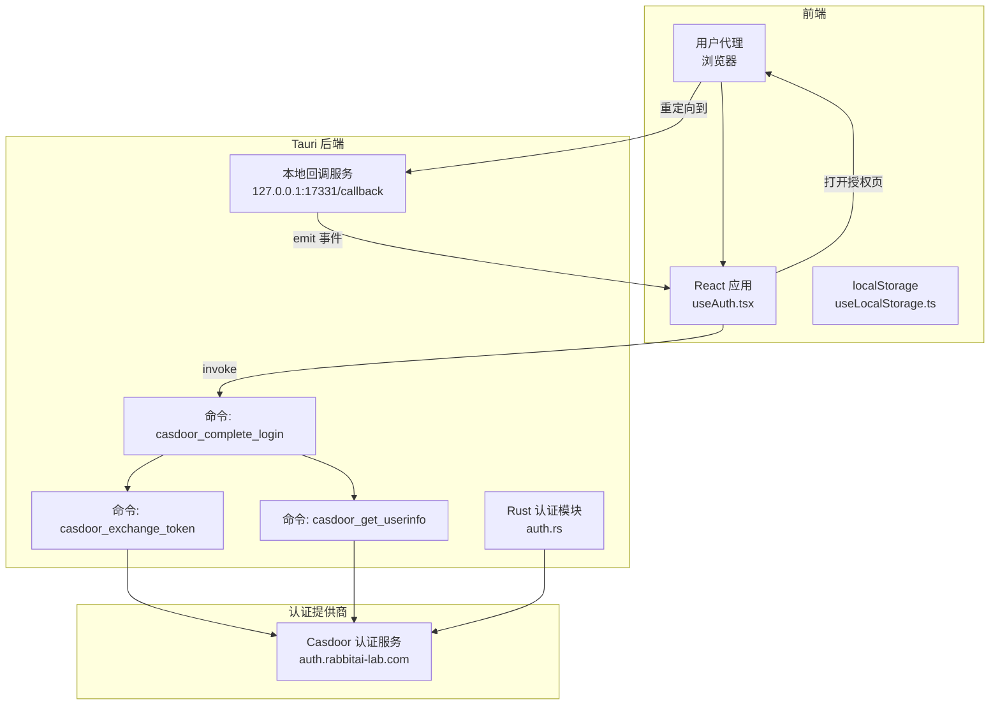
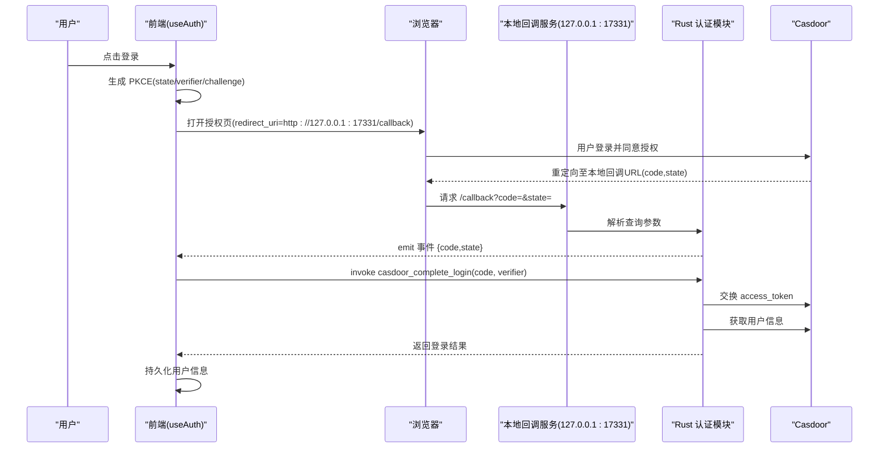
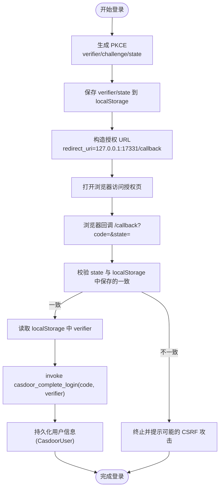
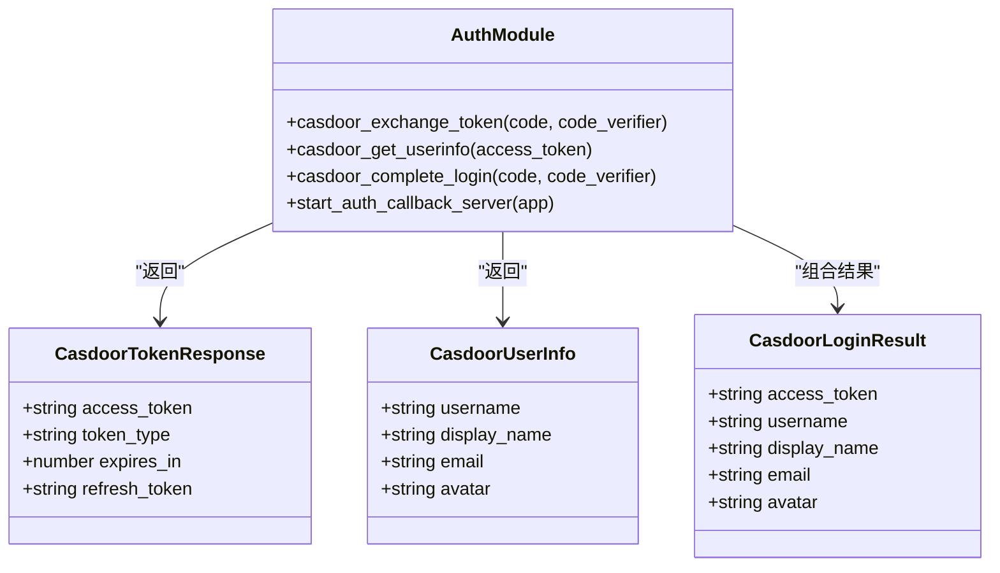
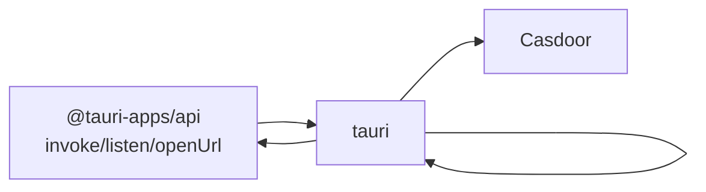

# 认证系统

<cite>
**本文引用的文件**
- [src-tauri/src/auth.rs](file://src-tauri/src/auth.rs)
- [src/hooks/useAuth.tsx](file://src/hooks/useAuth.tsx)
- [src-tauri/src/lib.rs](file://src-tauri/src/lib.rs)
- [src/types/index.ts](file://src/types/index.ts)
- [src-tauri/Cargo.toml](file://src-tauri/Cargo.toml)
- [src/App.tsx](file://src/App.tsx)
- [src/hooks/useLocalStorage.ts](file://src/hooks/useLocalStorage.ts)
</cite>

## 更新摘要
**变更内容**
- 增强 useAuth hook 的 PKCE 挑战验证机制
- 改进 loopback HTTP 回调处理和错误状态管理
- 优化代码结构和注释说明
- 完善认证流程的安全性和可靠性

## 目录
1. [简介](#简介)
2. [项目结构](#项目结构)
3. [核心组件](#核心组件)
4. [架构总览](#架构总览)
5. [详细组件分析](#详细组件分析)
6. [依赖关系分析](#依赖关系分析)
7. [性能考量](#性能考量)
8. [故障排查指南](#故障排查指南)
9. [结论](#结论)
10. [附录](#附录)

## 简介
本文件面向 RabbitCoding 认证系统，围绕 OAuth 2.0 授权码 + PKCE 流程、本地 loopback 回调服务器、令牌交换与用户信息获取、Casdoor 认证提供商集成、登录状态管理与安全策略进行系统化技术说明。文档同时提供关键流程的可视化图示与可操作的实践指引，帮助开发者快速理解与扩展认证能力。

**更新** 本次更新增强了 useAuth hook 的 PKCE 挑战验证机制，改进了 loopback HTTP 回调处理和错误状态管理，提升了认证流程的安全性和可靠性。

## 项目结构
认证系统主要由三部分组成：
- 前端 React Hook：负责发起授权、监听回调、持久化用户信息与状态。
- Tauri 后端 Rust 模块：提供命令接口与本地 loopback 回调 HTTP 服务。
- 类型定义：统一前后端数据结构，确保序列化与交互一致性。

**图表来源**
- [src/hooks/useAuth.tsx:190-224](file://src/hooks/useAuth.tsx#L190-L224)
- [src-tauri/src/auth.rs:258-284](file://src-tauri/src/auth.rs#L258-L284)
- [src-tauri/src/auth.rs:118-172](file://src-tauri/src/auth.rs#L118-L172)
- [src-tauri/src/auth.rs:179-220](file://src-tauri/src/auth.rs#L179-L220)
- [src-tauri/src/auth.rs:227-245](file://src-tauri/src/auth.rs#L227-L245)

**章节来源**
- [src-tauri/src/lib.rs:223-225](file://src-tauri/src/lib.rs#L223-L225)
- [src-tauri/src/auth.rs:9-17](file://src-tauri/src/auth.rs#L9-L17)
- [src/hooks/useAuth.tsx:31-40](file://src/hooks/useAuth.tsx#L31-L40)

## 核心组件
- 前端认证上下文与 Hook
  - 生成 PKCE 参数（verifier/challenge）与 state，构建授权 URL 并打开浏览器。
  - 监听本地回调事件，校验 state 防 CSRF，取出 code_verifier，调用后端命令完成登录。
  - 使用 localStorage 持久化用户信息与 PKCE 临时数据。
- Rust 认证模块
  - 提供三个命令：令牌交换、用户信息获取、组合登录。
  - 启动本地 loopback HTTP 服务，解析回调参数并通过事件通知前端。
- 类型定义
  - 统一 Casdoor 用户信息与登录结果的数据结构，便于前后端交互。

**更新** 增强了 PKCE 挑战验证机制，改进了错误处理和状态管理，确保认证流程更加安全可靠。

**章节来源**
- [src/hooks/useAuth.tsx:94-241](file://src/hooks/useAuth.tsx#L94-L241)
- [src-tauri/src/auth.rs:118-245](file://src-tauri/src/auth.rs#L118-L245)
- [src/types/index.ts:718-732](file://src/types/index.ts#L718-L732)

## 架构总览
认证流程遵循 OAuth 2.0 Authorization Code + PKCE，结合本地 loopback 回调，避免自定义 URI Scheme 与打包差异带来的复杂性。整体交互如下：

**图表来源**
- [src/hooks/useAuth.tsx:190-224](file://src/hooks/useAuth.tsx#L190-L224)
- [src-tauri/src/auth.rs:258-350](file://src-tauri/src/auth.rs#L258-L350)
- [src-tauri/src/auth.rs:227-245](file://src-tauri/src/auth.rs#L227-L245)

## 详细组件分析

### 前端认证上下文与 Hook
- 职责
  - 生成随机字符串作为 code_verifier（长度满足 PKCE 要求），计算 code_challenge（SHA-256 + base64url）。
  - 生成随机 state，二者存入 localStorage，用于回调时校验与清理。
  - 构造授权 URL，包含 client_id、redirect_uri、response_type、scope、code_challenge、state。
  - 监听本地回调事件，校验 state，取出 code_verifier，调用 casdoor_complete_login，持久化用户信息。
- 安全要点
  - state 校验防止 CSRF。
  - code_verifier 仅在回调阶段使用，随后立即清理。
  - 用户信息包含 access_token，需谨慎存储与使用。

**更新** 增强了 PKCE 挑战验证机制，改进了错误处理和状态管理，确保认证流程更加安全可靠。

**图表来源**
- [src/hooks/useAuth.tsx:100-187](file://src/hooks/useAuth.tsx#L100-L187)
- [src/hooks/useAuth.tsx:190-224](file://src/hooks/useAuth.tsx#L190-L224)
- [src/hooks/useLocalStorage.ts:1-27](file://src/hooks/useLocalStorage.ts#L1-L27)

**章节来源**
- [src/hooks/useAuth.tsx:63-82](file://src/hooks/useAuth.tsx#L63-L82)
- [src/hooks/useAuth.tsx:100-187](file://src/hooks/useAuth.tsx#L100-L187)
- [src/hooks/useAuth.tsx:190-224](file://src/hooks/useAuth.tsx#L190-L224)
- [src/hooks/useLocalStorage.ts:1-27](file://src/hooks/useLocalStorage.ts#L1-L27)

### Rust 认证模块与命令
- 命令一览
  - casdoor_exchange_token：使用 authorization_code + code_verifier 交换 access_token。
  - casdoor_get_userinfo：使用 access_token 获取用户信息。
  - casdoor_complete_login：组合上述两步，减少前端往返。
- 本地回调服务
  - 绑定 127.0.0.1:17331，解析 /callback 的 code/state/error，通过 Tauri 事件通知前端，返回"登录成功"提示页面。
  - 使用标准库 socket 与独立线程实现，避免引入额外依赖。
- 安全与健壮性
  - 统一超时与 User-Agent 设置，提升兼容性与可追踪性。
  - 对 JSON 响应进行严格解析与错误透传，便于前端定位问题。

**更新** 改进了 loopback HTTP 回调处理，增强了错误状态管理和响应处理机制。

**图表来源**
- [src-tauri/src/auth.rs:23-52](file://src-tauri/src/auth.rs#L23-L52)
- [src-tauri/src/auth.rs:118-172](file://src-tauri/src/auth.rs#L118-L172)
- [src-tauri/src/auth.rs:179-220](file://src-tauri/src/auth.rs#L179-L220)
- [src-tauri/src/auth.rs:227-245](file://src-tauri/src/auth.rs#L227-L245)

**章节来源**
- [src-tauri/src/auth.rs:58-64](file://src-tauri/src/auth.rs#L58-L64)
- [src-tauri/src/auth.rs:118-172](file://src-tauri/src/auth.rs#L118-L172)
- [src-tauri/src/auth.rs:179-220](file://src-tauri/src/auth.rs#L179-L220)
- [src-tauri/src/auth.rs:227-245](file://src-tauri/src/auth.rs#L227-L245)
- [src-tauri/src/auth.rs:258-350](file://src-tauri/src/auth.rs#L258-L350)

### 类型定义与数据模型
- CasdoorUser：前端持久化的用户信息，包含用户名、显示名、邮箱、头像、access_token 与登录时间戳。
- 登录结果与用户信息结构：与后端命令返回保持 camelCase 对齐，便于序列化与反序列化。

**章节来源**
- [src/types/index.ts:718-732](file://src/types/index.ts#L718-L732)

## 依赖关系分析
- 前端依赖
  - @tauri-apps/api：调用后端命令、监听事件、打开外部链接。
  - 加密与编码：crypto.subtle（SHA-256）、btoa/base64url。
- 后端依赖
  - reqwest：HTTP 客户端，用于与 Casdoor 交互。
  - serde/serde_json：结构化序列化与反序列化。
  - tauri：命令导出、事件发射、插件生态。
- 关键常量与端口
  - AUTH_CALLBACK_PORT：17331，需与前端 redirect_uri 一致。
  - REDIRECT_URI：http://127.0.0.1:17331/callback。
  - CASDOOR_BASE_URL/CASDOOR_CLIENT_ID：认证提供商基础地址与客户端 ID。

**图表来源**
- [src-tauri/Cargo.toml:20-39](file://src-tauri/Cargo.toml#L20-L39)
- [src-tauri/src/auth.rs:58-64](file://src-tauri/src/auth.rs#L58-L64)
- [src-tauri/src/lib.rs:344-387](file://src-tauri/src/lib.rs#L344-L387)

**章节来源**
- [src-tauri/Cargo.toml:20-39](file://src-tauri/Cargo.toml#L20-L39)
- [src-tauri/src/lib.rs:344-387](file://src-tauri/src/lib.rs#L344-L387)

## 性能考量
- 本地回调服务采用轻量线程与标准库 socket，避免额外依赖，适合短生命周期的请求处理。
- 前端一次性调用 casdoor_complete_login，合并令牌交换与用户信息获取，减少往返次数。
- HTTP 客户端设置统一超时与 User-Agent，有助于可观测性与稳定性。

**更新** 增强了错误处理和状态管理，提高了系统的稳定性和可靠性。

## 故障排查指南
- 回调未到达前端
  - 确认本地回调服务已启动（应用启动时由 lib.rs 调用）。
  - 检查 AUTH_CALLBACK_PORT 与 REDIRECT_URI 是否一致。
  - 查看控制台输出与事件监听是否生效。
- CSRF 防护失败
  - 核对 state 是否与 localStorage 中保存一致。
  - 避免跨标签或跨会话共享 state。
- 令牌交换失败
  - 检查 code_verifier 是否正确传递与清理。
  - 关注后端日志中的 HTTP 状态与响应内容。
- 用户信息缺失
  - 确认 access_token 正确传递。
  - 检查 Casdoor 返回的 data 字段是否存在。
- PKCE 挑战验证失败
  - 确认 code_challenge 与 code_verifier 的匹配关系。
  - 检查 base64url 编码是否正确处理。

**更新** 新增了 PKCE 挑战验证失败的排查指南。

**章节来源**
- [src-tauri/src/lib.rs:223-225](file://src-tauri/src/lib.rs#L223-L225)
- [src-tauri/src/auth.rs:258-350](file://src-tauri/src/auth.rs#L258-L350)
- [src/hooks/useAuth.tsx:100-187](file://src/hooks/useAuth.tsx#L100-L187)

## 结论
RabbitCoding 的认证系统以 OAuth 2.0 授权码 + PKCE 为核心，结合本地 loopback 回调与 Tauri 命令，实现了跨平台一致的登录体验。通过严格的 CSRF 校验、最小化依赖与清晰的错误处理，系统在安全性与可维护性之间取得良好平衡。本次更新进一步增强了 PKCE 挑战验证机制和错误处理能力，建议在生产环境中进一步强化令牌存储与刷新策略，并根据需要扩展多平台差异适配。

**更新** 本次更新显著提升了认证流程的安全性和可靠性，特别是在 PKCE 挑战验证和错误处理方面。

## 附录

### 如何启动认证服务器与处理回调
- 启动本地回调服务
  - 在应用初始化时调用启动函数，绑定 127.0.0.1:17331。
- 前端发起登录
  - 生成 PKCE 与 state，打开授权页。
- 处理回调
  - 监听 auth-callback 事件，校验 state，调用 casdoor_complete_login。
- 持久化用户信息
  - 将登录结果写入 localStorage。

**更新** 增强了 PKCE 挑战验证和错误状态管理，确保回调处理更加安全可靠。

**章节来源**
- [src-tauri/src/lib.rs:223-225](file://src-tauri/src/lib.rs#L223-L225)
- [src/hooks/useAuth.tsx:100-187](file://src/hooks/useAuth.tsx#L100-L187)
- [src-tauri/src/auth.rs:258-350](file://src-tauri/src/auth.rs#L258-L350)

### 安全性考虑与最佳实践
- CSRF 防护
  - 使用 state 校验，确保回调来源可信。
- 令牌与会话管理
  - access_token 仅在内存与受控存储中使用，避免泄露。
  - 建议引入 refresh_token 与令牌刷新机制（当前实现未暴露刷新逻辑）。
- 多平台差异
  - loopback 方案在开发与生产环境下行为一致，避免自定义 URI Scheme 的平台差异。
- 会话清理
  - 回调成功后及时清理 PKCE 临时数据，降低会话劫持风险。
- PKCE 挑战验证
  - 确保 code_challenge 与 code_verifier 的正确匹配关系。
  - 注意 base64url 编码的特殊字符处理。

**更新** 新增了 PKCE 挑战验证的安全考虑和最佳实践。

**章节来源**
- [src/hooks/useAuth.tsx:115-136](file://src/hooks/useAuth.tsx#L115-L136)
- [src-tauri/src/auth.rs:352-375](file://src-tauri/src/auth.rs#L352-L375)