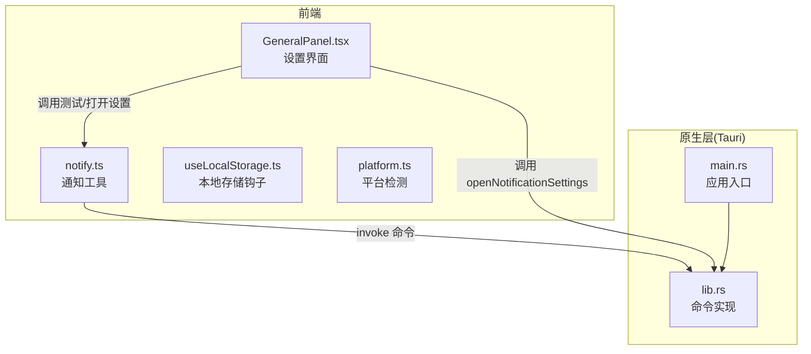
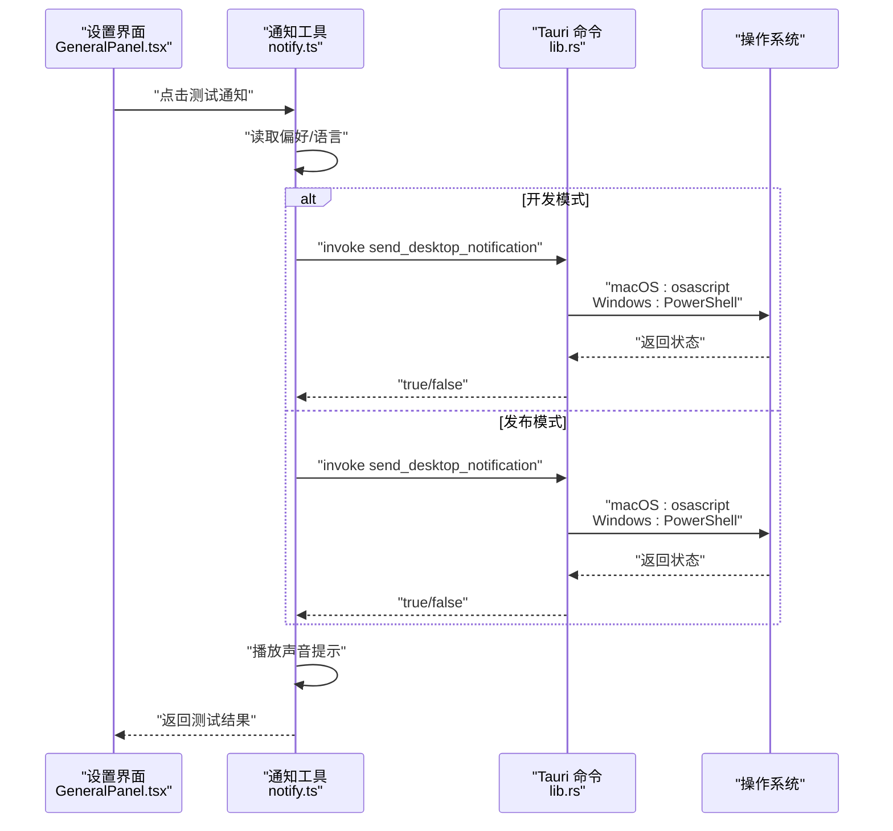
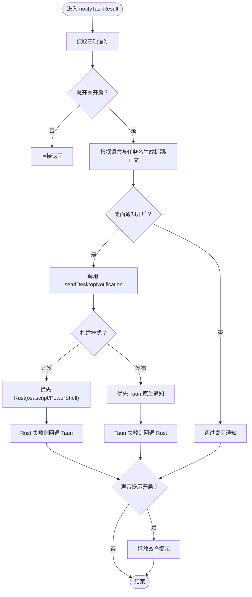
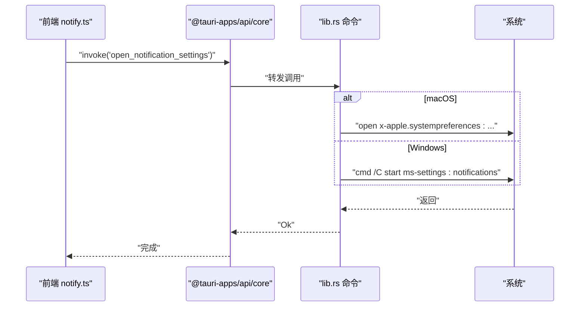
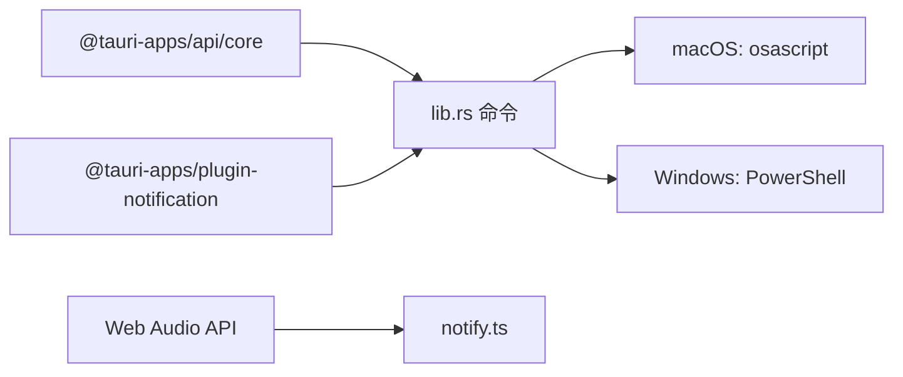

# 通知系统

<cite>
**本文引用的文件**
- [notify.ts](file://src/utils/notify.ts)
- [lib.rs](file://src-tauri/src/lib.rs)
- [GeneralPanel.tsx](file://src/components/settings/GeneralPanel.tsx)
- [useLocalStorage.ts](file://src/hooks/useLocalStorage.ts)
- [platform.ts](file://src/utils/platform.ts)
- [AgentMessage.tsx](file://src/components/agent/AgentMessage.tsx)
- [AgentChat.tsx](file://src/components/agent/AgentChat.tsx)
- [main.rs](file://src-tauri/src/main.rs)
</cite>

## 目录
1. [简介](#简介)
2. [项目结构](#项目结构)
3. [核心组件](#核心组件)
4. [架构总览](#架构总览)
5. [详细组件分析](#详细组件分析)
6. [依赖关系分析](#依赖关系分析)
7. [性能考量](#性能考量)
8. [故障排查指南](#故障排查指南)
9. [结论](#结论)
10. [附录](#附录)

## 简介
本文件面向 RabbitCoding 的跨平台桌面通知系统，提供从前端到原生层的完整技术说明。系统在 macOS 上通过 AppleScript 调用系统通知，在 Windows 上通过 PowerShell 调用系统托盘气泡通知；同时在开发与发布两种构建模式下采用不同策略以规避签名限制与提升用户体验。通知内容支持多语言本地化、可选声音提示，并提供一键打开系统通知设置的能力。

## 项目结构
通知系统涉及以下关键位置：
- 前端通知工具：src/utils/notify.ts
- 设置界面：src/components/settings/GeneralPanel.tsx
- 原生命令桥接：src-tauri/src/lib.rs
- 平台检测：src/utils/platform.ts
- 本地存储钩子：src/hooks/useLocalStorage.ts
- 应用入口（原生）：src-tauri/src/main.rs

图表来源
- [notify.ts:122-132](file://src/utils/notify.ts#L122-L132)
- [lib.rs:114-132](file://src-tauri/src/lib.rs#L114-L132)
- [GeneralPanel.tsx:170-199](file://src/components/settings/GeneralPanel.tsx#L170-L199)
- [main.rs:4-6](file://src-tauri/src/main.rs#L4-L6)

章节来源
- [notify.ts:1-274](file://src/utils/notify.ts#L1-L274)
- [lib.rs:114-186](file://src-tauri/src/lib.rs#L114-L186)
- [GeneralPanel.tsx:132-200](file://src/components/settings/GeneralPanel.tsx#L132-L200)
- [useLocalStorage.ts:1-27](file://src/hooks/useLocalStorage.ts#L1-L27)
- [platform.ts:1-19](file://src/utils/platform.ts#L1-L19)
- [main.rs:4-6](file://src-tauri/src/main.rs#L4-L6)

## 核心组件
- 通知工具模块（notify.ts）
  - 负责读取用户偏好、拼装标题/正文、选择发送通道、播放声音提示、测试通知与打开系统设置。
  - 在开发模式优先使用 Rust 后端（绕过签名限制），在发布模式优先使用 Tauri 原生通知插件。
- 原生命令实现（lib.rs）
  - 提供 open_notification_settings 与 send_desktop_notification 两个命令。
  - macOS 使用 osascript；Windows 使用 PowerShell System.Windows.Forms 弹出气泡。
- 设置界面（GeneralPanel.tsx）
  - 提供“任务完成通知”“桌面通知”“声音提示”三项开关与“测试通知”按钮。
  - 提供“打开系统通知设置”按钮，直接调用原生命令。
- 本地存储钩子（useLocalStorage.ts）
  - 为设置项提供持久化存储，与前端偏好键保持一致。
- 平台检测（platform.ts）
  - 用于 UI 适配（如标题栏样式），与通知功能无直接耦合。

章节来源
- [notify.ts:13-29](file://src/utils/notify.ts#L13-L29)
- [notify.ts:97-120](file://src/utils/notify.ts#L97-L120)
- [lib.rs:114-186](file://src-tauri/src/lib.rs#L114-L186)
- [GeneralPanel.tsx:132-200](file://src/components/settings/GeneralPanel.tsx#L132-L200)
- [useLocalStorage.ts:1-27](file://src/hooks/useLocalStorage.ts#L1-L27)
- [platform.ts:6-18](file://src/utils/platform.ts#L6-L18)

## 架构总览
通知系统采用“前端统一调度 + 原生命令桥接”的架构。前端根据构建模式与用户偏好选择最优通道，必要时回退至另一通道；原生层负责真正调用系统 API。

图表来源
- [notify.ts:97-120](file://src/utils/notify.ts#L97-L120)
- [lib.rs:134-186](file://src-tauri/src/lib.rs#L134-L186)
- [GeneralPanel.tsx:170-184](file://src/components/settings/GeneralPanel.tsx#L170-L184)

## 详细组件分析

### 通知工具模块（notify.ts）
- 偏好键与本地化
  - 偏好键：任务完成通知、桌面通知、声音提示、应用语言。
  - 本地化文案：中英文标题/正文。
- 发送流程
  - 开发模式优先使用 Rust 后端（osascript/PowerShell），失败再回退到 Tauri 插件。
  - 发布模式优先使用 Tauri 原生通知（显示应用名/图标），失败再回退到 Rust 后端。
- 测试通知
  - 同时触发桌面通知与声音，返回结果用于 UI 提示。
- 打开系统设置
  - 通过 invoke open_notification_settings 调用原生命令。

图表来源
- [notify.ts:227-273](file://src/utils/notify.ts#L227-L273)
- [notify.ts:97-120](file://src/utils/notify.ts#L97-L120)

章节来源
- [notify.ts:13-29](file://src/utils/notify.ts#L13-L29)
- [notify.ts:97-120](file://src/utils/notify.ts#L97-L120)
- [notify.ts:208-219](file://src/utils/notify.ts#L208-L219)
- [notify.ts:227-273](file://src/utils/notify.ts#L227-L273)

### 原生命令实现（lib.rs）
- open_notification_settings
  - macOS：打开系统设置的通知扩展页面。
  - Windows：打开 ms-settings:notifications。
- send_desktop_notification
  - macOS：使用 osascript display notification，并播放默认声音。
  - Windows：使用 PowerShell System.Windows.Forms 创建气泡提示。
- 字符串转义
  - macOS：对 AppleScript 字符串进行转义，防止注入与语法错误。

图表来源
- [notify.ts:122-132](file://src/utils/notify.ts#L122-L132)
- [lib.rs:114-132](file://src-tauri/src/lib.rs#L114-L132)

章节来源
- [lib.rs:114-132](file://src-tauri/src/lib.rs#L114-L132)
- [lib.rs:134-186](file://src-tauri/src/lib.rs#L134-L186)
- [lib.rs:188-194](file://src-tauri/src/lib.rs#L188-L194)

### 设置界面（GeneralPanel.tsx）
- 功能
  - 提供三项通知偏好开关。
  - “测试通知”按钮：调用前端测试函数，显示成功/失败状态。
  - “打开系统通知设置”按钮：调用前端 openNotificationSettings，最终由原生层打开系统设置。
- 与前端通知工具的协作
  - 测试按钮直接调用 notify.ts 的测试函数。
  - 打开设置按钮调用 notify.ts 的 openNotificationSettings，后者通过 invoke 调用原生命令。

章节来源
- [GeneralPanel.tsx:132-200](file://src/components/settings/GeneralPanel.tsx#L132-L200)
- [notify.ts:122-132](file://src/utils/notify.ts#L122-L132)

### 本地存储与偏好联动（useLocalStorage.ts）
- 作用
  - 为设置项提供持久化存储，保证用户偏好在重启后仍然生效。
- 与通知工具的配合
  - 通知工具通过 localStorage 读取三项偏好键，确保前后端一致。

章节来源
- [useLocalStorage.ts:1-27](file://src/hooks/useLocalStorage.ts#L1-L27)
- [notify.ts:34-41](file://src/utils/notify.ts#L34-L41)

### 平台检测（platform.ts）
- 作用
  - 识别 macOS/Windows，用于 UI 适配（如标题栏样式）。
- 与通知的关系
  - 与通知功能无直接耦合，但有助于理解 UI 行为差异。

章节来源
- [platform.ts:6-18](file://src/utils/platform.ts#L6-L18)

### 通知触发时机（Agent 相关组件）
- 触发点
  - 当 Agent 返回 result 消息（成功/失败）时，前端根据用户偏好发送通知。
- 组件职责
  - AgentMessage.tsx 展示 result 消息，通知由上层逻辑在消息到达时触发。
  - AgentChat.tsx 负责消息流渲染与滚动控制，不直接处理通知。

章节来源
- [AgentMessage.tsx:88-126](file://src/components/agent/AgentMessage.tsx#L88-L126)
- [AgentChat.tsx:1-215](file://src/components/agent/AgentChat.tsx#L1-L215)

## 依赖关系分析
- 前端依赖
  - @tauri-apps/api/core：用于 invoke 原生命令。
  - @tauri-apps/plugin-notification：用于 Tauri 原生通知插件。
  - Web Audio API：用于播放双音提示音。
- 原生依赖
  - macOS：osascript（系统自带）。
  - Windows：PowerShell（System.Windows.Forms）。
- 构建与运行
  - 开发模式：优先 Rust 后端（绕过 ad-hoc 签名限制）。
  - 发布模式：优先 Tauri 原生通知（显示应用名/图标，系统设置可见）。

图表来源
- [notify.ts:58-90](file://src/utils/notify.ts#L58-L90)
- [lib.rs:134-186](file://src-tauri/src/lib.rs#L134-L186)

章节来源
- [notify.ts:58-90](file://src/utils/notify.ts#L58-L90)
- [lib.rs:134-186](file://src-tauri/src/lib.rs#L134-L186)

## 性能考量
- 通道选择策略
  - 开发模式优先 Rust 后端，减少签名带来的阻塞；发布模式优先 Tauri 原生通知，获得更好的系统集成体验。
- 回退机制
  - 任一通道失败都会快速回退到另一个通道，确保通知可达性。
- 声音播放
  - 使用 Web Audio API 生成双音，避免加载外部音频资源，降低网络与 I/O 开销。
- 日志与调试
  - 前端对各通道调用与返回进行详细日志输出，便于定位问题。

## 故障排查指南
- 症状：测试通知点击后没有弹出
  - 可能原因：系统未授予应用通知权限；macOS 下 Tauri 插件可能出现静默成功但不显示的情况。
  - 解决步骤：
    1) 在设置界面点击“打开系统通知设置”，检查并允许通知。
    2) 若仍不显示，尝试切换构建模式（开发/发布）再次测试。
- 症状：开发模式下通知无法发出
  - 可能原因：osascript/PowerShell 未找到或权限不足。
  - 解决步骤：
    1) 确认系统已安装对应脚本运行环境。
    2) 检查终端中能否手动执行相应脚本命令。
- 症状：声音未播放
  - 可能原因：浏览器自动播放策略限制；AudioContext 被暂停。
  - 解决步骤：
    1) 确保用户交互后触发播放。
    2) 检查 AudioContext 是否处于 suspended 状态并主动 resume。

章节来源
- [notify.ts:122-132](file://src/utils/notify.ts#L122-L132)
- [notify.ts:139-183](file://src/utils/notify.ts#L139-L183)

## 结论
RabbitCoding 的通知系统通过“前端统一调度 + 原生命令桥接”的设计，在不同平台与构建模式下实现了高可用的桌面通知能力。系统兼顾了开发期的易用性与发布期的系统集成体验，并提供了完善的测试与回退机制，确保用户在各种环境下都能及时收到任务完成/失败的反馈。

## 附录

### 通知内容格式化与交互
- 格式化
  - 标题/正文来自本地化字典，支持中英文。
  - 可选在正文中追加任务名称，增强上下文信息。
- 图标显示
  - 发布模式下使用 Tauri 原生通知，系统可显示应用图标。
  - 开发模式下使用系统脚本，通常不显示应用图标。
- 声音播放
  - 使用 Web Audio API 生成双音提示，无需外部音频文件。
- 交互处理
  - 提供“测试通知”按钮与“打开系统通知设置”按钮，便于用户验证与调整权限。

章节来源
- [notify.ts:20-29](file://src/utils/notify.ts#L20-L29)
- [notify.ts:253-258](file://src/utils/notify.ts#L253-L258)
- [notify.ts:139-183](file://src/utils/notify.ts#L139-L183)
- [GeneralPanel.tsx:170-199](file://src/components/settings/GeneralPanel.tsx#L170-L199)