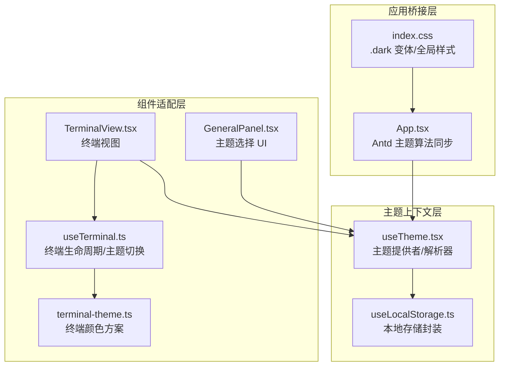
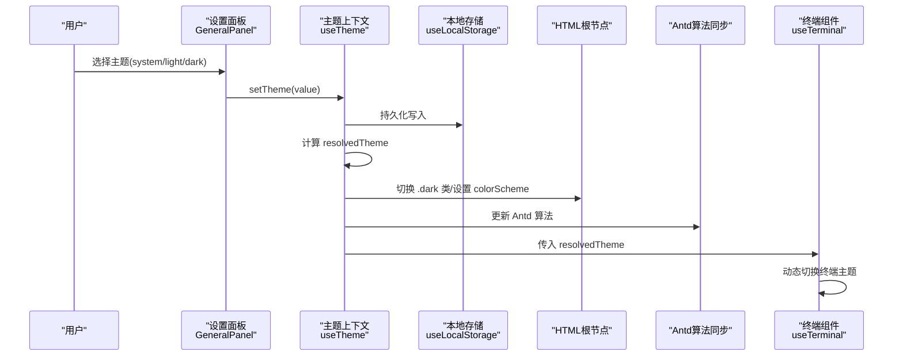
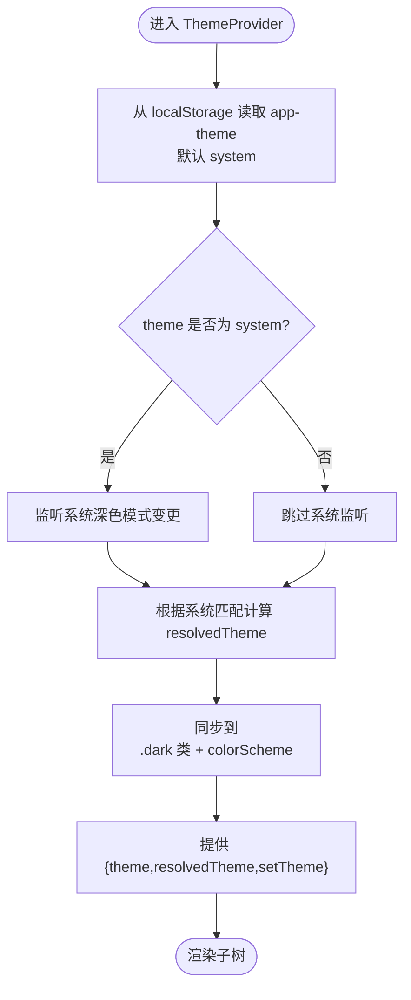
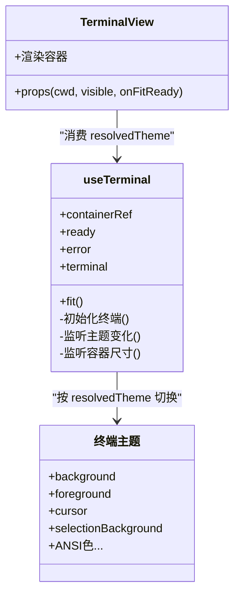
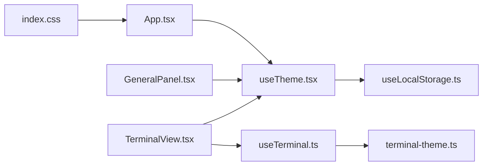

# 主题系统

<cite>
**本文引用的文件**
- [src/hooks/useTheme.tsx](file://src/hooks/useTheme.tsx)
- [src/App.tsx](file://src/App.tsx)
- [src/index.css](file://src/index.css)
- [src/components/terminal/terminal-theme.ts](file://src/components/terminal/terminal-theme.ts)
- [src/components/terminal/useTerminal.ts](file://src/components/terminal/useTerminal.ts)
- [src/components/terminal/TerminalView.tsx](file://src/components/terminal/TerminalView.tsx)
- [src/components/settings/GeneralPanel.tsx](file://src/components/settings/GeneralPanel.tsx)
- [src/hooks/useLocalStorage.ts](file://src/hooks/useLocalStorage.ts)
</cite>

## 目录
1. [简介](#简介)
2. [项目结构](#项目结构)
3. [核心组件](#核心组件)
4. [架构总览](#架构总览)
5. [详细组件分析](#详细组件分析)
6. [依赖关系分析](#依赖关系分析)
7. [性能考量](#性能考量)
8. [故障排查指南](#故障排查指南)
9. [结论](#结论)
10. [附录](#附录)

## 简介
本文件系统性梳理 RabbitCoding 的主题系统，涵盖深色/浅色主题实现、系统主题联动、自定义主题扩展、CSS 变量与类名体系、组件主题适配策略，以及终端主题的特殊处理与颜色方案配置。文档同时给出最佳实践、性能优化建议、兼容性保障与可操作的主题创建示例路径，帮助开发者快速理解并扩展主题能力。

## 项目结构
主题系统围绕“上下文提供者 + 全局样式 + 组件适配 + 终端主题”展开，关键文件分布如下：
- 主题上下文与解析：hooks/useTheme.tsx
- 应用入口桥接：App.tsx
- 全局样式与变体：index.css
- 终端主题常量：components/terminal/terminal-theme.ts
- 终端生命周期与主题切换：components/terminal/useTerminal.ts
- 终端视图组件：components/terminal/TerminalView.tsx
- 设置面板中的主题选择：components/settings/GeneralPanel.tsx
- 本地存储封装：hooks/useLocalStorage.ts

图表来源
- [src/hooks/useTheme.tsx:1-63](file://src/hooks/useTheme.tsx#L1-L63)
- [src/hooks/useLocalStorage.ts:1-27](file://src/hooks/useLocalStorage.ts#L1-L27)
- [src/App.tsx:15-27](file://src/App.tsx#L15-L27)
- [src/index.css:6-8](file://src/index.css#L6-L8)
- [src/components/settings/GeneralPanel.tsx:104-130](file://src/components/settings/GeneralPanel.tsx#L104-L130)
- [src/components/terminal/TerminalView.tsx:15-47](file://src/components/terminal/TerminalView.tsx#L15-L47)
- [src/components/terminal/useTerminal.ts:33-202](file://src/components/terminal/useTerminal.ts#L33-L202)
- [src/components/terminal/terminal-theme.ts:1-58](file://src/components/terminal/terminal-theme.ts#L1-L58)

章节来源
- [src/hooks/useTheme.tsx:1-63](file://src/hooks/useTheme.tsx#L1-L63)
- [src/App.tsx:15-27](file://src/App.tsx#L15-L27)
- [src/index.css:6-8](file://src/index.css#L6-L8)
- [src/components/settings/GeneralPanel.tsx:104-130](file://src/components/settings/GeneralPanel.tsx#L104-L130)
- [src/components/terminal/TerminalView.tsx:15-47](file://src/components/terminal/TerminalView.tsx#L15-L47)
- [src/components/terminal/useTerminal.ts:33-202](file://src/components/terminal/useTerminal.ts#L33-L202)
- [src/components/terminal/terminal-theme.ts:1-58](file://src/components/terminal/terminal-theme.ts#L1-L58)

## 核心组件
- 主题提供者与解析器：负责读取用户选择、监听系统主题变化、计算实际生效主题，并同步到 HTML 根节点以驱动 CSS 变体与原生控件外观。
- Ant Design 主题同步：将 resolvedTheme 映射到 Antd 的算法，确保第三方组件跟随主题。
- 终端主题：提供亮/暗两套颜色方案，随 resolvedTheme 动态切换。
- 设置面板：提供系统/浅色/深色三档主题选择。
- 本地存储：持久化用户主题偏好。

章节来源
- [src/hooks/useTheme.tsx:10-62](file://src/hooks/useTheme.tsx#L10-L62)
- [src/App.tsx:15-27](file://src/App.tsx#L15-L27)
- [src/components/terminal/terminal-theme.ts:1-58](file://src/components/terminal/terminal-theme.ts#L1-L58)
- [src/components/settings/GeneralPanel.tsx:12-17](file://src/components/settings/GeneralPanel.tsx#L12-L17)
- [src/hooks/useLocalStorage.ts:1-27](file://src/hooks/useLocalStorage.ts#L1-L27)

## 架构总览
主题系统采用“上下文 + 全局样式 + 组件适配”的分层设计：
- 上下文层：统一管理用户选择与解析结果，暴露 setTheme 供 UI 修改。
- 样式层：通过 .dark 变体与 colorScheme 控制原生控件与组件外观。
- 组件层：Antd 使用算法同步；终端独立主题；通用组件使用 CSS 变体与暗色变量。
- 终端层：xterm.js 与 PTY 生命周期管理，按 resolvedTheme 切换内置主题。

图表来源
- [src/components/settings/GeneralPanel.tsx:110-129](file://src/components/settings/GeneralPanel.tsx#L110-L129)
- [src/hooks/useTheme.tsx:25-56](file://src/hooks/useTheme.tsx#L25-L56)
- [src/hooks/useLocalStorage.ts:3-26](file://src/hooks/useLocalStorage.ts#L3-L26)
- [src/App.tsx:15-27](file://src/App.tsx#L15-L27)
- [src/components/terminal/useTerminal.ts:153-158](file://src/components/terminal/useTerminal.ts#L153-L158)

## 详细组件分析

### 主题上下文与解析（useTheme）
- 支持的主题类型：system、light、dark；解析后得到 resolvedTheme：light 或 dark。
- 本地存储键：app-theme，默认 system。
- 系统主题监听：仅在 theme 为 system 时监听 prefers-color-scheme 变化。
- 根节点同步：向 documentElement 添加/移除 .dark 类，并设置 colorScheme，从而驱动：
  - CSS 变体 dark: …
  - 原生控件（如 range、select）外观
- 提供 useTheme Hook 以在任意子树访问 theme/resolvedTheme/setTheme。

图表来源
- [src/hooks/useTheme.tsx:25-56](file://src/hooks/useTheme.tsx#L25-L56)

章节来源
- [src/hooks/useTheme.tsx:10-62](file://src/hooks/useTheme.tsx#L10-L62)
- [src/hooks/useLocalStorage.ts:3-26](file://src/hooks/useLocalStorage.ts#L3-L26)

### Ant Design 主题同步（App）
- 将 resolvedTheme 映射到 Antd 的算法：深色用 darkAlgorithm，浅色用 defaultAlgorithm。
- 通过 ConfigProvider 包裹整个应用，确保所有 Antd 组件跟随主题。

章节来源
- [src/App.tsx:15-27](file://src/App.tsx#L15-L27)

### 全局样式与 CSS 变体（index.css）
- 引入 Markdown 主题样式，分别用于浅色与深色。
- 定义基于 .dark 的 CSS 变体，确保后代元素正确继承。
- 通过 .x-markdown-* 自定义变量覆盖文本颜色与字号。
- 登录按钮在浅/深色下的悬停背景色差异，体现 .dark 变体生效。

章节来源
- [src/index.css:1-56](file://src/index.css#L1-L56)

### 终端主题与适配（terminal-theme + useTerminal + TerminalView）
- 终端主题：提供 terminalTheme（浅色）与 terminalThemeDark（VS Code Dark+ 风格），包含背景、前景、光标、选择、ANSI 色等。
- 终端生命周期：useTerminal 初始化 xterm.js、加载 Fit/Canvas 插件、建立 PTY 数据通道、处理退出事件、响应容器尺寸变化并自动 fit。
- 主题切换：useTerminal 在 resolvedTheme 变化时动态更新终端主题；TerminalView 从 useTheme 获取 resolvedTheme 并传入 useTerminal。
- 字体与排版：固定等宽字体链、字号与行高，确保跨平台一致性。

图表来源
- [src/components/terminal/terminal-theme.ts:1-58](file://src/components/terminal/terminal-theme.ts#L1-L58)
- [src/components/terminal/useTerminal.ts:33-202](file://src/components/terminal/useTerminal.ts#L33-L202)
- [src/components/terminal/TerminalView.tsx:15-47](file://src/components/terminal/TerminalView.tsx#L15-L47)

章节来源
- [src/components/terminal/terminal-theme.ts:1-58](file://src/components/terminal/terminal-theme.ts#L1-L58)
- [src/components/terminal/useTerminal.ts:33-202](file://src/components/terminal/useTerminal.ts#L33-L202)
- [src/components/terminal/TerminalView.tsx:15-47](file://src/components/terminal/TerminalView.tsx#L15-L47)

### 设置面板中的主题选择（GeneralPanel）
- 提供三档主题选项：系统、浅色、深色。
- 通过 useTheme 的 setTheme 更新主题并持久化。
- UI 使用圆角边框与过渡动画，突出当前选中项。

章节来源
- [src/components/settings/GeneralPanel.tsx:12-17](file://src/components/settings/GeneralPanel.tsx#L12-L17)
- [src/components/settings/GeneralPanel.tsx:110-129](file://src/components/settings/GeneralPanel.tsx#L110-L129)

## 依赖关系分析
- useTheme 依赖 useLocalStorage 存储用户偏好。
- App 将 resolvedTheme 传递给 Antd ConfigProvider，实现第三方组件主题同步。
- 终端组件链路：TerminalView -> useTerminal -> terminal-theme，形成闭环的主题适配。
- index.css 通过 .dark 变体与 colorScheme 影响全局与原生控件。

图表来源
- [src/hooks/useTheme.tsx:1-63](file://src/hooks/useTheme.tsx#L1-L63)
- [src/hooks/useLocalStorage.ts:1-27](file://src/hooks/useLocalStorage.ts#L1-L27)
- [src/App.tsx:15-27](file://src/App.tsx#L15-L27)
- [src/index.css:6-8](file://src/index.css#L6-L8)
- [src/components/settings/GeneralPanel.tsx:110-129](file://src/components/settings/GeneralPanel.tsx#L110-L129)
- [src/components/terminal/TerminalView.tsx:15-47](file://src/components/terminal/TerminalView.tsx#L15-L47)
- [src/components/terminal/useTerminal.ts:33-202](file://src/components/terminal/useTerminal.ts#L33-L202)
- [src/components/terminal/terminal-theme.ts:1-58](file://src/components/terminal/terminal-theme.ts#L1-L58)

章节来源
- [src/hooks/useTheme.tsx:1-63](file://src/hooks/useTheme.tsx#L1-L63)
- [src/hooks/useLocalStorage.ts:1-27](file://src/hooks/useLocalStorage.ts#L1-L27)
- [src/App.tsx:15-27](file://src/App.tsx#L15-L27)
- [src/index.css:6-8](file://src/index.css#L6-L8)
- [src/components/settings/GeneralPanel.tsx:110-129](file://src/components/settings/GeneralPanel.tsx#L110-L129)
- [src/components/terminal/TerminalView.tsx:15-47](file://src/components/terminal/TerminalView.tsx#L15-L47)
- [src/components/terminal/useTerminal.ts:33-202](file://src/components/terminal/useTerminal.ts#L33-L202)
- [src/components/terminal/terminal-theme.ts:1-58](file://src/components/terminal/terminal-theme.ts#L1-L58)

## 性能考量
- 主题切换最小化重绘：resolvedTheme 仅影响 <html> 类与 colorScheme，避免大规模样式重算。
- 终端主题切换：仅更新 xterm 实例的 theme 选项，不重建终端，降低开销。
- 尺寸适配防抖：终端容器 ResizeObserver 使用 200ms 防抖，减少频繁 fit。
- 渲染回退：CanvasAddon 加载失败时回退至 DOM 渲染，保证可用性。
- 本地存储容错：写入失败静默处理，避免阻塞主线程。

章节来源
- [src/components/terminal/useTerminal.ts:160-183](file://src/components/terminal/useTerminal.ts#L160-L183)
- [src/components/terminal/useTerminal.ts:85-90](file://src/components/terminal/useTerminal.ts#L85-L90)
- [src/hooks/useLocalStorage.ts:16-22](file://src/hooks/useLocalStorage.ts#L16-L22)

## 故障排查指南
- 主题未生效
  - 检查 <html> 是否存在 .dark 类与 colorScheme 设置。
  - 确认 resolvedTheme 是否正确计算（system 模式需监听系统深色变更）。
- Antd 组件未随主题变化
  - 确认 App 中已包裹 Antd ConfigProvider 并传入对应算法。
- 终端主题未切换
  - 确认 TerminalView 传入了 resolvedTheme。
  - 确认 useTerminal 在 resolvedTheme 变化时更新了终端主题。
- 终端启动失败
  - 查看错误信息并确认默认 Shell 可用、环境变量设置正确。
- 通知或设置无法持久化
  - 检查浏览器是否禁用 localStorage 或存储空间不足。

章节来源
- [src/hooks/useTheme.tsx:44-49](file://src/hooks/useTheme.tsx#L44-L49)
- [src/App.tsx:15-27](file://src/App.tsx#L15-L27)
- [src/components/terminal/useTerminal.ts:153-158](file://src/components/terminal/useTerminal.ts#L153-L158)
- [src/components/terminal/useTerminal.ts:105-109](file://src/components/terminal/useTerminal.ts#L105-L109)
- [src/hooks/useLocalStorage.ts:16-22](file://src/hooks/useLocalStorage.ts#L16-L22)

## 结论
RabbitCoding 的主题系统以 useTheme 为核心，结合 CSS 变体与 Antd 算法同步，实现了对 UI 的统一主题控制；终端主题通过独立的颜色方案与动态切换，确保命令行体验的一致性。该架构具备良好的扩展性与性能表现，适合进一步引入自定义主题与更丰富的颜色变量体系。

## 附录

### 自定义主题创建与管理（实践步骤）
- 新增颜色变量
  - 在全局样式中定义新的 CSS 变量，供组件通过 var(...) 引用。
  - 示例参考路径：[src/index.css:31-47](file://src/index.css#L31-L47)
- 扩展主题选项
  - 在设置面板中添加新选项，调用 setTheme 更新用户选择。
  - 示例参考路径：[src/components/settings/GeneralPanel.tsx:12-17](file://src/components/settings/GeneralPanel.tsx#L12-L17)
- 适配第三方组件
  - 通过 Antd ConfigProvider 的 theme.algorithm 与 token 覆盖，实现组件级主题定制。
  - 示例参考路径：[src/App.tsx:15-27](file://src/App.tsx#L15-L27)
- 终端主题扩展
  - 在 terminal-theme.ts 中新增一组 ITheme，并在 useTerminal 中按 resolvedTheme 选择。
  - 示例参考路径：[src/components/terminal/terminal-theme.ts:1-58](file://src/components/terminal/terminal-theme.ts#L1-L58)，[src/components/terminal/useTerminal.ts:73](file://src/components/terminal/useTerminal.ts#L73)
- 字体与排版
  - 在 useTerminal 中调整字体族、字号与行高，确保跨平台一致性。
  - 示例参考路径：[src/components/terminal/useTerminal.ts:70-72](file://src/components/terminal/useTerminal.ts#L70-L72)

### 最佳实践
- 使用 .dark 变体与 colorScheme 统一控制原生控件与后代组件外观。
- 将主题偏好持久化于 localStorage，提供即时恢复。
- 终端主题与 UI 主题解耦，通过 resolvedTheme 动态切换，避免硬编码。
- 对于复杂组件，优先通过算法与 token 调整，而非直接覆盖样式。
- 为终端主题提供明/暗两套配色，兼顾可读性与对比度。