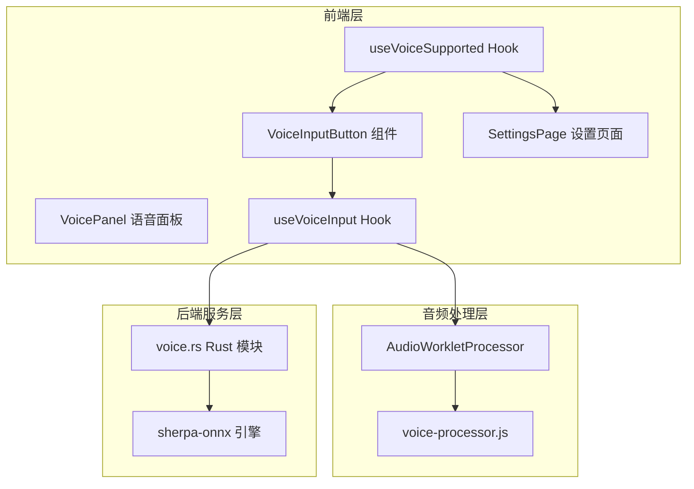
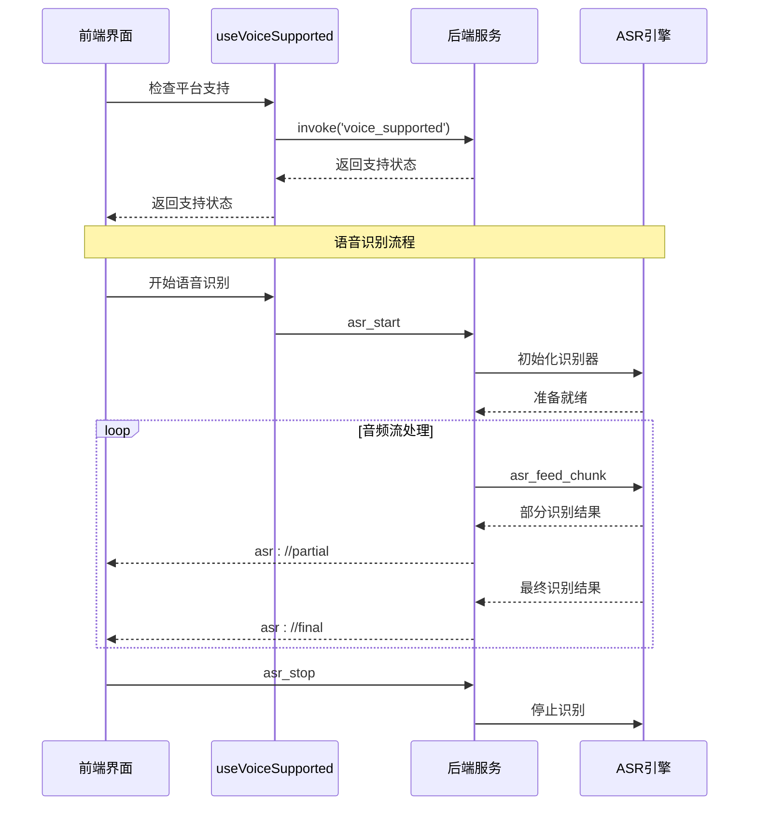
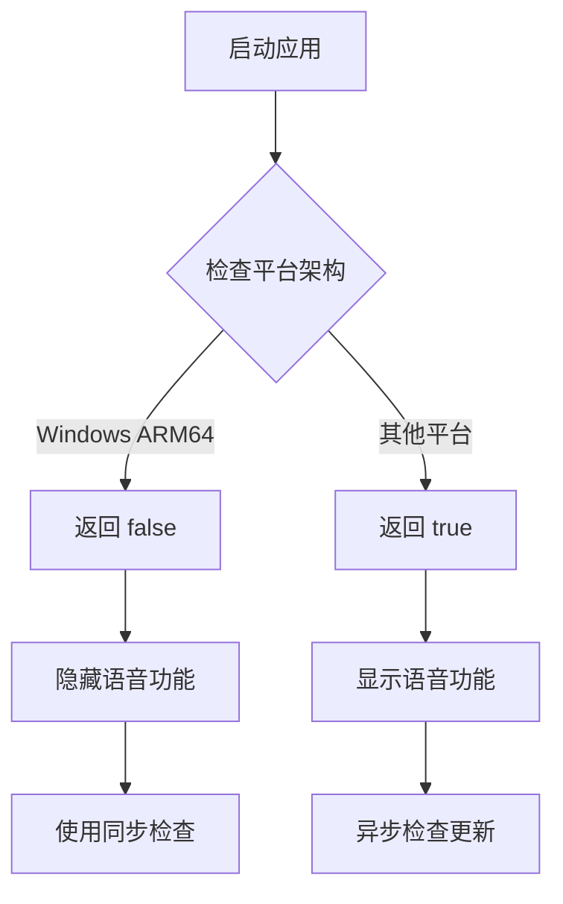
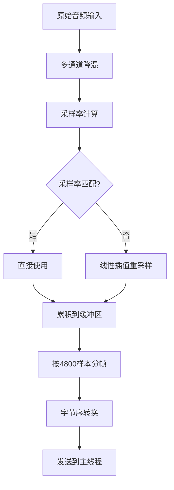
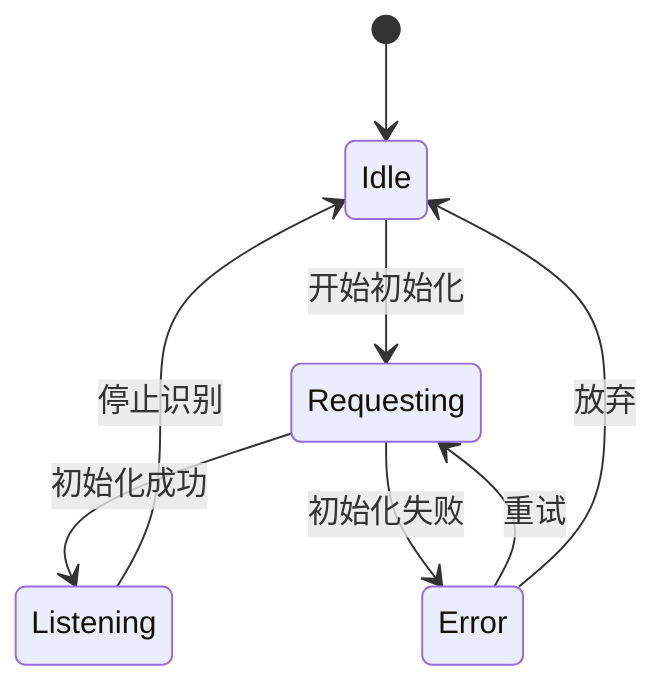
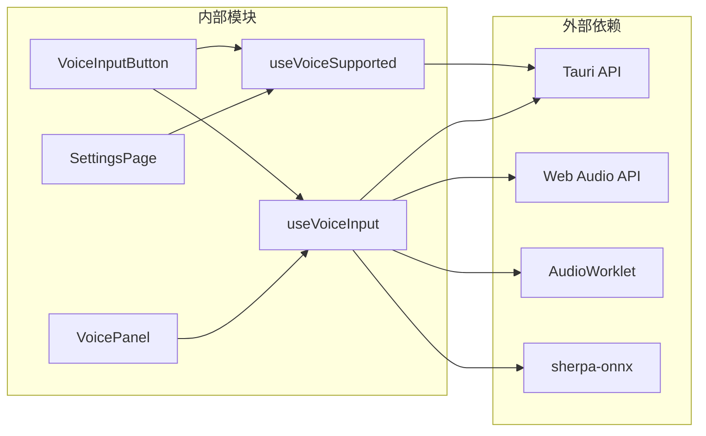

# useVoiceSupported Hook

<cite>
**本文档引用的文件**
- [useVoiceSupported.ts](file://src/hooks/useVoiceSupported.ts)
- [useVoiceInput.ts](file://src/hooks/useVoiceInput.ts)
- [VoiceInputButton.tsx](file://src/components/common/VoiceInputButton.tsx)
- [SettingsPage.tsx](file://src/components/settings/SettingsPage.tsx)
- [VoicePanel.tsx](file://src/components/settings/VoicePanel.tsx)
- [voice-processor.js](file://public/voice-processor.js)
- [voice.rs](file://src-tauri/src/voice.rs)
</cite>

## 目录
1. [简介](#简介)
2. [项目结构](#项目结构)
3. [核心组件](#核心组件)
4. [架构概览](#架构概览)
5. [详细组件分析](#详细组件分析)
6. [依赖关系分析](#依赖关系分析)
7. [性能考虑](#性能考虑)
8. [故障排除指南](#故障排除指南)
9. [结论](#结论)

## 简介

`useVoiceSupported` Hook 是 RabbitCoding 语音识别功能中的关键组件，负责检测当前平台是否支持语音识别功能。该 Hook 通过后端编译期判定来确定语音识别的支持情况，并在前端层面隐藏或显示相关的语音输入按钮和语音设置页面。

该项目实现了完整的端到端语音识别解决方案，包括：
- 平台兼容性检测
- 实时语音识别（基于 sherpa-onnx）
- 音频流处理和分帧
- 模型下载和管理
- 用户界面集成

## 项目结构

语音识别功能涉及多个层次的组件协作：

**图表来源**
- [useVoiceSupported.ts:1-28](file://src/hooks/useVoiceSupported.ts#L1-L28)
- [VoiceInputButton.tsx:1-217](file://src/components/common/VoiceInputButton.tsx#L1-L217)
- [voice-processor.js:1-99](file://public/voice-processor.js#L1-L99)
- [voice.rs:1-200](file://src-tauri/src/voice.rs#L1-L200)

**章节来源**
- [useVoiceSupported.ts:1-28](file://src/hooks/useVoiceSupported.ts#L1-L28)
- [VoiceInputButton.tsx:1-217](file://src/components/common/VoiceInputButton.tsx#L1-L217)
- [SettingsPage.tsx:1-246](file://src/components/settings/SettingsPage.tsx#L1-L246)

## 核心组件

### useVoiceSupported Hook

`useVoiceSupported` Hook 提供了两个主要函数：

1. **isVoiceSupportedSync()** - 同步获取平台支持状态
2. **checkVoiceSupported()** - 异步查询后端支持状态

该 Hook 使用模块级缓存机制来优化性能，避免重复的网络请求。

**章节来源**
- [useVoiceSupported.ts:1-28](file://src/hooks/useVoiceSupported.ts#L1-L28)

### useVoiceInput Hook

`useVoiceInput` Hook 封装了完整的语音识别流程，包括：
- 麦克风权限获取
- 音频流创建和处理
- 实时音频分帧和传输
- 识别结果处理和回调

**章节来源**
- [useVoiceInput.ts:1-278](file://src/hooks/useVoiceInput.ts#L1-L278)

### 音频处理器

`voice-processor.js` 是一个 AudioWorkletProcessor，负责：
- 音频采样率转换（48kHz → 16kHz）
- 音频缓冲和分帧
- 音频数据格式转换
- 与主线程的通信

**章节来源**
- [voice-processor.js:1-99](file://public/voice-processor.js#L1-L99)

## 架构概览

语音识别系统的整体架构采用分层设计：

**图表来源**
- [useVoiceSupported.ts:18-27](file://src/hooks/useVoiceSupported.ts#L18-L27)
- [useVoiceInput.ts:137-233](file://src/hooks/useVoiceInput.ts#L137-L233)
- [voice.rs:852-930](file://src-tauri/src/voice.rs#L852-L930)

## 详细组件分析

### 平台支持检测机制

平台支持检测是通过后端编译期条件判断实现的：

**图表来源**
- [useVoiceSupported.ts:1-28](file://src/hooks/useVoiceSupported.ts#L1-L28)
- [voice.rs:832-850](file://src-tauri/src/voice.rs#L832-L850)

### 语音识别工作流程

完整的语音识别流程包括以下步骤：

1. **初始化阶段**
   - 检查平台支持状态
   - 获取麦克风权限
   - 创建音频上下文和 AudioWorklet

2. **音频处理阶段**
   - 音频采样率转换
   - 音频分帧处理
   - 实时音频数据传输

3. **识别阶段**
   - VAD 语音活动检测
   - SenseVoice 离线识别
   - 实时结果输出

**章节来源**
- [useVoiceInput.ts:137-233](file://src/hooks/useVoiceInput.ts#L137-L233)
- [voice-processor.js:23-95](file://public/voice-processor.js#L23-L95)

### 音频处理算法

AudioWorkletProcessor 实现了高效的音频处理算法：

**图表来源**
- [voice-processor.js:23-95](file://public/voice-processor.js#L23-L95)

**章节来源**
- [voice-processor.js:1-99](file://public/voice-processor.js#L1-L99)

### 错误处理机制

系统实现了多层次的错误处理：

**图表来源**
- [useVoiceInput.ts:107-123](file://src/hooks/useVoiceInput.ts#L107-L123)

**章节来源**
- [useVoiceInput.ts:217-233](file://src/hooks/useVoiceInput.ts#L217-L233)

## 依赖关系分析

语音识别功能的依赖关系如下：

**图表来源**
- [useVoiceSupported.ts:9-9](file://src/hooks/useVoiceSupported.ts#L9-L9)
- [useVoiceInput.ts:10-12](file://src/hooks/useVoiceInput.ts#L10-L12)

**章节来源**
- [useVoiceSupported.ts:1-28](file://src/hooks/useVoiceSupported.ts#L1-L28)
- [useVoiceInput.ts:1-278](file://src/hooks/useVoiceInput.ts#L1-L278)

## 性能考虑

### 缓存策略
- 模块级缓存避免重复的后端查询
- 同步检查提供即时响应
- 异步检查确保数据准确性

### 音频处理优化
- AudioWorklet 处理减少主线程负担
- 零拷贝内存传输
- 智能缓冲区管理

### 内存管理
- 及时释放音频资源
- 监听器清理机制
- 会话状态管理

## 故障排除指南

### 常见问题及解决方案

1. **语音按钮不显示**
   - 检查平台支持状态
   - 验证后端命令可用性
   - 查看控制台错误信息

2. **语音识别失败**
   - 确认麦克风权限
   - 检查模型下载状态
   - 验证网络连接

3. **音频质量差**
   - 调整采样率设置
   - 检查音频设备
   - 优化环境噪声

**章节来源**
- [useVoiceInput.ts:217-233](file://src/hooks/useVoiceInput.ts#L217-L233)
- [VoiceInputButton.tsx:118-126](file://src/components/common/VoiceInputButton.tsx#L118-L126)

## 结论

`useVoiceSupported` Hook 作为语音识别功能的核心入口，通过简洁而高效的设计实现了平台兼容性检测。该 Hook 与 `useVoiceInput` Hook、AudioWorklet 处理器以及 Rust 后端服务形成了完整的语音识别生态系统。

该系统的主要优势包括：
- **平台适配性强**：通过编译期条件判断确保跨平台兼容
- **用户体验优秀**：无缝的语音识别体验和直观的界面反馈
- **性能优化到位**：多层次的缓存和优化策略
- **错误处理完善**：全面的异常处理和用户提示机制

未来可以考虑的功能扩展包括：
- 更多平台的支持（如 Linux ARM64）
- 多语言模型的动态加载
- 云端识别服务的集成
- 语音识别结果的自定义处理