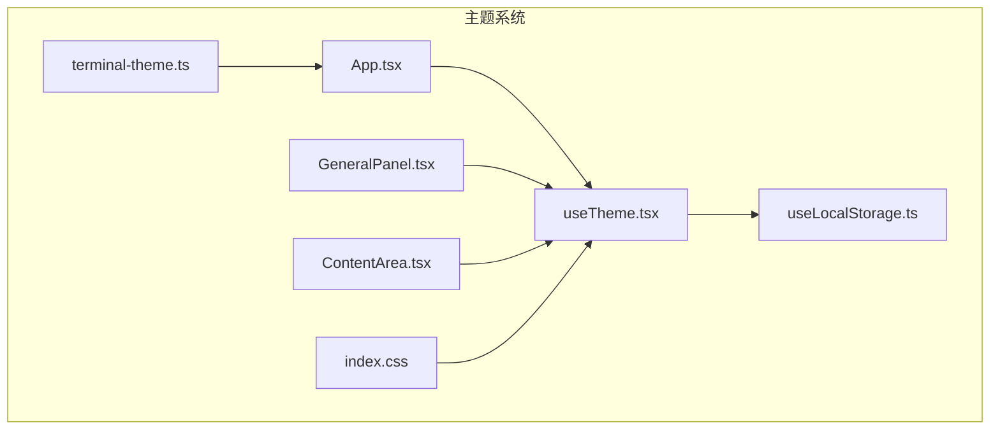
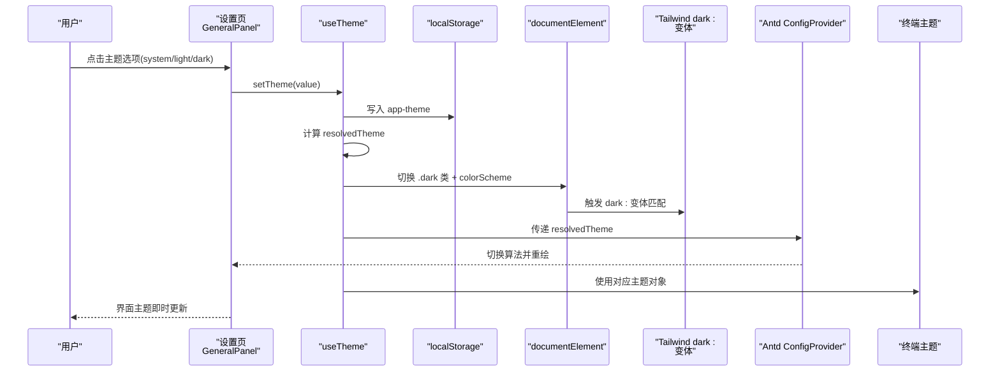
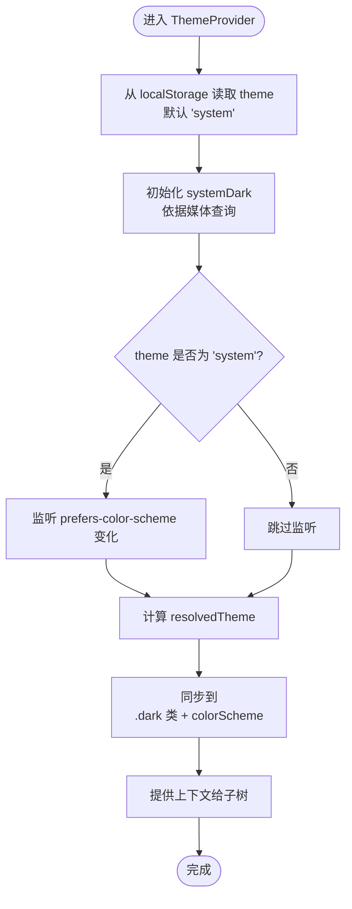
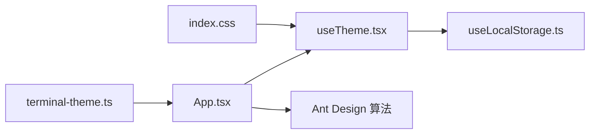

# 主题系统

<cite>
**本文引用的文件**
- [src/hooks/useTheme.tsx](file://src/hooks/useTheme.tsx)
- [src/hooks/useLocalStorage.ts](file://src/hooks/useLocalStorage.ts)
- [src/index.css](file://src/index.css)
- [src/components/terminal/terminal-theme.ts](file://src/components/terminal/terminal-theme.ts)
- [src/App.tsx](file://src/App.tsx)
- [src/components/settings/GeneralPanel.tsx](file://src/components/settings/GeneralPanel.tsx)
- [src/components/ContentArea.tsx](file://src/components/ContentArea.tsx)
</cite>

## 目录
1. [简介](#简介)
2. [项目结构](#项目结构)
3. [核心组件](#核心组件)
4. [架构总览](#架构总览)
5. [详细组件分析](#详细组件分析)
6. [依赖关系分析](#依赖关系分析)
7. [性能考量](#性能考量)
8. [故障排查指南](#故障排查指南)
9. [结论](#结论)
10. [附录](#附录)

## 简介
本文件系统性解析 RabbitCoding 的主题系统，涵盖深色/浅色主题的切换机制、主题配置的存储与应用流程、useTheme Hook 的实现原理、主题状态管理、组件级主题适配、Tailwind CSS 类名的动态生成、CSS 变量与原生应用主题同步、自定义主题的创建方法、主题变量定义规范、主题切换动画效果，以及主题扩展与视觉设计最佳实践。

## 项目结构
主题系统围绕以下关键文件协同工作：
- useTheme Hook：提供主题上下文、解析用户选择与系统偏好、持久化存储、并同步到 DOM 与原生控件。
- useLocalStorage Hook：封装本地存储读写，保证主题配置跨会话持久化。
- index.css：引入 Tailwind、Markdown 主题样式，并通过自定义变体与 CSS 变量支持深色模式。
- terminal-theme.ts：定义终端组件的亮/暗两套主题色板。
- App.tsx：将 useTheme 与 Ant Design 主题算法对接，确保 UI 组件跟随主题变化。
- GeneralPanel.tsx：设置页“外观”区域，提供主题切换入口。
- ContentArea.tsx：组件级主题适配示例，展示如何在业务组件中消费 resolvedTheme。

图表来源
- [src/hooks/useTheme.tsx:1-63](file://src/hooks/useTheme.tsx#L1-L63)
- [src/hooks/useLocalStorage.ts:1-27](file://src/hooks/useLocalStorage.ts#L1-L27)
- [src/index.css:1-151](file://src/index.css#L1-L151)
- [src/App.tsx:1-107](file://src/App.tsx#L1-L107)
- [src/components/settings/GeneralPanel.tsx:1-250](file://src/components/settings/GeneralPanel.tsx#L1-L250)
- [src/components/terminal/terminal-theme.ts:1-58](file://src/components/terminal/terminal-theme.ts#L1-L58)
- [src/components/ContentArea.tsx:1-480](file://src/components/ContentArea.tsx#L1-L480)

章节来源
- [src/hooks/useTheme.tsx:1-63](file://src/hooks/useTheme.tsx#L1-L63)
- [src/hooks/useLocalStorage.ts:1-27](file://src/hooks/useLocalStorage.ts#L1-L27)
- [src/index.css:1-151](file://src/index.css#L1-L151)
- [src/App.tsx:1-107](file://src/App.tsx#L1-L107)
- [src/components/settings/GeneralPanel.tsx:1-250](file://src/components/settings/GeneralPanel.tsx#L1-L250)
- [src/components/terminal/terminal-theme.ts:1-58](file://src/components/terminal/terminal-theme.ts#L1-L58)
- [src/components/ContentArea.tsx:1-480](file://src/components/ContentArea.tsx#L1-L480)

## 核心组件
- useTheme Hook
  - 职责：提供主题上下文，暴露 theme（用户选择）、resolvedTheme（实际生效）、setTheme 方法；在系统模式下监听系统深色偏好变化；将 resolvedTheme 同步到 <html> 的类与 colorScheme 属性，驱动 Tailwind dark: 变体与原生控件外观。
  - 关键点：使用 useLocalStorage 持久化用户选择；根据系统媒体查询动态更新；通过 useEffect 将主题同步至根节点。
- useLocalStorage Hook
  - 职责：封装 localStorage 读写，带错误兜底；返回 [storedValue, setValue]，setValue 支持函数式更新。
- index.css
  - 职责：引入 Tailwind 并启用 dark: 自定义变体；导入 Markdown 亮/暗主题；通过 CSS 变量与选择器覆盖特定组件样式；为登录按钮等提供亮/暗两套 hover 效果。
- App.tsx 中的 AntdThemeSync
  - 职责：将 useTheme 的 resolvedTheme 传递给 Ant Design 的 ConfigProvider，按需切换算法，使 Antd 组件跟随主题变化。
- GeneralPanel.tsx
  - 职责：渲染“外观”设置项，提供 system/light/dark 三态切换按钮，调用 setTheme 更新主题。
- ContentArea.tsx
  - 职责：在组件内部消费 useTheme，根据 resolvedTheme 控制样式与交互细节，体现主题适配落地。
- terminal-theme.ts
  - 职责：导出亮/暗两套终端主题对象，供终端组件使用，确保终端界面与应用整体风格一致。

章节来源
- [src/hooks/useTheme.tsx:10-62](file://src/hooks/useTheme.tsx#L10-L62)
- [src/hooks/useLocalStorage.ts:3-26](file://src/hooks/useLocalStorage.ts#L3-L26)
- [src/index.css:6-48](file://src/index.css#L6-L48)
- [src/App.tsx:16-28](file://src/App.tsx#L16-L28)
- [src/components/settings/GeneralPanel.tsx:13-130](file://src/components/settings/GeneralPanel.tsx#L13-L130)
- [src/components/ContentArea.tsx:19-480](file://src/components/ContentArea.tsx#L19-L480)
- [src/components/terminal/terminal-theme.ts:6-57](file://src/components/terminal/terminal-theme.ts#L6-L57)

## 架构总览
主题系统采用“上下文 + 本地存储 + DOM 同步”的三层架构：
- 上下文层：useTheme 提供 theme/resolvedTheme/setTheme，统一管理主题状态。
- 存储层：useLocalStorage 将用户选择持久化到 localStorage。
- 应用层：index.css 的 dark: 变体与 HTML 的 colorScheme 驱动 Tailwind 与原生控件；Antd 通过 AntdThemeSync 同步算法；终端组件使用 terminal-theme.ts 的主题对象。

图表来源
- [src/components/settings/GeneralPanel.tsx:110-129](file://src/components/settings/GeneralPanel.tsx#L110-L129)
- [src/hooks/useTheme.tsx:25-56](file://src/hooks/useTheme.tsx#L25-L56)
- [src/index.css:6-7](file://src/index.css#L6-L7)
- [src/App.tsx:16-28](file://src/App.tsx#L16-L28)
- [src/components/terminal/terminal-theme.ts:6-57](file://src/components/terminal/terminal-theme.ts#L6-L57)

## 详细组件分析

### useTheme Hook 实现原理
- 状态与类型
  - Theme：'system' | 'light' | 'dark'
  - ResolvedTheme：'light' | 'dark'
  - 上下文值包含 theme、resolvedTheme、setTheme。
- 初始化与持久化
  - 使用 useLocalStorage 读取 key 为 'app-theme' 的值，默认 'system'。
- 系统主题监听
  - 当 theme 为 'system' 时，监听 prefers-color-scheme 媒体查询变化，动态更新 systemDark。
- 解析与同步
  - resolvedTheme = theme === 'system' ? (systemDark ? 'dark' : 'light') : theme
  - 将 resolvedTheme 同步到 document.documentElement：
    - 添加/移除 'dark' 类
    - 设置 style.colorScheme
- 错误处理
  - 在 Provider 外部调用 useTheme 会抛错，避免误用。

图表来源
- [src/hooks/useTheme.tsx:25-56](file://src/hooks/useTheme.tsx#L25-L56)

章节来源
- [src/hooks/useTheme.tsx:10-62](file://src/hooks/useTheme.tsx#L10-L62)

### 主题配置的存储与应用流程
- 存储
  - key: 'app-theme'
  - 默认值: 'system'
  - 通过 useLocalStorage 的 setValue 支持函数式更新，保证并发安全。
- 应用
  - 读取阶段：首次渲染即从 localStorage 恢复用户选择。
  - 写入阶段：用户点击设置页主题按钮后，setTheme 更新状态并持久化。
  - 生效阶段：useEffect 将 resolvedTheme 同步到 <html>，触发 Tailwind dark: 变体与 Antd 算法切换。

章节来源
- [src/hooks/useLocalStorage.ts:3-26](file://src/hooks/useLocalStorage.ts#L3-L26)
- [src/components/settings/GeneralPanel.tsx:110-129](file://src/components/settings/GeneralPanel.tsx#L110-L129)
- [src/hooks/useTheme.tsx:25-56](file://src/hooks/useTheme.tsx#L25-L56)

### 组件级别的主题适配
- 在业务组件中使用 useTheme 获取 resolvedTheme，据此控制样式或行为。
- 示例：ContentArea 中根据 resolvedTheme 切换边框、背景与文本颜色，体现 dark: 变体的实际效果。

章节来源
- [src/components/ContentArea.tsx:19-480](file://src/components/ContentArea.tsx#L19-L480)

### Tailwind CSS 类名的动态生成与 dark: 变体
- 自定义变体：通过 @custom-variant dark 定义，使选择器如 .dark & 或 :where(.dark, .dark *) 生效。
- 动态类：useTheme 将 'dark' 类添加到 <html>，从而激活所有受 dark: 影响的 Tailwind 类。
- 与 CSS 变量结合：index.css 中对部分组件提供亮/暗两套覆盖，配合 dark: 变体实现更精细的控制。

章节来源
- [src/index.css:6-7](file://src/index.css#L6-L7)
- [src/hooks/useTheme.tsx:44-49](file://src/hooks/useTheme.tsx#L44-L49)

### CSS 变量的使用与原生应用主题同步
- CSS 变量：index.css 为 Markdown 主题提供 --text-color、--font-size 等变量，便于在不同主题下统一调整。
- 原生应用主题：useTheme 将 root.style.colorScheme 设为 'light' 或 'dark'，可影响原生控件（如滚动条、表单控件）的外观，提升一致性。

章节来源
- [src/index.css:31-47](file://src/index.css#L31-L47)
- [src/hooks/useTheme.tsx:47-48](file://src/hooks/useTheme.tsx#L47-L48)

### Ant Design 主题同步
- AntdThemeSync 将 resolvedTheme 传递给 ConfigProvider，按需选择 darkAlgorithm 或 defaultAlgorithm，确保 Antd 组件跟随应用主题变化。

章节来源
- [src/App.tsx:16-28](file://src/App.tsx#L16-L28)

### 终端主题的动态应用
- terminal-theme.ts 提供两套 ITheme：terminalTheme（亮色）与 terminalThemeDark（暗色），分别对应 VS Code Dark+ 风格。
- App.tsx 中通过 useTheme 的 resolvedTheme 切换算法，同时终端组件可直接使用上述主题对象，确保终端界面与应用整体风格一致。

章节来源
- [src/components/terminal/terminal-theme.ts:6-57](file://src/components/terminal/terminal-theme.ts#L6-L57)
- [src/App.tsx:16-28](file://src/App.tsx#L16-L28)

### 主题切换的动画效果
- 页面内无全局主题切换动画。但 index.css 定义了若干 UI 动画（如兔子宠物呼吸、跳跃、庆祝等），这些动画与主题无关，属于界面动效范畴。
- 若需为主题切换增加过渡动画，可在根容器上添加过渡类并在 useTheme 同步阶段配合 CSS 过渡实现。

章节来源
- [src/index.css:57-103](file://src/index.css#L57-L103)

### 自定义主题的创建方法与变量规范
- 创建步骤
  - 在 CSS 中定义主题变量（如 --brand-primary、--surface-bg 等），并在亮/暗两套规则中赋值。
  - 在 index.css 中通过 @apply 或选择器引用变量，确保 dark: 变体正确生效。
  - 如需覆盖第三方组件（如 Markdown），在对应主题类中声明变量，避免被默认样式覆盖。
- 变量命名建议
  - 语义化命名：如 --text-primary、--surface-secondary。
  - 分层清晰：基础色、强调色、背景层、边框层等分类管理。
- 与 useTheme 协作
  - 通过在 <html> 上切换 'dark' 类，确保 dark: 变体识别变量差异。
  - 如需原生控件同步，设置 colorScheme 为 'light'/'dark'。

章节来源
- [src/index.css:31-47](file://src/index.css#L31-L47)
- [src/hooks/useTheme.tsx:44-49](file://src/hooks/useTheme.tsx#L44-L49)

### 主题扩展指南与视觉设计最佳实践
- 扩展策略
  - 新增主题变量时，同时维护亮/暗两套值，避免遗漏。
  - 对于第三方组件（如 Markdown、Antd），优先通过 CSS 变量与 dark: 变体进行适配。
  - 终端等特殊场景，提供独立的主题对象并在组件内按需切换。
- 最佳实践
  - 保持变量命名一致性与可读性。
  - 避免在组件内硬编码颜色，统一通过变量与 dark: 变体管理。
  - 在设置页提供直观的三态切换（system/light/dark），并记录用户选择到 localStorage。
  - 对于需要原生控件同步的场景，设置 colorScheme，确保系统级控件也随主题变化。

章节来源
- [src/components/settings/GeneralPanel.tsx:13-130](file://src/components/settings/GeneralPanel.tsx#L13-L130)
- [src/hooks/useTheme.tsx:44-49](file://src/hooks/useTheme.tsx#L44-L49)

## 依赖关系分析
- useTheme 依赖 useLocalStorage 提供持久化能力。
- App.tsx 通过 AntdThemeSync 将 useTheme 的 resolvedTheme 传递给 Ant Design。
- index.css 通过 dark: 变体与 CSS 变量支撑主题切换。
- 终端主题通过 terminal-theme.ts 与 App.tsx 的算法切换共同作用。

图表来源
- [src/hooks/useTheme.tsx:1-63](file://src/hooks/useTheme.tsx#L1-L63)
- [src/hooks/useLocalStorage.ts:1-27](file://src/hooks/useLocalStorage.ts#L1-L27)
- [src/App.tsx:16-28](file://src/App.tsx#L16-L28)
- [src/index.css:6-7](file://src/index.css#L6-L7)
- [src/components/terminal/terminal-theme.ts:6-57](file://src/components/terminal/terminal-theme.ts#L6-L57)

章节来源
- [src/hooks/useTheme.tsx:1-63](file://src/hooks/useTheme.tsx#L1-L63)
- [src/hooks/useLocalStorage.ts:1-27](file://src/hooks/useLocalStorage.ts#L1-L27)
- [src/App.tsx:16-28](file://src/App.tsx#L16-L28)
- [src/index.css:6-7](file://src/index.css#L6-L7)
- [src/components/terminal/terminal-theme.ts:6-57](file://src/components/terminal/terminal-theme.ts#L6-L57)

## 性能考量
- 媒体查询监听：仅在 theme 为 'system' 时注册监听，减少不必要事件处理。
- localStorage 访问：useLocalStorage 在初始化与更新时均进行 try/catch，避免异常阻塞渲染。
- DOM 同步：useEffect 仅在 resolvedTheme 变化时更新 <html>，降低重排与重绘成本。
- Antd 算法切换：按需切换算法，避免不必要的组件重渲染。

章节来源
- [src/hooks/useTheme.tsx:32-49](file://src/hooks/useTheme.tsx#L32-L49)
- [src/hooks/useLocalStorage.ts:5-22](file://src/hooks/useLocalStorage.ts#L5-L22)

## 故障排查指南
- 症状：useTheme 在 Provider 外部使用报错
  - 原因：未包裹在 ThemeProvider 内。
  - 处理：确保消费 useTheme 的组件位于 ThemeProvider 下方。
- 症状：主题切换无效
  - 原因：未将 resolvedTheme 同步到 <html>，或 dark: 变体未启用。
  - 处理：检查 useTheme 的 useEffect 与 index.css 的 @custom-variant dark。
- 症状：Antd 组件未随主题变化
  - 原因：未通过 AntdThemeSync 传递 resolvedTheme。
  - 处理：确认 App.tsx 中 AntdThemeSync 的使用范围覆盖目标组件。
- 症状：终端颜色不正确
  - 原因：未根据 resolvedTheme 选择 terminal-theme.ts 中的主题对象。
  - 处理：在终端组件中按 resolvedTheme 切换主题对象。

章节来源
- [src/hooks/useTheme.tsx:58-62](file://src/hooks/useTheme.tsx#L58-L62)
- [src/index.css:6-7](file://src/index.css#L6-L7)
- [src/App.tsx:16-28](file://src/App.tsx#L16-L28)
- [src/components/terminal/terminal-theme.ts:6-57](file://src/components/terminal/terminal-theme.ts#L6-L57)

## 结论
RabbitCoding 的主题系统以 useTheme 为核心，结合 useLocalStorage、index.css 的 dark: 变体与 colorScheme 同步、Antd 算法切换及终端主题对象，实现了从状态管理到 UI 呈现的完整闭环。该方案具备良好的可扩展性与可维护性，适合进一步引入更多主题变量与第三方组件适配。

## 附录
- 快速定位
  - 主题上下文与同步逻辑：[src/hooks/useTheme.tsx:25-56](file://src/hooks/useTheme.tsx#L25-L56)
  - 持久化存储封装：[src/hooks/useLocalStorage.ts:3-26](file://src/hooks/useLocalStorage.ts#L3-L26)
  - Tailwind dark: 变体与 CSS 变量：[src/index.css:6-48](file://src/index.css#L6-L48)
  - Antd 主题同步：[src/App.tsx:16-28](file://src/App.tsx#L16-L28)
  - 设置页主题切换入口：[src/components/settings/GeneralPanel.tsx:110-129](file://src/components/settings/GeneralPanel.tsx#L110-L129)
  - 终端主题对象：[src/components/terminal/terminal-theme.ts:6-57](file://src/components/terminal/terminal-theme.ts#L6-L57)