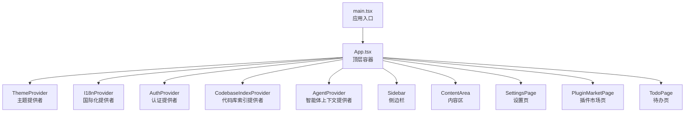
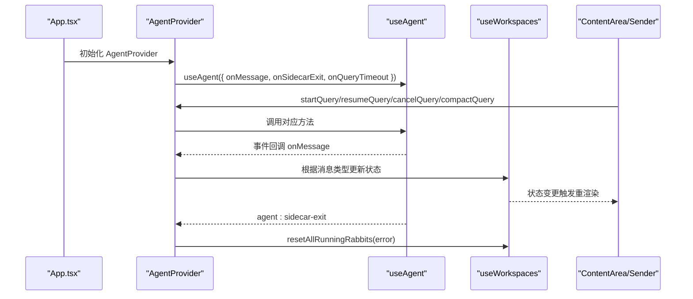
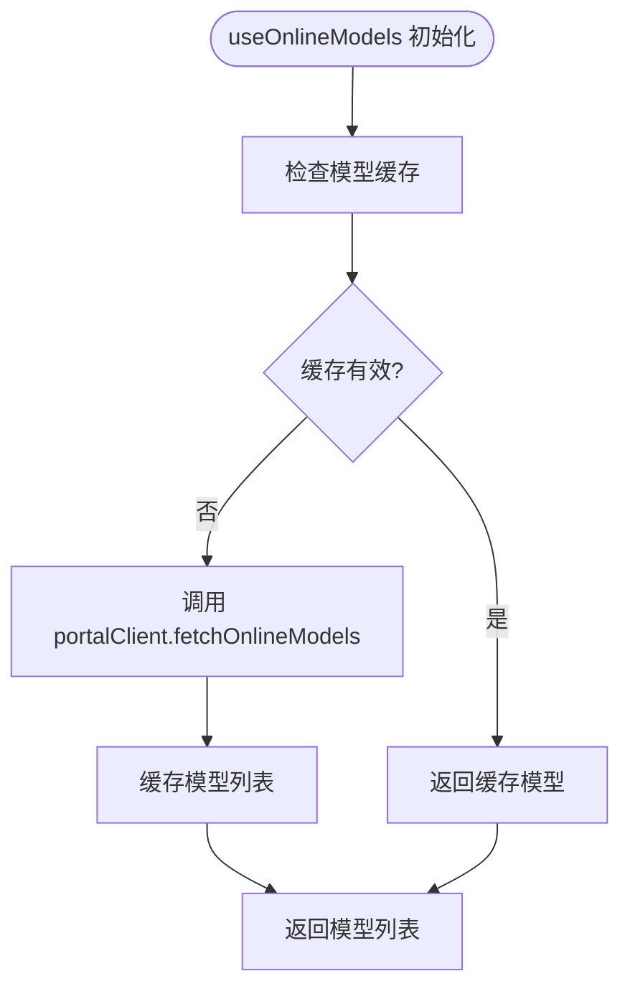
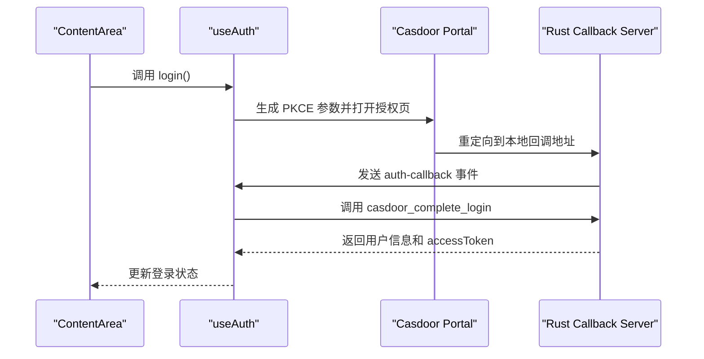
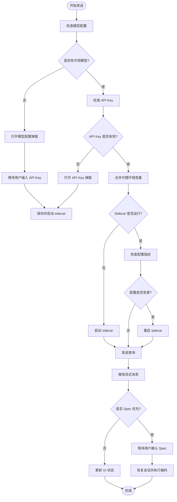
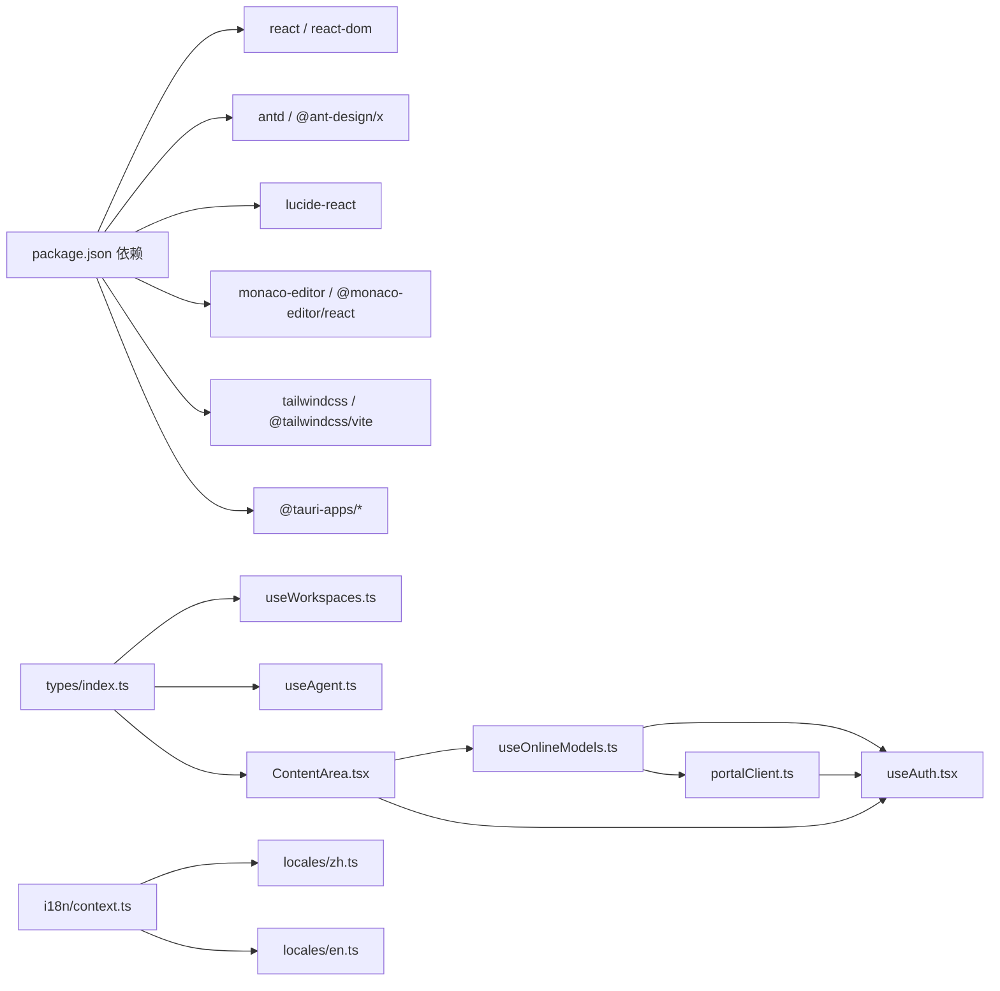

# 前端应用架构

<cite>
**本文引用的文件**
- [src/main.tsx](file://src/main.tsx)
- [src/App.tsx](file://src/App.tsx)
- [src/hooks/useWorkspaces.ts](file://src/hooks/useWorkspaces.ts)
- [src/hooks/useAgentContext.tsx](file://src/hooks/useAgentContext.tsx)
- [src/hooks/useAgent.ts](file://src/hooks/useAgent.ts)
- [src/hooks/useTheme.tsx](file://src/hooks/useTheme.tsx)
- [src/hooks/useOnlineModels.ts](file://src/hooks/useOnlineModels.ts)
- [src/hooks/useAuth.tsx](file://src/hooks/useAuth.tsx)
- [src/i18n/index.tsx](file://src/i18n/index.tsx)
- [src/i18n/context.ts](file://src/i18n/context.ts)
- [src/i18n/locales/en.ts](file://src/i18n/locales/en.ts)
- [src/i18n/locales/zh.ts](file://src/i18n/locales/zh.ts)
- [src/components/sidebar/Sidebar.tsx](file://src/components/sidebar/Sidebar.tsx)
- [src/components/ContentArea.tsx](file://src/components/ContentArea.tsx)
- [src/components/common/ModelSelector.tsx](file://src/components/common/ModelSelector.tsx)
- [src/utils/portalClient.ts](file://src/utils/portalClient.ts)
- [src/utils/proxy.ts](file://src/utils/proxy.ts)
- [src-tauri/src/sidecar.rs](file://src-tauri/src/sidecar.rs)
- [src/types/index.ts](file://src/types/index.ts)
- [package.json](file://package.json)
</cite>

## 目录
1. [简介](#简介)
2. [项目结构](#项目结构)
3. [核心组件](#核心组件)
4. [架构总览](#架构总览)
5. [详细组件分析](#详细组件分析)
6. [依赖关系分析](#依赖关系分析)
7. [性能考量](#性能考量)
8. [故障排查指南](#故障排查指南)
9. [结论](#结论)
10. [附录](#附录)

## 简介
本文件面向 RabbitCoding 前端应用，系统性梳理其应用架构、组件树结构、状态管理模式、路由与导航、自定义 Hook 设计、样式与主题系统、国际化实现以及性能优化策略。文档旨在帮助开发者快速理解并高效迭代前端代码。

## 项目结构
- 应用入口位于 src/main.tsx，挂载根组件 App。
- App 作为顶层容器，聚合主题、国际化、认证、工作区与智能体上下文，并根据视图状态渲染侧边栏、内容区、设置页或插件市场页。
- 组件按功能域划分：sidebar、common、files、settings、terminal、todo、agent 等。
- 自定义 Hook 聚焦于状态管理与跨组件共享：useWorkspaces、useAgentContext、useTheme、useAgent、useOnlineModels、useAuth、useI18n 等。
- 国际化采用字典键路径解析，支持中英文切换。
- 类型系统集中于 src/types/index.ts，涵盖工作区、智能体消息、模型配置、代理配置等。



图表来源
- [src/main.tsx:1-11](file://src/main.tsx#L1-L11)
- [src/App.tsx:29-99](file://src/App.tsx#L29-L99)

章节来源
- [src/main.tsx:1-11](file://src/main.tsx#L1-L11)
- [src/App.tsx:29-99](file://src/App.tsx#L29-L99)

## 核心组件
- App：顶层容器，负责视图切换、主题与国际化同步、加载态处理、Provider 层组合。
- Sidebar：左侧导航与工作区/智能体列表，支持拖拽调整宽度。
- ContentArea：主内容区，承载 Agent 聊天、输入发送、右侧面板、仓库管理、模型选择、代理与 API Key 管理等。**更新**：集成了完整的在线模型系统，包括模型选择、凭证获取和 sidecar 生命周期管理。
- 设置页、插件市场页、待办页：独立视图，通过 App 的视图状态切换进入。
- 自定义 Hook：useWorkspaces（工作区/智能体/消息持久化与更新）、useAgentContext（智能体消息监听与查询控制）、useAgent（与 Sidecar 通信）、useTheme（主题切换与系统跟随）、useOnlineModels（在线模型管理）、useAuth（认证管理）、useI18n（国际化键解析）。

章节来源
- [src/App.tsx:29-99](file://src/App.tsx#L29-L99)
- [src/components/sidebar/Sidebar.tsx:17-44](file://src/components/sidebar/Sidebar.tsx#L17-L44)
- [src/components/ContentArea.tsx:30-1115](file://src/components/ContentArea.tsx#L30-L1115)

## 架构总览
应用采用"Provider 组合 + 自定义 Hook"的状态与行为管理策略，结合 Tauri 命令与事件实现与 Sidecar 的双向通信。主题与国际化通过 Context 提供，贯穿整个组件树。**更新**：新增在线模型系统，通过 useOnlineModels 和 useAuth 实现模型选择、凭证获取和认证管理。

```mermaid
graph TB
subgraph "应用层"
APP["App.tsx"]
THEME["useTheme.tsx"]
I18N["i18n/index.tsx"]
AUTH["AuthProvider"]
CODEBASE["CodebaseIndexProvider"]
AG_CTX["AgentProvider"]
END
subgraph "业务层"
SIDEBAR["Sidebar.tsx"]
CONTENT["ContentArea.tsx"]
SETTINGS["SettingsPage"]
PLUGIN["PluginMarketPage"]
TODO["TodoPage"]
END
subgraph "Hook 层"
WS["useWorkspaces.ts"]
AG_H["useAgent.ts"]
AG_CTX_H["useAgentContext.tsx"]
ONLINE_MODELS["useOnlineModels.ts"]
AUTH_H["useAuth.tsx"]
END
subgraph "类型与工具"
TYPES["types/index.ts"]
PROXY["utils/proxy.ts"]
PORTAL["utils/portalClient.ts"]
END
APP --> THEME
APP --> I18N
APP --> AUTH
APP --> CODEBASE
APP --> AG_CTX
APP --> SIDEBAR
APP --> CONTENT
APP --> SETTINGS
APP --> PLUGIN
APP --> TODO
AG_CTX --> AG_H
AG_CTX --> WS
CONTENT --> AG_CTX_H
CONTENT --> PROXY
CONTENT --> ONLINE_MODELS
CONTENT --> AUTH_H
ONLINE_MODELS --> PORTAL
AUTH_H --> PORTAL
WS --> TYPES
AG_H --> TYPES
I18N --> TYPES
```

图表来源
- [src/App.tsx:29-99](file://src/App.tsx#L29-L99)
- [src/hooks/useWorkspaces.ts:28-540](file://src/hooks/useWorkspaces.ts#L28-L540)
- [src/hooks/useAgentContext.tsx:88-285](file://src/hooks/useAgentContext.tsx#L88-L285)
- [src/hooks/useAgent.ts:53-333](file://src/hooks/useAgent.ts#L53-L333)
- [src/hooks/useTheme.tsx:25-62](file://src/hooks/useTheme.tsx#L25-L62)
- [src/hooks/useOnlineModels.ts:30-127](file://src/hooks/useOnlineModels.ts#L30-L127)
- [src/hooks/useAuth.tsx:94-255](file://src/hooks/useAuth.tsx#L94-L255)
- [src/i18n/index.tsx:7-19](file://src/i18n/index.tsx#L7-L19)
- [src/types/index.ts:1-847](file://src/types/index.ts#L1-L847)
- [src/utils/proxy.ts:1-62](file://src/utils/proxy.ts#L1-L62)
- [src/utils/portalClient.ts:1-175](file://src/utils/portalClient.ts#L1-L175)

## 详细组件分析

### 组件树与路由/导航
- 视图状态：main/settings/pluginMarket/todo，通过 App 内部状态切换。
- 导航入口：Sidebar 中的工作区与智能体列表；底部设置、插件市场、待办入口。
- 页面切换策略：点击 Rabbit/Workspace 自动切回 main 视图，确保上下文一致性。
- 侧边栏宽度：通过 useResizable 与 localStorage 记忆，支持拖拽调整。

章节来源
- [src/App.tsx:34-45](file://src/App.tsx#L34-L45)
- [src/components/sidebar/Sidebar.tsx:17-44](file://src/components/sidebar/Sidebar.tsx#L17-L44)

### 状态管理模式
- useWorkspaces：统一管理工作区、智能体、仓库、消息与持久化（SQLite/本地降级），提供批量更新与去重逻辑，保障重启后状态收敛。
- useAgentContext：将 useAgent 的消息监听与查询控制提升至 App 层，避免页面切换导致消息丢失；封装取消、恢复、压缩、提问响应等操作。
- useAgent：与 Sidecar 通过 Tauri 事件通信，维护每条查询的看门狗（普通态 10 分钟，思考态 30 分钟），处理流式增量与终态消息。
- useTheme：主题选择（系统/浅色/深色），系统跟随与 DOM 样式同步。
- useOnlineModels：**新增** 管理在线模型列表和 AI 转发 Key，支持按需获取和缓存。
- useAuth：**新增** 管理 Casdoor OAuth 认证状态，提供登录、登出和用户信息管理。
- useI18n：基于 Context 的语言切换与键解析。

章节来源
- [src/hooks/useWorkspaces.ts:28-540](file://src/hooks/useWorkspaces.ts#L28-L540)
- [src/hooks/useAgentContext.tsx:88-285](file://src/hooks/useAgentContext.tsx#L88-L285)
- [src/hooks/useAgent.ts:53-333](file://src/hooks/useAgent.ts#L53-L333)
- [src/hooks/useTheme.tsx:25-62](file://src/hooks/useTheme.tsx#L25-L62)
- [src/hooks/useOnlineModels.ts:30-127](file://src/hooks/useOnlineModels.ts#L30-L127)
- [src/hooks/useAuth.tsx:94-255](file://src/hooks/useAuth.tsx#L94-L255)
- [src/i18n/index.tsx:7-19](file://src/i18n/index.tsx#L7-L19)

### 样式系统与主题切换
- 主题提供者：ThemeProvider 将 resolvedTheme 同步到 <html>，驱动 Tailwind dark: 变体与原生控件外观。
- 系统跟随：监听 prefers-color-scheme，支持动态切换。
- Ant Design 集成：通过 Antd ConfigProvider 将 resolvedTheme 映射为暗色算法，确保 UI 组件风格一致。

章节来源
- [src/hooks/useTheme.tsx:25-62](file://src/hooks/useTheme.tsx#L25-L62)
- [src/App.tsx:15-27](file://src/App.tsx#L15-L27)

### 国际化实现
- I18nProvider：基于 localStorage 记忆语言，提供 t 函数解析键路径。
- 字典：zh/en 两套，覆盖通用、侧边栏、内容区、设置、插件市场、待办等模块。
- 解析策略：点号路径递归查找，未命中返回键本身。

章节来源
- [src/i18n/index.tsx:7-19](file://src/i18n/index.tsx#L7-L19)
- [src/i18n/context.ts:1-23](file://src/i18n/context.ts#L1-L23)
- [src/i18n/locales/en.ts:1-704](file://src/i18n/locales/en.ts#L1-L704)
- [src/i18n/locales/zh.ts:1-826](file://src/i18n/locales/zh.ts#L1-L826)

### 自定义 Hook 设计与实现

#### useAgentContext
- 目标：将智能体消息监听与查询控制提升至 App 层，避免页面切换导致消息丢失。
- 关键能力：
  - onMessage：按消息类型分派到 useWorkspaces 的更新函数（增量合并、最终结果、压缩状态、AskUserQuestion 等）。
  - onSidecarExit/onQueryTimeout：兜底收敛所有 running 状态为 error/idle。
  - 包装 start/resume/cancel/compact/respond/cancelQuestion：统一错误回滚与 UI 状态更新。
- 与 useAgent 的关系：复用 useAgent 的 sidecar 生命周期与消息通道，向外暴露高层 API。



图表来源
- [src/hooks/useAgentContext.tsx:88-285](file://src/hooks/useAgentContext.tsx#L88-L285)
- [src/hooks/useAgent.ts:53-333](file://src/hooks/useAgent.ts#L53-L333)
- [src/hooks/useWorkspaces.ts:324-539](file://src/hooks/useWorkspaces.ts#L324-L539)

章节来源
- [src/hooks/useAgentContext.tsx:88-285](file://src/hooks/useAgentContext.tsx#L88-L285)

#### useAgent
- 事件监听：注册 agent:message 与 agent:sidecar-exit 事件，解析 JSON 并分发到回调。
- 查询看门狗：每条 query 独立计时，思考态延长阈值，终态或取消时清理。
- Sidecar 控制：startSidecar/stopSidecar/checkStatus。
- 查询控制：startQuery/resumeQuery/cancelQuery/compactQuery/respondToolRequest。

章节来源
- [src/hooks/useAgent.ts:53-333](file://src/hooks/useAgent.ts#L53-L333)

#### useWorkspaces
- 数据源：SQLite（主数据源）与 localStorage（降级）双轨，自动迁移与兜底。
- 保存策略：双层防抖（500ms 定时器）+ 周期保存（3s）；DB 不可用时回退 localStorage。
- 状态收敛：重启后将 running 收敛为 idle，压缩中断恢复为 null，ask_user_question 过期标记。
- 消息更新：增量文本合并、最后一条 result 去重、thinking 持续时间更新。

章节来源
- [src/hooks/useWorkspaces.ts:28-540](file://src/hooks/useWorkspaces.ts#L28-L540)

#### useOnlineModels **新增**
- 目标：管理在线模型列表和 AI 转发 Key。
- 关键能力：
  - 拉取公开模型列表：通过 portalClient.fetchOnlineModels 获取活跃模型。
  - 管理 AI 转发 Key：缓存到 localStorage，按需通过 Casdoor accessToken 获取。
  - 模型列表缓存：30 秒 TTL 避免频繁请求。
  - 登录状态管理：与 useAuth 集成，处理 Casdoor token 过期场景。
- 与 ContentArea 的关系：为模型选择器提供在线模型数据，为 sidecar 启动提供虚拟模型配置。



图表来源
- [src/hooks/useOnlineModels.ts:46-66](file://src/hooks/useOnlineModels.ts#L46-L66)
- [src/hooks/useOnlineModels.ts:71-100](file://src/hooks/useOnlineModels.ts#L71-L100)

章节来源
- [src/hooks/useOnlineModels.ts:30-127](file://src/hooks/useOnlineModels.ts#L30-L127)

#### useAuth **新增**
- 目标：管理 Casdoor OAuth 认证状态。
- 关键能力：
  - PKCE 授权码流程：生成 code_verifier，计算 code_challenge，处理 state 验证。
  - Loopback 回调处理：监听 Rust 端启动的本地回调服务器事件。
  - 用户信息持久化：localStorage 存储用户信息和登录状态。
  - 登录/登出：提供 login/logout 方法，处理 token 交换和清理。
- 与 ContentArea 的关系：为线上模型访问提供认证令牌，触发 AI 转发 Key 获取。



图表来源
- [src/hooks/useAuth.tsx:190-224](file://src/hooks/useAuth.tsx#L190-L224)
- [src/hooks/useAuth.tsx:104-187](file://src/hooks/useAuth.tsx#L104-L187)

章节来源
- [src/hooks/useAuth.tsx:94-255](file://src/hooks/useAuth.tsx#L94-L255)

#### useTheme
- 主题选择：localStorage 记忆，支持系统/浅色/深色。
- 系统跟随：监听系统主题变化，动态切换 resolvedTheme。
- DOM 同步：将 dark 类与 colorScheme 写入 <html>。

章节来源
- [src/hooks/useTheme.tsx:25-62](file://src/hooks/useTheme.tsx#L25-L62)

#### useI18n
- 语言记忆：localStorage 记忆当前语言。
- 键解析：resolveKey 通过点号路径在字典中查找，未命中返回键本身。

章节来源
- [src/i18n/index.tsx:7-19](file://src/i18n/index.tsx#L7-L19)
- [src/i18n/context.ts:19-22](file://src/i18n/context.ts#L19-L22)

### 内容区与智能体交互流程
- 输入发送：校验模型配置与 API Key，必要时弹窗配置；合并代理环境变量；根据 sidecar 状态决定启动或直接发送。
- Spec 优先：可生成 Spec 文档并在确认后启动编码查询，支持恢复已有会话。
- 取消与压缩：支持取消当前查询与手动触发会话压缩。
- 右侧面板：仓库管理、进度与产物展示、Spec 预览与确认。
- **更新**：集成在线模型系统，支持线上模型选择、登录引导和凭证获取。



图表来源
- [src/components/ContentArea.tsx:97-169](file://src/components/ContentArea.tsx#L97-L169)
- [src/components/ContentArea.tsx:227-253](file://src/components/ContentArea.tsx#L227-L253)
- [src/components/ContentArea.tsx:255-384](file://src/components/ContentArea.tsx#L255-L384)
- [src/components/ContentArea.tsx:315-363](file://src/components/ContentArea.tsx#L315-L363)
- [src/utils/proxy.ts:17-47](file://src/utils/proxy.ts#L17-L47)

章节来源
- [src/components/ContentArea.tsx:97-169](file://src/components/ContentArea.tsx#L97-L169)
- [src/components/ContentArea.tsx:227-253](file://src/components/ContentArea.tsx#L227-L253)
- [src/components/ContentArea.tsx:255-384](file://src/components/ContentArea.tsx#L255-L384)
- [src/components/ContentArea.tsx:315-363](file://src/components/ContentArea.tsx#L315-L363)
- [src/utils/proxy.ts:17-47](file://src/utils/proxy.ts#L17-L47)

### 在线模型系统集成

#### 模型选择器增强
- 支持两种模型类型：线上模型（latest）和自定义模型（custom）。
- 线上模型通过 useOnlineModels 获取，显示云端图标和模型名称。
- 自定义模型从本地存储读取，显示蓝色选中标记。
- 无模型时提供配置入口，引导用户到设置页。

章节来源
- [src/components/common/ModelSelector.tsx:26-167](file://src/components/common/ModelSelector.tsx#L26-L167)

#### 模型指纹跟踪机制
- 代理指纹：通过 proxyConfigFingerprint 计算代理配置指纹，检测代理变更。
- 模型指纹：通过 baseUrl + apiKey 前缀组合生成，避免完整密钥泄露。
- 配置变更检测：启动 sidecar 前比较指纹，变更时自动重启以应用新配置。

章节来源
- [src/components/ContentArea.tsx:96-100](file://src/components/ContentArea.tsx#L96-L100)
- [src/components/ContentArea.tsx:315-318](file://src/components/ContentArea.tsx#L315-L318)

#### 登录引导与凭证获取
- 线上模型选中时自动检查 AI 转发 Key。
- 未登录时弹出登录引导弹窗，引导用户完成 Casdoor 登录。
- 登录成功后自动获取 AI 转发 Key 并启动 sidecar。
- 获取失败时提供重试机制和错误提示。

章节来源
- [src/components/ContentArea.tsx:61-64](file://src/components/ContentArea.tsx#L61-L64)
- [src/components/ContentArea.tsx:166-188](file://src/components/ContentArea.tsx#L166-L188)
- [src/components/ContentArea.tsx:231-252](file://src/components/ContentArea.tsx#L231-L252)
- [src/components/ContentArea.tsx:1040-1111](file://src/components/ContentArea.tsx#L1040-L1111)

#### Portal 客户端集成
- 模型列表获取：通过 portalClient.fetchOnlineModels 获取活跃模型。
- AI 转发 Key 获取：通过 portalClient.fetchAiForwardingKey 用 Casdoor token 换取。
- 虚拟模型配置：构建在线模型的虚拟 ModelConfig，无缝复用现有流程。

章节来源
- [src/utils/portalClient.ts:63-87](file://src/utils/portalClient.ts#L63-L87)
- [src/utils/portalClient.ts:102-135](file://src/utils/portalClient.ts#L102-L135)
- [src/utils/portalClient.ts:160-174](file://src/utils/portalClient.ts#L160-L174)

## 依赖关系分析
- 依赖生态：React、Ant Design、Ant Design X、Lucide、Monaco Editor、TailwindCSS、Tauri 插件等。
- 类型依赖：types/index.ts 为全局类型中心，被 useWorkspaces、useAgent、ContentArea 等广泛引用。
- 国际化依赖：i18n/context.ts 与 locales/zh.ts、locales/en.ts 形成键值映射。
- 主题依赖：useTheme.tsx 与 Antd ConfigProvider 协同，驱动 UI 暗色模式。
- **更新**：在线模型系统依赖 portalClient.ts 提供的 API 调用，useAuth.tsx 提供认证令牌，useOnlineModels.ts 管理模型状态。



图表来源
- [package.json:14-44](file://package.json#L14-L44)
- [src/types/index.ts:1-847](file://src/types/index.ts#L1-L847)
- [src/i18n/context.ts:1-23](file://src/i18n/context.ts#L1-L23)
- [src/i18n/locales/en.ts:1-704](file://src/i18n/locales/en.ts#L1-L704)
- [src/i18n/locales/zh.ts:1-826](file://src/i18n/locales/zh.ts#L1-L826)
- [src/hooks/useOnlineModels.ts:14-20](file://src/hooks/useOnlineModels.ts#L14-L20)
- [src/hooks/useAuth.tsx:21-25](file://src/hooks/useAuth.tsx#L21-L25)
- [src/utils/portalClient.ts:13](file://src/utils/portalClient.ts#L13)

章节来源
- [package.json:14-44](file://package.json#L14-L44)
- [src/types/index.ts:1-847](file://src/types/index.ts#L1-L847)

## 性能考量
- 状态持久化与保存策略：useWorkspaces 采用双层防抖与周期保存，降低频繁写入带来的性能压力。
- 流式消息处理：useAgentContext 对增量文本进行就地合并，减少不必要的重渲染。
- 代理与环境变量：proxy.ts 将代理配置转换为环境变量，避免每次请求重复计算。
- 主题与国际化：Context 层轻量，避免深层传递造成性能损耗。
- 组件拆分：Sidebar、ContentArea、RightPanel 等按功能拆分，配合 resizable 与可见性开关，减少无效渲染。
- **更新**：在线模型系统采用 30 秒缓存策略，避免频繁请求模型列表；AI 转发 Key 缓存到 localStorage，减少重复获取。

## 故障排查指南
- 代理配置变更导致 sidecar 未生效：检查代理指纹与 appliedProxyFingerprint，确认是否触发了 sidecar 重启。
- API Key 为空导致发送失败：ContentArea 会在缺失时弹窗引导配置，保存后自动启动 sidecar 并执行 pending query。
- 会话卡死或长时间无响应：useAgent 的看门狗会在阈值时间内未收到消息时触发 onQueryTimeout，回滚状态为 error。
- Sidecar 异常退出：onSidecarExit 会将所有 running 的 Rabbit 收敛为 error，避免 UI 永远 loading。
- 重启后状态异常：cleanupInflightState 会将 running 收敛为 idle，压缩中断恢复为 null，ask_user_question 过期标记。
- **更新**：线上模型登录失败：检查 useAuth 的登录状态，确认 Casdoor token 是否有效；AI 转发 Key 获取失败时检查 NOT_AUTHENTICATED 错误码。
- **更新**：模型指纹不匹配：检查 proxyConfigFingerprint 和 appliedProxyFingerprint 是否正确更新，确认 sidecar 重启是否成功。

章节来源
- [src/components/ContentArea.tsx:127-169](file://src/components/ContentArea.tsx#L127-L169)
- [src/components/ContentArea.tsx:171-195](file://src/components/ContentArea.tsx#L171-L195)
- [src/hooks/useAgent.ts:66-101](file://src/hooks/useAgent.ts#L66-L101)
- [src/hooks/useAgentContext.tsx:180-192](file://src/hooks/useAgentContext.tsx#L180-L192)
- [src/hooks/useWorkspaces.ts:14-26](file://src/hooks/useWorkspaces.ts#L14-L26)
- [src/hooks/useOnlineModels.ts:92-96](file://src/hooks/useOnlineModels.ts#L92-L96)
- [src/hooks/useAuth.tsx:232-235](file://src/hooks/useAuth.tsx#L232-L235)

## 结论
RabbitCoding 前端以 Provider + 自定义 Hook 为核心，结合 Tauri 事件与命令，实现了稳定、可扩展的智能体交互体验。通过完善的主题与国际化、健壮的状态持久化与兜底策略、以及清晰的组件边界，整体架构具备良好的可维护性与扩展性。**更新**：新增的在线模型系统进一步增强了应用的灵活性，通过认证管理、模型选择和凭证获取的完整链路，为用户提供了更便捷的 AI 服务接入方式。

## 附录
- 最佳实践
  - 在 Provider 层集中处理 Sidecar 生命周期与消息分发，避免在子组件中重复监听。
  - 使用 useWorkspaces 的批量更新与去重逻辑，确保消息流的稳定性。
  - 代理配置变更时，通过指纹检测触发 sidecar 重启，确保网络策略一致。
  - 国际化键使用点号路径，便于维护与翻译更新。
  - 主题切换通过 DOM 属性同步，确保第三方组件与原生控件一致。
  - **更新**：在线模型使用 30 秒缓存策略，避免频繁请求；AI 转发 Key 通过 Casdoor token 安全获取并缓存。
  - **更新**：模型选择器支持线上和自定义模型统一管理，提供更好的用户体验。
  - **更新**：登录引导弹窗提供清晰的错误处理和重试机制，提升用户操作成功率。