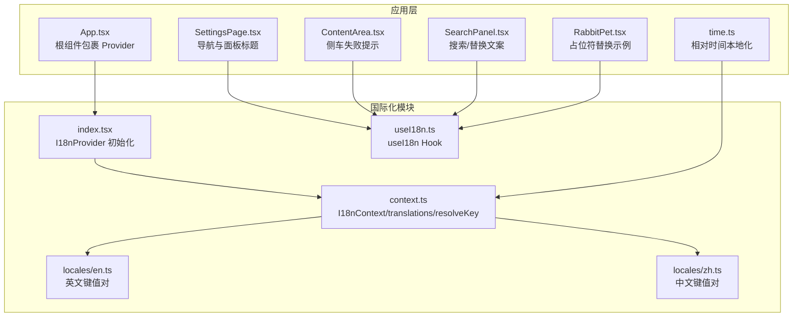
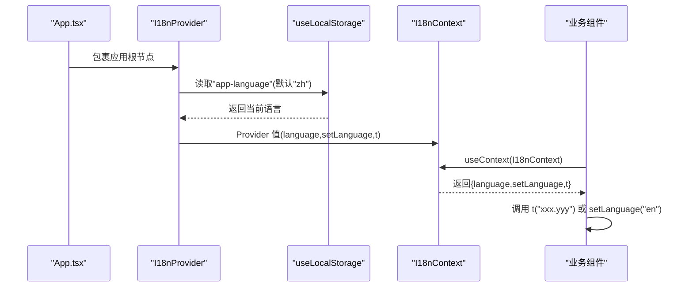
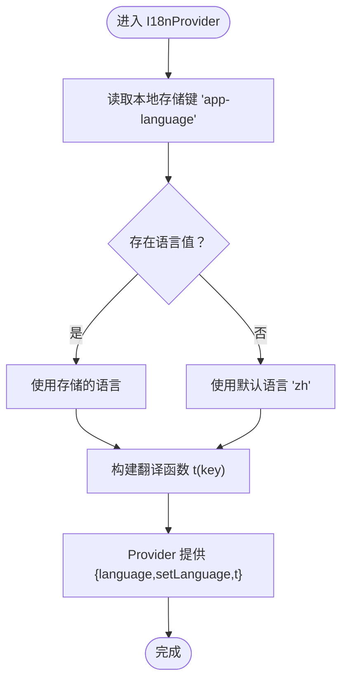
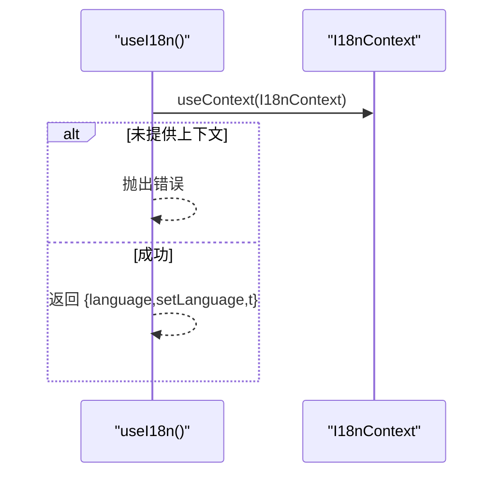
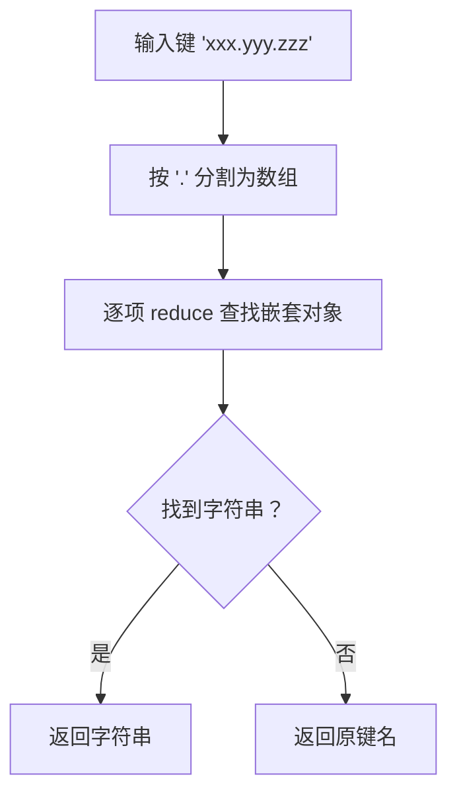
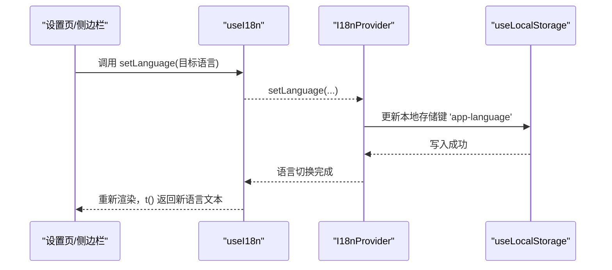
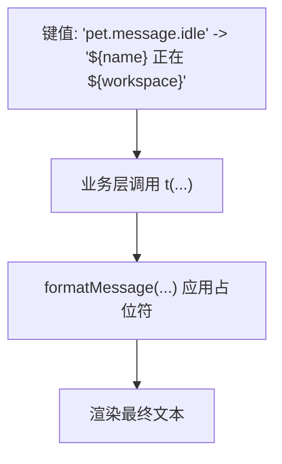
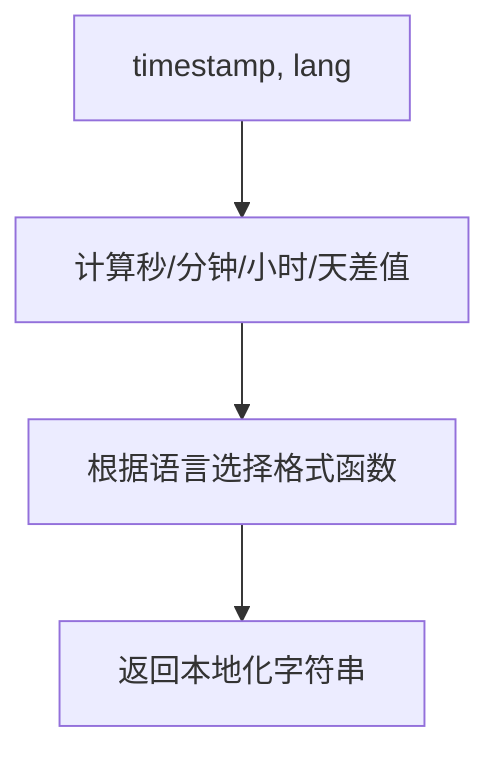
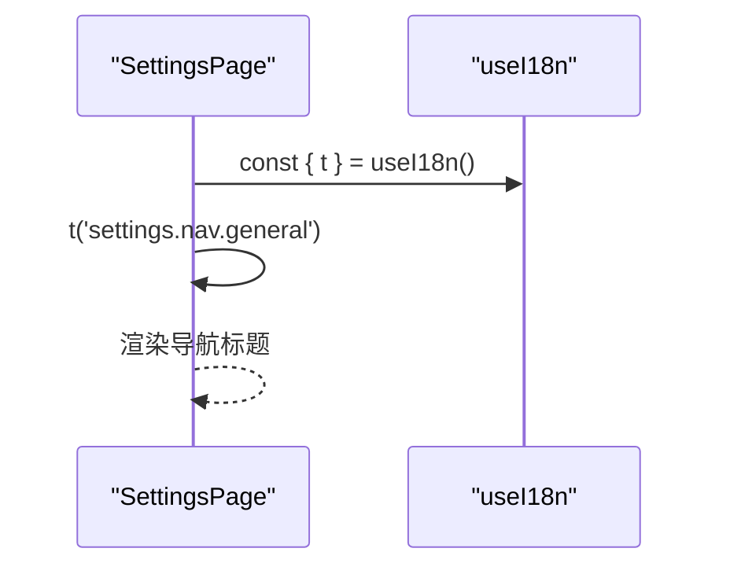
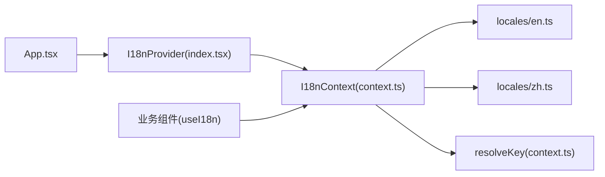

# 国际化支持

<cite>
**本文档引用的文件**
- [src/i18n/index.tsx](file://src/i18n/index.tsx)
- [src/i18n/context.ts](file://src/i18n/context.ts)
- [src/i18n/useI18n.ts](file://src/i18n/useI18n.ts)
- [src/i18n/locales/en.ts](file://src/i18n/locales/en.ts)
- [src/i18n/locales/zh.ts](file://src/i18n/locales/zh.ts)
- [src/App.tsx](file://src/App.tsx)
- [src/hooks/useLocalStorage.ts](file://src/hooks/useLocalStorage.ts)
- [src/components/ContentArea.tsx](file://src/components/ContentArea.tsx)
- [src/components/settings/SettingsPage.tsx](file://src/components/settings/SettingsPage.tsx)
- [src/components/files/SearchPanel.tsx](file://src/components/files/SearchPanel.tsx)
- [src/components/pet/RabbitPet.tsx](file://src/components/pet/RabbitPet.tsx)
- [src/utils/time.ts](file://src/utils/time.ts)
</cite>

## 目录
1. [简介](#简介)
2. [项目结构](#项目结构)
3. [核心组件](#核心组件)
4. [架构总览](#架构总览)
5. [详细组件分析](#详细组件分析)
6. [依赖关系分析](#依赖关系分析)
7. [性能考量](#性能考量)
8. [故障排查指南](#故障排查指南)
9. [结论](#结论)
10. [附录](#附录)

## 简介
本文件面向 RabbitCoding 的国际化系统，提供从架构设计到使用方法的完整技术文档。重点涵盖：
- i18n 组件的初始化流程与上下文提供机制
- 翻译键值对的组织结构与动态语言切换
- 翻译文件格式规范、命名约定与维护策略
- useI18n Hook 的使用方式、翻译函数参数与返回值
- 占位符替换、复数形式处理与日期时间本地化
- 翻译贡献指南与本地化最佳实践

## 项目结构
国际化模块位于 src/i18n 目录，采用“按语言拆分”的键值对组织方式，并通过 React Context 提供全局翻译能力。

**图表来源**
- [src/i18n/index.tsx:1-20](file://src/i18n/index.tsx#L1-L20)
- [src/i18n/context.ts:1-23](file://src/i18n/context.ts#L1-L23)
- [src/i18n/useI18n.ts:1-11](file://src/i18n/useI18n.ts#L1-L11)
- [src/i18n/locales/en.ts:1-752](file://src/i18n/locales/en.ts#L1-L752)
- [src/i18n/locales/zh.ts:1-752](file://src/i18n/locales/zh.ts#L1-L752)
- [src/App.tsx:1-107](file://src/App.tsx#L1-L107)
- [src/components/settings/SettingsPage.tsx:1-200](file://src/components/settings/SettingsPage.tsx#L1-L200)
- [src/components/ContentArea.tsx:1-224](file://src/components/ContentArea.tsx#L1-L224)
- [src/components/files/SearchPanel.tsx:120-319](file://src/components/files/SearchPanel.tsx#L120-L319)
- [src/components/pet/RabbitPet.tsx:90-260](file://src/components/pet/RabbitPet.tsx#L90-L260)
- [src/utils/time.ts:1-36](file://src/utils/time.ts#L1-L36)

**章节来源**
- [src/i18n/index.tsx:1-20](file://src/i18n/index.tsx#L1-L20)
- [src/i18n/context.ts:1-23](file://src/i18n/context.ts#L1-L23)
- [src/i18n/useI18n.ts:1-11](file://src/i18n/useI18n.ts#L1-L11)
- [src/i18n/locales/en.ts:1-752](file://src/i18n/locales/en.ts#L1-L752)
- [src/i18n/locales/zh.ts:1-752](file://src/i18n/locales/zh.ts#L1-L752)
- [src/App.tsx:1-107](file://src/App.tsx#L1-L107)

## 核心组件
- I18nProvider：初始化语言状态、提供翻译函数与语言切换回调
- I18nContext：React Context，承载语言、切换函数与翻译函数
- useI18n Hook：消费上下文，返回语言、切换函数与翻译函数
- translations：语言字典映射，支持 zh/en
- resolveKey：根据点分路径解析嵌套字典，返回字符串或回退键名

这些组件共同构成轻量、可扩展的本地化基础设施，满足 RabbitCoding 的界面文本与提示信息本地化需求。

**章节来源**
- [src/i18n/index.tsx:7-19](file://src/i18n/index.tsx#L7-L19)
- [src/i18n/context.ts:5-22](file://src/i18n/context.ts#L5-L22)
- [src/i18n/useI18n.ts:4-10](file://src/i18n/useI18n.ts#L4-L10)

## 架构总览
国际化系统采用“上下文提供 + 本地存储 + 键值解析”的三层架构：
- 初始化层：I18nProvider 从本地存储读取语言偏好，默认 zh
- 上下文层：I18nContext 暴露 language、setLanguage、t
- 解析层：resolveKey 支持点分路径查找，确保键缺失时安全回退

**图表来源**
- [src/App.tsx:64-100](file://src/App.tsx#L64-L100)
- [src/i18n/index.tsx:7-19](file://src/i18n/index.tsx#L7-L19)
- [src/hooks/useLocalStorage.ts:1-27](file://src/hooks/useLocalStorage.ts#L1-L27)
- [src/i18n/context.ts:11-17](file://src/i18n/context.ts#L11-L17)

## 详细组件分析

### I18nProvider 初始化流程
- 从本地存储读取语言键 app-language，若不存在则默认 zh
- 通过 useCallback 生成稳定翻译函数 t，内部调用 resolveKey
- 将 { language, setLanguage, t } 注入 I18nContext.Provider

**图表来源**
- [src/i18n/index.tsx:7-19](file://src/i18n/index.tsx#L7-L19)
- [src/hooks/useLocalStorage.ts:3-26](file://src/hooks/useLocalStorage.ts#L3-L26)

**章节来源**
- [src/i18n/index.tsx:7-19](file://src/i18n/index.tsx#L7-L19)
- [src/hooks/useLocalStorage.ts:1-27](file://src/hooks/useLocalStorage.ts#L1-L27)

### useI18n Hook 使用方法
- 从 I18nContext 中解构出 language、setLanguage、t
- 若未在 I18nProvider 内部使用，将抛出错误
- 推荐在组件顶部调用，获得稳定的翻译与语言切换能力

**图表来源**
- [src/i18n/useI18n.ts:4-10](file://src/i18n/useI18n.ts#L4-L10)
- [src/i18n/context.ts:11-17](file://src/i18n/context.ts#L11-L17)

**章节来源**
- [src/i18n/useI18n.ts:1-11](file://src/i18n/useI18n.ts#L1-L11)

### 翻译键值对组织与解析
- translations 映射语言到对应字典
- resolveKey 支持点分路径（如 "sidebar.footer.login"），逐级查找
- 若找不到字符串，回退为原始键名，避免运行时崩溃

**图表来源**
- [src/i18n/context.ts:19-22](file://src/i18n/context.ts#L19-L22)

**章节来源**
- [src/i18n/context.ts:9-22](file://src/i18n/context.ts#L9-L22)

### 动态语言切换机制
- setLanguage 由 I18nProvider 内部维护，配合 useLocalStorage 实现持久化
- 切换后，t 函数基于新语言字典解析键值
- 业务组件通过 useI18n 获取 setLanguage，实现 UI 语言切换

**图表来源**
- [src/i18n/index.tsx:8](file://src/i18n/index.tsx#L8)
- [src/hooks/useLocalStorage.ts:13-23](file://src/hooks/useLocalStorage.ts#L13-L23)

**章节来源**
- [src/i18n/index.tsx:7-19](file://src/i18n/index.tsx#L7-L19)
- [src/hooks/useLocalStorage.ts:1-27](file://src/hooks/useLocalStorage.ts#L1-L27)

### 占位符替换与复杂文案
- 占位符替换通过模板字符串在业务层完成，键值本身支持占位符占位
- 示例：搜索结果数量、宠物消息占位符等
- 复杂文案（如相对时间）通过独立工具函数实现本地化

**图表来源**
- [src/components/pet/RabbitPet.tsx:113-116](file://src/components/pet/RabbitPet.tsx#L113-L116)

**章节来源**
- [src/components/pet/RabbitPet.tsx:94-116](file://src/components/pet/RabbitPet.tsx#L94-L116)

### 复数形式与相对时间本地化
- 复数形式通过函数式键值实现，不同语言返回不同格式
- 相对时间通过工具函数根据语言选择合适单位与格式

**图表来源**
- [src/utils/time.ts:18-36](file://src/utils/time.ts#L18-L36)
- [src/i18n/locales/en.ts:716-721](file://src/i18n/locales/en.ts#L716-L721)
- [src/i18n/locales/zh.ts:716-721](file://src/i18n/locales/zh.ts#L716-L721)

**章节来源**
- [src/utils/time.ts:1-36](file://src/utils/time.ts#L1-L36)
- [src/i18n/locales/en.ts:716-721](file://src/i18n/locales/en.ts#L716-L721)
- [src/i18n/locales/zh.ts:716-721](file://src/i18n/locales/zh.ts#L716-L721)

### 翻译文件格式规范与命名约定
- 文件命名：locales/<语言>.ts（如 zh.ts、en.ts）
- 结构约定：顶层按功能域分组（如 common、sidebar、settings 等）
- 键命名：小驼峰，路径以点分隔（如 "sidebar.footer.login"）
- 值类型：字符串或函数式键值（用于复数/占位符）

**章节来源**
- [src/i18n/locales/en.ts:1-752](file://src/i18n/locales/en.ts#L1-L752)
- [src/i18n/locales/zh.ts:1-752](file://src/i18n/locales/zh.ts#L1-L752)

### 维护策略
- 新增语言：在 locales 下新增 <新语言>.ts，补充 translations 映射
- 新增键：在对应语言文件中按功能域添加键值
- 修改键：保持键名不变，仅调整值；避免破坏其他语言文件
- 复杂文案：优先通过工具函数本地化，减少键值冗余

**章节来源**
- [src/i18n/context.ts:9](file://src/i18n/context.ts#L9)
- [src/i18n/locales/en.ts:1-752](file://src/i18n/locales/en.ts#L1-L752)
- [src/i18n/locales/zh.ts:1-752](file://src/i18n/locales/zh.ts#L1-L752)

### useI18n Hook 使用示例与最佳实践
- 在组件顶部调用 useI18n，解构出 t、language、setLanguage
- 使用 t("功能域.键") 获取文本
- 使用 setLanguage 切换语言并持久化
- 对于复杂文案，结合工具函数与占位符替换

**图表来源**
- [src/components/settings/SettingsPage.tsx:90-91](file://src/components/settings/SettingsPage.tsx#L90-L91)

**章节来源**
- [src/components/settings/SettingsPage.tsx:90-91](file://src/components/settings/SettingsPage.tsx#L90-L91)
- [src/components/ContentArea.tsx:31-32](file://src/components/ContentArea.tsx#L31-L32)
- [src/components/files/SearchPanel.tsx:243](file://src/components/files/SearchPanel.tsx#L243)

## 依赖关系分析
- App.tsx 作为根组件，将 I18nProvider 放置于应用最外层，确保全局可用
- 各业务组件通过 useI18n 获取翻译能力
- translations 依赖 locales/<语言>.ts
- resolveKey 依赖 translations 与键路径

**图表来源**
- [src/App.tsx:64-100](file://src/App.tsx#L64-L100)
- [src/i18n/index.tsx:1-20](file://src/i18n/index.tsx#L1-L20)
- [src/i18n/context.ts:1-23](file://src/i18n/context.ts#L1-L23)
- [src/i18n/locales/en.ts:1-752](file://src/i18n/locales/en.ts#L1-L752)
- [src/i18n/locales/zh.ts:1-752](file://src/i18n/locales/zh.ts#L1-L752)

**章节来源**
- [src/App.tsx:1-107](file://src/App.tsx#L1-L107)
- [src/i18n/index.tsx:1-20](file://src/i18n/index.tsx#L1-L20)
- [src/i18n/context.ts:1-23](file://src/i18n/context.ts#L1-L23)

## 性能考量
- 翻译函数 t 通过 useCallback 生成，避免子组件重复渲染
- resolveKey 为 O(k)（k 为路径段数），通常极短
- 本地存储读写在 Provider 初始化阶段进行，后续切换通过状态更新
- 建议：避免在高频渲染路径中频繁创建 t 的闭包；保持键名简洁且稳定

[本节为通用指导，无需特定文件引用]

## 故障排查指南
- useI18n 必须在 I18nProvider 内部使用：否则抛出错误
- 键不存在：resolveKey 会回退为原始键名，检查键拼写与路径
- 语言切换无效：确认 setLanguage 是否被调用，以及本地存储是否可写
- 占位符未替换：检查业务层是否正确调用 formatMessage 或模板字符串

**章节来源**
- [src/i18n/useI18n.ts:6-8](file://src/i18n/useI18n.ts#L6-L8)
- [src/i18n/context.ts:19-22](file://src/i18n/context.ts#L19-L22)
- [src/hooks/useLocalStorage.ts:16-21](file://src/hooks/useLocalStorage.ts#L16-L21)

## 结论
RabbitCoding 的国际化系统以 React Context 为核心，结合本地存储与键值解析，实现了简洁、可扩展的多语言支持。通过统一的 useI18n Hook 与清晰的键值组织，开发者可以高效地为界面与提示信息提供多语言支持，并在需要时扩展复数、占位符与时间本地化等高级特性。

[本节为总结性内容，无需特定文件引用]

## 附录

### 翻译贡献指南
- 新增语言：在 locales 下新增 <语言>.ts，补充 translations 映射
- 新增键：在对应语言文件中按功能域添加键值
- 修改键：保持键名不变，仅调整值
- 复杂文案：优先通过工具函数本地化，减少键值冗余

**章节来源**
- [src/i18n/context.ts:9](file://src/i18n/context.ts#L9)
- [src/i18n/locales/en.ts:1-752](file://src/i18n/locales/en.ts#L1-L752)
- [src/i18n/locales/zh.ts:1-752](file://src/i18n/locales/zh.ts#L1-L752)

### 最佳实践
- 在组件顶部调用 useI18n，避免在渲染函数内重复解构
- 使用语义化键名，遵循“功能域.子域.动作/描述”风格
- 对于占位符，统一在业务层进行替换，键值只保留占位标记
- 对于复数与时间，使用函数式键值或工具函数，确保语言一致性

**章节来源**
- [src/components/pet/RabbitPet.tsx:113-116](file://src/components/pet/RabbitPet.tsx#L113-L116)
- [src/utils/time.ts:18-36](file://src/utils/time.ts#L18-L36)