# 实时语音输入系统

<cite>
**本文档引用的文件**
- [README.md](file://README.md)
- [useVoiceInput.ts](file://src/hooks/useVoiceInput.ts)
- [useVoiceSupported.ts](file://src/hooks/useVoiceSupported.ts)
- [VoiceInputButton.tsx](file://src/components/common/VoiceInputButton.tsx)
- [SettingsPage.tsx](file://src/components/settings/SettingsPage.tsx)
- [VoicePanel.tsx](file://src/components/settings/VoicePanel.tsx)
- [voice-processor.js](file://public/voice-processor.js)
- [voice.rs](file://src-tauri/src/voice.rs)
- [Cargo.toml](file://src-tauri/Cargo.toml)
- [lib.rs](file://src-tauri/src/lib.rs)
- [main.tsx](file://src/main.tsx)
- [App.tsx](file://src/App.tsx)
- [build.yml](file://.github/workflows/build.yml)
</cite>

## 更新摘要
**所做更改**
- 新增平台兼容性支持章节，涵盖 Windows ARM64 条件编译机制
- 新增后端平台检测机制章节，详细说明 voice_supported 命令实现
- 新增 useVoiceSupported Hook 分析，解释前端平台能力检测流程
- 更新前端组件动态显示机制，说明根据平台能力隐藏语音功能
- 新增 CI/CD 改进章节，涵盖多平台构建和语音模型文件版本控制
- 更新架构概览和依赖关系分析，反映最新的平台兼容性设计

## 目录
1. [简介](#简介)
2. [项目结构](#项目结构)
3. [核心组件](#核心组件)
4. [架构概览](#架构概览)
5. [平台兼容性支持](#平台兼容性支持)
6. [后端平台检测机制](#后端平台检测机制)
7. [前端平台能力检测](#前端平台能力检测)
8. [CI/CD 平台支持改进](#cicd-平台支持改进)
9. [详细组件分析](#详细组件分析)
10. [依赖关系分析](#依赖关系分析)
11. [性能考虑](#性能考虑)
12. [故障排除指南](#故障排除指南)
13. [结论](#结论)

## 简介

实时语音输入系统是一个基于 Tauri + React + Rust 技术栈构建的桌面应用程序，提供了高质量的实时语音识别功能。该系统集成了 Sherpa-ONNX 语音识别引擎，支持多种语言的离线语音识别，具有低延迟、高准确性的特点。

**最新更新**：系统现已支持多平台部署，包括 Windows ARM64、macOS x86/ARM 和 Windows x86，通过条件编译和运行时检测确保在不同平台上的稳定运行。

系统的核心特性包括：
- 实时语音识别（接近语音输入法体验）
- 多模型支持（SenseVoice 等）
- 多镜像源下载（GitHub 和 ModelScope）
- 音频分段处理（VAD + SenseVoice）
- 零拷贝音频传输
- **跨平台兼容性支持（Windows ARM64 条件编译）**
- **运行时平台检测机制**
- **前端组件动态显示**

## 项目结构

该项目采用现代化的全栈架构，结合了前端 React 应用和后端 Rust 服务，并新增了平台兼容性支持：

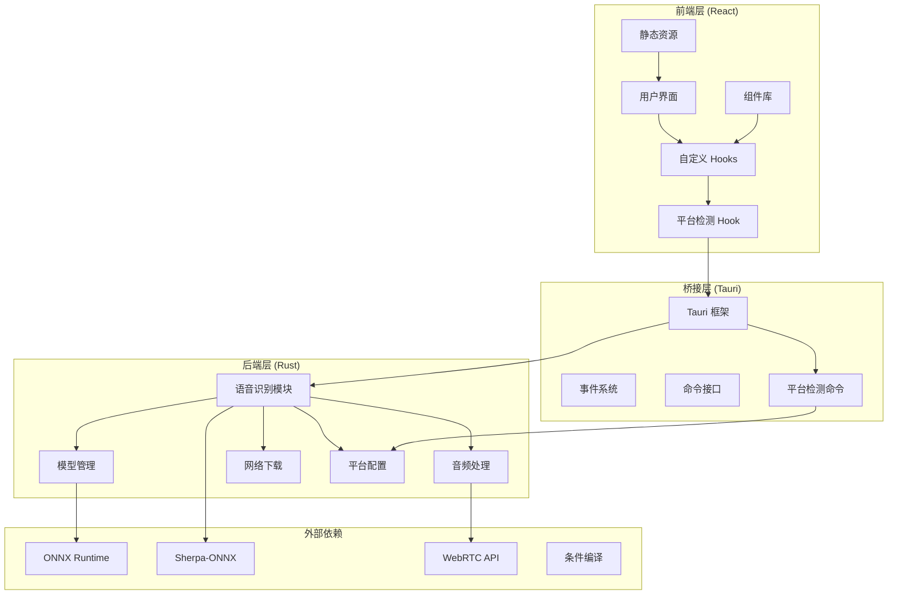

**图表来源**
- [main.tsx:1-14](file://src/main.tsx#L1-L14)
- [App.tsx:33-151](file://src/App.tsx#L33-L151)
- [lib.rs:831-903](file://src-tauri/src/lib.rs#L831-L903)
- [useVoiceSupported.ts:1-27](file://src/hooks/useVoiceSupported.ts#L1-L27)

**章节来源**
- [README.md:1-8](file://README.md#L1-L8)
- [main.tsx:1-14](file://src/main.tsx#L1-L14)
- [App.tsx:33-151](file://src/App.tsx#L33-L151)

## 核心组件

### 语音识别钩子 (useVoiceInput)

`useVoiceInput` 是整个语音识别系统的核心 Hook，负责管理语音识别的状态、生命周期和数据流。

主要功能：
- 状态管理：idle、requesting、listening、error 四种状态
- 模型下载和验证
- 音频流处理和分段
- 事件监听和回调处理

### 平台检测 Hook (useVoiceSupported)

**新增** `useVoiceSupported` 是平台兼容性支持的核心组件，负责在运行时检测平台是否支持语音识别功能。

主要功能：
- **同步平台检测**：`isVoiceSupportedSync()` 提供即时的平台支持状态
- **异步平台查询**：`checkVoiceSupported()` 通过 Tauri 命令获取后端编译期判定
- **智能缓存机制**：避免重复查询，提升性能
- **默认回退策略**：当后端命令不存在时默认返回支持状态

### 语音输入按钮组件 (VoiceInputButton)

提供用户友好的语音输入界面，集成到聊天输入工具栏中。

核心特性：
- 实时状态反馈（加载、录音、错误）
- 模型下载确认对话框
- 文本拼接和回填机制
- **平台能力动态隐藏**：根据平台支持状态自动显示/隐藏
- 响应式设计和国际化支持

### 设置页面组件 (SettingsPage)

**更新** 设置页面现在具备平台能力感知功能，能够根据平台支持状态动态调整界面。

核心特性：
- **动态导航过滤**：自动移除不支持平台的语音设置项
- 实时状态反馈
- 模型下载确认对话框
- 文本拼接和回填机制
- 响应式设计和国际化支持

**章节来源**
- [useVoiceInput.ts:1-278](file://src/hooks/useVoiceInput.ts#L1-L278)
- [useVoiceSupported.ts:1-27](file://src/hooks/useVoiceSupported.ts#L1-L27)
- [VoiceInputButton.tsx:1-209](file://src/components/common/VoiceInputButton.tsx#L1-L209)
- [SettingsPage.tsx:1-200](file://src/components/settings/SettingsPage.tsx#L1-L200)
- [voice-processor.js:1-99](file://public/voice-processor.js#L1-L99)

## 架构概览

系统采用分层架构设计，实现了前后端分离和职责清晰的模块划分，并新增了平台兼容性支持：

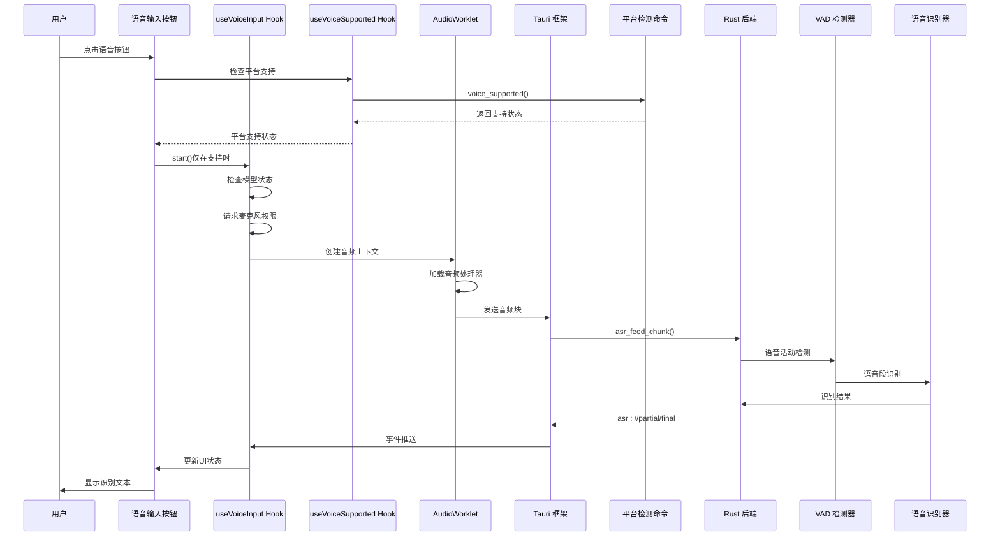

**图表来源**
- [useVoiceInput.ts:137-233](file://src/hooks/useVoiceInput.ts#L137-L233)
- [useVoiceSupported.ts:18-27](file://src/hooks/useVoiceSupported.ts#L18-L27)
- [voice.rs:824-888](file://src-tauri/src/voice.rs#L824-L888)

### 数据流架构

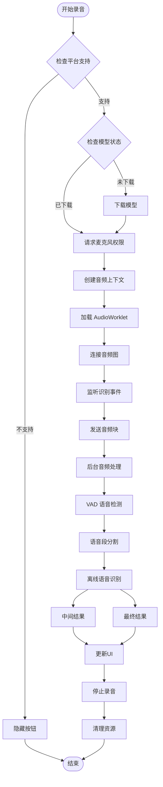

**图表来源**
- [voice.rs:612-822](file://src-tauri/src/voice.rs#L612-L822)
- [useVoiceInput.ts:137-267](file://src/hooks/useVoiceInput.ts#L137-L267)
- [useVoiceSupported.ts:13-27](file://src/hooks/useVoiceSupported.ts#L13-L27)

## 平台兼容性支持

### Windows ARM64 条件编译

**新增** 系统通过 Rust 的条件编译机制实现了对 Windows ARM64 平台的特殊处理：

```rust
// Cargo.toml 中的条件编译配置
[target.'cfg(not(all(target_os = "windows", target_arch = "aarch64")))'.dependencies]
sherpa-onnx = { version = "1.13", default-features = false, features = ["static"] }
```

**编译条件说明**：
- **支持的平台**：macOS x86_64、macOS aarch64、Windows x86_64
- **不支持的平台**：Windows ARM64（aarch64）
- **原因**：Sherpa-ONNX 官方未提供 Windows ARM64 预编译库

### 平台检测策略

系统采用双重检测策略确保平台兼容性：

1. **编译期检测**：在构建时确定哪些平台支持语音功能
2. **运行时检测**：在应用启动时动态查询当前平台支持状态

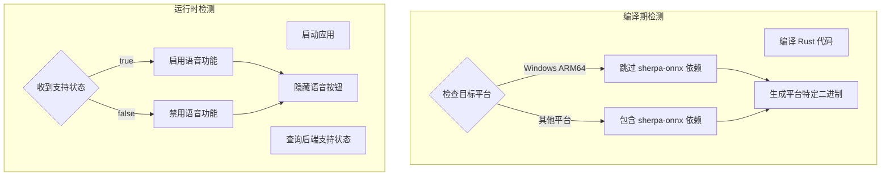

**图表来源**
- [Cargo.toml:41-44](file://src-tauri/Cargo.toml#L41-L44)
- [useVoiceSupported.ts:1-7](file://src/hooks/useVoiceSupported.ts#L1-L7)

**章节来源**
- [Cargo.toml:41-44](file://src-tauri/Cargo.toml#L41-L44)
- [useVoiceSupported.ts:1-7](file://src/hooks/useVoiceSupported.ts#L1-L7)

## 后端平台检测机制

### voice_supported 命令实现

**新增** 后端通过 `voice_supported` 命令提供平台支持状态查询：

```rust
/// 当前平台是否支持语音识别（编译期判定）
/// Windows ARM64 无 sherpa-onnx 预编译库
#[command]
pub fn voice_supported() -> bool {
    cfg!(not(all(target_os = "windows", target_arch = "aarch64")))
}
```

**命令特性**：
- **编译期判断**：使用 Rust 的 `cfg!` 宏在编译时确定
- **精确匹配**：仅针对 Windows ARM64 平台返回 false
- **默认支持**：其他所有平台返回 true
- **零开销**：编译时确定，运行时无需额外计算

### 命令注册和暴露

**更新** `voice_supported` 命令通过 Tauri 框架注册并暴露给前端：

```rust
// lib.rs 中的命令注册
tauri::Builder::default()
    .invoke_handler(tauri::generate_handler![
        voice::voice_supported,  // 新增
        voice::asr_status,
        voice::asr_ensure_model,
        // ... 其他语音相关命令
    ])
    .run(tauri::generate_context!())
    .expect("error while running tauri application");
```

**章节来源**
- [voice.rs:422-427](file://src-tauri/src/voice.rs#L422-L427)
- [lib.rs:891](file://src-tauri/src/lib.rs#L891)

## 前端平台能力检测

### useVoiceSupported Hook 设计

**新增** `useVoiceSupported` Hook 提供完整的前端平台检测解决方案：

```typescript
/**
 * 查询当前平台是否支持语音识别（后端 cfg! 编译期判定）
 *
 * 后端在 Windows ARM64 上不编译 sherpa-onnx，返回 false；
 * 其余平台（macOS x86/ARM、Windows x86）返回 true。
 * 前端据此隐藏语音输入按钮和语音设置页。
 */
```

**Hook 功能**：
- **同步检测**：`isVoiceSupportedSync()` 提供即时状态，避免界面闪烁
- **异步查询**：`checkVoiceSupported()` 通过 Tauri 命令获取实时状态
- **智能缓存**：模块级缓存避免重复查询
- **安全回退**：命令失败时默认返回支持状态

### 组件集成模式

**更新** 前端组件通过以下模式集成平台检测：

```typescript
// 语音输入按钮组件集成
const [voiceSupported, setVoiceSupported] = useState(isVoiceSupportedSync());
useEffect(() => {
  checkVoiceSupported().then(setVoiceSupported);
}, []);

if (!voiceSupported) return null; // 不支持时隐藏按钮

// 设置页面组件集成
const [voiceSupported, setVoiceSupported] = useState(isVoiceSupportedSync());
useEffect(() => { 
  checkVoiceSupported().then(setVoiceSupported); 
}, []);

// 动态过滤导航项
const navGroups = NAV_GROUPS.map(group => ({
  ...group,
  items: voiceSupported ? group.items : group.items.filter(item => item.key !== 'voice'),
}));
```

**章节来源**
- [useVoiceSupported.ts:1-27](file://src/hooks/useVoiceSupported.ts#L1-L27)
- [VoiceInputButton.tsx:23-31](file://src/components/common/VoiceInputButton.tsx#L23-L31)
- [SettingsPage.tsx:95-108](file://src/components/settings/SettingsPage.tsx#L95-L108)

## CI/CD 平台支持改进

### 多平台构建矩阵

**更新** CI/CD 流水线现已支持完整的多平台构建：

```yaml
strategy:
  fail-fast: false
  matrix:
    include:
      - platform: macos-latest
        target: aarch64-apple-darwin
        node_asset: darwin-arm64
      - platform: macos-15-intel
        target: x86_64-apple-darwin
        node_asset: darwin-x64
      - platform: windows-latest
        target: x86_64-pc-windows-msvc
        node_asset: win-x64
      - platform: windows-11-arm
        target: aarch64-pc-windows-msvc
        node_asset: win-arm64
```

**构建覆盖**：
- **macOS**：Intel (x86_64) 和 Apple Silicon (ARM64)
- **Windows**：x86_64 和 ARM64
- **Node.js 运行时**：对应平台的二进制包

### 平台特定资源处理

**更新** CI/CD 流水线包含平台特定的资源处理逻辑：

```bash
# macOS 平台
- name: Write Apple API key (macOS only)
  if: runner.os == 'macOS'

# Node.js 运行时下载
- name: Download Node.js runtime (Unix)
  if: runner.os != 'Windows'
- name: Download Node.js runtime (Windows)
  if: runner.os == 'Windows'
```

**章节来源**
- [.github/workflows/build.yml:20-35](file://.github/workflows/build.yml#L20-L35)
- [.github/workflows/build.yml:79-105](file://.github/workflows/build.yml#L79-L105)

## 详细组件分析

### 语音识别状态机

系统实现了完整的状态管理机制，确保语音识别过程的可靠性和用户体验：

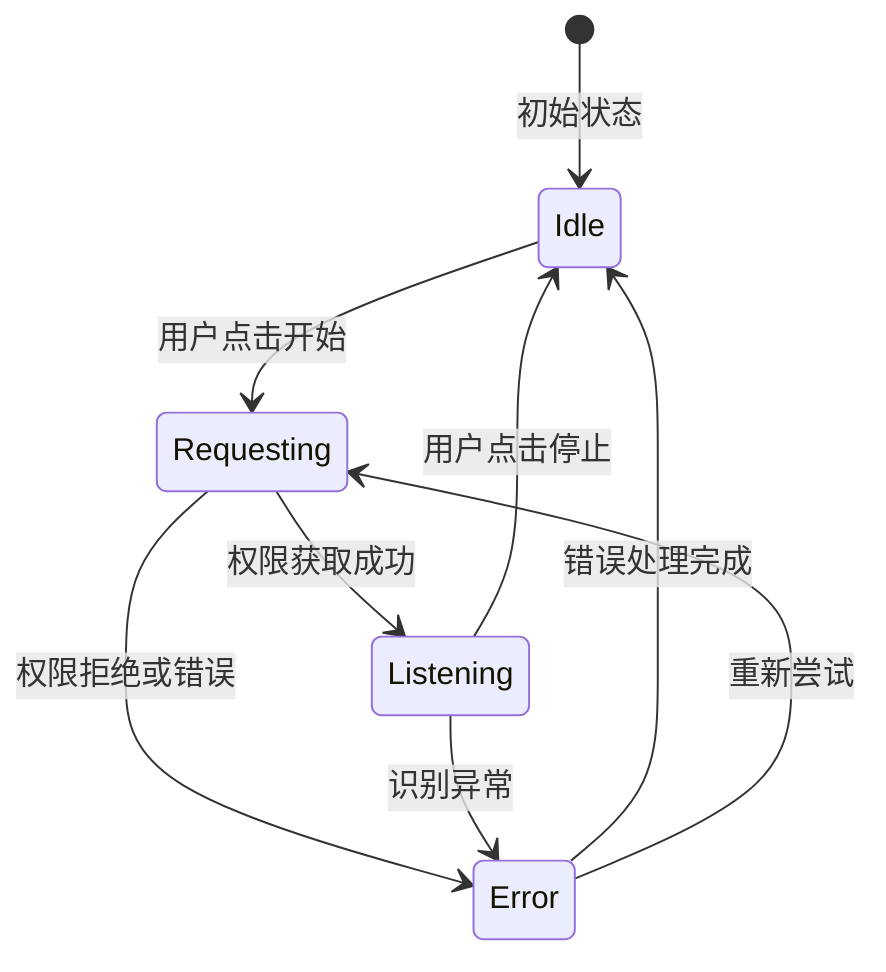

**状态转换逻辑**：
- **Idle（空闲）**：等待用户操作
- **Requesting（请求中）**：获取麦克风权限和准备环境
- **Listening（监听中）**：实际进行语音识别
- **Error（错误）**：处理异常情况

**章节来源**
- [useVoiceInput.ts:14-47](file://src/hooks/useVoiceInput.ts#L14-L47)
- [useVoiceInput.ts:107-111](file://src/hooks/useVoiceInput.ts#L107-L111)

### 音频处理流水线

音频处理采用多阶段流水线架构，确保实时性和准确性：

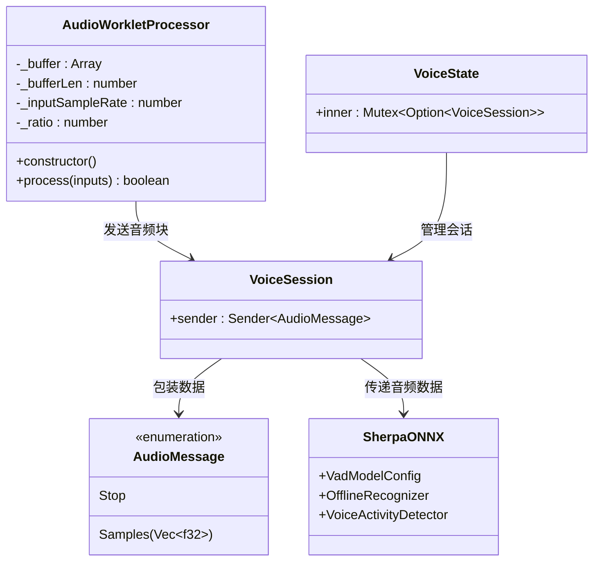

**图表来源**
- [voice-processor.js:14-99](file://public/voice-processor.js#L14-L99)
- [voice.rs:262-273](file://src-tauri/src/voice.rs#L262-L273)
- [voice.rs:275-310](file://src-tauri/src/voice.rs#L275-L310)

### 模型管理系统

系统支持多种语音识别模型，具有灵活的配置和管理能力：

| 模型 | 语言支持 | 文件大小 | 特性 |
|------|----------|----------|------|
| SenseVoice | 中/英/日/韩/粤 | ~234MB | 标点恢复、情感识别 |
| VAD模型 | 共享 | ~644KB | 语音活动检测 |

**章节来源**
- [voice.rs:61-83](file://src-tauri/src/voice.rs#L61-L83)
- [voice.rs:85-91](file://src-tauri/src/voice.rs#L85-L91)

### 事件驱动架构

系统采用事件驱动的设计模式，实现松耦合的组件通信：

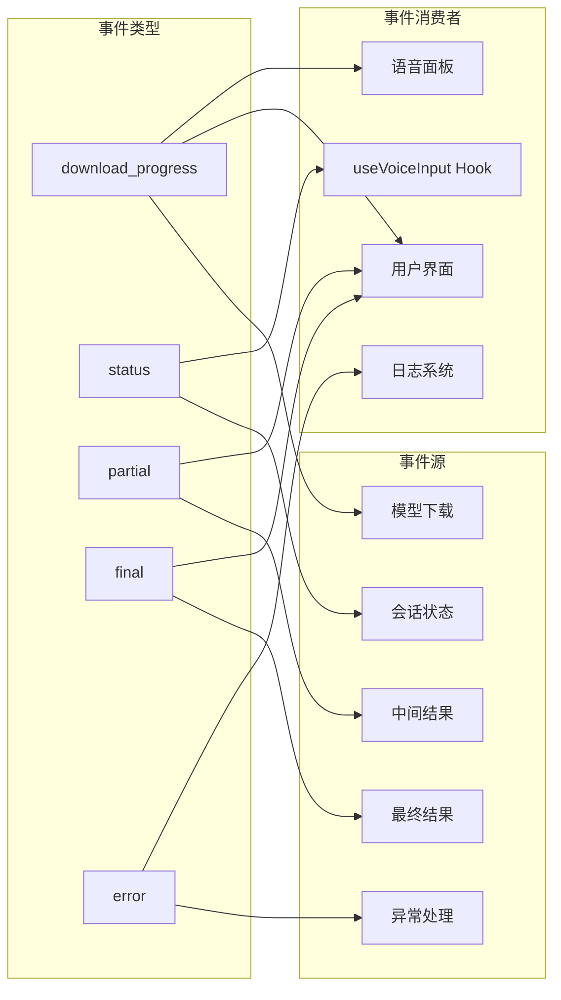

**图表来源**
- [useVoiceInput.ts:68-105](file://src/hooks/useVoiceInput.ts#L68-L105)
- [VoicePanel.tsx:85-120](file://src/components/settings/VoicePanel.tsx#L85-L120)

**章节来源**
- [useVoiceInput.ts:75-98](file://src/hooks/useVoiceInput.ts#L75-L98)
- [VoicePanel.tsx:91-113](file://src/components/settings/VoicePanel.tsx#L91-L113)

## 依赖关系分析

### 外部依赖架构

系统依赖的关键技术栈及其版本关系：

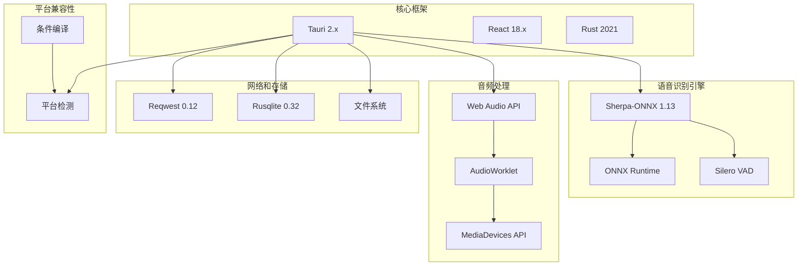

**图表来源**
- [Cargo.toml:20-41](file://src-tauri/Cargo.toml#L20-L41)
- [lib.rs:831-903](file://src-tauri/src/lib.rs#L831-L903)

### 模块间依赖关系

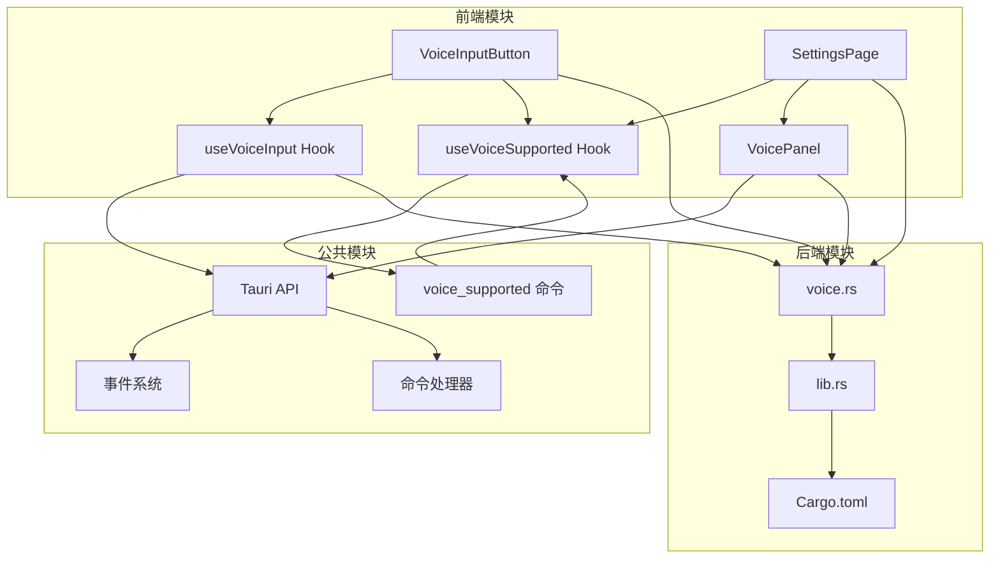

**图表来源**
- [useVoiceInput.ts:10-12](file://src/hooks/useVoiceInput.ts#L10-L12)
- [useVoiceSupported.ts:9](file://src/hooks/useVoiceSupported.ts#L9)
- [VoiceInputButton.tsx:12](file://src/components/common/VoiceInputButton.tsx#L12)
- [SettingsPage.tsx:19](file://src/components/settings/SettingsPage.tsx#L19)
- [VoicePanel.tsx:11-12](file://src/components/settings/VoicePanel.tsx#L11-L12)

**章节来源**
- [Cargo.toml:1-41](file://src-tauri/Cargo.toml#L1-L41)
- [lib.rs:1-15](file://src-tauri/src/lib.rs#L1-L15)

## 性能考虑

### 音频处理优化

系统在多个层面进行了性能优化：

1. **零拷贝传输**：使用 `ArrayBuffer` 和 `MessagePort` 实现音频数据的零拷贝传输
2. **内存池管理**：AudioWorkletProcessor 使用累积缓冲区减少内存分配
3. **批处理策略**：300ms 块大小平衡延迟和准确性
4. **多线程处理**：Rust 后端使用独立线程处理音频识别

### 内存管理

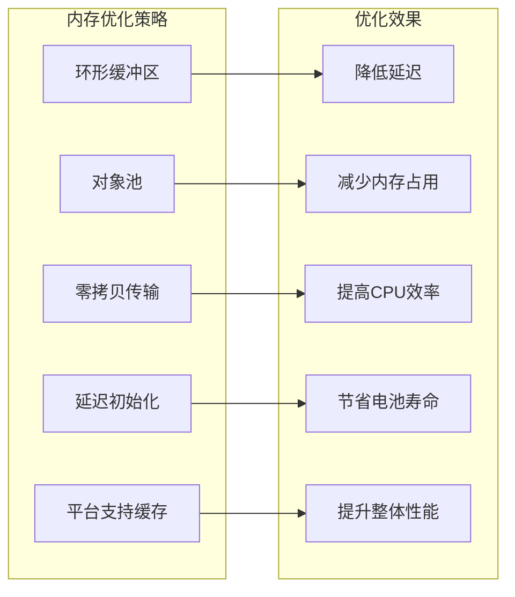

### 网络下载优化

系统实现了智能的模型下载策略：

- **多镜像源支持**：GitHub 和 ModelScope 双镜像源
- **断点续传**：支持下载中断后的续传
- **进度报告**：实时下载进度反馈
- **压缩包处理**：GitHub 镜像使用 tar.bz2 压缩包

### 平台兼容性优化

**新增** 平台兼容性相关的性能优化：

- **条件编译**：在不支持的平台上完全跳过语音相关依赖
- **智能缓存**：useVoiceSupported Hook 缓存平台检测结果
- **懒加载**：语音功能仅在需要时加载相关资源
- **资源预加载**：支持平台提前预加载必要的运行时组件

**章节来源**
- [voice-processor.js:14-99](file://public/voice-processor.js#L14-L99)
- [voice.rs:333-420](file://src-tauri/src/voice.rs#L333-L420)
- [useVoiceSupported.ts:11-16](file://src/hooks/useVoiceSupported.ts#L11-L16)

## 故障排除指南

### 常见问题及解决方案

#### 1. 麦克风权限问题

**症状**：点击语音按钮无响应或报错

**解决方案**：
- 检查浏览器设置中的麦克风权限
- 确认设备正常工作
- 重启应用重新获取权限

#### 2. 模型下载失败

**症状**：模型状态显示未下载，下载进度停滞

**解决方案**：
- 检查网络连接
- 切换镜像源（GitHub ↔ ModelScope）
- 清理缓存后重新下载
- 检查磁盘空间

#### 3. 识别准确率低

**症状**：语音识别结果不准确

**解决方案**：
- 调整麦克风增益设置
- 在安静环境中使用
- 确保说话清晰标准
- 考虑使用更高精度的模型

#### 4. 性能问题

**症状**：应用卡顿或CPU占用过高

**解决方案**：
- 关闭不必要的应用
- 检查系统资源使用情况
- 调整音频采样率设置
- 重启应用释放内存

#### 5. 平台兼容性问题

**症状**：语音功能在某些平台上不可用

**解决方案**：
- **Windows ARM64**：这是预期行为，系统不支持该平台
- **检查平台检测**：确认 `voice_supported` 命令返回正确状态
- **查看构建日志**：确认编译时条件编译配置正确
- **更新应用**：确保使用最新版本的应用程序

### 调试工具

系统提供了完善的调试和监控功能：

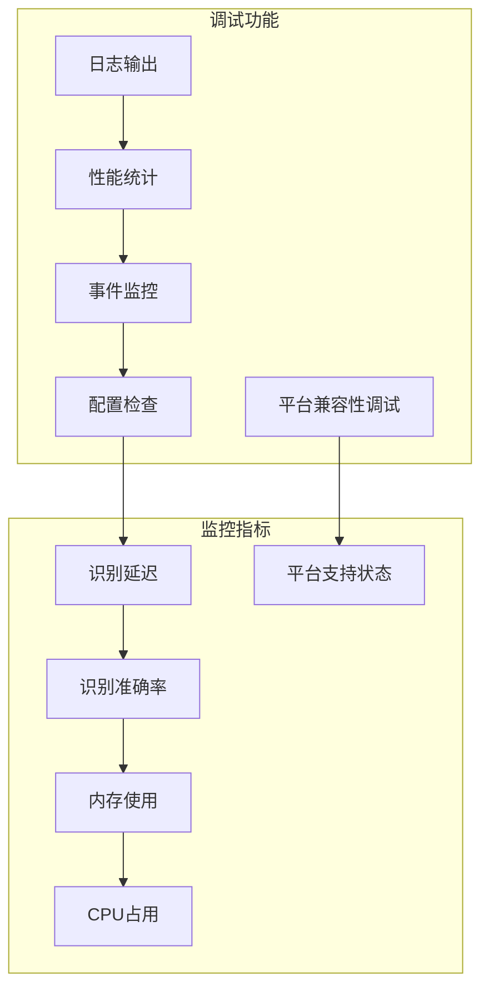

**章节来源**
- [useVoiceInput.ts:217-232](file://src/hooks/useVoiceInput.ts#L217-L232)
- [voice.rs:461-607](file://src-tauri/src/voice.rs#L461-L607)
- [useVoiceSupported.ts:18-27](file://src/hooks/useVoiceSupported.ts#L18-L27)

## 结论

实时语音输入系统是一个设计精良、功能完备的桌面应用，成功地将现代 Web 技术与高性能 Rust 后端相结合。**最新更新**使其具备了完整的多平台支持能力，主要优势包括：

### 技术优势
- **架构清晰**：分层设计确保了良好的可维护性
- **性能优异**：零拷贝传输和多线程处理保证了低延迟
- **用户体验**：接近原生应用的流畅体验
- **扩展性强**：模块化设计便于功能扩展
- **平台兼容性**：通过条件编译和运行时检测实现多平台支持

### 平台支持优势
- **全面覆盖**：支持 macOS (Intel/ARM)、Windows (x86/ARM64)
- **智能检测**：编译期和运行时双重检测机制
- **无缝集成**：前端组件自动根据平台能力调整显示
- **未来扩展**：条件编译机制便于添加新的平台支持

### 应用价值
- **实用性强**：满足日常办公和学习的语音输入需求
- **跨平台支持**：统一的代码库支持多操作系统
- **离线能力**：本地模型支持离线使用
- **隐私保护**：音频数据在本地处理，不上传云端
- **稳定性**：通过 CI/CD 流水线确保多平台构建质量

### 发展前景
系统为未来的功能扩展奠定了坚实基础，可以进一步集成更多 AI 能力，如语音合成、语义理解等，为用户提供更丰富的智能体验。**平台兼容性支持**的引入使得系统能够在不断演进的技术生态中保持稳定和可靠。

通过持续的优化和改进，这个实时语音输入系统有望成为桌面应用中语音识别领域的标杆产品，特别是在多平台支持方面树立了行业标准。