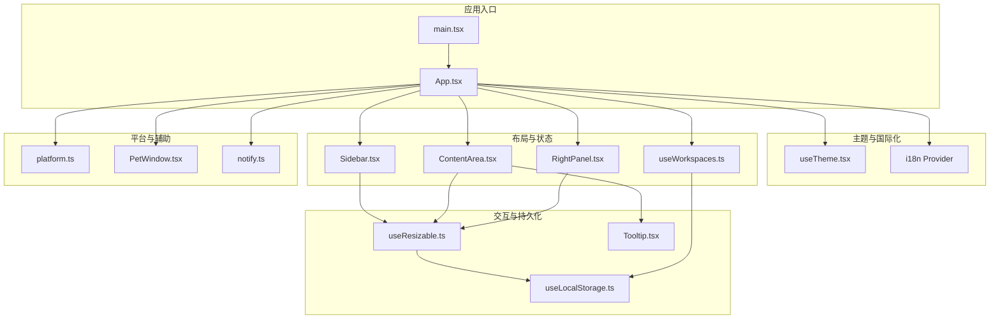
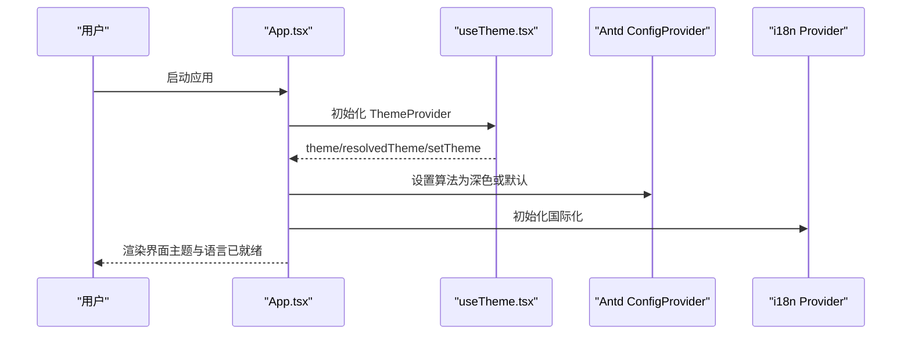
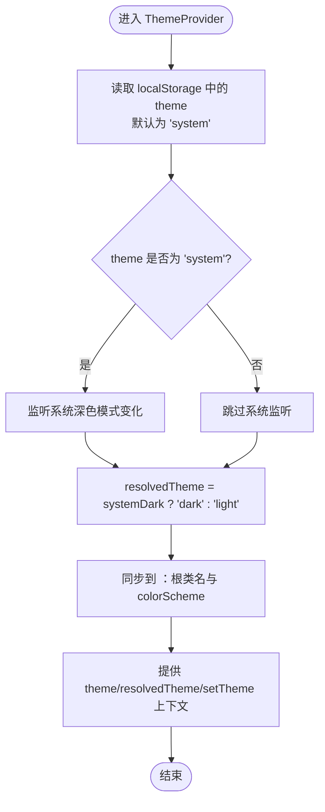
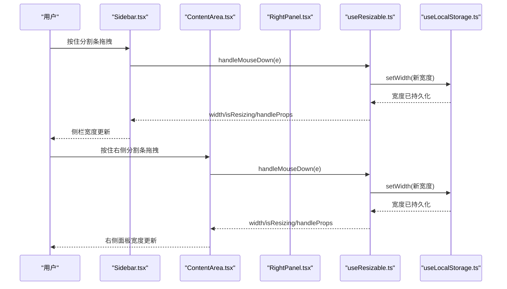
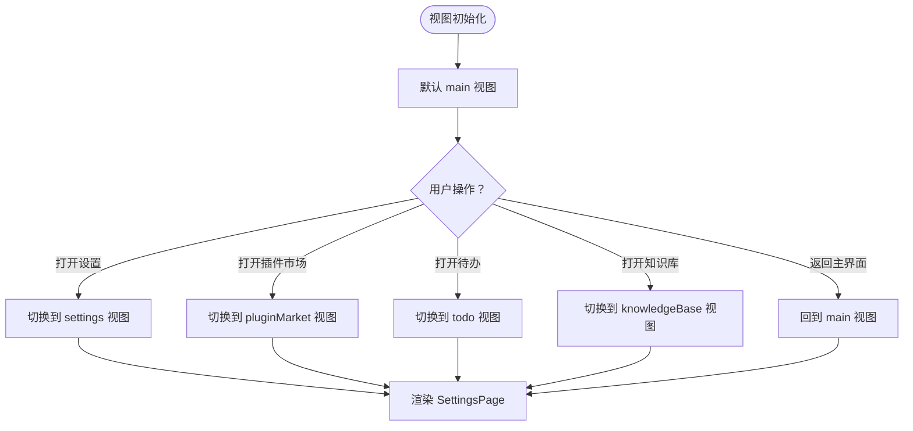
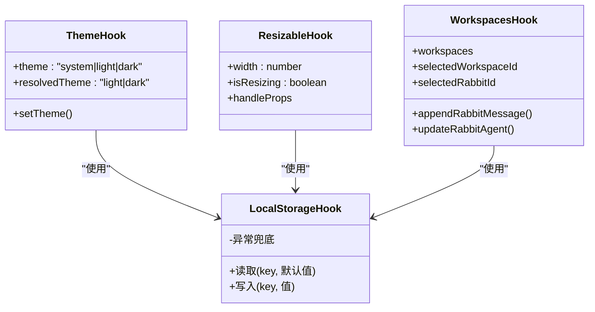
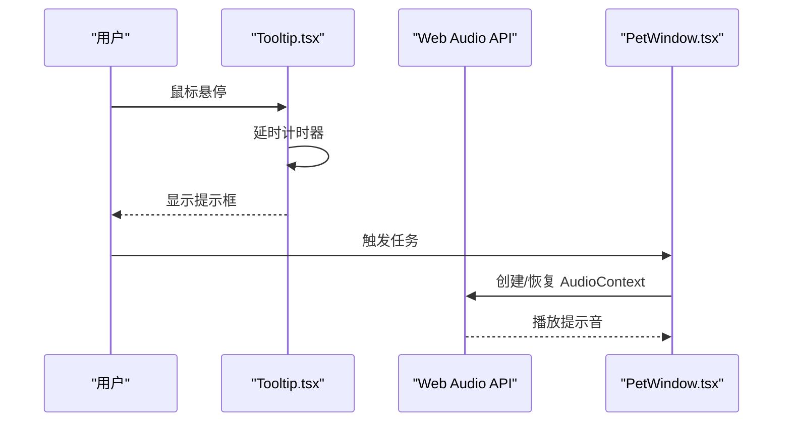
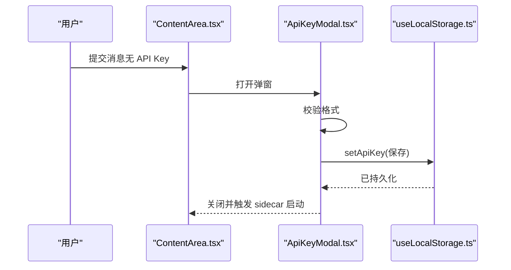
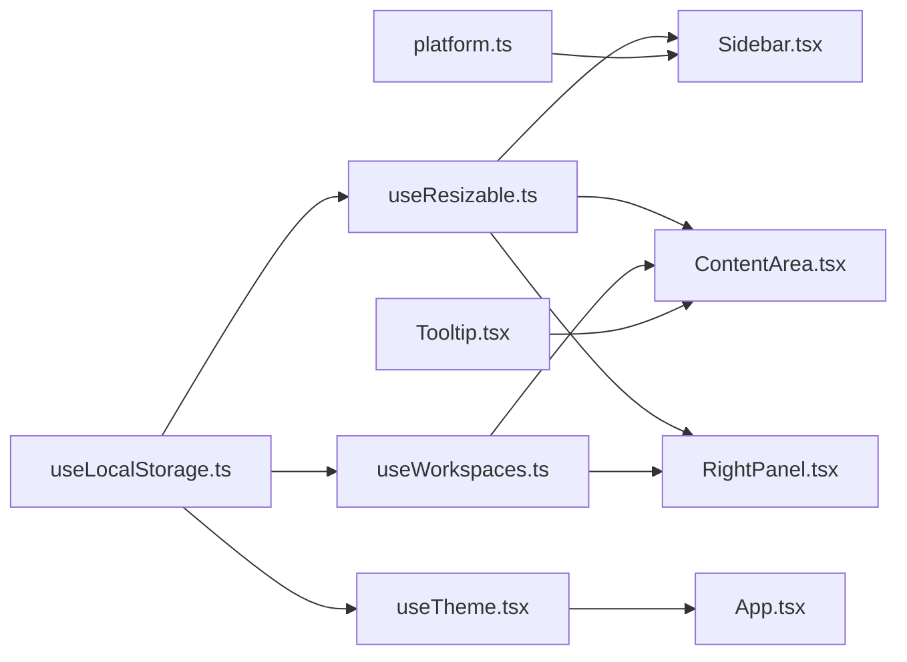

# UI 状态管理

<cite>
**本文引用的文件**
- [src/hooks/useTheme.tsx](file://src/hooks/useTheme.tsx)
- [src/hooks/useResizable.ts](file://src/hooks/useResizable.ts)
- [src/hooks/useLocalStorage.ts](file://src/hooks/useLocalStorage.ts)
- [src/App.tsx](file://src/App.tsx)
- [src/main.tsx](file://src/main.tsx)
- [src/components/sidebar/Sidebar.tsx](file://src/components/sidebar/Sidebar.tsx)
- [src/components/ContentArea.tsx](file://src/components/ContentArea.tsx)
- [src/components/RightPanel.tsx](file://src/components/RightPanel.tsx)
- [src/hooks/useWorkspaces.ts](file://src/hooks/useWorkspaces.ts)
- [src/utils/platform.ts](file://src/utils/platform.ts)
- [src/components/common/Tooltip.tsx](file://src/components/common/Tooltip.tsx)
- [src/components/settings/ApiKeyModal.tsx](file://src/components/settings/ApiKeyModal.tsx)
- [src/components/pet/PetWindow.tsx](file://src/components/pet/PetWindow.tsx)
- [src/utils/notify.ts](file://src/utils/notify.ts)
</cite>

## 目录
1. [简介](#简介)
2. [项目结构](#项目结构)
3. [核心组件](#核心组件)
4. [架构总览](#架构总览)
5. [详细组件分析](#详细组件分析)
6. [依赖关系分析](#依赖关系分析)
7. [性能考量](#性能考量)
8. [故障排查指南](#故障排查指南)
9. [结论](#结论)
10. [附录](#附录)

## 简介
本文件系统性梳理本项目的 UI 状态管理机制，重点覆盖以下方面：
- 主题切换：深色/浅色/系统跟随的实现与持久化
- 布局调整：侧边栏与右侧面板的拖拽调整尺寸、展开/折叠与最大化
- 用户界面状态：视图切换、可见性控制、动画与无障碍状态
- 偏好存储：基于 localStorage 的键值持久化
- 动画与无障碍：减少动画与声音提示的可访问性支持
- 最佳实践与体验优化：性能、一致性与可维护性建议

## 项目结构
UI 状态管理主要分布在以下层次：
- 钩子层：主题、拖拽、本地存储、工作空间状态
- 组件层：侧边栏、内容区、右侧面板、设置弹窗、宠物窗口
- 工具层：平台检测、通知与声音

图表来源
- [src/main.tsx:1-14](file://src/main.tsx#L1-L14)
- [src/App.tsx:1-109](file://src/App.tsx#L1-L109)
- [src/hooks/useTheme.tsx:1-63](file://src/hooks/useTheme.tsx#L1-L63)
- [src/hooks/useResizable.ts:1-95](file://src/hooks/useResizable.ts#L1-L95)
- [src/hooks/useLocalStorage.ts:1-27](file://src/hooks/useLocalStorage.ts#L1-L27)
- [src/hooks/useWorkspaces.ts:1-541](file://src/hooks/useWorkspaces.ts#L1-L541)
- [src/components/sidebar/Sidebar.tsx:1-46](file://src/components/sidebar/Sidebar.tsx#L1-L46)
- [src/components/ContentArea.tsx:1-683](file://src/components/ContentArea.tsx#L1-L683)
- [src/components/RightPanel.tsx:1-733](file://src/components/RightPanel.tsx#L1-L733)
- [src/utils/platform.ts:1-19](file://src/utils/platform.ts#L1-L19)
- [src/components/common/Tooltip.tsx:1-58](file://src/components/common/Tooltip.tsx#L1-L58)
- [src/components/pet/PetWindow.tsx:27-69](file://src/components/pet/PetWindow.tsx#L27-L69)
- [src/utils/notify.ts:134-166](file://src/utils/notify.ts#L134-L166)

章节来源
- [src/main.tsx:1-14](file://src/main.tsx#L1-L14)
- [src/App.tsx:1-109](file://src/App.tsx#L1-L109)

## 核心组件
- 主题系统：提供主题选择、系统跟随、实际生效主题计算与 HTML 根节点同步
- 拖拽调整尺寸：统一的 useResizable 钩子，支持最小/最大宽度、窗口缩放约束、反向拖拽
- 本地存储：useLocalStorage 钩子，封装 localStorage 读写与异常兜底
- 工作空间状态：useWorkspaces 钩子，负责工作区/兔子/仓库数据的加载、迁移、防抖保存与消息流状态管理
- 布局组件：Sidebar、ContentArea、RightPanel，分别管理侧栏宽度、右侧面板可见性/宽度/最大化、标签页与分组折叠
- 平台与无障碍：platform 工具、Tooltip、减少动画媒体查询、Web Audio API 声音提示

章节来源
- [src/hooks/useTheme.tsx:1-63](file://src/hooks/useTheme.tsx#L1-L63)
- [src/hooks/useResizable.ts:1-95](file://src/hooks/useResizable.ts#L1-L95)
- [src/hooks/useLocalStorage.ts:1-27](file://src/hooks/useLocalStorage.ts#L1-L27)
- [src/hooks/useWorkspaces.ts:1-541](file://src/hooks/useWorkspaces.ts#L1-L541)
- [src/components/sidebar/Sidebar.tsx:1-46](file://src/components/sidebar/Sidebar.tsx#L1-L46)
- [src/components/ContentArea.tsx:1-683](file://src/components/ContentArea.tsx#L1-L683)
- [src/components/RightPanel.tsx:1-733](file://src/components/RightPanel.tsx#L1-L733)
- [src/utils/platform.ts:1-19](file://src/utils/platform.ts#L1-L19)
- [src/components/common/Tooltip.tsx:1-58](file://src/components/common/Tooltip.tsx#L1-L58)

## 架构总览
UI 状态管理采用“钩子 + 组件 + 工具”的分层设计：
- 钩子层：集中处理状态、副作用与持久化
- 组件层：消费钩子状态，渲染布局与交互
- 工具层：平台差异、无障碍与通知

图表来源
- [src/App.tsx:17-29](file://src/App.tsx#L17-L29)
- [src/hooks/useTheme.tsx:25-56](file://src/hooks/useTheme.tsx#L25-L56)

## 详细组件分析

### 主题切换与深色/浅色实现
- 主题枚举与解析：支持 system/light/dark，当 theme 为 system 时监听系统深色模式变化
- 实际主题计算：resolvedTheme 为最终生效值，用于类名与 colorScheme 同步
- DOM 同步：将 dark 类与 colorScheme 写入 html 根节点，驱动原生控件与 CSS 变体
- Ant Design 集成：通过 Antd ConfigProvider 的算法切换实现组件级深色

图表来源
- [src/hooks/useTheme.tsx:25-56](file://src/hooks/useTheme.tsx#L25-L56)

章节来源
- [src/hooks/useTheme.tsx:10-63](file://src/hooks/useTheme.tsx#L10-L63)
- [src/App.tsx:17-29](file://src/App.tsx#L17-L29)

### 响应式布局与拖拽调整尺寸
- 统一钩子：useResizable 提供宽度、拖拽状态与鼠标事件处理器
- 约束策略：最小/最大宽度、窗口缩放时的上限校验、反向拖拽（右到左）
- 持久化：宽度通过 useLocalStorage 持久化，键名按模块区分
- 组件应用：Sidebar 与 ContentArea/RightPanel 的分割条均复用该钩子

图表来源
- [src/components/sidebar/Sidebar.tsx:18-44](file://src/components/sidebar/Sidebar.tsx#L18-L44)
- [src/components/ContentArea.tsx:60-66](file://src/components/ContentArea.tsx#L60-L66)
- [src/hooks/useResizable.ts:17-95](file://src/hooks/useResizable.ts#L17-L95)
- [src/hooks/useLocalStorage.ts:3-26](file://src/hooks/useLocalStorage.ts#L3-L26)

章节来源
- [src/components/sidebar/Sidebar.tsx:18-44](file://src/components/sidebar/Sidebar.tsx#L18-L44)
- [src/components/ContentArea.tsx:60-66](file://src/components/ContentArea.tsx#L60-L66)
- [src/hooks/useResizable.ts:17-95](file://src/hooks/useResizable.ts#L17-L95)

### 用户界面状态与可见性控制
- 视图状态：App.tsx 维护 main/settings/pluginMarket/todo/knowledgeBase 视图切换
- 右侧面板：ContentArea 控制可见性、最大化与宽度；RightPanel 控制标签页与分组折叠
- 侧边栏宽度：Sidebar 通过 useResizable 管理宽度与拖拽
- 无障碍与动画：减少动画媒体查询与 Tooltip 组件，降低对敏感用户的干扰

图表来源
- [src/App.tsx:31-105](file://src/App.tsx#L31-L105)
- [src/components/ContentArea.tsx:444-452](file://src/components/ContentArea.tsx#L444-L452)
- [src/components/RightPanel.tsx:220-237](file://src/components/RightPanel.tsx#L220-L237)

章节来源
- [src/App.tsx:31-105](file://src/App.tsx#L31-L105)
- [src/components/ContentArea.tsx:444-452](file://src/components/ContentArea.tsx#L444-L452)
- [src/components/RightPanel.tsx:220-237](file://src/components/RightPanel.tsx#L220-L237)

### 用户偏好存储与持久化
- 键值对持久化：useLocalStorage 封装读取、写入与异常兜底
- 主题偏好：'app-theme'
- 布局偏好：'sidebar-width'、'right-panel-width'
- 其他偏好：'right-panel-visible'、'model-configs'、'selected-model-config-id'、'anthropic-api-key'、'proxy-config'、'proxy-applied-fingerprint'

图表来源
- [src/hooks/useLocalStorage.ts:3-26](file://src/hooks/useLocalStorage.ts#L3-L26)
- [src/hooks/useTheme.tsx:25-56](file://src/hooks/useTheme.tsx#L25-L56)
- [src/hooks/useResizable.ts:24-25](file://src/hooks/useResizable.ts#L24-L25)
- [src/hooks/useWorkspaces.ts:30-31](file://src/hooks/useWorkspaces.ts#L30-L31)

章节来源
- [src/hooks/useLocalStorage.ts:3-26](file://src/hooks/useLocalStorage.ts#L3-L26)
- [src/hooks/useTheme.tsx:25-56](file://src/hooks/useTheme.tsx#L25-L56)
- [src/hooks/useResizable.ts:24-25](file://src/hooks/useResizable.ts#L24-L25)
- [src/hooks/useWorkspaces.ts:30-31](file://src/hooks/useWorkspaces.ts#L30-L31)

### 动画状态管理与无障碍处理
- 减少动画：媒体查询 prefers-reduced-motion: reduce 下禁用动画
- Tooltip：悬停延时、定位与可见性控制
- 声音提示：Web Audio API 播放双音提示，窗口失焦时恢复上下文
- 宠物窗口：任务列表滚动展示，工作状态指示

图表来源
- [src/components/common/Tooltip.tsx:10-58](file://src/components/common/Tooltip.tsx#L10-L58)
- [src/utils/notify.ts:134-166](file://src/utils/notify.ts#L134-L166)
- [src/components/pet/PetWindow.tsx:50-69](file://src/components/pet/PetWindow.tsx#L50-L69)

章节来源
- [src/components/common/Tooltip.tsx:10-58](file://src/components/common/Tooltip.tsx#L10-L58)
- [src/utils/notify.ts:134-166](file://src/utils/notify.ts#L134-L166)
- [src/components/pet/PetWindow.tsx:50-69](file://src/components/pet/PetWindow.tsx#L50-L69)

### API/服务组件流程（示例：API Key 弹窗）

图表来源
- [src/components/ContentArea.tsx:130-208](file://src/components/ContentArea.tsx#L130-L208)
- [src/components/settings/ApiKeyModal.tsx:19-104](file://src/components/settings/ApiKeyModal.tsx#L19-L104)
- [src/hooks/useLocalStorage.ts:3-26](file://src/hooks/useLocalStorage.ts#L3-L26)

## 依赖关系分析
- 组件与钩子：Sidebar/ContentArea/RightPanel 依赖 useResizable；App 依赖 useTheme 与 useWorkspaces
- 钩子与工具：useResizable/useTheme/useWorkspaces 依赖 useLocalStorage；useWorkspaces 依赖平台工具与通知
- 数据流：useWorkspaces 提供全局状态，ContentArea/RightPanel 消费并触发更新

图表来源
- [src/hooks/useTheme.tsx:25-56](file://src/hooks/useTheme.tsx#L25-L56)
- [src/hooks/useResizable.ts:17-95](file://src/hooks/useResizable.ts#L17-L95)
- [src/hooks/useLocalStorage.ts:3-26](file://src/hooks/useLocalStorage.ts#L3-L26)
- [src/hooks/useWorkspaces.ts:28-541](file://src/hooks/useWorkspaces.ts#L28-L541)
- [src/components/sidebar/Sidebar.tsx:18-44](file://src/components/sidebar/Sidebar.tsx#L18-L44)
- [src/components/ContentArea.tsx:60-66](file://src/components/ContentArea.tsx#L60-L66)
- [src/components/RightPanel.tsx:220-237](file://src/components/RightPanel.tsx#L220-L237)
- [src/utils/platform.ts:1-19](file://src/utils/platform.ts#L1-L19)
- [src/components/common/Tooltip.tsx:10-58](file://src/components/common/Tooltip.tsx#L10-L58)

章节来源
- [src/hooks/useWorkspaces.ts:28-541](file://src/hooks/useWorkspaces.ts#L28-L541)
- [src/components/ContentArea.tsx:60-66](file://src/components/ContentArea.tsx#L60-L66)

## 性能考量
- 防抖与周期保存：useWorkspaces 对工作空间数据采用双层防抖（500ms 延迟 + 3s 强制）与降级写入，平衡实时性与性能
- 事件解绑：useResizable 在拖拽结束后清理事件监听与样式，避免内存泄漏
- 可见性与懒加载：RightPanel 的 zsh 标签页采用 Suspense + visibility 隐藏，保持 xterm canvas 存活，减少重排闪烁
- 动画优化：减少动画媒体查询与 Tooltip 延时，降低 CPU/GPU 占用

章节来源
- [src/hooks/useWorkspaces.ts:100-129](file://src/hooks/useWorkspaces.ts#L100-L129)
- [src/hooks/useResizable.ts:76-85](file://src/hooks/useResizable.ts#L76-L85)
- [src/components/RightPanel.tsx:690-706](file://src/components/RightPanel.tsx#L690-L706)

## 故障排查指南
- 主题不生效
  - 检查 resolvedTheme 是否正确计算，HTML 根节点是否包含 dark 类与 colorScheme
  - 确认系统深色模式监听是否在 theme 为 system 时启用
- 拖拽无效或宽度异常
  - 确认 useResizable 的最小/最大宽度与窗口比例设置
  - 检查 isResizing 状态与 handleProps 是否正确传递
- 偏好未持久化
  - 检查 localStorage 是否可用，useLocalStorage 写入是否抛出异常
  - 确认键名与默认值是否一致
- 右侧面板不可见或无法拖拽
  - 检查 right-panel-visible 与 right-panel-width 的状态与样式
  - 确认 panelHandleProps 是否绑定到分割条
- API Key 弹窗无法保存
  - 检查格式校验与 onSave 回调是否触发 sidecar 启动
  - 确认 setApiKey 是否成功写入 localStorage

章节来源
- [src/hooks/useTheme.tsx:33-49](file://src/hooks/useTheme.tsx#L33-L49)
- [src/hooks/useResizable.ts:47-85](file://src/hooks/useResizable.ts#L47-L85)
- [src/hooks/useLocalStorage.ts:13-23](file://src/hooks/useLocalStorage.ts#L13-L23)
- [src/components/ContentArea.tsx:444-452](file://src/components/ContentArea.tsx#L444-L452)
- [src/components/settings/ApiKeyModal.tsx:27-56](file://src/components/settings/ApiKeyModal.tsx#L27-L56)

## 结论
本项目通过统一的钩子与组件化设计，实现了主题、布局、偏好与无障碍的系统化管理。主题系统与 Ant Design 算法联动，拖拽钩子保证了跨模块的一致性，本地存储与防抖保存兼顾了性能与可靠性。建议持续关注动画与声音的可访问性，并在新增功能时遵循现有钩子与组件的约定。

## 附录
- 最佳实践清单
  - 优先使用 useResizable 管理可拖拽布局，确保最小/最大宽度与窗口约束
  - 使用 useLocalStorage 存储轻量偏好，避免在渲染路径中直接访问 localStorage
  - 在组件中通过上下文或 props 传递主题与国际化状态，减少重复订阅
  - 对于复杂状态（如消息流），使用集中式钩子（如 useWorkspaces）统一管理
  - 为敏感用户开启减少动画与声音提示，提供无障碍替代方案
  - 对于长列表与重型组件，采用懒加载与可见性隐藏策略，提升首屏性能