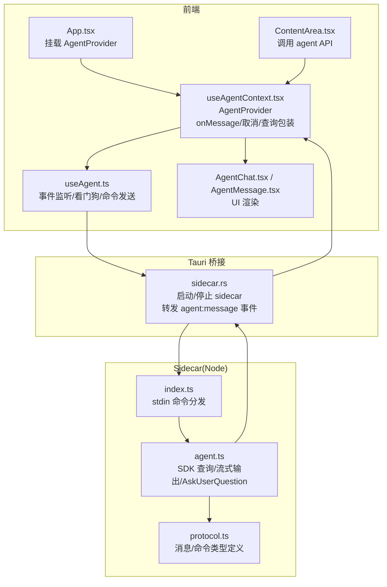
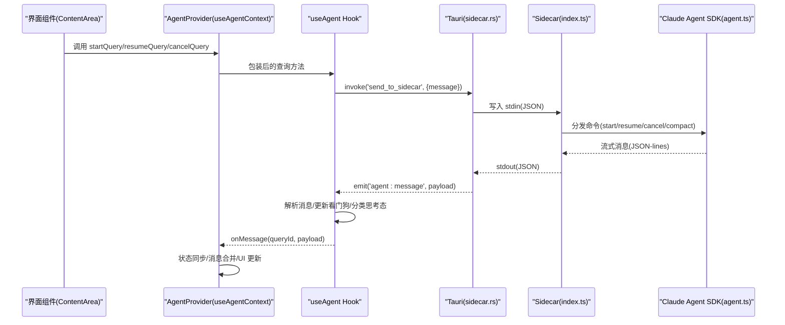
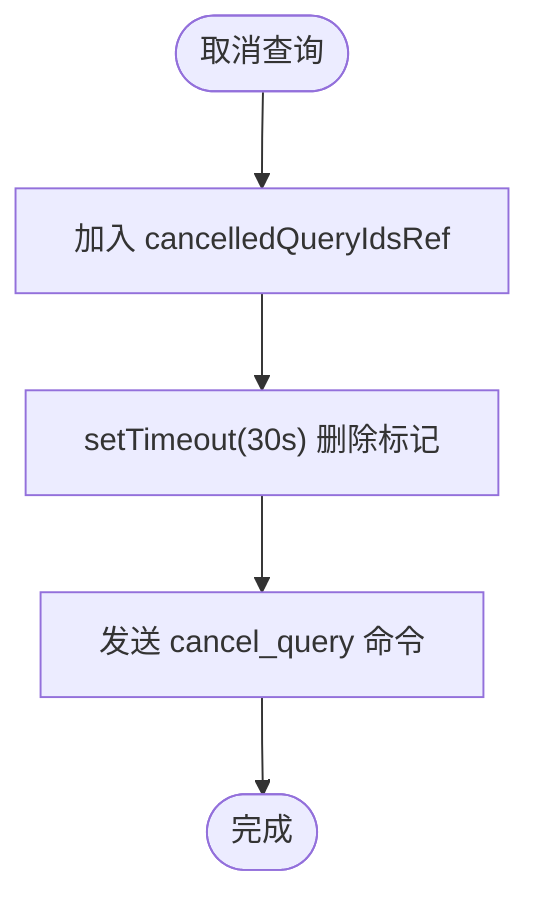
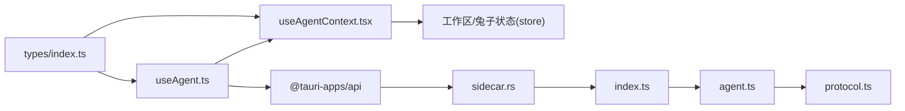

# 代理上下文管理

<cite>
**本文档引用的文件**
- [useAgentContext.tsx](file://src/hooks/useAgentContext.tsx)
- [useAgent.ts](file://src/hooks/useAgent.ts)
- [agent.ts](file://sidecar/src/agent.ts)
- [index.ts](file://sidecar/src/index.ts)
- [protocol.ts](file://sidecar/src/protocol.ts)
- [sidecar.rs](file://src-tauri/src/sidecar.rs)
- [types/index.ts](file://src/types/index.ts)
- [App.tsx](file://src/App.tsx)
- [ContentArea.tsx](file://src/components/ContentArea.tsx)
- [AgentChat.tsx](file://src/components/agent/AgentChat.tsx)
- [AgentMessage.tsx](file://src/components/agent/AgentMessage.tsx)
</cite>

## 目录
1. [简介](#简介)
2. [项目结构](#项目结构)
3. [核心组件](#核心组件)
4. [架构总览](#架构总览)
5. [详细组件分析](#详细组件分析)
6. [依赖关系分析](#依赖关系分析)
7. [性能考虑](#性能考虑)
8. [故障排除指南](#故障排除指南)
9. [结论](#结论)
10. [附录](#附录)

## 简介
本文件面向代理上下文管理的设计与实现，围绕 AgentProvider 的职责、onMessage 回调的消息处理策略、查询生命周期管理、状态同步机制、cancelledQueryIdsRef 的内存泄漏防护、sidecar 进程管理、超时与错误恢复进行深入技术剖析。文档同时提供实际使用示例与最佳实践建议，帮助开发者正确集成与扩展代理对话能力。

## 项目结构
代理上下文管理横跨前端 React Hooks、Tauri 原生桥接、Node.js sidecar 三部分，形成“前端监听事件 → Tauri 桥接 → sidecar 流式输出”的完整链路。关键模块如下：
- 前端上下文与监听：useAgentContext.tsx 提供全局 AgentProvider，封装 onMessage、取消与查询控制。
- 前端 Hook：useAgent.ts 管理 sidecar 状态、事件监听、看门狗、查询命令发送。
- sidecar 逻辑：agent.ts 将 Claude Agent SDK 的异步生成器转换为 JSON-lines 流式消息。
- 通信协议：protocol.ts 定义前后端消息类型与命令。
- Tauri 桥接：sidecar.rs 启动/停止 sidecar，转发 stdout 事件到前端。
- 类型定义：types/index.ts 统一 Agent 消息与查询选项类型。

图表来源
- [App.tsx:69-98](file://src/App.tsx#L69-L98)
- [useAgentContext.tsx:88-285](file://src/hooks/useAgentContext.tsx#L88-L285)
- [useAgent.ts:262-321](file://src/hooks/useAgent.ts#L262-L321)
- [sidecar.rs:61-214](file://src-tauri/src/sidecar.rs#L61-L214)
- [index.ts:37-91](file://sidecar/src/index.ts#L37-L91)
- [agent.ts:470-497](file://sidecar/src/agent.ts#L470-L497)
- [protocol.ts:85-107](file://sidecar/src/protocol.ts#L85-L107)

章节来源
- [App.tsx:69-98](file://src/App.tsx#L69-L98)
- [useAgentContext.tsx:88-285](file://src/hooks/useAgentContext.tsx#L88-L285)
- [useAgent.ts:262-321](file://src/hooks/useAgent.ts#L262-L321)
- [sidecar.rs:61-214](file://src-tauri/src/sidecar.rs#L61-L214)
- [index.ts:37-91](file://sidecar/src/index.ts#L37-L91)
- [agent.ts:470-497](file://sidecar/src/agent.ts#L470-L497)
- [protocol.ts:85-107](file://sidecar/src/protocol.ts#L85-L107)

## 核心组件
- AgentProvider：在应用顶层提供全局 Agent 上下文，承载 onMessage、取消、查询、压缩、AskUserQuestion 响应等能力，确保页面切换时不丢失流式消息。
- useAgent Hook：封装 sidecar 状态、事件监听、看门狗、命令发送，负责消息解析与回调分发。
- sidecar 逻辑：将 Claude Agent SDK 的异步生成器转换为 JSON-lines 流式消息，支持取消、压缩、AskUserQuestion 等。
- Tauri 桥接：启动/停止 sidecar，将 sidecar stdout 的 JSON-lines 事件转发为前端可消费的 Tauri 事件。
- 类型系统：统一定义 Agent 消息、查询选项、事件负载等类型，保证前后端一致性。

章节来源
- [useAgentContext.tsx:32-71](file://src/hooks/useAgentContext.tsx#L32-L71)
- [useAgent.ts:53-101](file://src/hooks/useAgent.ts#L53-L101)
- [agent.ts:75-78](file://sidecar/src/agent.ts#L75-L78)
- [sidecar.rs:46-49](file://src-tauri/src/sidecar.rs#L46-L49)
- [types/index.ts:82-102](file://src/types/index.ts#L82-L102)

## 架构总览
代理上下文管理采用“前端 Provider + Hook + Tauri 事件 + sidecar 流式输出”的分层架构。前端通过 useAgentContext 暴露统一 API，useAgent 负责事件监听与看门狗，sidecar 将 SDK 输出标准化为 JSON-lines，Tauri 负责进程生命周期与事件桥接。

图表来源
- [ContentArea.tsx:104-105](file://src/components/ContentArea.tsx#L104-L105)
- [useAgentContext.tsx:92-193](file://src/hooks/useAgentContext.tsx#L92-L193)
- [useAgent.ts:262-321](file://src/hooks/useAgent.ts#L262-L321)
- [sidecar.rs:177-194](file://src-tauri/src/sidecar.rs#L177-L194)
- [index.ts:37-91](file://sidecar/src/index.ts#L37-L91)
- [agent.ts:320-438](file://sidecar/src/agent.ts#L320-L438)

## 详细组件分析

### AgentProvider 设计与实现
- 职责
  - 提升 onMessage 到 App 层，避免页面切换导致监听丢失。
  - 统一封装 startQuery/resumeQuery/cancelQuery/compactQuery/respondToQuestion/cancelQuestion。
  - 维护 cancelledQueryIdsRef，过滤取消后的 sidecar 消息，防止内存泄漏。
  - 处理 sidecar 退出与查询超时，统一收敛为 error 状态。
- 关键点
  - onMessage 按消息类型分支处理：assistant(tool_use/text/thinking/done)、tool_result、result、error、compaction、compaction_result、ask_user_question、usage_update。
  - 对 __spec__ 前缀的查询进行特殊处理，避免干扰常规对话流。
  - onSidecarExit 清理所有查询看门狗，统一标记为 error。
  - onQueryTimeout 将超时查询标记为 error，避免 UI 永远 loading。
- 取消流程
  - cancelQuery 先将 queryId 加入 cancelledQueryIdsRef，30 秒后清理，随后发送 cancel 命令，避免竞态导致的消息泄漏。

图表来源
- [useAgentContext.tsx:196-201](file://src/hooks/useAgentContext.tsx#L196-L201)

章节来源
- [useAgentContext.tsx:88-285](file://src/hooks/useAgentContext.tsx#L88-L285)

### onMessage 回调的消息处理
- system/init：更新 sessionId 与状态为 running。
- assistant：
  - text_delta/thinking_delta：追加到最近一条同类型消息，保持流式体验。
  - thinking_done：补充思考时长。
  - text_done：流式结束信号，不额外处理。
  - 其他完整消息：追加到聊天流，状态置为 running。
- tool_result：追加工具执行结果。
- result：
  - 更新状态为 success/error，写入 cost、duration、usage、numTurns。
  - 通知任务结果。
- error：追加错误消息，状态置为 error。
- compaction/compaction_result：更新压缩阶段与结果。
- ask_user_question：追加提问消息，等待前端响应。
- usage_update：覆盖式更新当前 turn 的 token 使用。

章节来源
- [useAgentContext.tsx:104-178](file://src/hooks/useAgentContext.tsx#L104-L178)

### 查询生命周期管理
- startQuery/resumeQuery：
  - 构造命令，通过 Tauri invoke 发送到 sidecar。
  - 启动看门狗，按思考态调整超时阈值。
- cancelQuery：
  - 清理看门狗与思考态标记，发送 cancel 命令。
  - 通过 cancelledQueryIdsRef 过滤后续 abort 消息。
- compactQuery：
  - 发送 /compact prompt 触发压缩，重新启动看门狗。
- respondToolRequest：
  - 前端回答 AskUserQuestion，通过 requestId 匹配 sidecar。

章节来源
- [useAgent.ts:156-243](file://src/hooks/useAgent.ts#L156-L243)
- [agent.ts:548-573](file://sidecar/src/agent.ts#L548-L573)

### sidecar 进程管理与错误恢复
- 启动：sidecar.rs 读取配置，注入环境变量，启动 sidecar 进程，分别派生 stdout/stderr 读取线程。
- 停止：发送 shutdown 命令，等待优雅退出，随后 kill。
- 退出事件：stdout 关闭或 sidecar 主动发出 sidecar-exit，前端统一清理看门狗并标记为 error。
- 错误恢复：onSidecarExit 清理所有查询看门狗，避免泄漏；onQueryTimeout 将超时查询标记为 error。

章节来源
- [sidecar.rs:61-214](file://src-tauri/src/sidecar.rs#L61-L214)
- [useAgent.ts:290-296](file://src/hooks/useAgent.ts#L290-L296)
- [useAgentContext.tsx:180-192](file://src/hooks/useAgentContext.tsx#L180-L192)

### 超时处理与思考态分类
- 看门狗：
  - 每条 query 独立计时，收到任意消息重置。
  - 正常态超时阈值：10 分钟；思考态放宽至 30 分钟。
  - 收到 result/error 终态消息时清除计时与思考态标记。
- 思考态分类：
  - thinking_delta/thinking → 进入思考态。
  - thinking_done/text_delta/text/tool_use → 退出思考态。
  - 仅在思考态下豁免重置，避免纯静默长思考被误判超时。

章节来源
- [useAgent.ts:66-95](file://src/hooks/useAgent.ts#L66-L95)
- [useAgent.ts:272-284](file://src/hooks/useAgent.ts#L272-L284)

### cancelledQueryIdsRef 内存泄漏防护
- 作用：在取消查询后，短时间内过滤 sidecar 发出的后续消息（如多个 result/error），避免 UI 重复渲染与状态错乱。
- 机制：取消时加入 Set，30 秒后清理，确保能覆盖 sidecar 的“最后一条消息”竞态。
- 与取消命令配合：先标记再发送命令，避免竞态导致的“已取消但仍有消息到达”。

章节来源
- [useAgentContext.tsx:90-99](file://src/hooks/useAgentContext.tsx#L90-L99)
- [useAgentContext.tsx:196-201](file://src/hooks/useAgentContext.tsx#L196-L201)
- [agent.ts:578-595](file://sidecar/src/agent.ts#L578-L595)

### 与 UI 的状态同步与渲染
- AgentChat：按用户消息分组，合并连续文本，自动滚动到底部，展示压缩状态与运行指示。
- AgentMessage：根据消息类型渲染不同组件（ThinkingBlock、ToolCallBlock、CompactionBlock、AskUserQuestionBlock）。
- ContentArea：在提交消息、取消、压缩等场景调用 agent API，驱动 UI 状态变化。

章节来源
- [AgentChat.tsx:38-85](file://src/components/agent/AgentChat.tsx#L38-L85)
- [AgentChat.tsx:117-130](file://src/components/agent/AgentChat.tsx#L117-L130)
- [AgentMessage.tsx:43-194](file://src/components/agent/AgentMessage.tsx#L43-L194)
- [ContentArea.tsx:466-541](file://src/components/ContentArea.tsx#L466-L541)

## 依赖关系分析
- 前端依赖
  - useAgentContext 依赖 useAgent，依赖 store 进行状态更新。
  - useAgent 依赖 @tauri-apps/api 进行 invoke/listen，依赖 types 定义消息类型。
- sidecar 依赖
  - agent.ts 依赖 @anthropic-ai/claude-agent-sdk，依赖 protocol.ts 类型。
  - index.ts 依赖 readline 与 agent.ts 的命令处理器。
- Tauri 依赖
  - sidecar.rs 依赖 serde、tauri，负责进程生命周期与事件转发。

图表来源
- [types/index.ts:82-102](file://src/types/index.ts#L82-L102)
- [useAgent.ts:53-101](file://src/hooks/useAgent.ts#L53-L101)
- [useAgentContext.tsx:92-193](file://src/hooks/useAgentContext.tsx#L92-L193)
- [sidecar.rs:46-49](file://src-tauri/src/sidecar.rs#L46-L49)
- [index.ts:37-91](file://sidecar/src/index.ts#L37-L91)
- [agent.ts:75-78](file://sidecar/src/agent.ts#L75-L78)
- [protocol.ts:85-107](file://sidecar/src/protocol.ts#L85-L107)

章节来源
- [types/index.ts:82-102](file://src/types/index.ts#L82-L102)
- [useAgent.ts:53-101](file://src/hooks/useAgent.ts#L53-L101)
- [useAgentContext.tsx:92-193](file://src/hooks/useAgentContext.tsx#L92-L193)
- [sidecar.rs:46-49](file://src-tauri/src/sidecar.rs#L46-L49)
- [index.ts:37-91](file://sidecar/src/index.ts#L37-L91)
- [agent.ts:75-78](file://sidecar/src/agent.ts#L75-L78)
- [protocol.ts:85-107](file://sidecar/src/protocol.ts#L85-L107)

## 性能考虑
- 流式增量渲染：assistant 的 text_delta/thinking_delta 直接追加到最近消息，减少 DOM 重排。
- 思考态放宽超时：避免 Claude 长思考被误判超时，降低不必要的失败重试。
- 看门狗按查询独立：避免全局锁影响其他查询。
- 30 秒延迟清理 cancelledQueryIdsRef：充分覆盖 sidecar 最后一条消息的竞态。
- 代理指纹检测：代理变更时重启 sidecar，避免配置污染。

## 故障排除指南
- sidecar 未运行
  - 检查 sidecarStatus，必要时调用 startSidecar。
  - 若 get_sidecar_status 返回 false，确认 sidecar.rs 启动逻辑与资源路径。
- 查询无响应
  - 查看 onQueryTimeout 是否触发，确认看门狗是否被思考态豁免。
  - 检查 cancelledQueryIdsRef 是否提前清理导致误判。
- 取消无效
  - 确认 cancelQuery 是否先标记再发送命令。
  - 检查 sidecar 侧 handleCancelQuery 是否正确中断 activeQueries。
- AskUserQuestion 无响应
  - 确认前端 respondToQuestion/cancelQuestion 是否正确调用。
  - 检查 sidecar 侧 pendingToolRequests 是否存在超时或提前清理。

章节来源
- [useAgentContext.tsx:180-192](file://src/hooks/useAgentContext.tsx#L180-L192)
- [useAgent.ts:290-296](file://src/hooks/useAgent.ts#L290-L296)
- [agent.ts:578-595](file://sidecar/src/agent.ts#L578-L595)
- [agent.ts:548-573](file://sidecar/src/agent.ts#L548-L573)

## 结论
AgentProvider 通过在应用顶层集中管理 onMessage、取消与查询控制，有效解决了页面切换导致的监听丢失与流式消息中断问题。结合 useAgent 的看门狗、cancelledQueryIdsRef 的内存泄漏防护、sidecar 的流式输出与 Tauri 的进程桥接，形成了稳定可靠的代理上下文管理方案。遵循本文的最佳实践，可在复杂交互场景中保持 UI 一致性和系统健壮性。

## 附录

### 实际使用示例
- 在 ContentArea 中发起查询
  - 通过 ensureSidecarAndQuery 确保 sidecar 就绪，然后调用 agent.startQuery 或 agent.resumeQuery。
  - 参考路径：[ContentArea.tsx:269-400](file://src/components/ContentArea.tsx#L269-L400)
- 在 AgentProvider 中处理消息
  - onMessage 根据消息类型更新 store，驱动 UI 渲染。
  - 参考路径：[useAgentContext.tsx:92-178](file://src/hooks/useAgentContext.tsx#L92-L178)
- 取消查询
  - 调用 agent.cancelQuery，内部自动标记并清理，随后发送取消命令。
  - 参考路径：[useAgentContext.tsx:196-201](file://src/hooks/useAgentContext.tsx#L196-L201)

### 最佳实践
- 页面切换时依赖 AgentProvider 的全局监听，避免在组件卸载时丢失流式消息。
- 对于长思考场景，不要手动干预取消，让思考态放宽超时生效。
- 取消查询后，前端应将状态置为 idle，避免 result 消息到达后状态错乱。
- 代理配置变更时，及时重启 sidecar，确保环境变量生效。
- 对 AskUserQuestion 的响应必须通过 requestId 匹配，避免跨查询混淆。