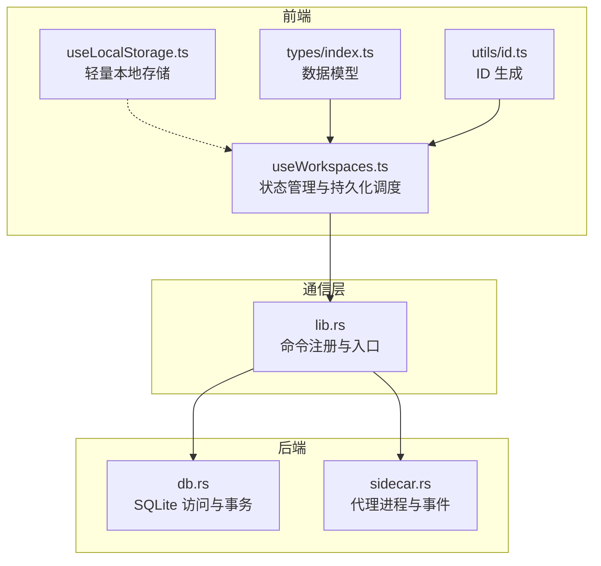
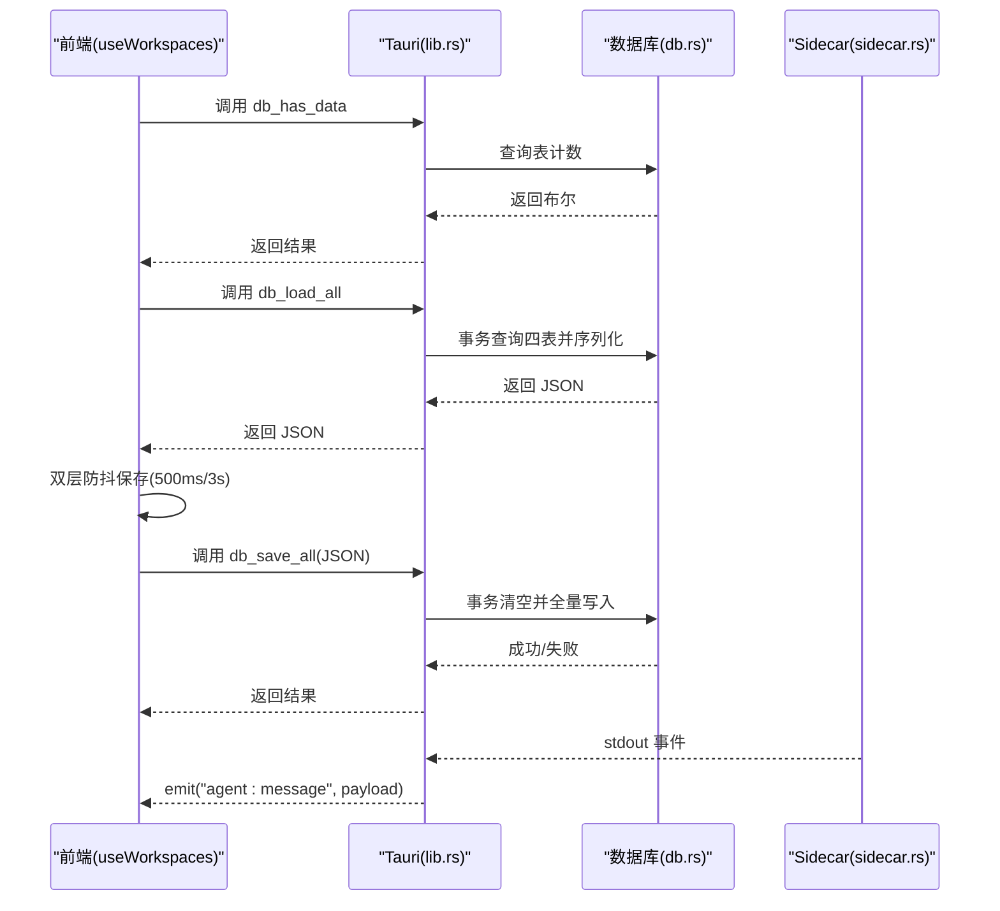
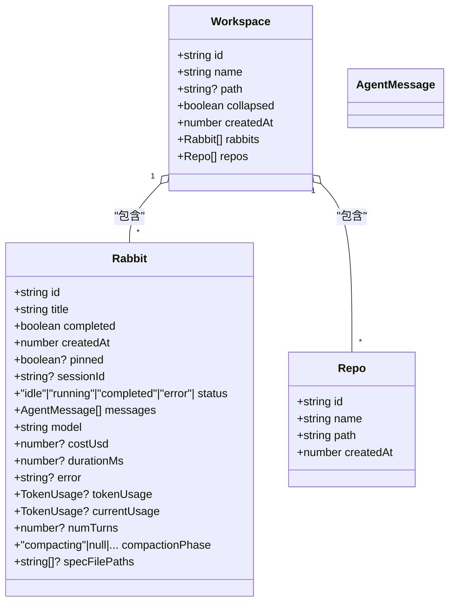
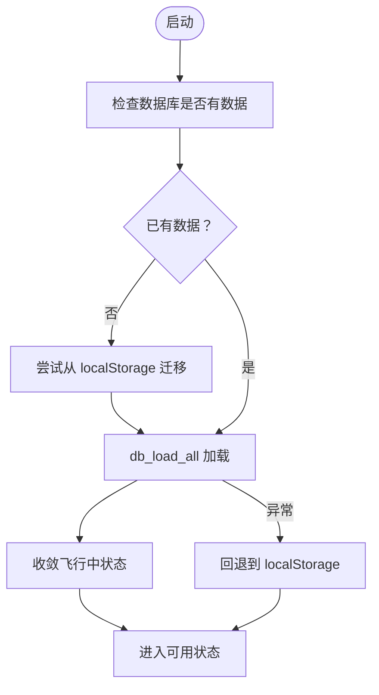
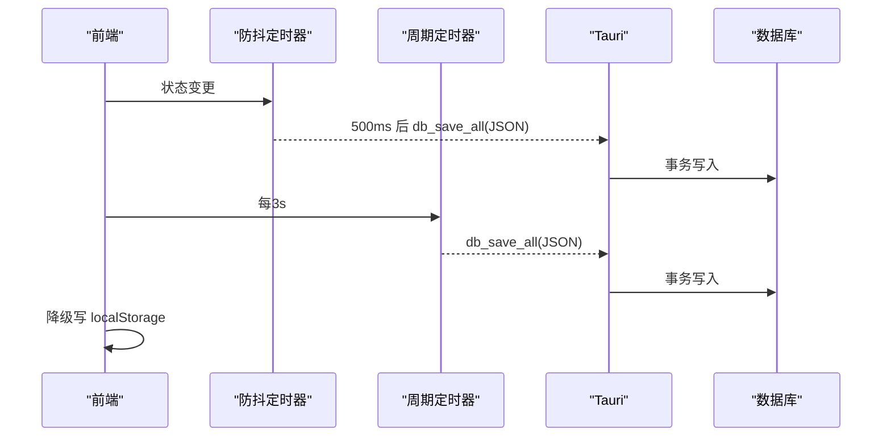
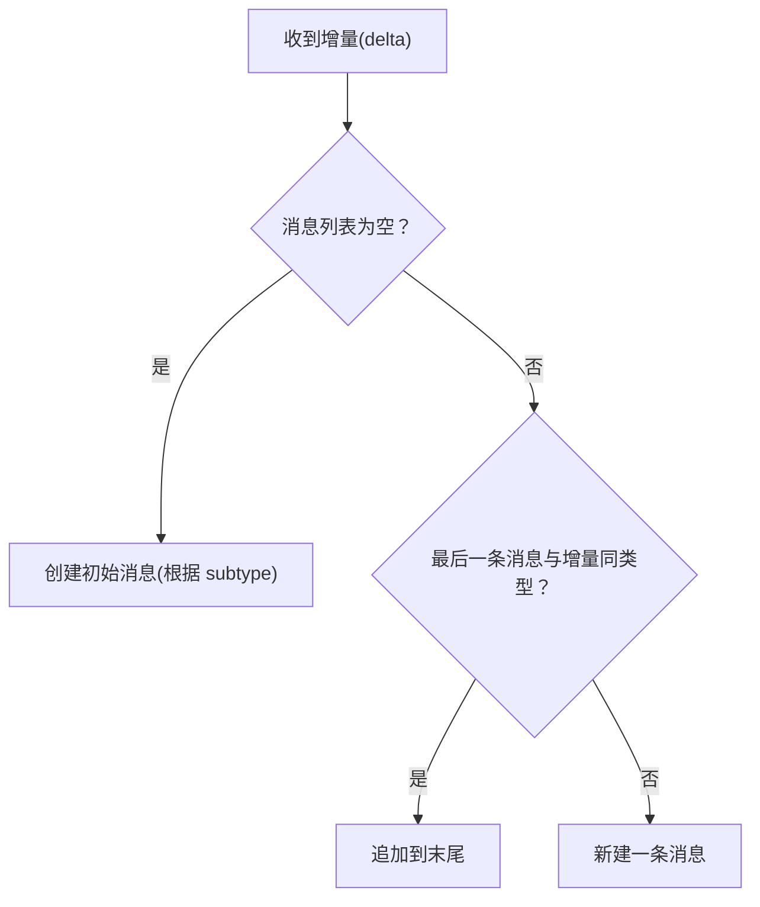
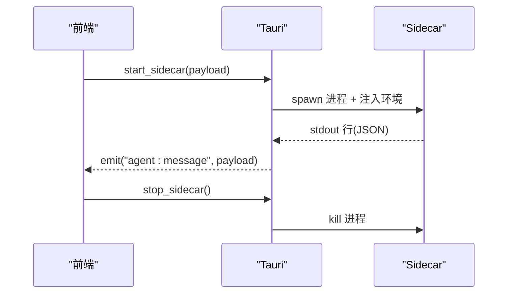
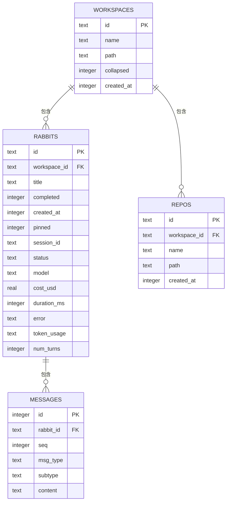
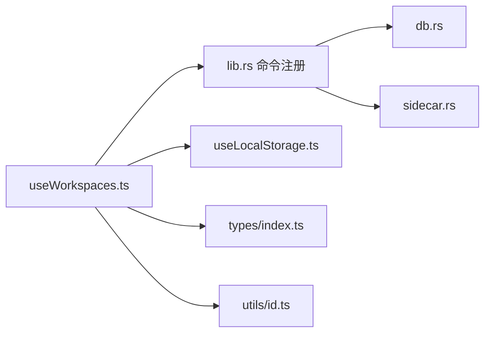

# 工作空间状态

<cite>
**本文档引用的文件**
- [useWorkspaces.ts](file://src/hooks/useWorkspaces.ts)
- [useLocalStorage.ts](file://src/hooks/useLocalStorage.ts)
- [lib.rs](file://src-tauri/src/lib.rs)
- [db.rs](file://src-tauri/src/db.rs)
- [sidecar.rs](file://src-tauri/src/sidecar.rs)
- [index.ts](file://src/types/index.ts)
- [id.ts](file://src/utils/id.ts)
- [main.rs](file://src-tauri/src/main.rs)
</cite>

## 目录
1. [简介](#简介)
2. [项目结构](#项目结构)
3. [核心组件](#核心组件)
4. [架构总览](#架构总览)
5. [详细组件分析](#详细组件分析)
6. [依赖关系分析](#依赖关系分析)
7. [性能考量](#性能考量)
8. [故障排查指南](#故障排查指南)
9. [结论](#结论)
10. [附录](#附录)

## 简介
本文件聚焦“工作空间状态管理”，系统性阐述以下方面：
- 工作空间数据结构与消息模型
- 状态更新机制与持久化策略
- 工作空间 CRUD、仓库管理、会话历史与 Rabbit 代理状态维护
- 状态同步、并发更新处理与数据一致性保障
- 状态快照、撤销重做能力建议与性能优化方案
- 最佳实践与常见问题解决方案

## 项目结构
工作空间状态管理横跨前端 React Hook、Tauri 命令与 Rust 数据库三层：
- 前端层：通过自定义 Hook 管理内存状态、触发持久化与事件响应
- 通信层：通过 Tauri invoke 调用后端命令
- 后端层：Rust 实现数据库访问、Schema 管理与 sidecar 状态维护

图示来源
- [useWorkspaces.ts:1-541](file://src/hooks/useWorkspaces.ts#L1-L541)
- [lib.rs:375-569](file://src-tauri/src/lib.rs#L375-L569)
- [db.rs:1-417](file://src-tauri/src/db.rs#L1-L417)
- [sidecar.rs:1-359](file://src-tauri/src/sidecar.rs#L1-L359)

章节来源
- [useWorkspaces.ts:28-95](file://src/hooks/useWorkspaces.ts#L28-L95)
- [lib.rs:375-569](file://src-tauri/src/lib.rs#L375-L569)

## 核心组件
- 工作空间与 Rabbit 数据模型：定义了工作空间、仓库、Rabbit 以及 Agent 消息类型与状态字段
- useWorkspaces Hook：负责状态加载、迁移、双层防抖保存、消息追加与状态收敛
- Tauri 命令：db_load_all、db_save_all、db_has_data 等，统一前后端接口
- 数据库层：SQLite Schema、事务写入、消息分表存储
- Sidecar 状态：进程生命周期、事件发射与状态查询

章节来源
- [index.ts:34-42](file://src/types/index.ts#L34-L42)
- [index.ts:8-32](file://src/types/index.ts#L8-L32)
- [index.ts:82-283](file://src/types/index.ts#L82-L283)
- [useWorkspaces.ts:28-540](file://src/hooks/useWorkspaces.ts#L28-L540)
- [db.rs:10-138](file://src-tauri/src/db.rs#L10-L138)
- [sidecar.rs:6-57](file://src-tauri/src/sidecar.rs#L6-L57)

## 架构总览
工作空间状态在启动时从数据库加载，若数据库不可用则回退到本地存储；随后通过双层防抖策略定期持久化；Rabbit 的消息与状态通过 Tauri 命令写入数据库；Sidecar 作为外部进程提供代理能力并通过事件驱动前端状态更新。

图示来源
- [useWorkspaces.ts:48-95](file://src/hooks/useWorkspaces.ts#L48-L95)
- [useWorkspaces.ts:101-119](file://src/hooks/useWorkspaces.ts#L101-L119)
- [lib.rs:522-566](file://src-tauri/src/lib.rs#L522-L566)
- [db.rs:392-416](file://src-tauri/src/db.rs#L392-L416)
- [sidecar.rs:175-208](file://src-tauri/src/sidecar.rs#L175-L208)

## 详细组件分析

### 数据模型与消息类型
- Workspace：包含 id、name、path、collapsed、createdAt、rabbits、repos
- Rabbit：包含 id、title、completed、createdAt、pinned、sessionId、status、messages、model、costUsd、durationMs、error、tokenUsage、currentUsage、numTurns、compactionPhase、specFilePaths
- AgentMessage：涵盖文本/思考增量、工具调用、结果、错误、Spec 生成/确认/写入、压缩状态/结果、用量更新、AskUserQuestion 等

图示来源
- [index.ts:34-42](file://src/types/index.ts#L34-L42)
- [index.ts:8-32](file://src/types/index.ts#L8-L32)
- [index.ts:82-283](file://src/types/index.ts#L82-L283)

章节来源
- [index.ts:34-42](file://src/types/index.ts#L34-L42)
- [index.ts:8-32](file://src/types/index.ts#L8-L32)
- [index.ts:82-283](file://src/types/index.ts#L82-L283)

### 状态加载与迁移
- 首次启动检测数据库是否有数据，若无则尝试从本地存储迁移
- 成功加载后对“飞行中”状态进行收敛：running→idle、compacting→null、移除 spec_generating、标记 AskUserQuestion 过期
- 若数据库不可用则回退到本地存储

图示来源
- [useWorkspaces.ts:48-95](file://src/hooks/useWorkspaces.ts#L48-L95)
- [useWorkspaces.ts:14-26](file://src/hooks/useWorkspaces.ts#L14-L26)

章节来源
- [useWorkspaces.ts:48-95](file://src/hooks/useWorkspaces.ts#L48-L95)
- [useWorkspaces.ts:14-26](file://src/hooks/useWorkspaces.ts#L14-L26)

### 持久化策略与双层防抖
- 防抖层：状态变更后 500ms 触发 db_save_all
- 周期层：每 3s 强制保存，覆盖连续流式输出
- 降级层：当数据库不可用或加载中时写入 localStorage

图示来源
- [useWorkspaces.ts:101-119](file://src/hooks/useWorkspaces.ts#L101-L119)
- [useWorkspaces.ts:121-129](file://src/hooks/useWorkspaces.ts#L121-L129)

章节来源
- [useWorkspaces.ts:101-119](file://src/hooks/useWorkspaces.ts#L101-L119)
- [useWorkspaces.ts:121-129](file://src/hooks/useWorkspaces.ts#L121-L129)

### 工作空间 CRUD 与仓库管理
- 新增/删除/重命名工作空间
- 展开/折叠工作空间
- 新增/删除/更新仓库（name/path）

章节来源
- [useWorkspaces.ts:149-197](file://src/hooks/useWorkspaces.ts#L149-L197)
- [useWorkspaces.ts:277-297](file://src/hooks/useWorkspaces.ts#L277-L297)

### Rabbit 管理与会话历史
- 新增/删除/重命名 Rabbit
- 完成状态切换与置顶
- 更新 Rabbit 的 Agent 字段（sessionId/status/messages/cost/duration/error/tokenUsage/currentUsage/numTurns/specFilePaths/compactionPhase）
- 追加 Spec 文件路径（去重）
- 追加 Agent 消息（对 result 类型去重）
- 追加增量文本（同类型合并，否则新建）
- 更新 AskUserQuestion 的 answered 与 userAnswers
- 更新最后一条 thinking 消息的 durationMs

图示来源
- [useWorkspaces.ts:405-449](file://src/hooks/useWorkspaces.ts#L405-L449)

章节来源
- [useWorkspaces.ts:209-263](file://src/hooks/useWorkspaces.ts#L209-L263)
- [useWorkspaces.ts:324-340](file://src/hooks/useWorkspaces.ts#L324-L340)
- [useWorkspaces.ts:357-377](file://src/hooks/useWorkspaces.ts#L357-L377)
- [useWorkspaces.ts:379-402](file://src/hooks/useWorkspaces.ts#L379-L402)
- [useWorkspaces.ts:405-449](file://src/hooks/useWorkspaces.ts#L405-L449)
- [useWorkspaces.ts:451-476](file://src/hooks/useWorkspaces.ts#L451-L476)
- [useWorkspaces.ts:478-503](file://src/hooks/useWorkspaces.ts#L478-L503)

### Sidecar 代理状态维护
- 启动/停止/查询 sidecar 进程
- 从 stdout 逐行解析 Agent 事件并广播到前端
- 清理环境变量与配置根目录，确保隔离

图示来源
- [sidecar.rs:60-214](file://src-tauri/src/sidecar.rs#L60-L214)
- [sidecar.rs:245-279](file://src-tauri/src/sidecar.rs#L245-L279)
- [lib.rs:522-566](file://src-tauri/src/lib.rs#L522-L566)

章节来源
- [sidecar.rs:60-214](file://src-tauri/src/sidecar.rs#L60-L214)
- [sidecar.rs:245-279](file://src-tauri/src/sidecar.rs#L245-L279)

### 数据库 Schema 与一致性
- Schema：workspaces、rabbits、repos、messages 四表，含外键约束与索引
- 事务写入：全量替换，先清空再遍历插入，保证一致性
- 消息分表：按 rabbit_id+seq 存储，按序读取还原

图示来源
- [db.rs:85-138](file://src-tauri/src/db.rs#L85-L138)
- [db.rs:290-386](file://src-tauri/src/db.rs#L290-L386)

章节来源
- [db.rs:85-138](file://src-tauri/src/db.rs#L85-L138)
- [db.rs:290-386](file://src-tauri/src/db.rs#L290-L386)

## 依赖关系分析
- useWorkspaces 依赖 Tauri 命令与本地存储
- Tauri 入口注册 db 与 sidecar 相关命令
- 数据库层提供事务写入与查询
- Sidecar 通过事件驱动前端状态更新

图示来源
- [useWorkspaces.ts:28-540](file://src/hooks/useWorkspaces.ts#L28-L540)
- [lib.rs:522-566](file://src-tauri/src/lib.rs#L522-L566)
- [db.rs:392-416](file://src-tauri/src/db.rs#L392-L416)
- [sidecar.rs:272-279](file://src-tauri/src/sidecar.rs#L272-L279)

章节来源
- [useWorkspaces.ts:28-540](file://src/hooks/useWorkspaces.ts#L28-L540)
- [lib.rs:522-566](file://src-tauri/src/lib.rs#L522-L566)

## 性能考量
- 事务批量写入：减少多次提交带来的开销与锁竞争
- 索引优化：按 workspace_id、rabbit_id+seq 建立索引，提升查询效率
- 防抖与周期保存：平衡实时性与写入频率，避免频繁 IO
- 消息分表：将大体量消息拆分至独立表，降低主表膨胀
- Sidecar 隔离：通过环境变量与配置根目录隔离，避免全局资源影响

章节来源
- [db.rs:85-138](file://src-tauri/src/db.rs#L85-L138)
- [db.rs:290-386](file://src-tauri/src/db.rs#L290-L386)
- [useWorkspaces.ts:101-119](file://src/hooks/useWorkspaces.ts#L101-L119)

## 故障排查指南
- 数据库不可用
  - 现象：db_load_all/db_save_all 抛错，前端回退到 localStorage
  - 处理：检查数据库文件权限与路径，确认 Tauri 初始化成功
- 迁移失败
  - 现象：首次启动迁移 localStorage 到 SQLite 失败
  - 处理：检查 localStorage 数据完整性，清理损坏数据后重试
- 会话消息异常
  - 现象：消息重复或缺失
  - 处理：确认 result 类型消息去重逻辑与增量合并逻辑
- Sidecar 无响应
  - 现象：agent:message 事件未到达
  - 处理：检查 sidecar 进程状态、stdout 读取线程与事件发射

章节来源
- [useWorkspaces.ts:74-92](file://src/hooks/useWorkspaces.ts#L74-L92)
- [useWorkspaces.ts:379-402](file://src/hooks/useWorkspaces.ts#L379-L402)
- [useWorkspaces.ts:405-449](file://src/hooks/useWorkspaces.ts#L405-L449)
- [sidecar.rs:175-208](file://src-tauri/src/sidecar.rs#L175-L208)

## 结论
本方案通过“前端 Hook + Tauri 命令 + Rust 数据库”的分层设计，实现了工作空间状态的可靠持久化与高效同步。双层防抖与事务写入保障了性能与一致性；消息分表与索引优化提升了查询效率；Sidecar 事件驱动使前端状态与外部代理保持一致。建议在生产环境中结合监控与日志，持续评估持久化与事件处理的稳定性。

## 附录
- 状态快照与撤销重做
  - 快照：可基于 db_save_all 的 JSON 输出生成快照文件，便于备份与回滚
  - 撤销重做：可在前端维护操作栈，记录关键动作（新增/删除/更新），通过反向操作恢复
- 最佳实践
  - 严格区分“飞行中”状态并在加载时收敛
  - 保持消息类型与序列的唯一性，避免重复
  - 使用事务写入，避免部分写入导致的数据不一致
  - 对大体量消息采用分表存储，定期归档历史
  - Sidecar 环境隔离与配置根目录管理，确保可重复部署