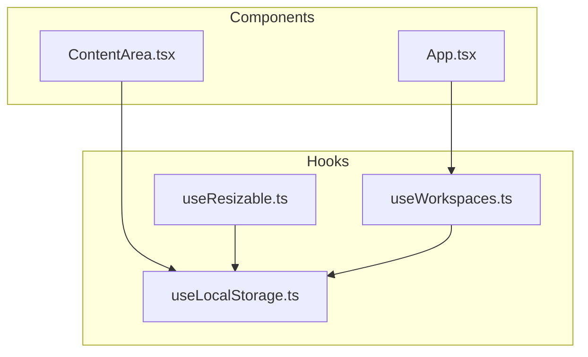
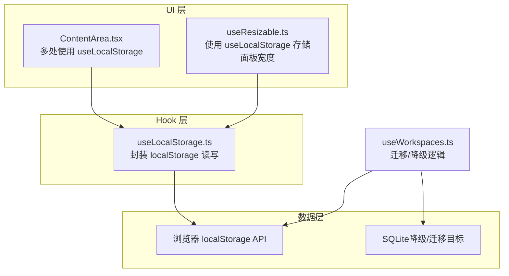
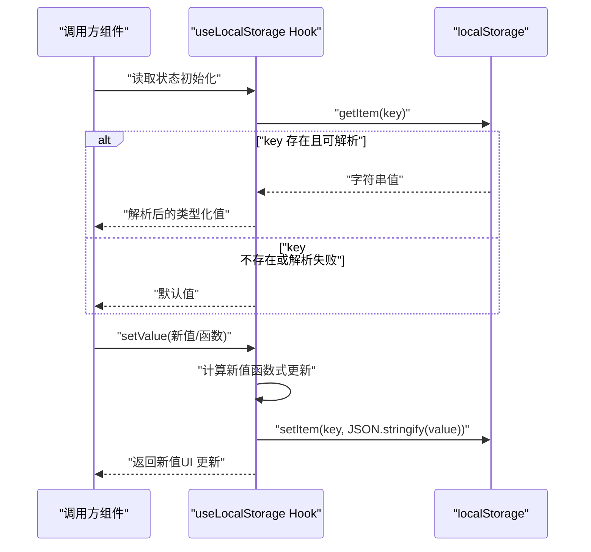
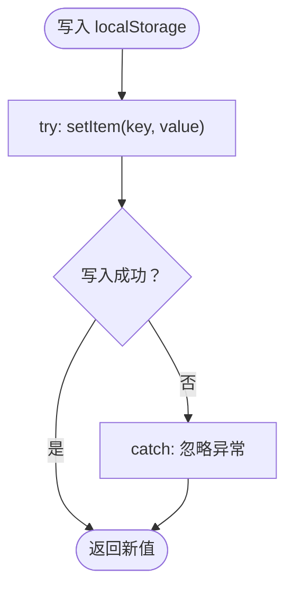
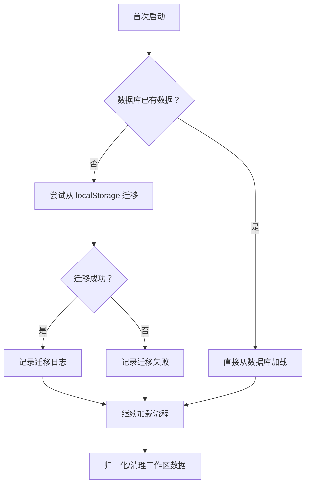
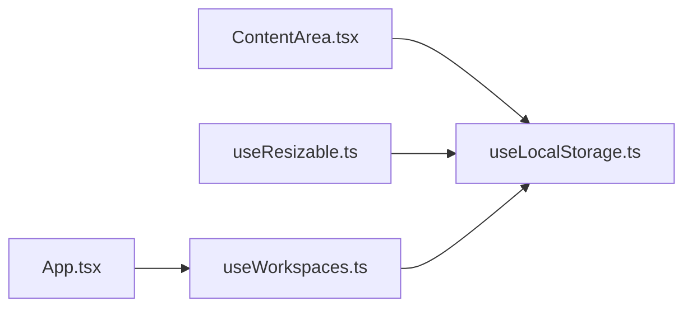

# 本地存储 Hook

<cite>
**本文档引用的文件**
- [useLocalStorage.ts](file://src/hooks/useLocalStorage.ts)
- [ContentArea.tsx](file://src/components/ContentArea.tsx)
- [useResizable.ts](file://src/hooks/useResizable.ts)
- [useWorkspaces.ts](file://src/hooks/useWorkspaces.ts)
- [App.tsx](file://src/App.tsx)
</cite>

## 目录
1. [简介](#简介)
2. [项目结构](#项目结构)
3. [核心组件](#核心组件)
4. [架构总览](#架构总览)
5. [详细组件分析](#详细组件分析)
6. [依赖关系分析](#依赖关系分析)
7. [性能考量](#性能考量)
8. [故障排查指南](#故障排查指南)
9. [结论](#结论)
10. [附录](#附录)

## 简介
本文件围绕本地存储 Hook 的技术实现进行系统化说明，重点涵盖以下方面：
- useLocalStorage 的实现原理与数据序列化/反序列化机制
- 键值管理、类型安全与默认值处理策略
- 跨标签页同步与存储事件监听现状
- 容量限制处理与降级策略
- 数据迁移、版本兼容性与存储清理策略
- 最佳实践与性能优化建议

## 项目结构
本项目中，本地存储能力通过一个通用 Hook 提供，并在多个业务组件中被广泛复用。关键位置如下：
- Hook 实现：src/hooks/useLocalStorage.ts
- 典型使用场景：src/components/ContentArea.tsx、src/hooks/useResizable.ts
- 数据迁移与降级策略：src/hooks/useWorkspaces.ts
- 应用入口与上下文：src/App.tsx

**图表来源**
- [useLocalStorage.ts:1-27](file://src/hooks/useLocalStorage.ts#L1-L27)
- [useResizable.ts:1-95](file://src/hooks/useResizable.ts#L1-L95)
- [useWorkspaces.ts:13-212](file://src/hooks/useWorkspaces.ts#L13-L212)
- [ContentArea.tsx:40-239](file://src/components/ContentArea.tsx#L40-L239)
- [App.tsx:1-109](file://src/App.tsx#L1-L109)

**章节来源**
- [useLocalStorage.ts:1-27](file://src/hooks/useLocalStorage.ts#L1-L27)
- [useResizable.ts:1-95](file://src/hooks/useResizable.ts#L1-L95)
- [useWorkspaces.ts:13-212](file://src/hooks/useWorkspaces.ts#L13-L212)
- [ContentArea.tsx:40-239](file://src/components/ContentArea.tsx#L40-L239)
- [App.tsx:1-109](file://src/App.tsx#L1-L109)

## 核心组件
useLocalStorage 是一个基于 React Hooks 的本地持久化工具，提供类型安全的读写接口，内部采用 JSON 序列化/反序列化进行数据持久化。

- 类型参数与返回值
  - 泛型 T：表示状态类型，支持任意可 JSON 化的数据结构
  - 返回值：元组 [读取的状态值, 写入状态的回调函数]
- 初始化流程
  - 从 localStorage 读取指定 key 的字符串值
  - 使用 JSON.parse 解析为原类型；解析失败或 key 不存在则使用默认值
- 写入流程
  - 支持直接传入新值或传入函数（函数式更新），后者接收上一状态值
  - 使用 JSON.stringify 序列化后写入 localStorage
  - 写入异常（如容量不足）会被静默捕获，避免影响 UI 更新

该实现具备以下特性：
- 类型安全：通过泛型约束，确保读取/写入类型一致
- 默认值处理：初始化阶段提供默认值，保证首次渲染稳定性
- 异常容错：读取/写入异常均被包裹在 try/catch 中，防止抛出错误

**章节来源**
- [useLocalStorage.ts:3-26](file://src/hooks/useLocalStorage.ts#L3-L26)

## 架构总览
下图展示了应用中本地存储相关模块的交互关系，包括 Hook 的使用方与数据流向。

**图表来源**
- [useLocalStorage.ts:1-27](file://src/hooks/useLocalStorage.ts#L1-L27)
- [useResizable.ts:25](file://src/hooks/useResizable.ts#L25)
- [useWorkspaces.ts:48-129](file://src/hooks/useWorkspaces.ts#L48-L129)
- [ContentArea.tsx:43-59](file://src/components/ContentArea.tsx#L43-L59)

## 详细组件分析

### useLocalStorage 实现与数据流
- 初始化阶段
  - 通过 useState 的惰性初始化，从 localStorage 读取对应 key 的值
  - 若读取成功且可解析，则返回解析后的值；否则返回默认值
- 更新阶段
  - setValue 支持两种形式：直接赋值或函数式更新
  - 函数式更新允许基于上一状态计算新值，避免闭包陷阱
  - 写入时先计算新值，再进行 JSON 序列化并写入 localStorage
  - 写入异常被捕获，不影响状态更新（UI 仍反映新值）

**图表来源**
- [useLocalStorage.ts:4-23](file://src/hooks/useLocalStorage.ts#L4-L23)

**章节来源**
- [useLocalStorage.ts:3-26](file://src/hooks/useLocalStorage.ts#L3-L26)

### 键值管理与类型安全
- 键值管理
  - 每个状态使用独立的 key 进行隔离，避免冲突
  - 在组件中集中声明 key，便于维护与查找
- 类型安全
  - 通过泛型参数 T 约束状态类型，确保读取/写入一致性
  - 默认值必须与 T 类型匹配，编译期即可发现类型不一致问题
- 默认值处理
  - 初始化阶段若无历史值，直接使用默认值，保证组件初始渲染稳定

示例使用点（节选）：
- 模型配置、选中模型 ID、知识库配置等键值对
- 右侧面板可见性、API Key、代理配置等布尔/字符串/对象类型

**章节来源**
- [ContentArea.tsx:43-59](file://src/components/ContentArea.tsx#L43-L59)
- [useResizable.ts:25](file://src/hooks/useResizable.ts#L25)

### 跨标签页同步与存储事件监听
- 现状
  - 当前实现未在任何地方显式监听 storage 事件，因此不会响应其他标签页对同一 key 的修改
- 影响
  - 在多标签页场景下，不同页面的同名 key 修改不会互相感知
- 建议
  - 如需跨标签页同步，可在挂载时添加 storage 事件监听，并在回调中更新本地状态
  - 注意去重与节流，避免重复触发导致的性能问题

[本节为概念性说明，不直接分析具体文件，故无“章节来源”]

### 存储容量限制处理
- 写入异常捕获
  - 写入 localStorage 时的异常被 try/catch 包裹，出现容量不足或不可用时不会中断 UI 更新
- 降级策略
  - 在 useWorkspaces 中，当数据库不可用时，回退到 localStorage 写入
  - 迁移流程：首次启动且数据库为空时，尝试从 localStorage 迁移到数据库

**图表来源**
- [useLocalStorage.ts:16-21](file://src/hooks/useLocalStorage.ts#L16-L21)

**章节来源**
- [useLocalStorage.ts:16-21](file://src/hooks/useLocalStorage.ts#L16-L21)
- [useWorkspaces.ts:74-129](file://src/hooks/useWorkspaces.ts#L74-L129)

### 数据迁移、版本兼容性与存储清理
- 数据迁移
  - 首次启动且数据库为空时，尝试从 localStorage 读取并迁移到数据库
  - 迁移成功后记录日志，失败则打印错误信息
- 版本兼容性
  - 对工作区数据进行归一化处理，确保字段存在性与默认值
  - 旧字段映射（如 specFilePath 与 specFilePaths）提升兼容性
- 存储清理
  - 对运行中状态进行清理，避免残留状态影响后续使用
  - 清理内容包括：将运行中状态置为空闲、移除特定消息类型、设置过期标记等

**图表来源**
- [useWorkspaces.ts:48-147](file://src/hooks/useWorkspaces.ts#L48-L147)

**章节来源**
- [useWorkspaces.ts:48-147](file://src/hooks/useWorkspaces.ts#L48-L147)

### 典型使用场景与最佳实践
- ContentArea 中的键值使用
  - 模型配置、选中模型 ID、知识库配置、右侧面板可见性、API Key、代理配置等
  - 通过 useLocalStorage 将用户偏好与界面状态持久化
- 面板宽度持久化
  - useResizable 通过 useLocalStorage 存储面板宽度，默认值与最小/最大宽度约束
- 最佳实践
  - 为每个状态分配唯一 key，避免冲突
  - 选择合适的数据结构，尽量使用可 JSON 化的对象，避免循环引用
  - 对于大对象，考虑拆分 key 或减少写入频率
  - 对频繁更新的状态，结合防抖策略降低写入次数

**章节来源**
- [ContentArea.tsx:43-59](file://src/components/ContentArea.tsx#L43-L59)
- [useResizable.ts:25](file://src/hooks/useResizable.ts#L25)

## 依赖关系分析
- 组件对 Hook 的依赖
  - ContentArea 与多个设置面板组件直接依赖 useLocalStorage
  - useResizable 依赖 useLocalStorage 存储宽度状态
- Hook 对外部 API 的依赖
  - 依赖浏览器 localStorage API 进行读写
- 上下文与入口
  - App 作为顶层容器，注入多种 Provider，useWorkspaces 在其中承担数据加载与迁移职责

**图表来源**
- [ContentArea.tsx:43-59](file://src/components/ContentArea.tsx#L43-L59)
- [useResizable.ts:25](file://src/hooks/useResizable.ts#L25)
- [useLocalStorage.ts:1-27](file://src/hooks/useLocalStorage.ts#L1-L27)
- [useWorkspaces.ts:28-31](file://src/hooks/useWorkspaces.ts#L28-L31)
- [App.tsx:31-105](file://src/App.tsx#L31-L105)

**章节来源**
- [ContentArea.tsx:43-59](file://src/components/ContentArea.tsx#L43-L59)
- [useResizable.ts:25](file://src/hooks/useResizable.ts#L25)
- [useLocalStorage.ts:1-27](file://src/hooks/useLocalStorage.ts#L1-L27)
- [useWorkspaces.ts:28-31](file://src/hooks/useWorkspaces.ts#L28-L31)
- [App.tsx:31-105](file://src/App.tsx#L31-L105)

## 性能考量
- 写入频率控制
  - 对频繁更新的状态，建议结合防抖或批处理策略，减少 localStorage 写入次数
- 数据体积控制
  - 避免在单个 key 中存储超大对象；必要时拆分为多个 key
- 解析成本
  - JSON.parse/JSON.stringify 有一定开销，应避免在热路径中过度使用
- 渲染优化
  - 使用 useMemo/useCallback 等手段减少不必要的重渲染

[本节提供一般性指导，不直接分析具体文件，故无“章节来源”]

## 故障排查指南
- 写入失败或容量不足
  - 现象：状态更新但刷新后未持久化
  - 排查：确认浏览器隐私模式或受限环境；检查存储配额
  - 处理：当前实现会静默忽略异常，必要时在上层增加提示
- 解析异常
  - 现象：初始化时报错或默认值被使用
  - 排查：检查历史数据格式是否符合预期；修正默认值类型
- 跨标签页不同步
  - 现象：修改一个标签页的状态，另一个标签页未更新
  - 处理：按“跨标签页同步与存储事件监听”建议添加 storage 事件监听
- 迁移失败
  - 现象：首次启动后数据未迁移
  - 处理：查看迁移日志与错误信息，确认 localStorage 中是否存在目标键

**章节来源**
- [useLocalStorage.ts:8-10](file://src/hooks/useLocalStorage.ts#L8-L10)
- [useLocalStorage.ts:18-20](file://src/hooks/useLocalStorage.ts#L18-L20)
- [useWorkspaces.ts:62-64](file://src/hooks/useWorkspaces.ts#L62-L64)
- [useWorkspaces.ts:76-92](file://src/hooks/useWorkspaces.ts#L76-L92)

## 结论
useLocalStorage 提供了简洁而健壮的本地持久化能力，具备类型安全、默认值处理与异常容错等特性。结合项目中的迁移与降级策略，可在不同环境下稳定运行。对于跨标签页同步、容量限制与性能优化等问题，建议在现有基础上扩展事件监听与写入策略，以满足更复杂的应用需求。

## 附录
- 关键实现参考路径
  - [useLocalStorage 实现:3-26](file://src/hooks/useLocalStorage.ts#L3-L26)
  - [ContentArea 中的键值使用示例:43-59](file://src/components/ContentArea.tsx#L43-L59)
  - [面板宽度持久化示例](file://src/hooks/useResizable.ts#L25)
  - [数据迁移与降级策略:48-129](file://src/hooks/useWorkspaces.ts#L48-L129)