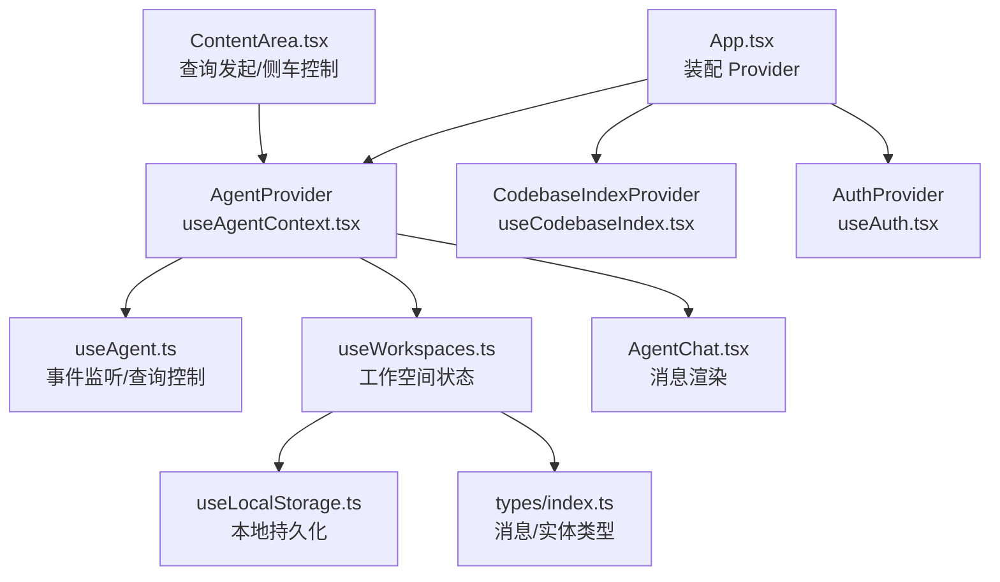
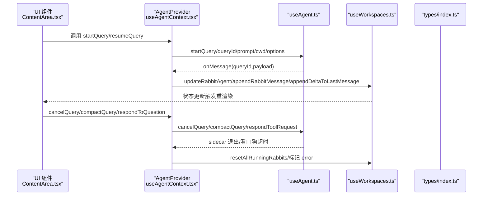
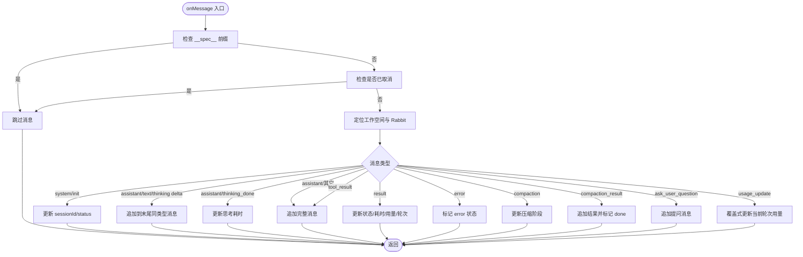
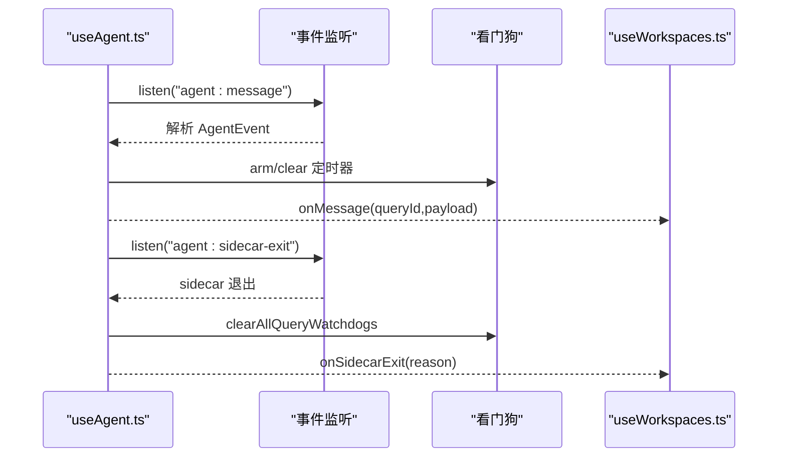
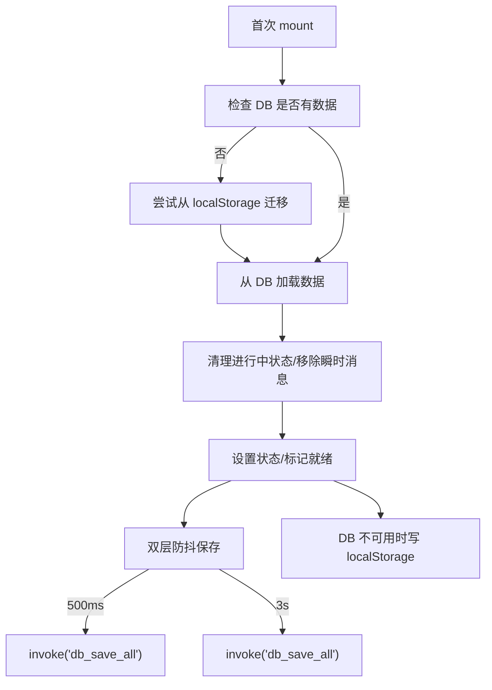
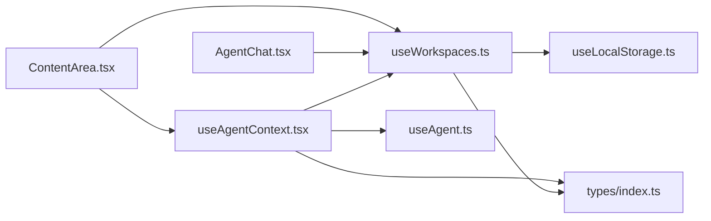

# 状态管理

<cite>
**本文引用的文件**
- [App.tsx](file://src/App.tsx)
- [useAgentContext.tsx](file://src/hooks/useAgentContext.tsx)
- [useAgent.ts](file://src/hooks/useAgent.ts)
- [useWorkspaces.ts](file://src/hooks/useWorkspaces.ts)
- [useLocalStorage.ts](file://src/hooks/useLocalStorage.ts)
- [types/index.ts](file://src/types/index.ts)
- [AgentChat.tsx](file://src/components/agent/AgentChat.tsx)
- [ContentArea.tsx](file://src/components/ContentArea.tsx)
</cite>

## 目录
1. [简介](#简介)
2. [项目结构](#项目结构)
3. [核心组件](#核心组件)
4. [架构总览](#架构总览)
5. [详细组件分析](#详细组件分析)
6. [依赖关系分析](#依赖关系分析)
7. [性能考量](#性能考量)
8. [故障排查指南](#故障排查指南)
9. [结论](#结论)
10. [附录](#附录)

## 简介
本文件系统性梳理 RabbitCoding 的状态管理设计与实现，重点围绕以下自定义 Hook 与上下文：
- useAgentContext 代理上下文管理：将 Agent SDK 的监听与消息处理提升至应用层级，确保页面切换不丢失流式消息。
- useWorkspaces 工作空间状态管理：集中管理工作区、Rabbit、仓库、消息与持久化策略。
- useLocalStorage 本地存储 Hook：提供轻量、稳定的本地持久化能力。

文档还阐述状态提升策略、状态更新模式、副作用处理、全局与局部状态边界、状态持久化机制、状态同步与竞态处理、内存泄漏防护、调试技巧与性能优化方案。

## 项目结构
RabbitCoding 的状态管理以“Hook + Context + 类型定义”为核心组织方式：
- 应用入口在 App.tsx 中装配 Provider，形成全局状态树。
- useAgentContext 将 Agent SDK 的事件监听与查询控制提升到应用级，避免组件卸载导致的流式消息丢失。
- useWorkspaces 负责工作空间与 Rabbit 的主数据源，支持 SQLite/本地回退、双层防抖保存与兼容性迁移。
- useLocalStorage 提供最小化本地持久化能力，用于小体量配置与 UI 状态。

图表来源
- [App.tsx:30-104](file://src/App.tsx#L30-L104)
- [useAgentContext.tsx:88-285](file://src/hooks/useAgentContext.tsx#L88-L285)
- [useAgent.ts:53-333](file://src/hooks/useAgent.ts#L53-L333)
- [useWorkspaces.ts:28-540](file://src/hooks/useWorkspaces.ts#L28-L540)
- [useLocalStorage.ts:1-27](file://src/hooks/useLocalStorage.ts#L1-L27)
- [types/index.ts:1-733](file://src/types/index.ts#L1-L733)
- [AgentChat.tsx:87-200](file://src/components/agent/AgentChat.tsx#L87-L200)
- [ContentArea.tsx:31-200](file://src/components/ContentArea.tsx#L31-L200)

章节来源
- [App.tsx:30-104](file://src/App.tsx#L30-L104)

## 核心组件
- useAgentContext：在 App 层级维护 Agent SDK 的事件监听与查询生命周期，向外暴露统一的查询控制 API，并将消息转换为工作空间状态更新。
- useAgent：封装与 Sidecar 的通信，负责事件订阅、看门狗（超时保护）、取消查询、压缩会话等。
- useWorkspaces：主数据源，负责工作空间、Rabbit、消息与持久化，提供批量状态更新与兼容性迁移。
- useLocalStorage：轻量本地持久化 Hook，用于 UI 选择、模型配置、代理设置等小体量数据。

章节来源
- [useAgentContext.tsx:26-297](file://src/hooks/useAgentContext.tsx#L26-L297)
- [useAgent.ts:39-333](file://src/hooks/useAgent.ts#L39-L333)
- [useWorkspaces.ts:28-540](file://src/hooks/useWorkspaces.ts#L28-L540)
- [useLocalStorage.ts:1-27](file://src/hooks/useLocalStorage.ts#L1-L27)

## 架构总览
整体采用“应用级上下文 + 组件级 Hook”的分层设计：
- 应用级：App.tsx 装配 AgentProvider、CodebaseIndexProvider、AuthProvider 等，形成全局状态树。
- 上下文层：AgentProvider 将 useAgent 的事件监听与查询控制提升到应用级，避免页面切换导致的监听丢失。
- 数据层：useWorkspaces 作为主数据源，承载工作空间、Rabbit、消息与持久化逻辑。
- 类型层：types/index.ts 定义消息、实体与查询选项等类型，确保跨模块一致性。

图表来源
- [ContentArea.tsx:104-183](file://src/components/ContentArea.tsx#L104-L183)
- [useAgentContext.tsx:88-285](file://src/hooks/useAgentContext.tsx#L88-L285)
- [useAgent.ts:262-320](file://src/hooks/useAgent.ts#L262-L320)
- [useWorkspaces.ts:324-503](file://src/hooks/useWorkspaces.ts#L324-L503)
- [types/index.ts:82-283](file://src/types/index.ts#L82-L283)

## 详细组件分析

### useAgentContext 代理上下文管理
- 设计目标
  - 将 Agent SDK 的事件监听与查询控制提升到应用级，避免页面切换导致监听丢失。
  - 将消息解析与状态更新集中在 Provider，降低组件耦合。
- 关键职责
  - onMessage：根据消息类型更新工作空间状态（消息追加、状态收敛、耗时统计、压缩阶段等）。
  - onSidecarExit/onQueryTimeout：兜底收敛“运行中”状态，避免 UI 永远 loading。
  - 包装查询 API：startQuery/resumeQuery/cancelQuery/compactQuery/respondToQuestion/cancelQuestion。
  - 取消查询的“延迟清理”：使用 Set 标记 queryId，30 秒后清理，确保过滤 sidecar 后续消息。
- 状态提升策略
  - 将 Agent SDK 的事件监听提升到 App 层，组件只需消费上下文即可。
  - 将消息处理与状态更新解耦，通过 store 方法集中更新。
- 竞态与内存泄漏防护
  - 使用 useRef 存储回调与定时器，避免 effect 重复注册。
  - 页面卸载时清理监听与定时器，防止泄漏。
- 与 useWorkspaces 的协作
  - 通过 store.updateRabbitAgent/appendRabbitMessage 等方法更新状态。
  - 通过 store.resetAllRunningRabbits 统一收敛状态。

图表来源
- [useAgentContext.tsx:93-178](file://src/hooks/useAgentContext.tsx#L93-L178)

章节来源
- [useAgentContext.tsx:88-285](file://src/hooks/useAgentContext.tsx#L88-L285)

### useAgent 查询与事件管理
- 设计目标
  - 封装与 Sidecar 的通信，统一事件订阅、看门狗与查询控制。
- 关键职责
  - 事件订阅：监听 agent:message 与 agent:sidecar-exit，解析消息并调用最新回调。
  - 看门狗：每条 query 独立计时，思考态使用更宽松阈值，避免误判。
  - 查询控制：startQuery/resumeQuery/cancelQuery/compactQuery/respondToolRequest。
  - 状态管理：sidecarStatus 的起停与检查。
- 竞态与内存泄漏防护
  - 使用 ref 存储回调，避免 effect 因 options 引用变化重复注册。
  - 卸载时清理监听与定时器，防止泄漏。
- 与 useAgentContext 的协作
  - 由 useAgentContext 调用 useAgent 的 API，并将消息转换为 store 更新。

图表来源
- [useAgent.ts:262-320](file://src/hooks/useAgent.ts#L262-L320)
- [useAgent.ts:75-101](file://src/hooks/useAgent.ts#L75-L101)

章节来源
- [useAgent.ts:53-333](file://src/hooks/useAgent.ts#L53-L333)

### useWorkspaces 工作空间状态管理
- 设计目标
  - 主数据源，集中管理工作空间、Rabbit、消息与持久化。
- 关键职责
  - 数据加载与迁移：SQLite 为主，localStorage 为降级回退；首次启动尝试迁移。
  - 双层防抖保存：500ms 防抖 + 3s 周期强制保存，兼顾性能与一致性。
  - 兼容性迁移：清理“进行中”状态、移除瞬时消息、兼容旧字段。
  - 状态更新：提供批量更新方法（消息追加、状态收敛、思考耗时更新、提问状态更新等）。
  - 本地持久化：通过 useLocalStorage 管理小体量 UI 选择与配置。
- 全局与局部状态边界
  - 全局：工作空间与 Rabbit 的主数据源，通过 store 暴露统一方法。
  - 局部：组件内部的 UI 状态（如展开/折叠、编辑态、面板可见性）通过 useState 管理。
- 状态同步与一致性
  - 通过 ref(workspacesRef) 保证防抖保存读取最新状态。
  - 通过清理“进行中”状态，避免重启后 UI 永远 loading。

图表来源
- [useWorkspaces.ts:48-129](file://src/hooks/useWorkspaces.ts#L48-L129)

章节来源
- [useWorkspaces.ts:28-540](file://src/hooks/useWorkspaces.ts#L28-L540)

### useLocalStorage 本地存储 Hook
- 设计目标
  - 提供最小化、稳定的本地持久化能力，用于小体量配置与 UI 状态。
- 关键职责
  - 初始化：从 localStorage 读取，解析 JSON，失败则使用默认值。
  - 更新：setValue 支持函数式更新，写入 localStorage，失败静默处理。
- 使用场景
  - UI 选择（如选中的工作空间、Rabbit）、模型配置、代理设置、面板可见性等。

章节来源
- [useLocalStorage.ts:1-27](file://src/hooks/useLocalStorage.ts#L1-L27)

### 类型系统与消息模型
- 类型系统
  - 定义了 Workspace、Rabbit、Repo、AgentMessage 等核心类型，确保跨模块一致。
- 消息模型
  - AgentMessage 联合类型涵盖用户消息、系统初始化、助手文本/思考增量/结束、工具调用/结果、最终结果、错误、Spec 生成/确认/写入、压缩状态/结果、用量更新、AskUserQuestion 等。
- 与状态更新的关系
  - useAgentContext 根据消息类型分支更新状态，如 appendRabbitMessage、updateRabbitAgent、updateThinkingDuration 等。

章节来源
- [types/index.ts:82-283](file://src/types/index.ts#L82-L283)

## 依赖关系分析
- 组件与 Hook 的依赖
  - ContentArea.tsx 依赖 useAgentContext 与 useWorkspaces，负责查询发起与侧车控制。
  - AgentChat.tsx 依赖 useWorkspaces 的消息列表，负责渲染与自动滚动。
- Hook 之间的依赖
  - useAgentContext 依赖 useAgent 与 useWorkspaces。
  - useWorkspaces 依赖 useLocalStorage。
- 类型依赖
  - 所有状态更新与消息处理均基于 types/index.ts 的类型定义。

图表来源
- [ContentArea.tsx:31-200](file://src/components/ContentArea.tsx#L31-L200)
- [AgentChat.tsx:87-200](file://src/components/agent/AgentChat.tsx#L87-L200)
- [useAgentContext.tsx:88-285](file://src/hooks/useAgentContext.tsx#L88-L285)
- [useAgent.ts:53-333](file://src/hooks/useAgent.ts#L53-L333)
- [useWorkspaces.ts:28-540](file://src/hooks/useWorkspaces.ts#L28-L540)
- [useLocalStorage.ts:1-27](file://src/hooks/useLocalStorage.ts#L1-L27)
- [types/index.ts:1-733](file://src/types/index.ts#L1-L733)

章节来源
- [ContentArea.tsx:31-200](file://src/components/ContentArea.tsx#L31-L200)
- [AgentChat.tsx:87-200](file://src/components/agent/AgentChat.tsx#L87-L200)
- [useAgentContext.tsx:88-285](file://src/hooks/useAgentContext.tsx#L88-L285)
- [useAgent.ts:53-333](file://src/hooks/useAgent.ts#L53-L333)
- [useWorkspaces.ts:28-540](file://src/hooks/useWorkspaces.ts#L28-L540)
- [useLocalStorage.ts:1-27](file://src/hooks/useLocalStorage.ts#L1-L27)
- [types/index.ts:1-733](file://src/types/index.ts#L1-L733)

## 性能考量
- 防抖与周期保存
  - 500ms 防抖保存与 3s 周期强制保存，平衡性能与一致性。
- 流式渲染优化
  - AgentChat 使用分组与记忆化，减少不必要的重渲染。
  - 自动滚动仅在消息新增或处于底部时触发，避免频繁滚动。
- 事件监听与定时器
  - 使用 ref 存储回调与定时器，避免 effect 重复注册。
  - 卸载时统一清理，防止内存泄漏。
- 本地存储写入
  - 写入失败静默处理，避免阻塞主线程。

[本节为通用性能建议，无需特定文件引用]

## 故障排查指南
- 侧车进程异常退出
  - 现象：所有“运行中” Rabbit 统一收敛为 error。
  - 处理：AgentProvider 的 onSidecarExit 回调会调用 store.resetAllRunningRabbits。
- 查询长时间无响应
  - 现象：看门狗触发，标记 error。
  - 处理：useAgent 的看门狗在普通态 10 分钟、思考态 30 分钟无消息时触发。
- 取消查询后仍有消息
  - 现象：取消后仍可能收到 sidecar 的后续消息。
  - 处理：useAgentContext 使用 Set 标记 queryId，30 秒后清理，过滤后续消息。
- 本地存储写入失败
  - 现象：localStorage 满或不可用。
  - 处理：useLocalStorage 写入失败静默处理，不影响主流程。
- 数据迁移失败
  - 现象：首次启动从 localStorage 迁移到 SQLite 失败。
  - 处理：useWorkspaces 捕获错误并继续降级到 localStorage。

章节来源
- [useAgentContext.tsx:180-192](file://src/hooks/useAgentContext.tsx#L180-L192)
- [useAgent.ts:66-101](file://src/hooks/useAgent.ts#L66-L101)
- [useWorkspaces.ts:100-129](file://src/hooks/useWorkspaces.ts#L100-L129)
- [useLocalStorage.ts:13-23](file://src/hooks/useLocalStorage.ts#L13-L23)

## 结论
RabbitCoding 的状态管理通过“应用级上下文 + 主数据源 + 轻量本地持久化”的组合，实现了：
- 状态提升与稳定性：将 Agent SDK 的事件监听提升到应用级，避免页面切换导致的消息丢失。
- 状态更新与一致性：集中式的 store 方法与类型约束，确保状态更新的一致性与可追踪性。
- 持久化与兼容性：SQLite 为主、localStorage 为辅，配合双层防抖与兼容性迁移，保障数据安全。
- 竞态与内存泄漏防护：严格的清理与 ref 管理，确保运行时稳定。

[本节为总结，无需特定文件引用]

## 附录
- 状态调试技巧
  - 在 useAgentContext 的 onMessage 中添加日志，观察消息类型与状态变化。
  - 在 useWorkspaces 的更新方法中添加日志，确认消息追加与状态收敛。
  - 使用浏览器开发者工具的 React DevTools 查看组件重渲染次数与原因。
- 性能优化建议
  - 减少不必要的状态更新：使用 useMemo/useCallback 包裹派生数据。
  - 控制事件监听数量：确保卸载时清理所有监听与定时器。
  - 合理使用防抖：在高频更新场景中，适当调整防抖间隔。

[本节为通用建议，无需特定文件引用]