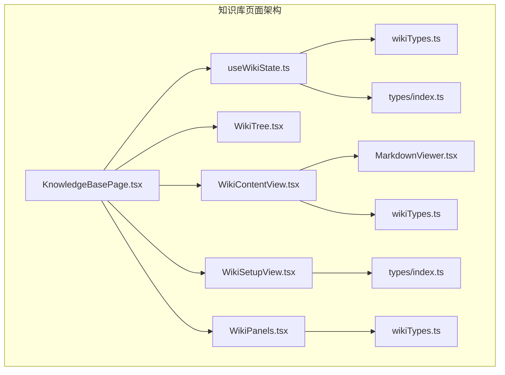
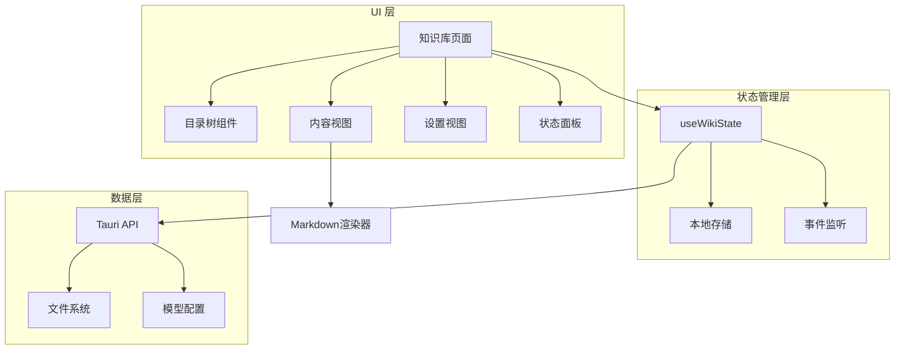
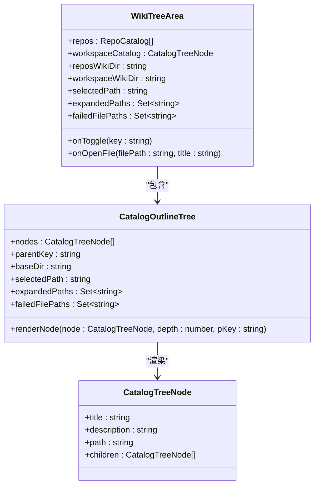
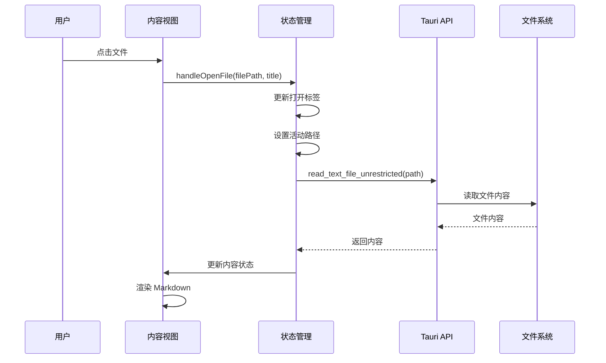
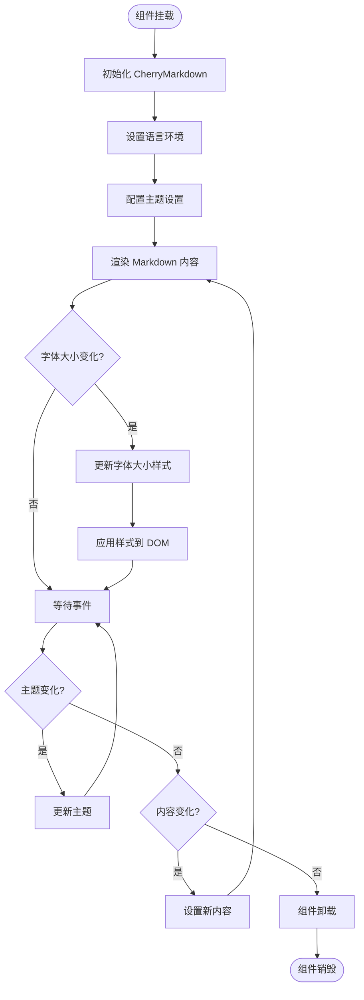
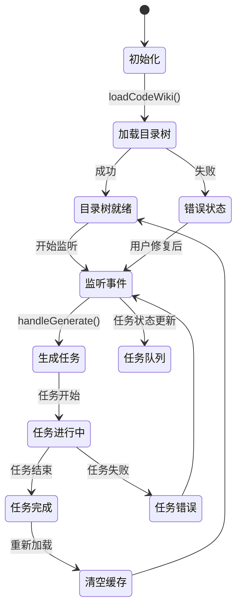

# 知识库页面

<cite>
**本文档引用的文件**
- [KnowledgeBasePage.tsx](file://src/components/KnowledgeBasePage.tsx)
- [useWikiState.ts](file://src/components/wiki/useWikiState.ts)
- [WikiTree.tsx](file://src/components/wiki/WikiTree.tsx)
- [WikiContentView.tsx](file://src/components/wiki/WikiContentView.tsx)
- [WikiSetupView.tsx](file://src/components/wiki/WikiSetupView.tsx)
- [WikiPanels.tsx](file://src/components/wiki/WikiPanels.tsx)
- [MarkdownViewer.tsx](file://src/components/wiki/MarkdownViewer.tsx)
- [wikiTypes.ts](file://src/components/wiki/wikiTypes.ts)
- [types/index.ts](file://src/types/index.ts)
- [App.tsx](file://src/App.tsx)
- [zh.ts](file://src/i18n/locales/zh.ts)
- [en.ts](file://src/i18n/locales/en.ts)
</cite>

## 目录
1. [简介](#简介)
2. [项目结构](#项目结构)
3. [核心组件](#核心组件)
4. [架构概览](#架构概览)
5. [详细组件分析](#详细组件分析)
6. [依赖关系分析](#依赖关系分析)
7. [性能考虑](#性能考虑)
8. [故障排除指南](#故障排除指南)
9. [结论](#结论)

## 简介

知识库页面是 RabbitCoding 应用中的核心功能模块，提供代码知识库的生成、管理和浏览能力。该页面集成了 AI 生成、文件树导航、多标签页内容浏览、任务队列管理等功能，为开发者提供完整的代码知识库解决方案。

## 项目结构

知识库页面采用模块化设计，主要包含以下核心文件：



**图表来源**
- [KnowledgeBasePage.tsx:1-243](file://src/components/KnowledgeBasePage.tsx#L1-L243)
- [useWikiState.ts:1-463](file://src/components/wiki/useWikiState.ts#L1-L463)

**章节来源**
- [KnowledgeBasePage.tsx:1-243](file://src/components/KnowledgeBasePage.tsx#L1-L243)
- [useWikiState.ts:1-463](file://src/components/wiki/useWikiState.ts#L1-L463)

## 核心组件

### 知识库页面主组件

KnowledgeBasePage 是整个知识库功能的入口组件，负责协调各个子组件的工作。

**主要功能特性：**
- 多标签页管理（代码知识库、闪卡、记忆）
- 动态内容渲染
- 任务状态管理
- 错误处理机制

**章节来源**
- [KnowledgeBasePage.tsx:15-242](file://src/components/KnowledgeBasePage.tsx#L15-L242)

### 状态管理钩子

useWikiState 提供了完整的状态管理逻辑，包括：

**核心状态管理：**
- 目录树数据管理
- 文件内容缓存
- 任务队列状态
- 生成进度跟踪
- 失败文档处理

**章节来源**
- [useWikiState.ts:21-460](file://src/components/wiki/useWikiState.ts#L21-L460)

## 架构概览

知识库页面采用分层架构设计，确保各组件职责清晰分离：



**图表来源**
- [App.tsx:33-148](file://src/App.tsx#L33-L148)
- [useWikiState.ts:1-463](file://src/components/wiki/useWikiState.ts#L1-L463)

## 详细组件分析

### 目录树组件分析

WikiTree 组件负责渲染代码知识库的层次结构：



**图表来源**
- [WikiTree.tsx:101-171](file://src/components/wiki/WikiTree.tsx#L101-L171)
- [wikiTypes.ts:36-53](file://src/components/wiki/wikiTypes.ts#L36-L53)

**章节来源**
- [WikiTree.tsx:17-171](file://src/components/wiki/WikiTree.tsx#L17-L171)

### 内容视图组件分析

WikiContentView 提供 Markdown 文档的渲染和交互功能：



**图表来源**
- [WikiContentView.tsx:41-227](file://src/components/wiki/WikiContentView.tsx#L41-L227)
- [useWikiState.ts:396-419](file://src/components/wiki/useWikiState.ts#L396-L419)

**章节来源**
- [WikiContentView.tsx:41-227](file://src/components/wiki/WikiContentView.tsx#L41-L227)

### Markdown 渲染器分析

MarkdownViewer 组件基于 CherryMarkdown 提供专业的 Markdown 渲染能力：



**图表来源**
- [MarkdownViewer.tsx:68-209](file://src/components/wiki/MarkdownViewer.tsx#L68-L209)

**章节来源**
- [MarkdownViewer.tsx:68-209](file://src/components/wiki/MarkdownViewer.tsx#L68-L209)

### 状态管理流程分析

useWikiState 提供了完整的状态管理生命周期：



**图表来源**
- [useWikiState.ts:323-394](file://src/components/wiki/useWikiState.ts#L323-L394)

**章节来源**
- [useWikiState.ts:323-394](file://src/components/wiki/useWikiState.ts#L323-L394)

## 依赖关系分析

知识库页面的依赖关系呈现清晰的分层结构：

```mermaid
graph LR
subgraph "外部依赖"
Tauri[@tauri-apps/api]
Cherry[cherry-markdown]
ECharts[echarts]
Lucide[lucide-react]
end
subgraph "内部模块"
KB[KnowledgeBasePage]
State[useWikiState]
Tree[WikiTree]
Content[WikiContentView]
Setup[WikiSetupView]
Panels[WikiPanels]
MD[MarkdownViewer]
end
subgraph "类型定义"
Types[wikiTypes]
AppTypes[types/index]
I18n[i18n/locales]
end
KB --> State
State --> Types
State --> AppTypes
State --> I18n
Tree --> Types
Content --> Types
Setup --> AppTypes
Panels --> Types
Content --> MD
MD --> Cherry
MD --> ECharts
KB --> Lucide
Tree --> Lucide
Content --> Lucide
Panels --> Lucide
Setup --> Lucide
```

**图表来源**
- [KnowledgeBasePage.tsx:1-10](file://src/components/KnowledgeBasePage.tsx#L1-L10)
- [MarkdownViewer.tsx:8-13](file://src/components/wiki/MarkdownViewer.tsx#L8-L13)

**章节来源**
- [KnowledgeBasePage.tsx:1-10](file://src/components/KnowledgeBasePage.tsx#L1-L10)
- [MarkdownViewer.tsx:8-13](file://src/components/wiki/MarkdownViewer.tsx#L8-L13)

## 性能考虑

知识库页面在设计时充分考虑了性能优化：

### 内存管理
- 文件内容采用按需加载策略，避免一次性加载所有文档
- 使用 Map 数据结构快速查找失败文档路径
- 组件卸载时自动清理 DOM 和事件监听器

### 渲染优化
- Markdown 渲染器使用虚拟滚动技术
- 字体大小变化时采用批量样式更新
- 图表渲染使用懒加载机制

### 网络优化
- 任务队列采用去重机制
- 失败重试采用指数退避算法
- 缓存策略避免重复请求

## 故障排除指南

### 常见问题及解决方案

**问题1：知识库生成失败**
- 检查模型配置是否正确
- 查看任务队列状态
- 检查网络连接状态

**问题2：文件内容无法加载**
- 确认文件权限设置
- 检查文件编码格式
- 验证文件路径有效性

**问题3：界面显示异常**
- 清除浏览器缓存
- 检查主题设置
- 重启应用进程

**章节来源**
- [WikiPanels.tsx:98-137](file://src/components/wiki/WikiPanels.tsx#L98-L137)
- [useWikiState.ts:184-203](file://src/components/wiki/useWikiState.ts#L184-L203)

## 结论

知识库页面是一个功能完整、架构清晰的知识管理系统。通过模块化的组件设计、完善的错误处理机制和性能优化策略，为用户提供了优秀的代码知识库体验。该页面不仅满足了基本的文档浏览需求，还提供了强大的 AI 生成能力和灵活的任务管理功能，是现代开发工具的重要组成部分。