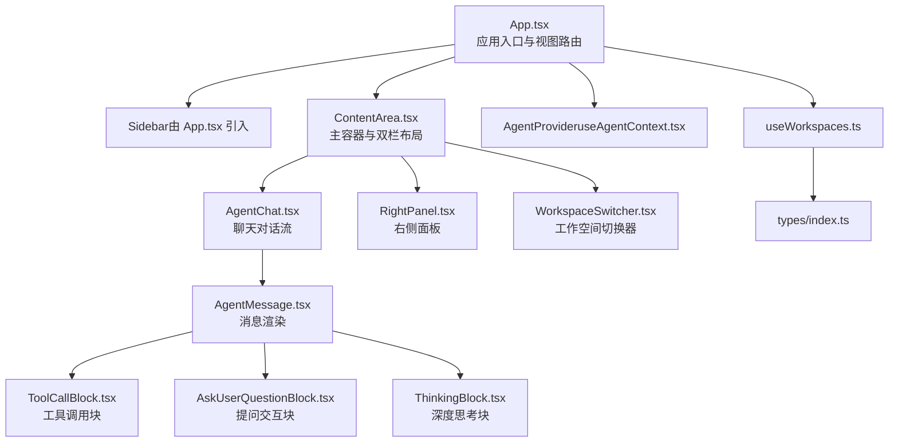
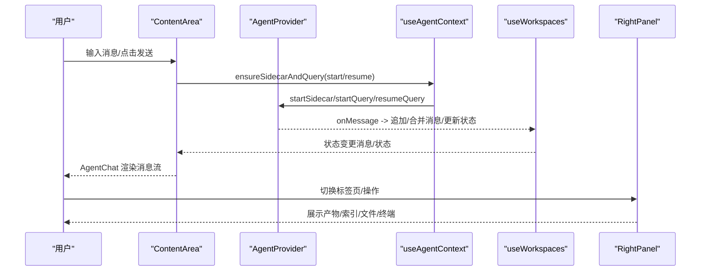
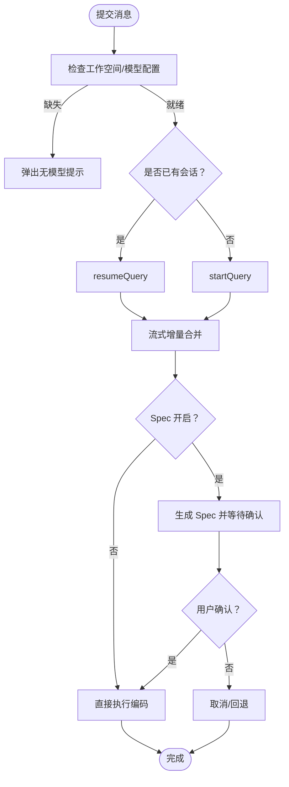
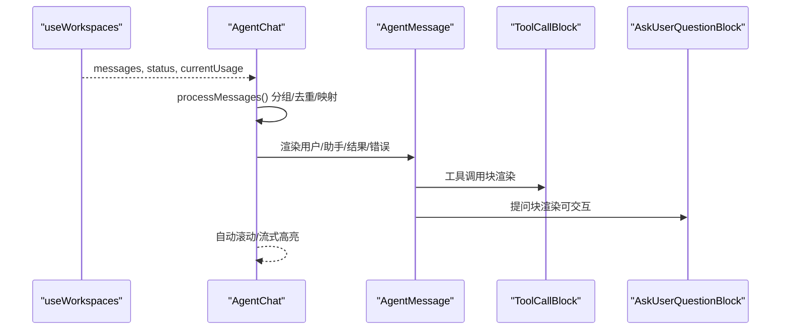
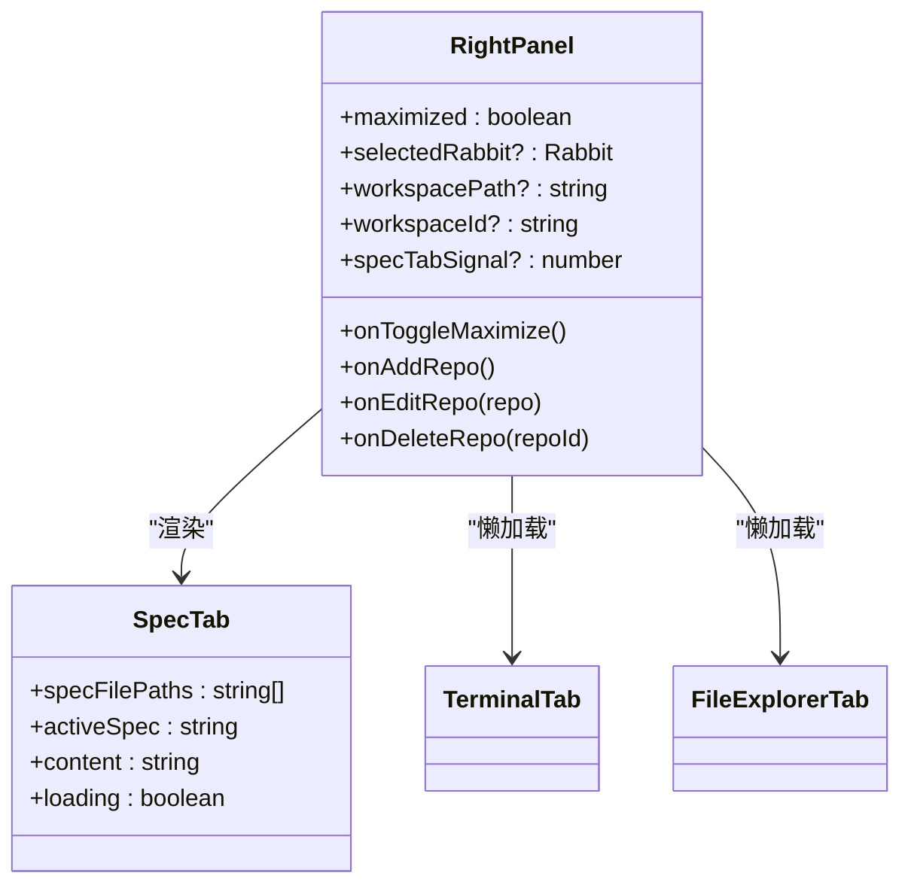
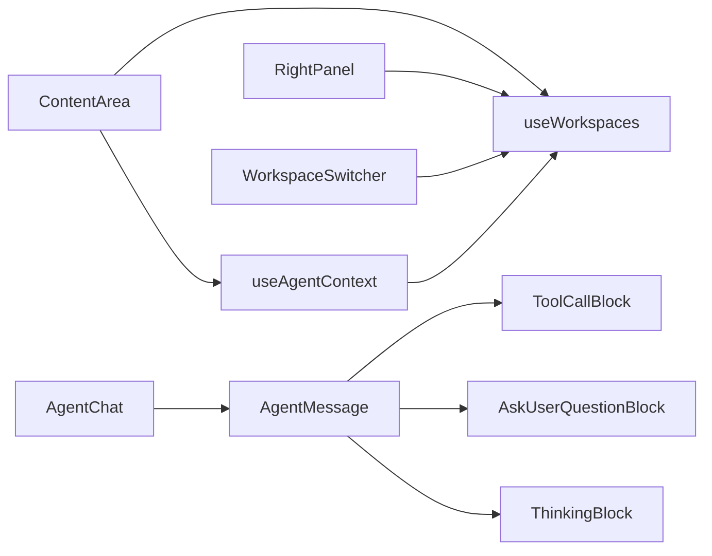

# 组件架构

<cite>
**本文引用的文件**
- [App.tsx](file://src/App.tsx)
- [ContentArea.tsx](file://src/components/ContentArea.tsx)
- [AgentChat.tsx](file://src/components/agent/AgentChat.tsx)
- [RightPanel.tsx](file://src/components/RightPanel.tsx)
- [WorkspaceSwitcher.tsx](file://src/components/common/WorkspaceSwitcher.tsx)
- [AgentMessage.tsx](file://src/components/agent/AgentMessage.tsx)
- [AskUserQuestionBlock.tsx](file://src/components/agent/AskUserQuestionBlock.tsx)
- [ToolCallBlock.tsx](file://src/components/agent/ToolCallBlock.tsx)
- [ThinkingBlock.tsx](file://src/components/agent/ThinkingBlock.tsx)
- [useAgentContext.tsx](file://src/hooks/useAgentContext.tsx)
- [useWorkspaces.ts](file://src/hooks/useWorkspaces.ts)
- [types/index.ts](file://src/types/index.ts)
</cite>

## 目录
1. [简介](#简介)
2. [项目结构](#项目结构)
3. [核心组件](#核心组件)
4. [架构总览](#架构总览)
5. [组件详解](#组件详解)
6. [依赖关系分析](#依赖关系分析)
7. [性能考量](#性能考量)
8. [故障排查指南](#故障排查指南)
9. [结论](#结论)

## 简介
本文件系统性梳理 RabbitCoding 的 React 组件架构，重点围绕 ContentArea 主容器的设计理念与职责划分，深入解析 AgentChat 聊天组件、RightPanel 右侧面板、WorkspaceSwitcher 工作空间切换器等关键模块。文档阐述组件间通信机制、props 传递模式与事件处理流程，总结组件复用策略、条件渲染与动态加载实践，并给出性能优化建议与最佳实践。

## 项目结构
应用采用“页面级容器 + 功能域组件”的组织方式：
- 页面入口与视图路由：App.tsx
- 主容器与双栏布局：ContentArea.tsx
- 聊天对话流：AgentChat.tsx 及其子块组件
- 右侧面板：RightPanel.tsx
- 工作空间切换器：WorkspaceSwitcher.tsx
- 数据与状态：useWorkspaces.ts（工作区/兔兔/消息持久化）、useAgentContext.tsx（Agent 会话上下文）
- 类型定义：types/index.ts

图表来源
- [App.tsx:29-98](file://src/App.tsx#L29-L98)
- [ContentArea.tsx:30-667](file://src/components/ContentArea.tsx#L30-L667)
- [AgentChat.tsx:87-214](file://src/components/agent/AgentChat.tsx#L87-L214)
- [RightPanel.tsx:220-739](file://src/components/RightPanel.tsx#L220-L739)
- [WorkspaceSwitcher.tsx:12-124](file://src/components/common/WorkspaceSwitcher.tsx#L12-L124)
- [AgentMessage.tsx:43-197](file://src/components/agent/AgentMessage.tsx#L43-L197)
- [ToolCallBlock.tsx:135-200](file://src/components/agent/ToolCallBlock.tsx#L135-L200)
- [AskUserQuestionBlock.tsx:21-138](file://src/components/agent/AskUserQuestionBlock.tsx#L21-L138)
- [ThinkingBlock.tsx:22-84](file://src/components/agent/ThinkingBlock.tsx#L22-L84)
- [useAgentContext.tsx:88-284](file://src/hooks/useAgentContext.tsx#L88-L284)
- [useWorkspaces.ts:28-540](file://src/hooks/useWorkspaces.ts#L28-L540)
- [types/index.ts:8-285](file://src/types/index.ts#L8-L285)

章节来源
- [App.tsx:29-98](file://src/App.tsx#L29-L98)
- [ContentArea.tsx:30-667](file://src/components/ContentArea.tsx#L30-L667)

## 核心组件
- ContentArea：主容器，负责双栏布局、右侧面板可见性与宽度控制、模型选择、API Key 管理、代理环境注入、Spec 生成与确认、Agent 查询生命周期管理、取消与压缩等。
- AgentChat：渲染单个 Rabbit 的完整对话流，处理消息分组、流式增量合并、自动滚动、AskUserQuestion 交互、压缩状态提示等。
- RightPanel：右侧信息面板，聚合“摘要/终端/文件/Spec”等标签页，动态提取工具调用与文件变更、引用、进度、产物、索引状态等信息。
- WorkspaceSwitcher：工作空间选择器，支持搜索与下拉切换。
- AgentMessage/ToolCallBlock/AskUserQuestionBlock/ThinkingBlock：消息渲染与交互子组件，分别处理不同消息类型的展示与交互。

章节来源
- [ContentArea.tsx:30-667](file://src/components/ContentArea.tsx#L30-L667)
- [AgentChat.tsx:87-214](file://src/components/agent/AgentChat.tsx#L87-L214)
- [RightPanel.tsx:220-739](file://src/components/RightPanel.tsx#L220-L739)
- [WorkspaceSwitcher.tsx:12-124](file://src/components/common/WorkspaceSwitcher.tsx#L12-L124)
- [AgentMessage.tsx:43-197](file://src/components/agent/AgentMessage.tsx#L43-L197)
- [ToolCallBlock.tsx:135-200](file://src/components/agent/ToolCallBlock.tsx#L135-L200)
- [AskUserQuestionBlock.tsx:21-138](file://src/components/agent/AskUserQuestionBlock.tsx#L21-L138)
- [ThinkingBlock.tsx:22-84](file://src/components/agent/ThinkingBlock.tsx#L22-L84)

## 架构总览
整体采用“Provider + Hook + 组件树”的分层设计：
- App.tsx 作为顶层容器，注入主题、国际化、认证、AgentProvider、CodebaseIndexProvider 等上下文。
- ContentArea 作为主容器，协调左侧聊天与右侧面板，承载查询发起、流式消息接收、状态更新与 UI 控制。
- useAgentContext.tsx 将 Agent 侧消息监听与回调提升至 App 层，保证页面切换不丢失消息流。
- useWorkspaces.ts 提供工作区/兔兔/消息的持久化与状态更新能力，配合本地存储与数据库双轨落盘。

图表来源
- [App.tsx:66-94](file://src/App.tsx#L66-L94)
- [ContentArea.tsx:97-169](file://src/components/ContentArea.tsx#L97-L169)
- [useAgentContext.tsx:88-193](file://src/hooks/useAgentContext.tsx#L88-L193)
- [useWorkspaces.ts:379-449](file://src/hooks/useWorkspaces.ts#L379-L449)
- [RightPanel.tsx:220-739](file://src/components/RightPanel.tsx#L220-L739)

## 组件详解

### ContentArea：主容器设计理念与职责
- 设计理念
  - 双栏布局：左侧聊天区 + 右侧信息区，支持拖拽调整宽度、最大化与隐藏。
  - 状态驱动：通过 useWorkspaces 的状态与回调，统一管理 Rabbit 的消息、状态、上下文占用、压缩阶段等。
  - 代理与模型：集中处理 API Key、模型配置、代理环境变量注入，确保 sidecar 启动一致性。
  - Spec 优先：支持先生成 Spec，用户确认后再执行编码，提升质量与可控性。
- 关键职责
  - 代理与 sidecar 生命周期管理：启动/停止/重启、指纹校验、错误收敛。
  - 查询发起与恢复：根据是否已有会话决定 startQuery 或 resumeQuery。
  - 流式消息处理：将增量文本/思考合并到末尾消息，处理 AskUserQuestion 交互。
  - UI 控制：发送按钮配色、输入框 placeholder、取消与压缩按钮、无模型提示弹窗。
  - 右侧面板联动：打开/关闭、最大化、Spec 标签页切换信号。

图表来源
- [ContentArea.tsx:255-384](file://src/components/ContentArea.tsx#L255-L384)
- [ContentArea.tsx:197-225](file://src/components/ContentArea.tsx#L197-L225)
- [ContentArea.tsx:97-169](file://src/components/ContentArea.tsx#L97-L169)

章节来源
- [ContentArea.tsx:30-667](file://src/components/ContentArea.tsx#L30-L667)

### AgentChat：聊天对话流渲染
- 功能定位
  - 将 Rabbit 的消息列表转换为“用户消息 + 组内助手消息”的结构，支持 tool_use ↔ tool_result 关联。
  - 自动滚动至底部，流式文本/思考增量渲染，支持压缩状态与运行中指示。
- 处理逻辑
  - 预处理：构建 tool_result 映射、过滤重复 result、按用户消息分组。
  - 渲染：sticky 用户消息吸附，流式消息高亮，最后一条消息标记为 streaming。
  - 交互：支持 AskUserQuestion 的 Spec 确认回调。

图表来源
- [AgentChat.tsx:38-85](file://src/components/agent/AgentChat.tsx#L38-L85)
- [AgentChat.tsx:87-214](file://src/components/agent/AgentChat.tsx#L87-L214)
- [AgentMessage.tsx:43-197](file://src/components/agent/AgentMessage.tsx#L43-L197)
- [ToolCallBlock.tsx:135-200](file://src/components/agent/ToolCallBlock.tsx#L135-L200)
- [AskUserQuestionBlock.tsx:21-138](file://src/components/agent/AskUserQuestionBlock.tsx#L21-L138)

章节来源
- [AgentChat.tsx:87-214](file://src/components/agent/AgentChat.tsx#L87-L214)
- [AgentMessage.tsx:43-197](file://src/components/agent/AgentMessage.tsx#L43-L197)

### RightPanel：右侧面板与信息聚合
- 功能定位
  - “摘要/终端/文件/Spec”四标签页，按需展示与懒加载。
  - 动态提取工具调用序列，计算文件变更，汇总引用与进度。
  - 代码库索引状态可视化，支持一键触发索引。
- 关键特性
  - 懒加载：TerminalTab、FileExplorerTab 使用 React.lazy + Suspense。
  - 条目折叠：摘要/产物/引用/仓库/索引状态分组折叠。
  - 交互：添加/编辑/删除仓库，批量触发索引。

图表来源
- [RightPanel.tsx:208-218](file://src/components/RightPanel.tsx#L208-L218)
- [RightPanel.tsx:112-206](file://src/components/RightPanel.tsx#L112-L206)
- [RightPanel.tsx:34-35](file://src/components/RightPanel.tsx#L34-L35)
- [RightPanel.tsx:34-35](file://src/components/RightPanel.tsx#L34-L35)

章节来源
- [RightPanel.tsx:220-739](file://src/components/RightPanel.tsx#L220-L739)

### WorkspaceSwitcher：工作空间切换器
- 功能定位
  - 下拉选择工作空间，支持搜索过滤，点击外部关闭。
- 交互要点
  - 点击触发下拉，自动聚焦搜索框。
  - 选择后关闭下拉并清空搜索。

章节来源
- [WorkspaceSwitcher.tsx:12-124](file://src/components/common/WorkspaceSwitcher.tsx#L12-L124)

### AgentMessage/ToolCallBlock/AskUserQuestionBlock/ThinkingBlock：消息与交互子组件
- AgentMessage：根据消息类型渲染不同块，支持流式文本、思考、工具调用、结果、错误、Spec 确认、AskUserQuestion 等。
- ToolCallBlock：工具图标映射、输入摘要、结果展示、文件变更统计、Task 工具委托。
- AskUserQuestionBlock：多选/单选、自由文本、只读态、提交/取消。
- ThinkingBlock：可折叠深度思考，流式实时计时与精确时长切换。

章节来源
- [AgentMessage.tsx:43-197](file://src/components/agent/AgentMessage.tsx#L43-L197)
- [ToolCallBlock.tsx:135-200](file://src/components/agent/ToolCallBlock.tsx#L135-L200)
- [AskUserQuestionBlock.tsx:21-138](file://src/components/agent/AskUserQuestionBlock.tsx#L21-L138)
- [ThinkingBlock.tsx:22-84](file://src/components/agent/ThinkingBlock.tsx#L22-L84)

## 依赖关系分析
- 组件耦合
  - ContentArea 依赖 useAgentContext 与 useWorkspaces，承担“编排者”角色。
  - AgentChat 依赖 useWorkspaces 的消息与状态，依赖 AgentMessage 子组件。
  - RightPanel 依赖 useWorkspaces 的消息与索引状态，依赖懒加载子组件。
  - WorkspaceSwitcher 仅依赖 useWorkspaces 的工作空间列表与选择回调。
- 外部依赖
  - @tauri-apps/api 用于调用 Rust 命令（如 ensure_rabbit_specs_dir、read_text_file_unrestricted 等）。
  - @ant-design/x 与 @ant-design/x-markdown 用于富文本渲染。
  - lucide-react 图标库。
- 数据流
  - AgentProvider 的 onMessage 将 sidecar 消息转化为 useWorkspaces 的状态更新，再驱动 UI 重新渲染。

图表来源
- [ContentArea.tsx:91-91](file://src/components/ContentArea.tsx#L91-L91)
- [useAgentContext.tsx:88-193](file://src/hooks/useAgentContext.tsx#L88-L193)
- [useWorkspaces.ts:379-449](file://src/hooks/useWorkspaces.ts#L379-L449)
- [AgentChat.tsx:87-214](file://src/components/agent/AgentChat.tsx#L87-L214)
- [AgentMessage.tsx:43-197](file://src/components/agent/AgentMessage.tsx#L43-L197)
- [RightPanel.tsx:220-739](file://src/components/RightPanel.tsx#L220-L739)
- [WorkspaceSwitcher.tsx:12-124](file://src/components/common/WorkspaceSwitcher.tsx#L12-L124)

章节来源
- [useAgentContext.tsx:88-284](file://src/hooks/useAgentContext.tsx#L88-L284)
- [useWorkspaces.ts:28-540](file://src/hooks/useWorkspaces.ts#L28-L540)
- [types/index.ts:8-285](file://src/types/index.ts#L8-L285)

## 性能考量
- 渲染优化
  - AgentChat 使用 useMemo 预处理消息分组，减少不必要的重渲染。
  - AgentMessage 使用 memo 包裹，避免相同消息重复渲染。
  - 右侧面板使用 React.lazy + Suspense，仅在激活标签页时加载终端与文件浏览。
- 状态更新
  - useWorkspaces 的消息追加与增量合并采用不可变更新，避免深层拷贝成本。
  - 通过“流式增量合并”减少 DOM 重排与滚动计算。
- I/O 与网络
  - 代理指纹校验与 sidecar 重启策略，避免频繁重启带来的冷启动开销。
  - 右侧面板的文件读取通过自定义 Rust 命令绕过 fs 作用域限制，减少权限检查成本。
- 存储与持久化
  - useWorkspaces 采用双轨保存：SQLite + localStorage，500ms 防抖 + 3s 强制保存，兼顾实时性与性能。

章节来源
- [AgentChat.tsx:95-130](file://src/components/agent/AgentChat.tsx#L95-L130)
- [AgentMessage.tsx:197-197](file://src/components/agent/AgentMessage.tsx#L197-L197)
- [RightPanel.tsx:34-35](file://src/components/RightPanel.tsx#L34-L35)
- [useWorkspaces.ts:101-129](file://src/hooks/useWorkspaces.ts#L101-L129)

## 故障排查指南
- 代理配置变更导致 sidecar 重启
  - 现象：代理指纹变化后 sidecar 被停止并重启。
  - 处理：确认代理配置正确，等待 sidecar 启动完成再发起查询。
- API Key 缺失
  - 现象：弹出 API Key 输入弹窗，pending 查询被缓存。
  - 处理：保存 API Key 后自动启动 sidecar 并恢复查询。
- 查询超时或 sidecar 异常退出
  - 现象：UI 永远处于 running 状态或报错。
  - 处理：AgentProvider 的兜底逻辑会将所有 running 的 Rabbit 收敛为 error，检查日志与网络。
- AskUserQuestion 无效
  - 现象：提问块显示“已失效”，无法提交。
  - 处理：会话重启后上下文丢失，需重新发起查询。

章节来源
- [ContentArea.tsx:127-169](file://src/components/ContentArea.tsx#L127-L169)
- [useAgentContext.tsx:180-192](file://src/hooks/useAgentContext.tsx#L180-L192)
- [AskUserQuestionBlock.tsx:33-36](file://src/components/agent/AskUserQuestionBlock.tsx#L33-L36)

## 结论
RabbitCoding 的组件架构以 ContentArea 为核心，通过 Provider/Context 与 Hook 解耦数据与 UI，形成清晰的“消息驱动 + 状态收敛”的渲染管线。AgentChat 与 RightPanel 分别承担对话流与信息聚合两大职责，配合 WorkspaceSwitcher 与各类消息子组件，实现了高质量的交互体验与可维护性。建议在扩展新功能时遵循现有模式：将业务逻辑下沉到 Hook，将渲染逻辑集中在组件，保持 props 传递简洁与事件回调可控，以获得更好的可测试性与性能表现。