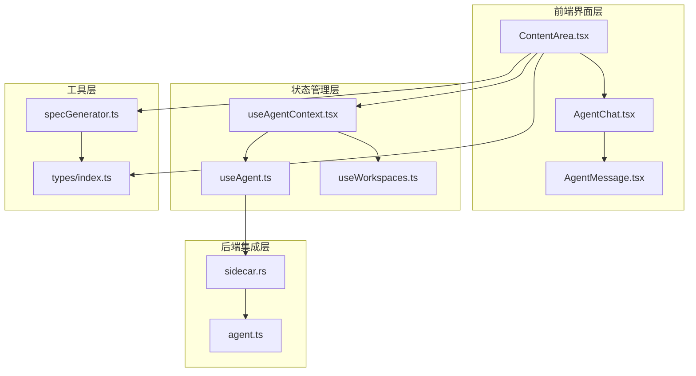
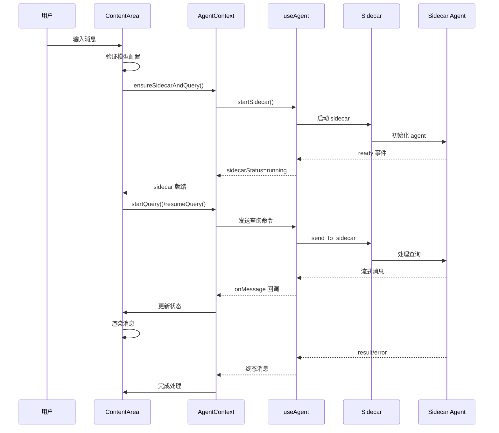
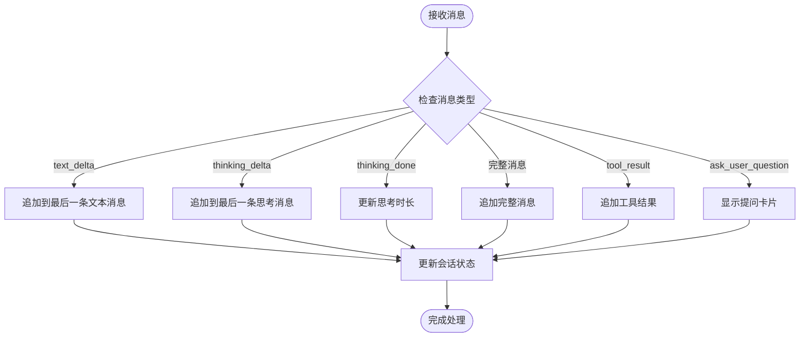
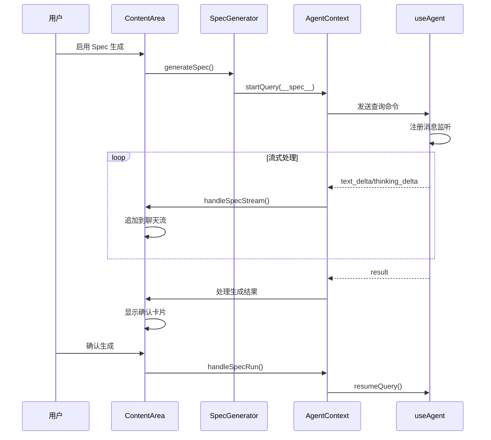
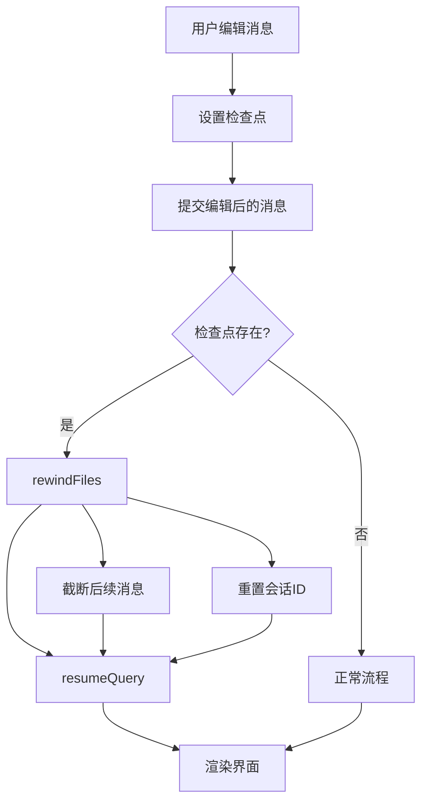
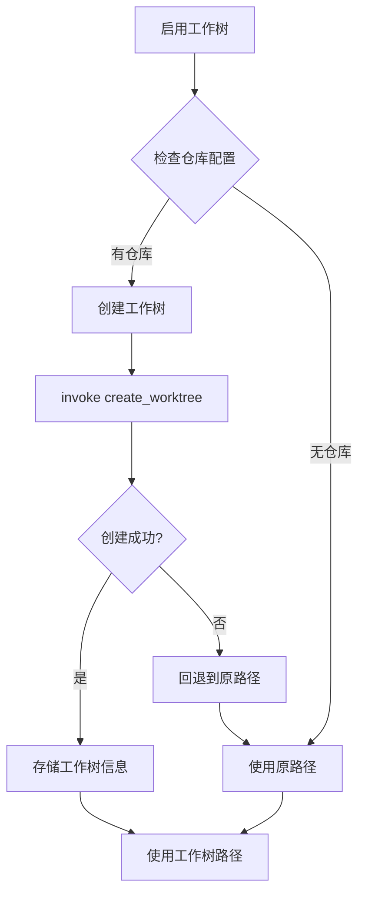
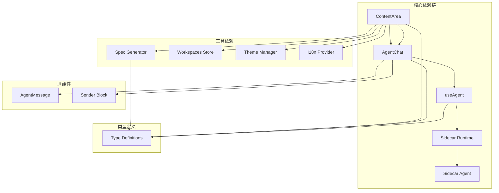
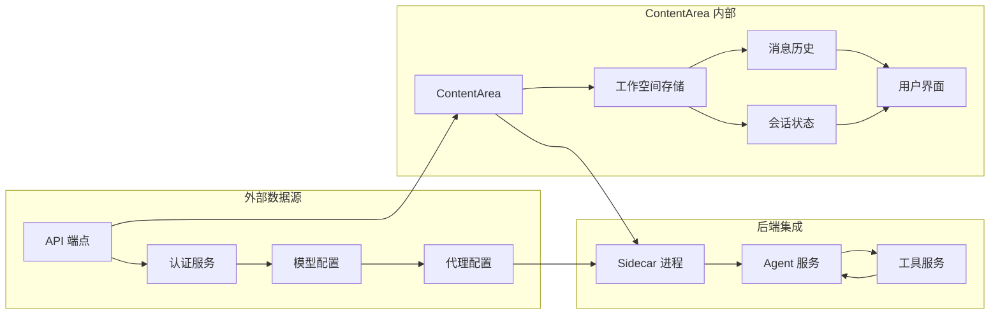
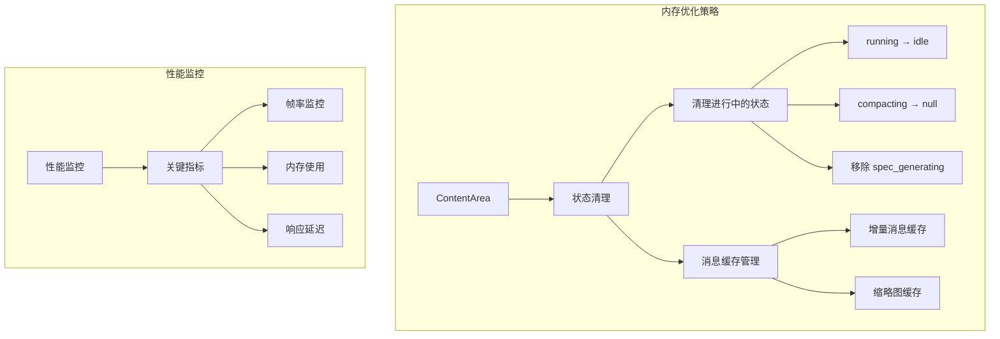
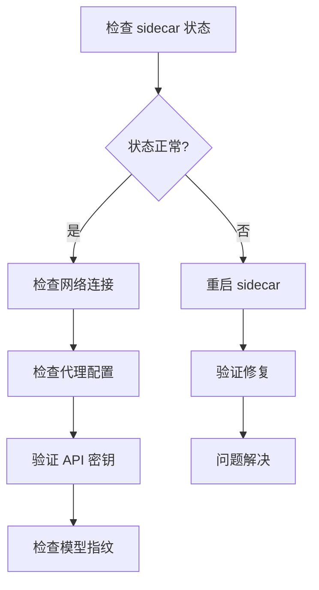

# ContentArea对话流程管理

<cite>
**本文档引用的文件**
- [ContentArea.tsx](file://src/components/ContentArea.tsx)
- [AgentChat.tsx](file://src/components/agent/AgentChat.tsx)
- [useAgentContext.tsx](file://src/hooks/useAgentContext.tsx)
- [useAgent.ts](file://src/hooks/useAgent.ts)
- [types/index.ts](file://src/types/index.ts)
- [specGenerator.ts](file://src/utils/specGenerator.ts)
- [agent.ts](file://sidecar/src/agent.ts)
- [sidecar.rs](file://src-tauri/src/sidecar.rs)
</cite>

## 目录
1. [简介](#简介)
2. [项目结构](#项目结构)
3. [核心组件](#核心组件)
4. [架构概览](#架构概览)
5. [详细组件分析](#详细组件分析)
6. [依赖关系分析](#依赖关系分析)
7. [性能考虑](#性能考虑)
8. [故障排除指南](#故障排除指南)
9. [结论](#结论)

## 简介

ContentArea 是 RabbitCoding 应用中的核心对话管理组件，负责处理用户与 AI 智能体之间的完整对话流程。该组件实现了复杂的对话状态管理、消息流处理、会话恢复、Spec 文档生成以及工作树隔离等功能。本文档深入分析了 ContentArea 的对话流程管理机制，包括消息传递、状态转换、错误处理和性能优化策略。

## 项目结构

ContentArea 对话流程管理系统采用模块化架构设计，主要包含以下关键模块：

**图表来源**
- [ContentArea.tsx:1-1115](file://src/components/ContentArea.tsx#L1-L1115)
- [AgentChat.tsx:1-330](file://src/components/agent/AgentChat.tsx#L1-L330)
- [useAgentContext.tsx:1-338](file://src/hooks/useAgentContext.tsx#L1-L338)

## 核心组件

### ContentArea 组件

ContentArea 是对话流程的核心协调者，负责：

1. **消息路由管理**：处理用户输入、AI 响应和系统消息
2. **会话生命周期管理**：创建、恢复和终止对话会话
3. **状态同步**：维护本地状态与后端状态的一致性
4. **错误处理**：提供完善的错误恢复和用户反馈机制

### AgentChat 组件

AgentChat 专注于对话界面渲染，提供：

1. **消息分组**：将相关的用户消息和 AI 响应组织成逻辑组
2. **流式渲染**：支持实时文本和思考过程的流式显示
3. **交互功能**：支持消息编辑、复制和工具调用展示
4. **自动滚动**：智能跟踪用户关注的最新消息

### AgentProvider 上下文

AgentProvider 提供全局的 Agent 服务访问，包括：

1. **消息监听**：统一处理来自后端的所有消息事件
2. **状态管理**：维护会话状态和消息历史
3. **错误恢复**：处理后端异常和连接中断
4. **查询管理**：封装启动、恢复和取消查询的操作

**章节来源**
- [ContentArea.tsx:37-1115](file://src/components/ContentArea.tsx#L37-L1115)
- [AgentChat.tsx:102-330](file://src/components/agent/AgentChat.tsx#L102-L330)
- [useAgentContext.tsx:96-338](file://src/hooks/useAgentContext.tsx#L96-L338)

## 架构概览

ContentArea 对话流程管理采用分层架构，实现了清晰的关注点分离：

**图表来源**
- [ContentArea.tsx:258-363](file://src/components/ContentArea.tsx#L258-L363)
- [useAgentContext.tsx:100-221](file://src/hooks/useAgentContext.tsx#L100-L221)
- [useAgent.ts:287-342](file://src/hooks/useAgent.ts#L287-L342)

## 详细组件分析

### 消息流处理机制

ContentArea 实现了复杂的消息流处理机制，支持多种消息类型的差异化处理：

#### 流式文本处理

**图表来源**
- [ContentArea.tsx:431-453](file://src/components/ContentArea.tsx#L431-L453)
- [useAgentContext.tsx:121-136](file://src/hooks/useAgentContext.tsx#L121-L136)

#### 会话状态管理

ContentArea 维护了丰富的会话状态信息：

| 状态类型 | 描述 | 触发条件 |
|---------|------|----------|
| `idle` | 空闲状态 | 会话未激活或已完成 | 
| `running` | 运行中 | 正在处理查询或生成响应 |
| `completed` | 已完成 | 查询成功结束 |
| `error` | 错误状态 | 查询失败或异常 |

**章节来源**
- [ContentArea.tsx:482-658](file://src/components/ContentArea.tsx#L482-L658)
- [types/index.ts:58-77](file://src/types/index.ts#L58-L77)

### Spec 文档生成流程

ContentArea 实现了完整的 Spec 文档生成和管理流程：

**图表来源**
- [ContentArea.tsx:397-422](file://src/components/ContentArea.tsx#L397-L422)
- [specGenerator.ts:142-171](file://src/utils/specGenerator.ts#L142-L171)

### 会话恢复和检查点机制

ContentArea 支持强大的会话恢复功能，通过检查点机制实现精确的消息重放：

#### 检查点重放流程

**图表来源**
- [ContentArea.tsx:494-507](file://src/components/ContentArea.tsx#L494-L507)
- [useAgentContext.tsx:299-308](file://src/hooks/useAgentContext.tsx#L299-L308)

**章节来源**
- [ContentArea.tsx:492-507](file://src/components/ContentArea.tsx#L492-L507)
- [useAgentContext.tsx:186-198](file://src/hooks/useAgentContext.tsx#L186-L198)

### 工作树隔离机制

ContentArea 支持工作树隔离功能，为每个会话创建独立的文件系统视图：

#### 工作树创建流程

**图表来源**
- [ContentArea.tsx:459-480](file://src/components/ContentArea.tsx#L459-L480)

**章节来源**
- [ContentArea.tsx:459-480](file://src/components/ContentArea.tsx#L459-L480)
- [types/index.ts:21-41](file://src/types/index.ts#L21-L41)

## 依赖关系分析

### 组件间依赖关系

**图表来源**
- [ContentArea.tsx:1-28](file://src/components/ContentArea.tsx#L1-L28)
- [useAgentContext.tsx:10-21](file://src/hooks/useAgentContext.tsx#L10-L21)

### 数据流依赖

ContentArea 的数据流遵循严格的单向数据流原则：

**图表来源**
- [ContentArea.tsx:51-107](file://src/components/ContentArea.tsx#L51-L107)
- [useAgentContext.tsx:100-221](file://src/hooks/useAgentContext.tsx#L100-L221)

**章节来源**
- [ContentArea.tsx:1-1115](file://src/components/ContentArea.tsx#L1-L1115)
- [useAgentContext.tsx:1-338](file://src/hooks/useAgentContext.tsx#L1-L338)

## 性能考虑

### 流式渲染优化

ContentArea 实现了多项性能优化措施：

1. **消息分组渲染**：将相关的消息分组渲染，减少 DOM 操作
2. **虚拟滚动**：对于大量消息的历史记录，使用虚拟滚动技术
3. **增量更新**：只更新发生变化的消息块，而不是整个列表
4. **防抖机制**：对频繁的状态更新进行防抖处理

### 内存管理

**图表来源**
- [useWorkspaces.ts:14-26](file://src/hooks/useWorkspaces.ts#L14-L26)

### 并发处理

ContentArea 采用异步并发处理模式：

1. **查询并发**：支持多个并行的查询请求
2. **消息并发**：流式消息的异步处理
3. **文件操作并发**：工作树创建和文件回滚的并发处理
4. **UI 更新并发**：状态变化的异步 UI 更新

## 故障排除指南

### 常见问题诊断

#### Sidecar 连接问题

**症状**：会话状态长期停留在 `running`，无响应

**诊断步骤**：
1. 检查侧车进程状态
2. 查看网络连接和代理配置
3. 验证 API 密钥有效性
4. 检查模型配置指纹

**解决方案**：

#### 消息丢失问题

**症状**：部分消息未显示或显示不完整

**诊断方法**：
1. 检查消息监听器是否正确注册
2. 验证消息序列化和反序列化
3. 检查网络中断情况
4. 查看超时配置

**章节来源**
- [ContentArea.tsx:320-363](file://src/components/ContentArea.tsx#L320-L363)
- [useAgentContext.tsx:212-221](file://src/hooks/useAgentContext.tsx#L212-L221)

### 错误恢复机制

ContentArea 实现了多层次的错误恢复机制：

1. **自动重试**：网络错误时的自动重试机制
2. **状态回滚**：查询失败时的状态回滚
3. **会话恢复**：意外断开后的会话恢复
4. **数据一致性**：确保数据存储的一致性

**章节来源**
- [useAgentContext.tsx:233-240](file://src/hooks/useAgentContext.tsx#L233-L240)
- [useWorkspaces.ts:14-26](file://src/hooks/useWorkspaces.ts#L14-L26)

## 结论

ContentArea 对话流程管理系统展现了现代前端应用的复杂性和精密性。通过精心设计的架构和实现，该系统实现了：

1. **完整的对话生命周期管理**：从消息输入到结果展示的全流程自动化
2. **强大的状态管理能力**：支持会话恢复、检查点回放和并发处理
3. **灵活的扩展性**：模块化的组件设计便于功能扩展和维护
4. **优秀的用户体验**：流畅的交互和及时的反馈机制

该系统的成功在于其清晰的分层架构、完善的错误处理机制和高效的性能优化策略。通过合理的设计决策，ContentArea 为用户提供了稳定可靠的 AI 对话体验，同时为开发者提供了良好的扩展基础。